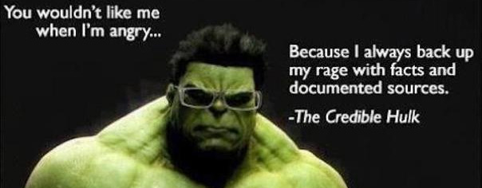
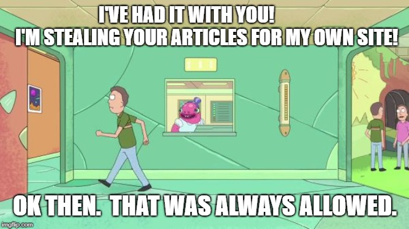

# About

## Why another Christian apologetics site?

<small>Image from XKCD</small>

The internet is full of Christian apologetics websites.  Why create yet another one?  The Berean Archive seeks to be an encyclopedia of Christian evidence, with unique features setting it apart from most other apologetics sites:

### 1.  Only one article per topic

This isn't a blog where you have to search multiple posts with redundant content to find what you need.  Each article is kept up to date and expanded as new information is found.  Like an encyclopedia.

### 2.  Summary at the beginning

We don't build anticipation and you don't care about useless, unrelated stories.  We won't waste your time--each article has a summary section at the beginning that includes all the major points in concise format.

### 3.  Clearly organized

The goal is to communicate as much information to you as quickly as possible.  Human vision has more bandwidth than any other sense, but long blocks of text are inefficient to visually process.  We use lots of headings, lists, tables, charts, and interactive calculators/simulators for readability and visual appeal.

### 4.  Scholarly approach, layman approachable

Our articles aim to be credible, comprehensive, and detailed. But in easy to understand langauge inasmuch that technical accuracy is not sacrificed. Articles use &lt;dfn&gt; tags to show definitions on hover, with expanded explanation in the sidebar when needed.

### 5.  Primarily argue from data

Quotes can be useful for understanding perspective or to describe data that was witnessed.  But we prefer to first argue from data points when available.

### 6.  Engaging EVERY critical argument

Because you don't want to take our material and start a debate only to be shot down by an argument you've never heard.  There may be arguments we've never encountered but we'll include all we can find, with a "TODO" placeholder if we haven't written a response.

### 7.  Intellectually honest

There's subjectivity here, but we don't intentionally omit contrary facts and don't use ambiguous language to make an argument appear stronger than it really is.

### 8.  Exhaustive, easily verified citations

Is that claim really true?  Does the source really say what we claim it does?  Who knows?  So we include links, page numbers, quotes, screenshots, archive.org mirrors, and so on.  And we use hostile sources when possible.  Because why trust a random site like us?

### 9.  Open source

The Berean Archive is run like an open source software project.  The whole site (all code and articles) is hosted on [GitHub](https://github.com/bereanarchive/bereanarchive) and we use pull requests to accept additions, improvements, and corrections.  See the [contributing guidelines](/articles/about/contribute) for details.

### 10.  Public Domain

All original content on the Berean Archive is placed under the [CC0 "Public Domain" license](https://creativecommons.org/about/cc0/) and is [published on GitHub](https://github.com/bereanarchive/bereanarchive).  This means you can take this article's code and content and do whatever you want with it.  If you're not happy with how we run things, you can even clone the entire website as your own and charge people to access it.  

Although that'd be silly because we already publish it for free.  Yet legally we'd have no recourse against you.  And you may run into trouble with other people if your use of third party stuff no longer falls under fair use.  

I am not a lawyer and this does not constitute legal advice.

## What's the scope of this site?

Topics in scope:  Philosophical arguments for God. Epistemology, teleological (design) arguments, evolution, common descent, age of the earth, ark logistics, Old and New Testament reliability, the problem of evil, slavery in the old testament, gospel reliability, the resurrection. Islam, Mormonism, The Trinity, Buddhism.  The efficacy of Christian ethics.  Abortion.  Basically any topic where Christian and non-Christian worldviews clash.

Topics out of scope:  Economic policy, foreign affairs, dealing with various spiritual/emotional issues, blog-ish posts, in-house Christian debates unrelated to apologetics.

## Who are you?

The Internet is a strange, dangerous, and permanent place.  I go by John Berea here, which is not my real name.  I run this website and serve as a benevelont dictator deciding what content is allowed.  That's all you need to know about me.

The goal is to have many other people [contribute](/articles/about/contribute) to this site.  What they reveal about themselves is up to them.

## Are you young earth?
This site doesn't take a position on the age of the earth.  I don't take a position.  We just present the data and see where it goes.  If you want to argue for one side or the other, talk with us and submit an article.

