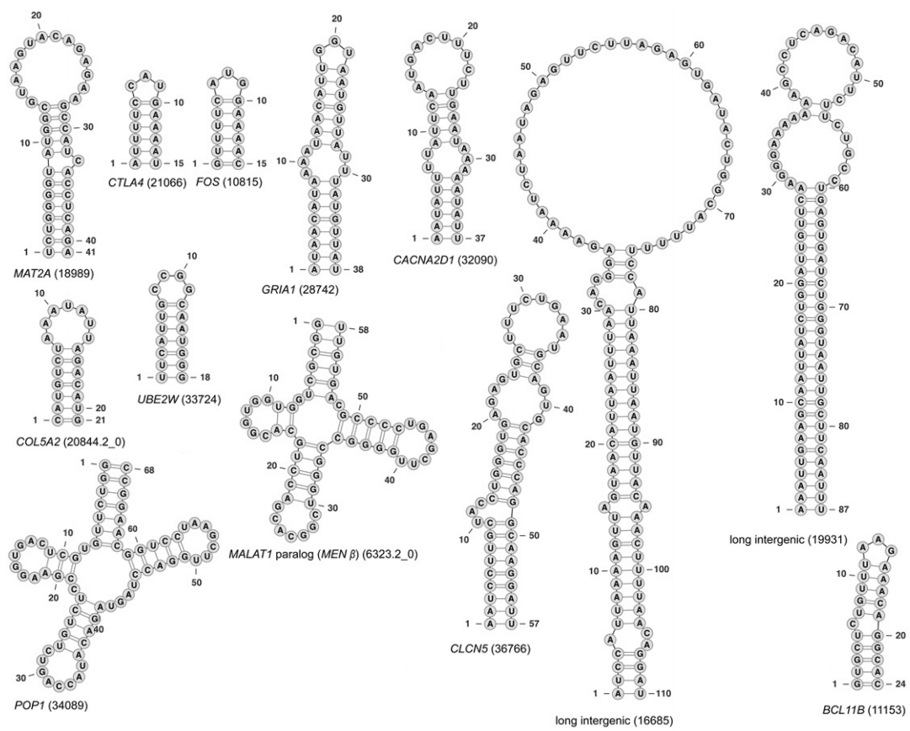

# Functional DNA:  A Powerful Argument for Design

(This article was published in a newsletter that Lindsay manages)

The concept of junk DNA has garnered renewed attention in intelligent design circles.  On May 2nd, geologist and discovery institute fellow Casey Luskin debated Rutgers evolutionary biology prof and anti-creationist Dan Cardinale.  Luskin summarizes his position at 6:52:

> While function for Junk DNA may not strictly speaking refute evolution, the discovery of widespread functionality for non-coding or junk DNA represents a failed prediction for evolution... the evidence of mass functionality for Junk DNA represents a spectacularly successful prediction of ID.[^non-sequitor-2024]

Luskin is correct about the history of predictions, as I've written elsewhere.[^berean-archive-2024]  However, contrary to Luskin's claims, Biblical creationists might be surprised to learn that the absence of junk DNA does indeed contradict evolutionary theory and shows complex species could not have existed for millions of years.  Given that Luskin believes life and the Earth are billions of years old, he may be unwilling to follow these implications.

## Genetic entropy

The arithmetic is simple.  Each human child has about 70 new mutations, along with mutations inherited from their parents.  Many large, complex animals likely have a similar mutation rate.  If almost all of our DNA is junk, then these mutations are mostly changing letters of DNA that don't matter.  But if even more than a small percentage of DNA letters need a specific sequence to function, then every offspring ends up with more harmful mutations than their parents.  Which should selection chose to then make the species better?  

Most harmful mutations have only very mild effects.  That's good in the short term.  But that also means natural selection usually can't filter them out.  Seasoned creationists recognize this as the Genetic Entropy argument pioneered by geneticist John Sanford.  Creationists Gibson, Baumgardner, Brewer, and Sanford used a computer simulation to model only 10 harmful mutations per generation and saw:

> ...a steady decline in fitness that is not even halted by extremely intense selection pressure (12 offspring per female, 10 selectively removed)... under most realistic circumstances, the large majority of harmful mutations are essentially unaffected by natural selection and continue to accumulate unhindered... With a mutation rate of 10, almost half of all deleterious [harmful] mutations were retained, with a nearly constant accumulation rate of 4.5 mutations per individual per generation.[^gibson-2013]

Even many ardent anti-creationists recognize this problem of having too many mutations.  Biochemist and textbook author Larry Moran:

> If the deleterious [harmful] mutation rate is too high, the species will go extinct... It should be no more than 1 or 2 deleterious mutations per generation.[^moran-2014]

If mutations drive species to extinction then they couldn't have been around for millions of years.

## Defining function

ENCODE is an ongoing research project by the United States National Institute of Health (NIH) to find function in human DNA. The project involves hundreds of scientists and hundreds of millions in funding.  In 2012 they eulogized the concept of junk DNA by announcing that at least 80% of human DNA has function.  Evolutionists were not happy, and rightly noted that there are different ways to define function:

1. **Sequence-specific function:**  DNA letters where function will be affected if they're changed.
2. **Functional elements:** Sequences of DNA letters that perform a specific function.  Some of the DNA letters within them are sequence-specific functional while perhaps others could be swapped with no detectible effect on function.  A popular example of a functional element is a gene that has instructions for making a protein.

Evolutionists correctly pointed out that ENCODE's 80% applied only to functional elements.   But many incorrectly argued that the 80% estimate was too high.  What does the data show?

## How much DNA is functional elements?

First we'll look at how much DNA is within functional elements.

### 85% of DNA is Transcribed

At least 85% of DNA in human cells is transcribed (copied) to a molecule called RNA, probably more.  Some of the RNA serves as a messenger with instructions for making proteins.  Most RNA has other functions.  Researchers note:

> We found evidence that 85.2% of the genome is transcribed. This result closely agrees with [ENCODE's estimate of] transcription of 83.7% of the genome... even more read depth may reveal yet higher genomic coverage.[^hangauer-2013]

### DNA is copied to RNA in specific patterns

Human development involves a single fertilized egg cell dividing into trillions of cells to eventually produce an adult human. This includes differentiating into various types of bone, muscle, and nerve cells, among hundreds of others.  Researchers see different cell types use different sections of DNA at different stages of development, in precise and reproducible patterns:

> [T]he vast majority of the mammalian genome is differentially transcribed in precise cell-specific patterns to produce large numbers of intergenic, interlacing, antisense and intronic non-protein-coding RNAs, which show dynamic regulation in embryonal development, tissue differentiation and disease...[^mattick-2013] 

They go on to note this is best explained by the DNA being functional, but not by DNA accidently getting copied to RNA as some evolutionists argue.

### RNA is taken to specific locations

Among non-coding RNA produced in the human brain, about 80% are taken to specific locations within cells:

> In 80% of the cases where we had sufficient resolution to tell, these RNAs [in the human brain] are trafficked to specific subcellular locations. So this is not some fuzzy random signal: their expression is extremely precise, both in terms of the cell specificity and in terms of subcellular localization.[^mattick-2013]

This seems more compatible with function.

### RNA's are usually functional when tested

If you take a survey of RNAs and find them functional, it's reasonable to assume most of the rest are functional too:

> [W]here tested, these noncoding RNAs usually show evidence of biological function in different developmental and disease contexts, with, by our estimate, hundreds of validated cases already published and many more en route, which is a big enough subset to draw broader conclusions about the likely functionality of the rest.[^mattick-2013]

This has led some genomicists to suspect that nearly 100% of the human genome will be found to be made of functional elements.  The prestigious non-coding DNA researcher John Mattick:

> Most of the human genome – perhaps not unreasonably 99% must be devoted to the regulation of development – generating ~30–40 trillion cells with highly specific arrangements, characteristics, and connections in an adult capable of reproduction and parenting.[^mattick-2023]

ENCODE lead researcher Ewan Birney:

> It’s likely that 80 percent [estimate of functional human DNA] will go to 100 percent. We don’t really have any large chunks of redundant DNA. This metaphor of junk isn’t that useful.[^yong-2012]

## How much DNA is sequence specific?

If most DNA is composed of functional elements, how many new harmful mutations do each of us get per generation?  It's not reasonable to assume only 1-2% of DNA letters within these functional elements will cause problems if changed.  

### From RNA structure

We know that "the nucleic acids that make up RNA connect to each other in very specific ways, which force RNA molecules to twist and loop into a variety of complicated 3D structures."[^garvan-2013]  This places many of the DNA letters that create this RNA into the sequence-specific category.

Consider the diagram below of 13 RNA's known to be functional:[^parker-2011]

About 66% of the RNA letters are linked to another RNA letter, which can only happen between specific (complementary) letters.  Change these letters and they become unlinked.  And some the RNA letters not linked likely have function as well.

### From exons + protein binding

ENCODE estimated in 2012 that 20% of the genome is made of exons (protein coding gene regions) or has a specific sequence that proteins use to determine where to latch on to DNA:

> [E]ven with our most conservative estimate of functional elements (8.5% of putative DNA/protein binding regions) and assuming that we have already sampled half of the elements from our transcription factor and cell-type diversity, one would estimate that at a minimum 20% (17% from protein binding and 2.9% protein coding gene exons) of the genome participates in these specific functions, with the likely figure significantly higher.[^encode-2012] [^birney-2012]

From what we know of exons and protein binding areas, most of their sequence must be specific.  There are of course many other types of sequence-specific DNA beyond these categories.

### From disease + trait association

A review in 2012 looked at 920 studies involving the genomes of thousands of people.[^maurano-2012] They found that only 4.9% of function altering mutations occurred within protein-coding DNA

Another broad research review found only 4% of function altering mutations (105/2593) were within coding regions.[^freedman-2011]

Since only a small percentage of DNA is protein coding (2.9% according to ENCODE above), this implies there's much sequence-specific DNA outside of protein coding regions.

### Sequence specific conclusions

The three aforementioned indicators show that we're likely getting much more than 10 mutations each generation that disrupt function.  10 harmful mutations drove the population to extinction in the simulation by Gibson et al.[^gibson-2013]  And this is far more than the 1-2 per generation that Larry Moran worries about.  This caused molecular biologist and anti-creationist Dan Graur to famously proclaim:

> If the human genome is indeed devoid of junk DNA as implied by the ENCODE project, then a long, undirected evolutionary process cannot explain the human genome... If ENCODE is right, evolution is wrong.[^graur-2013]

If evolution cannot even maintain these large amounts of functional DNA in complex organisms, then it could not have created it.

## Common Objections

Evolutionists have not taken these issues lying down.  Below are some of the most common objections followed by responses:

### "DNA that can be removed is junk"

In 2014 when biologist Craig Venter's team built the first artificial yeast chromosome, they left out or modified 20% of the DNA. The yeast still appeared fine:

> [T]here are over 50,000 base pairs that were either deleted, inserted or changed in that chromosome of 250,000 base pairs, and it works."[^callaway-2014]

Surely this must mean that DNA is junk?  Not so.  Many genes have functions that are only needed in specific environments.  A 2008 study noted than only 20% of yeast genes had an effect when disabled--when the yeast were in a comfortable lab environment.  Once they subjected the yeast to various chemical or environmental stress, they found 97% of genes had a negative effect when disabled.[^hillenmeyer-2008]

Additionally, many genes serve as redundant fallbacks which only kick in when primary systems fail:

> Loss-of-function tests can also be buffered by functional redundancy, such that double or triple disruptions are required for a phenotypic consequence.[^kellis-2014]

 In c. elegens (a simple worm), 89-96% of genes are part of such redundant systems.[^conant-2004]

### "Biochemical activity ≠ function"

Some evolutionists argue that most DNA is copied to RNA randomly and by accident. Therefore, the mere production of RNA does not necessarily indicate that the DNA is functional.  However, a 2017 study looked at places where proteins bind to DNA, across 75 organisms including humans, mice, fruit flies, and yeast:

> Using in vitro measurements of binding affinities for a large collection of DNA binding proteins, in multiple species, we detect a significant global avoidance of weak binding sites in genomes.[^long-2016]

This matters because:

> Most DNA binding proteins recognize degenerate patterns; i.e., they can bind strongly to tens or hundreds of different possible words and weakly to thousands or more.[^long-2016]

If proteins bind to DNA largely at random then we would expect to see mostly weak binding.  But we see mostly strong binding.  Therefore most DNA-protein binding indicates function.

And as noted, RNAs being produced at specific times in specific cell types is also evidence they're functional:

> Assertions that the observed transcription represents random noise (tacitly or explicitly justified by reference to stochastic ("noisy") firing of known, legitimate promoters in bacteria and yeast), is more opinion than fact and difficult to reconcile with the exquisite precision of differential cell- and tissue-specific transcription in human cells.[^mattick-2013]

### "Less than one transcript per cell"

Among the RNA where ENCODE could estimate its abundance, 70% were detected at levels below "one transcript per cell."[^kellis-2014]  ENCODE critics cried fowl, claiming that such a small amount of RNA couldn't possibly be doing anything useful.

But the one transcript per cell is just an average.  ENCODE studied 147 cell types at various stages of development.  If an RNA had 500 copies only in one cell type and at only one stage of development, the average could still be less than one if it wasn't present in any other cell types or developmental stages.

Additionally an RNA from the HOXA gene (that everyone agrees is functional) was detected at  only 0.13 copies per cell.  Another functional RNA was found at only "0.0006 transcripts per cell, indicating expression in only a small subpopulation of the cells sampled."[^mercer-2012]

## Conclusions

In 1884, long before DNA was discovered, the anti-Christian agnostic Robert G. Ingersoll quipped:

> The church teaches that man was created perfect, and that for six thousand years he has degenerated. Darwin demonstrated the falsity of this dogma. He shows that man has for thousands of ages steadily advanced... that man did not "fall."  Charles Darwin destroyed the foundation of orthodox Christianity.[^ingersoll-1884]

In contrast, over 1800 years earlier the apostle Paul reminded us that all of creation is in bondage to decay:

> For the creation was subjected to futility—not willingly but because of God who subjected it—in hope that the creation itself will also be set free from the bondage of decay into the glorious freedom of God’s children. (NET)

The genomics discoveries of the last two decades have not been kind to Ingersoll, or to Darwin.  I eagerly anticipate Christ's return when we'll be freed from this bondage to decay.

## Sources

[^non-sequitor-2024]: "[Dr. Casey Luskin vs Dr. Dan Stern Cardinale: Is the Human Genome Largely Junk DNA?](https://www.youtube.com/watch?v=JPs2xwxT4rI)"  The Non Sequitor Show.  May 2, 2024.
[^berean-archive-2024]:  "[Functional versus Junk DNA Predictions](https://bereanarchive.org/articles/biology/functional-dna-predictions)."  Berean Archive.  2024.
[^gibson-2013]: Gibson, Paul et al.  "[Can Purifying Natural Selection Preserve Biological Information?](https://www.worldscientific.com/doi/10.1142/9789814508728_0010)"  World Scientific.  2013.
[^moran-2014]: Moran, Larry.  "[A creationist tries to understand genetic load](http://sandwalk.blogspot.com/2014/04/a-creationist-tries-to-understand.html)."  Sandwalk Blog.  2014.
[^hangauer-2013]: Hangauer et. al. "[Pervasive Transcription of the Human Genome Produces Thousands of Previously Unidentified Long Intergenic Noncoding RNAs](http://journals.plos.org/plosgenetics/article?id=10.1371/journal.pgen.1003569)." PLoS Genetics. 2013.
[^mattick-2013]: Mattick, John S. and Marcel E. Dinger.  "[The extent of functionality in the human genome](https://thehugojournal.springeropen.com/articles/10.1186/1877-6566-7-2)."  HUGO.  2013.
[^mattick-2023]: Mattick, John S. and Paulo Amaral.  "[RNA - The Epicenter of Genetic Information](https://www.ncbi.nlm.nih.gov/books/NBK595939/)."  CRC Press.  2023.
[^yong-2012]: Yong, Ed.  "[ENCODE: the rough guide to the human genome](https://web.archive.org/web/20201111202050/http://www.discovermagazine.com/the-sciences/encode-the-rough-guide-to-the-human-genome)."  Discover Magazine.  2012.
[^parker-2011]: "[New families of human regulatory RNA structures identified by comparative analysis of vertebrate genomes](http://genome.cshlp.org/content/early/2011/10/03/gr.112516.110.full.pdf)."  Genome Research.  2011.
[^garvan-2013]: [New insight into the human genome through the lens of evolution](https://web.archive.org/web/20160106070951/http://www.garvan.org.au/news-events/news/new-insight-into-the-human-genome-through-the-lens-of-evolution)."  Garvan Institute.  2013.
[^encode-2012]: The ENCODE Project Consortium.  "[An integrated encyclopedia of DNA elements in the human genome](http://www.nature.com/nature/journal/v489/n7414/full/nature11247.html?WT.ec_id=NATURE-20120906)."  Nature.  2012.
[^birney-2012]: Birney, Ewan.  "[ENCODE: My own thoughts](http://genomeinformatician.blogspot.com/2012/09/encode-my-own-thoughts.html)."  Ewan's Blog.  2012.
[^maurano-2012]: Maurano, Matthew T.  "[Supplementary Materials for Systematic Localization of Common Disease Associated Variation in Regulatory DNA](https://www.ncbi.nlm.nih.gov/pmc/articles/PMC3771521/bin/NIHMS492174-supplement-SOM.pdf)."  Science.  2012.  See figure S1 for the pie chart of SNP locations.
[^freedman-2011]: Freedman, Matthew L.  "[Principles for the post-GWAS functional characterization of cancer risk loci](https://www.ncbi.nlm.nih.gov/pmc/articles/PMC3325768/)."  Nature Genetics.  2011.  See table 1 in the paper. Note that a pre-print version of this study listing Alvaro N.A. Monteiro as the lead author does not include the table.
[^graur-2013]: Graur, Dan. "[How to Assemble a Human Genome](https://web.archive.org/web/20130719031933/http://twileshare.com/askq)." 2013. Slide 5.  [Screenshot](https://bereanarchive.org/articles/biology/functional-dna-predictions-files/sources/graur-how-to-assemble-a-human-genome-2013-slide5.png).
[^callaway-2014]: Callaway, Ewen.  "[First synthetic yeast chromosome revealed](http://www.nature.com/news/first-synthetic-yeast-chromosome-revealed-1.14941)."  Nature News.  2014.
[^hillenmeyer-2008]: Hillenmeyer, Maureen et al.  "[The chemical genomic portrait of yeast: uncovering a phenotype for all genes](https://www.ncbi.nlm.nih.gov/pmc/articles/PMC2794835/)."  Science.  2008.
[^kellis-2014]: Kellis et.al.  "[Defining functional DNA elements in the human genome](http://www.pnas.org/content/111/17/6131.long)."  PNAS.  2014
[^conant-2004]: Conant, Gavin C. and Andreas Wagner.  "[Duplicate genes and robustness to transient gene knock-downs in Caenorhabditis elegans](https://www.ncbi.nlm.nih.gov/pmc/articles/PMC1691561/)."  Proc Biol Sci.  2004.
[^long-2016]:   Qian, Long and Edo Kussel.  "[Genome-Wide Motif Statistics are Shaped by DNA Binding Proteins over Evolutionary Time Scales](https://journals.aps.org/prx/pdf/10.1103/PhysRevX.6.041009)."  Physical Review X.  2016.
[^mercer-2012]:   Mercer, Tim R. et al.  "[Targeted RNA sequencing reveals the deep complexity of the human transcriptome](https://www.nature.com/articles/nbt.2024)."  Nature Biotechnology.  2012. 
[^ingersoll-1884]: Ingersoll, Robert G.  "[The Works of Robert G. Ingersoll](https://www.gutenberg.org/files/38802/38802-h/38802-h.htm)."  1884.

