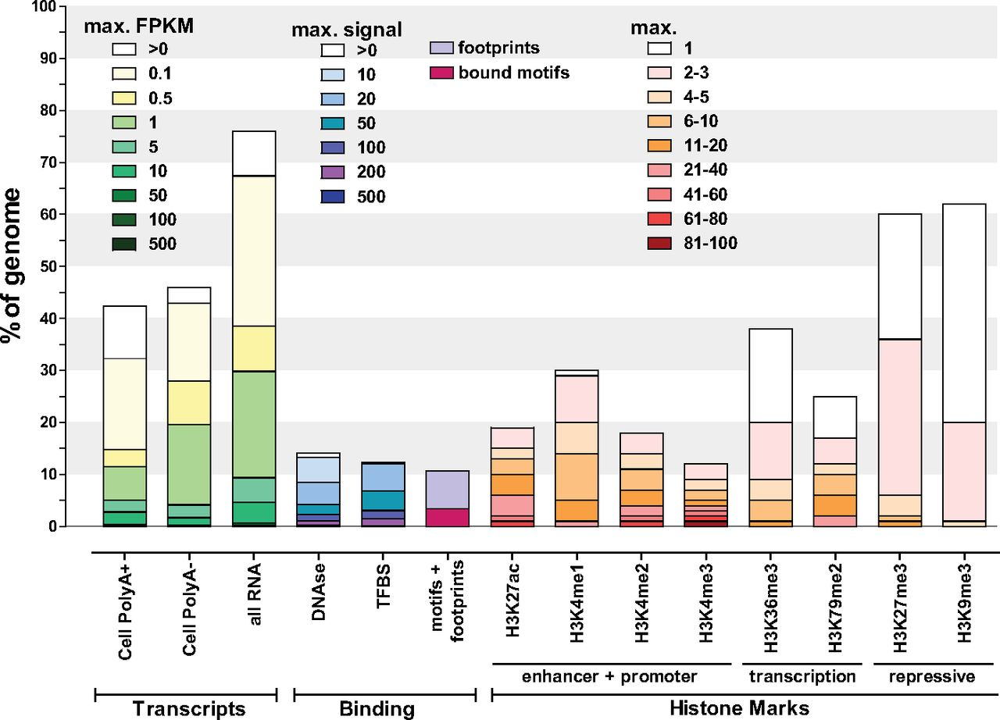
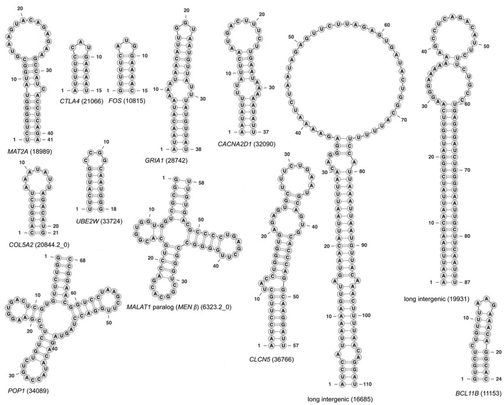
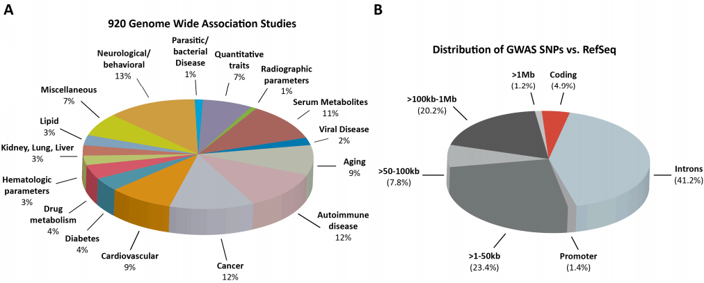

# Functional DNA is Evidence of Design

<aside>
    Published May 2017 
	Last updated 
    <time datetime="<?=date('Y-m-d H:i:s', $modified)?>" 
          title="<?=gmdate('Y-m-d H:i:s', $modified)?> UTC">
    	<?=date('M j, Y', $modified)?>
    </time>
</aside>
<q>“It’s likely that 80 percent [estimate of functional human DNA] will go to 100 percent. We don’t really have any large chunks of redundant DNA. This metaphor of junk isn’t that useful." — ENCODE lead researcher Ewan Birney.[^yong-2012]</q>

<q>"If the human genome is indeed devoid of junk DNA as implied by the ENCODE project, then a long, undirected evolutionary process cannot explain the human genome... If ENCODE is right, evolution is wrong." — evolutionary biologist and atheist Dan Graur[^graur-2013b]</q>

## Overview

Humans and other mammals have about 3 billion "letters" of DNA.  If evolution produced complex mammals like humans, we should expect most DNA to have no function, because:

1. 3 billion DNA letters is much more function than evolution could produce, given even best-case scenarios.[^dodson-1962] [^moran-2014]
2. Humans also get about 100 mutations per generation.[^moran-2013]  Most mutations that have any effect on an organism are harmful.[^lind-2010]  If even 10% of DNA has a specific sequence, then humans and other mammals would receive almost 10 new harmful mutations each generation, causing all offspring to have more harmful mutations than their parents.[^ohno-1972] [^gibson-2011] [^moran-2014b]  Function would perpetually decline with each generation. If evolution can't even preserve the function in our DNA, it could not have created it.

However it wouldn't make sense for a designer to create large amounts of non-functional DNA. The only junk DNA would be that which has been destroyed by mutations since the original design.

### How much human DNA is in functional elements?

<aside markdown="1">
<iframe width="230" height="130" src="https://www.youtube.com/embed/5MfSYnItYvg" frameborder="0" allow="accelerometer; autoplay; clipboard-write; encrypted-media; gyroscope; picture-in-picture" allowfullscreen></iframe>
This video[^dna-transcription-2010] shows how DNA is copied (transcribed) into RNA.
</aside>

Most human DNA has not yet been tested to see if it has a function.[^mattick-2013] But we can still extrapolate from known data:

1. At least 85% of DNA is copied (transcribed) into RNA.[^hangauer-2013]
2. When and where DNA is copied to RNA occurs in specific patterns that depend on the cell type and the stage of development.[^mattick-2010] [^mattick-2013] [^hangauer-2013]
3. Among DNA copied to RNA transcripts in the human brain, at least 80% are taken to specific locations within their cells.[^mattick-2010]
4. Enough RNA has been tested for function that we can "draw broader conclusions about the likely functionality of the rest."[^mattick-2013]

If at least 85% of DNA is copied to RNA, and at least 80% of those RNAs are taken to specific locations within cells, 85% * 80% = at least 68% of human DNA is used in a functional way.  And likely much more because these are both lower-bound estimates. As function continues to increase as more DNA is studied, it is reasonable to think that perhaps even 99%+ DNA is in use.[^yong-2012] This is not to say that every DNA letter within these sequences requires a specific sequence.

### How much human DNA requires a specific sequence of letters?

Within a functional element of DNA, not all letters have to have a specific sequence. But how many do?

1. If 85% of DNA is copied to RNA transcripts, 80% of those RNA transcripts are functional (transported to specific locations),[^mattick-2010] and 66% of that RNA requires a specific sequence[^parker-2011], then these three numbers multiplied suggests at least 45% of DNA requires a specific sequence.
2. At least 20% of DNA consists of either specific sequences where proteins bind to it, or instructions for making proteins (exons)[^encode-2012], and much known function that exists outside of protein binding spots and exons.
3. About 95% of mutations that cause noticeable effects are outside of the 1-3% of DNA that creates proteins.[^maurano-2012] [^freedman-2011] From this (calculated below) we can extrapolate that at least 30% of DNA has a specific sequence.
4. About 16% to 30% of either human DNA, or RNA copied from it, is shared (conserved) with distantly related mammals.[^smith-2013] Distant enough that if we assume they evolved from a common ancestor, then mutations would have had enough time to scramble this DNA if it were non-functional.

Since these are each under-estimates, and partially non-overlapping, the true amount of sequence-specific DNA is likely greater.

### Implications

The data on the amount of functional DNA nullifies the argument that almost all DNA is junk and is therefore not designed.

Furthermore, at least 16-45% of DNA has a specific sequence, and likely much more. This implies humans get at least 16 to 45 harmful mutations per generation--far too many for evolution to even prevent declining function.

Evidence is what is expected in one view and not expected in competing views. Therefore the large amounts of functional DNA is evidence that organisms were designed.

The following sections outline this data in greater detail.

## Defining Terminology

<aside>

Examples of functional elements as defined by Michael Behe:[^behe-2010]   

<ul class="compact">
	<li><dfn>promoters</dfn></li>
	<li><dfn>enhancers</dfn></li>
	<li><dfn>insulators</dfn></li>
	<li><dfn>Shine-Dalgarno sequences</dfn></li>
	<li><dfn>transfer RNA</dfn> genes</li>
	<li><dfn>micro RNA</dfn> genes</li>
	<li><dfn>protein coding</dfn> sequences</li>
	<li><dfn>organellar</dfn> targeting- or localization-signals</li>
	<li><dfn>intron</dfn>/<dfn>exon</dfn> <dfn>splice</dfn> sites</li>
	<li><dfn>codons</dfn> specifying the binding site of a <dfn>protein</dfn> for another molecule (such as
		its <dfn>substrate</dfn>, another protein, or a small <dfn>allosteric</dfn> regulator)</li>
	<li><dfn>codons</dfn> specifying a processing site of a protein (such as a <dfn>cleavage</dfn>,
		<dfn>myristoylation</dfn>, or <dfn>phosphorylation</dfn> site)</li>
	<li><dfn>polyadenylation</dfn> signals</li>
	<li><dfn>transcription</dfn> and <dfn>translation</dfn> termination signals</li>
</ul>

Here, Behe is merely formalizing a generally accepted definition of functional elements.

</aside>

Rather than using only two categories of function and junk, this article takes a more nuanced approach:

1. **Sequence-Specific Function:** These are ++nucleotides++ where a ++substitution++ ++mutation++ will alter the function or efficiency of a functional element, even if only very slightly. Sequence-specific function is a subset of the DNA that is in functional elements.
2. **Functional Elements:** Functional elements are sequences of DNA that perform a specific function. Some of their nucleotides are sequence-specific functional while others can be swapped with no detectible effect on function. Or in more technical terms: a sequence of nucleotides that "affects the production, processing, or biological activity of a particular nucleic acid or protein, or the binding of other molecules."[^behe-2010]
3. **Junk DNA:** These nucleotides can be removed without degrading any functional elements.

Other definitions are often used in the debate over how much DNA is functional, but most are less precise. Because most genome studies focus on the human genome this article does same, as there is the most data is available there.

## Counting DNA in functional elements

As defined above, functional elements have DNA where substitution mutations may or may not degrade function, but their removal would break function. Although "most elements in the human genome have not been subject to functional analysis,"[^mattick-2013] we have four reasons to think the majority of human DNA is part of functional elements:

### 1. More than 85% of human DNA is copied to RNA

DNA is transcribed when it is copied to RNA. In 2013 genome researchers noted:

> We found evidence that 85.2% of the genome is transcribed. This result closely agrees with [ENCODE's estimate of] transcription of 83.7% of the genome... we observe an increase in genomic coverage at each lower read threshold implying that even more read depth may reveal yet higher genomic coverage.[^hangauer-2013]

ENCODE is an ongoing project by the United States National Institute of Health (NIH) to find function of the various sequences of human DNA. The project involves hundreds of scientists and hundreds of millions in funding. Prior to the more recent estimate of 85.2% transcription, ENCODE found in 2012:

> The vast majority (80.4%) of the human genome participates in at least one biochemical RNA- and/or chromatin-associated event in at least one cell type.[^encode-2012]

The following chart[^kellis-2014] summarizes the results of various functional tests performed by ENCODE in 2012:

<aside>
	
<b>Transcripts:</b>&nbsp; Columns 1-3.&nbsp; DNA that is copied into RNA

	
<b>Binding:</b>&nbsp; Columns 4-6.&nbsp; Regions of DNA that a protein binds
		to.

	
<b>Histone Marks:</b>&nbsp; Columns 7-14. Histones are proteins that DNA is
		wound around within chromosomes. Histone marks are modifications that affect when DNA
		is copied to RNA.

</aside>

The third bar above (all RNA) shows that in 2012, at least 75% of DNA was found being copied to RNA. The tan regions in the first three bars corresponds to regions of DNA where about "one transcript copy per cell"[^kellis-2014] was detected. Bars four through fourteen show the amount of DNA seen to be participating in other types of activity that implies function.

Many tests for function do not overlap other tests. This chart[^kellis-2014] illustrates the intersections of some of the tests. Note that almost all DNA is colored by at least one test of function:

<table class="small">
	<tr>
		<td style="width:50%"> </td>
        <td><b>Biochemical evidence:</b> These blue regions show DNA that participates in the activities in the previous chart.  
			<b>Genetic evidence:</b> This green region shows DNA that causes a noticeable change in function if modified.  
			<b>Evolutionary evidence:</b> This red circle shows DNA that is the same in both humans and some distantly related mammals.  
            <b>Protein-coding:</b> This purple circle shows DNA that is directly used to make proteins.</td>
	</tr>
</table>

However, ENCODE critics often counter-argue that DNA being copied to RNA and participating in the other biological activities is not enough evidence that DNA is functional.  Genomicist Dan Graur is among these critics:

> ENCODE ignores the fact that transcription is fundamentally a ++stochastic++ process. Some studies even indicate that 90% of the transcripts generated by RNA polymerase II may represent transcriptional noise. In fact, many transcripts generated by transcriptional noise exhibit extensive association with ribosomes and some are even translated

Dan Graur goes on to discuss why ENCODE's tests for histone modification, open chromatin, transcription factor binding, and DNA methylation alone are not necessarily indicators of function. Fair enough. But several additional evidences suggest transcribed DNA is likely functional:

### 2. DNA is copied to RNA in specific patterns

Human development involves a single fertilized egg cell dividing into trillions of cells to eventually produce an adult human. These resulting cells come in many different types such as the various types of bone, muscle, and nerve cells. We see different cell types use different sections of DNA at different stages of development, in precise and reproducible patterns.

<aside>
	
	John Mattick is a
	molecular biologist whose research focuses on non-coding DNA.&nbsp; Mattick directs Genomics England
	and is a member of the Australian Academy of Science.
	&nbsp;Mattick is a proponent of evolutionary theory.
</aside>

For example, Genome researcher John Mattick describes his observations of DNA being copied to RNA in the human brain and elsewhere:

> Some are only expressed in the dentate gyrus of the hippocampus, others in particular layers of the cortex, and others in Purkinje cells in the cerebellum.[^mattick-2010]

> [T]he vast majority of the mammalian genome is differentially transcribed in precise cell-specific patterns to produce large numbers of intergenic, interlacing, antisense and intronic non-protein-coding RNAs, which show dynamic regulation in embryonal development, tissue differentiation and disease with even regions superficially described as "gene deserts" expressing specific transcripts in particular cells... Assertions that the observed transcription represents random noise (tacitly or explicitly justified by reference to ++stochastic++ ("noisy") firing of known, legitimate promoters in bacteria and yeast), is more opinion than fact and difficult to reconcile with the exquisite precision of differential cell- and tissue-specific transcription in human cells.[^mattick-2013]

Other genome researchers have noted the same:

> [T]he lincRNAs we identified have many characteristics that are inconsistent with noise, including specific regulation of their expression, the presence of conserved sequence and evidence for regulated processing. Furthermore, these lincRNAs are strongly enriched with intergenic sequences that were previously known to be functional in human traits and diseases.[^hangauer-2013]

> Independently, the developmental and tissue-specific expression of most ncRNAs provides perhaps the most compelling case for their widespread functionality. A study of ncRNAs expressed in mouse brain by in situ hybridization showed that the majority (623 out of 849) are selectively expressed in discrete functional regions of the brain, sometimes with evidence of specific subcellular localization. Moreover, expression signatures and dynamic regulation of hundreds of ncRNAs has been observed across tissue types and in various developmental systems, from Drosophila embryogenesis to differentiation of mammalian ES cells, T-cells and muscle cells [^dinger-2009]  [Mattick is a co-author of this paper]

If "transcription is fundamentally a ++stochastic++ process" as Graur argues, we should not expect transcription to be so precisely regulated.

### 3. RNA is taken to specific locations

John Mattick observed that among non-coding RNA produced in the human brain, 80% of it was taken to specific locations within cells:

> [I]n 80% of the cases where we had sufficient resolution to tell, these RNAs [in the human brain] are trafficked to specific subcellular locations. So this is not some fuzzy random signal: their expression is extremely precise, both in terms of the cell specificity and in terms of subcellular localization.[^mattick-2010]

### 4. RNAs usually affect development or disease

John Mattick describes his experience:

> In fact almost every time you functionally test a non-coding RNA that looks interesting because it's differentially expressed in one system or another, you get functionally indicative data coming out.[^mattick-2010]

> [W]here tested, these noncoding RNAs usually show evidence of biological function in different developmental and disease contexts, with, by our estimate, hundreds of validated cases already published and many more en route, which is a big enough subset to draw broader conclusions about the likely functionality of the rest.[^mattick-2013]

But is Mattick merely just assuming this DNA is functional without proper investigation? Or perhaps mutations are merely activating nonfunctional DNA, causing the "disease contexts?" No. Rather, disabling this DNA causes loss of function, as can be seen in Mattick's numerous citations:

1. "**Knockdown** of lincRNAs has major consequences on gene expression patterns, comparable to knockdown of well-known ES [embryonic stem] cell regulators."[^guttman-2010]
2. "Decreased capacity for cell migration was also observed for SPRY4-IT1 **knockdown**." (although knocking it out also negatively affected melanoma cells)[^khaitan-2011]
3. "We identified lncRNAs required for neurogenesis. **Knockdown** studies indicated that loss of any of these lncRNAs blocked neurogenesis"[^ng-2012]
4. "**Knockdown** of MEN ε/β expression results in the disruption of nuclear paraspeckles."[^sunwoo-2009]
5. "**Knockdown** of Zfas1 in a mammary epithelial cell line resulted in increased cellular proliferation and differentiation."[^askarian-amiri-2011]

It's also notable for Mattick to find this much function because "loss-of-function tests can also be buffered by functional redundancy, such that double or triple disruptions are required for a phenotypic consequence."[^kellis-2014] This means that many genes will not produce a noticeable effect when disabled, because when one gene is disabled, cells often automatically enable other genes to do the same job.

	<h4>Estimating Minimum DNA in Functional Elements</h4>
	If at least 85% of DNA is copied to RNA, and at least 80% of RNA transcripts are taken to
	specific locations within a cell, then we could estimate that perhaps 85% * 80% = <b>at
	least 68%</b> of DNA is within functional elements.&nbsp; And likely much more
	because these are both lower-bound estimates, not all DNA must be transcribed to have function,
	and not all RNA must be taken to a specific sub-cellular location to be functional.

## Counting Sequence-Specific DNA

As defined above, DNA that is sequence-specific has nucleotides where a substitution mutation will alter the function or efficiency of a functional element, even if only very slightly. We have several criteria by which to estimate how much DNA is sequence-specific:

### 1. From RNA Structure + Functional Elements

We also know that "the nucleic acids that make up RNA connect to each other in very specific ways, which force RNA molecules to twist and loop into a variety of complicated 3D structures."[^garvan-2013] This places many of the nucleotides transcribed to RNA in the sequence-specific category.

Below is a diagram[^parker-2011] with 13 examples of various known functional RNAs:

This list shows the number of cross-linked RNA nucleotides (connections where the RNA folds back on itself) per total nucleotides for each of the functional RNAs:

{[class="small"]}

|                                                              |                                                              |                                                              |
| ------------------------------------------------------------ | ------------------------------------------------------------ | ------------------------------------------------------------ |
| MAT2A: 26 / 41 CTLA4: 12 / 15  FOS: 12 / 15  GRIA1: 26 / 34  CACNAD2D1: 22 / 37 | COL5A2: 14 / 21  UBE2W: 14/ 18  CLCN5: 28 / 47  BCL11B: 20 / 24 | MALAT1: 36 / 56  POP1: 40 / 62  long int. 19931: 60 / 86  long int. 16685: 62 / 110 |

Adding these gives 372 cross-linked nucleotides out of 566 total nucleotides, or 66%. From this we can make a lower-bound estimate of the percentage of nucleotides in functional RNAs that are sequence-specific: Since cross-linked RNA nucleotides require a specific sequence, this means at least 66% of the nucleotides within functional RNAs are sequence-specific. Although some of the others will be specific also.

Above we estimated at least 68% of DNA is within functional elements. Multiplying this number by the 66% give us at least **45%** of DNA being sequence-specific. This should be treated as only a very rough estimate; a placeholder until better data is available.

#### Conservation bias?

The diagram above comes from a study looking at conserved DNA to find functional RNAs.  Some may argue this introduces a bias, because RNAs with less specific sequences would be less likely to show up in a conservation study. However compare those above to a functional RNA such as MiRNA-95, where "its conservation is limited to the primate lineage and a few other higher mammals"[^frankel-2014] but has 60 out of 79[^hsa-mir-95] (76%) cross-linked RNA nucleotides.

### 2. From Exons + Protein Binding

ENCODE estimated in 2012 that 20% of the genome is made of exons or has a specific sequence that proteins use to determine where to latch on to DNA:

> [E]ven with our most conservative estimate of functional elements (8.5% of putative DNA/protein binding regions) and assuming that we have already sampled half of the elements from our transcription factor and cell-type diversity, one would estimate that at a minimum 20% (17% from protein binding and 2.9% protein coding gene exons) of the genome participates in these specific functions, with the likely figure significantly higher.[^encode-2012]

Because this paper previously mentions primate-specific DNA, some critics claim the 20% only applies to the regions of human DNA shared with other primates. However, leading ENCODE researcher Ewan Birney references the 20% in regard to the entire human genome:

> A conservative estimate of our expected coverage of exons + specific DNA:protein contacts gives us 18%, easily further justified (given our sampling) to 20%.[^birney-2012]

### 3. From Disease + Trait Association

A review in 2012 looked at 920 studies involving the genomes of thousands of people[^maurano-2012]. They found that only 4.9% of function altering mutations occurred within protein-coding DNA (red slice in figure B):

Likewise another broad research review found only 4% of function altering mutations (105/2593) were within coding regions.[^freedman-2011]

From this we can estimate what percentage of DNA is subject to deleterious mutations.

#### Estimating the percentage of deleterious mutations within exons

Within coding regions, a 2011 study[^freedman-2011] found 79 non-synonymous and 26 synonymous function altering mutations. About 30% of protein coding mutations are synonymous. If synonymous nucleotides were as functional as non-synonymous nucleotides we should expect 30%*(26+79) = 31.5 of them to be function-altering. But only 26 of them are functional, suggesting that they are only 26/31.5=83% as functional as non-synonymous sites.

At least 75%[^axe-2004] of amino-acid altering mutations within exons are deleterious, which implies that 75%*83% =62.25% of mutations at synonymous sites are deleterious. Combining the synonymous and non-synonymous rates gives 75% * 70% + 62% * 30% = 71.1% of mutations within exons being deleterious. Although one bacterial study estimated that as many as 95% of mutations within exons are deleterious.[^lind-2010]

#### Estimating functional DNA

If 2% of DNA is protein coding, and only 4.9% of harmful mutations fall within protein coding DNA, that means non-coding DNA is 2% / 4.9% = 41% as specific in sequence as coding DNA.  Coding DNA is 71% sequene specific, so about 71% * 41% = 29% of non-coding DNA nucleotides are sequence-specific.

Putting it all together: 2% x 71% + 98% x 29% = 30%. That means GWAS studies suggest at least **30%** of DNA is sequence-specific.

This is an under-estimate because mutations within non-coding DNA likely to have a smaller effect than mutations in coding DNA, and are thus harder to detect.[^mattick-2009] Thus It is likely that even fewer than 4-5% of function altering mutations are within coding DNA.

#### Are genome wide association studies unreliable? 

Some argue these numbers are invalid because genome-wide association studies may be showing false positives due to statistical noise. However, the mutations identified as function altering in the 2012 study above usually map to known regulatory features:

> Fully 76.6% of all noncoding GWAS SNPs either lie within a DHS or are in complete linkage disequilibrium with SNPs in a nearby DHS.[^maurano-2012]

Other researchers have noted the same:

> Of the 9184 GASs, 8733 (95.09%) and 5853 (63.73%) were mapped to at least one regulatory features, including promoter or enhancer, regulatory motifs, DNase footprinting sites, expression quantitative trait loci (eQTL) and conserved sequences, using the HaploReg and RegulomeDBdatabases, respectively. Moreover, many of these GASs were predicted to be associated with multiple regulatory features, suggesting their dynamic regulatory functions.[^chen-2015]

#### Why do only a tiny fraction of nucleotides map to function discovered in genome-wide association studies? 

1. Human genomes are highly identical. Genome-wide association studies can only probe function where variation exists, and not enough genomes are yet available.
2. Where variation does exist, multiple people with the same variation must be surveyed to rule out effects caused by environment, diet, or exercise.
3. Most known traits have not yet been tested in genome-wide association studies.
4. Many non-coding alleles exist in high copy numbers. A mutation disrupting only one of them would likely not show a phenotypic effect that would show up in a GWAS.

As ENCODE researchers explain: "At present, significantly associated loci explain only a small fraction of the estimated trait heritability, suggesting that a vast number of additional loci with smaller effects remain to be discovered"[^kellis-2014]

### 4. From Conserved DNA

Assuming common descent is true: If two distantly related organisms have some of the same DNA, it is likely functional. Because otherwise over tens of millions of years, random mutations in each species would have changed the DNA enough that it is no longer recognizable as similar. In other words: whatever mutated that DNA didn't survive.  Such DNA is called conserved DNA, or DNA that is under selection.

However, if organisms are designed and common descent is false, having sequences of DNA in common could also imply common design and therefore function. But without the assumption of common ancestry, shared sequences between not just distantly related, but all organisms would be used. Thus even the 95-96% of DNA shared between humans and chimpanzees[^preuss-2012] would imply that 95-96% of DNA is sequence-specific.

In 2014, ENCODE researchers estimated that **16 to 26%** of DNA (conserved+lineage specific) is preserved by natural selection:

> [E]stimates that incorporate alternate references, shape-based constraint, evolutionary turnover, or lineage-specific constraint each suggests roughly two to three times more constraint than previously (**12–15%**), and their union might be even larger as they each correct different aspects of alignment-based excess constraint... Although still weakly powered, human population studies suggest that an additional **4 - 11%** of the genome may be under lineage-specific constraint after specifically excluding protein-coding regions, and these numbers may also increase as our ability to detect human constraint increases with additional human genomes...[^kellis-2014]

Another study estimated at least **15.6-30%** of DNA is conserved when DNA's resulting RNA structure is also taken into account:

> Our findings provide an additional layer of support for previous reports advancing that >20% of the human genome is subjected to evolutionary selection...
>
> the RNA structure predictions we report using conservative thresholds are likely to span **>13.6%** of the human genome we report. This number is probably a substantial underestimate... A less conservative estimate would place this ratio somewhere **above 20%** from the reported sensitivities measured from native RFAM alignments and **over 30%** from the observed sensitivities derived from sequence-based realignment of RFAM data...
>
> the majority (87.8%) of the ECS predictions reported herein lie outside annotated sequence-constrained elements...
>
> we can postulate a revised lower bound of functional sequence in the human genome at ~**15.6%**.[^smith-2013]

Some studies of conserved mammal DNA estimate lower amounts, but they do not take shape and RNA structure conservation into account,[^rands-2014] do not include lineage-specific conservation, or they were done before more mammal genomes were available for study.

Furthermore, this is not to say that natural selection can actually maintain 16-30% of the DNA in a mammal. With this much function, harmful mutations would arrive faster than natural selection can remove them, as is described below in the Genetic Load section.

#### Estimating Minimal Sequence-Specific Function

The above sections use four different criteria to very roughly estimate the lower-bound amount of sequence-specific DNA:

{[class="compact"]}

1. From RNA structure + DNA in functional elements: At least 45%
2. From protein binding + exons: At least 20%
3. From disease + trait association: At least 30%
4. From conservation: At least 16 to 30%

Since these are each under-estimates, and partially non-overlapping, the true amount of sequence-specific DNA is likely greater. It is therefore very unlikely that all four are wrong and the amount of sequence-specific DNA is less than these numbers.

## Evolutionary Theory Predicted and Requires Junk DNA

Intelligent Design (ID) proponents predicted that most DNA would turn out to be functional. However evolutionary theory both predicts and requires that most DNA in complex organisms (with large genomes and low reproductive rates) will be junk. Two main reasons:

<aside class="companionArticle" markdown="1">

A companion article, [Predictions of Junk versus Functional DNA](functional-dna-predictions/), goes into greater detail on the rationale and history of the predictions of junk DNA, the predictions of function made by intelligent design proponents, and catalogs prominent biologists who changed their minds.
</aside>

### Neutral Theory

The neutral theory of evolution claims that most of the DNA differences between complex organisms is by chance, and not because natural selection favored organisms having those mutations. The reasoning is as follows: 

1. In typical populations of complex organisms, natural selection can only help spread or remove mutations that have a strong effect. Otherwise, random chance is the dominant factor in deciding which organisms reproduce and pass on their genes.
2. Since most mutations have very little effect on an organism,[^eyre-walker-2007] [^lind-2010] neutral theory is a mathematical reality.[^lynch-2006] "[T]he revolution is over. Neutral and nearly neutral theory won," as biologist PZ Myers described.[^myers-2014]

In humans and other large mammals, greater than 99.98% of mutations would spread through the population by chance rather than because of natural selection.[^dodson-1962] [^moran-2014]

Only about 5 to 10% of DNA is shared between humans and more distantly related mammals such as horses, dogs, and mice.[^meader-2010] Therefore if these animals all evolved from a common ancestor, given neutral theory, the large majority of DNA not shared by these mammals would have come about by chance and not natural selection. Since DNA that exists only by chance will have a random sequence, it is therefore highly unlikely to be functional.  Evolutionary biologist and intelligent design critic Dan Graur explains:

> ...there exists a misconception among functional genomicists that the evolutionary process can produce a genome that is mostly functional.[^graur-2013]
>
> If the human genome is indeed devoid of junk DNA as implied by the ENCODE project, then a long, undirected evolutionary process cannot explain the human genome.[^graur-2013b]

This is not to say that mutations in almost all DNA would have no effect. The whole purpose of this article is to argue the opposite.

#### Why Neutral Theory Matters

If evolutionary theory is true, then most DNA in complex organisms must have no function because a highly neutral evolutionary process could create nothing better.  Therefore large amounts of functional DNA is good evidence against evolutionary theory.

### Genetic load

Genetic load (also called mutational load) is the average number of deleterious (harmful) mutations per organism in a population. If the genetic load is too high, the population will not survive.

Organisms with more DNA generally have more mutations, since the number of errors increases as more is copied. If most of the DNA in large genome organisms (e.g. mammals) is functional, then these mutations will usually break important functions. Humans get about 100 mutations per generation.[^moran-2013] 

But if most DNA does nothing, or does not have specific information, then most mutations will be harmless. Therefore because of this genetic load problem, evolutionary theory both predicts and requires only a small amount of DNA in large genome organisms will be functional.  Writing in 1972, Susumu Ohno was among other early geneticists who recognized this problem:

> The moment we acquire 105 gene loci, the overall deleterious mutation rate per generation becomes 1.0 which appears to represent an unbearably heavy genetic load... Even if an allowance is made for the existence in multiplicates of certain genes, it is still concluded that at the most, only 6% of our DNA base sequences is utilized as genes[^ohno-1972]

By "genes," Ohno is referring to functional elements, not only protein coding genes.  

The fact that a high deleterious mutation rate leads to decline has been tested rigorously using computer simulations. In one study with strong natural selection and only 10 harmful mutations per generation, fitness continued to decline perpetually.[^gibson-2011]

#### Why Genetic Load Matters

If evolution cannot even maintain these large amounts of functional DNA in complex organisms, then it could not have created it. Therefore large amounts of functional DNA is good evidence evolutionary theory is incorrect.

## Common Objections

This section addresses various objections to the idea that most of the human genome is functional.

### Objection 1: The C-Value Paradox

This objection is addressed in a companion article:

(c-value-paradox)

[**The C-Value Paradox**](c-value-paradox)  
Some organisms have many times more DNA than others of similar complexity. Some argue that therefore most DNA in most complex organisms must be junk, and thus are not designed. This article provides data suggesting otherwise.

### Objection 2: "DNA that can be removed is junk"

In 2014 when biologist Craig Venter's team built the first artificial yeast chromosome, they left out 20% of the DNA. The yeast still functioned just fine:

> [T]here are over 50,000 base pairs that were either deleted, inserted or changed in that chromosome of 250,000 base pairs, and it works."[^callaway-2014]

However, like many other organisms, the yeast genome is known to be full of redundant fallback systems that kick in when primary systems fail. Among yeast protein coding genes, 80% are redundant. Physiologist Dennis Noble explains in a recent lecture, at 16:27:

> "Simply by knocking genes out we don't necessarily reveal function, because the network may buffer what is happening. So you may need to do two knockouts or even three before you finally get through to the phenotype. ... If one network doesn't succeed in producing a component necessary to the functioning of the cell and the organism, then another network is used instead. So most knockouts and mutations are buffered by the network.... [at 19:40] Is this an unusual result, ... or is it general? This study went through all 6000 genes in the organism yeast. knocking them out one by one. 80% of the knockouts were silent. So this physiological process of buffering against gene change is general. It's usual in fact. Now that doesn't mean to say that these proteins that are made as a consequence of gene templates for them don't have a function. Of course they do. If you stress the organism you can reveal the function. .. If the organism can't make product X by mechanism A, it makes it by mechanism B."[^noble-2012]

ENCODE, 2014 also remarked about how redundancy can allow functional DNA to be disabled or removed without noticing an effect:

> Loss-of-function tests can also be buffered by functional redundancy, such that double or triple disruptions are required for a phenotypic consequence.[^kellis-2014]

Therefore removing a functional but redundant section of DNA will not have an effect on the phenotype.

Another possibility is that the sequences removed were once functional but had previously been disabled by mutation in wild-type yeast.

### Objection 3: "DNA not conserved is not functional."

This objection depends on the assumption that all organisms were created by an unguided process of mutation and selection. In other words, if evolution is false then this objection is meaningless. An example of such reasoning:

1. Humans and mice have about 10% of their DNA in common (conserved).
2. Humans and mice evolved from a common ancestor that lived about 80 million years ago.
3. Since evolution is a very slow process,[^dodson-1962] [^moran-2014] it could not have created much additional function during those 80 million years.
4. Therefore not much more than 10% of human and mouse DNA is functional.

Functional genome researchers recognize the fault of this reasoning:

> [R]elative conservation imputes function, but lack of (discernable) conservation imputes nothing... differential expression (including extensive alternative splicing) of RNAs is a far more accurate guide to the functional content of the human genome than logically circular assessments of sequence conservation, or lack thereof.[^mattick-2013]

> Functional sequences include but are not limited to sequences under purifying selection at the nucleotide level[^niu-2013]

> Since several known functional long ncRNAs, such as Xist and Air, are poorly conserved, it is evident that relative lack of conservation does not necessarily signify lack of function.[^dinger-2009]

### Objection 4: "Biochemical activity ≠ function"

#### Promiscuous transcription factors binding to random DNA

A study in 2013 showed that it's very common for transcription factor proteins to bind to random strings of DNA[^white-2013], suggesting it was careless of ENCODE to use protein binding to detect functional DNA. Biochemist and ID critic Larry Moran similarly argued: "We also expect that a lot more of the genome will be transcribed on rare occasions just because of spurious (accidental) transcription initiation."[^moran-2011]

However a study in 2017 looked at places in DNA where proteins latch on, across 75 organisms including humans, mice, fruit flies, and yeast:

> Using in vitro measurements of binding affinities for a large collection of DNA binding proteins, in multiple species, we detect a significant global avoidance of weak binding sites in genomes.[^long-2016]

This is significant because:

> Most DNA binding proteins recognize degenerate patterns; i.e., they can bind strongly to tens or hundreds of different possible words and weakly to thousands or more.[^long-2016]

If proteins bind to DNA largely at random then we would expect to see mostly weak binding.  But we see mostly strong binding. Therefore most DNA-protein binding indicates function.

#### A cumulative case for function

However, protein binding and seeing at least 85% of the DNA copied to RNA don't stand alone as evidences of function. As mentioned above:

1. DNA is usually copied to RNA in precise patterns depending on cell type and developmental stage.
2. These RNAs are usually transported to specific locations within cells.
3. When tested, these RNAs usually affect development or disease.
4. Genome-wide association studies (GWAS) find ~95% of disease/trait associated alleles are outside protein coding DNA.

These four points are incompatible with transcription being the result of random, promiscuous binding. Likewise, non-coding DNA researcher John Mattick comments:

> Assertions that the observed transcription represents random noise... is more opinion than fact and difficult to reconcile with the exquisite precision of differential cell- and tissue-specific transcription in human cells.[^mattick-2013]

### Objection 5: "ENCODE Recanted"

Some argue that in the paper Kellis et al 2014,[^kellis-2014] the ENCODE team recanted from their 2012 assertion that 80% of DNA is functional.  However the paper merely lists various, often-non-overlapping lower-bound tests for function, some of which are less than 80%.  For example they write:

> Genome-wide biochemical studies, including recent reports from ENCODE, have revealed pervasive activity over an unexpectedly large fraction of the genome, including noncoding and nonconserved regions and repeat elements. Such results greatly increase upper bound estimates of candidate functional sequences.[^kellis-2014]

Likewise figure 2 in the paper shows the large majority of DNA covered with some evidence of function.  The authors then contrast this with the evidence that if evolutionary theory is true, then most DNA cannot be functional.  But they do not try to reconcile these two contradictory facts. What does the ENCODE team actually believe about function?  Biochemist and junk DNA proponent Larry Moran commented on a 2015 ENCODE workshop:

> The overwhelming impression you get from looking at the presentation is that all the researchers believe all their data is real and reflects biological function in some way or another.[^moran-2017]

### Objection 6: "Transposons co-opted active DNA"

About 44% of human DNA is made up of transposons and transposon-like repetitive DNA elements.[^mills-2007] Some have argued that hundreds of millions of years ago, the genomes mammal ancestors were much smaller.  Over time, transposons duplicated themselves throughout mammal genomes.  Those that created copies of themselves within frequently used regions of DNA copied themselves faster than those that didn't.  Therefore these transposons are only transcribed in developmental-stage and cell-type specific patterns because the DNA regions where they inserted themselves were already specifically regulated.

Yet this idea fails because transcription often begins within transposons themselves.  The transposons are often *providing* the transcription start sites, not hijacking them:

> up to 30% of human and mouse transcription start sites (TSSs) are located in transposable elements and that they exhibit clear tissue-specific and developmental stage–restricted expression patterns[^fort-2013]

> TEs, and in particular ERVs, have contributed hundreds of thousands of novel regulatory elements to the primate lineage.[^jacques-2013]

Moreso, evolutionarily successful transposons would only need to integrate themselves into regions actively transcribed in germline cells (since that DNA is inherited), while integrations into actively transcribed regions in other cell types wouldn't matter.  Yet we see these sequences being transcribed not primarily in regions active in germlince cells, but in all cell types.  Thus this is also inconsistent with mosttransposon-like elements in our genomes originating from selfishly copying themselves.

This idea of transposon co-option is also incompatible with other observations discussed above:  transcripts are usually taken to specific sub-cellular locations, and when tested they usually affect development or disease.

### Objection 7: "Repetitive DNA (Transposons / ERVs / etc.) is junk"

A future article will give an overview of the known functions of various types of DNA elements. For now:

> The full regulatory potential of transposon-derived sequences is unknown, but appears to include a range of functions. They are largely transcribed in a regulated manner, and feature promoters to drive specific expression. Important roles have also been demonstrated for Alu-derived RNAs in the regulation of RNA polymerase II during heat shock and the regulation of alternative splicing, translation and mRNA stability]. Similarly, it has been shown that transcripts derived from retrotransposons can regulate chromatin structure in transposon-rich regions such as centromeres and neocentromeres, that LINE L1 retrotransposition can mediate somatic mosaicism in neuronal precursor cells, and that the transcription of inverted repeats that serve as boundary elements can influence gene expression. Moreover, a recent study has shown that 6–30% of cap-selected mouse and human RNA transcripts initiate within repetitive elements, that approximately 250,000 of these transcripts are generally tissue specific, and that transposon-derived sequences located immediately upstream of protein-coding loci frequently function as alternative promoters and/or express non-coding RNAs, identifying some 23,000 candidate regulatory regions derived from retrotransposons. In addition, repetitive sequences may be included as parts of larger transcripts, including many ncRNAs whose functions have been demonstrated, such as Xist, Air, Kcnq1ot1, BORG, DISC2, NTT and Xlisrts, suggesting that these elements may be functional modules common among ncRNAs as well as mRNAs.[^dinger-2009]

### Other Objections

These objections are less common, so they are covered more briefly:

1. **"Genome size is negatively correlated with effective population size:"**

   Dan Graur raised this objection on slide 46 of a presentation in 2013[^graur-2013b], citing a 2005 study of ray-finned fish.[^s-2005] This correlation would be predicted by selfish gene theory because "evolution can only produce a genome devoid of 'junk' if and only if the effective population size is huge and the deleterious effects of increasing genome size are considerable"[^graur-2013]. However Graur's argument was addressed by T. Ryan Gregory in 2008, who showed that fish genome sizes would have been set long before fish were divided into their current population sizes: 

   > it is apparent that genomes reached their current sizes in most fishes long before contemporary microsatellite heterozygosities were shaped[^gregory-2008]

2. **"ENCODE used transcriptionally abnormal cell lines:"**

    In 2013 Dan Graur argued "ENCODE used almost exclusively pluripotent stem cells and cancer cells, which are known as transcriptionally permissive environments"[^graur-2013] But this misconception was corrected by an ENCODE researcher: 

   > The vast majority of the RNAseq was performed in GM12878 or K562 (but we looked at a lot of different cell types, [see here.](http://genome.ucsc.edu/ENCODE/cellTypes.html).. That assertion is completely false and I don't want that misinformation being spread... We used K562 because it is transcriptionally normal.[^everywhere-2013]

   Because of such problems, one researcher remarked of Graur's 2013 paper:  

   > Graur wrote such a negative paper that it was hard to read... Graur’s criticism is so over-the-top that it’s not worthy.[^bhattacharjee-2014]

3. **"The Stat3 transcription factor indicates promiscuous protein binding:"**

    Dan Graur also made this argument in 2013.[^graur-2013] The problem here is that Graur merely assumes the remaining possible binding sites were non-functional, even though they were never tested.  Among the 14 that were tested, 12 (86% of them) were functional.  This is particularly notable since Stat3 is less specific than other transcription factors in what it binds to:

   > we scanned the whole mouse genome sequence finding a total of 1,355,858 putative binding sites. Such a high number is not unexpected taking into account the loose sequence requirements for Stat3 binding.[^vallania-2009]

## Further Reading

1. In [Why repetitive DNA is essential to genome function](http://shapiro.bsd.uchicago.edu/Shapiro&Sternberg.2005.BiolRevs.pdf) (Biol Rev, 2005), James Shapiro and Richard Sternberg identify over 80 roles for repetitive sequences.

2. [Micromanagers: new classes of RNAs emerge as key players in the brain](http://www.thefreelibrary.com/Micromanagers%3A+new+classes+of+RNAs+emerge+as+key+players+in+the+brain.-a0176480331) (Science News, 2008) provides an overview of many known functions of non-coding RNA.

3. Reddit AskScience interview with the ENCODE Team:

   One researcher wrote:

   > That said, I can’t help but notice a trend: over time, 'junk DNA' is disappearing. Good riddance: this is just a term for DNA that we don’t have any guesses about its function. The more we learn about the genome, the more functions we uncover, thus fewer unknowns and a more seemingly 'useful' genome. Where will it end? I have no idea, but many people are looking (though more are always needed!).

   Another researcher wrote:

   > It's been my experience that anytime we have to quibble over a soft definition, we are missing a larger point. A better question would be, what percentage of the DNA sequence could be removed with ABSOLUTELY NO effect? I would guess that it's very, very small.

   That comment was later deleted.  Biochemist and prominant junk DNA proponent Larry Moran also became involved in the discussion.

4. In [this thread from 2013](http://www.reddit.com/r/askscience/comments/1l3zfx/how_come_theres_a_amoeba_with_200_times_larger/cbvsn0n), an ENCODE scientist defends the ENCODE conclusions in a debate with an evolutionary biologist.

5. [Five Things You Should Know if you Want to Participate in the Junk DNA Debate](http://sandwalk.blogspot.com/2013/07/five-things-you-should-know-if-you-want.html), 2013.  Biochemist and ID critic Larry Moran outlines why he thinks most DNA is true junk.  Most of his reasons are based on the idea that evolution couldn't have produced anything better.

6. In December of 2014, well known genomicist and ID critic Dan Graur (cited frequently here) wrote [a blog post](http://judgestarling.tumblr.com/post/106416711426/a-christian-creationist-calculates-the-fraction-of) about an earlier version of this article.

## Sources

[^pufferfish]: Fine, Steven.  "[Pufferfish at the Audubon Aquarium of the Americas](https://commons.wikimedia.org/wiki/File:Pufferfish_at_the_Audubon_Aquarium_of_the_Americas.jpg)."  Wikipedia.  2016.<small>Wikipedia says the image is licensed under the Creative Commons Attribution-Share Alike 4.0 International license.</small>
[^yong-2012]: Yong, Ed.  "[ENCODE: the rough guide to the human genome](http://blogs.discovermagazine.com/notrocketscience/2012/09/05/encode-the-rough-guide-to-the-human-genome/)."  Discover Magazine.  2012.
[^graur-2013b]: Graur, Dan.  "How to Assemble a Human Genome."  2013.  Slide 5.<small>Mirrors:  [Archive.org](http://web.archive.org/web/20130719031933/http://twileshare.com/askq) | [Local screenshot](/articles/biology/functional-dna-files/sources/graur-how-to-assemble-a-human-genome-2013-slide5.png)</small>
[^behe-2010]: Behe, Michael J.  "[Experimental evolution, loss-of-function mutations, and "The first rule of adaptive evolution](http://www.journals.uchicago.edu/doi/abs/10.1086/656902)."  Quarterly Review of Biology.  2010.<small>Michael Behe defines a "functional coding element" as "a discrete but not necessarily contiguous region of a gene that, by means of its nucleotide sequence, influences the production, processing, or biological activity of a particular nucleic acid or protein, or its specific binding to another molecule." Mirrors:  [Michael Behe's LeHigh U. Faculty Page](https://www.lehigh.edu/bio/Faculty/Behe/PDF/QRB_paper.pdf) | [Scribd](https://www.scribd.com/document/124714881/Behe-Experimental-Evolution-Loss-of-Function-Mutations-and-The-First-Rule-of-Adaptive-Evolution) | [Archive.is](http://archive.is/RHYrp)</small>
[^eyre-walker-2007]: Eyre-Walker, Adam et al.  "[The distribution of fitness effects of new mutations](http://www.lifesci.susx.ac.uk/home/Adam_Eyre-Walker/Website/Publications_files/EWNRG07.pdf)."  Nature.  2007.T<small>he authors state: "relatively few amino-acid-changing mutations have effects of greater than 10% in humans, and that most have effects in the range of 10-3 and 10-1" Mutations in synonymous regions and non-protein coding genes would have even less of an effect. Mirrors: [Archive.org](http://web.archive.org/web/20120301193017/http://www.lifesci.susx.ac.uk/home/Adam_Eyre-Walker/Website/Publications_files/EWNRG07.pdf) | [Archive.is](http://archive.is/S9DqD)</small>
[^lind-2010]: Lind, Peter A. et al.  "[Mutational Robustness of Ribosomal Protein Genes](http://science.sciencemag.org/content/330/6005/825)."  Science.  2010.<small>The authors tested two ribosomal proteins in *salmonella typhimurium* and found: "most mutations (120 out of 126) are weakly deleterious and the remaining ones are potentially neutral." The authors did not detect any beneficial mutations. They suggest their study is more sensitive than others because "Mutagenesis studies of single proteins rarely include the use of high-sensitivity assays of fitness and analysis of synonymous substitutions (SOM references)... it is conceivable that the relatively high frequencies of apparently neutral mutations observed in certain experimental systems are mainly a consequence of the limited sensitivity of the assays and that the proportion of deleterious mutations is very high even when synonymous substitutions are included."</small> 
[^lynch-2006]: Lynch, Michael.  "[The Origins of Eukaryotic Gene Structure](https://academic.oup.com/mbe/article/23/2/450/1119102/The-Origins-of-Eukaryotic-Gene-Structure)."  Mol Bio Evol.  2006.<small>Michael Lynch is a highly respected population geneticist. He writes: "The neutral (or nearly neutral) theory that emerged from this work still enjoys a central place in the field of molecular evolution" and "it is difficult to reject the hypothesis that the basic embellishments of the eukaryotic gene originated largely as a consequence of nonadaptive processes operating contrary to the expected direction of natural selection." Mirrors: [Archive.is](http://archive.is/T101Y)</small>
[^myers-2014]: Myers, PZ.  "[The state of modern evolutionary theory may not be what you think it is](http://scienceblogs.com/pharyngula/2014/02/14/the-state-of-modern-evolutionary-theory-may-not-be-what-you-think-it-is/)."  Pharyngula Blog.  2014.P<small>Z Myers is a developmental biologist well known for his criticisms of Intelligent Design. Myers writes: "the revolution is over. Neutral and nearly neutral theory won." Mirrors:  [Archive.is](http://archive.is/XXNPj)</small>
[^dodson-1962]: Dodson, Edward O.  "[Note on the Cost of Natural Selection](http://www.journals.uchicago.edu/doi/abs/10.1086/282213)."  The American Naturalist.  1962.<small>JBS Haldane was an evolutionary biologist well known for his work in developing the modern evolutionary synthesis. Calculating the implications of Haldane's model, Dodson explains: "Haldane (1957) has published calculations which indicate that it takes no less than 300 generations to replace a gene by ordinary selection pressures, and that this evolutionary process cannot be speeded up by simultaneous selection for more than one gene....we arrive at a maximum of something over 200 gene substitutions over the past million years for the genus Homo." Since on average the mutation rate is the fixation rate, 300 generations with about 100 mutations per generation would give 30,000 neutral mutations per 1 beneficial mutation that fixes. 29,999 / 30,000 is **99.997%** of fixed mutatiosn being neutral. Mirrors: [Local screenshot](/articles/biology/functional-dna-files/sources/dodson-1962.png)</small>
[^moran-2014]: Moran, Larry.  Comment on "[Breaking news: Creationist Vincent Torley lies and moves goalposts](http://sandwalk.blogspot.com/2014/04/breaking-news-creationist-vincent.html?showComment=1396459508015#c3928367699865279715)."  Sandwalk Blog.  2014.<small>Joe Felsenstein is a well known population geneticist who has published a [criticism](https://www.jstor.org/stable/2459384?seq=1) of Haldane's limit. When he and biochemist Larry Moran (both Intelligent Design critics) were asked to estimate the number of beneficial versus neutral differences between human and chimps, they replied: "Updated numbers suggest 44 million point mutations and something like 2 million insertions/deletions for a grand total of 46 million mutations. We don't know how many of those were beneficial (adaptive) leading to ways in which modern chimps are better adapted than the common ancestor. (Same for humans.) My guess would be only a few thousand in each lineage." 1 - 3000 / 23,000,000 is **99.987%** of fixed mutations being neutral.</small>
[^meader-2010]: Meader et al.  "[Massive turnover of functional sequence in human and other mammalian genomes](https://www.ncbi.nlm.nih.gov/pmc/articles/PMC2945182/)." Genome Res.  2010.<small>Figure 2 shows how much DNA (of 3 billion base pairs total) is shared between humans (homo), macaca monkeys, mice (mus), rats (rattus), horses (equus), cows (bos), and dogs (canis). Mirrors:  [Archive.is](http://archive.is/PNVyB)</small>
[^graur-2013]: Graur, Dan.  "[On the Immortality of Television Sets: 'Function' in the human genome according to the evolution-free gospel of ENCODE](http://gbe.oxfordjournals.org/content/early/2013/02/20/gbe.evt028.full.pdf)."  Genome Biology and Evolution. 2013.<small>Mirrors:  [Archive.org](https://web.archive.org/web/20160622030232/http://gbe.oxfordjournals.org/content/early/2013/02/20/gbe.evt028.full.pdf) | [Local excerpt with notes](/articles/biology/functional-dna-files/sources/graur-function-in-the-human-genome-2013)</small>
[^hangauer-2013]: Hangauer et. al. "[Pervasive Transcription of the Human Genome Produces Thousands of Previously Unidentified Long Intergenic Noncoding RNAs](http://journals.plos.org/plosgenetics/article?id=10.1371/journal.pgen.1003569)." PLoS Genetics. 2013.<small>Mirrors:  [Archive.is](http://archive.is/VLHiU) | [Local excerpt with notes](/articles/biology/functional-dna-files/sources/hangauer-pervasive-transcription-2013)</small>
[^kellis-2014]: Kellis et.al.  "[Defining functional DNA elements in the human genome](http://www.pnas.org/content/111/17/6131.long)."  PNAS.  2014.<small>Figures #1 and #2 show detected functional DNA by different methodologies. Mirrors:  [Archive.is](http://archive.is/VLHiU) | [Local excerpt with notes](/articles/biology/functional-dna-files/sources/kellis-defining-functional-dna-2014)</small>
[^encode-2012]: The ENCODE Project Consortium.  "[An integrated encyclopedia of DNA elements in the human genome](http://www.nature.com/nature/journal/v489/n7414/full/nature11247.html?WT.ec_id=NATURE-20120906)."  Nature.  2012.
[^mattick-2010]: Mattick, John.  "[Video Q&A: Non-coding RNAs and eukaryotic evolution - a personal view](https://www.ncbi.nlm.nih.gov/pmc/articles/PMC2905358/)."  BMC Biol.  2010.
[^mattick-2013]: Mattick, John S. and Marcel E. Dinger.  "[The extent of functionality in the human genome](https://thehugojournal.springeropen.com/articles/10.1186/1877-6566-7-2)."  HUGO.  2013. <small>Mirrors:  [Archive.is](http://archive.is/ONipd) | [Local excerpt with notes](functional-dna-files/sources/mattick-extent-of-functionality-2013.php)</small>
[^garvan-2013]: [New insight into the human genome through the lens of evolution](https://www.garvan.org.au/news-events/news/new-insight-into-the-human-genome-through-the-lens-of-evolution)."  Garvan Institute.  2013.<small>Mirrors: [Archive.is](http://archive.is/TWtUu) [Archive.org](https://web.archive.org/web/20160106070951/http://www.garvan.org.au/news-events/news/new-insight-into-the-human-genome-through-the-lens-of-evolution)</small>
[^parker-2011]: "[New families of human regulatory RNA structures identified by comparative analysis of vertebrate genomes](http://genome.cshlp.org/content/early/2011/10/03/gr.112516.110.full.pdf)."  Genome Research.  2011.<small>See the diagrams of functional RNAs in figure 5. 66% of nucleotides are cross linked and thus at least that much has a specific sequence. Mirrors:  [Archive.is](http://archive.is/Hew2l)</small>
[^frankel-2014]: Frankel, Lisa B et al.  "[A non-conserved miRNA regulates lysosomal function and impacts on a human lysosomal storage disorder](https://www.nature.com/articles/ncomms6840)."  Nature.  2014.<small>Mirrors:  [Archive.is](http://archive.is/njTSp)</small>
[^hsa-mir-95]: "[The pre-miRNA of MI0000097](http://mirnamap.mbc.nctu.edu.tw/php/mirna_entry.php?acc=MI0000097)."  miRNAMap.<small>Mirrors:  [Archive.is](http://archive.is/omyS6)</small>
[^birney-2012]: Birney, Ewan.  "[ENCODE: My own thoughts](http://genomeinformatician.blogspot.com/2012/09/encode-my-own-thoughts.html)."  Ewan's Blog.  2012.<small>Mirrors:  [Archive.org](https://web.archive.org/web/20200224234115/http://ewanbirney.com/2012/09/encode-my-own-thoughts.html) | [Archive.is](https://archive.is/wip/SRbOp)</small>
[^maurano-2012]: Maurano, Matthew T.  "[Supplementary Materials for Systematic Localization of Common Disease Associated Variation in Regulatory DNA](https://www.ncbi.nlm.nih.gov/pmc/articles/PMC3771521/bin/NIHMS492174-supplement-SOM.pdf)."  Science.  2012.<small>See figure S1 for the pie chart of SNP locations. The caption states "only 4.9% of GWAS SNPs lie in coding sequence." The study says "coding regions were defined by the CCDS Project (downloaded from the UCSC genome browser at http://hgdownload.cse.ucsc.edu/goldenPath/hg19/database/ccdsGene.txt.gz on March 5, 2011"</small>
[^freedman-2011]:Freedman, Matthew L.  "[Principles for the post-GWAS functional characterization of cancer risk loci](https://www.ncbi.nlm.nih.gov/pmc/articles/PMC3325768/)."  Nature Genetics.  2011.<small>See table 1 in the paper. Note that a pre-print version of this study listing Alvaro N.A. Monteiro as the lead author does not include the table. Mirrors: [local screenshot](/articles/biology/sources/freedman-2012-table1.png) | [Archive.is](http://archive.is/85kcr)</small>
[^mattick-2009]: Mattick, John S.  "[The Genetic Signatures of Noncoding RNAs](http://journals.plos.org/plosgenetics/article?id=10.1371/journal.pgen.1000459)."  PLOS Genetics.  2009.<small>The author states: "Most variations in regulatory sequences produce relatively subtle phenotypic changes, in contrast to mutations in protein-coding sequences that frequently cause catastrophic component failure." Mirrors:  [Archive.is](http://archive.is/omyS6)</small>
[^chen-2015]: Chen, Geng.  "[Re-annotation of presumed noncoding disease/trait-associated genetic variants by integrative analyses](https://www.nature.com/articles/srep09453)."  Scientific Reports.  2015.<small>Mirrors:  [Archive.is](http://archive.is/bhdRf)</small>
[^smith-2013]: Smith, Martin et al.  "Widespread purifying selection on RNA structure in mammals." Nucleic Acid Research.  2013.<small>Mirrors:  [Archive.is](http://archive.is/ZuR7p) | [Local excerpt with notes](functional-dna-files/sources/smith-widespread-purifying-selection-on-rna-2013.php)</small>
[^rands-2014]: Rands, Chris M. et al.  "[8.2% of the Human Genome Is Constrained](http://journals.plos.org/plosgenetics/article?id=10.1371/journal.pgen.1004525)."  PLOS Genetics.  2014.
[^preuss-2012]: Preuss, Todd M.  "[Human brain evolution: From gene discovery to phenotype discovery](http://www.pnas.org/content/109/Supplement_1/10709.full.pdf)."  PNAS.  2012.
[^axe-2004]: Axe, Doug.  "[Estimating the Prevalence of Protein Sequences Adopting Functional Enzyme Folds](http://ge.tt/18e1v2K/v/0)."  J. Mol Biol.  2004.  <small>Doug Axe (an intelligent design proponent) tested a protein with degraded function to see how many amino acids could be replaced: "about one in four random single-residue [amino acid] changes are functionally neutral. The proportion would be somewhat lower under conditions requiring a higher level of function."</small>
[^vallania-2009]: Vallania, Francesco et al.  "[Genome-wide discovery of functional transcription factor binding sites by comparative genomics: The case of Stat3](https://www.ncbi.nlm.nih.gov/pmc/articles/PMC2664024/)."  PNAS.  2009.
[^white-2013]: White, Michael A.  "[Massively parallel in vivo enhancer assay reveals that highly local features determine the cis-regulatory function of ChIP-seq peaks](https://www.ncbi.nlm.nih.gov/pmc/articles/PMC3718143/)."  PNAS.  2013.<small>The lead author summarizes the paper [on his blog](https://thefinchandpea.com/2013/07/17/using-a-null-hypothesis-to-find-function-in-the-genome/). ([Archive.is](http://archive.is/TUPpu)).  He also [tweeted](http://www.homolog.us/blogs/blog/2013/07/17/random-dna-sequence-mimics-encode/): "One of our Nature reviewers said this paper should not be published in any journal, ever."</small>
[^long-2016]: Qian, Long and Edo Kussel.  "[Genome-Wide Motif Statistics are Shaped by DNA Binding Proteins over Evolutionary Time Scales](https://journals.aps.org/prx/pdf/10.1103/PhysRevX.6.041009)."  Physical Review X.  2016.
[^callaway-2014]: Calloway, Ewen.  "[First synthetic yeast chromosome revealed](http://www.nature.com/news/first-synthetic-yeast-chromosome-revealed-1.14941)."  Nature News.  2014.
[^noble-2012]: Noble, Dennis.  "[Physiology and Evolution](https://www.youtube.com/watch?v=QMVfafAYTMg)."  2012. At [16:24](https://www.youtube.com/watch?v=QMVfafAYTMg&t=16m24s).
[^niu-2013]: Niu, Deng-ke.  "[Can ENCODE tell us how much junk DNA we carry in our genome?](http://www.sciencedirect.com/science/article/pii/S0006291X12024229)"  Biochemical and Biophysical Research Communications.  2013.
[^moran-2017]: Moran, Larry. "[ENCODE workshop discusses function in 2015](http://sandwalk.blogspot.com/2017/02/encode-workshop-discusses-function-in.html)."  Sandwalk Blog.  2017.
[^everywhere-2013]: Reddit user west_of_everywhere.  "[Comment on How come there's a Amoeba with 200 times larger gene set than humans?](https://www.reddit.com/r/askscience/comments/1l3zfx/how_come_theres_a_amoeba_with_200_times_larger/cbw1bze/)"  Reddit.  2013.
[^bhattacharjee-2014]: Bhattacharjee, Yudhijit.  "[The Vigilante](http://science.sciencemag.org/content/343/6177/1306)."  Science.  2014.
[^s-2005]: S, Yi.  "[Genome size is negatively correlated with effective population size in ray-finned fish](https://www.ncbi.nlm.nih.gov/pubmed/16213058)."  Trends Genet.  2005.
[^gregory-2008]: Gregory, T. Ryan.  "[Population size and genome size in fishes: a closer look](https://www.ncbi.nlm.nih.gov/pubmed/18356967)."  Genome.  2008.
[^mills-2007]: Mills. Ryan E et al.  "[Which transposable elements are active in the human genome?](http://www.cell.com/trends/genetics/fulltext/S0168-9525(07)00059-5)"  Trends in Genetics.  2007.
[^fort-2013]: Fort, Alexandre et al. "[Deep transcriptome profiling of mammalian stem cells supports a regulatory role for retrotransposons in pluripotency maintenance](http://www.nature.com/ng/journal/v46/n6/full/ng.2965.html)." Nature Genetics. 2013.<small>Mirrors: [Ohio.edu](https://www.ohio.edu/bioinformatics/upload/ng-2965.pdf) | [Local screenshot](/articles/biology/sources/fort-retrotransposons-2013.png)</small>
[^jacques-2013]: Jacques, Pierre-Étienne et al. "[The Majority of Primate-Specific Regulatory Sequences Are Derived from Transposable Elements](http://journals.plos.org/plosgenetics/article?id=10.1371/journal.pgen.1003504)."  PLOS Genetics. 2013.
[^moran-2011]: Moran, Larry. "[Junk & Jonathan: Part 6—Chapter 3](http://sandwalk.blogspot.com/2011/05/junk-jonathan-part-6-3.html)."  Sandwalk Blog.  2011.
[^gibson-2011]: Gibson et al. "[Can Purifying Natural Selection Preserve Biological Information?](http://www.worldscientific.com/doi/pdf/10.1142/9789814508728_0010)"  World Scientific.  2011.
[^ohno-1972]: Ohno, Susumu.  "[So much 'Junk' in our Genome](http://www.junkdna.com/ohno.html)."  Brookhaven Symposia in Biology.  1972.<small>Mirrors:  [Archive.org](https://web.archive.org/web/20160203012605/http://www.junkdna.com/ohno.html) | [Archive.is](http://archive.is/j22Qx#selection-79.366-79.535) | [Local excerpt with comment](functional-dna-files/sources/ohno-so-much-junk-in-our-genome-1972-comment.php)</small>
[^moran-2013]: Moran, Larry.  "[Estimating the Human Mutation Rate: Direct Method](http://sandwalk.blogspot.com/2013/03/estimating-human-mutation-rate-direct.html)."  Sandwalk Blog.  2013.
[^moran-2014b]: Moran, Larry.  "[A creationist tries to understand genetic load](http://sandwalk.blogspot.com/2014/04/a-creationist-tries-to-understand.html)." Sandwalk Blog.  2014.<small>Mirrors:  [Archive.org](http://web.archive.org/web/20150906213536/http://sandwalk.blogspot.com/2014/04/a-creationist-tries-to-understand.html) | [Archive.is](http://archive.is/MrGhZ)</small>
[^dna-transcription-2010]: DNA Learning Center.  "DNA Transcription (Basic)."  YouTube.  2010.
[^khaitan-2011]: Divya Khaitan et al.  "[The Melanoma‐Upregulated Long Noncoding RNA SPRY4-IT1 Modulates Apoptosis and Invasion.](http://cancerres.aacrjournals.org/content/71/11/3852)"  Molecular and Cellular Pathobiology.  2011.
[^guttman-2010]: Mitchell Guttman et al.  "[lincRNAs act in the circuitry controlling pluripotency and differentiation](https://www.nature.com/articles/nature10398)." Nature.  2011.
[^dinger-2009]: Marcel E. Dinger et al.  "[Pervasive transcription of the eukaryotic genome: functional indices and conceptual implications](https://academic.oup.com/bfg/article/8/6/407/216134)."  Briefings in Functional Genomics. 2009.
[^ng-2012]: Shi-Yan Ng et al.  "[Human long non‐coding RNAs promote pluripotency and neuronal differentiation by association with chromatin modifiers and transcription factors](http://emboj.embopress.org/content/31/3/522)."  EMBO.  2012.
[^sunwoo-2009]: Hongjae Sunwoo et al. "[MEN ε/β nuclear-retained non-coding RNAs are up-regulated upon muscle differentiation and are essential components of paraspeckles](https://genome.cshlp.org/content/19/3/347)."  Genome Research.  2009.
[^askarian-amiri-2011]:Marjan E. Askarian-Amiri et al.  "[SNORD-host RNA Zfas1 is a regulator of mammary development and a potential marker for breast cancer](http://rnajournal.cshlp.org/content/17/5/878)."  RNA.  2011
