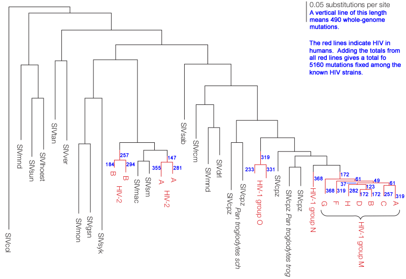
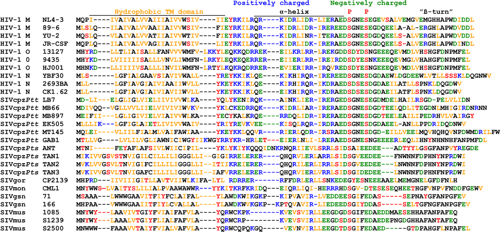
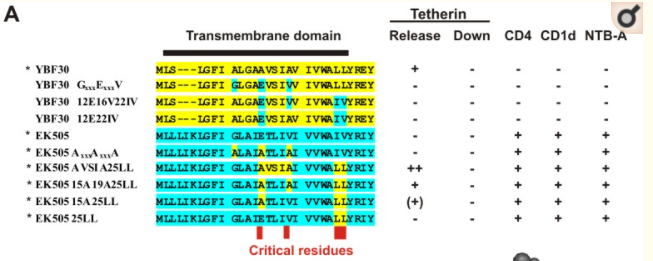

# HIV Evolution

<aside>
	Published:  October 2017 
	Updated: May 3, 2018
</aside>
<q>"The human immunodeficiency virus... is one of the fastest evolving entities known."[^berkeley-2017]</q>

<q>HIV shows stronger positive selection [having more beneficial mutations] than any other organism studied so far."[^rambaut-2004]</q>

<q>"HIV evolves extremely rapidly, exhibiting the highest recorded biological mutation rate currently known to science."[^andrews-2017]</q>

## Overview

Since first entering humans about 100 years ago, HIV has had more ++mutations++ and more replications than (for example) the fewer than 10^20^ mammals that would've ever lived during a 200 million year evolutionary timeline.[^user813801-2014] [^behe-2007]  Even though natural selection is much stronger in an ++RNA++ virus like HIV than in large ++genome++ mammals,[^rambaut-2004:a] [^lynch-2006] [^sanford-2007]  HIV has evolved very little terms of new or modified function.  This strongly suggests evolution would not have enough opportunity to create the the vast and largely different information in the genomes of all mammals, where there was less opportunity for evolution to act.

During the 100 years of HIV evolution there's been:

1. About 14,000 replication cycle "generations" of HIV (still much less than the total number of mammal generations).
2. A total of about 6x10^22^ new HIV virus particles being produced.
3. About 10^22^ total HIV mutations among all those new virus particles.
4. About 5,000 or fewer ++constructive mutations++ becoming ++fixed++ within the various HIV subtypes.

The rest of this article quantizes HIV population sizes, mutations, and useful evolution.

## History and Groups

HIV came from SIV (simian immunodeficiency virus) in chimpanzees, which in turn came from SIV in monkeys:

1. SIV is a ++retrovirus++ that infects monkeys and apes, with different SIV variants infecting each species.  In some African monkeys SIV is not known to cause any harmful effects.[^sharp-2010:a]
2. At an unknown time in the past, two different forms of SIV entered Chimpanzees and combined into a new strain[^sharp-2010:b] that was sometimes deadly.[^sharp-2010:c] 
3. Sometime "around the 1920s,"[^sharp-2010] SIV first entered humans, becoming HIV.  

HIV is a modified form of SIV that infects humans, found in two main types:

**HIV-1** "is most closely related to SIVcpz,"[^sharp-2010] the form of SIV found in some chimpanzees.  HIV-1 is categorized into "groups M, N and O which represent separate transfers from chimpanzees,"[^rambaut-2004] although "one or two of those transmissions may have been via gorillas."[^sharp-2010]

**HIV-2** is "most closely related to SIVsm"[^rambaut-2004] found in sooty mangabey monkeys,  HIV-2 is believed to have been transferred from these monkeys to humans "at least four"[^rambaut-2004] times.

HIV-1 group M (for major) accounts for the "vast majority (perhaps 98%) of HIV infections worldwide"[^sharp-2010] while all other HIV types are mostly or entirely restricted to West Africa.[^rambaut-2004] ++Molecular clocks++ suggest that HIV1 group M first originated "around the 1920s"[^sharp-2010] and the other groups don't "appear older than HIV-1 group M."[^sharp-2010]

## Population Size
<aside>
	
Electron microscope image of a follicular dendritic cell, artificially colored.
Follicular dendritic cells are major reservoirs for HIV-1 within the lymph nodes.
</aside>
### Population Per Infected Person

Various studies estimate that about 10^10^ to 10^12^ HIV viruses exist in an infected person:

{[class="small style1 td1-25"]}

| Study                                | Estimate                                                     |
| ------------------------------------ | ------------------------------------------------------------ |
| Haase et al, 1996[^haase-1996]       | "the FDC-associated [follicular dendritic cell] pool of HIV RNA would be about **10^11^** copies in a 70-kg HIV infected individual."   Follicular dendritic cells are major reservoirs for HIV-1 within the lymph nodes. |
| Perelson et al, 1996[^perelson-1996] | "The estimated average total HIV-1 production was 10.3x10^9^ ++virions++ per day." This is **1.3x10^10^**   "the average HIV-1 generation time--defined as the time from release of a virion until it infects another cell and causes the release of a new generation of viral particles--is **2.6 days**." |
| Brown, 1997[^brown-1997])            | "HIV infections are initiated from a small inoculum and increase very rapidly to **≈10^10^** in the first stages of infection, so a considerable reduction in Ne [effective population size] would be expected to be due to this expansion." |
| Rambaut et al, 2004[^rambaut-2004]   | "[HIV] has a viral generation time of ~2.5 days and produces **~10^10^ to 10^12^** new virions each day" Perelson, 1996 is cited for this estimate. |
| Coffin et al, 2013[^coffin-2013]     | "In the case of HIV-1 infection, perhaps **10^11^** virions are produced daily; the number of cells infected in the same time span is... unlikely to exceed 10^9^."  "this result is consistent with the high natural turnover rate of activated effector memory helper T cells, the primary target for HIV-1 infection, on the order of 10^10^ cells per day, of which only a small fraction are infected after the initial primary infection phase." |
### Estimated Observed and Effective Population Size Discrepancies

<aside>

<h4 id="Behe--Musgrave-HIV-Debate">Behe / Musgrave HIV Debate</h4>
    
In 2007, Ian Musgrave (geneticist, anti-ID, pictured) and Michael Behe (biochemist, pro-ID) debated in a series of back and forth blog posts about the HIV population size and how much it had evolved (the same topic as this article):

<ol>
    <li>Musgrave: <a href="http://pandasthumb.org/archives/2007/10/an-open-letter-3.html">
        An Open Letter to Dr. Michael Behe</a>&nbsp; (Oct 22, 2007).&nbsp; Musgrave	disproves Behe's claim that HIV evolved no new binding sites since first entering humans.</li>
    <li>Musgrave: <a href="https://pandasthumb.org/archives/2007/11/an-open-letter-4.html">
        An Open Letter to Dr. Michael Behe (Part 2)</a>&nbsp; (Nov 11, 2007).&nbsp; Musgrave points out additional evolutionary gains seen in HIV.</li>
    <li>Behe:
        <a href="https://web.archive.org/web/20160812193714/http://behe.uncommondescent.com/2007/11/response-to-ian-musgraves-open-letter-to-dr-michael-behe-part-1/">
        Response to Ian Musgrave’s “Open Letter to Dr. Michael Behe,” Part 1</a>&nbsp; (Nov 12, 2007)&nbsp; Behe criticizes the tone of the debate, no biology discussed.</li>
    <li>Musgrave: <a href="http://pandasthumb.org/archives/2007/11/an-open-letter-5.html">
        An Open Letter to Dr. Michael Behe (Part 3)</a>&nbsp; (Nov 12, 2007)</li>
    <li>Behe:
        <a href="https://web.archive.org/web/20160812181707/http://behe.uncommondescent.com/2007/11/response-to-ian-musgraves-open-letter-to-dr-michael-behe-part-2/">
        Response to Ian Musgrave’s “Open Letter to Dr. Michael Behe,” Part 2</a>&nbsp; (Nov 13, 2007.&nbsp; Behe points out that VPU could already degrade CD4 in SIV.</li>
    <li>Musgrave:
        <a href="http://www.pandasthumb.org/archives/2007/11/an-open-letter-6.html"> An Open Letter to Dr. Michael Behe (Part 4)</a>&nbsp; (Nov 13, 2007)</li>
    <li>Behe: <a href="https://web.archive.org/web/20160812123836/http://behe.uncommondescent.com/2007/11/response-to-ian-musgraves-open-letter-to-dr-michael-behe-part-3/">
        Response to Ian Musgrave’s “Open Letter to Dr. Michael Behe,” Part 3</a>&nbsp; (Nov 14, 2007)</li>
    <li>Musgrave:
        <a href="http://www.pandasthumb.org/archives/2007/11/an-open-letter-7.html"> An Open Letter to Dr. Michael Behe (Part 5)</a>&nbsp; (Nov 15, 2007)</li>
    <li>Behe:
        <a href="https://web.archive.org/web/20160812182716/http://behe.uncommondescent.com/2007/11/response-to-ian-musgraves-open-letter-to-dr-michael-behe-part-4/">
        Response to Ian Musgrave’s “Open Letter to Dr. Michael Behe,” Part 4</a>&nbsp; (Nov 15, 2007).&nbsp; Michael Behe agrees that figure 7.4 in Edge of Evolution should have shown HIV evolving one new binding spot, not zero.</li>
    <li>Musgrave:
        <a href="http://www.pandasthumb.org/archives/2007/11/an-open-letter-8.html"> An Open Letter to Dr. Michael Behe (Part 6)</a>&nbsp; (Nov 16, 2007).&nbsp; Musgrave argues that HIV counts per infected persion are around 103 to 105, not 109 to 1010, citing questionable estimates based on HIV genetic diversity, instead of observed population counts.</li>
    <li>Behe:
        <a href="https://web.archive.org/web/20160812181713/http://behe.uncommondescent.com/2007/11/response-to-ian-musgraves-open-letter-to-dr-michael-behe-part-5/">
        Response to Ian Musgrave’s “Open Letter to Dr. Michael Behe,” Part 5</a>&nbsp; (Nov 16, 2007)</li>
    <li>Musgrave:
        <a href="http://www.pandasthumb.org/archives/2007/11/an-open-letter-9.html"> An Open Letter to Dr. Michael Behe (Part 7)</a>&nbsp; (Nov 16, 2007</li>
    </ol>
</aside>
Rather than by counting and extrapolating, some studies (not included above) measure HIV genetic diversity, and use that to estimate *effective* population sizes in the range of 450 to 10^5^ HIV ++virions++ per person.[^althaus-2005] These estimates "are many orders of magnitude lower than the census size--a result that has surprised and perplexed many in the HIV-1 community."[^tan-2005]

However, models estimating effective population "are heavily influenced by variations in ++allele++ frequency" and should "be taken as a lower bound" with the true values "likely to be much higher."[^maldarelli-2013] This is because low genetic diversity in HIV leads to lower effective population size estimates.  Even if the real population size is much larger.

Why would HIV have low genetic diversity? Because in each HIV infection, the HIV starts as only a small number of virus particles and then expands to nearly a trillion viruses. And rapidly expanding populations have lower genetic diversity.  HIV is also subject to strong ++selection++, and selection removes variants from a population.

Therefore since the effective population size is misleading, and since observation trumps such models, the observed population size estimates in the table above are more reliable.

## Cumulative Population Size

HIV reproduces about once every 2.6 days,[^perelson-1996] which over the last 100 years since HIV first entered humans is about 14,000 "generations."  Counting only the last 40 years (1977-2017) when HIV population sizes were significant gives about 5,600 total "generations."

Sadly there are "an estimated 42 million people carrying the [HIV] virus at present."[^rambaut-2004] Multiplied by 10^11^ HIV virions per person gives 4x10^18^ HIV virions existing at any given time.

If "perhaps 10^11^ virions are produced daily,"[^coffin-2013] 14,600 days over 40 years times 10^11^ virions per person per day times 4.2x10^7^ people with HIV gives a total of 6.13x10^22^ HIV virions that have ever existed in humans. That gives us:

{[class="highlight compact"]}

1. 14,000 reproduction cycle "generations" of HIV over the last 100 years.
2. 4x10^18^ total HIV virions existing in all humans at any given time.
3. 6x10^22^ total HIV virions existing in all humans over the last 100 years.

However, only one in 100 or fewer virions go on to infect other cells: "perhaps 10^11^ virions are produced daily,"[^coffin-2013] although "the number of cells infected in the same time span... is unlikely to exceed 10^9^ "[^coffin-2013]

## HIV Mutations

HIV has "about 2×10^-5^ mutations per site per replication cycle."[^zanini-2017] An earlier study "reported a much higher mutation rate," but it "focused on integrated ++provirus++ and might not reflect the mutational frequency in the circulating HIV-1 virions."[^zanini-2017]  The HIV-1 genome is 9181 ++nucleotides++, so that works out to:

{[class="highlight compact"]}

1. HIV has about 0.18 mutations per replication, or one mutation every 5.6 replications.
2. HIV genomes have had a total of about 10^22^ mutations since first entering humans about 100 years ago.

### Exploring Mutation Space

This means that during the last 100 years, a point mutation has occurred at every single letter of HIV's 9181 nucleotide genome about 1.1x10^18^ times (10^22^ / 9181).  If we account for point mutations changing nucleotides to one of three other letters, every nucleotide of HIV's genome has been tried out 3.7x10^17^ times (1.1x10^18^ / 3), and every possible combination of two nucleotide mutations has been tried about 6.1x10^8^ times (previous number divided by 9191*3).

For comparison, the common bacteria E. coli have a genome of about 5.4 million nucleotides, and have one mutation every 1000 replications.[^lee-2012]  Therefore it would take a population of about 16.2 billion E. coli (5.4 million times 1000 times 3) to mutate every possible nucleotide, and a population of about 2.6x10^20^ E. coli to try out every possible combination of two mutations.

For humans, the numbers are similarly large.  We have a 3 billion nucleotide haploid genome and about 33 mutations per haploid genome per generation.  Thus it would take about 273 million human reproductions to test every possible single nucleotide mutation, and 2x10^26^ human reproductions to try every possible combination of two mutations.  The table below extrapolates further for combinations of 3, 4, and 5 mutations:

{[class="small style1" style="width: 100%"]}

| Every combination of | Times found by HIV | E coli Needed | Humans Needed |
| -------------------- | ------------------ | ------------- | ------------- |
| 1 mutation           | 1.1x10^17^         | 1.6x10^10^    | 2.7x10^8^     |
| 2 mutations          | 1.3x10^13^         | 2.6x10^20^    | 7.5x10^16^    |
| 3 mutations          | 4.8x10^8^          | 4.3x10^30^    | 2.0x10^26^    |
| 4 mutations          | 17,301             | 6.9x10^40^    | 5.6x10^33^    |
| 5 mutations          | 0.63               | 1.1x10^51^    | 1.5x10^42^    |

In other words, it would take about 6.9x10^40^ E. coli to try out every possible combination of 4 specific mutations in its genome.  This is more than the total of 10^40^ cellular organisms estimated to have existed on a 4-billion year old Earth.[^user813801-2014] [^behe-2007]  Yet in the last 100 years, HIV has tried out every possible combinations of 4 mutations in its own (much smaller) genome.  And has done so about 17,301 times.

What's the purpose of this comparison?  When HIV uncovers evolutionary gains that require 3, 4 or even 5 simultaneous, specific mutations to all be present, we should not expect other organisms to evolve such specific mutations at all.  Even if there are thousands of possible ways to evolve through such paths of simultaneous mutations.

## Total Evolution

The annotated[^rambaut-2004] chart below shows all strains of HIV circulating within humans (red lines) and their inferred origins from monkey and ape SIV (gray lines). Longer vertical lines indicate more fixed mutations.  Blue numbers indicate the total number of mutations fixed during the time represented by the red vertical lines.  The sum of all blue numbers indicates that about 5,160 mutations have become fixed among the various HIV subtypes since first entering humans.

Confounding these estimates, most evolution occurs within a single host and is then lost:  "HIV evolves extremely rapidly within individuals, viral evolution is somewhat slower on a population level,"[^andrews-2017]  Although there's still "extensive viral diversity both within and between hosts,"[^andrews-2017]

Therefore taking the fixed mutations per group makes the estimate of 5,160 fixed mutations rather arbitrary.  We'd estimate a smaller number of mutations if we randomly picked a single HIV-1M virus and counted the mutations in its lineage since it first entered humans.  Or if we counted all mutations among every person with HIV we would get a much larger number of mutations, many times  the ~9181 nucleotides in an average HIV-1 genome.  Identical mutations would be counted many times over.

Likewise if we wanted to compare the number of mutations separating humans and mice, we would compare the average human genome to the average mouse genome, but we wouldn't include the billions of unique mutations present in small numbers within both human and mouse populations.

The chart above omits HIV-1 group M subtypes H through K, which would increase the number of fixed mutations beyond 5,160.  However, even though HIV shows "stronger positive selection than any other organism studied so far,"[^rambaut-2004] and most mutations with HIV's ENV gene "confer a selective advantage,"[^rambaut-2004] (HIV has about 10 genes) it's unlikely that all 5,160 mutations are positively selected and ++constructive++.  So we will use the upper-bound estimate:

{[class="highlight"]}

Since first entering humans in the 1920s, about 5,000 or fewer constructive mutations became fixed among the various HIV subtypes.

## Specific Evolutionary Gains 

### Vpu

Tetherin is a protein used inside mammal cells to build tethers "between virus envelopes and the cytoplasmic membrane of the cell, preventing the release of those viruses."[^sharp-2010]

Some strains of SIV have a Vpu gene that produces a protein that counteracts tetherin.  For example "Vpu protein of SIVgsn has been shown to counteract greater spot-nosed monkey tetherin."[^sharp-2010] But the strain of SIV that infects chimpanzees uses Vpu only for "anti-CD4 activity"[^sharp-2010] and does not use Vpu against tetherin.  CD4 is a protein on cell surfaces that SIV and HIV use to enter T-cells.

During the process of entering humans, HIV-1 groups M and N both and separately reactivated Vpu's anti-tetherin ability: "the vpu gene did not diverge to the extent that the activity could not be rescued."[^sharp-2010] "When SIVcpz crossed the species barrier to infect humans... Vpu subsequently (re)gained its tetherin-antagonizing function."[^kuhl-2011]  Through this evolution, "HIV-1 group N Vpu has lost [its] anti-CD4 activity,"[^sharp-2010] although this ability was retained in HIV-1 group M.

However "it is likely that SIV jumped into humans many times"[^sharp-2010] before it led to the modern AIDS epidemic.  Since these species-crossing attempts occurred perhaps far into the remote past, it's not possible to estimate how many viral replications occurred before SIV was able to discover these mutations.

<small>The differences in the Vpu protein in HIV/SIV in various species.[^sauter-2010]  Each letter represents an amino acid. "Hydrophobic TM [transmembrane] domain", "α-helix", and "β-turn" are different regions of the protein.</small>

{[class="compact small"]}

- HIV-1 = humans
- SIVcpz = chimpanzee
- SIVgor = gorilla
- SIVmon = mona monkeys
- SIVgsn =greater spot-nosed monkeys
- SIVmus = mustached monkeys

### Is the evolution of HIV's Anti-tetherin activity Irreducibly Complex?

Some evolutionists point to HIV-1's anti-tetherin activity as proof that evolution can create features that require a large number of simultaneous mutations in many organisms.  This is a non-sequitur for two reasons.  First, as noted above, HIV has had the mutational resources to explore most possible combinations of five mutations.  Exploration this vast can only happen in RNA viruses like HIV, since they have huge populations, very small genomes, and very high mutation rates.  Larger and more complex organisms would never be able to explore that many combinations even if given trillions of years.  Irreducible complexity (as defined by its originator, Michael Behe[^behe-2007-2]) is a function of population size--larger populations can overcome more simultaneous mutations.

Second, HIV-1's anti-tetherin ability seems as if it was acquired gradually one improving mutation at a time, rather than occurring through multiple simultaneous mutations.

#### HIV-1 Group M

In order for HIV 1 group M's Vpu gene to counteract tetherin, at least three ++amino acids++ are needed in the Vpu's transmembrane region:  "three amino acid positions, A14, W22, and, to a lesser extent, A18, are required for tetherin antagonism."[^vigan-2010]  Another research group reached similar conclusions by splicing that and an adjacent region into a Vpu gene from chimpanzee SIV:  "SIVcpz Vpu was able to completely rescue the tetherin restriction phenotype when it encoded both regions 1-8 and 14-22 from HIV-1."[^lim-2010] The researchers saw that "chimeras within each region yielded intermediate ++phenotypes++, suggesting that these regions harbored several minor determinants."[^lim-2010]

We can calculate the mutational path for those three amino acids to mutate to get anti-tetherin activity in HIV-1 group M.  The diagram above (under Hydrophobic TM domain) shows that HIV-1 group M's Vpu protein differs from the SIV's at amino acid positions 14 and 18.  The W at position 22 was already present in chimpanzee SIVcpzPtt, the groups that most closely resemble human HIV-1 groups M and N.  The necessary mutations:

- **Position 14:**  Chimpanzee SIVcpzPtt has amino acid G (glycine) at position 14.  A DNA codon table shows that going from amino acid G (glycine) to A (alanine) at position 14 would involve changing only one nucleotide.
  - SIVcpzPtt MB66 has a V (valine) at position 14, which would also only involve changing one nucleotide to mutate to the A (alenine) of HIV 1 group M.
  - SIVcpzPtt MT145 and GAB1 have an I and an L at position 14, which would require changing two nucleotides, which would require changing two nucleotides to become an A.
- **Position 18:**  Most Chimpanzee CIVcpzPtt strains have amino acid E (glutamic acid) at position 18.  Changing that to amino acid A (alenine) in HIV-1 group M would take only one mutation.
  - SIVcpzPtt MT145 and GAB1 have an L at position 18, which would require changing two nucleotides to become an A.
- **Position 22:**  This position is already a W in all SIVcpzPtt.
- **Positions 1-8?:**  Possible additional unknown mutations at these spots may confer additional anti-tetherin activity, since this region "harbored several minor determinants."[^lim-2010] Since chimeras within this region "yielded intermediate phenotypes",[^lim-2010]  we don't have evidence any of these mutations would need to happen simultaneously.

Therefore, HIV-1 group M's anti tetherin activity could have begun with a single mutation changing the amino acid at position 14, then a second mutation that enhanced the anti-tetherin activity at position 18.

Of course there were many other mutations that don't affect its anti-tetherin ability.  It should be stated that this is a new mutational pathway that grants anti-tetherin ability, not simply reversions to the amino acids found in monkey SIVs.

#### HIV-1 Group N

Unfortunately, I haven't found conclusive data on whether the evolution of anti-tetherin activity in HIV-1 group N is or isn't gradual.  A 2012 study found that "four TMD amino acid substitutions (E15A, V19A, I25L and V26L) were sufficient to render the SIVcpz Vpu active against human tetherin."[^sauter-2012]  Figure 5A in their paper (reproduced below) shows human HIV-1 group N in yellow, SIV in blue, and how the researches mixed and matched the amino acids to get different results:

- Changing amino acids at positions 25-26 alone is marked as making no difference, although the gray triangle above the "25" in the second part of figure 5B (not reproduced here) might indicate very slight improvement.
- Changing amino acids at 15 and 25-26 shows low anti-tetherin activity, 
- Changing amino acids at 15, 19, and 25-26 grants moderate anti-tetherin activity.
- Also changing 16-18 grants high anti-tetherin activity.

Unfortunately the researchers didn't test position 15 by itself, 25 and 26 separately, or 16-18 separately, so we don't know if doing so grants stepwise gains.

<small>Each row is a list of amino acids in part of the VPU protein from a strain of HIV, SIV, or an artificially created hybrid.  Yellow sequences are from human HIV-1 group N, blue from Chimpanzee SIV.  Under the Tetherin Release column, - indicates no activity, (+) is low activity, + is moderate activity, and ++ is high activity.</small>

### Evading HLA

The human leukocyte antigen system is a set of genes that creates proteins on cell surfaces to present viral ++proteins++ to white blood cells.  A 2011 study looked at HIV evolution within a Chinese sub-population over a course of 10 years.  Among RNA letter variations seen in the HIV gag, reverse transcriptase, integrase, and nef genes, finding "24%-56% were sites of HLA-associated selection."[^dong-2011]  In simple terms, these mutations helped HIV survive, likely by changing the structure of HIV proteins enough that they were no longer recognized by the immune system.[^guha-2013:a]

However, some of these mutations end up harming HIV in other ways, and those often revert when infecting a new host with a different immune system:

> The long-term stability of T-cell escape mutants depends on the ++fitness++ cost incurred by the virus; variants with a high-fitness cost tend to revert to the original sequence after transmission to a host without the selecting HLA ++allele++, unless an appropriate compensatory mutation is also present.  Other variants revert only slowly, if at all...[^dong-2011]

### Other notable evolutionary gains

This section is incomplete, although there are many other gains that could be documented here.

## Sources
[^althaus-2005]: Althaus, Christian L et al.  "[Stochastic Interplay between Mutation and Recombination during the Acquisition of Drug Resistance Mutations in Human Immunodeficiency Virus Type 1](http://jvi.asm.org/content/79/21/13572.full)."  J. Virol.  2005.  <small>See [table 1](http://jvi.asm.org/content/79/21/13572/T1.expansion.html) for a list of seven previous estimates of HIV-1 per-human effective population size. Estimates range from 450 to 10^5^.</small>
[^andrews-2017]: Andrews et al.  "[Recent advances in understanding HIV evolution](https://f1000research.com/articles/6-597/v1)."  F1000 Research.  2017.
[^behe-2007]: Behe, Michael J.  "The Edge of Evolution."  2007.  [Page 63](https://books.google.com/books?id=HGuwiG78ILcC&q=%22slightly%20fewer%20than%201040%20cells%22).  <small>Behe estimates: "throughout the course of history there would have been slightly fewer than 10^40^ cells."</small>
[^behe-2007-2]: Behe, Michael J.  "The Edge of Evolution."  2007.  Page 60.<small>Behe writes:  "Recall that the odds against getting two necessary, independent mutations are the multiplied odds for getting each mutation individually. What if a problem arose during the course of life on earth that required a cluster of mutations that was twice as complex as a CCC? (Let’s call it a double CCC.) For example, what if instead of the several amino acid changes needed for chloroquine resistance in malaria, twice that number were needed? In that case the odds would be that for a CCC times itself. Instead of 10^20 cells to solve the evolutionary problem, we would need 10^40 cells."  A "CCC" is Behe's own term: "chloroquine-complexity cluster."  It's what he calls the two simultaneous mutations needed for p. falciparum (the parasite that causes malaria) to evolve resistence to the drug chloroquine.</small>
[^berkeley-2017]:University of California, Berkeley.  "[HIV: the ultimate evolver](http://evolution.berkeley.edu/evolibrary/article/medicine_04)."  Understanding Evolution.  Retrieved 2017.  <small>Mirrors:  [Archive.org](https://web.archive.org/web/20171213085208/https://evolution.berkeley.edu/evolibrary/article/medicine_04)</small>
[^brown-1997]: Brown, Andew J. Leigh.  "[Analysis of HIV-1 env gene sequences reveals evidence for a low effective number in the viral population](http://www.pnas.org/content/94/5/1862.full.pdf)."  PNAS.  1997.
[^coffin-2013]: Coffin, John et al.  "[HIV Pathogenesis: Dynamics and Genetics of Viral Populations and Infected Cells](https://www.ncbi.nlm.nih.gov/pmc/articles/PMC3530041/)."  Cold Spring Harb Perspect Med.  2013.
[^dong-2011]: Dong et al.  "[Extensive HLA-driven viral diversity following a narrow-source HIV-1 outbreak in rural China](https://www.ncbi.nlm.nih.gov/pmc/articles/PMC3743462/)."  Blood.  2011.
[^dubrow-2014]: Dubrow, Aaron.  "[Computing a Cure for HIV: 9 Ways Supercomputers Help Scientists Understand and Treat the Virus](http://www.huffingtonpost.com/aaron-dubrow/computing-a-cure-for-hiv-_b_5512311.html)." Huffington Post.  2014.<small>The header image here is a modified version of the image in this article.</small>
[^guha-2013]: Guha, et al.  "[Innate Immune Evasion Strategies by Human Immunodeficiency Virus Type 1](https://www.ncbi.nlm.nih.gov/pmc/articles/PMC3767209/)."  ISRN AIDS.  2013.
[^guha-2013:a]: <small>"The HIV-1 RNA genome can be mutated randomly which helps the virus to evade immune recognition by the host."</small>
[^haase-1996]: Haase, A. T. et al.  "[Quantitative image analysis of HIV-1 infection in lymphoid tissue](https://www.ncbi.nlm.nih.gov/pubmed/8875941)."  Science.  1996.  Middle of page 7. <small>Mirrors:   [Amazon S3](https://sfi-edu.s3.amazonaws.com/sfi-edu/production/uploads/sfi-com/dev/uploads/filer/dc/e0/dce029d8-8c50-40a0-b714-b84d106325be/96-07-045.pdf)</small>
[^kuhl-2011]: Kuhl, Björn D. et al.  "[Tetherin and its viral antagonists](https://www.ncbi.nlm.nih.gov/pmc/articles/PMC3087111/)."  J Neuroimmune Pharmacol.  2011.
[^lee-2012]: Lee, Heewook et al.  "[Rate and molecular spectrum of spontaneous mutations in the bacterium Escherichia coli as determined by whole-genome sequencing](http://www.pnas.org/content/pnas/109/41/E2774.full.pdf)."  PNAS.  2012.  <small>The authors estimate "2.2x10^-10^ mutations per nucleotide per generation or 1.0x10^-3^ mutations per genome per generation"</small>
[^lim-2010]: Lim, Efrem S. et al.  "[Ancient Adaptive Evolution of Tetherin Shaped the Functions of Vpu and Nef in Human Immunodeficiency Virus and Primate Lentiviruses](http://jvi.asm.org/content/84/14/7124.full)."  Journal of Virology.  2010.
[^lynch-2006]: Lynch, Michael.  "[The Origins of Eukaryotic Gene Structure](http://mbe.oxfordjournals.org/content/23/2/450.full)."  Mol Bio Evol.  2006.  <small>Lynch writes: "the efficiency of natural selection declines dramatically between prokaryotes, unicellular eukaryotes, and multicellular eukaryotes" and "all lines of evidence point to the fact that the efficiency of selection is greatly reduced in eukaryotes to a degree  that depends on organism size." Lynch explains this because more complex organisms typically have 1. smaller population sizes, 2. "decreases in the intensity of recombination" and 3. lower mutation rates per nucleotide.</small>
[^maldarelli-2013]: Maldarelli, Frank et al.  "[HIV Populations Are Large and Accumulate High Genetic Diversity in a Nonlinear Fashion](http://jvi.asm.org/content/87/18/10313.full.pdf)."  J. Virology.  2013.
[^perelson-1996]: Perelson, Alan S et al.  "[HIV-1 dynamics in vivo: virion clearance rate, infected cell life-span, and viral generation time](https://www.ncbi.nlm.nih.gov/pubmed/8599114)."  Science.  1996.
[^rambaut-2004]: Rambaut, Andrew et al.  "[The causes and consequences of HIV evolution](http://www.nature.com/nrg/journal/v5/n1/full/nrg1246.html)."  Nature.  2004.  <small>Mirrors: [University of Wisconsin](http://pages.stat.wisc.edu/~larget/Genetics629/Fall2009/hiv.pdf)</small>
[^rambaut-2004:a]:  <small>The authors write:  "HIV shows stronger positive selection than any other organism studied so far."  Hiv is an example how natural selection is strongest on small, simpler genomes.</small>
[^roach-2012]: Jared C. Roach et al.  "[Analysis of Genetic Inheritance in a Family Quartet by Whole-Genome Sequencing](http://science.sciencemag.org/content/328/5978/636)."  Science.  2012.  <small>The authors "estimated a human intergeneration mutation rate of ~1.1x10^-8^ per position per haploid genome." This times 3 billion nucleotides in a human haploid genome is 33.  The whole (diploid) genome mutation rate would be 66.</small>
[^sanford-2007]: Sanford, John, et al.  "[Mendel's Accountant: A biologically realistic forward-time population genetics program.](http://www.scpe.org/index.php/scpe/article/download/407/77)"  Scalable Computing.  2007.<small>The authors explain: "each nucleotide in a smaller genome on average plays a greater relative role in the organism’s fitness"</small>
[^sauter-2012]: Sauter, Daniel.  "[Human Tetherin Exerts Strong Selection Pressure on the HIV-1 Group N Vpu Protein](https://www.ncbi.nlm.nih.gov/pmc/articles/PMC3534379/)."  PLoS Pathogen.  2012.
[^sauter-2010]: Sauter, Daniel et al.  "[The evolution of pandemic and non-pandemic HIV-1 strains has been driven by Tetherin antagonism](https://www.ncbi.nlm.nih.gov/pmc/articles/PMC2779047/)."  Cell Host Microbe.  2010.
[^sharp-2010]:Sharp, Paul M et al.  "[The evolution of HIV-1 and the origin of AIDS](https://www.ncbi.nlm.nih.gov/pmc/articles/PMC2935100/)."  Philos Trans R Soc Lond B.  2010.<small>Mirrors:  [Archive.org](https://web.archive.org/web/20171229140219/https://www.ncbi.nlm.nih.gov/pmc/articles/PMC2935100/)</small>
[^sharp-2010:a]:	<small>"More than 40 species of African monkeys are infected with their own, species-specific, SIV and in at least some host species, the infection seems non-pathogenic."</small>
[^sharp-2010:b]: <small>"Chimpanzees acquired from monkeys two distinct forms of SIVs that recombined to produce a virus with a unique genome structure."</small>
[^sharp-2010:c]: <small>"We have found that SIV infection causes CD4+ T-cell depletion and increases mortality in wild chimpanzees, and so the origin of AIDS is more ancient than the origin of HIV-1."</small>
[^snoeck-2011]: Snoeck, Joke et al.  "[Mapping of positive selection sites in the HIV-1 genome in the context of RNA and protein structural constraints](https://retrovirology.biomedcentral.com/articles/10.1186/1742-4690-8-87)."  Retrovirology.  2011.
[^tan-2005]: Tan, W. Y.  "Deterministic and Stochastic Models of AIDS Epidemics and HIV Infections with Intervention."  World Scientific.  2005.  <small>Mirrors:  [Google books](https://books.google.com/books?id=1mpL1ygISfQC&q=%27Current+attempts+to+add+up%27).</small>
[^user813801-2014]:  "[How many organisms have ever lived on Earth?](https://biology.stackexchange.com/a/19569)"  Biology.StackExchange.  2014.  <small>The answer estimates: "5.95 * 10^39^ Bacteria that ever lived," and most cellular organisms are bacteria.</small>
[^vigan-2010]: Vigan, Raphaël et al.  "[Determinants of Tetherin Antagonism in the Transmembrane Domain of the Human Immunodeficiency Virus Type 1 Vpu Protein](http://jvi.asm.org/content/84/24/12958.full)."  Journal of Virology.  2010.
[^zanini-2017]: Zanini, Fabio et al. "[In vivo mutation rates and the landscape of fitness costs of HIV-1](https://academic.oup.com/ve/article/3/1/vex003/3060990/In-vivo-mutation-rates-and-the-landscape-of)" Virus Evolution.  2017.
