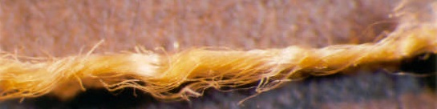
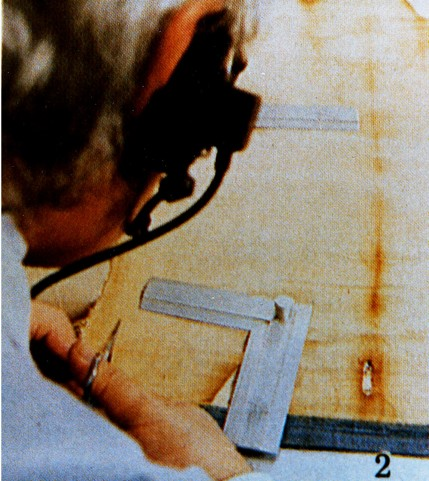
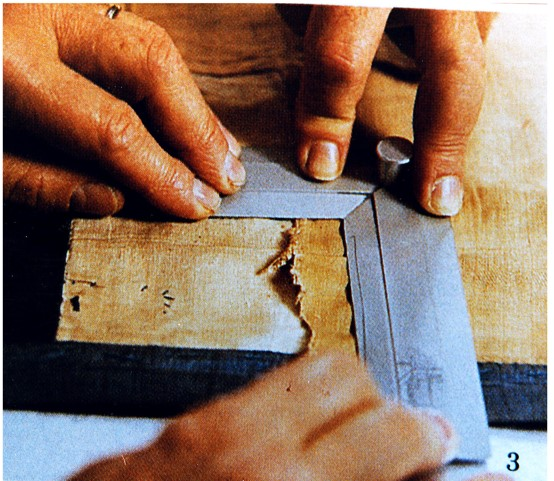
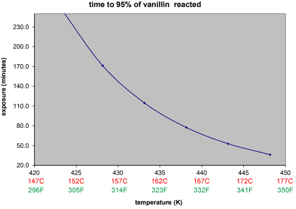
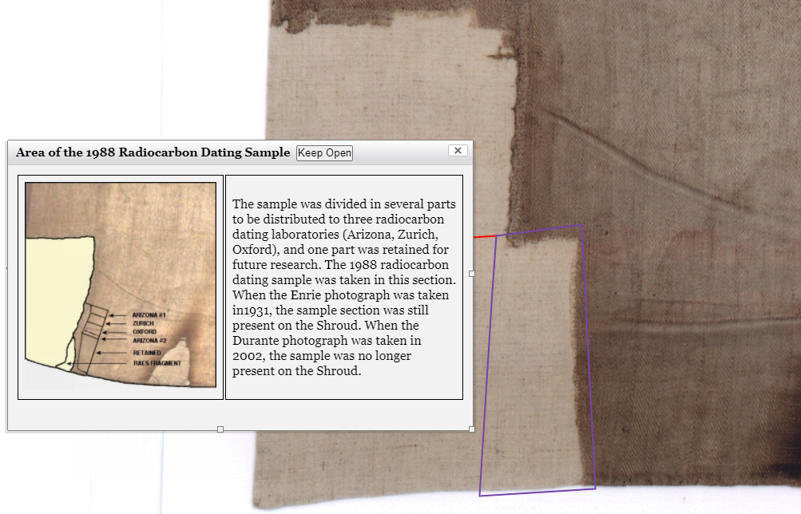
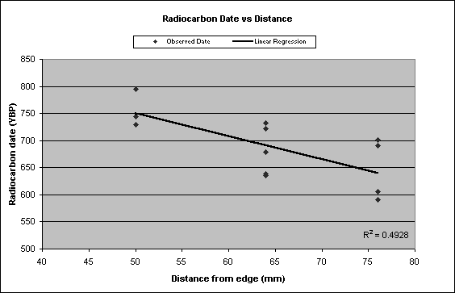
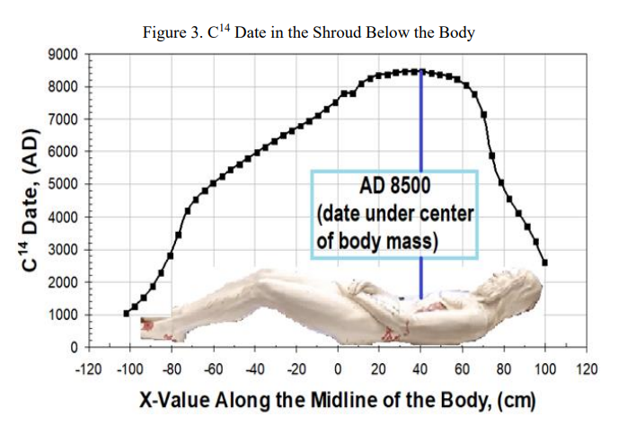

<aside>
    by Eric 
    Published:  June 2022 
     
    
On June 19, 2022, this article was reviewed by Joe Marino, who provided minor corrections.  Marino is known for discovering that the material used for the 1988 carbon dating is from a repared area, and is also the author of an 800 page book on that carbon dating.[^mitchell-2021]  Marino describes his credentials as of 2022:  "I have studied the Shroud of Turin for over forty-five years and innumerable hours. I have read all the major works on it in the English language. I have written two books and dozens of articles about it. I have made presentations at international conferences and know some of the scientists that did hands-on testing of it. I have one of the largest personal English-language collections of Shroud materials in the world and make it a point to scour the Internet for the latest information constantly. The Shroud is something I think about a lot. It is a solitary focus in my life."[^marino-2022-3]

    
    
The shroud of Turin with no image enhancement.  Features to note:

    <ul>
        <li>The body image, as if the shroud was draped over the front and back of a man with crucifixion wounds matching those of Christ, and then the image of that man was flash-burned into the shroud's linen fibers.</li>
        <li>Symmetrical burn holes and water stains, as the shroud was folded when it received this damage in a fire in 1532.</li>
        <li>Portions missing from the bottom left corner, which were removed for study by Gilbert Raes in 1974 and again in 1988 for carbon dating.</li>
    </ul>
</aside>

# Shroud of Turin: 1988 Carbon Dating

<q>"Overall, there have been no serious or convincing challenges to the carbon dating [of the Shroud of Turin in 1988], and none have demonstrated in a laboratory that they are more than speculative theories." -- Historian Dominic Selwood, 2015[^selwood-2015]</q>

<q>"Researchers, in large numbers, now believe that in the 16th century, a corner of the Shroud had been expertly repaired... leading to erroneous carbon 14 dating in 1988." -- Dan Porter, 2022[^porter-2022:b]</q>

==TODO:  Joe Marino's Aug 2023 paper on evidence for repair:  https://www.academia.edu/105958521/FURTHER_EMPIRICAL_DATA_INDICATING_REPAIRS_IN_THE_C_14_SAMPLE_AREA_OF_THE_SHROUD_OF_TURIN .==

## Summary

The Shroud of Turin is a burial cloth appearing to have the imprint of Christ's crucified body flashed into its linen fibers, along with blood from beating and crucifixion wounds as described in the gospels--a possible evidence for the resurrection.  However, carbon dating puts the shroud in the middle ages, not the time of Christ.  This article disproves that carbon date.

In 1988, a small piece was cut from the bottom left corner of the Shroud of Turin and carbon-dated at labs in London, Tucson, and Zurich to around 1260 to 1390 AD.[^damon-1989]  This seemed to line up with another piece of evidence.  In 1389 AD, Bishop Pierre d'Arcis drafted an unsent letter explaining that his colleague knew of a man who painted a fake image of Jesus crucified onto a linen shroud, intending to pass it off as the real burial shroud of Christ.[^darcis-1389]  Subsequent to the 1988 carbon dating results, many news outlets reported the shroud was a forgery, a claim that remains in popular media to this day.

However, the shroud isn't painted.  Rather the image is made from selective dehydration of the shroud's linen.[^fanti-2010:a]  And the 1988 carbon-14 test didn't use material exclusively from the shroud, but rather material from a region of the shroud that where new material was added in 1694 to repair a frayed corner.  Despite the Catholic church preventing researchers further access to the shroud, multiple lines of evidence show that the samples came from a repaired corner:

1. King Umberto II of Italy, whose family used to own the shroud, says that in 1694 they repaired the shroud's heavily frayed and missing edges.[^evaristo-2011]
2. Prior to the 1988 carbon dating, archaeologists William Meacham and Paul Maloney, as well as textile expert John Tyrer each independently warned  that bottom left corner looked like it had non-original material added from a repair, and wouldn't be a good place to cut a sample for carbon dating.[^tyrer-1981:a] [^meacham-1986:a] [^bsts-2000:a] [^maloney-2014:a]
3. That corner is a darker color in both visible light and spectroscopic images.[^tyrer-1981:a] [^adler-1996:a] [^rogers-2005:l]
4. Chemists Ray Rogers, Robert Villareal, and Alan Adler, as well as microscopist John L. Brown, and Pam Moon each independently examined fibers from the shroud.  They found pigments and large amounts of plant gum, likely from tempera paint, coating the fibers from the cloth near and on the carbon dating samples.[^adler-2000:a] [^rogers-2005:f] [^rogers-2005:g] [^rogers-2005:h] [^rogers-2005:i] [^brown-2005:a] [^villarreal-2012:a] [^moon-2015:a] This yellow coating was similar in color to the linen on the rest of the shroud but undyed white cotton was visible on inner fibers and where the thread passed below another (image below).  Brown described this as "obvious evidence of a medieval artisan’s attempt to dye a newly added repair region of fabric to match the aged appearance of the remainder of the Shroud."[^brown-2005:a]  This dye/coating isn't found on the rest of the shroud.   
5. Cotton fibers were found in the carbon dated corner of the shroud by at least 8 different researchers, from 1975 to 2009.[^schwalbe-1982:b] [^raes-1974:a] [^maloney-2014:a] [^rogue-fibers-1988] [^rogers-2005:e] [^rogers-2002:g] [^maloney-2014:b] [^brown-2005:b] [^villarreal-2007] [^heimburger-2009:f] [^freer-waters-2010:c] Not as a surface contaminant, but woven into the threads, and this cotton wasn't found in the rest of the otherwise linen shroud.[^rogers-2008:b] [^maloney-2014:a]
6. Ray Rogers found vanillin (from the breakdown of ++lignin++) in the carbon-14 dated corner of the Shroud, the medieval backing cloth added to the shroud, and other medieval linens, but non in the rest of the shroud, the dead sea scrolls, or other ancient linens.[^rogers-2005:j] [^rogers-2005:k] [^ball-2005:a]
7. The carbon-14 dated corner is thinner[^schwalbe-1982:a] [^freer-waters-2010:b] and has lighter weft (vertical) threads than the rest of the shroud.[^raes-1974:b] 
8. A backing cloth (known as the Holland cloth) was added to the shroud in 1534 to provide support.  However, the part of the Holland cloth behind the corner of the shroud that was carbon dated appears different than the rest of the Holland cloth.  This suggests that sometime after 1534, the bottom left corner of the Holland cloth and the Shroud both went missing (perhaps at the same time) and were later replaced.[^benford-2008:b]
9. Three out of three modern textile repair experts who were shown photos of the carbon-dated corner have claimed to see differences of the linen between the corner and the adjacent cloth.[^marino-2000:a] [^marino-2000:b] [^marino-2000:c]

Additionally, many suspicious and unscientific activities surrounded the 1988 carbon dating of the shroud, including:

1. The carbon-14 team excluded all previous researchers who had worked with the shroud, causing much protest.[^gove-1996:c] [^cold-case-2011:g] [^marino-2017:b] [^berchi-1988]
2. There was a laborious search for a 13th century linen cloth that had the same color and rare 3-in-1 herringbone weave as the Shroud of Turin.  From the same time period when the Shroud was allegedly forged. [^petrosillo-1989] [^tite-1990:a] [^mcdonnell-1994:a] [^mcdonnell-1994:b] [^mcdonnell-1994:b]
3. The entire ceremony to cut carbon-14 samples from the shroud was recorded on video, except when two men inexplicably took the cut samples to another room for 30 minutes and returned with them inside opaque containers.[^gove-1990:a] [^tite-1990:b] [^cold-case-2011:b] [^marino-2016:a] [^schwortz-2012:a] [^schwortz-2014:a]

Together this evidence makes a powerful case the 1988 carbon-date cannot be considered accurate and therefore should not be used as an argument against the Shroud of Turin's authenticity.  The remainder of this article outlines this evidence in great depth.

## Official 1988 Carbon 14 Dating 

<aside>
    
    
Locations on the shroud where the samples were taken for the 1988 Carbon dating.[^antonacci-2017:a]  The top of the shroud is to the right.
    

</aside>

On April  21, 1988, a 1cm x 7cm sample was cut from the the bottom left corner of the Shroud of Turin, from just above where a sample was cut by Gilbert Raes in 1973 and "away from any patches or charred areas."[^damon-1989:a]  As approved by the Archbishop of Turin,[^damon-1989:b] three samples were cut from it and sent to carbon dating labs in Oxford (England), Tucson (Arizona), and Zürich (Switzerland), along with three control samples send to each lab.  Pictured below are remaining portions of the shroud and control samples received by the Arizona lab that weren't used for carbon dating. 

{[class="td1-25 td2-25 td3-25 td4-25"]}

| The Shroud of Turin                                          | Linen from 11th-12th century tomb at  Nubia                  | 2nd century Thebes mummy linen                               | Cope of  Lous d'Anjou threads.  ~1300 AD                     |
| ------------------------------------------------------------ | ------------------------------------------------------------ | ------------------------------------------------------------ | ------------------------------------------------------------ |
|  |  |  |  |
|  |  |  |  |

Images ©2012 STERA, Inc:[^schwortz-2012-2]

The labs used microscopes and various other processes to remove small contaminants,[^damon-1989:c] divided the samples into sub-samples, and then used additional contaminant removing processes:[^damon-1989:d]

{[class="style1 td1-25 small"]}

| Lab     | Treatment Process                                            |
| ------- | ------------------------------------------------------------ |
| Arizona | hydrochloric acid (some samples) sodium hydroxide (some samples) detergent (some samples) distilled water (some samples) ++Soxhlet extractor++ with ethanol to remove lipids (some samples) ++ultrasonic bath++ (some samples) |
| Oxford  | small vacuuming tool cleaning in petroleum ether to remove lipids like fats, oils, and and candlewax hydrochloric acid bleaching with sodium hydroxide (some samples) |
| Zürich  | ultrasonic bath weak or strong hydrochloric acid for some samples weak or strong bleaching with sodium hydroxide for some samples |

The labs then carbon dated their samples using accelerated mass spectrometry, obtaining the ages below:[^damon-1989:e]

{[class="style1 small"]}

| Oxford          | Zürich          | Arizona         |
| --------------- | --------------- | --------------- |
| 1090 to 1220 AD | 1156 to 1278 AD | 1329 to 1389 AD |
| 1175 to 1265 AD | 1172 to 1284 AD | 1225 to 1295 AD |
| 1150 to 1260 AD | 1258 to 1372 AD | 1303 to 1385 AD |
|                 | 1266 to 1356 AD | 1216 to 1282 AD |
|                 | 1220 to 1322 AD |                 |

The non-weighted average of these ranges' midpoints is 1262 AD.  The three labs combined these to a weighted estimated of 1260 to 1390 AD:

> The results of radiocarbon measurements at Arizona, Oxford and Zurich yield a calibrated calendar age range with at least 95% confidence for the linen of the Shroud of Turin of AD 1260 - 1390 (rounded down/up to nearest 10 yr).  These results therefore provide conclusive evidence that the linen of the Shroud of Turin is mediaeval.[^damon-1989]

In 1389 AD, Bishop Pierre d'Arcis drafted a letter to Avignon Pope Clement VII claiming that 34 years earlier, the dean of the church in Lirey had "falsely and deceitfully" obtained the cloth to display as a faked relic.  And his predecessor, Henri de Poitiers had discovered that the cloth "had been cunningly painted" and the artist who had painted it had attested "it was a work of human skill and not miraculously wrought or bestowed."[^darcis-1389]  There is no evidence d'Arcis's letter was ever sent.

However, since the carbon date matched the time of this alleged forgery, many accepted the 1260-1390 date as proof that the shroud was created in the middle ages, and thus couldn't be the burial cloth of Christ.

But this medieval date left many shroud researchers confused.[^ramsey-2008]  It contradicted much other evidence for the shroud being the authentic, first-century burial cloth of Christ.  The following sections describe three possible reasons why the carbon dates were incorrect:

## Theory 1:  Repair / Reweave Contamination

### Pre-1988 warnings that the bottom left corner looked repaired

All samples for the 1988 carbon dating were taken from the same small area at the bottom left corner of the shroud, despite multiple warnings against taking samples all from the same location,[^sturp-1984:a] [^meacham-1986:a] [^meacham-1986:b] [^meacham-2013:a] [^marino-2017:a] [^marino-2017:c] and warnings that the corner may be a later addition and "certainly more subject to contamination than the main body of the cloth." [^meacham-2013:a] [^maloney-2014:a]  

For example, Textile expert John Tyrer warned in 1981 that Gilbert Raes's sample (which was directly below where the 1988 carbon dating sample would be cut) looked like a patch:

> If, however, one examines large photographs of the Shroud, the place where [Gilbert] Raes' sample was taken can be seen between the main area of the Shroud and a rectangular patch. (This is close to the lower right foot of the frontal image.) This patch is below the ‘edging strip’ and appears in photographs as different in tone and hue to the main area. There is therefore some doubt as to whether the sample described by Professor Raes as ‘Piece II’ is the edging strip or part of a patch.  It is important that this matter be resolved if it is intended that the forthcoming carbon dating tests are to be made on Raes' sample. The patch is probably mediaeval.[^tyrer-1981:a] 

And again in 1983:

> It is not easy to determine what is involved here from photographs 43 alone, but doubt remains as to what Raes' Piece II' may have been. Was it wholly edging strip or was it partly a sewn-on mediaeval patch? This should be resolved if it is intended to use the Raes sample in the eventual carbon-dating tests.[^tyrer-1983:a]

Likewise, archaeologist William Meacham wrote in 1986:

> [T]he original sample was taken [by Gilbert Raes in 1973] at the junction of the side strip (believed by some scholars to be a later addition) and the (selvage?) border (possibly treated to prevent unraveling, and certainly more subject to contamination than the main body of the cloth). It could not be considered as a typical or representative sample of the relic.[^meacham-1986:a]

And later recounted:

> Alan Adler and I urged, pleaded, cajoled and literally begged for extensive chemical screening of the samples before being dated, and for at least two sites on the Shroud to be sampled.[^bsts-2000:a]

Archaeologist Paul Maloney:

> STURP found cotton spun into the linen threads in the Raes Corner...  STURP was finding a lot of cotton inside the linen yarns there as opposed to the main body of the Shroud were none was found... It was thought that the "Raes’ Corner" area would not make a good candidate for radiocarbon test samples... On March 22, 1988, nearly a month before the April 21 sample removal session, I sent a copy of this paper to Pope John Paul II... a minimum of three samples must be taken from three **different** areas on the Shroud.[^maloney-2014:a]

If the bottom left corner of the shroud was repaired in or after the middle ages, carbon dating would give the date of that corner instead of the true date of the shroud.  STURP chemist Ray Rogers summarized the debacle:

> The come in and they snip-snip-snip-snip-snip in secret and take the worst possible sample they could. The people that certified the sample are still trying to convince everybody that everybody else is wrong. That those were perfectly valid samples.[^unwrapping-2008:c]

Ample evidence shows that the carbon-dated sample came from a repaired corner:

### King Umberto II says his family repaired the edges in 1694

<aside>
     
    King Umberto II, of Italy
</aside>
King Umberto II was the last king of Italy, reigning only 34 days in the spring of 1946.  His family, the Savoys, owned the Shroud from 1453 until 1983.  Umberto described how according to his family tradition, in generations past his family gave threads from up to 10cm inward from the edges of the Shroud as gifts.  Eventually the shroud edges became so tattered his family was criticized for poor upkeep.  

In 1694 the Savoys enlisted Vittorio Amedeo II and Sebastiano Valfre to repair the edges:  

> [I]t was traditionally affirmed, that at one point in the past, the edges of the Lenzuoli (Sheet) had become so tattered as to cause embarrassment or criticism of the Custodians, and those areas were repaired and rewoven using identical techniques, but obviously with similar, yet newer, materials containing dyes and other medieval manufacturing ingredients, in an attempt to better blend the new sections in, as best possible, with the original fabric.
>
> [...]
>
> That the practice of removing small fragments and even full length or width threads from the outer edges [of] the Holy Shroud, was a family tradition only finally suppressed by Duke Vittorio Amedeo II of Savoy, was another fact Umberto II of Savoy confirmed to Blue Army Founder and Shroud Devotee John Mathias Haffert, in the mid 1960’s.  It was the same Vittorio Amedeo II, who along with his wife, the Infanta Anna d’Orleans, personally assisted Blessed Sebastiano Valfre on June 6th, 1694, in repairing the Sacred Burial Cloth of the The Christ, shortly before transferring the Sacred Relic to the new Chapel of the Guarini.[^evaristo-2011]

In support of this, Enzo Delorenzi, a member of the Turin Commission who examined the Shroud in 1969 and 1973, wrote that he got the impression "more pairs of hands have carried out the darning than is suggested in the historical records."[^pellegrino-1976]

Likewise, microscopist Giovanni Riggi di Numana, who cut the sample from the bottom left corner of the shroud for the 1988 carbon dating, described seeing repairs "which required the addition of new fabric by skilled seamstressess" were visible in the top left and top right corners of the shroud.[^riggi-1988:a]

### Visible discolorations at the corners

The sampling corner is visibly more orange than the pale color of the main body of the shroud.[^moon-2015] The dark brown vertical line on the right side of the first photo is charring from when the shroud was damaged in the fire of 1532 AD.  Pictured below is Giovanni Riggi di Numana cutting a piece from the shroud for the 1988 carbon dating.  

<table style="width: 100%">
    <tr>
        <td style="width: 50%">
        	
        </td>
        <td style="width: 50%">
        	
        </td>
    </tr>
</table>

The same can be seen in Gian Carlo Durante's 2002 high resolution images of each corner of the shroud.  The shroud becomes much darker toward the corners,[^schwortz-2003:d] either with contamination from many hands holding it by the edges throughout history, or with the edges being repaired and subsequently dyed to a similar color to match.  This is not a lighting artifact, as the light brown backing cloth does not change color near those edges.  The images below (from [ShroudScope.com](http://www.sindonology.org/shroudScope/shroudScope.shtml)) show each of the four corners of the Shroud, covering 212.8cm^2^ in area:

{[class="style2"]}

|  |  |
| ------------------------------------------------------------ | ------------------------------------------------------------ |
|  |  |

<aside>

Spectrographic data from Adler's 1996 FTIR analysis.

    

Blue Quad Mosaic image of the radiocarbon corner.[^benford-2008]

</aside>

### Spectrographic Images

In 1996, STURP chemist Alan Adler (Jewish) performed ++FTIR++ (infrared color) and ++scanning electron microprobe++ (chemical) analysis on material from all over the shroud, including image and non-image fibers, scorch marks, water stains, and blood.  Adler found:

> the radiocarbon samples are not representative of the non-image samples that comprise the bulk of the cloth... this area may contain newly woven material as a repair.[^adler-1996:a]

Adler later noted:

> [T]here is more variation in the patterns of the radiocarbon samples representing an area of a few square centimeters than in those of the non-image samples taken from areas a whole body-image length apart.[^adler-2000:b]

Chemist Ray Rogers noted how the radiocarbon corner appears different under ultraviolet-fluorescent light,[^marino-2022-2:b] and also found the same differences from ++pyrolysis-mass-spectrometry++ in 2005:

>Pyrolysis-mass-spectrometry results from the sample area coupled with microscopic and microchemical observations prove that the radiocarbon sample was not part of the original cloth of the Shroud of Turin. The radiocarbon date was thus not valid for determining the true age of the shroud.[^rogers-2005:l]

==TODO:  [Bella-2015](https://shroudstory.com/2015/09/04/editorial-in-thermochimica-acta-by-bella-garlaschelli-and-samperi-on-rogers-2005-article/) and all of Thibault's comments in that thread and later published responses [1](https://www.sciencedirect.com/science/article/abs/pii/S0040603115004724) [2](https://www.sciencedirect.com/science/article/abs/pii/S0040603116300363)==

The Blue Quad Mosaic is four multi-spectral, false-color images taken of the shroud in 1978,[^schneider-2008] which should be interpreted as an uncalibrated map of surface chemical composition.[^schwortz-2003:b] Here too it can be seen that the color changes near the radiocarbon corner,[^schwortz-2003:c] [^rogers-2005-4:b] see image to the right.  It's been suggested that the difference in color was due to the angle of the lighting, but this is not the case.  Care was taken to ensure the whole images was uniformly illuminated.[^schwortz-2003:a]  Although some other areas of the shroud also appear different in the spectrographics, for unknown reasons.

==TODO: Have a table of who found what coatings in the corner, and the source of the fibers (Raes or Radiocarbon)==

### Dye and Mordant

Microscopic and chemical analysis of the radiocarbon sampling corner have found the cause of this differing coloration:

1. **Gum Arabic:**  STURP chemist Ray Rogers, microscopist John L. Brown, and Pam Moon each independently examined fibers within and/or near the carbon-dated sample.[^gonella-2007:a]  They found a plant gum (likely gum Arabic, a common ingredient in tempera paints) is "a major presence" coating the carbon dating sample threads.  The gum is absent both within threads[^rogers-2002:h] [^rogers-2005:i] and in places where horizontal threads pass under vertical threads,[^brown-2005:a] as can be seen in Brown's photo below and to the right.  This coating can't be found on the rest of the shroud or the shroud's backing cloth.[^rogers-2005:a]  [^moon-2015:a] Brown described the dye as an "obvious evidence of a medieval artisan’s attempt to dye a newly added repair region of fabric to match the aged appearance of the remainder of the Shroud."[^brown-2005:a]  Rogers reported that "no sample from the main part of the Shroud showed any feature even remotely similar to the coating in the anomalous area."[^marino-2022-2]
    1. Gum Arabic wasn't used in Europe before about 1291AD and wasn't common until more than 100 years later,[^rogers-2005:b] slightly after the Shroud's 1260 to 1390AD carbon date.
    2. Although gum Arabic would've been removed by the carbon dating pre-cleaning process and not affect the carbon date,[^rogers-2005:c] its presence demonstrates the Shroud's corner is made of a different colored material than the rest of the shroud and had to be painted/dyed to conceal this fact.  To get a thirteenth century carbon date, this repair involving original and repair threads would need to have been done during or after the thirteenth century.
2. **Pigments:**  Pigments made of alzarin and calcium were found in the carbon dated corner, but were not present on the rest of the shroud.  This indicating the corner is "foreign linen dyed to match the older original material."[^rogers-2005:f] [^rogers-2005:g]
3. **Aluminum:**  The carbon dated corner has 20 times more aluminum than the rest of the shroud, indicating presence of a dye.[^rogers-2005:h]  Added aluminum itself would not alter the carbon date.

<aside>
    
A horizontal thread from the Raes sample.  The white/yellow banding pattern shows the paint/dye does not appear in the places where it passed beneath the vertical threads.[^brown-2005]
    

    
    
"Warp fibers from the radiocarbon sample, 800x in water. The gum
is swelling, becoming more transparent, and detaching from the fibers."[^rogers-2005]
    

	
    
"Encrusted cotton fibers from the outer surface of Raes sample #5 (400X) after treatment with aqueous iodine and drying"[^rogers-2002]

    
    
Electron microscope image showing the cross section of an individual fiber from a Raes thread.  A proportionally large amount of encrustation is seen surrounding the fiber.[^brown-2005]
    

     
    
Encrustations on shroud fibers from the corner that was carbon dated, as viewed through a microscope.[^moon-2015]
    

</aside>

In 2003 Ray Rogers re-examined old notes he took when examining shroud fibers in 1980.  In those notes he wrote that he found furfural and pentoses in the same corner that was later carbon dated in 1988, but not the rest of the shroud.  At the time he didn't understand the reason.[^marino-2022-2:d]

==TODO: Separate out what Villareal found himself vs what's quoted from others.==

After Rogers' death in 2005, his assistant Robert Villarreal, a chemist, was left with a thread from the shroud in his possession.  He also noted it has a gum coating that appeared to be the same as what was seen on the Raes and radiocarbon threads.[^villarreal-2012:b]

STURP chemist Alan Adler also reported finding thick, "patchy encrustations" in the carbon-dated corner,  but not the rest of the shroud.[^adler-2000:a] [^marino-2022-2:f]

Below, compare the left photo of the Oxford sample[^oxford-2014] versus the right photo of an area of the shroud without any coloration.[^latendresse-2007]  The Oxford sample is more yellow and has a frosty encrusted coating.

<table style="width: 100%">
    <tr>
        <td style="width: 50%">
            </td>
    	<td colspan="2" style="text-align: center">
            </td>
    </tr>
</table>

### Other contamination

Ancient linen is particularly porous and susceptible to invisible and hard-to-remove contaminants.[^meacham-1986:e]  Multiple contaminants have been found on the edge of the shroud that was carbon dated, some associated with dyes that would be used to color a repaired area to match the rest of the shroud.

1. **Wax:**  Although **not enough on its own to significantly affect the carbon date**, small amounts of wax appear on some parts of the shroud,[^heller-1981:a] including on shroud fibers given to the carbon dating labs.[^freer-waters-2010:a]  Wax may have dripped on the shroud from candles during religious ceremonies, and/or been used as an anti-fraying agent.[^aho-2008]  Palmitic acid (similar to the fat in candle wax[^chickos-2001:a]) can bind to linen without a noticeable change in appearance.[^chickos-2001:b] Tests mimicking the hydrochloric acid and sodium hydroxide used by by the carbon dating pre-treatment process removed almost none[^chickos-2001:c] to slightly more than half of a waxy spot,[^chickos-2001:d] [^chickos-2001:e] respectively.
2. **Starch:**  Starch was detected on the sample cut by Gilbert Raes, which is directly below the sample taken for the 1988 carbon dating.[^rogers-2002:a] Since starch is molecularly similar to the cellulose in shroud linen fibers, it wouldn't be removed by the hydrochloric acid pre-cleaning process prior to carbon dating.[^rogers-2002:b]  The starch may have been added when the cloth was originally woven[^rogers-2002:d] (and thus would not alter the carbon date) or added to conceal a reweave as was sometimes done in the middle ages.[^benford-2008:a]
3. **Greasy dirt:**  Textile expert Mechthild Flury-Lemberg rejects the repair theory because she believes it would be too hard to invisibly splice threads together.  But she examined the shroud in 2002 and suggested "greasy dirt deposit at the 'removal site' alone would be sufficient to demonstrate the uselessness of the carbon-14 method."[^flury-lemberg-2007]

Even if the carbon dated area was not part of a repaired area, the presence of dyes added later would still skew the carbon date somewhat, although it's very unlikely the dye plus these other contaminants would be enough to move the carbon date from the first to the thirteenth century.  But more importantly, why were fibers dyed in this corner, unless it was to conceal a repair?

### Cotton fibers and threads

Many researchers have found cotton threads or fibers in the bottom left corner of the shroud that was used for carbon dating.  Some found cotton spun *inside* the linen fibers, explaining why some researchers may not have seen it.  The amount of cotton found by various researchers ranges from trace to very large amounts.  No cotton is found in the rest of the shroud.[^rogers-2008:b] [^schwortz-2014-3:a] [^maloney-2014:a] Cotton was almost unknown known in Europe until after 1350AD. [^rogers-2002:n] Therefore the bottom left corner contains a different material than the rest of the shroud, likely from a repair sometime after about 1350AD.

{[class="style1 td1-15 td2-20 small"]}

| Researchers                                                  | Cotton                                                       | Info                                                         |
| ------------------------------------------------------------ | ------------------------------------------------------------ | ------------------------------------------------------------ |
| **Gilbert Raes, 1974**                                       | "trace amounts" on the Raes Sample                           | Textile expert Gilbert Raes cut a piece from the Shroud in 1973 directly adjacent to the area that would later be carbon dated. Under a microscope he noted traces of cotton fibers among the shroud's linen fibers--more than a surface contaminant from contact with other cloths.  However, all the cotton was Gossypium herbaceum, a plant that grows in Arabia and Sub-Saharan Africa, not Europe where the Shroud is alleged to have either had the corner repaired or the whole cloth forged entirely. "It would seem that the linen threads had been spun where cotton had also been spun."[^raes-1974:a] [^schwalbe-1982:b]  Raes mentions no cotton being found in piece 2, which was from the shroud's side strip, further from the carbon dated sample. |
| **STURP, 1978**                                              | "a lot" in the Raes corner and carbon dated sample           | Joan Janey and Barrie Schwortz were part of the STURP team investigating the shroud in 1978.  They found "a lot" of "cotton spun into the linen threads in the Raes Corner and the area of the Shroud that would later be carbon dated, but none elsewhere.[^maloney-2014:a] |
| **Oxford Lab, 1988**                                         | "two or three fibers" in the Oxford carbon dated sample      | The Oxford lab that carbon-dated a sample of the shroud noted "two or three fibers" of cotton were in their sample.  They enlisted Precision Processes Ltd who identified cotton in the sample, which was "a fine, dark yellow strand, possibly of Egyptian origin and quite old... It may have been used for repairs at some time in the past, or simply became bound in when the linen fabric was woven."[^rogue-fibers-1988] |
| **Ray Rogers, 2005**                                         | "copious amounts... at the core of all the yarn samples" in the carbon dated sample | STURP chemist Ray Rogers examined threads he was given[^ball-2005:a] from the carbon dating sample, as well as some from the nearby Raes sample, intending to disprove the repair hypothesis.  However he found the opposite:  "The radiocarbon sample contains both a gum/dye/mordant coating and cotton fibers. The main part of the shroud does not contain these materials."[^rogers-2005:e]  "Cotton is not a simple surface contaminant: It occurs throughout the Raes threads."[^rogers-2002:g]  "I believe that important amounts of cotton exist in the sampling area.  There is a big difference in importance between a few foreign cotton fibers found on the outside of a sample and cotton mixed throughout the sample.  I have found copious amounts of cotton at the core of all of the yarn segments I have dissected."[^maloney-2014:b] [^heimburger-2009:a]  "I did not attempt to make quantitative cotton comparison between Raes and radiocarbon threads and Shroud tapes, because there was too little cotton of any kind on Shroud samples... The cloth appeared to be pure linen."[^rogers-2008:b] |
| **John Brown, 2005**                                         | Fibers from Gilbert Raes's sample.                           | Microscopist John bound noted, "The cotton fibers found by previous investigators are evident during examination of [Raes] thread R14 in a stereomicroscope at 100X magnification.  Cotton can be identified by its tape-like structure and frequent sharp bends."[^brown-2005:b] |
| **Robert Villarreal, Barrie Schwortz, and M. Sue Benford, 2008** | Cotton fibers in a spliced thread from the Raes sample and a 1988 carbon dating sample. | Nuclear Chemist and former Department of Defense scientist Robert Villareal examined material Ray Rogers had given him from Gilbert Raes' sample and from a 1988 carbon dating sample:  "The High Resolution Microscope yielded some quite astounding photos at different wavelengths and at different sources of light and high magnifications provided data on cotton and linen fibers."[^villarreal-2012]  Villareal also noted a "spliced thread" that "separated into 3 pieces... The three distinct pieces were a fuzzy end that was white... a tight woven end that was yellow... and a micron-sized circular cocoon-shaped brown crust that seemed to be connecting the two ends.  This appears to be the same as the brown encrustations on the Raes and radiocarbon threads."  Villareal originally reported seeing clear signs of cotton in spectrographic images of the spliced thread,[^villarreal-2007] [^villarreal-2012:a] but later expressed major uncertainty about the results.[^villarreal-2014:a] |
| **Thibault Heimberger, 2009**                                | "about 15%" cotton in thread R7 taken from Gilbert Raes's sample. | "The total amount of “complete” cotton fibers in the outer part of R7 [Raes thread #7] is therefore about 15%."[^heimburger-2009:b] |
| **Giulio Fanti, 2009**                                       | 2.1% cotton                                                  | "G. Fanti was allowed to study... threads coming from the 1988/C-14 area.  From a first sight... at 150x-600x no cotton fibers... were easy to see on the threads surface...  The relatively small percentage of cotton fibers of (4/188=) 2.1% is in agreement with the hypothesis that cotton was a contaminant in the ambient where linen threads were prepared."[^heimburger-2009:f] Although it seems difficult that 2% of a thread's content would come from cotton floating in the air as it was woven. |
| **Rachel A Freer Waters and Timothy Jull, 2010**             | Arizona radiocarbon sample had "only low levels of contamination by a few cotton fibers" | "Cotton fibers were observed on three occasions... It is possible cotton fibers are present from wrapping the textile in a cotton cloth [or] processing of the fibers or the loom contained remnants of cotton fibers, which contaminated the shroud."[^freer-waters-2010:c] |

<aside>
    
    
Textile expert Gilbert Raes's microscope images of fibers from the shoud's bottom left corner.  White arrow points at cotton fiber.  Cotton has a "tape-like structure and frequent sharp bends.""[^brown-2005:b]
    

    
    
Precision Processes (Textiles) Ltd lab managing directory Peter South (left) with technologist Colin Cheetham (right), who found cotton in the Oxford sample.

    
    
Thibault Heimburger's microscope images show cotton threads (gray, flat looking) mixed with linen threads (colorful under polarized light) in a thread from Gilbert Raes's sample.[^heimburger-2009]
    </a>

	
    
"Raes thread #1 shows distinct encrustation and color on one end, but the other end is nearly white... Fibers have popped out of the central part of the thread, and the fibers from the two ends point in opposite directions. This section of yarn is obviously an end-to-end splice of two different batches of yarn. No splices of this type were observed in the main part of the Shroud."[^rogers-2002]

</aside>

Why do the estimated amounts of cotton vary so much?  Likely because:

1. "Cotton fibers are not at all evenly distributed."[^heimburger-2009:d]
2. "High resolution microscopy (at least about 400x) is necessary to differentiate with a high degree of certainty this old cotton from some particular types of flax fibers."[^heimburger-2009:c]
3. "It is impossible to see the cotton on the whole tight thread 'as received,' even with polarized light microscopy: it is necessary to separate many fibers."[^heimburger-2009:c]
4. Heterogeneously distributed cotton threads from a repair could explain why the carbon dating results differed by up to 204 years:  591±30 years old at Arizona to 795±65 at Oxford.  As the 1988 carbon-14 report noted, "the spread of the measurements for sample 1 [the Shroud of Turin] is somewhat greater than would be expected from the errors quoted."[^damon-1989]  Additionally, in 2017 a freedom of information request was granted for the raw carbon dating data, which the labs previously refused to release.[^casabianca-2019:a]  It revealed that Arizona and Oxford lab performed more carbon tests than they reported, but some of these values were averaged together to hide their noncongruence, and were thus even less congruent than reported.[^casabianca-2019:b]

While the shroud is made of linen, cotton was likely used for the repaired corner because it could better accept the brownish-yellow dye[^freer-waters-2010:e] used to make it appear the same color/age as the rest of the shroud.[^rogers-2002:o] 

### Spliced cotton thread

In 2002, STURP chemist Raymond Rogers found a spliced thread among those he was given from Gilbert Raes's sample, which was next to the sample that was carbon dated.  It had "fibers from the two ends point in opposite directions," and "no splices of this type were observed in the main part of the Shroud."[^rogers-2002:j]

In 2007, nuclear Chemist Robert Villarreal analyzed the spliced thread using ++ToF-SIMS++ and ++FTIR++, identifying it as cotton.  In the process, the spliced thread broke into three pieces:  "a fuzzy end, a tight woven end, and a micro-sized circular cocoon-shaped brown crust that seemed to be connecting the two end pieces."  FTIR analysis showed the crust "to be an organic-based resin [glue], perhaps a terpene species, with cotton as a main sub-component."[^villarreal-2007]

Unlike thread from a repair, normal threads from the shroud wouldn't be spliced, wouldn't have a threads going in opposite direction, wouldn't be coated with a dye, and of course wouldn't be cotton.  A 2008 Discovery Channel documentary explains Villarreal's findings along with an animation showing the nature of the splice.[^unwrapping-2008:a]

### Other and unknown fibers

In addition to cotton, various researchers note other types of fiber in the bottom left corner:

{[class="style1 td1-15 td2-20 small"]}

| Researchers                     | Material                                                     | Info                                                         |
| ------------------------------- | ------------------------------------------------------------ | ------------------------------------------------------------ |
| **Giovanni Riggi, 1988**        | "fibres of other origins" when cutting a sample to be carbon dated. | "I was authorized to cut approximately 8 square centimetres of cloth from the Shroud…This was then reduced to about 7 cm because fibres of other origins had become mixed up with the original fabric."[^riggi-1988] |
| **Giogio Tessiore, 1988**       | "different color threads" when observing the cutting of a sample to be carbon dated. | "1 cm of the new sample had to be discarded because of the presence of different color threads."[^tessiore-1988] |
| **Zürich, 1988**                | nylon in the Zurich lab's sample.                            | The Zürich lab noted "an odd assortment of debris, from fungi to bits of nylon."[^sox-1988:a]  Nylon wasn't invented until 1935. |
| **Tucson, 1988**                | silk in the Arizona lab's sample.                            | A thread of red silk and blue fibers.[^sox-1988:b]           |
| **Freer-Waters and Jull, 2010** | "unidentified fibers and debris" in one part of the Arizona radiocarbon sample A1B. | "High-magnification image of a fiber bundle, showing the presence of a cotton fiber, unidentified fibers, and debris. This area appears to have been exposed to more contamination than other samples."[^freer-waters-2010] |

### Vanillin

Lignin is a component of cell walls found in plant cells.  When lignin breaks down it turns into vanillin, which can last over a thousand years.[^ball-2005]  Chemist Ray Rogers found:

1. Vanillin in threads adjacent to the carbon dated area, the Shroud's backing cloth added in 1534 AD, and other medieval linens wherever lignin was found in growth nodes.[^rogers-2005:j] [^rogers-2005:k] [^ball-2005:a]
2. No vanillin in any samples taken from various places on the main body of the shroud, the Dead Sea scrolls (200 BC to 70 AD), or in other ancient linens.[^rogers-2005:j] [^rogers-2005:k] [^ball-2005:a]

This suggests the main body of the shroud has "a much older age than the radiocarbon laboratories reported."[^rogers-2005:j] [^ball-2005:a]

#### Vanillin Dating

Rogers also devices a formula to date the main body of the shroud based on the amount of remaining vanillin, although it's highly temperature dependent:

> If the shroud had been stored at a constant 25 °C [77F], it would have taken about 1319 years to lose a conservative 95% of its vanillin. At 23 °C [73.4F], it would have taken about 1845 years. At 20 ◦C [68F], it would take about 3095 years.[^rogers-2005]

#### The Fire of 1532 and Vanillin Loss

The shroud was saved from a fire in 1532, which created the large burn holes clearly seen in photos.  Although the rate of vanillin loss increases exponentially with temperature, Rogers proposes this would not have greatly affected his calculation since "the thermal conductivity of linen is very low" and "the unscorched parts of the folded cloth could not have become very hot," illustrated by "the rapid change in color from black to white at the margins of the scorches."[^rogers-2005]

Per the figure below, the shroud would need to be in the fire for 4 hours at 150C (423K) to have 95% vanillin loss.  But the shroud body still has ++pentose++ impurities, which would degrade after 4 hours at only 100C (373K).  Blood spots away from the scorch marks also should've degraded under heat.  Since the shroud still has pentose and blood spots, the 1532 AD fire therefore could not have significantly affected the vanillin content of the shroud.[^maloney-2014:d]

<aside>
    The graph[^maloney-2014:c] shows the time needed to remove 95% of the vanillin from linen at various temperatures. 
         
    The figure is annotated in red and green to show the temperatures in celcius and farenheight.    
</aside>

Even ignoring these calculations, the presence of vanillin in the carbon dated corner but not the main body of the shroud is still evidence the two regions have a different source and/or a different history.

### "Secret" 1982 carbon dating

A "secret" and poorly documented carbon dating was performed on two ends of an 8cm thread given to STURP chemist John Heller, who was given the thread by STURP chemist Alan Adler, who received the thread from yet another STURP chemist, Ray Rogers, who collected the sample.  John Heller gave the thread to mineralogist George Rossman, who used Fourier-transform ion cyclotron resonance mass spectrometry (FTMS), a non-typical carbon dating technique, to date each end of the thread separately.  One end of the thread which was covered in starch dated to either 1000 AD or 1200 AD (reports vary), while the other non-starchy end dated to 200 AD.  An 8cm thread can be seen missing from the shroud near the bottom left corner.[^benford-2002:b] [^marino-2022-2:c] [^whanger-2005:a]

### Different Properties:

#### Lighter weft threads

The shroud has a long piece of cloth sewn to the left side, known as the side strip, which is believed to have been cut from the side of the shroud and then sewn back on in the first century.[^schwalbe-1982:d] [^vial-1988:c] In 1973, textile expert Gilbert Raes found that weft (horizontal) threads from the side strip were significantly heavier than those from the area where the carbon dated samples would later be cut.[^raes-1974:b]  This suggests the carbon dated area was a different material, since the side strip otherwise matches the main body of the shroud.

#### Thinner

Consistent with the carbon dated area having a lighter material, measurements at three widely separated points on the main body of the shroud show it's 345 ±22 microns thick,[^schwalbe-1982:a] but the Arizona lab sample was measured to be only 250µm thick.[^freer-waters-2010:b]

<aside>
	
    
The the water stain should intersect the lower part of the area cut to be carbon dated (above).  But a leftover "reserve" sample not destroyed for carbon dating  (below) had no water stain:[^benford-2008:c]

    
</aside>

### Interrupted Water Stain

When samples were cut from the shroud to be carbon dated, only the upper ones were sent to the carbon dating lab dated, with the lower "reserve" sample not used.  A water stain should intersect the reserve sample (right) but the reserve sample photos show no water stain.[^benford-2008:c]

### Holland backing cloth is different in the carbon dated corner

The Holland cloth is a separate piece of cloth added behind the Shroud in 1534 AD, to help support its weight and hold it together.  The Holland cloth at the bottom left corner (behind the carbon dated samples) doesn't match the material of the rest of the Holland cloth.  This suggests that sometime after 1534 AD, the bottom left corner of the Holland cloth and the Shroud both went missing (perhaps at the same time) and were later replaced.[^benford-2008:b]

### Appearance of Repaired Cloth

In 2000, Sue Benford and husband Joe Marino shared a photo of the sample that was carbon dated by the lab in Zurich with three textile experts.  The photo was shared blind, in that the textile experts were not told the photo was of the shroud, or told what to look for.  All experts who were given photos noted differences between the left and right sides.[^benford-2002:c] [^marino-2019:a] [^marino-2022-2:i]

#### Thomas Ferguson & Co. Ltd

Thomas Ferguson & Co. Ltd, world-renowned makers of Double Damask Linen, noted the sample was "touched up to prevent unraveling."  And:

> We have to say that we see the twill pattern clearly on both sides, but still there is something different left versus right.[^marino-2000]

#### David Pearson of French Tailors

European-trained weaver David Pearson, owner of the French Tailors in Columbus, Ohio:

> there is no question that there is different material on each side…It is definitely a patch.[^marino-2000]

Pearson explained that medieval European weavers would create a near invisible repair by hand-stitching about ½ an inch of the new material into the old.

#### Louise Harner of Albany International

> the float is different on either side of the sample.[^marino-2000]

### How much contamination?

How much contamination would be needed to make material from the first century carbon-date to the 16th century?   Having two thirds material from 1500AD and one third from the first century AD would give a date of about 1210AD, consistent with the 1988 carbon date of 1260 to 1390 AD.[^benford-2008:d]  ==TODO: Show graph of contaminant amount vs age==

## Repair / Reweave Objections

Not everyone is on board with the repair hypothesis.  Many have made counter-claims, which we respond to here.

### 1.  "Timothy Jull found no dye in the sample carbon dated at Arizona."

Timothy Jull participated in the carbon-dating a sample of the shroud at the University of Arizona in 1988, and is now the director of that lab.  Jull along with with textile expert Rachel Freer-Waters examined six samples from different locations of a 0.5 by 1cm leftover piece of the shroud received by the Arizona lab that was never carbon dated, publishing a report in 2010.  They reached remarkably different conclusions than the others who had studied threads from the carbon dated samples:

> We conclude from our observations and the history of our sample, that our sample was taken from the main part of the shroud. There is no evidence to the contrary. We find no evidence to support the contention that the 14C samples actually used for measurements are dyed, treated, or otherwise manipulated.  Hence, we find no reason to dispute the original 14C measurements, since our sample is a fragment cut on the arrival of the Arizona 14C sample in Tucson on 24 April 1988 by coauthor Jull, and has been in his custody continuously.[^freer-waters-2010]

#### Inconsistencies and Lack of Rigor

Several aspects of the Freer-Waters and Jull report lacked the rigor of previous studies, and some aspects call into question whether the piece they studied even came from the Shroud:

==TODO:  Damon et all said the pieces were all cleaned.  Is that why Jull found no coatings?:  "Because it was not known to what degree dirt, smoke or other contaminants might affect the linen samples, all three laboratories subdivided the samples, and subjected the pieces to several different mechanical and chemical cleaning procedures"==

1. **Low magnification:**  Freer-Waters and Jull only used 320x optical magnification.[^freer-waters-2010:d]  Chemist Ray Rogers uses 800x magnification[^rogers-2005] and microscopist John Brown used an electron microscope.[^brown-2005] Both Rogers and Brown very clearly show a dye coating the threads in their images.  Although Freer-Waters and Jull noted some cotton and unidentified fibers, Thibault Heimburger suggested at least 400x magnification was necessary to identify cotton fibers with certainty.[^heimburger-2009:c]  Although others differed on what magnification was needed.[^heimburger-2009:f] [^brown-2005:b]

2. **No chemical analysis:**  Rogers identified many dye components through chemical analysis, but Freer-Waters and Jull performed no such analysis.

3. **Heterogenous cotton+dye:**  "Cotton fibers are not at all evenly distributed"[^heimburger-2009:d] [^rogers-2002:g] [^moon-2015:a] in the bottom left corner.  Freer-Waters and Jull found mostly linen with "only low levels of contamination by a few cotton fibers," suggesting they unfortuitously chose six threads with very little cotton.  Since the dye is found primarily on the cotton fibers[^rogers-2002:i] and "linen does not readily accept dye,"[^freer-waters-2010:e]  a lack of cotton in their sample explains why they didn't find dye.  Arizona's sample A1 was also further from the edge of the shroud than all other samples, and the retained sample they studied may have incorporate more original shroud material.

4. **Inconsistent warp/weft:**  Freer-Waters and Jull reported "30 yarns per cm" of warp (vertical) threads and "40 yarns per cm" of weft (horizontal) threads.  But the shroud, sampled from multiple locations, has very close to 38.6 warp and 25.5 weft threads per cm.[^schwalbe-1982:c] [^vial-1988:a] [^vial-1988:b] Perhaps they confused warp and weft?  But Co-author Freer-Waters is a textile expert.  Prior to the report from Freer-Waters and Jull, textile expert Gilbert Raes viewed photos of the samples received by the carbon labs and concluded "the two specimens cannot come from the same item" due to "the differing number of threads per centimeter in the directions of warp and weft."[^kersten-1994:b]  The well known German theologian Werner Bulst and the French monk Bonneet-Eymard likewise described private photos of the labs' samples as not matching the shroud.[^cold-case-2011:e]  Some photos of Oxford's sample are [available online](https://archdams.arch.ox.ac.uk/pages/search.php?search=%21collection1203&k=1bcdc90a8b).

5. **Inconsistent thickness:**  Freer-Waters and Jull report their sample was 250 microns thick,[^freer-waters-2010:b] but the average thickness of the shroud was measured at three separated points to be 345± 22 microns.[^schwalbe-1982:b]

6. **Avoids discussing most of the evidence for a repair:**  Jull and Freer Waters simply stated (as quoted above) that they found no evidence the carbon-14 samples were "dyed, treated, or otherwise manipulated."

    There is no discussion of why:

    1. The radiocarbon corner appearing different in both visible and spectrographic images.
    2. So many other researchers found cotton, mordant and dyes, which are clearly visible in macroscopic, microscopic, and even electron microscope 
    3. Three textile experts report seeing a left and right-side difference in weave in blind photographs of the radiocarbon corner.
    4. Ray Roger's work showing vanillin in the radiocarbon corner but not the rest of the shroud.
    5. The radiocarbon corner area has significantly lighter weft threads and being thinner.
    6. The interrupted water stain at the radiocarbon corner.
    7. King Umberto's report that his family had repaired the edges of the shroud.  Although this was not known until 2011, shortly after Jull's paper.[^evaristo-2011]

#### Ulterior Motives

Timothy Jull was on the team that originally carbon dated a sample of the shroud at the University of Arizona.  He is now chief editor of the journal Radiocarbon and runs the accelerated mass spectrometry lab at U. Arizona.  This puts him in a position of embarrassment if the shroud's carbon dating is found to be faulty.  That alone is of course not enough to discredit his report that his sample matches the shroud, but several additional factors add weight:

1. The inconsistencies listed above.
2. The repair hypothesis was first rigorously described in a paper written by Joe Marino and Sue Benford.  When they submitted their paper to the journal Radiocarbon in 2001, Jull broke protocol.  Instead of assigning objective reviewers as peer review ethics require,[^sternberg-2008] he assembled a team of 5 who were involved in the 1988 carbon dating of the shroud--the very people who would be most embarrassed if their work had turned out to be wrong.  Reviewer Jacques Evin (a carbon-14 expert present at the 1988 sample taking) even commented, "All people involved in the sampling and in laboratory analyses, will be very angry with these suspicions turning on so an important mistake or a misconduct."[^benford-2002] [^marino-2014]
3. Barrie Schwortz, official photographer for STURP, emailed Timothy Jull multiple times requesting access to photograph the sample used in his report, yet never received a reply.  Even though another shroud researcher who was not part of STURP noted "Dr. Jull, head at Arizona, is pretty good about responding to emails."[^schwortz-2014:b]

As mentioned, Jull is the lead editor of the journal RadioCarbon where his own paper was submitted.  While there's nothing wrong with that in itself, the above inconsistencies leave one wondering how thoroughly it was peer reviewed.

### 2.  "Textile Expert Mechthild Flury-Lemberg examined the shroud and said there was no repair on the carbon-14 sample."

As mentioned above, Swiss textile expert Mechthild Flury-Lemberg strongly insists the carbon-dated corner could not be part of a repaired area.[^flury-lemberg-2007]  Her opinion is often cited because she examined the Shroud as part of a secret restoration in 2002.

#### 2002 Examination

In disputing the repair hypothesis, Flury-Lemberg puts the thrust of her argument around whether an invisible repair is possible.  Yet if she examined the carbon dating corner in detail in 2002, why not cite that evidence?  Ray Rogers notes that "Fury-Lemberg's claims are all based on visual examination."[^marino-2022-2]  A response from Flurry-Lemberg confirms she didn't even use a magnifying glass to examine that corner, let alone a microscope:

> If looked at without a magnifying glass - an "unscientific" way according to [Ray] Rogers - the area around the removed sample and the preserved corners display discolorations as big as human palms.[^flury-lemberg-2007]

Flury-Lemberg also cites textile expert Gabriel Vial who was present in 1988 when the samples to be carbon dated were cut:

> the late Gabriel Vial, confirmed repeatedly that the sample was taken from the original cloth![^flury-lemberg-2007]

But in his report, Vial makes no mention of studying the sampling corner, despite detailed notes from studying other areas of the shroud.[^vial-1988]

#### Lack of Repair Outline

Flury-Lemberg says a repair outline should be easily visible:

> The infrared pictures show a diffuse discoloration at the corner in question, i.e. a discoloration without the definite outlines of an allegedly mended area. A darn would have to appear in the picture as clearly defined. The UV-fluorescent picture of a comparable woven material containing darns allows for the repairs to be recognized by the route of the threads used, fig.8! Furthermore the discoloured spot in the infrared picture is so big that it could not possibly be the location of a darn which had not previously been detected.[^flury-lemberg-2007]

However, this ignores the evidence that original linen and medieval cotton fibers were woven together, and the evidence of dyes used to conceal the repair, which would be gradually blended with the original fabric.

#### Evidence Ignored

Flury-Lemberg's rebuttal to the repair hypothesis doesn't mention most of the evidence in favor of a repair, cited elsewhere in this article:

- Multiple researchers reported cotton and dye found near and within the radiocarbon sample, including spliced cotton threads.
- Ray Roger's work showing vanillin in the radiocarbon corner but not the rest of the shroud.
- The repaired area having significantly lighter weft threads and being thinner.
- The interrupted water stain at the carbon-14 corner.
- King Umberto's report that his family had repaired the edges of the shroud.  Although this was not known until 2011, four years after Flury-Lemberg's published arguments.[^evaristo-2011]

#### Recommending all samples from same location

Is there perhaps another reason Flury-Lemberg strongly opposed to the idea of a repair, in spite of much counter-evidence?  Prior to the 1988 carbon dating, she opposed others who wanted the samples taken from multiple locations:

>Archaeologist William Meacham, of the University of Hong Kong, reminding the use of dating different samples of a site, proposed to take samples from various parts of the cloth, but Flury-Lemberg objected strongly, thinking that the borders could not be more contaminated than the rest of the fabric.  STURP suggested to take samples at least in three different areas of the sheet.[^marinelli-2012]

Her recommendation led to the botched carbon dating, misleading the whole world into thinking the shroud a medieval fake.  Perhaps she finds it difficult to admit such an error?

#### Participation in the 2002 secret restoration

Imagine a forensic expert entering a crime scene, finding it dreadful in appearance, and then working to clean it up?  Flury-Lemberg took on that role during during the secret[^arizona-daily-sun-2002] restoration of the shroud in 2002.  On perhaps the greatest piece of forensic evidence in the world.  Among others,[^porter-2022:a] chemist and STURP member Raymond Rogers pointed out why Flury-Lemberg's restoration was so problematic, accusing her of scientific misconduct and anti-ethical behavior:

> The restoration destroyed much of the chemical information that could have been recovered as a function of position on the surface of the Shroud... As a result of the restoration, any future studies will be much more difficult and expensive: Some will be impossible...
>
> Samples from the restoration might help confirm the properties of the radiocarbon sample; however, the persons involved in the restoration fight any attempt to test and confirm the truth.  No scientist in Torino will discuss the problem, and the custodians refuse to recognize the problem. Ethical science is impossible in such an environment...
>
> The restoration totally destroyed any chance to take valid additional pollen-grain samples from the surface of the Shroud. A suspicious person might wonder whether the "restoration" was rushed through to prevent ethical work on confirming both chemical and pollen observations...
>
> The surface of the Shroud could have been analyzed by Electron Spectroscopy for Chemical Analysis (ESCA), which observes the top few nanometers of the surface. Now that the surface has been disturbed, that powerful technique will be much more difficult to apply, and results will be ambiguous. This is a terrible, discouraging loss for Shroud chemists...
>
> The restoration was a terrible mistake.[^rogers-2005-3]

As Rogers was the first and most notable to chemically confirm the repair hypothesis, admitting the corner was repaired would give credence to Flury-Lemberg's harshest critic.  This of course does not prove a bias, but suggests a possible motive. 

Not long after the 2002 secret restoration, Flury-Lemberg ceased communication with the custodians of the shroud.[^marino-2022-2:g]

#### Found Contamination

In spite of rejecting the repair hypothesis, Lemberg suggested the presence of enough contaminants to throw off the 1988 carbon dating.  Although she did not measure actual quantities and it's hard to imagine they'd be enough alone to shift the date by 1300 years:

> The question to the chemist in this regard would be: how do sweat and oil etc. from human hands show in an infrared picture? These imponderables, together with the fine coal dust embedded in all the fibres of the cloth make the use of the carbon-14 analysis unsuitable in this case.  The presence of the greasy dirt deposit at the "removal site" alone would be sufficient to demonstrate the uselessness of the carbon-14 method, without having to construct an untenable "mending theory."[^flury-lemberg-2007]

### 3.  "An invisible reweave isn't possible."

<aside>
    
     Before and after images of fabric repair from <a href="https://withoutatrace.com">withoutatrace.com</a>.
</aside>

While we have the three textile experts above who say they see signs of an invisible repair in the carbon-dated corner of the shroud, some have questioned whether it's even possible to perform an invisible repair.  For example, Archaeologist William Meacham in 2000:

> it is highly questionable that any medieval restorer would have had the skill and/or taken the time to do a re-weaving that would not be immediately obvious to a textile expert.[^meacham-2000]

And Harry Gove, who led the team performing the 1988 carbon dating:

> [T]he restoration would have had to be done with such incredible virtuosity as to render it microscopically indistinguishable from the real thing. Even modern so-called invisible weaving can readily be detected under a microscope, so this possibility seems unlikely.[^gove-1990]

Likewise textile expert Mechthild Flury-Lemberg who examined the shroud in 2002, writing in 2007:

>There is no method to make a hole of 1 square centimetre disappear in this type of delicate fabric. It is of course feasible to restore the missing part, imitating exactly the weaving structure of the original, as has been described for the first example.  This method is called today invisible mending, and threads from the original are used in the process.  But even the most successful execution can ultimately not conceal the operation completely to the trained eye, and it will always be **unequivocally visible on the reverse** of the fabric.[^flury-lemberg-2007]

Emphasis original.  Flury-Lemberg also stresses that repairs "executed with the naked eye" should "also be recognized without a magnifying glass by the trained eye!"

Michael Ehrlich, a textile repair specialist and owner of the Without A Trace fabric repair service, disagrees[^benford-2005:a]  While modern textile repairers have the aid of a microscope, he explains that the 16th century French Weave method would still be able to make a repaired area undetectable:

> Today, there is a modern, time-saving technique called “inweaving” that would be invisible from the surface, but easily recognizable from the back. However, the technique used in sixteenth century Europe called “French weaving” is an entirely different matter. French weaving involves a tedious thread-by-thread restoration that is indeed, invisible. Sixteenth century owners of the Shroud certainly had enough material resources and weeks of time at their disposal to accomplish the task.[^marino-2022-2]

The Without A Trace fabrice repair service also advertises their ability to do French Reweaving:

> Also known as the Invisible Weave, this technique is done on select fabrics with small tears, holes and burns. Individual thread strands from hidden areas, such as a cuff or inseam, are actually woven together by hand. This creates new fabric as it closes the hole and the repair is virtually indistinguishable from the surrounding fabric. Some fabrics, such as gabardine, don’t always lend to completely invisible results.[^without-a-trace-2023]

The House of Savoy, caretakers of the shroud in the 16th century, had great wealth and had access to expert weavers.[^benford-2002:a]  Such a process is consistent the end-to-end spliced threads and other evidence of foreign material cited above, and could be done without knots visible on the back.[^lennard-2005] [^maloney-2014:e]

Robert Buden, a medieval textile expert and the former president of Tapestries & Treasures likewise comments:

> Is there such a thing as an "invisible repair?" Yes--I have seen it, or more appropriately, not seen it, in several types of textiles. But was this skill known to weavers in the 16th Century? [...]. Did weavers of the 16th Century possess the skill to ‘invisibly repair’ textiles? Most definitely.  Would the restoration of a Holy Relic like the Shroud of Turin be assigned to a novice or the finest craftsmen in the land? I think the latter. Was budget a concern for the Church or its noble owner at the time? Most likely not.[^benford-2002]

And as mentioned above, King Umberto II shared his family tradition stating such a a repair was indeed what his family did in 1694.[^evaristo-2011]

The Frenway System of French Reweaving describes:

> Probably the reason this art of reweaving has gone relatively unnoticed is the great secrecy which has heretofore kept all but a few people in the world in ignorance of the techniques involved. These secrets have been closely guarded and handed down from generation to generation to a select few. The only exceptions were people who paid huge sums in order to receive knowledge of the art. Every novice reweaver had to spend years as an apprentice... [I]f you do your work well, very few people will ever be able to detect what you have done. In your case, to have your workmanship invisible is the test of your craftsmanship.[^fabricon-1962]

The book, Invisible French Reweaving Simplified, from 1954, describes:

> Occasionally you may be asked to reweave a damage invisibly on both sides [...] Invisibility is achieved on both sides by applying the face-weaving method to the back side of the fabric, with a slight variation in the lock-in procedure. After pick backs have been made, the needle is inserted some distance to the right of the first one, and then glided thru the fabric between the top and bottom surfaces. The needle must be kept hidden within the fabric until brought out at the pick-back. On the left side of damage the procedure is reversed. The needle enters at the point of lock-in, and then glides thru the fabric and comes out some distance to the left. Thus when the protruding ends of replacement thread is clipped close to the surface the lock-ins will not show from either side.[^hauser-1954]

### 4.  "The sticky tapes show trace amounts of cotton and dye from the main body of the shroud"

The "sticky tapes" were pieces of tape applied to the shroud by STURP during their 1978 study.  Microscopist Walter McCrone, a former member of STURP, claimed the tapes also found cotton and madder root dye on the main body of the shroud and not just the corner that was carbon dated.[^nickell-2005]  Some cite this to discredit the claim that the carbon dated corner was a different material than the rest of the shroud, and was thus a later repair.

However, Ray Rogers reported:

1. The main body of the shroud itself "appeared to be pure linen."[^rogers-2002:k] [^marino-2022-2]
2. In terms of cotton content, sticky tape samples from the carbon-dated corner are significantly different than those from the main body.[^rogers-2002:k]
3. Some cotton material on the main body of the shroud may be from the cotton gloves that STURP team members used when applying the sticky tapes, but these are only particles on the surface, not woven into the fabric as seen in the corner that was carbon dated.[^rogers-2002:k] [^maloney-2014]

It's also not surprising that small amounts of dye would be found on the main body of the shroud, since through history, many painted reproductions of the shroud were "blessed" by pressing them against the original shroud.[^adler-1996:b]  However, the darkened image of a crucified man on the shroud is created from dehydration and oxidation of particular fibers, not dyes.[^fanti-2010:a]

### 5.  "A water stain overlaps the carbon dated area."

Shroud researcher Mark Antonacci claims that a water stain intersects the corner alleged to be repaired.  And thus that accounted for the anomalous material found on shroud fibers in that corner--not a repair. Antonacci provides the photo on the left.[^antonacci-2017:d]

    
    

However, Gian Carlo Durante's 2002 photo of the carbon dated corner from [ShroudStory.com](http://www.sindonology.org/shroudScope/shroudScope.shtml?zl=8&image=3&lon=551.0&lat=16368.0&carbon=t) (right) shows the water stain would descend below the samples sent to the carbon dated lab.  Shroud researchers Sue Benford and Joe Marino likewise note:

> [T]he reserve sample (Figure 16) does not appear to have any water stain markings. According to the illustration of the water stain area, the stain should have gone directly through the mid-section of the reserve sample forming a distinct marking discoloration. Since the sample does not show any evidence of a water stain marking, this could very well be explained by the later addition of a patch in this area.[^benford-2008:c]

> [T]he entire C-14 sample area was outside the water stain region.[^benford-2008:e]  

### 6.  "Ray Rogers is biased."

<aside>
    
    
++STURP++ Chemist Raymond Rogers:

<blockquote markdown="1">
The combined evidence from chemical kinetics, analytical chemistry, cotton content, and pyrolysis/ms proves that the material from the carbon dated  area of the shroud is significantly different from that of the main cloth.  The carbon dated sample was thus not part of the original cloth and is invalid for determining the age of the shroud.[^rogers-2005]
</blockquote>
</aside>

Raymond Rogers published extensive evidence showing the carbon-dated samples were taken from a repaired area, discussed above.  Professional skeptic Joe Nickell, among others, alleged Rogers only reached that conclusion out of bias:

> Science has proved the Shroud of Turin a medieval fake, but defenders of authenticity turn the scientific method on its head by starting with the desired conclusion and working backward to the evidence—picking and choosing and reinterpreting as necessary.  It is an approach I call "shroud science."[^nickell-2005]

However:

1. Although Raymond Rogers was an Episcopalian who regularly attending church,[^marino-2022-1] he rejected the supernatural:  "I don't believe in miracles--no way."[^unwrapping-2008] and believed he could find a natural explanation to explain the image on the shroud.

2. Rogers was reluctant to even study the Shroud, since providing evidence for its authenticity was "a good way to destroy my scientific credibility."  He was even reproached by a colleague:  "Ray, you are not a soldier for Christ."[^ball-2005]

3. Philip Ball, lead editor of Nature (considered by many to be the leading science journal in the world) says of Rogers, "it would be unfair to imply that Rogers has steered his study towards a preconceived conclusion.  He has a history of respectable work on the shroud dating back to 1978."[^ball-2005]

4. Likewise Harry Gove, co-inventor of AMS carbon dating and fierce critic of the shroud, said Rogers was "one of the few scientists in that organization [++STURP++] for whom I had real respect."[^gove-1996:e]

5. Rogers reached concluded the corner was repaired only after setting out to disprove the idea.  Archaeologist Paul Maloney recounts of Rogers:

    > [Rogers] told one of our colleagues, "I’ll prove them [the repair hypothesis proponents] wrong in five minutes." Several hours later he called back and said, in some consternation, "They may be right after all!"[^maloney-2014]

STURP photographer Barrie Schwortz, who is Jewish, gives a more thorough defense of Ray Rogers's reputation and extensive credentials as a chemist.[^schwortz-2014-2]

### 7.  "The source of Ray Rogers' threads and fibers are unknown."

Some claim that Rogers's studies can't be trusted because nobody knows how he acquired fibers from the Shroud.  However Rogers acquired fibers from three sources:

#### Samples from Gilbert Raes

Rogers reported in 2002 that he was also given several threads from the fragment Gilbert Raes cut in 1973.[^rogers-2002:f]

> I received some of the 1973 Raes threads from Luigi Gonella on 14 October 1979. If they were spurious, a person I consider to be a good scientist, Luigi, lied to me. The fact that they agreed with Raes' observations seems to confirm their validity. Their location on the Shroud shows that they must share at least some yarn segments with the radiocarbon sample[^rogers-2005-4:a]

The threads came from Monsignor Caramello, who gave them to Gonella, and were sent to Rogers by way of Pietro M. Rinaldi and John Jackson:

> Today, from the hands of Prof. Luigi Gonella, of Turin, I have received on delivery a Thread extracted from the Holy Shroud which I undertake to bring personally to Prof. Raymond Rogers, member of the SHROUD OF TURIN RESEARCH PROJECT, Inc.[^bracaglia-2021]

> Dear Father Rinaldi:
> December 6, 1979, I hereby certify that today I have received from you a fragment of a thread from the Holy Shroud of Turin. It is my understanding that said fragment is to be entrusted to Ray Rogers of Los Alamos, N.M., as per request of Prof. Luigi Gonella, of Turin, Italy.[^bracaglia-2021]

Although documentation about where and how these threads were removed is lacking, and Gonella later questioned the chain of custody since Rogers's threads had starch and shroud threads should not have starch.[^bracaglia-2021]

#### Rogers' Own Samples from 1978.

Rogers was a member of STURP who took sticky tape samples during the famous 1978 examination.[^schwalbe-1982] [^kohlbeck-1984:a]

> I also have many fibers from different parts of the Shroud and the Holland cloth that I took with adhesive tape in 1978. I marked them in Turin, and I know they are authentic. The radiocarbon sample can be compared against real fibers from the Shroud as well as real samples from the Holland cloth, which certainly has a known age.[^rogers-2005-4:a]

#### Gonella's Samples from the 1988 radiocarbon sample

Rogers also used samples from Luigi Gonella.  Philip Ball wrote in the leading science journal, *Nature*:

> Luigi Gonella, the Archbishop of Turin's scientific adviser, provided Rogers with a few threads from the piece cut for dating, which he compared with the samples he collected during the Shroud of Turin Research Project.[^ball-2005]

Rogers recounts the same:

> On 12 December 2003 I received samples of both warp and weft threads that Prof. Luigi Gonella had taken from the radiocarbon sample before it was distributed for dating. Gonella reported that he excised the threads from the center of the radiocarbon sample.[^gonella-2007:a]

==TODO the fibers from the sticky tape were "laboriously cleaned" by Joan Janney, did this remove vanillin? - https://www.shroud.com/pdfs/rogers4.pdf   Rogers 2005 says "the adhesive could be removed by washing with xylene".==

==TODO: [This French site](https://www.agoravox.fr/actualites/technologies/article/suaire-de-turin-sciences-et-avenir-87117) says in 1999, Gonella denied giving samples to Rogers:  "Gonella formally denied ever having done so, as was reported at the 1999 Paris symposium (read the review Montre nous ton visage, MNTV n°34 on this subject)."==

### 8.  "Ray Rogers found Furfural, not the Pentosan from Gum Arabic."

Ray Rogers identified a pentosan coating in the bottom left corner.  Pentosan is a component of gum Arabic which would be used as a mordant to get dye to stick.  And if the bottom left corner is dyed to match the color of the rest of the shroud, it means the 1988 carbon date was not from original shroud material, and thus incorrect.[^rogers-2005]

Shroud researcher Mark Antonacci claims Rogers may have actually seen furfural and mistaken it for pentose.  Antonacci suggests scorching during the 1532 fire could have caused the linen to produce furfural.[^antonacci-2017:b]  However, Rogers tested to distinguish pentosan versus furfural:

> When the first pyrolysis products appeared during heating, the Raes fibers showed a signal for furfural at mass 96 (Fig. 5). There was no signal at mass 126. These results prove that the gum coating on the Raes and radiocarbon samples is a pentosan. None can be detected on any fibers from the main part of the shroud.[^rogers-2005]

Additionally, if furfural was produced by the 1532 fire, why would it only appear in the bottom left corner?

### 9.  "Ray Rogers's samples came from a scorch mark."

Shroud researcher Mark Antonacci suggested Ray Rogers only found abnormal coatings in the bottom left corner because it was within a scorch mark, citing work by STURP chemist Alan Adler.[^antonacci-2017:c]  However Rogers takes care to note that the fibers he studied were not scorched.[^rogers-2002:l]

Antonacci mistakenly claimed Rogers found no vanillin anywhere on the shroud,[^antonacci-2017:e] but Rogers *did* find vanillin on the Raes threads next to the carbon dated sample, therefore indicating that corner must be much younger than the shroud.[^rogers-2005:j]

### 10. "All the experts agree with the medieval date."

This is totally false.  I've personally spend hundreds of hours reading published scientific research on the shroud.  Among scientists who have directly studied either the shroud or material from the shroud, I'd say a majority consider the carbon dating to be invalid.

Dan Porter runs the shroudstory.com blog where many of the leading experts on the shroud--both authenticists and skeptics, comment.  He's written:

> Researchers, in large numbers, now believe that in the 16th century, a corner of the Shroud had been expertly repaired... leading to erroneous carbon 14 dating in 1988.[^porter-2022:b]

==TODO:  Nature article, comment from Oxford lab director==

### 11.  "The Shroud should just be carbon dated again."

Unfortunately the Catholic Church rarely allows researchers access to the shroud, has not allowed it to be carbon dated again,[^rogers-2008:a] [^lazzaro-2012:a] nor does it even give access to previously collected samples.[^marino-2022-2:j]  Ray Rogers received no response from his attempts to contact the shroud's keepers in Turin,[^marino-2022-2:a] [^marino-2022-2:e] and well-known shroud researcher Joe Marino reported in 2019 that he had been waiting 16 years for a response.[^marino-2019:b]

## Theory 2:  Swapped Samples

<aside>
    
    
The linen, three-in-one herringbone weave Cope of Saint Louis d'Anjou, created around 1290 to 1310.
    

</aside>

Separate from the reweave theory above, some evidence suggests members of the 1988 C14 dating team discretely swapped the samples taken from the Shroud with samples from a 13th century piece of Saint Louis d'Anjou's cloak, or linen from a mummy of Cleopatra of Thebes:

### Evidence of a Plot

1. **Harry Gove's suspicious activity:**  AMS inventor and carbon dating expert Harry Gove "involved the head of the British Museum getting him to sign something without being aware of what it was," ghost-wrote various letters sent from the three radiocarbon labs and threatened the Catholic church to fall in line with his plans, (paraphrased) "Either you let us examine it, or else it means you're scared and it's false."[^cold-case-2011:a]

2. **Excluded relevant experts:**  Gove ensured STURP (the team that most studied the Shroud) would play no role in the carbon dating,[^gove-1996:c] [^cold-case-2011:g] as too many of them were "true believers,"[^gove-1996:a]  even dismissing Alan Adler (who is Jewish) as such for his enthusiasm in studying the shroud.[^gove-1996:a]  Gove also avoided having an archaeologist and chemist present at the cutting, in spite of recommendations.[^marino-2017:b]

3. **Excluding other tests:**  In 1984, STURP proposed 26 tests (which included C14 dating) to the Vatican, but Gove insisted going forward with only the C-14 test and postponing the others[^gove-1996:b] despite general agreement that C14 alone wasn't enough for dating the shroud.[^burleigh-1986] [^meacham-1986:c] The Catholic church was threatened with a smear campaign when they protested:  "Either we accepted the test of 14C on the terms imposed by the laboratories, or it would break out a campaign of accusations saying the Church fears the truth and is an enemy of Science."[^berchi-1988]

4. **Restricting access to samples:**   Even today, members of the carbon dating team often do not cooperate when other shroud experts request access to the leftover samples that were not carbon dated[^rogers-2008:a] To date, the Arizona lab hasn't allowed Barrie Schwortz to photograph one part of their leftover shroud samples, and now ignores his emails.[^schwortz-2012-2:a] [^schwortz-2014:b]  

    ==Also:  shroud guy who wouldn't give talk on the video==

### Evidence of a Swap

1. **The difficult search for a 13th century shroud-like cloth:**  Michael Tite was the scientific overseer of the cutting of the 1988 samples and represented the three carbon dating labs.[^damon-1989]  
    1. Prior to the Carbon dating, Tite conducted a laborious search to obtain a piece of 13th century linen cloth "as similar as possible in terms of weave and colour as the Shroud [...] from the 13th or the 14th century AD., preferably the latter." [^mcdonnell-1994:a] Tite first contacted the Cluny Museum in Paris, but they somehow "got scared" and refused to help.[^mcdonnell-1994:b]  Tite instead found a match at the Victoria and Albert Museum in London:  The linen cloak of 13th century bishop Saint Louis d'Anjou, complete with a 3-in-1 herringbone weave.[^mcdonnell-1994:b] [^petrosillo-1989]  
    2. The published 1988 report mentions the 13th century cloak's use as a control sample in the 1988 carbon tests.  It was "in the form of threads" and was dated along with the real shroud samples.[^damon-1989:f] But why search laboriously to find a control sample with a 3-in-1 herringbone weave that so closely matches the shroud, only to rip it to threads?  Especially when the labs were already told the origins of each sample.
    3. In 1989, one million British pounds ($3 million in 2019 US dollars) were donated to the Oxford Lab to finance a new position placing Michael Tite as the head of archaeology.[^cold-case-2011:c]
2. **No microscope or chemical tests:**  As mentioned above, "no chemical or microscopic investigations were made to characterize the sample."[^rogers-2002:m]
3. **Off-camera to placement shroud samples in containers:**  The 1988 cutting of the samples to be carbon dated was recorded on video, except for 30 minutes when Michael Tite went into a separate room alone with Cardinal Anastasio Ballestrero to place the samples in opaque containers to send to the labs.[^gove-1990:a] [^cold-case-2011:b] [^marino-2016:a] [^schwortz-2012:a] [^schwortz-2014:a]
4. **Third-hand testimony of the sample being swapped:**  In  2017, shroud researcher Joe Marino told of a shroud researcher he spoke to named "Harry."  This "Harry" received a call in 1989 from an anonymous German-sounding man claiming to have been "involved in falsifying the results of the 1988 dating," with the sample replaced and the real shroud piece "thrown in the trash."[^marino-2017:d] Unfortunately, Marino would not reveal Harry's real name.  Granted, this is a third-hand anonymous account and is thus owed little weight.  Perhaps even less weight than Bishop Pierre d'Arcis's unsent 13th century report of a colleague who knew someone who painted the image on the Shroud, making it also a third-hand report.  And unlike "Harry," d'Arcis's claim contradicts the evidence by claiming the shroud image was painted.  And Harry's claim is at least corroborated by Tite's exhaustive search for a 13th century cloth matching the shroud's weave, and his inexplicably going off camera to place the shroud samples in opaque containers.
5. **Samples mismatched thickness, appearance, and weight of shroud:**
    1. Thickness:  Measurements at three widely separated points show the shroud is 345 ±22 microns thick,[^schwalbe-1982:a] but the Arizona lab sample was measured to be only 250µm thick.[^freer-waters-2010:b]
    2. Appearance:  After reviewing photos of the samples received by the carbon dating labs, textile expert Gilbert Raes concluded "the two specimens cannot come from the same item" due to "the differing number of threads per centimeter in the directions of warp and weft."[^kersten-1994:b]  The well known German theologian Werner Bulst and the French monk Bruno Bonnet-Eymard likewise described private photos of the labs' samples as not matching the shroud.[^cold-case-2011:e]
    3. Weight:  The Shroud sample received by Zürich weighed "3.1 mg or 6 per cent" less than the weight measured when the same sample was cut at Turin.[^kersten-1994:a] [^cold-case-2011:d] A paperclip weights about 1000mg so this difference may not be significant.
6. **Sample 3 had the Shroud's 3-in-1 herringbone weave, dated to time of Christ**.  Control sample 3 at the Oxford lab was supposed to be linen from Cleopatra of Thebe's mummy, 2nd century AD.  But it was reported to have a 3-in-one herringbone weave like the Shroud.  Yet the mummy's linen was not supposed to have a herringbone weave.[^cold-case-2011:d]  Control sample 3 also dated to the time of Christ in 24 AD, ±20 years, about 100 years too early for Cleopatra of Thebe's death in 120 AD.[^damon-1989] Perhaps it was swapped with the shroud sample?

Why would anyone involved in the carbon dating want to forge a date for the Shroud?  AMS carbon dating was relatively new in 1988.  Perhaps Harry Gove (co-inventor of AMS) or others AMS experts wanted to make sure AMS appeared reliable by ensuring the three labs returned consistent dates, picking a date that matched Bishop Pierre d'Arcis's claim that shroud was forged by a painter.  A forward to Gove's 1989 book explains:

> "And through it all, Gove's original intent--that of demonstrating that accelerator mass spectrometry had the potential to revolution whole areas of science--was, indeed, fulfilled."[^gove-1996:d]

One could suggest Gove and team's behavior stemmed from Gove's strong desire to prove new the AMS carbon-dating he co-invented as the supreme archaeological dating method.  

According to STURP photographer Barrie Schwortz, Timothy Jull (involved with carbon dating the shroud at Arizona lab) admitted to him that the carbon dating was poorly performed.[^schwortz-2014:a]

## Theory 3:  Neutron Absorption

Since the image on the shroud appears to originate from a brief flash of ultraviolet radiation[^lazzaro-2012] from an unknown source, some speculate neutron radiation may have also been present.[^phillips-1989:a]  Specifically, nuclear engineer Robert Rucker has advanced the idea that if about 2x10^18^ neutrons were among the particles emitted, they would've converted enough of the nitrogen-14 in the shroud's linen fibers into carbon-14 to shift the date from the first to thirteenth century.[^rucker-2020:a] Neutron capture is a well-known nuclear process.[^kovaltsov-2012]  

This theory could be confirmed if the shroud was tested for other isotopes that would be created by neutron capture.[^phillips-1989:b] [^antonacci-2017]

<aside>
     

    
The carbon dates of the three shroud samples (top) versus Robert Rucker's carbon 14 curve (bottom).  But see caveats to the left.

</aside>

Rucker has pointed out that we see carbon-14 dates increase with distance from the edge of the cloth.[^rucker-2020:a]  If the resurrected body was emitting neutrons, it's natural that areas of the cloth closer to the body would absorb more neutrons, thus creating more carbon-14.[^walsh-1999]  From this data, Robert Rucker used the Monte Carlo N-Particle (MCNP) software to predict what C14 ages would be measured on other parts of the shroud, based on cloth distance from the body.[^rucker-2020:a]

However this theory comes with many caveats:

1. One could adjust numerous parameters (how the cloth was folded and tucked, distance to limestone, number of neutrons,[^phillips-1989] neutron energy, neutron direction) to produce just about any hypothetical amount of C14 at each of the three sampling areas.
2. It seems coincidental that there would be just enough neutrons to produce a carbon date matching when Bishop Pierre d'Arcis claimed the shroud was forged.  But with the medieval repair and swap theories it's no surprise a medieval carbon date was obtained since medieval material not part of the shroud was carbon dated.
3. While ultraviolet radiation was likely involved in producing the shroud image, and one can speculate that other types of radiation were also involved, there's no reason to assume neutrons were present other than to explain the 1988 carbon date.

Given this, there seems to be no reason to accept the neutron absorption hypothesis other than the need to explain the anomalous carbon dates.

## Conclusion

Former BSTS (British Society for the Turin Shroud) editor Mark Guscin comments in reviewing Joe Marino's 2020 book on the 1988 carbon dating:

> There is a very widespread idea that Shroudies are a group of religious fanatics, while "scientists" are a homogenous group of people (in clean white coats and in nice clean laboratories) who are extremely knowledgeable, calm and never moved by such earthly concerns as money, fame or personal ambition. And they all agree with each other, because science is one and true. 
>
> No matter what you think about the Shroud, this book should shatter that illusion forever. The scientists involved in the carbon dating were as human as you could imagine; fame-seeking, selfish, money-grabbing and disloyal. They were hopelessly disorganized, seemed to have little idea about what they were dealing with and to care about it even less, they showed an unbelievable lack of respect for anyone who didn't share their own ideas, and that includes other scientists involved in the dating.[^guscin-2020]

We can be abundantly confident that only a repaired corner of the shroud was carbon dated, rather than the shroud itself.  Even if ignoring that, the suspicious procedures used during the 1988 carbon dating also discredit the medieval result.  Third, since ultraviolet radiation seems to have formed the shroud image, it's hard to rule out that neutron radiation may have also been present.  It's even possible these three issues may all simultaneously be true, although any one by itself is enough to reject the 1988 carbon date.

Therefore the 1988 carbon dating is not a valid argument against the Shroud of Turin's authenticity.

## Sources

[^adler-1996]: Adler, Alan.  "[Updating Recent Studies on the Shroud of Turin](https://pubs.acs.org/doi/abs/10.1021/bk-1996-0625.ch017?src=recsys)."  Archaeological Chemistry.  1996.<small>Mirrors:  [Sindone.info](http://www.sindone.info/ADLER.PDF).  Adler was a Jewish chemist.</small>
[^adler-1996:a]: <small>"The patterns seen in Figure 1 are all distinguishably from one another clearly indicating differences in their chemical composition.  These compositional differences were further confirmed by peak frequency analysis utilizing the computer software that generates the spectral data.  In particular the radiocarbon samples are not representative of the non-image samples that comprise the bulk of the cloth.  This difference was also supported by the scanning elecron microprobe data that showed gross enrichment of the inorganic mineral elements in the radiocarbon samples, even compared to the waterstain fibers taken from the bulk of the cloth.  In fact, the radiocarbon fibers appear to be an exaggerated composite of the waterstain and scorch fibers, thus confirming the physical location of the suspect radiosample site and demonstrating that it is not typical of the non-image sections of the main cloth.  How much these differences in chemical composition actually affected the accuracy of the radiodate is not clear... considering the presence of the selvage edge, this area may contain newly woven material as a repair."</small>
[^adler-1996:b]: <small>Page 85:  "Numerous copies of the Shroud of Turin exist and it has now been thoroughly historically documented that several of these painted copies were "sanctified" by being pressed to the original. This process would clearly contaminate the Shroud with artist's materials by contact transfer."</small>
[^adler-2000]: Adler, Alan D., Russel Selzer, and Frank DeBlase.   "[Further Spectroscopic Investigations of Samples of the Shroud of Turin](https://www.shroud.com/pdfs/ssi43part9.pdf)."  Proceedings of the 1998 Dallas Shroud Symposium.  2000
[^adler-2000:a]: <small>"The administrators of the radiodate sampling, L. Gonella and G. Riggi, kindly provided three threads from the radiocarbon sample for our study. Two were warp threads from the outer and inner edges of the trimmed sample and the third was a -weft thread from the middle of this sample. Five fibers were taken from each of these samples for comparison with those collected from the sticky tapes. Interestingly, under microscopic investigation, these samples resembled exaggerated versions of the waterstained specimens. They were non-fluorescent, unevenly colored from dark yellow to splotchy brown, roughly surfaced (even showing patchy encrustations in spots) and showed a very strong and variably multicolored birefringence pattern. Considerable microdebris was also evident." ... "[A] great deal of variability was evidenced in the radiocarbon samples. Some of the patchy encrustations were so thick as to mask the underlying carbon of fibers whose continuity were clearly obvious in the microscope images."</small>
[^adler-2000:b]: <small>"It should be noted that there is more variation in the patterns of the radiocarbon samples representing an area of a few square centimeters than in those of the non-image samples taken from areas a whole body-image length apart." ... "The peak patterns and relative intensity patterns in other regions of the spectra are also consistent with the conclusion that the spectral patterns of these fibers are all distinguishably different from one another. Note this is specifically true for the radiocarbon fibers and the non-image fibers from the bulk of the cloth, thereby demonstrating that the area selected for the radiocarbon sampling is atypical and is not clearly representative of the rest of the Shroud."</small>
[^aho-2008]: Aho, Sanda C.  "[Comparison of Reweaving and Reknitting Techniques with Textile Conservation Repair Method](https://digitalcommons.uri.edu/cgi/viewcontent.cgi?article=1972&context=theses)."  Open Access Masters Theses.  2008.<small>Mirrors:  [Archive.org](https://web.archive.org/web/20190411052614/https://digitalcommons.uri.edu/cgi/viewcontent.cgi?article=1972&context=theses) "A possible remedy to counteract the fraying [in French "invisible" reweaving] could be the application of a coating on the individual yams to be rewoven and edges of the repair area. Although the application of the starch and distilled water treatments were not successful for this research, additional experimentation with other substances such as beeswax may result in an effective anti-fraying agent. The beeswax could be removed with dry cleaning.</small>
[^antonacci-2017]: Antonacci, Mark.  "[Test the Shroud:  At the Atomic and Molecular Levels](https://www.amazon.com/Test-Shroud-Atomic-Molecular-Levels/dp/0996430016/)."  Forefront Publishing.  2017.<small>Mark Antonacci is an attorney and shroud researcher who believes neutron radiation from Jesus's resurrection created radio-isotopes that messed up the 1988 carbon dating of the shroud.</small>
[^antonacci-2017:a]: <small>Location of Samples image is on page 168.</small>
[^antonacci-2017:b]: <small>Page 176, top:  "Yet, if the Raes samples (the *only* non-image area from which Rogers used a sample) were in a lightly scorched area, as the radiocarbon samples were, bonds broken during the scorching of the cellulose may have allowed furfural to be released at lower temperatures.  This, Rogers' subjective observations and interpretations are the primary support for his erroneous conclusions."  Note:  Antonacci is incorrect to say Rogers' only non-image fibers were from Raes threads.  He also had threads from the carbon-dated sample area and various places on the main body of the Shroud.</small>
[^antonacci-2017:c]: <small>Page 175:  "They [UV fluorrescant photographs] revealed that Rogers' samples from the radiocarbon site were in the middle of a scorch mark.  This observation was made in 1989 by Vernon Miller, chief photographer of the 1978 Shroud investigation, after examining the above imaging.  It was also confirmed by STURP chemist, Dr. Alan Adler, who compared 15 threads from the raciocarbon area with 19 fibers from non-image, image, water stain, scorch, backing cloth and serum-coated locations on the Shroud by Fourier Transform Infrared (FTIR) micro spectrophotometry and by scanning electrom microprobe.[27]"  For source 26, Antonacci cites his previous book, "The Resurrection of the Shroud" (2000) pages 168 and 304.  For source 27 Antonacci cites "[Updating Recent Studies on the Shroud of Turin](http://www.sindone.info/ADLER.PDF)" by Alan Adler in 1996, "[Concerning the Side Strip on the Shroud of Turin](https://www.shroud.com/adler2.htm)" by Adler in 1997, and personal communication with Adler in 1998 and 1999.  However, Adler's 1996 paper posits (contra Antonacci) that the carbon dated corner "may contain newly woven material as a repair."  Likewise the in the 1997 paper, Adler speculates, "Maybe the radiocarbon sample is simply rewoven material from the time of this repair [made by the De Charney family]."</small>
[^antonacci-2017:d]: <small>Page 176, bottom:  "Rogers also fails to understand that his radiocarbon samples were on the edge of a water stain.  This, too, was not only stated by Vernon Miller from his above examination in 1989, and supported by STURP chemist, Alan Adler, by his above examination in 1996 and 1997, but the normal photograph of this region taken in 2002 during the Shroud's restoration clearly shows this in fig 125.  The edge of a water stain is where much of the depris acquired by or contained in the flow of water is going to be deposited.  Adler's FTIR and scanning electron microprobe date shows gross enrichment of the inorganic minteral elements in the radiocarbon samples.  Adler stated, 'In fact, the radiocarbon fibers appear to be an exaggerated composite of the water stains and scorch fibers.'  Both the water stain's edge and the scorch at this location would better explain the different chemical composition of the samles than an undocumented, invisible reweave neer seen by the eyes of scores of experts or photomicroscopy.  The edge of the water stain at this location also means the cloth material at the radiocarbon site had to have been present when the water flowed over this and its adjacent areas.  (Making an invisible reweave or spices without permanent attachment is difficult enough, but even reweave advocates do not contend the original Shroud material had a water stain that was replaced with new material also containing a perfectly matching water stain.)  However, as seen in Chapter Four, evidence and anaysis presented by photographer Aldo Guerreschi and Michele Salcito at international conferences held on the Shroud in Paris in 2002 and in Dallas in 2005 indicate that these particular water stains are not from the fire of 11532.  The authors show that when the Shroud is folded so that its burn hoels and scorch markes from the fire of 1532 line up over each other within its folds, many water stains on the cloth also line up within this folding pattern.  However, the water stains along the bottom row ofthe Shroud, including the one just off the letter A in Fig 126., and other water stains on other parts of the Shroud, do not line up with thos fold configuration.  According to the authors, these water stains line up in an accordin style fold patter while the long cloth was kept inside a container, which acquired a small amount of water on the bottom. SEe Figs. 127-130.  This indicates the Shroud was in two different folding configurations at the time it received the two different sets of water stains.  The Shroud's history in Europe since the 14th century is well documented and no staining incidents other than the 16th century one in 1532 are recorded.  Unlike the water stains from 1532, the stains near the radiocarbon site are not associated with any fire or other damage requiring the Shroud to be repaired.  These water stains have occurred centuries earlier."  Fig 125 photo Copyright 2003 ODPF.</small>
[^antonacci-2017:e]: <small>Page 180, middle:  "If vanillin is not present in the Shroud's samples *and* the larger cloth, then it indicates all the material is ancient and the same."</small>
[^arizona-daily-sun-2002]: "[Details of secret Shroud of Turin restoration revealed](https://azdailysun.com/details-of-secret-shroud-of-turin-restoration-revealed/article_51e8062d-6fac-5a08-8720-d0206c5978f2.html)."  Arizona Daily Sun.  2002. <small>The restoration was secret "because they feared after Sept. 11 that the cloth could become a target for attack as it was being restored."</small>
[^ball-2005]: Ball, Philip.  "[To know a veil](https://www.nature.com/articles/news050124-17)."  Nature.  2005.<small>Ball is an editor of Nature, considered by many to be the world's leading science journal.  Ball is not a Christian. Mirrors:  [Archive.is](http://archive.is/wip/B5TIn)</small>
[^ball-2005:a]: <small>"Perhaps more compelling is that most of the shroud lacks vanillin, a breakdown product of the lignin in cotton fibres. There is vanillin in the Holland cloth, and in other medieval linen. Because it decomposes over time, this suggests that the main body of the cloth is considerably older than these patches."</small>
[^benford-2002]: Benford, M, and Joe Marino.  "[Historical Support of a 16th Century Restoration in the Shroud C-14 Sample Area](https://www.shroud.com/pdfs/histsupt.pdf)."  Environmental Science.  2002.
[^benford-2002:a]: <small>Dr. Thomas P. Campbell of The Metropolitan Museum of Art says:  "All of the major European courts had teams of skilled weavers and embroiderers who were employed in the repair of high-quality textiles... Identifying sixteenth century repairs is not easy (eighteenth and nineteenth century repairs are much easier)... the sixteenth century weavers were magicians."</small>
[^benford-2002:b]: <small>"In 1982 an unauthorized Carbon-14 dating test was conducted on a single thread from the Raes sample. The experimental thread was provided by Dr. Alan Adler and given to Dr. John Heller. At the time, Adler was unaware that an agreement had been signed by STURP members not to do further testing on Shroud samples. Heller delivered the thread to the California Institute of Technology (CalTech) for dating by world renowned mineralogist Dr. George R. Rossman. Adler informed Rossman that one end of the thread contained, what appeared to be, a “starch contaminate.” Thus, Rossman cut the thread in half and, using what Adler described as Fourier-transform ion cyclotron resonance mass spectrometry (FTMS), dated each end of the thread separately." ... "Rossman found that the non-contaminated end of the thread dated to 200 AD while the starched end dated to 1200 AD. Although Rossman did not publish these data, Adler had confidence in his capabilities to accurately measure the age of the sample.  Adler stated that Rossman is the “world’s expert in it and there’s no arguing with him . . . if he says these are the dates he got . . .” (10) In a personal conversation with one of the authors (Benford), Rossman confirmed that he was, indeed, the person who carried out the 1982 C-14 testing on the Raes thread provided by Adler."</small>
[^benford-2002:c]: <small>"[T]he paper reported the 2 results of three blinded reviews of photographs of the uncut C-14 sample, and one of the sub samples, by independent textile experts. All of the experts reported seeing what appeared to be aberrant weaving on one side of the sample."</small>
[^benford-2005]: M. Sue Benford and Joe Marino.  "[New Historical Evidence Explaining the “Invisible Patch” in the 1988 C-14 Sample Area of the Turin Shroud](https://www.shroud.com/pdfs/benfordmarino.pdf)."  2005.<small>The preface to the paper states it passed peer reviewewed at two history journals:  *Viator* and the *Journal of Medieval History*.</small>
[^benford-2005:a]: <small>In response to this assertion by Flury-Lemberg, the authors contacted the president and owner of Without A Trace, Inc. (www.withoutatrace.com) in Chicago, IL, Mr. Michael Ehrlich. Without A Trace has provided invisible mending services for over 20 years. Mr. Ehrlich’s response to Flury-Lemberg’s statement was that the modern-day, time-saving technique for large repairs, called “Inweaving,” would indeed be invisible from the surface but easily recognizable from the back as she claimed. However, the technique used in 16th Century Europe, called “French Weaving,” is an altogether different technique from Inweaving. French Weaving, now only done on small imperfections due to its extensive cost and time, results in both front and back side “invisibility.” According to Mr. Ehrlich, French Weaving involves a tedious thread-by-thread restoration that is undetectable. Mr. Ehrlich further stated that if the 16th Century owners of the Shroud had enough material resources, weeks of time at their disposal, and expert weavers available to them, then they would have, most definitely, used the French Weave for repairs. As will be described later in this paper, the House of Savoy, which was the ruling family in parts of France and Italy, owned the Shroud in the 16th century, and possessed all of these assets.</small>
[^benford-2008]: M. Sue Benford.  "[Descrepencies in the radiocarbon dating area of the Turin Shroud](https://www.semanticscholar.org/paper/Discrepancies-in-the-radiocarbon-dafing-area-of-the-Benford-Marino/37eed4c0f97a6e92382380088bc9fb3a9b2dea29)."  Chemistry Today.  2008.<small>Mirrors:  [Shroud.com](https://www.shroud.com/pdfs/benfordmarino2008.pdf)</small>
[^benford-2008:a]: <small>Page 10, top right:  "Starch, which was identified in this area, was routinely used by medieval restorers to disguise invisible mending."</small>
[^benford-2008:b]: <small>Page 10, bottom left: "not only is the Raes and C-14 sampling region anomalous in comparison to the main Shroud cloth, but the piece of Holland cloth in the ventral [front] corner is also significantly different from the rest of the Holland cloth. The most probable scenario is that the original smaller section of Holland cloth was extracted for relics. This section was most likely replaced with newer material that did not match the exposed dorsal section of Holland cloth. Also consistent with the data is the hypothesis that the person(s) responsible for taking this section of Holland cloth also extracted a small section of main Shroud cloth directly adjacent to the side seam and missing ventral corner, e.g., the C-14 sampling area (see Figure 13; additional details available in reference 2). To hide the extraction, the missing material would have been patched and surfaced dyed, along with the newer backing material, such that it would not have been detected."</small>
[^benford-2008:c]: <small>Page 12, middle left:  "the reserve sample (Figure 16) does not appear to have any water stain markings. According to the illustration of the water stain area, the stain should have gone directly through the mid-section of the reserve sample forming a distinct marking discoloration. Since the sample does not show any evidence of a water stain marking, this could very well be explained by the later addition of a patch in this area."</small>
[^benford-2008:d]: <small>Page 12, top right:  "a sample containing ~ 67 percent cal AD 1500 radiocarbon and ~ 33 percent cal AD should yield a calibrated date of ~ cal AD 1210."</small>
[^benford-2008:e]: <small>"the entire C-14 sample area was outside the water stain region"</small>
[^berchi-1988]: Berchi, M.  "Un test molito indiscreto."  in Il Sabato, November 19-25.  1988.<small>On Page 29.  [Cited and translated by Emanuela Marinelli](https://www.shroud.com/pdfs/marinelliv.pdf).  Marinelli writes:  "[Luigi] Gonella [professor of Physics Instrumentation at the Polytechnic of Turin and scientific consultant of the Cardinal] accuses the laboratories of 'intoxication by success' and adds: 'Misconducts there were tons. The colleagues of the 14C behaved in a disgusting manner. Those scientists have hatched a true plot to discredit the Shroud. At first, when they did ask us to examine a sample of the Shroud, assured us of the utmost seriousness and completeness of the analyses, along with the collaboration with the Custodian of the Shroud, that is the Bishop of Turin, and his scientific advisor, i.e. the undersigned. Driven by celebrity fever, those scientists began to turn their backs on their own commitments: no more interdisciplinary examinations, only 14C. They flooded even Rome with pressures so that Turin had to accept their conditions. They used the then president of the Pontifical Academy of Sciences, professor Chagas, to get the undersigned out of the way and go their own way”. It is natural to ask Gonella: then why did the Holy See and Cardinal Ballestrero accept it? 'Because Chagas - the professor of the Polytechnic says - acted alone, bypassing other academics. The Vatican was continually threatened by the laboratories themselves, who went on repeating: if you don’t leave it to us, only to us, the results will not be acceptable. So, in the end, Ballestrero had to surrender, though suffering badly. And I to submit. Also because these gentlemen did everything to support the argument that the Church was throwing a spanner in the works of science.'  Gonella explains: 'It was blackmail. They put us up against the wall just with a blackmail. Either we accepted the test of 14C on the terms imposed by the laboratories, or it would break out a campaign of accusations saying the Church fears the truth and is an enemy of Science.'"</small>
[^bracaglia-2021]: Bracaglia, Giorgio.  "[Raes Problematic 14 Sample Threads](https://holyshroudguild.org/public-blog-page/raes-problematic-14-sample-threads) 2021.
[^brown-2005]: Brown, John L.  "[Microscopical Investigation of Selected Raes Threads from the Shroud of Turin](https://www.shroud.com/pdfs/brown1.pdf)."  2005.<small>Brown is a retired research scientist and microscopist from the Georgia Institute of Technology.  Ray Rogers [reports](https://www.academia.edu/90785257/APPENDIX_TO_Raymond_Rogers_Communications_to_the_Shroud_Science_Group_on_the_Anomalous_Nature_of_the_C_14_Corner) sending him Raes threads #7 and #14 to study.  The paper appears not to have been published in any journal.</small>
[^brown-2005:a]: <small>Page 2:  "The thread has a yellow-brown coating with the exception of indented regions which are white. These indented regions are at the intersection with the warp [vertical] thread. The weave was tight enough that the application of a relatively viscous gum/mordant/dye solution did not penetrate the intersection of the threads.  This would appear to be obvious evidence of a medieval artisan’s attempt to dye a newly added repair region of fabric to match the aged appearance of the remainder of the Shroud."</small>
[^brown-2005:b]: <small>"The cotton fibers found by previous investigators are evident during examination of thread R14 in a stereomicroscope at 100X magnification.  Cotton can be identified by its tape-like structure and frequent sharp bends."</small>
[^bsts-2000]: "[The Turin Shroud – past, present and future’, Turin, 2-5 March, 2000 – probably the best-ever Shroud Symposium](https://www.shroud.com/pdfs/n51part2.pdf)."  British Shroud of Turin Society Newsletter.  2000.
[^bsts-2000:a]: <small>"Alan Adler and I [William Meacham] urged, pleaded, cajoled and literally begged for extensive chemical screening of the samples before being dated, and for at least two sites on the Shroud to be sampled."</small>
[^burleigh-1986]: Burleigh et al.  "[An Intercomparison of some AMS and Small Gas Counter Laboratories](https://journals.uair.arizona.edu/index.php/radiocarbon/article/download/971/976)."  Radiocarbon.  1986.<small>From the paper's introduction:  "In particular, the dating of the Shroud of Turin would now be possible in principle although it is generally agreed that any such measurement ought not to be undertaken by a single laboratory, or even by the use of one technique alone." Mirrors:  [Cambridge](https://www.cambridge.org/core/journals/radiocarbon/article/an-intercomparison-of-some-ams-and-small-gas-counter-laboratories/A21CF3EF739D232BF4CF942978BB1712)</small>
[^casabianca-2019]: T. Casabianca et al, "[Radiocarbon Dating of the Turin Shroud: New Evidence From Raw Data](https://www.academia.edu/38607635/Radiocardon_Dating_of_the_Turin_Shroud_New_Evi)"  Archaeometry.  2019.
[^casabianca-2019:a]: <small>"Since 1989, scholars interested in the TS have often requested the raw data from the laboratories, without success (Pourrat 1991). This denial of access led to controversy and hindered the assessment of the analysis performed by the British Museum (Marinelli 2012; Rinaldi 2012). In 2017, several Freedom of Information Act (FOIA) requests to the institutions involved in the TS radiocarbon dating were made. The British Museum replied favourably and made all its files, ‘not dated or arranged in any order’, available. On 18 July 2017, the British Museum electronically sent a file of 211 pages and in September 2017, one of the authors (T.C.) visited the British Museum and scanned more than 500 new pages.</small>
[^casabianca-2019:b]: <small>"We learned that Zürich performed 4 × 10 measurements for each of their five TS subsamples. Oxford performed five measurements, and while the detailed measurements were not sent to the British Museum, a mean was provided for two measurements, resulting in only three radiocarbon dates. The Arizona report shows that 40 measurements (5 × 8) were made. Several scholars already disclosed the eight Arizona radiocarbon dates (Van Haelst 2002), but these dates have never been confirmed. We are now certain that the eight disclosed dates (designated Arizona raw 2) were correct. However, previously, Arizona modified the errors of two of its eight dates (designated Arizona raw 1)."</small>
[^chickos-2001]: Chickos, et al.  "[Chemical Modification of Cellulose.  The Possible Effects of Chemical Cleaning on Fatty Acids Incorporated in Old Textiles](http://www.umsl.edu/~chickosj/JSCPUBS/mpdatabase2.doc)."  Approfondimento Sindone.  2001.<small>Mirrors:  [StudyLib.net](https://studylib.net/doc/7379620/chemical-modification-of-cellulose.-the-possible-effects-of), [Ge.tt](http://ge.tt/6SRQyRv2) It's not known whether Approfondimento Sindone is a peer reviewed journal, although it publishes papers from both Shroud believers and skeptics and the authors [James Chickos](http://www.umsl.edu/~chickosj) and [Jack Uang](https://www.researchgate.net/scientific-contributions/82417553_Jack_Y-J_Uang) appear to be chemistry professors at the University of Missouri.</small>
[^chickos-2001:a]: <small>"Palmitic acid, C16H32O2, was chosen initially, because of its availability and chemical similarity to the fatty acid groups found typically in tallow that is used to make candles."</small>
[^chickos-2001:b]: <small>"The outward appearance of the modified linen did not appear appreciably different from the untreated fibers"</small>
[^chickos-2001:c]: <small>"Differences in the carbon and hydrogen  content  before  and  after  treatment  with  HCl  are -1.18+-0.9 % and -0.13 +-0.25  %. Both  the  carbon  and  hydrogen  analyses  are  within  two  standard  deviations  of  the  experimental error.   We conclude that the HCl treatment had no significant affect on the carbon and hydrogen content.  This means that HCl treatment did not remove a significant amount of the long carbon chains as far as we could tell."</small>
[^chickos-2001:d]: <small>"The linen samle derivatized with palmitoyl chloride (0.0658g) was stirred with 10 ml 1.0N NaOH (Fischer Scientific) at 80C for 2 hours."  [1.0N is 4% NaOH](,https://www.quora.com/How-concentrated-is-a-1N-NaOH-solution/answer/Bibek-Ray-1) while the strangest concentration used by the carbon dating labs was 2.5%, also at 80C for 2 hours.  4/2.5 is 60%.</small>
[^chickos-2001:e]: <small>"We conclude from the results of this experiment that slightly more than half of groups added (C15H27CO-) have been cleaved off by this treatment."</small>
[^cold-case-2011]: "Cold Case:  The Shroud of Turin."  2011. <small>Mirrors:  [Amazon](https://www.amazon.com/Cold-Case-Shroud-English-Subtitled/dp/B014A4PCCW), [Vimeo](https://vimeo.com/ondemand/coldcasetheshroudofturin/147993653), [YuYu](https://www.yuyutv.com/video/002070v/cold-case-shroud-turin/)</small>
[^cold-case-2011:a]: <small>At 20:44 in the documentary, experimental technician Franco Faia recounts how Harry Gove used deceptive tactics to orchestrate the Carbon dating procedure at the three labs, while hiding his influence:  "He [Gove] involved the head of the British Museum getting him to sign something without being aware of what it was, etc, etc.  From all over the world, the Church was blackmailed, being told, 'Either you let us examine it, or else it means you're scared and it's false!" "And there is even proof in Gonella's archives that the three laboratories sent three absolutely identical letters with the same text, written, obviously, on three different typewriters from three different addresses, but the text was identical to that sent by Gove.  But what was even more serious is that the letter from the Zurich laboratory from Professor Willi Wolfli has the address of Zurich Polytechnic, CH, etc, but it was posted in Rockchester [New York].  In other words, Professor Harry Gove had an envelope sent to him, he posted it, it's postmarked, to give you an idea of the level we had sunk to."</small>
[^cold-case-2011:b]: <small>At 29:02, Textile expert Franco Testore, who was present at the cutting of the 1988 samples, recounts:  "it was all filmed from first to last, so there was something we didn't understand, when, how, these three samples were put in their containers.  There was only Cardinal Ballestrero and Tite, the director of the British Museum.  That was all, in a separate room, from where we were.   But they came back and sealed them in public."</small>
[^cold-case-2011:c]: <small>At 37:01, "The Daily Telegraph of 25 March 1989 spoke of a million pounds donated to the Oxford laboratory by 45 businessmen and rich friends.  The money was then used for the establishment of a new chair of archaeology, that was filled by Michael Tite."</small>
[^cold-case-2011:d]: <small>Protestant minister David Sox, who was present at the Zurich lab, wrote a book about how the shroud was a fake, publishing it only two weeks before Oct 13, 1988 when the 1988 carbon date was announced.  He wrote about how Z3 (supposedly from the mummy) had a twill weave and Z1 (supposedly the Shroud) was slightly lighter than previously measured:  "The next step was the most difficult.  Carefully Jaggi removed the tiny pieces of aluminium, and each small sample of linen was placed in plastic containers and weighted in a high precision weighing scale, Mettler AE 163.  Wolfi noted the sample Z1 appeared minutely smaller than Turin's calculations.  'Mouisture loss in flight?' someone suggested.  The others corresponded to the previous calculations made on 21 April in Turin.  The samples were photographed by normal and microphotography.  By this time Wolfi and several others had a good look at the three.  Anyone who knew the texture of the Shroud was aware which was from the Relic, Wolfi joked.  All you would need is to look at the pictures in the National Geographic.  It didn't take me long to know--Z1.  Z1 and Z3 were both twill weave.  Z2 was a tabby weave like mummy cloth.  Unlike Z1, Z3 had irregular edges.  Z1 was a carefully trimmed piece as if to make absolutely clear it was an exact third."  The video shows this segment at 46:35 and 46:52.</small>
[^cold-case-2011:e]: <small> At 45:43, forensic medical expert Pierluigi Baima Bollone recounts: "A French Monk named Bonnet-Eymard asked the radiocarbon dating laboratory in Arizona to show him the photograph of the piece of the Holy Shroud that was examined.  That photograph is not the Holy Shroud.  Recently I found out from the well-known German theologian Professor Werner Bulst that he too had obtained a photograph of the little piece of the Holy Shroud examined by the Zurich laboratory.  According to what Werner Bulst told me this second sample does not correspond to the Holy Shroud's textile implantation."</small>
[^cold-case-2011:f]: <small> At 49:47.  The full text reads:  "Ma poi la corrispondenza impressionante tra la descrizione evangelica della Passlone, del supplizio, della corona di spine, della crocifissione, ella trafittura e i dati sindonici e un gran miracolo!  In tutta questa vicenda potrebbe averci messo lo zampino la massoneria?  E le pressioni esterne?  Penso sia indiscutibile!  Com'e possibile che quakuno che non sia in malafede o malintenzionato abbia potuto pensare che lo quello che ho fatto l'abbia fatto de me?  Ci sono volutiqualtro anni interi di trattative, di progetti, seguiti personalmente dal S. PAdre, informato giomo per giorno... Verso la fine della vicenda il Car"</small>
[^cold-case-2011:g]: <small>Franco Faia recounts:  "Unfortunately, Gove, perhaps he didn't realize, was sometimes playing both sides without knowing it.  Sometimes in his thoroughly researched book there are examples of tremendous ingenuity.  At Trondheim [a meeting between six radiocarbon labs] he [Gove] was maneuvering to try and exclude STURP."</small>
[^damon-1989]:  Damon et al.  "[Radiocarbon dating of the Shroud of Turin](https://www.nature.com/articles/337611a0)."  Nature.  1989.<small>This was the famous paper describing the results of the carbon dating performed on the Shroud in 1988. Mirrors:  [Shrould.com](https://www.shroud.com/nature.htm) | [Archive.org](https://web.archive.org/web/20200228231500/https://www.shroud.com/nature.htm) | [Archive.is](http://archive.is/e0Nc)</small>
[^damon-1989:a]: <small>"The shroud was separated from the backing cloth along its bottom left-hand edge and a strip (~10 mm x 70 mm) was cut from just above the place where a sample was previously removed in 1973 for examination.  The strip came from a single site on the main body of the shroud away from any patches or charred areas."</small>
[^damon-1989:b]: <small>"In October 1987, the offers from three AMS laboratories (Arizona, Oxford and Zurich) were selected by the Archbishop of Turin, Pontifical Custodian of the shroud, acting on instructions from the Holy See, owner of the shroud."</small>
[^damon-1989:c]: <small>"All laboratories examined the textile samples microscopically to identify and remove any foreign material."</small>
[^damon-1989:d]: <small>For treatment process, see the first 5 paragraphs under the "Measurement procedures" heading.</small>
[^damon-1989:e]: <small>See Table 1 with the A1, O1, and Z1 samples.  In that table, the ages are reported as "years before 1950."</small>
[^damon-1989:f]: <small>"Two were in the form of whole pieces of cloth (samples 2 and 3) and one was in the form of threads (sample 4)." "Sample 4.  Threads removed from the cope of St Louis d'Anjou which is held in a chapel in the Basilica of Saint-Maximin, Var, France.  On the basis of the stylistic details and the historical evidence the cope could be dated at ~ AD 1290 - 1310"</small>
[^darcis-1389]: "[Memorandum of Pierre d’Arcis, Bishop of Troyes To The Avignon Pope Clement VII](https://priory-of-sion.com/biblios/links/memorandum.html)."  1389.<small>Mirrors: [Archive.org](https://web.archive.org/web/20201104065304/https://priory-of-sion.com/biblios/links/memorandum.html), [Archive.is](https://archive.ph/S8etD) "Eventually, after diligent inquiry and examination, he [The Lord Henry of Poitiers, previous Bishop of Troyes] discovered the fraud and how the said cloth had been cunningly painted, the truth being attested by the artist who had painted it, to wit, that it was a work of human skill and not miraculously wrought or bestowed."</small>
[^evaristo-2011]: Evaristo, Carlos.  "The Untold Story of the Holy Shroud."  2011.<small>Evaristo is a historian, television personality, and archivist for the Royal house of Savoy, the family that owned the Shroud of Turin from 1453 to 1983.  The book is not avialable for order online but can be acquired by writing to Evaristo with a donation of 15.00 €: Carlos Evaristo Centro Porrtuguês de Sindonologia Fundação Oureana Apartado 133 2496 Fatima Codex Portugal The following passages have also been made available online by Joe Marino and Dan Porter at [ShroudStory.com](https://shroudstory.com/2014/05/22/more-tomfoolery-the-carbon-dating-results-are-worthless/) ([archive.org](https://web.archive.org/web/20160628044122/https://shroudstory.com/2014/05/22/more-tomfoolery-the-carbon-dating-results-are-worthless/), [archive.is](http://archive.is/wip/OHz56)) Evaristo writes:  "According to the testimony of King Umberto II of Savoy (later recalled by friends, the exiled Monarch entertained in the 1950s, at Villa Italia, in Cascais, Portugal), oral tradition in the Savoy Royal Family confirmed that the Custodians of the Holy Shroud, from the earliest medieval period, had sporadically made copies of the Shroud, but also removed fragments from all around the outermost edges of the Burial Cloth, even as far inward as 10 centimeters and distributed these to close relatives, devotees and allies.  That a mysterious seam or pronounced crease mark is visible all along one length of the Shroud is a fact that has baffled Scientists, some of whom have gone as far as to ridiculously (?) propose that a removed section was used to bind the Shroud to the Body at the chin, hands and feet and then sewn back onto the sheet, at a later date.  What could also be probable is that this thick, long strip of the original cloth was removed at one point [and] cut up into sections for distribution in reliquaries.  Another possible scenario is that this strip was used in a transfer boiling ritual or else separated, thread by thread, so as to have been incorporated into *Ex Extractum* copies of the Holy Shroud.  Any one of these processes could have been carried out by the Canons guarding the Shroud at Lirey or Chambery without the consent or knowledge of whoever owned the Sacred Relic.  Once carried out or the abuse discovered, the section could have ordered or rewoven, back onto the original whole or else the section in question was substituted with another piece of similar cloth.  According to King Umberto II, the pious practice of sharing Major Relics of the Holy Shroud was, according to tradition, continued by the first three Savoy Lords who possessed it, although they, unlike some of their predecessor Guardians, never purposely removed fragments from their areas with the image of the Corpus Sancti (Holy Body.)  Another fact confirmed by His Majesty was that it was traditionally affirmed, that at one point in the past, the edges of the Lenzuoli (Sheet) had become so tattered as to cause embarrassment or criticism of the Custodians, and those areas were repaired and rewoven using identical techniques, but obviously with similar, yet newer, materials containing dyes and other medieval manufacturing ingredients, in an attempt to better blend the new sections in, as best possible, with the original fabric.  In truth, the presence of medieval dyes was detected in these areas and this fact has been already pointed out by Scientists as additional proof of the inaccuracy of the 1988 Carbon 14 dating test results that placed the samples taken from these areas, as having been fabricated sometime in the middle ages.  In truth, any one of the aforementioned practices alone would also account, for not only the contamination of the fabric resulting in inaccurate Carbon 14 dating results, but also, the different types of linen, dyes, resins and fabric patches, discovered to have been present on the outermost edges of the sheet that usually held by Bishops during the exposition of the Sacred Relic to the public for veneration." From pages 265-267:  "The removal of all patches and of the reinforcement Holland Cloth backing of the Holy Shroud, in the year 2002, confirmed what King Umberto had stated, namely that small sections of the repaired and rewoven edges, had continually been removed from the Sacred Relic and probably as late as the second half of the 17th century. That the practice of removing small fragments and even full length or width threads from the outer edges [of] the Holy Shroud, was a family tradition only finally suppressed by Duke Vittorio Amedeo II of Savoy, was another fact Umberto II of Savoy confirmed to Blue Army Founder and Shroud Devotee John Mathias Haffert, in the mid 1960’s.  It was the same Vittorio Amedeo II, who along with his wife, the Infanta Anna d’Orleans, personally assisted Blessed Sebastiano Valfre on June 6th, 1694, in repairing the Sacred Burial Cloth of the The Christ, shortly before transferring the Sacred Relic to the new Chapel of the Guarini. Later, it became a tradition on June 6th of each year for the Savoy Royal Family to distribute relics of the backing cloth.  It was in 1694, that in accordance to the Savoy Family tradition, some of the removed sections of thread were then woven into full size replicas of the Sindone (Shroud) for private or public veneration in Convents and Cathedrals during popular Holy Week celebrations.  Unlike the meticulous repair work that had been carried out in previous centuries by religious expert weavers following the damage caused to the Shroud by fires and which left little trace of the removed sections, the intervention of the Savoy and the Blessed was aimed primarily at replacing the cloth backing of the Relic giving it added thickness and strength and also a better contrast to the image.  The last intervention by religious sisters had been considered poor by the various members of the House of Savoy since, rather than reweaving the areas nearest the outermost edges that were either missing or had frayed from manipulation and wear, they had camouflaged them with cloth coverings and patches.  The backing of black cloth added by Blessed Sebastiano Valfre was later removed by Princess Maria Clotilde di Savoia, (1843-1911) Consort of Prince Napoleon, who substituted it for a pink silk on April 28th, 1868, on account of the backing having also become deteriorated from manipulation and removal of pieces for relics."</small>
[^fabricon-1962]: The Fabirocon Company.  "[The Frenway System](https://shrouduniversity.com/frenchreweavinginstructionbook.pdf)."  1962.<small>Quotes are from page 2 and page 71. Mirrors:  [Archive.org](https://web.archive.org/web/20130513010551/https://shrouduniversity.com/frenchreweavinginstructionbook.pdf)</small>
[^fanti-2010]: Fanti, Giulio et al.  "[Microscopic and Macroscopic Characteristics of the Shroud of Turin Image Superficiality](https://www.academia.edu/4294684/Microscopic_and_macroscopic_characteristics_of_the_Shroud_of_Turin_image_superficiality).  Journal of Imaging Science and Technology.  2010.
[^fanti-2010:a]: <small>Page 2:  "The fibers indicate a difference in the degree of oxidation and dehydration between image and nonimage fibers; organic functional groups that are characteristic of dehydratively oxidized, degraded cellulose have been found... under phase contrast microscopy, image fibers show “corroded” surfaces as would be expected for an oxidatively degraded cellulosic material... In contrast to the blood area, there is no evidence of cementation between fibers or capillary flow of liquids in image fibers."</small>
[^flury-lemberg-2007]: Flury-Lemberg, Mechthild.  "[The Invisible Mending of the Shroud, the Theory and the Reality](https://shroud.com/pdfs/n65part5.pdf)."  British Society for the Turin Shroud.  2007.
[^freer-waters-2010]: Freer-Waters, Rachel A. and Timothy Jull.  "[Investigating a Dated Piece of the Shroud of Turin](https://repository.arizona.edu/bitstream/handle/10150/653907/3419-4003-1-PB.pdf?sequence=1&isAllowed=y)."  Radiocarbon.  2010.<small>Author Rachel A Freer Waters is a textile expert.  Author Timothy Jull was involved in the 1988 carbon dating of the Shroud at the Tucson, Arizona lab and went on to become the chief editor at Radiocarbon, where the paper is published.  In this paper they examined a leftover fragment from the sample sent to the Arizona Radiocarbon lab for dating in 1988.  Mirrors: [Penn State University](http://citeseerx.ist.psu.edu/viewdoc/download?doi=10.1.1.692.3190&rep=rep1&type=pdf), [Google](http://webcache.googleusercontent.com/search?q=cache:5EfNTFvSWoMJ:citeseerx.ist.psu.edu/viewdoc/download%3Fdoi%3D10.1.1.692.3190%26rep%3Drep1%26type%3Dpdf+&cd=1&hl=en&ct=clnk&gl=us)</small>
[^freer-waters-2010:a]: <small>"Figure 1:  Low-magnification close-up of the shroud textile, showing an example of some foreign material (apparently wax) adhering to the surface."</small>
[^freer-waters-2010:b]: <small>"The thickness of the textile is ~250 μm."</small>
[^freer-waters-2010:c]:  <small>"Cotton fibers were observed on three occasions, with one isolated shown in Figure 4... The presence of a few cotton fibers is not unusual. It is possible cotton fibers are present from wrapping the textile in a cotton cloth, a practice that is still used in textile storage. It is also possible that processing of the fibers or the loom contained remnants of cotton fibers, which contaminated the shroud. We can also state that the linen fibers observed in this study have only low levels of contamination by a few cotton fibers, consistent with the original observations on the shroud (e.g. Raes 1976) that there are a few cotton fibers on (or in) the shroud."</small>
[^freer-waters-2010:d]:  <small>"Low magnification (~30×) observation of the entire fragment was done under a stereomicroscope. Standard fabric analysis procedures were used as the basis to quantify the textile properties of this fragment. Fiber identification was done using high magnification (320×), viewed through both transmitted light and polarized light with an Olympus BX-51 microscope. The fibers were also viewed with epifluorescence microscopy, also on the Olympus BX-51."</small>
[^freer-waters-2010:e]:  <small>"Linen does not readily accept dye, and any surface “coating” would be loosely adhered."</small>
[^gonella-2007]:  [Luigi Gonella's Obituary](https://www.shroud.com/pdfs/n67part8.pdf).  2007.<small>Mirrors: [Archive.org](https://web.archive.org/web/20171102000308/https://www.shroud.com/pdfs/n67part8.pdf)</small>
[^gonella-2007:a]: <small>Roy Rogers recalls, "On 12 December 2003 I received samples of both warp and weft threads that Prof. Luigi Gonella had taken from the radiocarbon sample before it was distributed for dating. Gonella reported that he excised the threads from the center of the radiocarbon sample."</small>
[^gove-1990]:  Gove, Harry.  "[Dating the Turin Shroud--An Assessment](https://journals.uair.arizona.edu/index.php/radiocarbon/article/viewFile/1254/1259)."  Radiocarbon.  1990.
[^gove-1990:a]:  <small>"The same New York Times article states that an unnamed French monk charged that the British Museum official who coordinated the radiocarbon measurements substituted snippets of 14th century cloth for the postage-size shroud samples. The only time the samples removed from the shroud in the Sacristy at Turin Cathedral on the morning of April 21, 1988 were out of the sight of representatives of the three laboratories was when they were taken to the adjacent Sala Capitolare to be divided and sealed inside numbered stainless steel containers (Donahue, pers commun June 1989). During this time only the representative of the British Museum and the Archbishop of Turin were present (Damon et al 1989).  In addition to this charge by the unnamed French monk, serious questions have been raised by R Halisey (pers commun Aug 14,1989) as to why the sampling of the shroud and the sealing of the samples took place in two separate locations since that opens the possibility that a substitution could have been made of the shroud samples. This sample sealing procedure was apparently not videotaped although all the other operations were (Damon et al 1989)."</small>
[^gove-1996]:  Gove, Harry.  "[Relic, Icon or Hoax?: Carbon Dating the Turin Shroud](https://books.google.com/books?id=frJvdxk4UVUC&dq=Dr.+Bollone+of+the+Turin+Centro+weights&source=gbs_navlinks_s)."  CRC Press.  1996.
[^gove-1996:a]: <small>Gove wrote: "Rogers described Heller--a medical doctor from somewhere in New England--as a true believer.   In my view Alan Adler, despite the fact he is Jewish, is one also."</small>
[^gove-1996:b]: <small>Gove wrote on page 84 and page 88:  "He [astronomer Vittorio Canuto] said that Chagas had recently received a 1984 proposal from STURP.  It listed 26 tests they wished to make on the shroud with carbon dating listed sixth. [...]  It was only in this call from him [Canuto] that I learned that carbon dating was just item 6 of the 26 proposed new measurements on the shroud.  Carbon dating is by far the most important test and certainly the test that should be made first. [...] I ended the letter by saying it would be best for STURP to wait until the shroud's age had been established.  They could then renew their request to perform the other 25 tests, whatever they might be."</small>
[^gove-1996:c]:  <small>Gove wrote on page 193:  "What is in our power, however, is to ensure that STURP plays no role in carbon dating."</small>
[^gove-1996:d]: <small>Foreward, page xi. Mirrors:  [Local screenshot](shroud-of-turin-carbon-dating-files/sources/gove-1989-pxi.png)</small>
[^gove-1996:e]: <small>Page 128:  "I was saddened to hear that Rogers had left STURP becaues he was one of the few scientists in that organization for whom I had real respect." Mirrors:  [Google Books](https://books.google.com/books?id=frJvdxk4UVUC&pg=PA128&lpg=PA128&dq=harry+gove+%22one+of+the+few+scientists+in+that+organization+for+whom+I+had+real+respect.%22&source=bl&ots=zgAiZnT5bg&sig=ACfU3U2aQLuMlc8MKlZbG0bLbEzzAEboQw&hl=en&sa=X&ved=2ahUKEwio88LlzLXrAhXqAZ0JHVaLCFcQ6AEwAHoECAEQAQ) |[Local Screenshot](shroud-of-turin-carbon-dating-files/sources/gove-1996-page-128.png)</small>
[^guscin-2020]: Guscin, Mark.  "[The humanity of science](https://www.shroud.com/pdfs/n92part4.pdf)."  BSTS.  2020. 
[^hauser-1954]: Hauser, Jeanette.  "Invisible French Reweaving Simplified, Vol 1: Miracles of Fabric Repair."  1954.<small>This quoteis cited in a [2019 presentation](file:///C:/home/temp/download/The_Invisible_Reweave_and_Other_Challeng.pdf) by well known shroud researcher, Joe Marino.</small>
[^heimburger-2009]: Heimburger, Thibault.  "Cotton in Raes/Radiocarbon Threads:  The Example of Raes #7."  2009.<small>The paper is in three parts:  [Part 1](https://shroud.com/pdfs/thibaultr7part1.pdf), [Part 2](https://www.shroud.com/pdfs/thibaultr7part2.pdf), [Part 3](https://www.shroud.com/pdfs/thibaultr7part3.pdf), and [Appendix](https://www.shroud.com/pdfs/fantir7appendix.pdf) Note that the paper is not peer reviewed and Theimberger admits in the acknowledgements "I am not an expert," but thanks those who were who helped him with the paper.</small>
[^heimburger-2009:a]: <small>In the beginning of Part 1, Heimburger explains where Ray Rogers obtained threads and fibers from various parts of the Shroud:  "In 1978, as member of the STURP team and professional chemist at Los Alamos National Laboratory (LANL) until 1988, Raymond Rogers took 32 adhesive-tape samples from all areas of the Shroud (some were from the Holland backing cloth and patches). In 1979, he received 14 yarn segments of the Raes sample from Prof. Luigi Gonella. The Raes threads were photographed and labeled from Raes #1 to Raes #14. According to Rogers, it is likely that all of them were from Piece 1 of the Raes sample. Finally, on December 12, 2003, Rogers received “samples of both warp and weft threads that had been taken from the radiocarbon sample by Professor Luigi Gonella before it was distributed for dating. He [Prof. Gonella] reported that he excised the threads from the center of the radiocarbon sample. A “chain of evidence” has been maintained on those threads, and it is certain that they were truly removed from the radiocarbon sample.” </small>
[^heimburger-2009:b]: <small>Last page of part 1:  "there is about 28% of cotton in R7A (14/50), 12% in R7B (2/17) and no cotton in R7C (0/30). The total amount of “complete” cotton fibers in the outer part of R7 is therefore about 15%... This “old cotton”, even if it is found in the outer part of the thread, is clearly not a contamination. It is part of the thread. All cotton fibers are similar and from the same species and are very different from modern cotton."</small>
[^heimburger-2009:c]: <small>In part 3: "It is impossible to see the cotton on the whole tight thread “as received”, even with polarized light microscopy: it is necessary to separate many fibers... High resolution microscopy (at least about 400x) is necessary to differentiate with a high degree of certainty this old cotton from some particular types of flax fibers."</small>
[^heimburger-2009:d]: <small>In Part 3:  "Cotton fibers are not at all evenly distributed: taking in account only the more or less “complete” cotton fibers (i.e., fibers forming long bundles or sometimes “nodes” or individual relatively long fibers) there is about 15% of cotton in the outer part (from 0% to 28% depending on the location studied) and about 10% of cotton in the core of the thread. In addition many short pieces of broken cotton fibers are found everywhere</small>
[^heimburger-2009:e]: <small>In Part 3:   "First, it must be recalled that Gilbert Raes found no cotton in Piece (or Part) 2 of his sample contrary to Piece 1. Piece 2 was the smallest part of his sample and was in the so-called “side-strip” of the Shroud. Different studies have shown that the side-strip pertains to (or at least is continuous with) the original Shroud."</small>
[^heimburger-2009:f]: <small>From the [Appendix](https://www.shroud.com/pdfs/fantir7appendix.pdf) which was written by Giulio Fanti and sent to Heimburger in 2009:  "Giulio Fanti studied many fibers and threads coming from the TS (Turin Shroud); in particular fibers coming from dusts vacuumed from the back of the TS in correspondence of Face, Hands, Buttocks, Feet and 1988/C-14 area were compared among them and with threads coming from the 1988/C-14 area (in proximity of the “Riserva” sample)... From a first sight, looking at an optical microscope at 150x-600x no cotton fibers, such to hypothesize an external contamination, were easy to see on the threads surface... From Figures F2 and F3 it is not easy to detect the possible presence of cotton fibers also because it is possible the presence of some pieces of defective linen fiber that could be perhaps confused with a cotton fiber. In any case with higher magnification 4 cotton fibers were detected in F15001 TS thread, see Figure F4. They are parallel to the linen fibers and this fact leads to think that the cotton fibers were woven together with the linen fibers. The relatively small percentage of cotton fibers of (4/188=) 2.1% is in agreement with the hypothesis that cotton was a contaminant in the ambient where linen threads were prepared." Mirrors:  [Archive.org](https://web.archive.org/web/20160307112824/https://www.shroud.com/pdfs/fantir7appendix.pdf)</small>
[^heller-1981]: Heller et al.  "[A Chemical Investigation of the Shroud of Turin](https://www.tandfonline.com/doi/abs/10.1080/00085030.1981.10756882)."  Canadian Society of Forensic Science Journal.  1981.  <small>Mirrors:  [Shroud.com](https://www.shroud.com/pdfs/Chemical%20Investigation%20%20Heller%20Adler%201981%20OCR.pdf)</small>
[^heller-1981:a]: <small>"The microscopic survey revealed that there were a large variety of fibrils and particulates present in the samples along with occasional assorted "incidental" debris found in limited quanties such as insect parts, pollen, spores, wax, modem synibetic fibrils, red and blue silk, wool, and flair tip pen dye marks (due to a previous investigalor). The red and blue silk fibrils appear to be from backing cloths and borders and are present in almost every sample. This illustrates that there has been transposition of materials from one area of the cloth to another, as it was folded and unfolded numerous times through the ceniuries (as first noted by John Jackson). Therefore, we have arbitrarily set a minimum threshold of 15 specimens of a particular set of characteristics to constitute a class of fibrils and particles typical of a specific location on the cloth."</small>
[^kersten-1994]: Kersten Holger et al.  "The Jesus Conspiracy:  The Turin Shroud and the truth about the resurrection."  1994.
[^kersten-1994:a]: <small>On page 61 the authors describe a telephone interview conducted with textile expert Gilbert Raes, who had previously cut a sample from the Shroud in 1973 for study.  "'First I am surprised about the size of the zpecimen."  He worked out the loss in  weight when cutting up the specimen Z1 as 3.1mg or about 6 percent." Mirrors:  [Google Books](https://books.google.com/books?id=XsWgH8EHmhwC&focus=searchwithinvolume&q=%22than+prof+raes+in+Ghent%22) | [Local screenshot](shroud-of-turin-carbon-dating-files/sources/kersten-1994-page-61.png)</small>
[^kersten-1994:b]: <small>On page 61 the authors describe a telephone interview conducted with textile expert Gilbert Raes, who had previously cut a sample from the Shroud in 1973 for study.  Raes stated:   "I have compared the specimen which I received in 1973 with Prof Wolfli’s photos. I must state that the general appearance is quite different. What could be the reason for this difference? In each case the main difference lies in the differing number of threads per centimeter in the directions of warp and weft. It is not easy to count the number on a photograph, but I did not find the same number as on the piece I received in 1973. I may conclude from it that the two specimens cannot come from the same item." Mirrors:  [Google Books](https://books.google.com/books?id=XsWgH8EHmhwC&focus=searchwithinvolume&q=%22than+prof+raes+in+Ghent%22) | [Local screenshot](shroud-of-turin-carbon-dating-files/sources/kersten-1994-page-61.png)</small>
[^kohlbeck-1984]: Kohlbeck, Joseph A. and Eugenia L. Nitowski.  "[New Evidence May Explain Image on Shroud of Turin - Chemical Tests Link Shroud to Jerusalem](https://www.baslibrary.org/biblical-archaeology-review/12/4/1)."  Biblical Archaeology Review.  1986.<small>Author Joseph Kolbeck is an optical crystalographer working for Herculese Aerospace Division.  Author Eugenia Nitowski is an archaeologist.  In this study the authors compared limestone from Jerusalem tombs with limestone particles from the Shroud of Turin provided by chemist and STURP member Ray Rogers. Mirrors:  [FaithConnector](https://faithconnector.s3.amazonaws.com/stmutah/files/new_evidence_may_explain_image_on_shroud_of_turin_biblical_archaeology_review_july_august_1986_vol_xii_no_4_fast_load.pdf), [Archive.org](https://web.archive.org/web/20221211142931/https://faithconnector.s3.amazonaws.com/stmutah/files/new_evidence_may_explain_image_on_shroud_of_turin_biblical_archaeology_review_july_august_1986_vol_xii_no_4_fast_load.pdf)</small>
[^kohlbeck-1984:a]: <small>Kohlbeck writes:  "I became involved with the Shroud of Turin when an old friend of mine and a member of the STURP team, Ray Rogers, asked me to take some quality photomicrographs and to microscopically examine some shroud fibers.  Rogers had removed the fibers with Mylar tape during STURP's 1978 examination of the shroud."</small>
[^kovaltsov-2012]: Kovaltsov, Gennady A, et al.  "[A new model of cosmogenic production of radiocarbon 14C in the atmosphere](https://arxiv.org/abs/1206.6974)."  Earth Planet. Sci. Lett.  2012.<small>"Radiocarbon 14 45 C is a by-product of the nucleonic cascade, with the main channel being through capture of secondary 46 neutrons by nitrogen: N14(n,p)C14."</small>
[^latendresse-2007]: Latendresse, Mario.  "[Photomicrographs](http://www.sindonology.org/photomicrographs.shtml)."  2007.
[^lazzaro-2012]: Lazzaro, Paolo Di et al.  "[Superficial and Shroud-like coloration of linen by short laser pulses in the vacuum ultraviolet](https://opg.optica.org/ao/abstract.cfm?uri=ao-51-36-8567)."  Applied Optics.  2012.<small>Mirrors:  [CiteSeerX](https://citeseerx.ist.psu.edu/viewdoc/download?doi=10.1.1.969.5111&rep=rep1&type=pdf), [Archive.org](https://web.archive.org/web/20220716165308/https://citeseerx.ist.psu.edu/viewdoc/download?doi=10.1.1.969.5111&rep=rep1&type=pdf), [Archive.is](https://archive.ph/yDsIf)</small>
[^lazzaro-2012:a]: <small>"scientists complain the Shroud has been seldom accessible.  Indeed, the most recent in depth experimental analysis of the images on the Shroud was carried out in 1978 by the multidisciplinary team of the Shroud of Turin Research Project (STURP)."</small>
[^lennard-2005]: Lennard, Frances. et. al.  "[Tapestry Conservation:  Principles and Practice](https://www.amazon.com/Tapestry-Conservation-Principles-Frances-Lennard/dp/0750661844)."  2005.<small>From page 8, bottom left:  "Historically, reweaving was not carried out through a support fabric, and was often executed so skillfully that it is not always recognisable as a later addition, although differences in the rate of dye fading have often revealed its presence...  Evidence of reweaving would now usually be left deliberately visible on the reverse of the tapestry by the presence of warp ends and knots."  The use of the word *usually* implies that sometimes a repair would not be left visible.  The authors point to Figure 1.4, a tapestry from the late 17th to early 18th century where a reweave was not revealed until after some time when new dyes faded at different rate than the original coloring. Mirrors:  [Local screenshot](shroud-of-turin-carbon-dating-files/sources/lennard-2005-page-8.png)</small>
[^maloney-2014]: Maloney, Paul C.  "[What Went Wrong With the Shroud’s Radiocarbon Date?  Setting it all in Context](https://www.shroud.com/pdfs/ohiomaloneypaper.pdf)."  2014.<small>Maloney is an archaeologist.  The paper is peer reviewed although the appendices are not, as noted on page 16.</small>
[^maloney-2014:a]: <small>"I was in attendance at the New London, Connecticut conference held on Oct. 10-11 of 1981. I distinctly remember a remark made by Joan Janney (now Mrs. Ray Rogers) that STURP found cotton spun into the linen threads in the Raes Corner/radiocarbon sample area of the Shroud.  I recently consulted with Barrie Schwortz about this and he confirmed that STURP was finding a lot of cotton inside the linen yarns there as opposed to the main body of the Shroud were none was found.  But this discovery was poorly understood then and so it was thought that the “Raes’ Corner” area would not make a good candidate for radiocarbon test samples which was then being designed by a committee headed up by the late Robert Dinegar.  It clearly raised the question over whether any sample from that corner would be considered homogeneous and therefore suitable for testing." "On March 22, 1988, nearly a month before the April 21 sample removal session, I sent a copy of this paper to Pope John Paul II... a minimum of three samples must be taken from three **different** areas on the Shroud."</small>
[^maloney-2014:b]: <small>On page 14, Maloney shares a personal communication from STURP lead chemist Ray Rogers: "I believe that important amounts of cotton exist in the sampling area.  There is a big difference in importance between a few foreign cotton fibers found on the outside of a sample and cotton mixed throughout the sample.  I have found copious amounts of cotton at the core of all of the yarn segments I have dissected."</small>
[^maloney-2014:c]: <small>See figure 3 on page 38.</small>
[^maloney-2014:d]: <small>Chemist Ray Rogers provides a comment to Maloney on page 38: "Remember there are blood spots all over the cloth, and sulfoproteins evolve H2S at low temperatures and they evolve hydroxyproline through roughly the same temperature ranges. Only blood spots near the scorches showed degradation. Your figure 3 shows a t/T curve. The same applies to the other compounds on the cloth. For example, pentose impurities on the non-image areas A (or even the hexose ketoses) would have shown degradation within 4 hrs at 100C."</small>
[^maloney-2014:e]: <small>"The manual [Frenway System of French Reweaving] shows with drawn illustrations and with clearly written text each step one must take to reproduce the technique known as “French Reweaving”. Perhaps the single most significant feature of this method is that it uses no knots and therefore would not likely show up clearly on the x-rays unless one knew what they were looking for." ... "To this information Linda Eaton, curator for textiles at the Winterthur Museum adds: '…high quality re-weaving would not have knots on the back, but it is immensely difficult, if not impossible, for it to be done so that it remains invisible to close and careful examination, with or without a microscope. This is not something that you can do from photographs, either, as sometimes it is so good that you have to feel it too.'"</small>
[^maloney-2014:f]: <small>"It was the Belgian textile specialist at Ghent University, Gilbert Raes, who, in 1973-1974 studied a sample removed from the Shroud in 1973 and published his findings of cotton spun inside the linen yarns. (25). Later, however, the French textile expert, Gabriel Vial expressed his opinion, following his own examination of the Shroud, that the cotton was superficial on the cloth--not spun inside and therefore not really relevant to the issue. The reason for this lack of clarity is that, in fact, there is a lot of extraneous cotton on the surface of the Shroud. This is verified in my own studies of the Max Frei sticky tapes taken from the Shroud in 1978... One has to carefully discern the difference between the fibers from the cotton gloves Max Frei was wearing from the other extraneous cotton found on the tapes.  Usually this can be determined by the coloration and the length of fibers. Whereas the cotton from the Frei gloves [incidently, the white gloves he wore were borrowed from STURP (Personal communication, R. H. Dinegar)], other cotton will be an off-white or even a beige to “brownish” cast. And sometimes even dyed or pigmented cotton fibers will be seen. The fibers are rarely more than a few millimeters in length on the tapes. All these are clearly surface phenomena)."</small>
[^marinelli-2012]: Marinelli, Emanuela.  "[The setting for the radiocarbon dating of the Shroud](https://www.shroud.com/pdfs/marinelliv.pdf)."  2012.<small>Marinelli is a [well-respected shroud scholar](https://shroudstory.com/2014/08/30/emanuela-marinelli-fantacies-non-existent-objects/), but this paper appears not to be peer reviewed.</small>
[^marino-2000]: Marino, Joseph and Benford, Sue.  "[Evidence for the Skewing of the C-14 Dating of the Shroud of Turin due to Repairs](https://shroud.com/pdfs/marben.pdf)."  2000.<small>This paper was originally presented at the Sindone 2000 conferene in Orvieto, Italy.  Author Joe Marino is a leading experts on the shroud of Turin, prominent for first discovering evidence the radicarbon dated corner of the shroud was in a rewoven / repaired area.  He [describes his credentials as of 2022](https://www.academia.edu/92570504/Musings_Regarding_the_Shroud_of_Turin_Including_How_is_it_that_Practically_Everyone_Thinks_Theyre_an_Authority_):  "I have studied the Shroud of Turin for over forty-five years and innumerable hours. I have read all the major works on it in the English language. I have written two books and dozens of articles about it. I have made presentations at international conferences and know some of the scientists that did hands-on testing of it. I have one of the largest personal English-language collections of Shroud materials in the world and make it a point to scour the Internet for the latest information constantly. The Shroud is something I think about a lot. It is a solitary focus in my life."</small>
[^marino-2000:a]: <small>Thomas Ferguson & Co. Ltd:  "We have to say that we see the twill pattern clearly on both sides, but still there is something different left versus right."</small>
[^marino-2000:b]: <small>David Pearson of French Tailors:  "there is no question that there is different material on each side…It is definitely a patch."</small>
[^marino-2000:c]: <small>Louise Harner of Albany International:  "the float is different on either side of the sample."</small>
[^marino-2014]: Marino, Joe.  [Comment on](https://shroudstory.com/2014/01/31/colin-berry-on-rogers-thermochimica-acta-paper/#comment-75556) "Colin Berry on Rogers’ Thermochimica Acta Paper."  2014.<small>Mirrors:  [Archive.org](https://web.archive.org/web/20160714133347/https://shroudstory.com/2014/01/31/colin-berry-on-rogers-thermochimica-acta-paper/) | [Archive.is](http://archive.is/wip/3KArB)</small>
[^marino-2016]: Marino, Joseph G.  "[The politics of the radiocarbon dating of the Turin shroud.  Part II](http://newvistas.homestead.com/POLITICS_OF_THE_RADIOCARBON_DATING_OF_TURIN_SHROUD_PT2.pdf)"  2016.<small>This paper is not published in a peer reviewed journal, but author Joe Marino is a leading experts on the shroud of Turin, prominent for first discovering evidence the radicarbon dated corner of the shroud was in a rewoven / repaired area.  He [describes his credentials as of 2022](https://www.academia.edu/92570504/Musings_Regarding_the_Shroud_of_Turin_Including_How_is_it_that_Practically_Everyone_Thinks_Theyre_an_Authority_):  "I have studied the Shroud of Turin for over forty-five years and innumerable hours. I have read all the major works on it in the English language. I have written two books and dozens of articles about it. I have made presentations at international conferences and know some of the scientists that did hands-on testing of it. I have one of the largest personal English-language collections of Shroud materials in the world and make it a point to scour the Internet for the latest information constantly. The Shroud is something I think about a lot. It is a solitary focus in my life."</small>
[^marino-2016:a]: <small>Marino writes:  "Ballestrero and Tite took the samples into a private area, out of view of all the people in attendance and of the camera, and put them into vials labeled with numbers. These vials were then brought out and presented to the representatives of the three labs. This secrecy gave rise to the allegation, quite  8 absurd on the face of it, that Tite had conducted some sleight of hand and switched the real Shroud samples with others of medieval age. There are still quite a few Europeans who believe to this day that the samples were substituted and the C-14 date that was later obtained is not from a piece of the Shroud."</small>
[^marino-2017]: Marino, Joe.  "[Politics of the Shroud](https://www.academia.edu/35676836/Politics_of_the_Shroud_C-14_Dating_N25)."  2017.<small>This is a presentation given by Joe Marino at the ICST-2017 conference.  Marino is a leading experts on the shroud of Turin, prominent for first discovering evidence the radicarbon dated corner of the shroud was in a rewoven / repaired area.  He [describes his credentials as of 2022](https://www.academia.edu/92570504/Musings_Regarding_the_Shroud_of_Turin_Including_How_is_it_that_Practically_Everyone_Thinks_Theyre_an_Authority_):  "I have studied the Shroud of Turin for over forty-five years and innumerable hours. I have read all the major works on it in the English language. I have written two books and dozens of articles about it. I have made presentations at international conferences and know some of the scientists that did hands-on testing of it. I have one of the largest personal English-language collections of Shroud materials in the world and make it a point to scour the Internet for the latest information constantly. The Shroud is something I think about a lot. It is a solitary focus in my life."</small>
[^marino-2017:a]: <small>"1978 October. In a paper by the late Harry Gove (inventor of the AMS C-14 dating method usedon the Shroud) presented to the conference held in Turin, he stated, 'It would be preferable to obtain threads from several places throughout the material.'"</small>
[^marino-2017:b]: <small>Alan Adler was quoted in 1996 on Marino's slide 12:  "I was at that meeting [the 1986 Turin C-14 planning meeting], too as the chemical advisor. It was written up in *Archaeological Chemistry IV* . Bill [Meacham, an archaeologist] pointed out all the things that you could screw up if you didn’t have an archaeologist involved in the sampling, to advise you what to do and what not to do.  And a chemist, to tell you what to do and what not to do, before you start sampling. That was all in the original protocol. They didn’t follow it."</small>
[^marino-2017:c]: <small>"AMS co-inventor Ted Litherland said in 1988:  'All the samples came from one corner. Oh Dear! My God! That’s no wayto run a show.''"</small>
[^marino-2017:d]: <small>Mario recounts on Slide 34, [at 34:50 in the talk](https://youtu.be/Al6F8jskkXM?t=2090 Marino gives an abbreviated version.  "1989 Spring. A prominent Shroud researcher, who does not want to be identified, has told only afew other Shroud researchers, including myself, about a curious phone call he had received oneday at about 1:30 in the morning. His recollection was that it was not long after the C-14 datingresults were announced in October 1988 and sometime in the spring. I will call the researcher“Harry.” Harry indicated the (male) person, who did not apologize for calling so late, sounded distraught. The person told Harry he had been involved in falsifying the results of the 1988 dating. Harry thought the accent might have been German and thought the person may have been in his 40s but wasn't sure because of the accent and emotional nature of the call. The person would not reveal his name (the person claimed it wasn't important) or from where he wascalling. He kept asking Harry if he would forgive him for having done a disservice to humanity. The person even mentioned the word "espionage" in relation to the event. The only detail he gave about the procedure was saying that the real Shroud sample was thrown in the trash. Harry tried repeatedly to get the man to identify himself and when he tried to get more details, the man said he couldn’t say more as he could get in some real trouble. Harry said the person said he also planned to call other Shroud researchers, but as far as we know, no one ever did receive a call. Harry has wondered over the years whether the call itself could have been a fraud, but he is firm that the person sounded distraught to the point that Harry said he wouldn't have been surprised if the guy would have said "I've got a gun and I'm going to shoot myself."  Even now, Harry just isn't sure what to think."</small>
[^marino-2019]: Marino, Joe.  "[The Invisible Reweave and Other Challenges to the Turin Shroud’s C-14 Medieval Dating: A Review](https://www.academia.edu/40272184/The_Invisible_Reweave_and_Other_Challenges_to_the_Turin_Shrouds_C_14_Medieval_Dating_A_Review)."  2019.<small>Marino is a leading experts on the shroud of Turin, prominent for first discovering evidence the radicarbon dated corner of the shroud was in a rewoven / repaired area.  He [describes his credentials as of 2022](https://www.academia.edu/92570504/Musings_Regarding_the_Shroud_of_Turin_Including_How_is_it_that_Practically_Everyone_Thinks_Theyre_an_Authority_):  "I have studied the Shroud of Turin for over forty-five years and innumerable hours. I have read all the major works on it in the English language. I have written two books and dozens of articles about it. I have made presentations at international conferences and know some of the scientists that did hands-on testing of it. I have one of the largest personal English-language collections of Shroud materials in the world and make it a point to scour the Internet for the latest information constantly. The Shroud is something I think about a lot. It is a solitary focus in my life."</small>
[^marino-2019:a]: <small>"Sue took photographs of both the Zurich and uncut C-14 samples to European-trained weaver David Pearson, owner of the French Tailors in Columbus, Ohio. Pearson, who was not told that they were photographs of the Shroud, immediately recognized the disparate weave pattern and differences in thread size, stating "there is no question that there is different material on each side. [i.e. left to right orientation]. […] It is definitely a patch"...  He said that medieval European weavers would typically try to match the original cloth and then hand-stitch approximately ½ inch of new material into the old, such that it was invisible to all but the trained eye. This would ensure the long-term integrity of the material, while maintaining aesthetic consistency throughout the fabric. In addition, this type of detail to repairs would be consistent with the wealth and devotion of the Savoy family, who owned the Shroud at the time.  Sue also sent photos to two other institutions without telling them that they were from the Shroud. A blinded analysis of a photograph of the Zurich C-14 sample, by Thomas Ferguson & Co. Ltd, world-renowned makers of Double Damask Linen, resulted in their perception that the sample was "touched up to prevent unraveling." They further observed, "We have to say that we see the twill pattern clearly on both sides, but still there is something different left versus right." In a third blinded analysis of the Zurich C-14 sample, by Albany International, Louise Harner remarked that “the float is different on either side of the sample. It forms a thick/thin, thick/thin pattern on the right side, whereas the left is much more consistent throughout” (Albany International Research Company, 2000). “Float” is defined as “a length of yarn on the surface of a woven fabric between two consecutive intersections of the yarn with the yarns woven at right angles to it.”</small>
[^marino-2019:b]: <small>"On July 20, 2003, we sent a long, detailed letter by “snail mail.” It was basically the same proposal we had submitted in 2000 when church authorities had asked for them. We received a reply from the Cardinal who said, “[A]ll proposals for new examinations of the Shroud are under the exam of a jury of 11 scientists, from which we await the judgment.” But here we are, sixteen years later, still waiting for the jury of scientists to judge."</small>
[^marino-2022-1]: Marino, Joe.  Personal Communication.  2022.  <small>"Ray was not an atheist--he was  actually a church-going Episcopalian and kept that close to the vest--but that does beg the question: why would he not believe in miracles?"  Joe Marino was acquainted with Ray Rogers.</small>
[^marino-2022-2]: Marino, Joe.  "[Appendix To:  Raymond Rogers' Communications to the Shroud Science Group on the Anomalous Nature of the C-14 Corner](https://www.academia.edu/90785257/APPENDIX_TO_Raymond_Rogers_Communications_to_the_Shroud_Science_Group_on_the_Anomalous_Nature_of_the_C_14_Corner)."  2022.<small>This is a compilation of emails sent by STURP chemist Ray rogers in the years before his death in 2005.</small>
[^marino-2022-2:a]:<small>"Rogers’ own attempts to contact Turin were all met with silence."</small>
[^marino-2022-2:b]: <small>Ray Rogers discusses how the radiocarbon corner looks different under fluorescent light:  "The main non-image area of the Shroud fluoresces, as you can see in the upper right part of the photograph. Scorches, water stains, and image do not fluoresce in the visible range of light. The photograph was taken in 1978; therefore, the unfortunate radiocarbon sample had not yet been cut out of the cloth. The area cut in 1988 was immediately above the small, white, triangular area. That white triangle is where the Raes sample was cut in 1973. Notice that the entire area above the Raes sample and along the seam is darker than the main part of the cloth. IT DOES NOT FLUORESCE. That is NOT a shadow. Its chemical composition is different from the Shroud. That is exactly the area sampled for the 1988 dating fiasco.  Although more arcane chemical evidence exists to prove the invalid nature of the radiocarbon sample, I find this photograph especially revealing. The radiocarbon sample was invalid. No strange, magical events are needed to explain the invalid date. I do not know what the real date is, but I know the sample used in 1988 did not yield a valid date. The poor preparation for sampling in 1988, the poor verification of the sample, the failure to follow written protocols, and the unrealistic claims made about "unreliable" radiocarbon dating have done great damage."  Unfortunately, the photo to which Rogers' refers has been lost.</small>
[^marino-2022-2:c]: <small>"[Thread] Number 12 was given to Al Adler. It was a good, long, colored warp thread. I have been told that it was used for an unauthorized attempt at dating. Can anyone comment 9 on that? I had sworn that none of the samples would be used for dating, and all members of STURP were aware of this legal document. Several conflicting claims have been made."</small>
[^marino-2022-2:d]: <small>"Then, while reviewing my notebook and notes, I noticed that on 27-28 March 1980 I did some testing for pentose sugars on Raes and Shroud samples. STURP was gathered at the Air Force Academy to run tests on the tape samples, Zina thread (which had mysteriously disappeared from its package), and Raes samples. I had hypothesized that it might be possible to detect the glycosidic sugars from S. officinalis on the Shroud, which would prove ancient technology for the linen. I used Bial's reagent (300 mg orcinol, 100 ml con. HCI, and 0.25 ml 10% ferric 11 chloride). It did not perform as claimed in the literature; however, when diluted 1: 1 with water, it gave a test with furfural and authentic pentoses. At the time, we did not know there was a large difference between the Raes sample and the main part of the Shroud: considerable confusion resulted. I am still trying to straighten it out. The Bial's test made me very confused, and we did not come to any final decision regarding the presence of pentose sugars on the Shroud. The facts were that I got some positive and some negative tests on Raes sample fibers. Gum Arabic will hydrolyze in HCI to give arabinose, a pentose sugar. Gum Arabic on the Raes fibers would ultimately give a positive test in Bial's reagent.  Unfortunately, I did not attempt to construct alternate hypotheses, and I didn't pay enough attention to the results."</small>
[^marino-2022-2:e]: <small>Ray Rogers wrote in August 2003, "It is highly unlikely that we could obtain additional samples from the radiocarbon area. I cannot get responses from any of the persons in Turin who have access to samples."</small>
[^marino-2022-2:f]: <small>Ray Rogers describes a report from Alan Adler:  "Al Adler obtained three threads from the radiocarbon area from Gonella and Riggi. Two threads were from the warp and one was from the weft. He reported analyses in the Proceedings of the 1998 Dallas Shroud Symposium [or see "The Orphaned Manuscript" by Dorothy Crispino]. He noted that "Some of the patchy encrustations were so thick as to mask the underlying carbon of fibers whose continuity were clearly obvious in the microscope images." The radiocarbon sample certainly had the same kind of polymeric coating I observed on the Raes sample. However, Al also did SEM x-ray analyses on the radiocarbon samples. He found that one warp thread had an aluminum content of 2 weight % while the other contained 1.1 wt%. That is an amazing amount. The weft contained 0.2 wt% aluminum (still high). This agrees perfectly with my observations of a hydrous aluminum oxide mordant being used with the Madder root dye."</small>
[^marino-2022-2:g]: <small>Ray Rogers wrote in August 2003, "Mechtild Flury-Lemberg did not see the gum layer and was fooled by the color match. She has declared that the radiocarbon-sample area is valid; however, she did not do any analyses. She has completely stopped any communications with the cardinal or any of the other custodians of the Shroud."</small>
[^marino-2022-2:h]: <small>Rogers writes "I was given 14 threads by Prof. Gonella, as you can see in the record photograph I sent you --- not 20 as you said 23 October. The record photograph was taken to prove (in court, if necessary) what I had been given: it was not intended to be great art or achieve technical perfection. My reasons for believing that those 14 yarn segments came from the Raes sample are the following: 1) Prof. Luigi Gonella (at that time the Cardinal's scientific advisor) told me they were from the Raes sample, and 2) their cotton content, the variety of cotton, and the textile characteristics agree with those reported by Gilbert Raes in 1973. I believe that the evidence for the sample's validity is much stronger than a supposition based on appearances.  If you doubt the provenience, you should question Prof. Gonella."</small>
[^marino-2022-2:i]: <small>Joe Marino comments on an email, "Regarding Rogers’ comment to me in #4 above, it should be noted that the three textile experts Sue and I approached were not told that it was a picture of the Shroud. All independently expressed the opinion that the area had somehow been manipulated. That fact, I believe, gives their opinions more credibility."</small>
[^marino-2022-2:j]: <small>Ray Rogers wrote, "I would remind you that the diocese of Turin holds most of my original tape samples. Why can't they provide samples? Why can't they provide samples from the 2002 "restoration"? Why can't they get fibers from the threads Baima Bollone cut in 1978? The cardinal's scientific advisor told me (I saved the message) that even he did not have access to my samples. Why?"</small>
[^marino-2022-3]: Marino, Joe.  "[Musings Regarding the Shroud of Turin - Including 'How is it that Practically Everyone Thinks They're an Authority?'](https://www.academia.edu/92570504/Musings_Regarding_the_Shroud_of_Turin_Including_How_is_it_that_Practically_Everyone_Thinks_Theyre_an_Authority_)"  2022.
[^mcdonnell-1994]: McDonnell, D.J.  "[The Great Holy Shroud Dating Fraud of 1988](https://www.shroud.com/pdfs/sn084Aug94.pdf)."  Shroud News.  1994.
[^mcdonnell-1994:a]: <small>Michael Tite's letter to Jacques Evin of the Radiocarbon LAboratory at Villeurbanne in France:  "Dear Dr. Evin,  Thank you very much for your most helpful and encouraging letter of February 8. Certainly, limiting the number of laboratories involved in dating the Shroud makes my task somewhat easier. I would certainly very much welcome any assistance that you can give in obtaining a mediaeval control sample, which is as similar as possible in terms of weave and colour as the Shroud, since at present, I am not certain whether the British Museum will be able to provide such a sample. Firstly, therefore, to answer your specific questions:  1: The total sample would need to be 6 sq. cms, (i.e. about 120 mg)  2: The material of the sample should be linen. I enclose a photocopy of some photographs which give some indication of the weave of the Shroud.  3: We are looking for a sample which dates from the 13th or the 14th century AD., preferably the latter.  4: The historical precision should obviously be as good as possible, but one would certainly consider samples with an age range of fifty to a hundred years.  5: There is no need for the sample to come from a well known piece of textile.  6: I suppose that I could come to France to collect the sample. The idea certainly appeals to me. But I do not really think this would be necessary. It would probably be satisfactory to use the postal service.  7: I think that one would want to include the name of the museum that provided the sample in the final publication, if this was at all possible.  On the basis of these answers, it would seem that your third suggestion as a source of possible material, that is, the Cluny Museum in Paris, would be most suitable. I have therefore written a letter to Mme. Joubert-Caillet — copy enclosed — asking her if she would be able and willing to help in this matter. Again, thank you very much indeed for your kind offer of assistance, which is very much appreciated. As you say, I hope that the project will give us an opportunity to meet again.  With best wishes,  Yours Sincerely,  Signed: M. S. Tite."</small>
[^mcdonnell-1994:b]: <small>"The Cluny Museum was contacted but refused to be involved. 'Ils ont eu la trouille. — They got scared,' as [Jacques] Evin remarked later. So he and one, Gabriel Vial, went along to the Basilica of SaintMaximin at Var and pulled some tufts out of the cope known to have been worn by St. Louis d'Anjou (d. 1297)." "Dr. Tite had acquired from the Victoria and Albert Museum a 10mm by 70mm strip of 14th century cloth which he had cut into three equal pieces."</small>
[^meacham-1986]: Meacham, William.  "[Radiocarbon Measurement and the Age of the Turin Shroud: Possibilities and Uncertainties](https://www.shroud.com/meacham.htm)."  Proceedings of the Symposium "Turin Shroud - Image of Christ?"  1986.<small>Author William Meacham is an archaeologist. Mirrors:  [Archive.org](https://web.archive.org/web/19970710182012/http://www.shroud.com/meacham.htm), [Archive.is](http://archive.is/Vz7d#selection-85.0-93.22)</small>
[^meacham-1986:a]: <small>"Finally, the original sample was taken [by Gilbert Raes in 1973] at the junction of the side strip (believed by some scholars to be a later addition) and the (selvage?) border (possibly treated to prevent unraveling, and certainly more subject to contamination than the main body of the cloth). It could not be considered as a typical or representative sample of the relic."</small>
[^meacham-1986:b]: <small>"[T]he choice of sampling sites on the relic should be governed by considerations of possible contamination and by the desirability of measuring both typical and atypical samples... My own tentative proposal for dating the Shroud is that at least five samples be taken: 1) a single thread from the middle of the cloth, between dorsal and ventral images; 2) a small piece cut just in from the edge next to the site of Raes' piece I; 3) a piece of the charred cloth; 4) a piece cut from the side strip next to the site of Raes'; 5) a piece of the backing cloth sewn on in 1534... Selvage edges would be avoided."  A selvage is an edge produced on fabric to prevent it from unraveling.</small>
[^meacham-1986:c]: <small>"No responsible field archaeologist would trust a single date, or a series of dates on a single feature, to settle a major historical issue, establish a site or cultural chronology, etc. No responsible radiocarbon scientist would claim that it was proven that all contaminants had been removed and that the dating range produced for a sample was without doubt its actual calendar age. The public and many non-specialist academics do seem to share the misconception that C-14 dates are absolute."</small>
[^meacham-1986:d]: <small>"For the Shroud, there is a 600-year history in a number of different environments and unknown handling situations, and a possible further 1300-year existence during which the object could have been in contact with virtually any natural or man-made substance in the areas it was held. To measure Shroud samples, one must therefore consider every possible type of contamination and attempt to identify and counter them all, before the measurement is made and a "radiocarbon age" assigned. Clearly, this result can only be considered as a possibility, at best a good probability, but hedged by many uncertainties. It would not be an absolute calendar date, and it would not "prove" the Shroud to be authentic or a forgery."</small>
[^meacham-1986:e]: <small>"Like charcoal, the open cellulose structure of linen, especially aged linen, is highly porous, with large surface areas, and is particularly absorbent of organic substances in solution 'which can subsequently only be dislodged with difficulty... possible contamination always represents an element of uncertainty which no amount of laboratory pretreatment or measurement can totally efface.'"</small>
[^meacham-2000]:  Meacham, William.  "Thoughts on the Shroud 14C Debate."  In "The Turin Shroud: past, present and future. Proceedings of International Scientific Symposium 2-5 March 2000 held in Turin, Italy."  2000.  Page 450.
[^meacham-2013]:  Meacham, William.  "The Rape of the Turin Shroud."  2013.<small>William Meacham is an archaeologist. Mirrors:  [Google Books](https://books.google.com/books?id=5xRLCAAAQBAJ&pg=PT143&lpg=PT143&dq="Why+did+it+agree+to+only+one+sampling+site,+thereby+raising+the+possibility+of+an+anomalous+zone+being+dated?"), [Local excerpt](sources/meacham-2013.png).</small>
[^meacham-2013:a]:  <small>Fearing that the Shroud's reputation was about to be totally ruined by a very poorly planned and quite possibly incorrect carbon dating, I composed a letter to the British Museum...  3. Why did it agree to only one sampling site, thereby raising the possibility of an anomalous zone being dated?  4. Why did it agree to the sampling of a scorched area of the cloth, again in conflict with the recommendation of the Turin Commission? ... 6. Why did it not follow its own guidelines in the inter-comparison experiment and insist that samples be taken well away from selvedges? Or is 2-3 cm. considered to be ‘well away’?"</small>
[^mitchell-2021]: Mitchell, Paula Ann Mitchell.  "[Researcher: 1988 C-14 Dating Results of Shroud of Turin Invalid](https://www.stltoday.com/pr/lifestyles/researcher-1988-c-14-dating-results-of-shroud-of-turin-invalid/article_62d308aa-7604-11eb-90a3-6f016113c6cd.html)."  St. Louis Post-Dispatch.  2021.<small>Mirrors:  [Archive.org](https://www.stltoday.com/pr/lifestyles/researcher-1988-c-14-dating-results-of-shroud-of-turin-invalid/article_62d308aa-7604-11eb-90a3-6f016113c6cd.html), [Archive.is](https://archive.ph/wip/QgOM1)</small>
[^moon-2015]: Moon, Pam.  "[The presence of dye in the 1988 radiocarbon date samples of the Shroud of Turin](http://shroudofturinexhibition.com/Shroud_of_Turin_exhibition/Dye_and_radiocarbon_date_files/Dye%208th%20Dec.pdf)."  2015.
[^moon-2015:a]: <small>Page 8:  "I found that the radiocarbon sample was uniquely coated with a plant gum (probably gum Arabic), a hydrous aluminum oxide mordant (the aluminum found by Adler), and Madder root dye (alizarin and purpurin). Nothing similar exists on any other part of the Shroud."</small>
[^nickell-2005]: Nickell, Joe.  "[Claims Of Invalid 'Shroud' Radiocarbon Date Cut From Whole Cloth](https://skepticalinquirer.org/exclusive/claims-of-invalid-ldquoshroudrdquo-radiocarbon-date-cut-from-whole-cloth/)."  Skeptical Inquirer.  2005.
[^oxford-2014]: "[Archaeology DAMS](https://archdams.arch.ox.ac.uk/pages/search.php?search=%21collection1203&k=1bcdc90a8b)"  Oxford.  2014.<small>Mirrors:  [Archive.org](https://web.archive.org/web/20200320154048/https://archdams.arch.ox.ac.uk/pages/search.php?search=%21collection1203&k=1bcdc90a8b) | [Archive.is](http://archive.is/wip/CC7Pb)</small>
[^oxley-2011]: Oxley, Mark.  "[Evidence is not proof](https://www.shroud.com/pdfs/oxley.pdf)."  2011.<small>The paper appears not to be published in any peer-reviewed journal.</small>
[^oxley-2011:a]: <small>Oxley writes:  "Gian Marco Rinaldi also states that the researcher Vercelli had made 10 measurements of the thickness of the Shroud and had found an average of 390 microns, with a minimum of 340 microns and a maximum of 430 microns.  Dr John Jackson had reported values between 318 microns and 391 microns."</small>
[^pellegrino-1976]: Pellegrino, Michele.  "[La S. Sindone: Ricerche e studi della Commissione di Esperti nominata dall'Arcivescovo di Torino](https://www.amazon.it/dp/B004H4NHRI)."  1976.<small>Page 111.  [Cited by Joe Marino](https://www.shroud.com/pdfs/n54part5.pdf) in Issue 54 of the British Society for the Turin Shroud, in 2001. Enzo Delorenzi, a member of the Turin commission that studied the Shroud in 1969 and 1973, wrote:  "I should like to mention the impression I received during the course of my examination, namely, that more pairs of hands have carried out the darning than is suggested in the historical records (the four Clarissas of Chambery, the Blessed Valfre and the Princess Clotilde)."</small>
[^petrosillo-1989]: Petrosillo, Orazio.  "[Clandestine Sample](https://issuu.com/antonio_kraken/docs/holy_shroud_is_authentic_-_sabana_s)."  The Holy Shroud is Authentic.  1989.<small>Mirrors:  [Local copy](shroud-of-turin-carbon-dating-files/sources/petrosillo-1989.png) "The removal of eight square centimeters from the Shroud cloth took place on the 21 April 1988 in the sacristy of the duomo of Turin in the presence of thirty or so people among whom were the guardian of the piece, Cardinal Anastasio Ballestreror, the scientific guarantor of the operation of curator of the British Museum, Michael Tite, as well as seven representatives from the three laboratories." "On a souvenir photo of the sample-taking, we see Tite with a tray on which have been placed the nine small containers.  The third control sample - the one we have designated as semiclandestine - is not there.  Giovanni Riggi, who actually cut the fragment from the Shroud, describes in his 'Rapporto-Sindone' every phase of the operation but makes no mention of a third control sample.  Yet the day following the sample-removal, an official communique was sent to the Holy See, the owner of the Holy Shroud, in which there was mention of a 'sample provided as an additional control," without specifying where it came from.'"  "Tite turned to Jacques Evin, director of the Radiocarbone laboratory of the University of Lyon, requesting a sample of mediaeval cloth from the 13-14 century, resembling the Holy Shroud as closely as possible.  After a laborious search, Evin found in the cope [cloak] of Saint Louis d'Anjou the sample corresponding perfectly to Tite's request:  made of linen, of herringbone weave, yellowed with age and from the end of the 13 Century."</small>
[^phillips-1989]: Phillips, Thomas J.  "[Shroud irradiated with neutrons?](https://www.nature.com/articles/337594a0.pdf)"  Nature.  1989.<small>Mirrors:  [Archive.org](https://web.archive.org/web/20200316025811/https://www.nature.com/articles/337594a0.pdf?error=cookies_not_supported&code=b3552fb2-7ff3-4a4d-9166-28c95231c287) Note that Nature published a response alongside this submission (at the same link above), arguing that "If a supernatural explanation is to be proposed, it seems pointless to make any scientific measurement on the shroud at all," and that "the dose [of neutrons] has been 'fine-tuned' to better than one part in a hundred million," in order to match the date of Bishop Pierre d'Arcis claimed time of forgery.</small>
[^phillips-1989:a]: <small>"But the image on the shroud, which still cannot be duplicated, appears to be a scorch, indicating that the body radiated light and/or heat. It may also have radiated neutrons, which would have irradiated the shroud and changed some of the nuclei to different isotopes by neutron capture."</small>
[^phillips-1989:b]: <small>"This flux of neutrons should have other measurable consequences. The neutron irradiation would probably not have been uniform, for example, so the 14C/'C ratio should vary in different parts of the shroud. In addition, other unstable isotopes should have been formed. Several of these isotopes have half-lives long enough that they would still be present, yet short enough that they are not found naturally. The unstable isotopes most likely to be found in the shroud are '"Cl and 41Ca. The presence of either would confirm that the shroud had been irridated with neutrons."</small>
[^porter-2022]: Porter, Dan.  "[Slouching Towards Emmaus](https://shroudstory.com/wp-content/uploads/2022/04/slouching-towards-emmaus-1.pdf)."  2022.<small>Dan Porter runs Shroudstory.com, perhaps the largest blog / news site covering Shroud of Sturin news and research.</small>
[^porter-2022:a]: <small>"In 2002, Turin undertook a secret restoration of the Shroud. Archeologists, scientists, and scholars of all sorts were horrified when they learned of it after the fact. It was reckless. Bill Meacham called it disastrous. It cannot be undone. Some scientists suggest that the restoration may have created problems that could potentially damage the cloth sometime in the future."</small>
[^porter-2022:b]: <small>"Researchers, in large numbers, now believe that in the 16th century, a corner of the Shroud had been expertly repaired using a mending technique known as “invisible reweaving.” It was from this repaired corner that the carbon 14 samples were taken. This resulted in a mixed sample of both new and old fibers leading to erroneous carbon 14 dating in 1988."</small>
[^raes-1974]: Raes, Gilbert.  "[The Textile Study of 1973-1974](https://www.shroud.com/pdfs/ssi3839part3.pdf)."  1974.<small>Gilbert Raes was a textile expert who cut and  examied a piece from the bottom left corner of the Shroud in 1973, adjacent and directly below where the carbon-14 samples would later be cut.</small>
[^raes-1974:a]: <small>"The fabric from the main piece, designated as Piece I, and that from the added strip, designated as Piece II, were examined separately... It must be pointed out, however, that in some of the preparations from the warp as well as from the weft of Piece I, traces of cotton fibers were observed.  It would seem that the linen threads had been spun where cotton had also been spun... It has sometimes been remarked that these were superficial fibers having come upon the Shroud at times of the numerous expositions. If this were the case, it is scarcely probable that all the cotton fibers would be of the Gossypium herbaceum variety."</small>
[^raes-1974:b]: <small>"The sample examined is of linen in 3:1 twill weave.  It is not possible to affirm that Pieces I and II are different from each other, even though the weft threads of Piece II are significantly heavier than those of Piece I."</small>
[^ramsey-2008]: Ramsey, Christopher.  "[The Shroud of Turin](https://c14.arch.ox.ac.uk/shroud.html)."  2008.<small>Ramsey was head of the Oxford Radiocarbon Accelerator Unit which participated in the 1988 Carbon 14 Dating. Mirrors:  [Archive.org](https://web.archive.org/web/20200112211739/https://c14.arch.ox.ac.uk/shroud.html) | [Archive.is](http://archive.is/0mZeR) Ramsey writes:  "As yet there is no direct evidence for this - or indeed any *direct* evidence to suggest the original radiocarbon dates are not accurate.  There is a lot of other evidence that suggests to many that the Shroud is older than the radiocarbon dates allow and so further research is certainly needed. It is important that we continue to test the accuracy of the original radiocarbon tests as we are already doing. It is equally important that experts assess and reinterpret some of the other evidence."</small>
[^riggi-1988]: Riggi di Numana, Giovanni.  "[Rapporto Sindone](https://www.amazon.it/RAPPORTO-Cronache-commenti-accaduti-scientifiche/dp/B00LGX9UJM)."  1988.<small>Page 182.  [Cited by Joe Marino](https://www.shroud.com/pdfs/n54part5.pdf) in Issue 54 of the British Society for the Turin Shroud, in 2001.  And also in a [2019 presentation](https://www.academia.edu/40272184/The_Invisible_Reweave_and_Other_Challenges_to_the_Turin_Shrouds_C_14_Medieval_Dating_A_Review).</small>
[^riggi-1988:a]: <small>"This wear and tear made major repairs necessary, which can still be seen today in the upper corners both left and right – repairs which required the addition of new fabric by skilled seamstresses to reinforce the shreds of material from the original"</small>
[^rogers-2002]: Rogers, Raymond, and Anna Arnoldi.  "[Scientific Method Applied to the Shroud of Turin](https://www.shroud.com/pdfs/rogers2.pdf)."  2002.
[^rogers-2002:a]: <small>"Microchemical spot tests with aqueous iodine indicated the presence of some starch fractions on Shroud fibers... Some starch could be detected on HCl-cleaned Raes fibers with an aqueous iodine reagent."</small>
[^rogers-2002:b]: <small>"not all of the polysaccharides on the fibers were removed by concentrated HCl. Highermolecular-weight starch fractions are much more difficult to hydrolyze than are polypentose-containing plant gums.  Some starch could be detected on HCl-cleaned Raes fibers with an aqueous iodine reagent."</small>
[^rogers-2002:c]: <small>"The warp of ancient linen was protected with starch during weaving and the finished cloth was washed in Saponaria officinalis suds."</small>
[^rogers-2002:d]: <small>"The warp yarns were protected and lubricated during weaving with an unpurified starch paste"</small>
[^rogers-2002:e]: <small>Bottom of page 13:  " Cotton was almost unknown in Europe until about AD 1350.  when "there was widespread belief that it was the fleece of miniature sheep that lived in trees." Crusaders helped spread knowledge of cotton through Europe."</small>
[^rogers-2002:f]: <small>"In 1980, I received several threads from the 1973 [Raes] textile sample from Professor Luigi Gonella, Department of Physics."</small>
[^rogers-2002:g]: <small>Page 14:  "Cotton is not evenly distributed throughout the cloth.  Cotton fibers are easy to find mixed intimately with the linen fibers of all of the Raes threads... Cotton is not a simple surface contaminant: It occurs throughout the Raes threads."</small>
[^rogers-2002:h]: <small>"I could not detect any significant amount of dye on fibers from the insides of threads."</small>
[^rogers-2002:i]: <small>"The encrustation is heaviest on cotton fibers, it is the vehicle for the yellow-brown color, and it suggests that the cotton was added to enable better control of dyeing or staining operations."</small>
[^rogers-2002:j]: <small>"The Raes samples show a unique splice. Raes thread #1 (figure 17) shows distinct encrustation and color on one end, but the other end is nearly white... Fibers have popped out of the central part of the thread, and the fibers from the two ends point in opposite directions. This section of yarn is obviously an end-to-end splice of two different batches of yarn. No splices of this type were observed in the main part of the Shroud."</small>
[^rogers-2002:k]: <small>"We had been puzzled by the Raes report at the time of the 1978 STURP observations in Turin. We could not find more than traces of cotton on the cloth. The Shroud appeared to be pure linen. We used cotton gloves during the STURP studies of 1978 to protect the relic, and they could have been responsible for the traces of modern cotton found on a few Shroud sampling tapes. Samples from the main part of the cloth are significantly different from the Raes samples with regard to cotton content."</small>
[^rogers-2002:l]: <small>Page 8:  "The medullas (tubular voids in the centers of linen fibers) of image fibers do not show any coloration or charring (figure 6). The medullas are usually clean and colorless.  Fibers that were scorched during a fire in AD 1532 show some scorching in the medullas."</small>
[^rogers-2002:m]: <small>Page 13:  "Unfortunately, the sample was approved at the time of sampling by two textile experts, Franco Testore, professor of Textile Technology at the Turin Polytechnic, and Gabriel Vial, curator of the Ancient Textile Museum, Lyon, France. No chemical or microscopic investigations were made to characterize the sample. I believe that was a major disaster in the history of Shroud studies."</small>
[^rogers-2002:n]: <small>Page 13:  ". Cotton was almost unknown in Europe until about AD 1350, when 'there was widespread belief that it was the fleece of miniature sheep that lived in trees.'  Crusaders helped spread knowledge of cotton through Europe. There were still legal disputes over whether cotton was a kind of linen as late as AD 1631."</small>
[^rogers-2002:o]: <small>Page 17:  "The outside of Raes thread #14 showed the heaviest encrustation and deepest color of any of the samples. The encrustation is heaviest on cotton fibers, it is the vehicle for the yellow-brown color, and it suggests that the cotton was added to enable better control of dyeing or staining operations. When I teased threads open at both ends with a dissecting needle, the cores appeared to be nearly colorless. This observation suggests that the color and its vehicle were added by wiping a viscous liquid on the outside of the yarn in order to match the color of new material to the old, sepia color of the Shroud.""</small>
[^rogers-2005]: Rogers, Raymond.  "[Studies on the radiocarbon sample from the Shroud of Turin](https://www.sciencedirect.com/science/article/abs/pii/S0040603104004745)."  Thermochimica Acta.  2005.<small>Mirrors:  [Shroud.it](http://www.shroud.it/ROGERS-3.PDF), [FreelyReceive.net](http://freelyreceive.net/metalogos/files/shroud/C14.pdf), [Archive.org](https://web.archive.org/web/20050208095040/http://www.shroud.it/ROGERS-3.PDF)</small>
[^rogers-2005:a]: <small>Page 192:  "A gum/dye/mordant coating is easy to observe on Raes and radiocarbon yarns. No other part of the shroud shows such a coating. The early thermal evolution of furfural during pyrolysis/ms analyses, the relatively easy water solubility, the yellow color formed with iodine, and the easy hydrolysis suggest gum Arabic... Its presence as a major component in the coatings on the Raes and radiocarbon samples is not a surprise, because it has long been a common vehicle in tempera paints. The radiocarbon sample had been dyed. Dyeing was probably done intentionally on pristine replacement material to match the color of the older, sepia-colored cloth."</small>
[^rogers-2005:b]: <small>Page 193:  "The dye found on the radiocarbon sample was not used in Europe before about a.d. 1291 and was not common until more than 100 years later."</small>
[^rogers-2005:c]: <small>Page 192:  "The gum coating was quickly hydrolyzed by either concentrated HCl or 2N NaOH." Page 193:  "In any case, this water-soluble, easily-hydrolyzed gum would have been removed completely by the cleaning procedures used on the dated samples"</small>
[^rogers-2005:d]: <small>Page 191:  "All threads from the Raes sample and the yarn segments from the radiocarbon sample show colored encrustations (or coatings) on their surfaces (Figs. 2 and 3). The coating material is not removed by nonpolar solvents, but it swells and dissolves in water. There was absolutely no coating with these characteristics on either the Holland cloth or the main part of the shroud.  When Raes and radiocarbon-sample threads were teased open at both ends with a dissecting needle, the cores appeared to be colorless, suggesting the color and its vehicle were added by wiping a viscous liquid on the outside of the yarn.  A marked difference between inside and outside fibers is characteristic of both the Raes and radiocarbon samples.  The yellow–brown coating on the outside of the radiocarbon warp sample is so heavy that it looks black by transmitted light."</small>
[^rogers-2005:e]: <small>Page 191: "The radiocarbon sample contains both a gum/dye/mordant coating and cotton fibers. The main part of the shroud does not contain these materials."</small>
[^rogers-2005:f]: <small>Page 192:  "The presence of alizarin [a red pigment from madder root] dye and red lakes in the Raes and radiocarbon samples indicates that the color has been manipulated. Specifically, the color and distribution of the coating implies that repairs were made at an unknown time with foreign linen dyed to match the older original material. Such repairs were suggested by Benford and Marino. The consequence of this conclusion is that the radiocarbon sample was not representative of the original cloth."</small>
[^rogers-2005:g]: <small>Page 192:  "Calcium compounds produce blue colors, and a few blue lakes can be seen on some gum-coated fibers. They are removed with 6N HCl."</small>
[^rogers-2005:h]: <small>"The presence of aluminum in the coating material is consistent with the results of Adler, Selzer, and DeBlase, who performed X-ray elemental analyses on different shroud materials, including fibers from radiocarbon-sample warp threads. They reported concentrations of aluminum on the radiocarbon sample 20-times those on shroud fibers."</small>
[^rogers-2005:i]: <small>"When Raes and radiocarbon-sample threads were teased open at both ends with a dissecting needle, the cores appeared to be colorless, suggesting the color and its vehicle were added by wiping a viscous liquid on the outside of the yarn. A marked difference between inside and outside fibers is characteristic of both the Raes and radiocarbon samples. The yellow–brown coating on the outside of the radiocarbon warp sample is so heavy that it looks black by transmitted light (Fig. 2). Chemical tests on both the radiocarbon and Raes samples show their coatings to consist of a plant gum containing alizarin dye present in two forms. Some is dissolved in the gum, giving it a yellow color."</small>
[^rogers-2005:j]:  <small>Page 191 left:  "The Raes threads, the Holland cloth, and all other medieval linens gave the test for vanillin wherever lignin could be observed on growth nodes.  The disappearance of all traces of vanillin from the lignin in the shroud indicates a much older age than the radiocarbon laboratories reported... No samples from any location on the shroud gave the vanillin test."</small>
[^rogers-2005:k]:  <small>Page 192, bottom right:  "The fact that vanillin can not be detected in the lignin on shroud fibers, Dead Sea scrolls linen, and other very old linens indicates that the shroud is quite old.  A determination of the kinetics of vanillin loss suggests that the shroud is between 1300- and 3000-years old. Even allowing for errors in the measurements and assumptions about storage conditions, the cloth is unlikely to be as young as 840 years"</small>
[^rogers-2005:l]:  <small>"++Pyrolysis-mass-spectrometry++ results from the sample area coupled with microscopic and microchemical observations prove that the radiocarbon sample was not part of the original cloth of the Shroud of Turin. The radiocarbon date was thus not valid for determining the true age of the shroud."</small>
[^rogers-2005-2]:  Rogers, Raymond N.  "[Summary Resumé](https://www.shroud.com/pdfs/rogersresume.pdf)."  2005.<small>"Editor, Thermochimica Acta, 1970 to 1988."</small>
[^rogers-2005-3]:  Rogers, Raymond N.  "[Frequently Asked Questions (FAQs)](https://www.shroud.com/pdfs/rogers5faqs.pdf)."  2005.
[^rogers-2005-4]:  Rogers, Raymond N.  "[Ghiberti's pronouncement on my analyses](http://www.shroud.it/ROGERS-5.PDF)."  2005.
[^rogers-2005-4:a]:  <small>"I received some of the 1973 Raes threads from Luigi Gonella on 14 October 1979. If they were spurious, a person I consider to be a good scientist, Luigi, lied to me. The fact that they agreed with Raes' observations seems to confirm their validity. Their location on the Shroud shows that they must share at least some yarn segments with the radiocarbon sample. They proved to my satisfaction that the radiocarbon sample was spurious. I then received samples of the authentic radiocarbon sample on 12 December 2003. Their composition was identical to that of the Raes threads, proving the relationship between the samples. AM*STAR received the authentic radiocarbon samples from Luigi. Unless he lied again, they are authentic samples. The fact that they show identical compositions to the Raes samples seems to confirm their provenience. Incidentally, I am not a member of AM*STAR, they did not fund my work, and they did not have any control over my methods or conclusions. I also have many fibers from different parts of the Shroud and the Holland cloth that I took with adhesive tape in 1978. I marked them in Turin, and I know they are authentic. The radiocarbon sample can be compared against real fibers from the Shroud as well as real samples from the Holland cloth, which certainly has a known age."</small>
[^rogers-2005-4:b]:  <small>"Msgr. Ghiberti does not have to rely on my chemistry to observe a difference between the radiocarbon sample and the main part of the Shroud.  He can look at the ultraviolet fluorescence photographs taken by Vern Miller in 1978. They show the sampling area as a dark zone, proving that its chemical composition was not the same as the main cloth. The dark area is not a result of dirt or a shadow. I can explain fluorescence in great detail, but it is based totally on chemical composition."</small>
[^rogers-2008]:  Rogers, Raymond N.  "[A Chemist's Perspective On The Shroud of Turin](https://www.amazon.com/dp/B001QJB0K8)."  2008.
[^rogers-2008:a]: <small>Rogers writes:  "With the Shroud, neither the radiocarbon investigators nor the authorities in Turin have cooperated in attempts to resolve the ‘dating problem.’ The church officials appear to be content to have society view the Shroud as a medieval hoax, and the radiocarbon laboratories have refused to consider the possibility that they were given a spurious sample.  In a manner uncharacteristic of rigorous scientists, they refuse to allow observations on retained samples. They also refuse to do their own simple chemical observations. They refuse to discuss or show any photomicrographs of samples they might have." However, In 2010, Timothy Jull did share some microscopic images of a leftover sample from Arizona's lab  See "[Investigating a Dated Piece of the Shroud of Turin](http://citeseerx.ist.psu.edu/viewdoc/download?doi=10.1.1.692.3190&rep=rep1&type=pdf)." Mirrors:  [Google Books](https://books.google.com/books?id=p-n84sc4ayYC&q=%22in+a+manner+uncharacteristic%22) | [Local Screenshot](shroud-of-turin-carbon-dating-files/sources/rogers-2008-page-63.png)</small>
[^rogers-2008:b]:  <small>From [page 66](https://www.google.com/books/edition/A_Chemist_s_Perspective_On_The_Shroud_of/p-n84sc4ayYC?hl=en&gbpv=1&bsq=%22quantitative%20cotton%20comparison%22):  "Figure IX-3 shows fibers from the radiocarbon sample.  The flat ones with a twist in them are cotton.  Notice that both cotton fibers are completely covered by a colored layer... I did not attempt to make quantitative cotton comparison between Raes and radiocarbon threads and Shroud tapes, because there was too little cotton of any kind on Shroud samples... The cloth appeared to be pure linen." Mirrors:  [Local Screenshot](shroud-of-turin-carbon-dating-files/rogers-2008-pages-66-67.jpg)</small>
[^rogue-fibers-1988]:  "[Rogue fibers found in the Shroud](http://www.sindone.info/TEXTILE.PDF)."  Textile Horizons.  1988.<small>Mirrors:   [Archive.org](http://web.archive.org/web/20180927204255/http://www.sindone.info/TEXTILE.PDF) "Managing director Peter South explains:  'It was while the sample was undergoing tests at the radiocarbon acceleration unit in Oxford that Professor Edward Hall noticed two or three fibers which looked out of place.  He mentioned this to his friend Sir James Spooner, chairman of Coats Vihella, to which our firm belongs.  Consequently, after several telephone calls, the minute samples, which looked like human hair, were sent to us.'  The strange fibers were magnified 200 times under a microscope and were immediately identified as cotton.  'The cotton is a fine, dark yellow strand, possibly of Egyptian origin and quite old.  Unfortunately, it is impossible to say how it ended up in the Shroud, which is basically made from linen,' said Mr South.  "It may have been used for repairs at some time in the past, or simply became bound in when the linen fabric was woven.  It may not have taken us long to dientify the strange material, but it was unique amongst the many and varied jobs we undertake."</small>
[^rucker-2020]:  Rucker, Robert.  "[The Carbon Dating of the Shroud is Explained by Neutron Absorption](https://0201.nccdn.net/1_2/000/000/0d8/da1/the-carbon-dating-of-the-shroud-is-explained-by-neutron-absorpti.pdf)."  2020.<small>Robert Rucker is a nuclear engineer.  This paper is not published in a peer-reviewed journal, but was reviewed by nuclear engineer Kevin Schwinkendorf.</small>
[^rucker-2020:a]:  <small>"Based on MCNP nuclear analysis computer calculations, to cause this date shift at the 1988 sample location would require 2x10^18^ neutrons be emitted from the body."</small>
[^rucker-2020:b]:  <small>"This MCNP calculated slope in the carbon date is about the same as the slope measured by the three laboratories shown in Figure 2. This agreement between the calculated slope (Figure 3) and the slope experimentally determined by the three laboratories (Figure 2) supports the validity of the neutron absorption hypothesis. The carbon date also slopes in the direction perpendicular to the direction in Figure 3."</small>
[^schneider-2008]:  Schneider, Raymond J.  "[Dating The Shroud of Turin:  Weighing All The Evidence.](https://www.shroud.com/pdfs/stlschneiderpaper.pdf)"
[^schwalbe-1982]:  Schwalbe, L.A. and Rogers, R.N.  "[Physics and Chemistry of the Shroud of Turin](https://www.shroud.com/pdfs/Physics%20Chemistry%20of%20Shroud%20Schwalbe%20Rogers%201981%20OCRsm.pdf)."  Analytica Chimica Acta.  1982.<small>This paper was among the 20 originally published by the STURP team.</small>
[^schwalbe-1982:a]:	<small>Bottom of page 43:  "Jackson and Rogers measured the fabric thickness of the Shroud at three widely separated points and found it to be 345 ± 22 µm."</small>
[^schwalbe-1982:b]:  <small>Bottom of page 42:  "Raes found small traces of cotton fibers included in both warp and weft threads from the main-cloth section. He was able to identify these from the number of reversals per centimeter as G. herbaceum, a common Middle East variety."</small>
[^schwalbe-1982:c]:  <small>Bottom of page 43:   "Raes quoted 38.6 cm^-1^ and 25.5 cm^-1^ respectively for the number of warp and weft threads in the weave of the sample taken from the main cloth."</small>
[^schwalbe-1982:d]:  <small>Bottom of page 41:  "The radiograph, shown in Fig. 7, suggests that the side strip either is, or at least was, at one time an integral portion of the full cloth. In this particular area, there are alternating high- and low-material-density "bands" that evidently correspond to weft lots of different weight used in the weaving... The density variations of the material are apparently associated with the Shroud, because they are not visible in the cut-out portion in which only the backing cloth is present. The distinct weft structure is continuous across the seam joining the two panels and strongly suggests that the side strip and the main section were of a single manufacture."</small>
[^schwortz-2003]:  Schwortz, Barrie.  "[Some Details about the STURP Quad Mosaic Images](.https://www.shroud.com/pdfs/quad.pdf)"  2003.
[^schwortz-2003:a]:  <small>"The images were originally r,g,b color separations as you describe. There was a strong illumination brightness falloff from the center. This was eliminated by dividing each image by a flat field. The flat field was composed of the sums of all the images added together, flipped left to right and top to bottom, in all combinations in order to generate a featureless illumination model. After flat field correction the images were flat and, when viewed in color, were gray with slight color variations."</small>
[^schwortz-2003:b]:  <small>"These color images should be interpreted as chemical composition maps... We don't know from the images what these chemicals are, only that they are not the same everywhere. The same color in two locations indicates a likelihood that the same chemistry exists at both locations. Beware that these are radiometrically uncalibrated cameras. One must be cautious in over interpreting them since we had to struggle to get them into a form we could enhance, a process requiring some creativity"</small>
[^schwortz-2003:c]:  <small>"Jean points out that these [spectrographic images] actually indicate differences in chemical composition. So the similarities in the patch in the lower left corner and the areas immediately adjoining it, actually indicate those areas are similar in chemical composition and different from other areas of the Shroud. Of course, we would expect the patches to be different because we know they are made of different material than the rest of the Shroud. However, notice that the area adjoining the patch (where the c14 sample was taken from, and ostensibly part of the actual Shroud) is also mostly the same color of green. This is further convincing, supportive, scientific evidence that this area is inherently different in composition than the rest of the Shroud."</small>
[^schwortz-2003:d]:  <small>"The fact that the white light photographs show a different coloration in this area, along with the UV fluorescence photography images which clearly show different fluorescence properties in exactly the same areas, coupled with Ray Rogers' detailed chemical and microscopic analyses and the MarinoBenford textile evidence that has been presented over the last few years, all make me believe that the 1988 c14 samples of the Shroud were taken from an anomalous portion of the cloth."</small>
[^schwortz-2012]:  Schwortz, Barrie.  "The 1988 Radiocarbon Dating of the Shroud of Turin and STURP."<small>These are the slides of a presentation given by Barrie Schwortz.  Schwortz was the official photogopher for STURP.  Schwortz is Jewish. Mirrors:  [Archive.org](http://web.archive.org/web/20170703153328/http://www.shroud.com/pdfs/schwortz1p.pdf<)</small>
[^schwortz-2012:a]:  <small>Barrie Schwortz writes:  "In a separate room (the Sala Capitolare), and now unrecorded by any camera, the Cardinal and Dr. Tite place these three latter samples in sealed canisters, for the respective laboratories to take away with them."</small>
[^schwortz-2012-2]:  Schwortz, Barrie.  "[Report on the STERA, Inc. - University of Arizona Radiocarbon Dating Laboratory Macro Photography - 30 August 2012](https://www.shroud.com/pdfs/arizona.pdf)"
[^schwortz-2012-2:a]:  <small>Barrie Schwortz recalls his 2012 visit to the radiocarbon lab in Arizona:  "At the beginning of the summer I was contacted by Helmut Felzmann, noted Shroud researcher and author from Germany. He asked if I would be willing to go to the University of Arizona Radiocarbon Dating Laboratory in Tucson, Arizona, one of the three labs that dated the Shroud in 1988, and photograph their remaining samples. As you probably know, each of the three laboratories saved some of their original samples and kept them in reserve. This included not only the remaining Shroud samples, but the remaining reference samples as well.  Helmut was researching the samples and had already contacted Dr. Timothy Jull, the current Director of the laboratory, to make the preliminary arrangements for the samples to be photographed.  The day I was to make the photographs, Dr. Jull informed me that one (or more?) remaining samples would not be available for the photography session. These were currently in the possession of Dr. D.J. Donahue, the retired former Director of the laboratory, who was away due to a family emergency. I am hopeful they can be made available at some future date so they can be photographed using the same techniques and equipment and added to the collection."</small>
[^schwortz-2014]:  Schwortz, Barrie.  "[Comments on 'So, was the small Arizona piece in Doug Donahue’s custody ever made available to Barrie Schwortz?'](https://shroudstory.com/2014/03/16/so-was-the-small-arizona-piece-in-doug-donahues-custody-ever-made-available-to-barrie-schwortz/)"  2014.<small>Mirrors: [Archive.org](https://web.archive.org/web/20160330042439/https://shroudstory.com/2014/03/16/so-was-the-small-arizona-piece-in-doug-donahues-custody-ever-made-available-to-barrie-schwortz/) | [Archive.is](http://archive.is/wip/R1HjP)</small>
[^schwortz-2014:a]:  <small>Schwortz comments:  "Even Dr. Jull admitted to me that the 1988 tests were rather poorly performed. Arguing over the sample site, leaving the room for 30 minutes and returning with sealed, stainless steel (opaque) containers rather than glass, failure to perform chemical analyses on the samples (required by their own protocol) or release the raw data or explain mathematical inconsistencies in the process, etc., etc., have led to many conspiracy theories. I still personally prefer to look for a credible, scientific answer (like the reweave theory) than to resort to conspiracies."</small>
[^schwortz-2014:b]: <small>Schwortz comments: "To date, I have received no answer from Dr. Jull to the several e-mails I sent him to follow up on photographing the remaining sample. I am still prepared to photograph it should it be made available. According to the experts I spoke with, most labs would never destroy or use all of an existing sample but would typically keep some small pieces in reserve." Shroud researcher Joe Marino [notes that](https://shroudstory.com/2013/04/30/special-request-from-hugh-farey/) "Dr. Jull, head at Arizona, is pretty good about responding to emails."</small>
[^schwortz-2014-2]:  Schwortz, Barrie.  "[Rembering Ray Rogers](https://shroud.com/pdfs/stlschwortz2ppt.pdf)."  2014.
[^schwortz-2014-3]:  Schwortz, Barrie.  "[Comment on 'Cat Among the Pigeons'](https://shroudstory.com/2014/01/21/cat-among-the-pigeons/#comment-74031)."  Shroud of Turin Blog.  2014.
[^schwortz-2014-3:a]:  <small>Hugh Farey wrote:  “Rogers had no opportunity to examine the shroud for interwoven cotton, only stray fibres on sticky tape slides.”  Barrie Schwortz replied:  "That is incorrect. Not only did Rogers examine the actual Shroud in close detail, so did Jackson and Jumper and Pellicori and Devan and many others. I have posted a pdf with some photos I made during the 1978 exam that shows this clearly. The last photo is Rudy Dichtl purchasing the infamous “white cotton gloves” that left modern cotton on the surface of the Shroud."</small>
[^selwood-2015]:  Selwood, Dominic.  "Spies, Sadists and Sorcerers: The history you weren't taught in school."  2015.<small>Mirrors:  [Google Books](https://books.google.com/books?id=1ggxCwAAQBAJ&pg=PT96&lpg=PT96&dq=%22there+have+been+no+serious+or+convincing+challenges+to+the+carbon+dating,+and+none+have+demonstrated+in+a+laboratory+that+they+are+more+than+speculative+theories.%22&source=bl&ots=A0Eh83NPv0&sig=ACfU3U0-ezUFOCrfE6GQbk6v9ju-kz-wWA&hl=en&ppis=_e&sa=X#v=onepage&q=%22there%20have%20been%20no%20serious%20or%20convincing%20challenges%20to%20the%20carbon%20dating%2C%20and%20none%20have%20demonstrated%20in%20a%20laboratory%20that%20they%20are%20more%20than%20speculative%20theories.%22) | [Local Screenshot](shroud-of-turin-carbon-dating-files/sources/selwood-2015.png)</small>
[^sox-1988]:  Sox, David.  "The Shroud:  Unmasked."  1988.<small>Unfortunately this book is no longer available and thus the sources within it haven't been checked.  Rather these are citations of his book from others.</small>
[^sox-1988:a]:  <small>Page 141.   Cited in Emanuela Marinelli's 2012 paper, "[The setting for the radiocarbon dating of the Shroud](https://www.shroud.com/pdfs/marinelliv.pdf)."  Source #237.</small>
[^sox-1988:b]:  <small>Page 36.   Cited in Emanuela Marinelli's 2012 paper, "[The setting for the radiocarbon dating of the Shroud](https://www.shroud.com/pdfs/marinelliv.pdf)."  Source #238.</small>
[^sternberg-2008]:  Sternberg, Richard.  "[How My Views on Evolution Evolved](http://www.richardsternberg.com/pdf/sternintellbio08.pdf)."  2008.<small>Mirrors:  [Archive.org](https://web.archive.org/web/20190926152157/http://www.richardsternberg.com/pdf/sternintellbio08.pdf) "I had to take a mandatory course at the NIH around that same time on the ethics of peer review, with respect to scientific manuscripts and grant applications... the course made ittransparent that you do not send manuscripts or grant applications either to those you expect will be presumptively hostile (due to a conflict of interest, maybe), or to those who will give it a pass without reflection."</small>
[^sturp-1984]:  STURP, "[Formal Proposal for Performing Scientific Research on the Shroud of Turin](http://www.mondosindone.com/Site/documenti/DSS001_02%20-%20Sturp%201984.pdf)."  1984.<small>This was a formal proposal from the 1978 STURP team requesting permission to do additional research on the shroud.</small>
[^sturp-1984:a]:  <small>From the carbon dating section on page 48:  "We request permission to take samples from several different non-image locations on the Shroud.  Two hundred milligrams (200mg) from each of the burned areas under and aroudn the patches (excluding the dorsal shoulder foldmark intersection area) will be trimmed away.  This material can be removed without affecting the visual appearance of the relic or causing damage to the fabric structure.  Conservatively, this quantity will provide three samples for each participating laboratory.  We also request 200-mg samples from the presumed side strip, one patch, and the lower right-hand corner of the Shroud.  Each sample is the equivalent of about two square inches (10 cm^2^) of material  We also request a 200-mg-sample from the Holland backing cloth.  This latter forms an internal standard of known date to go with our unknown."</small>
[^tessiore-1988]:  Tessiore, Giorgio.  "Il Prelievo Per Il C14."  Collagemento Pro Sindone, Settembre-Ottobre, No. 7.  1988.<small>Pages 44-47.   [Cited by Joe Marino](https://www.shroud.com/pdfs/n54part5.pdf) in Issue 54 of the British Society for the Turin Shroud, in 2001</small>
[^tite-1990]: "[An Interview with Michael Tite](https://www.shroud.com/pdfs/n25part1.pdf)."  BSTS Newsletter 25.  1990.
[^tite-1990:a]: <small>Michael Tite said, "A mediaeval sample is very difficult to find. There was none in the British Museum that we were permitted to destroy. I asked Vial, Evin, Wilson and others. When I arrived in Turin I learned that Evin had found some mediaeval threads."</small>
[^tite-1990:b]: <small>Michael Tite is asked "Why was the blind test not carried out according to the protocol?"  He responds:  "There were two aspects. We decided in January that we would rather not have a blind test because that could be done only by unravelling the samples, and that makes it much more difficult to clean. The decision to abandon the blind test was made in Turin at the moment of the cutting. As for Ballestrero and I going into a separate room, that was quite unnecessary."</small>
[^tyrer-1981]: Tyrer, John.  "[Looking at the Turin Shroud as a Textile](http://www.sindone.info/TYRER1.PDF)."  Textile Horizons.  1981.<small>Mirrors:  [Archive.org](https://web.archive.org/web/20220325055606/http://www.sindone.info/TYRER1.PDF)</small>
[^tyrer-1981:a]: <small>"[Gilbert] Raes was clearly dealing with a seam and its sewing thread and with fabrics of different quality particulars on either side. If, however, one examines large photographs of the Shroud, the place where Raes' sample was taken can be seen between the main area of the Shroud and a rectangular patch. (This is close to the lower right foot of the frontal image.) This patch is below the ‘edging strip’ and appears in photographs as different in tone and hue to the main area. There is therefore some doubt as to whether the sample described by Professor Raes as ‘Piece II’ is the edging strip or part of a patch. It is important that this matter be resolved if it is intended that the forthcoming carbon dating tests are to be made on Raes' sample. The patch is probably mediaeval."</small>
[^tyrer-1983]: "[Looking at the Shroud as a Textile](https://www.shroud.com/pdfs/ssi06part6.pdf)."  Shroud Spectrum International.  1983.  <small>This is an expanded version of John Tyrer's publication by the same name in Textile Horizons.</small>
[^tyrer-1983:a]: Tyrer writes on page 42:  "It is not easy to determine what is involved here from photographs alone, but doubt remains as to what Raes' Piece II' may have been. Was it wholly edging strip or was it partly a sewn-on mediaeval patch? This should be resolved if it is intended to use the Raes sample in the eventual carbon-dating tests."  On page 36, Tyrer points out where the backing cloth can be seen through a missing region of the Shroud.  This is a different area than where Tyrer notices inconsistency in the weave, and thus Tyrer did not confuse the two.
[^unwrapping-2008]: "[Unwrapping the Shroud: New Evidence](https://www.youtube.com/watch?v=yOan5hrFMhw&t=576s)."  Discovery Channel.  2008.
[^unwrapping-2008:a]: <small>From timestamps 9:36 to 10:42.</small>
[^unwrapping-2008:b]:  <small>Rogers says "I don't believe in miracles--no way," at [36:14](https://youtu.be/YWyiZtagxX8?t=2174) in the link above.  Or [at 6:30 in this mirror](https://www.youtube.com/watch?v=yOan5hrFMhw?t=390).</small>
[^unwrapping-2008:c]:  <small>Ray Rogers says  [at 10:42](https://youtu.be/yOan5hrFMhw?t=642), "They come in and they snip-snip-snip-snip-snip in secret and take the worst possible sample they could. The people that certified the sample are still trying to convince everybody that everybody else is wrong. That those were perfectly valid samples."</small>
[^vial-1988]:  Vial, Gabriel.  "[The Shroud of Turin:  A Technical Study](https://www.shroud.com/pdfs/ssi3839part4.pdf)."<small>Vial is a textile expert who studied the shroud at the 1988 cutting of samples to be carbon dated: "I was thus able to profit by this unique occasion to proceed to a technical examination of the celebrated relic."</small>
[^vial-1988:a]:  <small>Page 11:  "Some thread counts were taken at different places on the cloth... One can therefore estimate the thread count of the warp to be approximately 38 threads per cm."</small>
[^vial-1988:b]:  <small>Page 11-12:  "Six counts were taken at different places on the cloth... average of 25.8 passes per cm"</small>
[^vial-1988:c]:  <small>Page 13:  "The irregularities in the spun weft and the thread count have been commented on by observers, especially after the X-rays straddling the two parts of the shroud.  Beginning in the main piece, these irregularities extend into the sidestrip. We can deduce that this was resewn onto the main piece very soon after it had been cut, and in any case while the two lengths were still identical, permitting an almost perfect alignment. That the sidestrip comes from the same original fabric as the main piece can be confirmed by a systematic thread count (at least 20 or so) taken symmetrically from the two pieces of the document."</small>
[^villarreal-2007]:  Villarreal, Robert et al.  "[Analytical Results On Thread Samples Taken From The Raes Sampling Area (Corner) Of The Shroud Cloth](http://shrouduniversity.com/osucon08/abstracts/robertvillareal.htm)".  2007.<small>Villarreal was [a chemist](https://www.legacy.com/obituaries/lamonitor/obituary.aspx?n=roberto-villarreal-bobby&pid=188454305) ([Archive.is](http://archive.li/wip/SPe6K)) who worked for Los Alamos National Laboratory.  He was a practicing Catholic. "After conducting analysis at high vacuum with the ToF-SIMS, the 'spliced thread''broke into three distinct pieces; a fuzzy end (Region 1), a tight woven end (Region 2), and a micro-sized circular cocoon-shaped brown crust that seemed to be connecting the two end pieces.  The ++ToF-SIMS++ results were the first to show that the spectra from the two ends were similar to cotton rather than linen (flax)... The results of the ++FTIR++ analysis on all three threads taken from the Raes sampling area (adjacent to the C-14 sampling corner) led to identification of the fibers as cotton and definitely not linen (flax). " Mirrors:  [Archive.org](https://web.archive.org/web/20200226111548/http://shrouduniversity.com/osucon08/abstracts/robertvillareal.htm) | [Archive.is](http://archive.is/wip/tC7zn)</small>
[^villarreal-2012]:  Villarreal, Roberto, and Roberta Villarreal.  "[A New Look at the Validity of the Carbon-14 Dating of the Shroud](https://www.shroud.com/pdfs/villarrealvtxt.pdf)."  2014.<small>Author Roberto Villarreal is a chemist who worked under STURP chemist Ray Rogers.</small>
[^villarreal-2012:a]:  <small>"The three samples that we looked at have cotton and were taken from the carbon dating area. The main shroud is linen. Ray Rogers identified cotton in the Raes thread and the radiocarbon fibers. Cotton fibers can easily be identified because of their flat tape-like shape and presence of several reversals and twists, about 1.2 millimeters apart and the absence of bamboo-like growths as evidenced in linen. In general, flax fibers vary in length from 20-350 centimeters while cotton is about 1.5 to 5.5 centimeters. Clearly there is no cotton in the main body of the Shroud cloth."  "A most important finding was that the sample showed that cotton was a major constituent. I did not expect this result – was quite in fact- shocked by it and did not at the time understand why Barrie and Sue were so pleased.</small>
[^villarreal-2012:b]:  <small>"There is a gum coating on a radiocarbon dating sample which is found no where on the main shroud cloth."</small>
[^villareal-2014]:  "[Spectroscopic Analysis of Fibers from the Shroud of Turin--What Do They Mean? by Jon Schoonover, Ph.D. (read by Robert Villarreal](https://www.youtube.com/watch?v=5MXdxTVC7O0&list=UUSv7BD9sKjIcA24ct1Hz_Aw)."  2014.<small>This was a presentation given by radiochemist Robert Villareal at the 2014 Shroud of Turin conference in St. Louis.</small>
[^villarreal-2014:a]:  At 8:40, Villareal says, "You can see that each one of these samples that we analyze had a different spectra depending on the age.  And the spectra is typical of those obtained at the clean end of the sample.  Because some of these samples of thread we received, strangely enough, we got different analysis, different functional groups, from one end of the thread to the other end of the thread.  And this was very confusing to us.  But it was a lesson that when we look at samples, the age of the samples, the history of the samples, where the samples came from had to be taken into consideration."  At 12:45 Villareal says, "It's a mystery as to how we can get any anything to agree with these samples if we don't know all those items and all those parameters and and so this is a for modern samples there are special features and that differentiate what the spectra is going to look like and and it can be highly variable and so knowing that when we got these samples we would analyze them and we had every modern instrument that the world knows and and would get different results from different instruments and it's a very difficult thing and I just wanted to point that out that in doing analysis is not so straightforward.""
[^walsh-1999]:  Walsh, Brian J:  [The 1988 Shroud of Turin Radiocarbon Tests Reconsidered Part II](http://web.archive.org/web/20040428023751/http://members.aol.com/turin99/radiocarbon-b.htm).  1999.
[^whanger-2005]: Whanger, Alan D. and MAry Whanger.  "Excerpt from Radiological Aspects of the Shroud of Turin."  2005.<small>Mirrors:  [Archive.org](https://web.archive.org/web/20191211112838/https://www.shroud.com/pdfs/whanger.pdf) </small>
[^whanger-2005:a]:  <small>"[A] single weft thread has been extracted at about the midway level of where the Raes sample was removed, beginning about 1 cm medial to the rolled seam that reattached the Shroud to the backing cloth. The space of the missing thread appears to be about 8 cm in length. We do not know the history of this particular thread, but Dr. Alan Adler had a thread about 8 cm in length that came from the Shroud that he acquired in the early 1980s from an unidentified source. He detected what he referred to as starch on one end of this thread. He then had a very unofficial and admittedly inadequate radiocarbon dating done on each end of this thread in 1983. Reportedly, the starched end tested about AD 1000 and the other end of the same thread tested about AD 200. At a minimum, this would indicate that carbon dating the Shroud might be very technically problematic. Assuming that the thread that Dr. Adler had might have been the one that had been extracted at this site, we may have a highly significant, even if inadequate, finding, since the lateral 1 to 2 cm of this thread would have been in the continuation of the area from which the 1988 specimen was extracted. If this scenario is correct, we may not only have evidence that the 1988 sample-extraction-area is abnormal, but we may also have a much more accurate dating of the body of the Shroud, namely, in the range of AD 200."</small>
[^without-a-trace-2023]: "[Without A Trace - Reweaving Services](https://archive.is/3eOa)."  Accessed 2023.

