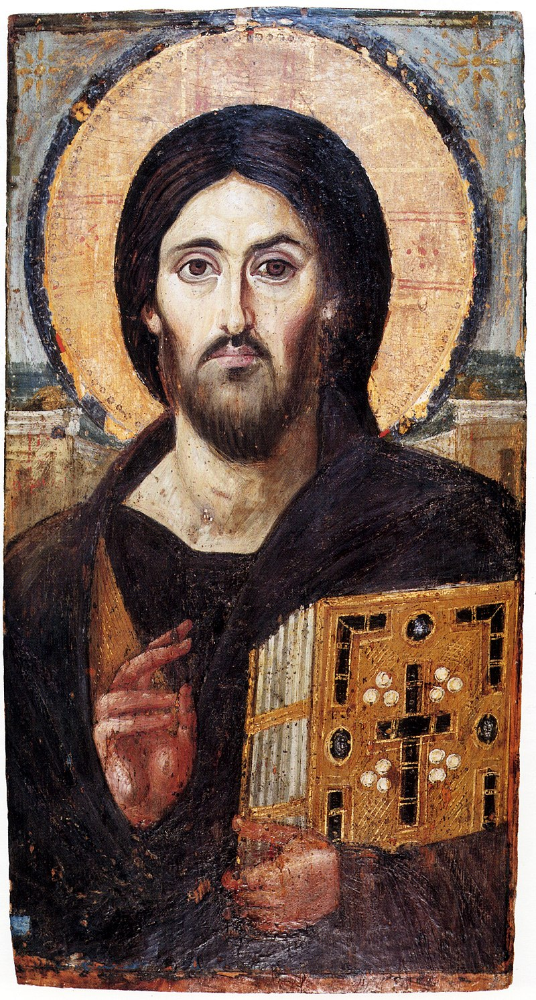

<aside>
    Published:  June 2019
</aside>
# The Shroud of Turin
"Isn’t this all good to be true, that by the providence of God we seem to have a “photograph” of Jesus? Many a person who has carefully scrutinized the evidence turns away and murmurs, “It’s too good not to be true?"  https://www.academia.edu/101899942/Notable_Quotations_about_the_Shroud_of_Turin

## Summary

<aside>
    
    
Image from the June 1980 isue of National Geographic[^weaver-1980] showing the main features of the shroud.

</aside>

The Shroud of Turin was the burial cloth of Christ, with blood from crucifixion wounds, as well as the 3D image of his crucified body photochemically flashed into its fibers in a way that can only be explained by the resurrection. This conclusion compels itself so inescapably from  numerous and diverse data that it's shocking it's not already widely known and accepted.  Especially since the shroud is or is among the most studied artifacts in the world.[^pellicori-1981:c] [^benford-2002:a] [^currie-2004:a] [^pitts-2013:a] [^de-caro-2022:d] [^farey-2022:a] 

Specifically, we have a linen burial sheet in Turin, Italy bearing the wounds of Jesus described in the gospels (100s of scourge marks, crown of thorns, bruised face, pierced wrists and feet, and spear wound), with chemical tests identifying human blood, which forensics experts say could only have happened by contact with real wounds. It's dusted with an uncommon form of limestone powder known as travertine aragonite, along with iron and strontium impurities, also found in tombs near Jerusalem.

The image on the shroud is formed by dehydrating the top 200 nanometers of cellulose of the flax in each linen fiber.  Areas with more dehydration correspond to a closer cloth-body-distance such that a 3D image can be reconstructed. There are no paints, dyes, or brush strokes, and attempts by forensic artists to accurately draw the correct depth of a 3D human form as image intensity have fallen short.  So have attempts with gas diffusion, heated or powdered bas reliefs and acid painting.  The fiber coloration is best replicated with high powered ultraviolet lasers over a period of nanoseconds, as a weaker energy over a longer period of time invariably produce either a much deeper discoloration or none at all.  Obviously we've never seen an effect like this on any other burial cloth. There's no way to explain it apart from the unassailable conclusion of Christ's resurrection.  This evidence is overlooked by many, perhaps because there's more misinformation than information being printed about it, which this article will rectify.  

The most extensive study of the shroud was performed in 1978 by the Shroud of Turin Research Project, known as "STURP."  STURP consisted of 25 scientists (plus additional assistants) working as volunteers,[^schwalbe-1982:o] who used equipment capable of detecting work produced by known artistic techniques, including x-ray transmission, fluorescence to detect heavy elements in inorganic pigments, microscopy, spectrometry, and UV fluorescence photography.[^miller-1981:a] [^pellicori-1981:c] [^schwortz-2022]  Much of the research cited in this article comes from STURP members, as well as further study on the fibers, blood, and other samples they collected from the shroud.

In 1988, the a sample from a corner repaired in the middle ages was carbon dated to the middle ages, and this is often cited to discredit the shroud as a medieval forgery.  Even though prior to the carbon dating, two archaeologists and a textile expert each independently warned that the corners may not be original material.  Subsequent examination of fibers from that corner revealed cotton woven into the original linen, that was dyed to look older, obvious signs of repair. Work testing the mechanical wear of shroud fibers, infrared spectroscopy to measure flax discoloration with aging, x-ray crystallographic measure of flax chain breaks, as well as Ray Rogers' work with vanillin decomposition all put the shroud in or around the first century.

There's more misinformation than information being printed about it, so pack a lunch, this will be a long trip.

## Features of the Shroud

### The Cloth

#### Size and Weight

The Shroud of Turin is a 4.37 by 1.11 meter linen cloth,[^bsts-2000:a] .  The total thickness of the shroud is about 0.3mm,[^mottern-1979:d] and a density of 0.78 grams per cubic centimeter.[^mottern-1979:e]

#### Material

The original shroud material, not counting repaired areas, is pure linen,[^marino-2022:b] which is common among burial shrouds found during Israel's Roman period.[^shamir-2015:a]   The shroud doesn't contain any wool or other animal hair.[^tyrer-1981:a] [^marino-2022:b]   Jewish law allowed for the dead (but not the living[^bible-1]) to be buried in fabric of mixed wool and linen.[^babylonian-talmud:b] [^babylonian-talmud:c] [^mishnah:a]   But mixed fabrics are never found among burial shrouds from Israel's Roman period,[^shamir-2015:b] and the description of the shroud as "a clean linen cloth" in Matthew 27:59 may indicate it was ceremonially clean and not a mixture of plant and animal fibers.

The shroud's linen is made of 0.15mm linen threads[^mottern-1979:c] with a Z- twist, meaning each thread has its fibers woven with their lines in the direction of the middle part of a Z

The linen threads of the cloth are heterogeneously bleached, which is especially visible under UV light.  This is consistent with a technique used in antiquity where the linen thread was bleached before weaving, but not in the middle ages where the cloth was bleached after it was woven.[^tyrer-1981:h] [^marino-2022:a]

#### Weave

The shroud is woven with a twill, specifically a three-in-one herringbone weave.[^mottern-1979:b] To define these textile terms:

1.  A twill is where you offset each thread by one to make a diagonal pattern.
2.  3:1 means each vertical thread (warp) passes over 3 horizontal (weft) threads.
3.  A herringbone weave is offsets each thread by one to make a diagonal pattern, but the direction is reversed every so many fibers.

Twill weaves are tighter and therefore more durable than plain and tabby weaves.[^shamir-2015:h]

The shroud's linen weave appears more crude and uneven than the shroud's backing cloth and the cloth used to patch burn holes in the shroud, both from the middle ages.  This is consistent with the shroud being produced on a hand loom.[^jumper-1984:o]  Textile expert John Tyrer remarks:

> The altar cloth and the backing cloth are plain woven, and are much better products than the Shroud. They seem to contain less weaving faults whilst the Shroud is a very poor product by comparison. It is full of warp and weft weaving defects, many mistakes in "drawing-in."  The impression I am left with is that the cloth is a much cruder and probably earlier fabric than the backing and patches, This I think lifts the Shroud out of the Middle Ages more than anything I have seen about the textile.[^bsts8-1984]

#### Side Seam Stitch

The stitching of the hems and of the side-seam closely match that on cloths found at the Jewish palace-fortress of Masada, from 73 AD.[^bsts-2000:b]  Although such stitching is also found in the middle ages.[^shamir-2015:i]

### The Body

About 174±2 cm[^fanti-1999:a] although estimates have ranged from 162cm to 187cm.[^crispino-1979]

Ethnically Mediterranean or Semitic.[^fanti-1999:c]

Images drawn from the shroud in the 1500s and 1600s are less anatomically precise than the shroud.[^fanti-1999:d]

### The Wounds

The bloody marks on the shroud match up with the body image and clearly show it came in contact with a man having the crucifixion wounds of Jesus as described in the gospels.[^heller-1980:a] [^heller-1981:i] [^pellicori-1981:i] [^sturp-1981:a] [^bucklin-1982:c]

#### Scourge Marks

The back of the man shows blood from over small, dumbbell-shaped 100 scourge wounds on the back, back of the legs, and parts of the chest,[^miller-1981:c] [^pellicori-1981:i] [^bucklin-1982:e] [^jumper-1984:n] Whether there are scourge marks on the shoulders and upper arms is unknown, as much of that shroud area was destroyed in the 1532 fire.

- Matthew 27:26, "[Pontius Pilate] having scourged Jesus, delivered him to be crucified."
- Mark 15:15b, "having scourged Jesus, he [Pontius Pilate] delivered him to be crucified."
- John 19:1, "Then Pilate took Jesus and flogged him."

==TODO:  do they match Roman weapons?  https://www.facebook.com/groups/7934806138/?multi_permalinks=10159171560616139&hoisted_section_header_type=recently_seen .==

#### Shoulder abrasions

Two large areas of the shoulder blades show bleeding as if a heavy rough object had been in contact with the skin, such as when Jesus carried the crossbar of the cross.[^bucklin-1982:f]

#### Pierced wrists and feet

The left wrist has a blood flow consistent with a nail going through the wrist, while the right wrist is hidden beneath the left arm.  The thumbs aren't visible, as if curled beneath the palm.  One experiments hows that driving a nail through the wrist damage the median nerve and cause the thumb to curl inward, consistent with crucifixion,[^bucklin-1982:g] although opinions vary.[^bordes-2020:c]  Blood flow from the wrists down the arms suggests the arms were raised about 65 degrees, and perhaps alternating by 10 degrees.  This is consistent with a crucifixion victim frequently pushing down on the feet to raise the body to breathe, then lowering the body to be supported by the wrists.[^bucklin-1982:h]

==TODO Medieval art with nails through hands.==

The shroud records a bloody imprint of both the left and right feet.  The the right apparently the one closest to the vertical beam of the cross, and also shows a square pierce wound near the metatarsal area.  It's unclear whether both feet were pierced together or separately.[^buklin-1982:i]

#### Crown of Thorns

Around the head are many small wounds, suggesting a crown of thorns that resembled a cap rather than a ring.  Blood flows on the forehead follow skin creases.[^bulkin-1982:j]  

- Matthew 27:29, "twisting together a crown of thorns, they put it on his head"
- Mark 15:17b, "twisting together a crown of thorns, they put it on him."
- John 19:2a, "the soldiers twisted together a crown of thorns and put it on his head."

#### Bruised Face

The right cheek shows swelling with partial closure of the right eye, and the nose has a slight deviation and shows scratches and dirt, as if from falling face-first on the ground.[^bulkin-1982:k]

- Matthew 27:30, "they spit on him and took the reed and struck him on the head."
- Mark 15:19a, "they were striking his head with a reed"
- Luke 22:63, "the men who were holding Jesus in custody were mocking him as they beat him."
- John 19:3, "They came up to him... and struck him with their hands."

#### Chest Wound

The right side of the chest shows the largest bloodstain, covering the 5th and 6th ribs, which shows a clear separation of blood from a watery material too large to be serum.[^buklin-1982:l]  A clear fluid would likely accumulate in the pleural space as a result of heart failure during crucifixion.[^buklin-1982:m] [^edwards-1986:a] [^hermosilla-2018:d] An object piercing the chest would first release this fluid, then blood after it pierces the heart.[^buklin-1982:n]

#### Blood

The red areas on the shroud corresponding to the location of crucifixion wounds are made of real blood of type AB,[^bsts-2000:c] established by the presence of proteins such as albumin (found in blood plasma), bile pigments, bilirubin, and ++heme++ derivatives,[^pellicori-1980:a] [^heller-1981:c] [^heller-1981:e] [^heller-1981:g] [^pellicori-1981:e] [^adler-1996:a] among other tests.[^kohlbeck-1986:b]  It tests positive for human ++antialbumin++ showing that it's either human or at least primate blood.[^pellicori-1981-2:d] [^jumper-1984:g]  Of course the shape the locations of the wounds on the cloth show that they must have come from a crucified human, obviously not a monkey or ape.

==TODO: AB was common among ancient Israelites:  https://pubmed.ncbi.nlm.nih.gov/888938/ .==

==TODO:  More info here [here](https://www.shroud.com/pdfs/anc-kearse-pap3.pdf).  Need to find photos of serum halos.==

Areas on the shroud with blood clots show a serum halo around the blood as if from contact with real wounds,[^pellicori-1980:c] [^heller-1981:d] [^miller-1981:b] [^pellicori-1981:f] [^bucklin-1982:d] [^adler-1996:a] [^bsts-2000:d] which wouldn't happen if blood was simply painted onto the shroud.[^jumper-1984:i]

Additionally, nothing else was found in the blood areas except blood--they haven't been "improved" with red paints or dyes.[^jumper-1984:j]  ==TODO: Fanti's paper claiming the opposite?== As expected, areas on the shroud without blood test negative for blood proteins.[^heller-1981:f] [^jumper-1984:h]  

#### Contact with a crucified man.

Some wounds are seen only under fluorescent light, unavailable to artists before modern times.[^miller-1981:c]

Ultraviolet photography performed by scientific photographer Vernon Miller and UV spectroscopist Samuel Pellicori,[^miller-1981] both also STURP members who examined the shroud in 1981, concluded:

> The sharp detail revealed for the first time, particularly in the scourges, suggests that intimate cloth-body contact occurred. 

Chemists and STURP members John Heller and Alan Adler note how their chemical analysis[^heller-1981] is in agreement with Miller and Pellicori:

> That such a chemically and anatomically correct representation could have been produced by any means other than direct contact of the cloth with a wounded human body is difficult to conceive. The detail in the scourge-marks as revealed in the fluorescence photography also supports this suggestion of intimate contact.[^heller-1981:l]

STURP researchers concluded in 1984:

> [A]ll evidence suggests that the blood went on as one would expect for a cloth in contact with wounds or the normal secretions of such wounds... The mapping function, which maps body-only image density to expected cloth-body distance and the two dimensional placement of the image on the cloth, offers a consistent argument that the Shroud enfolded a human-body shape.  If we couple this argument with the testimony of the forensic pathologists, we can say more: not only was it a human form, but further, it was a human body.[^jumper-1984:i]

There's general agreement among medical investigators that the cloth made contact with a crucified human body.[^bucklin-1982:c] Particularly, two pathologists, Robert Buklin and Fred Zugibe performed about 50,000 autopsies and also spent about 50 years studying the shroud.  It seems difficult to imagine how a medieval forger would be clever enough to fool even those two experts.

> Two deceased pathologists who each spent about fifty years studying the Shroud, Dr. Robert Bucklin and Dr.Fred Zugibe performed about a combined 50,000 autopsies. What are the chances that amedieval forger would have been clever enough just these two men?  https://www.academia.edu/92570504/Musings_Regarding_the_Shroud_of_Turin_Including_How_is_it_that_Practically_Everyone_Thinks_Theyre_an_Authority_

==But Hugh Farey [says](https://talesoftimesforgotten.com/2020/02/24/sorry-the-shroud-of-turin-is-definitely-a-hoax/#comment-32117):  "almost everything asserted by Robert Bucklin, famous pathologist from Los Angeles and firm believer in the authenticity of the Shroud is firmly denied by Fred Zugibe, famous pathologist from New York and firm believer in the authenticity of the Shroud. Clearly the pathological evidence is not as clear as either of the eminent pathologists thought."==

### The Image

#### 3D Properties

The image on the shroud is a negative 3D ++heightmap++, in that darker regions correspond to areas where the cloth would be closest to the body, and lighter areas further away,[^vignon-1902:b] [^jumper-1984:e] [^jackson-1989:c] fading off completely at a cloth-body distance of about 3.7cm.[^jackson-1982:a] When the shroud's "height" information is corrected based on the measured distances between a linen cloth and a volunteer, the 3D image of a human body emerges.[^jackson-1982:b]  The image has a resolution of about 0.5cm.[^pellicori-1980:b] [^schwalbe-1982:p]

#### Vertically Collimated

<aside>
    
	
        
The front image from the Shroud of Turin versus a non-vertically collimated image created on cloth via coronal discharge on a manequin.[^fanti-2015]

</aside>
Whatever caused the image on the shroud, it appears it shot vertically straight up and down from the body,[^jackson-1989:b] instead of in all directions outward from the surface of the body:

> [O]nly mapping in a vertical direction produces nearly correct correspondence between points on the body and cloth.  Projections normal [perpendicular] to either the body or cloth surfaces should produce an image with significantly greater distortions.  In fact, projection normal [perpendicular] to the body surface would produce a region of "confusion" between the side of the nose and cheek.[^ercoline-1982:b]

Otherwise we would see the sides of many anatomical features not visible on the shroud, such as the sides of the head and body.[^ercoline-1982:c]  The images to the right illustrates the very clear difference, with the vertically-collimated shroud image on the left versus a non-vertically collimated image created via ++coronal discharge++ from a mannequin on the right.

#### Anatomical Distortions

To a casual observer the shroud man appears anatomically accurate, but careful measurements reveal "significant distortions which can't be explained by anatomical variation or cloth stretching... broadening of the hips, elongation of the arms and fingers, lateral displacement of the hair away from the side of face."[^ercoline-1982]  

But experiments show these distortions are "consistent with a cloth draped over a 3 dimensional body."[^ercoline-1982]  What appears to be long fingers can be explained by the image actually revealing bones in the hand,[^jackson-1990:k] or perhaps the cloth was wrapped around the ends of the fingers, adding the fingertips and inside area of the fingers to the image.[^crispino-1979:c]  Other distortions are likely caused by folds and an slightly uneven draping of the cloth over the body.[^ercoline-1982:c] [^jackson-1989:a]

==TODO: Put this under anatomy?==

#### Matches No Known Art Style

The image on the shroud matches no known art style from any point in history.[^vignon-1902:a]

> Finally, any applied pigment is incapable of rendering all of the image characteristics found on this cloth. It is highly improbable that any 14th century artist would produce a "reversed" image or could encode the degree of three dimensional, computer readable information found in this image and leave no other surviving historical evidence of his evident genius.[^heller-1981:m]

Likewise there are no brush strokes.[^schwalbe-1982:h]

#### Fiber Coloration

The shroud image is definitely not colored by any paint, pigment, dye, or other coating[^morris-1980:a] [^pellicori-1980:e] [^miller-1981:d] [^heller-1981:h] [^pellicori-1981:b] [^pellicori-1981-2:c] [^schwalbe-1982:g] [^jumper-1984:k] [^kohlbeck-1986:c] [^adler-1996:c] Rather, the image on the shroud is formed exclusively from dehydrated cellulose in the linen fibers,[^heller-1981:b] [^pellicori-1981-2:e] [^schwalbe-1982:n] [^jumper-1984:d] [^adler-1996:b] which makes it appear more yellow or straw-colored.[^pellicori-1980:d] [^jumper-1984:l]  Specifically:

1. The fiber coloration is not a scorch, because scorch marks fluoresce under UV light while the body image does not.[^pellicori-1981:h] [^pellicori-1981-2:b] [^devan-1982:d] 
2. About 200 nm (nanometers) of the outer cells of the flax making the fibers are darkened, which is about the thickness of flax cell walls.  Only the outermost 2 to 4 fibers of each thread are darkened.[^pellicori-1981:d] [^devan-1982:b] [^jumper-1984:c] [^fanti-2010:a] [^lazzaro-2012:a] [^fanti-2015-2:a]
3. All image fibers are the same darkness.  Areas of the image that appear darker are instead caused by the presence of more darkened fibers, giving the image a half-tone quality.[^pellicori-1981:g] [^devan-1982:a] [^schwalbe-1982:d] [^jumper-1984:b] [^rogers-2002:a] [^garlaschelli-2010:a]
4. Image fibers are colored all the way around their radius.[^fanti-2018:a]  The color will preferentially follow a fiber for some length even when adjacent fibers are uncolored, except when a fiber's thread passes below another thread.[^jumper-1984:a] [^fanti-2010:c]
5. There's no evidence of any coating, paint, flowing liquids or cementation between fibers, except on the parts of the shroud with blood.[^heller-1981:a] [^schwalbe-1982:e] [^jumper-1984:m]
6. There's no image beneath the bloodstains.[^bucklin-1982] [^jumper-1984:f] [^fanti-2010:d] [^fanti-2011:c]  ==TODO add this source:  "It implies that the bloodstains were formed on the Shroud before the still not reproduced body-image was." https://www.scirp.org/(S(lz5mqp453edsnp55rrgjct55))/reference/referencespapers.aspx?referenceid=1619652.==
7. Sticky tape applied to image areas comes off more easily, and seems to bring more flax particles with it, supporting the idea of greater degradation.[^schwalbe-1982:b]

==TODO: cite the above list from [Rogers 1978](https://www.sciencedirect.com/science/article/abs/pii/S0003267001852636?via%3Dihub) and other sources from Fanti 2010's list and Fanti 2005==

Below, sections of colored (darker brown) and non-colored (lighter brown) fibers can be seen on shroud threads.  The difference is barely noticeable when viewed close up.  Red arrows show fibers where color abruptly stops.  Black arrows point to color concentrations in furrows.[^fanti-2010:b]  For scale, each thread is about 0.15 mm thick.[^motern-1979:a] 

This diagram shows the distribution of colored versus non-colored fibers in each thread.  Warp threads are vertical and and pass over and under the horizontal weft threads:[^fanti-2010]

Here we see a shroud fiber from an image area (top) and not from an image area (bottom) as seen through an optical microscope.  Note the outer layer of coloring in the top fiber:[^fanti-2015-2]

When viewed at greater magnification, the shroud image fibers are corrugated (wrinkled), unlike natural flax and non-image shroud fibers, as if shrunk via dehydration.[^schwalbe-1982:f] [^fanti-2015-2:b]  The picture below shows this corrugation on an image-bearing shroud fiber under natural light and cross-polarized light:[^fanti-2015-2:c]

 

Modern linen fibers also become corrugated like shroud image fibers if exposed to radiation from an ultraviolet laser:[^fanti-2015-2:d]

Likewise modern linen fibers become corrugated when exposed to ++coronal discharge++:[^fanti-2015-2:e]

#### Source of Fiber Coloration

There have been hundreds of attempts to reproduce the characteristics of the shroud image using colors, powders and other chemical contact, but these inevitably fail to reproduce the microscopic properties shown above, and often fail at the macroscopic level too.[^fanti-2010:e] [^prostak-2011:a] [^lazzaro-2012:f] [^moon-2022:a]  Attempts using radiation fare better.[^prostak-2011:a]

The depth of heat damage on a material informs about the type of energy that produced it.  It's the obvious difference between warming yourself by standing in a warm room for 10 minutes versus touching a stove.  The latter will make the surface of your had very hot but have little effect on the rest of you.  To get very thin (200 nanometers) heat damage on delicate linen, you need high intensity energy for a very short amount of time.

The closest attempt to reproduce the darkening of the shroud's image fibers was obtained in 2012 by ++ENEA++ scientists with a 0.193 μm wavelength ultraviolet pulsed laser.[^tosatti-2011:a] [^lazzaro-2012:g]  They tried a range of energies and pulse count until they found what best produced yellowed linen close to the shroud's image fibers.  They used 200 pulses from the laser, with each pulse applying an insane 10.5 to 11.2 megawatts of power per cm^2^, and lasting only a mere 12 nanoseconds.[^lazzaro-2012:b]  This didn't quite replicate the "half-tone" effect of the shroud image fibers, but the researchers involved theorized a better laser might.[^lazzaro-2012:d]

Varying these parameters, even by small amounts, produced worse results:

- 50 pulses at 36 megawatts per cm^2^ or 400 pulses at 6.6 megawatts per cm^2^ produced an off color, and further energy/pulse count variation either burned the linen or had no effect.[^lazzaro-2012:b]  
- Likewise, longer 120 nanosecond pulses at a slightly less energetic 0.308 μm wavelength either produced no change or burned the linen.[^lazzaro-2012:c]  
- A pulse length of 30 nanoseconds browned the linen, but "the depth of color was still larger than that of the Shroud image"[^lazzaro-2012] at 200 nanometers.

The ENEA group suggested it'd take 34 trillion watts of energy to create the whole shroud image all at once,[^tosatti-2011:b] but of course this is over a period of nanoseconds.  One trillion watts for one nanosecond is the same energy as 1000 watts over one second, even though the latter would not have the same effect.

Some experiments with linen cloth,VUV radiation, and using heat to artificially accelerate the chemical aging show the cloth first becoming bleached, then the same color as the surrounding linen, then becoming darker with time.==TODO cite source.  Jackson 1990 / Jackson 2014?==

Exposure to ultraviolet light can also explain why the blood on the shroud has remained so red despite being so old.==TODO original source==

Interestingly, the Gospel of Matthew describes Jesus emitting intense light when he appeared in glorified form during the Transfiguration.  Matthew 17:2:

> And he was transfigured before them, and his face shone like the sun, and his clothes became white as light.

==TODO Lazzarro's 2023 work:  https://www.nydailynews.com/news/national/shroud-turin-fake-researchers-scientists-unable-replicate-cloth-christ-like-image-article-1.995661 .==

#### Delayed Coloration

John P. Jackson's paper from 2014:

"the same phenomenon should occur at room temperature, but over a much longer time scale"

### Image Formation via Radiation Fall-Through

The image on the shroud's linen has some unusual features that don't match a simple model of a body emitting radiation in all directions.  

After the resurrection, John 20:19 suggests that Jesus was able to pass through solid objects.  Experiments have shown that vacuum-ultraviolet (VUV) radiation is the best candidate to form the type of discoloration seen on the shroud,[^jackson-1990:e] even though it can only travel a few millimeters through air.[^jackson-1990:b]  Something like VUV is also necessary because its short absorption distance is necessary to account for the higher resolution of the shroud image.[^jackson-1990:d]

If the linen shroud fell by gravity through the body as it emitted VUV radiation,[^jackson-1990:a] with the sides folding outward, it explains a large number of features of the image:

==Old version:== Physicist and STURP member John P. Jackson proposes that the image was formed while the body became "mechanically transparent" and allowed other objects to fall through it while briefly emitting vacuum-ultraviolet (VUV) radiation, a higher frequency of light than humans can see.  As gravity pulled the front of the cloth downward through the body, the sides of the cloth folded outward, and the back of the cloth stayed in place.[^jackson-1990:a]  Since VUV radiation can travel only a few millimeters through air,[^jackson-1990:b] the parts of the cloth exposed to the radiating body for longer periods of time become more irradiated, explaining why the amount of discoloration corresponds to cloth-body distance.[^jackson-1990:c]  VUV is necessary because a short absorption distance is necessary to explain the higher resolution of the shroud,[^jackson-1990:d] and has the right frequency to create shroud-like discoloration,[^jackson-1990:e] as noted above.

==TODO animations or better images of pictures in Appendix B of Jackson's paper.==

This model explains numerous otherwise difficult to explain image features:

1. Parts of the cloth closest to the body would've spent more time inside the body and in contact with VUV radiation, which is why the amount of discoloration corresponds to cloth-body distance.[^jackson-1990:c]
2. The cloth captures an image only from the front and back of the body not the sides.[^jackson-1990:f]
3. The back image looks more like a map of body-cloth contact instead of having the 3D cloth-body distance of the front image.[^jackson-1990:g]
4. Blood on the sides of the body doesn't line up with the image, such as blood that would've been on the face appearing over the image of the hair.[^jackson-1990:h] ==TODO:  Show figure Jackson 1990 page 21, color blood regions red.==
5. The blood is a different color when it covers image areas.[^jackson-1990:i]  ==TODO:  shroud scope shows this on man's left elbow (right side).  Add photo to article, then blur to measure average redness.  Also add to red blood objection==
6. The front image is on both sides of the cloth, having traveled through the body, but the back image is only on one side.[^fanti-2004:a] ==TODO show figures 11 and 13 from Fanti 2004==
7. The image has "motion blur" in areas where it would be the most tense/stretched over the body, such as the ankles due to complex wrapping of the foot region, where the cloth likely would not have taken a simple path straight down.[^jackson-1990:j]
8. Unlike the back image, the front image appears to capture internal body features to some degree, such as the bones in the hand, since it passed through the irradiating body.[^jackson-1990:k]

This explanation may seem contrived, but it can be derived only from after-the-fact knowledge of the image without knowledge of the resurrection.  No other image formation model accounts for all characteristics of the shroud image.

Yet Jesus described himself metaphorically as "the light of the world" (John 8:12).  The gospels describe Jesus emitting light (Matthew 17:2, Mark 9:3, Luke 9:29), although not specifically VUV light and possibly passing through walls and people (Luke 4:29-30, John 20:19).  

When Jackson hypothesized the radiation fall-through model in 1990, the back of the shroud was covered with the "Holland" backing cloth and had not been examined.  Jackson predicted only the front image would appear on both sides, but not the back image.[^jackson-1990:l]  This prediction was confirmed true in 2002 when the backing cloth was removed.

Jackson's model shouldn't be confused with Mark Antonacci's "Historically Consistent Method" that involves a vacuum from a disappearing body pulling the cloth inward at a high speed.

==TODO include image of a face in a bed of nails pin art toy.  "the height of each pin represents the time the cloth spent in contact with the body when falling through it"==

### Other Residues on the Cloth

==TODO:  "John Jackson referred to “an abundance of microscopic dust or dirt” in the area of the dorsal foot, in an article he wrote for Shroud Spectrum International in 1988 (‘The Radiocarbon Date and How the Image was Formed on the Shroud’), but by the end of the century dirt was frequently referred to as having been found, and sometimes identified, on the knee and nose as well, although no sticky tape samples had been taken of either. Eric Jumper’s ‘A Comprehensive Examination of the Various Stains and Images on the Shroud of Turin’ contains no reference to dirt, and neither does Larry Schwalbe and Ray Rogers’s paper, ‘Physics and Chemistry of the Shroud of Turin.’ In an article for Archaeology magazine (‘The Shroud of Turin Through the Microscope’), Sam Pellicori wrote, “Visual observation of the heel area at 500 times magnification revealed the presence of the very fine yellowish particles suggesting dirt; the nose area may also contain dirt or residual skin material.” https://medievalshroud.com/limestone-on-the-shroud/ .==

#### Travertine Aragonite Limestone

Travertine Aragonite[^kohlbeck-1986:a]

> One of the first tests performed directly on the Shroud by the STURP team during the 1978 study of the Shroud was Reflective Spectroscopy conducted by Roger and Marty Gilbert. They seemed to be having analytical difficulties when the spectra they were obtaining changed when they reached the area of the heel. The problem seemed to resolve itself only to reappear when they reached the knee area where they obtained spectra different from the rest of the cloth except for the problem area of the heel. Again the problem resolved itself only to reappear eventually at the nose. They called on the Sam Pellicori, an Optical Spectroscopist, who via a vertical mounted sliding macroscope looked at the heel area and declared the reason for the “abnormal” readings was “dirt.” In retrospect, Eric Jumper who was the lead person for that experiment concluded that it was appropriate that the man on the Shroud would have dirt on selected parts of his body, especially the heel, and particularly if he had fallen.
>
> In 1982, Ray Rogers sent a sticky tape microscope slide with a speck of an undetermined composition from the heel area to Dr. Joseph Kohlbeck, an Optical Crystallographer at the Hercules Aerospace Center in Utah for analysis to determine if there was anything interesting in the slide. Dr. Kolbeck identified the dark speck as Travertine Aragonite, a rare form of calcite. Dr. Kohlbeck completed his analysis and his results were received with great interest. He eventually passed the slide with the speck to Dr. Ricardo Levi-Setti, Scientist at the Enrico Fermi Institute at the University of Chicago. His analysis also showed that the speck was Aragonite. I called both scientists on March 11, 2012 to verify the results. Cesar Barta of Spain now has the speck.
>
> As a follow-up to this, limestone samples were taken from at least 9 tombs throughout the Jerusalem area but only a separate sample taken from near the Damascus Gate near Golgotha contained Aragonite. 
>
> The fact that Aragonite, a rare form of calcite, was the identified species of limestone on the foot of the man on the Shroud and was also found at on the ground at Golgotha near the Damascus Gate points to a connection between the man of the Shroud and the Biblical Jesus.[^villarreal-2012]

==TODO==

https://academicjournals.org/journal/SRE/article-abstract/309700429271

https://medievalshroud.com/limestone-on-the-shroud/

> We have studied optical properties (in optic and petrographic microscopy) of mineral particles (diameter > 1 µm) deposited on the surface of a small (≈ 1.4 mm height, 610 µm wide) sticky tape triangle corresponding to the Face area of the Turin Shroud (TS).... The presence of gypse and ferric oxide indicates a soil nature corresponding to desertic or semi-desertic climates.

#### Gold Dust

In 2020, Giulio Fanti and Claudio Furlan reported that particles of gold found on the shroud match the alloy of gold commonly used in coins of the Byzantine empire from 600 to 1300 AD, but uncommon elsewhere.[^fanti-2020]  In 2022, Gérard Lucotte likewise found a "particle (of electrum) is possibly some part of a coin of a Byzantine money"[^lucotte-2022]  As well as a particle that could be part of Roman billion, "a coin of money used during the Roman Antiquity." [^lucotte-2022]

This is consistent with numerous historical records of the burial cloth of Jesus, complete with a body imprint, in the Byzantine capital city Constantinople.  A visitor to Constantinople in 1090 AD describes seeing a cloth bearing the image of Jesus being stored inside a gold case.[^wilson-2010:a] Perhaps even gold coins being rubbed on the shroud as a way to bless them.

While this doesn't date the shroud all the way to the first century, it's another line of evidence against the skeptic's claim that the shroud originated in 13th century France.

==TODO: Pollen?==

#### Pollen

https://www.nature.com/articles/srep14484

## History of the Shroud

There's no unbroken chain of custody tracing the shroud from first century Jerusalem until the shroud's well documented period of history beginning in 13th century France.  But there are numerous accounts either the burial shroud of Christ, or a cloth bearing the image of Christ.  Because these accounts are often vague and sometimes contradict, it's difficult to know which what's historical versus legendary.  The list below includes only the more notable accounts.

### 33 to 50 AD - King Abgar V

While King Abgar V would've reigned until about 50 AD, the following accounts weren't written until hundreds of years later.

#### The Doctrine of Addai

The Doctrine of Addai (or Teaching of Addai) is a Syriac text written in the 4th or early 5th century.  It has several anachronisms, which draw some doubt on its authenticity.[^ramelli-2017]

The document describes the interactions of Addai the Apostile (one of the 70 "extended" disciples of Jesus) with King Abgar V of Edessa, who reigned from about 33 to 50 AD.  In one part, King Abgar V had his servant Hannan send a letter to Jesus, inviting him to come to Edessa to heal Abgar of a sickness:

> And when I heard of these great wonders which Thou doest, I decided in my mind that either Thou art God, who hast come down from heaven and doest these things, or Thou art the Son of God, who doest all these things.  Therefore, I have written to request of Thee to come to me who adore Thee, and to heal the disease which I have, as I believe in Thee.[^addai-400]

Jesus responded to Hannan, saying that after his ascension, he'll send one of his disciples to "cure the disease which thou hast, and restore thee to health."[^addai-400]  And at that time, Hannan painted an image of Jesus:

> When Hannan, the keeper of the archives, saw that Jesus spake thus to him, by virtue of being the king's painter, he took and painted a likeness of Jesus with choice paints, and brought with him to Abgar the king, his master. And when Abgar the king saw the likeness, he received it with great joy, and placed it with great honour in one of his palatial houses.[^addai-400]

Of course the image on the shroud is not a painting, but this is the first reference of an image of Jesus being sent to Edessa, which will come up again below.

#### Eusebius

Around 313 AD, church historian Eusebius also mentions Abgar being ill and a correspondence between Jesus and Abgar, citing the "archives of Edessa" as a source.[^eusebius-313:a]  Eusebius does not mention an image of Jesus, perhaps because his account is shorter than the Doctrine of Addai, or because Eusebius was hostile to representations of God.[^ramelli-2017:a]

#### The Acts of Thaddeus

A very late Greek source from between 544 and 944 AD claims the image was made miraculously, using the phrase "doubled in four" to describe the cloth.  This term is used exclusively of the Mandylion.==TODO Source==

> A towel [Greek *tetradiplon* - doubled in four] was given Him; and when He had washed Himself, He wiped His face with it. And His image having been imprinted upon the linen, He gave it to Ananias, saying: Give this, and take back this message, to him that sent thee: Peace to thee and thy city![^acts-of-thaddeus-600]

### Early 2nd Century - Gospel of the Hebrews

The Gospel of the Hebrews was written perhaps in the late first or early second century.  We no longer have a copy of it.  But in the late third century, St. Jerome quotes a passage from the Gospel of the Hebrews that says Jesus gave his grave clothes to the servant of the priest:

> Also the gospel which is called the Gospel according to the Hebrews, and which I have recently translated into Greek and Latin, and of which also origin frequently makes use, after the account of the resurrection of the Savior says, "The Lord, however, after he had given his grave clothes to the servant of the high priest, appeared to James, for James had sworn that he would not eat bread from that hour in which he drank the cup of the Lord until he should see him rising again from those that sleep."[^jerome-393]

### 1st to 3rd Century - Hymn of the Pearl

The Hymn of the Pearl is a poem found within the apocryphal Acts of Thomas, written in Syriac,  in Edessa, sometime during the first to third centuries.[^burns-2013:a] [^iranica-2022:a]  Part of it references a garment that shows the image of person, sometimes translated as the "King of kings," as a "divided" "mirror" image:

> But, when suddenly I saw **my garment reflected as in a mirror**, I perceived in it my whole self as well and through it I knew and saw myself. For **though we originated from the one and the same we were partially divided, then again we were one, with a single form.** The treasurers too who had brought the garment I saw as two beings, but there existed a single form in both, One royal symbol consisting of two halves…And **the image of the King of Kings** was all over it.[^elliott-2008] [^houtman-2008]

The shroud is a single cloth with the mirror image of Jesus on the front and back of it.  It's difficult to think of any object matches this poem better than the shroud.  Especially since it comes from Edessa, where we have other references to a cloth bearing an image of Jesus.

Dan Porter provides six other English translations of this passage on his blog.[^porter-2012]

### 590 AD - Evagrius Scholasticus

In 590 AD, historian Evagrius Scholasticus tells in his Ecclesiastical History that when a wooden siege mound was being constructed by an invading army against Edessa in 544 AD, the Edessans constructed a tunnel to secretly burn the mound.  But the fire wouldn't light until they doused it with water that had touched a divine image of Jesus.

> So, when they came to complete despair, they brought the divinely created image, which human hands had not made, the one that Christ the God sent to Abgar when he yearned to see Him. Then, when they brought the all-holy image into the channel they had created and sprinkled it with water, they applied some to the pyre and the timbers. And at once the divine power... the timbers caught fire.[^scholasticus-590]

Miracles aside, this further attests that the Edessans believed they possessed a miraculous image of Jesus.

### 6th Century - Christ Pantokrator of St. Catherine's Monastery at Sinai

### 692 to 695 AD - Gold Solidus Coin

The first time an image of Jesus appeared on a coin, it bore many similarities to the shroud face image:

1. Long, straight shoulder-length hair on both sides of the face.

2. A long face with a prominent nose bridge

3. A moustache.

4. A forked beard (on some coins)

     

### 944 to 1207 AD - In Constantinople

In 943, the Byzantine Emperor Romanus Lecapenus sent an army to the then-Muslim-controlled Edessa to and retrieved an image of Jesus on a cloth and bring it back to Edessa.[^scavone-1989:a]  Once there, Emperor Constantine VII described the image:

> As for the image, it is more of a moist secretion without colors or art of a painting.  And the face is formed on the linen cloth in a way which made the perishable cloth indestructible.[^scavone-1989:b]

The 10th century writer Symeon Magister likewise described:

> The sons of Romanus said they could see nothing but a faint face.  Constantine, however, said that he could make out features such as eyes and ears.[^scavone-1989:c]

The archdeacon of Hagia Sophia Church in Constantinople described the image being formed "by the perspiration of death on his face" as well as seeing the blood from the side wound.[^scavone-1989:b]  It's easy to imagine how an ancient person could see the faint, blurry shroud image and think it was formed by sweat.

Several of the Synnaxarion manuscripts (944 to 955 Ad) say of Jesus:

> In life you exuded your likeness on to a sindon [shroud], in death you entered the final sindon.[^wilson-2010:b]

In 969- 976 AD we also find coins from Constantinople that resembles the face image on the shroud.  In the 1cm coin below we see some points of correspondence:  A cross shape along the nose, forehead, and above the eyebrows, long, straight, shoulder-length hair to the left and right of the face, a mark on the right cheek.[^robinson-2019] [^robinson-2021]  Perhaps the coins were minted to celebrate the arrival of the shroud in Constantinople.

A visitor to Constantinople in 1090 AD wrote:

> This wonderful linen cloth with the face of the Lord Jesus, marked by direct contact, is kept with greater veneration than the other relics in the palace, and held in such great esteem that it is always kept in a golden case and very carefully locked up.  And when all the other palace relics are shown to the faithful at certain tines, this linen cloth on which the face of our redeemer is depicted is not shown to anyone and is not opened up for anyone except the emperor of Constantinople.[^wilson-2010:a]

In 1157 AD, an inventory list of relics at Constantinople includes the "burial sheet which had wrapped the Lord's body in the tomb."[^scavone-1989:c]  Around this time, depictions of Jesus burial began depicting him unclothed, laying on a large shroud, and/or hands folded in the same pattern as seen on the Shroud of Turin.  Previously art had depicted Jesus being wrapped as a mummy.[^scavone-1989:d]  [^wilson-2010:c]

==TODO: this doesn't show Jesus unclothed or on a shroud, shows thumbs==

Schiller, Gerrud.  Iconography of Christian Art, Volume 2.  1972.  Page 592.

"Embroidery.  C. 1200.  Byzantine.  Epitaphios.  Venice.  Christ on the Anointing Stone."

In 1201 AD, Nicholas Mesarites, the Keeper of the Imperial Treasury in Constantinople, describes having the burial cloth of Jesus, and that it somehow evidences not just Jesus' death but also his resurrection:

> These linens still smell of myrrh and they resist corruption since they enveloped the indefinable, naked, and embalmed corpse of the Lord after the Passion... The Lord is resurrected anew and the sudarium [shroud] and burial linens are proof of it."[^mesarites] [^scavone-1989:e] [^wilson-2010:d]

In 1204 AD, the crusader Robert de Clari reported seeing in Constantinople the burial cloth of Jesus, complete with a body image:

> There was another church which was called My Lady St Mary of Blachernae, where there was another *sydoine* [sidon, shroud] in which our Lord was wrapped, and which each Friday stood straight up, so that it was possible to see the figure of our Lord.  But when the city was taken, no one, whether Greek or French, knew what became of it.[^scavone-1989:f] [^wilson-2010:e]

In 1207, Mesarites again describes a cloth bearing the image of Jesus among the items in the Imperial Treasury in Constantinople:

> The indescribable, who appeared among us in the likeness of man, drawn as in a first imprint, printed on the towel and we chased in the brittle ceramic like a graphic art not elaborated by the hand.[^cataldo-2014]

These accounts are consistent with gold dust matching Byzantine coins being found on the shroud by researchers Giulio Fanti, Claudio Furlan, and Gérard Lucotte, described above.

### 1192 to 1195 - Hungarian Pray Codex

Points of correspondence:

- Cloth that's twice the length of the body, wrapped over the head.
- Herringbone pattern.
- Four poker-holes in an L shape.  From Mu'awiyah's "trial by fire" experiment around 680?
- Awkward arms crossing covering the groin, with right over the left.
- Four fingers, but no thumbs can be seen on both hands.
- Forehead bloodstain shaped like a reverse "3".
- No clothes

Some propose that the four holes were made with a poker to remove the shroud from a fire in 1534, but if the holes were made hurridly at that time, why would they match the same pattern as the pray codex four centuries years prior?

### With the Templars?

==TODO see shroud-claims.md==

### 1350 - Exhibited publicly by Geoffrey de Charney in Lirey, France.

### Was the shroud copied from earlier art?

Perhaps the original burial shroud of Jesus was lost after being in Constantinople, and the shroud that appeared in France was merely a copy of it?

1. 

## Scientific Dating

==TODO Master list, including gold dust==

### Possible 1982 Carbon Dating

==TODO copy this section from the c14 dating article?==  

### 1988 Carbon Dating

### Vanillin Dating

Lignin is a component of cell walls found in plant cells.  When lignin breaks down it turns into ++vanillin++, which breaks down much more slowly.  In 2005, chemist and shroud skeptic Ray Rogers tested the main body of the shroud for vanillin, finding none.  He calculated the shroud would need to have originated between 1000 BC and 700 AD in order to lose that much vanillin:

> If the shroud had been stored at a constant 25 °C [77F], it would have taken about 1319 years to lose a conservative 95% of its vanillin. At 23 °C [73.4F], it would have taken about 1845 years. At 20 °C [68F], it would take about 3095 years.[^rogers-2005]

And a date as late as 700AD is unlikely since the known history of the shroud (1300 AD until today) has it being kept at average temperatures much loser than an average  of 25C / 77F year round.

 Rogers found:

1. Vanillin in threads adjacent to the carbon dated area, the Shroud's backing cloth added in 1534 AD, and other medieval linens wherever lignin was found in growth nodes.[^rogers-2005:a] [^rogers-2005:b] [^rogers-2005:c] [^ball-2005:a]
2. No vanillin in any samples taken from various places on the main body of the shroud, the Dead Sea scrolls (200 BC to 70 AD), or in other ancient linens.[^rogers-2005:a] [^rogers-2005:b] [^rogers-2005:c] [^ball-2005:a]

#### The Chambéry Fire

The shroud was saved from a fire in 1532, which created the large burn holes clearly seen in photos.  Although the rate of vanillin loss increases exponentially with temperature, Rogers proposes this would not have greatly affected his calculation since "the thermal conductivity of linen is very low" and "the unscorched parts of the folded cloth could not have become very hot," illustrated by "the rapid change in color from black to white at the margins of the scorches."[^rogers-2005]

Per the figure below, the shroud would need to be in the fire for 4 hours at 150C (423K) to have 95% vanillin loss.  But the shroud body still has ++pentose++ impurities, which would degrade after 4 hours at only 100C (373K).  Blood spots away from the scorch marks also should've degraded under heat.  Since the shroud still has pentose and blood spots, the 1532 AD fire therefore could not have significantly affected the vanillin content of the shroud.[^maloney-2014:d]

Therefore the shroud is much older than the middle ages.

### Mechanical Dating

In 2015, shroud researcher Giulio Fanti two other engineers presented a new way to date the shroud's linen fabric.[^fanti-2015] [^fanti-2017] They constructed a small machine to test the strength of microscopic fibers, finding a correlation with age.  They measured the strength of 51 fibers from 9 flax samples ranging from 3500 to 3000 BC up to modern times,[^fanti-2015:a] as well as 8 fibers from the Shroud of Turin.[^fanti-2015:b]  Fiber breaking strength, elasticity, and compression were measured, as well as strength loss after stretching and compressing the fibers many times.  Since the data in the paper can be difficult to follow, their raw data has instead been re-graphed[^bereanarchive-2022b] in the charts below.  Although this is a new technique and much less precise than carbon dating,[^fanti-2015:c] notice still that the Shroud of Turin's linen properties fit much closer among ancient linens (red dot) than medieval linens (orange dot):

Since the shroud of Turin survived the Chambéry fire in 1532 AD, they tested modern linen fibers response to high temperatures, noting that fire produced a difference "smaller than the measurement uncertainty of the mechanical parameters."[^fanti-2015:f]  [^fanti-2017:c] Additionally, heat damaged fibers were easy to identify and exclude from testing.[^fanti-2017:a]  Light, moisture, soil acidity, lichen attacks, molds, mites and rotting effects were also lower than the uncertainty level of a few centuries, when the fibers were pre-screened for damage.[^faint-2017:b]

Based on the fiber mechanical properties they estimated the Shroud of Turin's at 372 AD.[^fanti-2015:e] After using only the there most consistent of the five mechanical tests[^fanti-2015:d] and excluding an outlier in calibration,[^fanti-2015:h] they estimated an age of 260 AD ±274 years.  In a 2017 study, Fanti tested a linen fiber from the shroud's wrist area, getting a date of 110 AD ±400 years,[^fanti-2017:d] [^fanti-2017:e] which is not shown in the charts above.  Keep in mind this is a completely new dating method, and much less precise than carbon dating.

### FT-IR Spectroscopy

Giulio Fanti and his team also performed FTIR analysis as part of their 2015 study,[^fanti-2015] which studies the color of the shroud in the infrared spectrum.  They found the amount of aging matched closely to other linen fabric from ancient times (red dot) but not linen from modern or medieval times (orange dot).

 

They found the effect of the 1532 AD Chambéry fire would affect the FTIR values by anywhere 0 to 18%.[^fanti-2015:i] The red and orange dots above show the uncorrected FTIR readings not taking the fire into account.

Based on the FTIR values, they estimated the date of the shroud at 250 BC ±400 years.[^fanti-2015:j]  As a caveat, keep in mind this is a new method for dating linen and much less precise than carbon dating.

#### Raman Spectral Analysis

Fanti and his team also performed ++Raman++ spectral analysis, dating the shroud to 30 AD[^fanti-2015:j]  after excluding an outlier.[^fanti-2015:k]  But unlike the mechanical and FTIR tests, the various linen samples lack strong correlation between Raman fluorescence and age,[^fanti-2015:l] calling into question whether Raman spectral analysis can be used to accurately date the shroud.

### X-Ray Crystallography Measurement of Cellulose Chain Breaks

<aside>
    
    

        When looking at the cellulose diffraction peak (first peak), the shroud of Turin's linen (orange line) has a number of cellulose chain breaks closest to a cloth from the siege of Masada, which carbon dates to 55 to 74 AD.[^pentin-2022]  A study prior to the measurement of the shroud linen's cellulose chain breaks established the region of the graph near the twin peaks as the best to use.  Note that the intensity lines have been rescaled so that they match near the left side of the graph.[^de-caro-2019:a]
    

</aside>

In 2019, seven researchers used x-ray crystallography (a common tool) in a new way--to measure the age of linen samples by counting the number of chain breaks in the linen's cellulose, with reasonable success.[^de-caro-2019]

In a 2022 follow-up study, five of the researchers repeated the measurement on a thread from the shroud near where the 1988 carbon dating was performed.[^note-1]  Although their method is much less precise than carbon dating, and it can't determine the age without knowing a cloth's temperature and humidity history, they showed the shroud must be much older than the 13th century when it was claimed to be forged:

> To make the present result compatible with that of the 1988 radiocarbon test, the TS should have been conserved during its hypothetical seven centuries of life at a ++secular++ room temperature very close to the maximum values registered on the earth.[^de-caro-2022]

Having the shroud kept at extremely hot temperatures for the last 700 years obviously can't be the case, since it's universally accepted the shroud has been indoors in southern Europe for at least the last 700 years, with an average room temperature of 8.5 to 9 °C (47.3 to 48.2F).[^de-caro-2022:b]  

They calculated that for the shroud to be 2000 years old, it would need to have been kept at an average temperature of 20 to 22.5C (68 to 72.5F) and 55 to 75% humidity for the first 13 centuries after Christ, a good fit to the middle-east climate.[^de-caro-2022:a]  These temperatures represent the average of warmer summers and cooler winters, not that the temperature would always need to be within those ranges  

Additionally, they showed that the 1534 fire would've had negligible effect, as exposure to temperatures > 200C for over an hour had negligible effect on the number of cellulose chain breaks.[^de-caro-2022:c] As mentioned above, the shroud has  ++pentose++ impurities which would've degraded after 4 hours at only 100C, as well as blood spots that also degrade when heated.[^maloney-2014:a]

This research was summarized in the National Catholic Register.[^pentin-2022]

### Numismatic

## The Sudarium of Oviedo

## Problems with a Medieval Shroud

Glaring anachronisms emerge when entertaining theories that the shroud was forged in medieval times, or earlier:

- The concept of a photographic negative was unknown prior to 1826.[^moon-2022:b]
- No concept of a 3D heightmap, or a computer to reconstruct a 3D model to ensure that distance information is accurately encoded to fiber coloration.[^moon-2022:c]
- Anatomical detail
- Keeps pace with new science in modern forensics.
- Gold dust matching Byzantine coins and possibly a roman coin.

To those who believe the shroud wrapped the resurrected Jesus, it's no surprise that the shroud keeps pace with the ever advancing techniques of modern science used to probe it.

==TODO: https://www.facebook.com/carissasquilts/posts/pfbid02igiUgRCNXE1Yg38auA2HTwAQJudv7JVQaFe84phxR63J84UuPyNmGMNaHFu3eivwl==

## Failed Image Explanations

> Many experiments have been carried out and many hypotheses have been formulated about the body image formation mechanism but none of them have been able to experimentally reproduce and completely explain what can be directly seen looking at the TS [Turin Shroud].[^fanti-2010]

Fanti, 2019:  "Hundreds of scientists in vain [have] tried to propose hypotheses able to partially explain that body image."  https://www.science.org/content/article/researchers-hung-men-cross-and-added-blood-bid-prove-turin-shroud-real

> All attempts to create a Shroud-like image have failed to reproduce adequately the above characteristics.  Some researchers have obtained coloration/images that look similar, but no one has created images that match all microscopic and macroscopic characteristics of the Shroud image.  The answer to the question of how the image was produced or what produced the image is still unknown.[^lazzaro-2012]

Lazzaro in 2012:

> For sure, none of the hundreds attempts to obtain a shroud-like image by using chemical contact techniques – i.e. adding chemical substances like colors, powders, etc. – has achieved good results. Usually, the chemical approach gives similar macroscopic results, but it fails when analyzing the coloration with a microscope. At the microscopic level, the contact chemical approach does not give Shroud-like results. On the contrary, attempts using various radiations (vacuum ultraviolet photons, electrons from a corona discharge) give a coloration that looks shroud-like even at the microscopic level.[^prostak-2011:a]

Pam Moon in 2022:

> Believers in the medieval Shroud have used various techniques to attempt to replicate it. Luigi Garlaschelli used acid and an oven (see below, compared with the black and white Shroud image); Colin Berry, a technique with flour and an oven.11 Gary Vikan used a combination of tannin (tea) and ferrous sulphate and then admits to photoshopping his image. Hugh Farey has experimented with many different chemicals, eliminating many possible agents in his research. He has not yet discovered a satisfactory one. All the above are dependent on computer technology. Their finished results do not have the complexity or the beauty of the Shroud of Turin. They do not have the anatomical accuracy. Also, they are copying an existing image, not creating anything original, unlike the alleged medieval genius.  https://www.academia.edu/91074529/Medieval_Artists_Anachronisms_and_the_Shroud_of_Turin

### Art

1. The blood is human or at least primate blood from real crucifixion wounds.  But it lines up with a human body, so it must be from a crucified human and therefore the cloth was wrapped around a body.
2. The cloth-distance data.
3. Artists can't create the image:

#### Problems with creating the image

In 1982, two certified criminal artists were asked to reproduce a 3D heightmap as seen in the shroud image, at first via freehand, but then being given the correct shade of gray to use at 15 anchor points, such as at the lips, nose, or cheek.  In both cases the artists weren't able to capture the 3D nature of the image:

> These images [created by artists], when compared to the Shroud VP-8 reliefs do not seem particularly convincing and in general have a mask-like quality about them.  Each image possesses relief deformities, particularly in the lip regions.  The VP-8 reliefs of the rigorous compositions [made by artists given 15 anchor points] do not show a significant improvement over the freehand versions which probably indicates that the 'artist mechanism' has a limit as to the precision by which distance information can be transferred.[^jackson-1982:c]

Further difficulties arise in producing the image being painted or drawn by an artist:

- It would be difficult for an artist to create realistic cloth drape effects over the body.[^jackson-1982:d]
- The details on the real shroud are difficult to discern unless you stand more than six feet away.[^jackson-1982:e] [^schwalbe-1982:c]
- There's no known example of any medieval art in the form of a 3D heightmap, or the concept even existing at the time.[^heller-1981:m] [^pellicori-1981:a] [^jackson-1982:f]

#### No paints, dyes, or other coatings

1. UV fluorescence tests failed to detect organic pigments in the body image.[^miller-1981:d]

The idea that the image on the shroud is from paint, dye, or other pigment has been tested by so many researchers that the mistaken claim otherwise now provides good comic relief: ==TODO Copy sources from Features of the Shroud/The Image sources on paint==

Chemists J. H. Heller and Alan Adler in 1981:

>[W]e find no evidence for any other metallic species on the body image fibrils at a level that would provide color evident to the eye...
>
>The results of these metal tests... do not support the hypothesis that the image is painted with inorganic pigments...
>
>[W]e see no evidence for stains or dyes on the body image fibrils at levels that would be evident to the eye...
>
>Thus the solvent, redox, and acid-base tests are also consistent with the lack or any applied stains or dyes, but are consistent with the chemistry of carbony groups as a ++chromophore++.  These results are like the metal tests, consistent with previously reported spectroscopic studies on the Shroud which also found no evidence for the presence of dyes or stains.[^heller-1981:h]

Adler in 1996, with a new analysis from FTIR and electron microscope:

> Numerous copies of the Shroud of Turin exist and it has now been thoroughly historically documented that several of these painted copies were "sanctified" by being pressed to the original. This process would clearly contaminate the Shroud with artist's materials by contact transfer. Therefore it cannot be maintained that the Shroud is a painting simply on the basis of the microscopical detection of such materials in the face of the large corpus of evidence against such a simplified explanation.  The accumulated physical, chemical, and forensic data do not support the contention that the images on the Shroud of Turin are paintings. In particular, the image studies very clearly rule against this supposition.

==TODO Paolo Di Lazzaro et al, 2012[^lazzaro-2012] sources 3 through 13.  "These analyses did not find pigments or artist’s media on the Shroud"==

### Charles Freeman's Faded Gesso Paint

### Acid Painting

Acid can dehydrate the cellulose in linin fibers, producing a yellow color.  But it's more difficult to control than traditional paints and dyes, and it must be neutralized to prevent the reaction from continuing.[^schwalbe-1982:k]  This exacerbates the aforementioned issues with hand-brain-motion to create the image.  Additionally acid, wouldn't create the half-tone coloration or only penetrate the outer 200nm of cell walls.

### Gas Diffusion "Vapograph"

In 1902, Paul Vignon proposed that ammonia was emitted from the dead body of Christ, and interacted with oil and aloes on the linen cloth to produce the image.[^vignon-1902:c]  In 1982, three researchers attempted to recreate the shroud image using a waxy mold of the space between a man's face and a cloth draped over over it, as temperature traveling through the mold should follow the same path as a diffusing gas.[^jackson-1982:h]  When they created a thermal image of the cloth, the results weren't pretty, lacking much detail of the shroud image:[^jackson-1982:i]

> Thus, the diffusion process seems capable of encoding body shape and cloth-drape information into image structure, but only in the low frequency part of the Fourier spectrum.  High frequency components, necessary to define facial details are not generated owing to diffusive spreading.  Since this is not the case for the Shroud image, we must reject the diffusion process.[^jackson-1982:j]

The idea of body decomposition vapors or other gas diffusion mechanisms has these issues:

- **Detail:**  It produces a very blurry image, as mentioned above.
- **Superficiality:**  Only the top fibers of threads are colored, with no coloration in the lower weave structure.  A vapor would penetrate deeper.[^schwalbe-1982:l]
- **No decay:**  There are no signs of body decay products on the shroud,[^lazzaro-2012:e] consistent with Acts 2:31 and a messianic interpretation of Psalm 16:10.
- ==TODO fiber coloration pattern.==

### Heated Bas Relief

Perhaps the best naturalistic way to create a shroud-like image is to drape a cloth over a heated metal figure.  Cloth closer to the figure becomes hotter and therefore is scorched darker.  In 1982 physicist and vice-president of STURP John Jackson and two other researchers produced this image from such a technique:[^jackson-1982:k]

> The image has good resolution and exhibits a relief structure similar to, but not quite as good in detail as the Shroud VP-8, and has a slight plateau appearance, like in the direct contact VP-8 image.  We do note, however, that the medallion VP-8 does seem to compare very well.  Thus, we conclude that the bas-relief mechanism might be capable of producing an image that correlates with the cloth-body distance to the degree present in the Shroud image as well as providing an acceptable degree of resolution.  Furthermore, the mechanism is historically credible since bas-reliefs have been produced by sculpturers for centuries.  In addition, this mechanism generates an image with a chemical structure similar to that observed on the Shroud.[^jackson-1982:l]

However, they noted some "major problems" with using this technique to produce the Shroud image:

1. **Detail:**  From the quote above, the image produced is "not quite as good in detail" as the Shroud.
2. **Blood Masking:**  Since there's no image under the blood on the shroud, the blood must be applied to the linen cloth first, and then it must be placed over the metal figure in a way that lines the wounds up with their anatomical origin.  In several hundredths of a second before the linen becomes too scorched.
3. **Superficiality:**  This method scorches the cloth all the way through, instead of just only on the upper fibers of the cloth.  To get a very light thermal discoloration but still get a 3d image, the cloth would need to be on the metal for only "several hundredths of a second."  Dampening the cloth to extend this time produced a significantly worse image.[^jackson-1982:m]
4. **Contrast:**  In order to get coloration of the lighter areas of the shroud, the linen cloth must be on the heated metal figure long enough to produce a "deep brown scorch" on the darker areas, much darker than the faint shroud image.  In order to overcome this, the metal statue must have a depth of less than a millimeter, making it exceedingly difficult for a craftsman to encode accurate height information.[^jackson-1982:n]  Even if this was achieved, such a flat surface will no longer produce the cloth-drape effects seen in the shroud image.[^jackson-1982:o]
5. **Hot spots:**  Point where the shroud touches the metal statue would've produced "hot spots" of enhanced image density from thermal conduction, but the shroud has none.[^schwalbe-1982:i]
6. **Fluorescence:**  Scorch marks on the shroud fluoresce, but the body image doesn't fluoresce.[^pellicori-1981:h] [^devan-1982:d]
7. **Fiber coloration pattern:** TODO

### Powder on Bas Relief

Skeptic and paranormal researcher Joe Nickell proposed putting a wet linen cloth tightly over a bas-relief and then dabbing the linen with a fine powder.  In 1982, John Jackson and his two associates also attempted this technique to reproduce the shroud image.  However, this produced a rather poor 3D image (pictured below) because the powder found its way into the curves of the bas-relief, as powder does, instead of concentrating in areas of greater height.[^jackson-1982:p]

Jackson et al concluded:

> The best result was an image shown in Figure 23 where shading essentially correlated with local curvatures of the face (since that is where powder tended to accumulate).  Thus the shaded image seemed to contain more curvature rather than distance information of the face.  In addition, we noted large quantities of powder falling through the cloth weave structure and accumulating on the reverse side.  Accordingly we conclude that this mechanism is unacceptable.[^jackson-1982:q]

There's also no record of such an artistic technique being used before the 1800s.[^schwalbe-1982:m]And of course the shroud image isn't caused by powder, nor is the coloration of the fibers as described above compatible with contact with a pigment.

### Acidic Pigment on Bas Relief

Building on Joe Nickell's work with powder, in 2010 Luigi Garlaschelli received funding from the Italian Association of Atheists and Agnostics[^pullella-2009] to replicate the shroud image.  In order to do so, he:[^garlaschelli-2010]

1. Draped a linen cloth over a plaster of Paris mask of a man's face and gently rubbed red ocher pigment on it with a dauber.
2. Draped the linen cloth over a male model, rubbing pigments over more prominent body features.
3. Removed the linen cloth and improved spots by adding more pigment, as well as painting with ochre and a small brush.
4. Simulated age by heated the linen cloth.
5. Washed the linen cloth to remove the pigment, but to leave a fuzzy image similar to the shroud, simulating wear over many centuries.
6. Simulated blood stains were added with "diluted suspension of red ochre, cinnabar and alizarin in water" and a small brush.  Burn holes and water stains to mimic the shroud were also added.

<aside>
    

Images of Garlaschelli's shroud reproduction:    
1.  Negative image of face.
2.  3D image created from negative face image.
3.  Colored fibers.
4.  Full body front image.
5.  Full body front image - negative.
6.  Full body dorsal image - negative.
    
</aside>

|  |  |  |  |  |  |
| ------------------------------------------------------------ | ------------------------------------------------------------ | ------------------------------------------------------------ | ------------------------------------------------------------ | ------------------------------------------------------------ | ------------------------------------------------------------ |

Garlaschelli concluded:

> At the end of our experiment, a visually acceptable replica of the Shroud of Turin was obtained.  When photographed, it showed the expected pseudo-negativity properties. The negative image also shows the required shading and half-tone effect.  The image was superficial, residing on the front side of the cloth only.  No image or part of it could be seen on the backside.[^garlaschelli-2010]

#### Problems

Many shroud researchers found Garlaschelli's reproduction unsatisfying.[^farey-2018:b]  Among the critics were shroud researchers Giulio Fanti and Thibault Heimburger who responded in the same journal, noting aspects of the shroud that Garlaschelli's reproduction doesn't capture:

1. **Microscopic Details:**  The image somewhat matches superficially but microscopically is very different.  On the Shroud of Turin there's uniform color all the way around the fibers, but Garlaschelli's shroud only has color on the side exposed to the acid.[^fanti-2011:a] [^fanti-2018:b]
2. **No Fuzzy Contours:** Unlike the Shroud of Turin, Garlaschelli's image lacks a fuzzy contour showing gradation in height, even though he attempted to fill in some of it by hand.  Like all contact methods, It's colored in areas where the cloth toughed the body and not colored in non-contact areas.[^fanti-2011:b] [^devan-1982:c] [^jackson-1982:g] See comparison image below on the left.  It's difficult for a modern artist to paint an accurate heightmap,[^jackson-1982:c] let alone a medieval artist hundreds of years before the concept of a heightmap or photographic negative existed.[^heller-1981:m] [^pellicori-1981:a] [^jackson-1982:f]  Because of this, Garlaschelli's shroud produces a much worse 3D image than the Shroud of Turin.[^catholic-news-2009:a]
3. **Blood Halos:** There's no fluorescent halo around the blood stains made of pigment, unlike the serum halos seen from blood from real wounds.[^fanti-2011:d]
4. **Blood Masking:**  Fibers on the shroud of Turin beneath the blood stains aren't colored, showing that the blood was on the cloth before the image was produced.  This is not reproduced in Garlaschelli's image, and would be very difficult for a forger to produce in that order.[^fanti-2010:d] [^fanti-2011:c]

|  |  |
| ------------------------------------------------------------ | ------------------------------------------------------------ |

The journal requested that Garlashcelli respond to these criticisms but they received no reply.[^fanti-2018:b] Additionally, Garlaschelli seems out of touch with much research on the shroud, citing the discredited[^bereanarchive-2022] 1988 carbon dates, even in 2009, as the best evidence the shroud is medieval:

> If they don’t want to believe carbon dating done by some of the world’s best laboratories they certainly won’t believe me.[^pullella-2009]

Shroud Skeptic Hugh Farey commented on Garlaschelli's work:

> 

### Engraved Metal

In 1980, chemist Ray Rogers and Larry Schwalbe proposed engraving height information into a metal plate, then heating it beneath a linen cloth.  The areas with more engraving would have a larger surface area, and project more heat onto the cloth:

> Because [John] Jackson's studies have shown that three-dimensional hot-statue hypotheses are rather unlikely, we suggest that perhaps an etched or scribed flat-plate may have been used.  In this case, either the differing directional or radiant intensity characteristics of metallic and insulator materials might be used to produce the observed image.[^schwalbe-1980:a]

Two years later, John Jackson et al attempted this technique, producing a very poor image:[^jackson-1982:r]

An area of metal with some etching emits more heat, drawing it from adjacent, unetched areas.  But a problem arises because when there's too much etching in the same place, it all evens out:

> [A]s the degree of etching  increases so as to correspond with the increasing relief structure of the reference face, a point is reached where enough metal is etched away that it begins to emit more like background, unetched metal...  This behavior could cause major difficulties for a hypothetical craftsman who might wish to utilize such a process to create a Shroud image."[^jackson-1982:s]

They also saw the metal develop black oxide layers and get coated with reaction products from the linen that caused the heat to dissipate in an uneven fashion.  When they tried using a protective layer of paper caused the image to likewise be unrecognizable.[^jackson-1982:t]

This approach of course suffers many of the problems with the other techniques, such as not reproducing the detailed way the linen fibers are colored.

### Carbon dust transfer

Put under the powder section?

https://www.shroud.com/pdfs/craig.pdf

### Photograph

https://realseekerministries.wordpress.com/2021/08/07/shroud-solo-show-part-11-sunlight-based-hypotheses-proto-photo-shadow-solar-reflex-models/

### Issues with engravings

Tyrer 1981, "It has to be remembered that in 1350 it would still be at least a generation before the introduction of printing, woodcuts and engravings into Europe."

### Issues common to all reproduction attempts

## Common Objections

### Walter McCrone

https://www.academia.edu/88373112/Dr_Walter_McCrones_Research_on_the_Shroud_of_Turin_Under_a_Microscope

> How long does one think it would take for several dozen scientists of that caliber to discover that there was paint on the cloth, a common refrain among many skeptics? Skeptics who would never dream to advise these scientists on how to build nuclear bombs or putting crafts into space feel quite comfortable saying these scientists are incompetent when they are examining a linen cloth.  https://www.academia.edu/92570504/Musings_Regarding_the_Shroud_of_Turin_Including_How_is_it_that_Practically_Everyone_Thinks_Theyre_an_Authority_

The rare paint particles on the shroud are not of a high enough concentration to create the image.[^kohlbeck-1986:d]

==TODO==

> I also want to relate some information about McCrone given to me directly (via phone) by
>
> Barrie Schwortz, STURP’s Documen
>
> ting Photographer. In 2001, McCrone had received the
>
> American Chemical Society’s highest award for having supposedly debunked the Shroud. In late
>
> 2002, Ray Rogers was asked to deliver a talk to the Society in San Antonio, Texas.Unfortunately, Rogers was too sick to attend, so he asked Schwortz to give the talk. McCronehad published most of his papers in
>
> *The Microscope*
>
> , which he owned and of which he was theeditor. (Only t
>
> wo of McCrone’s papers were published in peer 
>
> -reviewed journals.) All ofSTURP
>
> ’s papers had been published in
>
>  high-level peer-review journals. Using the science put
>
> forth by STURP, Schwortz countered all of McCrone’s arguments (presented by his successor,
>
> Dr. David Stoney). In addition, Schwortz mentioned a matter that ACS members had notknown: McCrone did not examine the Shroud directly. Instead, he only examined the sticky-
>
> tapes that Rogers had loaned him. Because McCrone didn’t bother to clarify that he wasn’t a
>
> member of STURP, the ACS had assumed he had traveled to Turin and had examined theShroud directly. After Schwortz
>
> ’s
>
>  presentation, the McCrone Institute, which had posted all of
>
> McCrone’s paper published in
>
> *The Microscope*
>
>  on their site, removed them.  https://www.academia.edu/86012387/The_Rev_H_David_Sox_His_Intriguing_Role_in_the_Shrouds_C_14_Dating

### How are non-STURP members getting shroud fibers to study?

The shroud’s official custodian, Archbishop Cesare Nosiglia of Turin claimed in 2013:

> There is no degree of safety on the authenticity of the materials on which these experiments were carried out [on] the shroud cloth, the shroud’s custodians cannot recognize any serious value to the results of these alleged experiments.[^parker-2013]

Giulio Fanti describes:

> The fiber was provided by B. M. Schwortz, as part of the *Shroud of Turin Education and Research Association*, *Inc*. (STERA Inc). The fiber analyzed is taken from a sticky tape (1HB) applied to and lifted from the surface of the TS in 1978.[^carlino-2017]

### STURP was biased and found what they were looking for

"STURP was comprised of 40 US scientists, made up of 39 devout believers and 1 agnostic."  https://www.answering-christianity.com/karim/proof_that_shroud_is_fake.htm

Barrie Schwortz:

> Our team included three Jewish members (Al Adler, Don Devan and me), one Mormon, one Evangelical, several Catholics, several Protestants and some avowed atheists and agnostics.  Had religion ever been a criterion for membership, most of the STURP team members would never have agreed to participate. Even the Church custodians and the emissary of King Umberto (the owner of the Shroud in 1978) did nothing to interfere with or influence our work. They did not want it to even appear that that might be the case and consequently gave us complete autonomy,[^schwortz-2014]

Ray Rogers doesn't believe in miracles.

#### Dye to Blood

In earlier papers, STURP scientists proposed various natural means to explain the shroud image.  For example, in 1979, Mottern, London, and Morris proposed that perhaps Fe2O3 (jeweler's rouge) was used to create the blood stains:

> Hematite (Fe203) has been suggested as one possible paint pigment that may have been used to create the "bloodstains." For this reason, it was chosen in this work. If chemical analysis indicates the possibility that other compounds are present, their radiographic sensitivities can be calculated based on the information contained here.[^mottern-1979]

However, in 1980, London, Morris, and Schwalbe performed more detailed X-Ray spectrometry and concluded that such a pigment was at best only used to enhance the shroud image:

> To our knowledge, at present only one serious candidate, Fe203 (Jeweler's rouge), has been proposed as an image coloring agent. Even its use is now considered limited at most to the enhancement of some faint pre-existing image.[^morris-1980]

By 1984, STURP was confident the image had not even been enhanced:

> Finally, there is nothing unaccounted for in the blood areas that would lead one to suspect that anything but blood formed the blood images (12). We therefore do not agree  that there has been an attempt to artistically enhance a "preexisting" blood image (13-15); nor do we feel that these are "painted" blood images.[^pellicori-1984]

#### Scorch to Energy

In 1982 Larry Schwalbe and Ray Rogers gave serious consideration to the idea that the shroud was produced via a scorch, noting that their attempts at using radiation were ineffective.[^schwalbe-1982:j]  But in 2002 Rogers quoted "We really do not have a satisfactory, simple explanation for how the body image got on the cloth" from a 1984 STURP report.  In 2004 Rogers noted, "The image is not a scorch,"[^rogers-2004:a] preferring a low temperature process and discounting radiation as it would heat the fibers too much.  Schwalbe later suggested radiation as the cause.[^adler-2014:a]

#### Oils to Energy

In 1980, Pellicori proposed the body image was caused by substances transferred to the Shroud:

> A likely cause for the body image is cellulose degradation stimulated locally by natural or applied substances transferred to the Shroud...
>
> Using the accelerated aging technique, natural perspiration plus skin oils, olive oil, and myrrh form visible stains that have spectral properties remarkably similar to those of the Shroud image areas.  This suggests that contact with a human body plus the passage of time played a significant role in the later appearance of an image imprint of that body..[^pellicori-1980]

Also see here in 1981.[^pellicori-1981-2:a]

But by 1984, STURP published a summary (with Pellicori as a co-author) that didn't even mention this theory, instead saying that heat is the best explanation:

> "It is important to note that this chemistry is similar to the chemistry that causes the yellowing of linen with age."
>
> "This yellowing is due to the natural process of dehydration, oxidation, and conjugation typical of low-temperature cellulose decomposition: the chromophore is some form of conjugated carbonyl groups."
>
> Because the yellow fibrils comprising the body-only image are confined to the uppermost portions of the threads of the cloth, mechanisms that would evidence migration by capillary action can be excluded. 
>
> "The Shroud's mapping relationship, however, poses the strongest objection to a contact mechanism. Contact mechanisms have not been able to produce a convincing cloth-body distance relationship. In fact, taken alone, this mapping function seems to suggest some kind of a 'projection' mechanism, because there seems to be image present even where it docs not appear to have been possible that the cloth was in contact with the body."

### Historical Objections

#### "The shroud has no history before the 14th century."

#### "The bible and early Christian writings don't mention an image on the shroud."

> For many theologians and other wise persons declared that this could not be the real shroud of our Lord having the Saviour’s likeness thus imprinted upon it, since the holy Gospel made no mention of any such imprint, while, if it had been true, it was quite unlikely that the holy Evangelists would have omitted to record it, or that the fact should have remained hidden until the present time.

It may have taken time for the image to form:

> The initial reflectivity of the UV sample is greater than that of the background which accounts for the observed "bleached" appearance. However, with time, the UV reflectivity "caught up" with and passed the background which also browned with time, but not as fast.  https://www.shroudofturin.com/Resources/ShroudFallThroughSDTV2.0.pdf

"Augustine lamented in the fourth century that Jesus' appearance was completely unknown."

#### "The forger confessed."

We don't have a recorded confession by the forger.  We have third hand testimony (Pierre d’Arcis -> his deceased predecessor, Bishop Henri de Poitiers of Troyes -> unnamed forger), in a letter that d’Arcis wrote but never sent, that a forger confessed to painting the shroud.  But even this contains a known falsehood since the shroud wasn't painted--the blood is from contact with real crucifixion wounds and the body image is from dehydrated cellulose.  Some speculate d'Arcis had an motive to lie, since his there weren't enough funds to repair his cathedral when pilgrims were instead going to see the shroud.  This could also explain why he never sent the letter.

<!--

"Cyr Ulysse Chevalier, who conducted a thorough study of all the documents dealing with the Shroud — it was he who revealed the d’Arcis memorandum to the modern era" http://www.denisdutton.com/requiem.htm

Check sources here:  https://theshroudofturin.blogspot.com/2018/07/chronology-of-turin-shroud-fourteenth.html#1389f

"There are two handwritten copies of the memorandum attributed to d'Arcis, `Folio 137' and `Folio 138' Folio 138 is a first draft with some parts crossed out, underlinings, and some very violent expressions expressions canceled; it is unsigned and undated and the addressee is not even shown."   https://theshroudofturin.blogspot.com/2023/01/ulysse-chevalier-turin-shroud.html

TODO: add meme in the files folder.

-->

#### "Jews didn't use burial shrouds."

In a popular blog, history student Spencer McDaniel argued:

> Quite simply, the shroud doesn’t match the kinds of funerary wrappings that were used in Judaea in Jesus’s time. In Judaea during the first century AD, people did not normally wrap whole bodies in a single rectangular piece of linen; instead, people wrapped the body in strips of linen and wrapped the head separately from the body using its own piece of linen.[^mcdaniel-2020]

Yet the Jerusalem Talmud says in Kilayim 9:3 and Ketubot 12:3:

> These words say that Rebbi was buried in a single shroud since Rebbi said, not as a man left, he will come.[^jerusalem-talmud:a] [^jerusalem-talmud:b]

Likewise, Orit Shamir, a textile researcher who heads the Department of Museums and Exhibits for the Israel Antiquities Authority, says:

> Preparation for a Jewish burial consisted mainly of washing the corpse and wrapping it in shrouds.  Shrouds were specially-prepared or freshly laundered garments for the purpose of wrapping the corpse.  The Hebrew word for these burial shrouds, takrikim, connotes wrapping and binding more than dressing.[^shamir-2015]

Shamir also remarks that linen was a common material for shrouds, the use of one versus multiple cloths and material varied considerably.[^shamir-2015:d]  In the late second temple period the rich would often purchase expensive burial shrouds, and consequently, Gamaliel suggested that both the rich and poor should be buried alike in a simple linen shroud.[^shamir-2015:e]  The Babylonian Talmud states:

> Likewise, at first taking the dead out for burial was more difficult for the relatives than the actual death, because it was customary to bury the dead in expensive shrouds, which the poor could not afford. The problem grew to the point that relatives would sometimes abandon the corpse and run away. This lasted until Rabban Gamliel came and acted with frivolity, meaning that he waived his dignity, by leaving instructions that he be taken out for burial in linen garments. And the people adopted this practice after him and had themselves taken out for burial in linen garments. Rav Pappa said: And nowadays, everyone follows the practice of taking out the dead for burial even in plain hemp garments (tzerada) that cost only a dinar.[^babylonian-talmud:a]

It's unknown whether Gamaliel refers to Gamaliel the Elder (20 to 40 AD) or his grandson Gamliel of Yavneh (80 to 110 AD).[^shamir-2015:e]  Either way we see that burying the dead in expensive shrouds was common around the time of Christ.

==TODO:  [Tomb of the Shroud](https://jamestabor.com/the-only-authentic-1st-century-burial-shroud-ever-discovered-in-jerusalem/):  "it turned out to be a mixture of linen and wool, not woven together but layered with a separate head piece." .==

#### "The shroud surfaced in France exactly at the height of the 'holy relic' craze."

#### "The shroud looks like other medieval art of Jesus."

#### "The shroud could be any crucifixion victim"

The shroud has pinpricks around the head matching a crown of thorns, and a large chest wound on the side, both unique to Jesus' crucifixion as described in the gospels.  And other crucifixion victims don't photochemically etch an image of their body in their burial cloths.

The man has long hair, unlike the short hair of the Romans.

Not all crucifixion victims carried the cross.

Unbroken legs.

Buried and wrapped in a sheet.  We're not even sure if it was common for crucifixion victims to be buried.  Being wrapped in an expensive sheet was likely even more rare.

Remained on the sheet for only a short time.

==TODO can a case be made for the man being simitic?==

### Textile Objections

#### "Shroud is in too good condition"

Another variant of this objection is that linen cloth can't last 2000 years.  However, much older linen cloths have been found, such as:

- King Tut's linen curtains from around 1323 BC.[^tyrer-1981:i] [^mumcuoglu-2020:a]
- King Rameses linen girdle from around 1479 BC is described as being in "remarkably good" condition and having "a considerable amount of strength in spite of its great age," and "a perfect specimen," other than a hole, one or two cracks, and some ragged edges.[^lee-1912:b]
- A linen and wool shroud found in a damp Jerusalem tomb carbon dates to between 1 and 50 AD.[^millstein-2009:a]

#### "Shroud is too big."

- A 7 meter by 2 meter shroud from around 3800 BC was found in the cave of the warrior in the Judean desert.[^joffe-2000:a]

#### "3-in-1 Herringbone weave and four-shaft looms didn't exist in the first century."

<aside>
    
</aside>
==TODO: Document material for each of these==

Some argue that a 3-in-1 herringbone weave couldn't have been produced in the time of Christ.  Or that a loom with 4 shafts, on which the shroud's 3-in-1 weave was likely produced,[^tyrer-1981:g] didn't exist until the middle ages.

While thread spun with a z-twist[^shamir-2015:f] and fabric with a twill weave[^shamir-2015:g] is less common, ancient 2-2 and 2-1 twill fabric and fabric with z-twist thread has been found at:

1. Alkemada cave, fabric having thread with a z-twist[^shamir-2015:f] 
2. Cave of the Letters, wool with a twill weave.[^shamir-2015:g] [^fulbright-2010:c]
3. The Judean Desert Caves Survey, wool with a twill weave.[^shamir-2015:g]
4. Nahal ‘Arugot Cave (Cave of the Rope), one wool item with a z-twist and a twill weave.[^klein-2016:a] 
5. Murabba'at Cave, six wool items with a 2:2 twill weave, including a dark blue cloth with a 2:2 herringbone weave.[^fulbright-2010:a] [^shamir-2015:g]
6. The mountain fortress of Masada, thirteen to fourteen cloths with a twill weave including several with a diamond twill weave, which is a more complex variation of the shroud of Turin's herringbone pattern.[^fulbright-2010:b] [^shamir-2015:g] [^shamir-2015:i] It's possible these more complex weaves were imported.[^shamir-2015:g]
7. Mo'a, nine wool items with a twill.[^shamir-2015:g]
8. Sha'ar Ramon, two wool items with a twill.[^shamir-2015:g]
9. And other places in Israel during the Roman period.[^klein-2016:a]

Similar weaves, including those requiring a four-shaft loom have been found across a wide ranges of times and places in the ancient world:

==TODO:  Tyrer 1981:  "There is a working model loom exhibited in Norwich Castle Museum, the design of which is based upon archaeological finds that date from the late Bronze Age. It has three healds and has successfully woven twill-based patterns... No more than four healds would be re quired to weave the linen [of the shroud of Turin]."==

==TODO:  Marino 2023:  https://www.academia.edu/97028137/Is_the_Shroud_of_Turin_More_Likely_Ancient_or_Medieval_Based_on_Textile_Evidence_What_do_the_Scholars_Say .==

1. "Herringbone twill textiles are known from Europe and Egypt."[^shamir-2015:g]
2. An illustration of a cloth having a herringbone weave from Antinoöpolis in Greece from 130 AD.[^tyrer-1981:k]
3. A textile with a 2:2 herringbone twill weave was found at Pompeii, from 79 AD.[^tyrer-1981:j] [^fulbright-2010:f]
4. The wool Gerum cloak in Sweden dates to 360 to 100 BC and has a 2:2 twill weave.[^tyrer-1981:c] [^kelly-2022]
5. Numerous twill weave textiles were found in Dura Europos in Syria fromaround 300 BC to 256 AD.[^fulbright-2010:e]
6. A loom with four shafts capable of producing complex twill weaves existed in China at prior to 120 BC.[^tyrer-1981:d]
7. A piece of a complexly woven silk shroud from a child's coffin in the Roman period would've required a five-shaft loom.[^tyrer-1981:e]
8. A pair of woolen leggings found in the permafrost of the Italian-Austrian Alps have a 2:2 herringbone weave, dating to 800 to 500 BC.[^fulbright-2010:d]
9. The Falkirk Tartan, a wool herringbone 2:2 twill tartan found at Vindolanda in England from around 240 AD.[^bailey-2019:a] [^scottish-2023:a]
10. A loom with three shafts existed in the late Bronze age.[^tyrer-1981:b]
11. King Rameses II's linen girdle from around 1479 BC had a weave pattern far more complex than the shroud of Turin that would've perhaps required 9 shafts.[^lee-1912:a] [^foulkes-2009:a]

Due to various twills and twists existing throughout place and time, textile expert Gilbert Raes commented:

> At the beginning of our age both cotton and linen were known in the Middle East. The type of weave [in the Shroud of Turin] is not particularly distinctive and does not enable us to determine the period in which it was produced.[^raes-1976]

Jerusalem was at the crossroads between the East and the West, and in perhaps the best position to come in contact with a wide variety of woven cloths and weaving techniques.

A 3-in-1 herringbone weave was "very difficult to find"[^tite-1990:a] from medieval times, but he was looking specifically for one he could destroy, and he did exist in the Cope of Saint Louis d'Anjou, created around 1290 to 1310.[^petrosillio-1989] Leading shroud skeptic Hugh Farey, who argues in favor of a medieval loom to create the shroud,[^farey-2019] says the weave is neither "typical or common in either a first or fourteenth century context."[^farey-2023:a]  Textile expert Gabrial Vial likewise describes the textile features of the shroud as "incomparable."[^vial-1988:a]

==TODO:  Tyrer 1981:  "linen textiles similar to the Shroud have not survived in any number from the early 14th century"==

Finally, errors in the shroud's linen suggest it was woven on a loom more primitive than those in medieval times.[^tyrer-1981:f]

==TODO: Hugh Farey's comments:  https://www.facebook.com/groups/7934806138/posts/10159271866061139/?comment_id=10159287519941139&reply_comment_id=10159291353791139 .==

==TODO Antoinette Merete Olsen's paper https://exarc.net/issue-2020-4/at/shroud-turin-and-extra-sheds-warping-threads .==

#### "Shroud has cotton mixed with linen"

Some contend that the shroud could not have been used by first century Jews because it contains both cotton and linen.  Others argue that cotton and flax weren't processed at the same site until medieval times.  However the main body of the shroud, not counting repaired areas, is pure linen,[^marino-2022:b] so this objection goes nowhere.

Additionally, Jews had no problem using a cloth of both cotton and linen.  While Leviticus 19:19 states, "You shall not... wear a garment of cloth made of two kinds of material," Deuteronomy 22:11 explains this means cotton and wool, "You shall not wear cloth of wool and linen mixed together."  Even still, the Mishnah and the Babylonian Talmud allowed Jews to use material of mixed cotton and wood for burial shrouds.[^babylonian-talmud:b] [^babylonian-talmud:c] [^mishnah:a]

### Image Objections

#### "No wrap-around distortion"

The radiation that created the image is vertically collimated--going straight up and down parallel to the field of gravity.[^jackson-1989:b]  When accounting for that we even see small cloth distortions in the image consistent with volunteers wrapped in fabric,[^ercoline-1982:c] [^jackson-1989:a] as well as 3D heightmap data that crime scene artists failed to reproduce. 

No explanations other than vertically collimated radiation/energy can explain the image.

==TODO:  See my notes on John P. Jackson's paper, "Is the image on the Shroud due to a process heretofore unknown to modern science?"==

#### "Beard and hair make it not a true photographic negative."

"Unlike a true photographic negative however, dark features like the beard, moustache, hair, and blood are dark on it and light on the positive."  https://www.answering-christianity.com/karim/proof_that_shroud_is_fake.htm

### Anatomical Objections

#### "Shroud man is too tall"

Some shroud skeptics say the body image on the shroud "is unusually tall, compared to the average height of a first-century Jewish man."[^cserhati-2020]  However, estimates of the height range from 162 cm (5' 3½") to 187 cm (6' 1½"),[^crispino-1979] with a more recent and detailed estimate of 174±2 cm (5'8.5" +-1").[^fanti-1999]

Of 10 male skeletal remains found near Jerusalem from the second temple period, one was about as tall (170 to 178cm, 5'7" to 5'10") and one was taller (181 cm, 6').  The average height of all 10 males was 167 cm (5'6").[^lynn-1980:a]

#### "Front height is different than the back"

Some shroud skeptics claim that the image on the front is taller than the image on the back,[^freeman-2014:a] or vice versa, but the reality is much more complicated.  For example we know:

1. The body was leaning forward because otherwise the arms wouldn't cover the groin. 
2. The knees were bent because the length of the lower leg on the front of the cloth is longer than on the back.[^crispino-1979:b]
3. The head is leaning forward, because the neck is shortened.[^crispino-1979:a] [^fanti-1999:b]

Despite this, there's still good alignment between the front and back images when superimposed:[^fanti-1999]

Giulio Fanti et al, who provide the images above in the same paper, list complicating factors that make complicated a simplistic head-to-heel height measurement.[^fanti-1999]  We don't know:

1. How much of the top of the head image is captured on the shroud.
2. How much the head is bent forward.
3. Hw much the linen has lengthened over time from mechanical stress, perhaps more in some places than others.
4. How much the cloth was stretched when wrapped around the body.
5. If wrapped bandages brought the back of the cloth up toward the back of the bent knees.
6. If there are some folds in the sheet.

#### "Arms are too long"

The arms would be too long if the man was laying flat, but the position of the hands over the groin is only possible if the man is leaning forward.

"So much material was stuffed against the lance-wound that the right arm was printed far to the outside, as if dissevered from the shoulder. Forearm and upper arm are too long, due to the cloth’s wrinkling in the elbow."[^crispino-1979]

Additionally, shoulder dislocation during crucifixion was likely common.[^borders-2020:a]

#### "Fingers are too long"

The shroud image appears to capture internal body structures, as if the image was imprinted as the cloth fell through the body.[^jackson-1990:k]  However it might (also?) be that cloth was wrapped around the ends of the fingers, adding the fingertips and inside area of the fingers to the image.[^crispino-1979:c] 

#### "Arms would fall to the sides"

Historian Charles Freeman comments:

> If you lie on the ground and place your elbows in the same position as those on the back image of the Shroud, you can quickly see that it is impossible to hold the position of the crossed arms in the front.[^freeman-2014] 

That much is true, especially if you relax your shoulders, the weight of your elbows will pull your arms down to your side.  Even if your head and back are somewhat elevated.

However, Rigor mortis will be present from about 3 to 36 hours after death, and perhaps longer[^dillon-2022] and the stiffness seen in the image on the shroud suggests rigor mortis,[^bucklin-1982:b] which can easily explain the position of the hands.  Jesus was likely dead from Friday evening until Sunday morning, about 36 hours.

Likewise, being wrapped in the linen shroud may have also prevented the elbows from falling.  John 11:38 describes a different burial--that of Lazarus--having linen cloths used to bind his hands and feet which also could keep them in place.

#### "The eyes are too high"

#### "Back of the head doesn't line up."

A Youtube video https://www.youtube.com/watch?v=c9ho-T3SQuw

<aside></aside>

The part of the photo he says is the back of the head is actually a water stain. This is clear if you look at high res photos of the shroud. Note how you see that same stain repeated at regular intervals horizontally and vertically, because the cloth was folded when the stain happened.

#### "Stigmata happens in the palm of the hand"

### Blood Objections

#### Too Red

==TODO==

##### Bilirubin?

"While the blood on the Shroud of Turin is red, Dr. Kearse said that his experiments with human and animal samples containing high levels of bilirubin show that the redness of blood doesn’t last over the course of weeks or months, that it turns brown. The scientific basis for the redness of the shroud blood remains unknown."  https://shroudstory.com/2022/12/01/q-a-the-shroud-or-not-the-shroud/

##### Enhanced with pigments?

##### Saponaria?

> Saponaria solutions are hemolytic; that is they release red hemoglobin from blood cells with which they come into contact. If the Shroud cloth had been bleached and washed with Saponaria that would provide a possible reason the blood on the cloth is still red.  
>
> Rogers initiated tests with Diane Soran in which they obtained some soapwort plants and made a solution of Saponaria. They then added blood to Saponaria-washed and non-Saponaria washed home-made linen. After 25 years, the blood on the Saponaria washed cloth was still red while the blood on the non-Saponaria-washed cloth became black. The black color began to set in after a few days. The linen cloth of the Shroud retains the blood in a red color that is so fresh looking that the 1978 STURP team was quite surprised at the intensity of the color. This seemed to indicate that the Shroud cloth had been washed with a mild ancient washing and bleaching technique that preserved the red blood color.[^villareal-2012] https://www.shroud.com/pdfs/villarrealvtxt.pdf

##### Radiation?

Blood is a different color when it covers image areas: "it is reasonable to ask if certain chemical changes might also have been induced in the blood which remained attached to the Shroud during the hypothesized collapse.. I would like to note that the off-elbow bloodstain, discussed above, is a brown color, whereas the blood flow to which it is connected on the forearm is red, suggesting a possible chemical difference between on- and off-image bloodstains (Ref. 21)."  https://www.shroudofturin.com/Resources/ShroudFallThroughSDTV2.0.pdf

Lazarro: "the UV light may be responsible for another special feature of the Shroud: the red color of blood stains after so much time since their deposition."

Goldoni: "In fact, it is known that the irradiation of blood with ultraviolet light transforms normal and pathological quantities of bilirubin in similar compounds such as lumirubin and isolumirubin." https://shroud.com/pdfs/ohiogoldoni.pdf ==TODO read all of this paper==

"Lascio and colleagues have recently suggested that a combination of high bilirubin and uv exposure generates a color shift toward the red-yellow that is still measurable after four years." ==TODO https://medcraveonline.com/JHAAS/the-reddish-color-of-bloodstains-on-the-shroud-of-turin-investigation-of-two-hypotheses.html .==

==TODO==

https://www.scirp.org/(S(lz5mqp453edsnp55rrgjct55))/journal/paperinformation.aspx?paperid=70628

https://www.scirp.org/journal/paperinformation.aspx?paperid=70628

#### No sodium, chlorine, or potassium found in the blood.

"There is no trace of sodium, chlorine or potassium, which blood contains in high amounts and which would have been present if the stains were truly blood."  https://www.answering-christianity.com/karim/proof_that_shroud_is_fake.htm

#### Walter McCrone found vermillion on the bloodstains

#### STURP found chalk

#### Blood wouldn't transfer to cloth

#### Blood Flow Direction

In 2018, forensic anthropologist Matteo Borrini and chemist Luigi Garlaschelli placed human blood on a human volunteer for some experiments and on a mannequin for others to mimic the blood flow seen on the shroud.[^borrini-2018]  They found two main areas of disagreement.

When blood was squirted onto a human volunteer with arms raised upward and outward at 40 or 50 degrees, blood flowed in a pattern similar to that on the wrists of the shroud image[^borrini-2018:a] (blue arrows).  But they couldn't get the blood flow on the forearms to match the shroud(red arrows), either in a crucifixion pose with arms raised, or in various poses laying on horizontally facing up.  With or without raised head and bent knees, they found "the blood movement never matched the Shroud."[^borrini-2018:d]  They could only reproduce the blood flow directions as seen on the shroud arms if they raised the volunteer's arms completely vertically.[^borrini-2018:b] 

The blood squirted onto their human volunteer also flowed much further than the bloodstains on the shroud.[^borrini-2018:c]

As another test, Borrini and Garlaschelli simulated the spear wound in the chest by putting synthetic blood on a sponge and pushing the sponge into the side of a standing mannequin.  The blood flowed "in a direction congruent with the [chest wound on the] Shroud image," but continued running, instead of pooling as seen on the shroud image.[^borrini-2018:e] 

The shroud image also shows blood pooled on the lower back.  Since the synthetic blood from the sponge pushed into the chest of the standing mannequin didn't flow to the back at all, they tried the same with a mannequin laying horizontally.  But the blood flowed around to the upper back instead of the lower back.[^borrini-2018:f]

##### Shortcomings

However the study has many shortcomings that could've caused them to get a different bloodflow:

1. **Movement:**  The volunteer isn't moving, while a crucifixion victim must repeatedly raise and lower their body in a fight to take restless and agitated breaths.[^edwards-1986:b] 
2. **Dirty, beaten skin:**  A bruised and dehydrated man whose skin, with an unknown amount of body hair, was encrusted sweat, blood, dirt, is likely very different than a volunteer in a lab with no arm hair[^sindonologia-2018:a] (per the photos in the Borrini/Garlashelli study).  And especially different than the pore-less, smooth plastic mannequin used in the experiment with the chest wound.
3. **Different rate of blood flow:**  We don't know the rate of blood flow from the wounds seen on the shroud, and it may have been very different than the rate blood was squirted in this experiment.[^sindonologia-2018:a]
4. **Different blood consistency:**  In the experiment with blood flow on the forearms, they used cold blood treated with an anti-coagulant, the second with simulated blood, both flowing through the needle of a ++cannula++.  Anti-coagulated blood has very different viscosity and surface tension than live blood, as well as blood from a dead body.[^hermosilla-2018:a] Moreso, the blood of a crucified man pathological due to bleeding and have an acidic pH due to asphyxiation, which also alters the consistency.[^hermosilla-2018:b] [^farey-2018:a]
5. **Arms - scourge wounds:**  They only simulated blood flow from the back of the hand, not also from the scourge wounds, and the location of the nail exit wound at the back of the wrist is not known.[^sindonologia-2018:b]
6. **Chest wound - heterogenous fluid:**  The chest wound was likely large enough to have bled post-mortem when the body was being moved for burial.[^hermosilla-2018:c]  Flow from this wound would've involved pleural fluid, pericardial fluid, fluid from pulmonary edema due to asphyxiation, and post-mortem blood clots.[^buklin-1982:m] [^edwards-1986:a] [^hermosilla-2018:d]
7. **Post mortem movement:**  The body may have suffered post-mortem hemorrhaging[^hermosilla-2018:c] in any number of positions after it was removed from the cross on the way to be buried.  It may be impossible model this.[^spits-2018:a]

Leading shroud skeptic Hugh Farey saw little value in this experiment:

> As with the previous experiments, these demonstrations lacked rigour, were simplistic and superficial, added little to the non-authenticist case, and should probably have been almost completely ignored by those who believe the Shroud is authentic.[^farey-2018]

##### Jackson's Forensic Study

In 2019, a team led by physicist and STURP member John P. Jackson "reached the opposite conclusion" of Borrini and Garlaschelli by performing "the most reliable recreations yet of the death of Jesus" via "live suspensions on a cross" of male subjects "carefully chosen to correspond... to the physiology depicted by the frontal and dorsal imprints visible on the Shroud."[^adam-2019] 

Their work was presented at a forensics conference but the details will be published in an upcoming book.[^marino-2023]

==TODO Show picture of shroud with arrows and dummy from Garlashelli==

==TODO Diagram of arms vertical during scourging?  But scourging blood would've been dry already?  https://www.researchgate.net/publication/19648788_On_the_Physical_Death_of_Jesus_Christ .==

### Biblical Objections

#### The Gospel of John says Jesus was buried in strips of cloth, not one large sheet.

In some places the gospel writers describe Jesus' burial cloth(s) with the Greek word *sindōn* (σινδών, Strong's 4616) which typically means one large sheet, while at other times they use the Greek word *othonia* (ὀθόνια, Strong's 3608) which can mean strips of linen.  

Specifically, Matthew, Mark, and Luke speak of the body being wrapped in "a linen cloth," using the Greek word *sindōn*.

- Matthew 27:59-60a, "Joseph [of Arimathea] took the body and wrapped it in a clean linen shroud [sindōn] and laid it in his own new tomb, which he had cut in the rock."

- Mark 15:46:a, "Joseph [of Arimathea] bought a linen shroud [sindōn], and taking him down, wrapped him in the linen shroud and laid him in a tomb that had been cut out of the rock."

- Luke 23:53a, "[Joseph of Arimathea] took it down and wrapped it in a linen shroud [sindōn] and laid him in a tomb cut in stone."

But Luke later uses the Greek word *othonia* to refer to the linen cloths in the plural:

- Luke 24:12, "But Peter rose and ran to the tomb; stooping and looking in, he saw the linen cloths [othonia] by themselves; and he went home marveling at what had happened."

And John only uses the word *othonia* to describe the plural "cloths:"

- John 19:40, "So they [Joseph of Arimathea and Nicodemus] took the body of Jesus and bound it in linen cloths [othonia] with the spices, as is the burial custom of the Jews."

Later John also mentions a *soudarioun* (σουδάριον, Strong's 4676), which is a face cloth, in addition to other linen cloths:

- John 20:5-7, "And stooping to look in, he [John the disciple] saw the linen cloths [othonia] lying there, but he did not go in.  Then Simon Peter came, following him, and went into the tomb.  He saw the linen cloths  [othonia] lying there, and the face cloth [σουδάριον - soudarioun], which had been on Jesus' head, not lying with the linen cloths [othoniōn] but folded up in a place by itself."

The NET translators' notes on John 19:40 suggest *sindōn* and *othonia* may have even been used interchangeably:

> The Fourth Gospel uses ὀθονίοις (othoniois) to describe the wrappings, and this has caused a good deal of debate, since it appears to contradict the synoptic accounts which mention a σινδών (sindōn), a large single piece of linen cloth. If one understands ὀθονίοις to refer to smaller strips of cloth, like bandages, there would be a difference, but diminutive forms have often lost their diminutive force in Koine Greek (BDF §111.3), so there may not be any difference. Also, Luke uses both terms to refer to the wrappings, which suggests they are interchangeable in some contexts at least (Luke 23:53; 24:12).[^net-john-19-40]

Since there may not have been time before the Sabbath (Luke 23:54-56, John 19:42) to wrap the body in strips of cloth, ==TODO is there evidence of other burials in strips of cloth?== perhaps the body was being wrapped in one large cloth and then being bound with strips of linen, which can explain why the gospel writers use two different words.  The shroud of Turin has a strip along the left side sewn onto it, which could've been one of those strips.  The weft (horizontal) threads line up, showing it was once part of the original cloth, and the type of stitch binding it matches stitching seen at Masada from the first century.

John uses a different word, the Greek *keiriais* (κειρίαις, Strong's 2750)  to describe the strips of linen cloth used to bind the hands and feet of Lazarus.  

- John 11:44a, "The man who had died came out, his hands and feet bound with linen strips, [keiriais] and his face wrapped with a cloth. [soudariō]"

Note that these did not wrap the whole body as we imagine an Egyptian mummy.  Greek *keiriais* is defined as "a band, either for bed-girth, or for tying up a corpse after it has been swathed in linen."

See also the "Jews didn't use burial shrouds." objection above.

#### The gospel of John says Jesus head was wrapped in a cloth

Perhaps Jesus' head was covered with a cloth as he was taken to the tomb, that cloth was removed, then Jesus was wrapped in a shroud.

#### Aloe and Myrhh weren't found on the shroud

#### Long hair was a disgrace

1 Cor 11:14, "Does not nature itself teach you that if a man wears long hair, it
is degrading to him."

2022 discovery of Jewish man's hair:

> The hair was lice-free, and was trimmed or cut evenly, probably indicating that the family buried in this tomb practiced good hygiene and grooming. The length of the hair was medium to short, averaging 3-4 inches. The color was reddish.

https://jamestabor.com/the-only-authentic-1st-century-burial-shroud-ever-discovered-in-jerusalem/

https://www.biblicalarchaeology.org/daily/ancient-cultures/ancient-israel/the-only-ancient-jewish-hair-ever-found/

"In Talmudic times, when a man was to be buried, his hair was cut (M. Ḳ. 8b). This custom seems to be no longer followed."  https://www.jewishencyclopedia.com/articles/7061-hair

If being "cut" is 3-4 inches that suggests the normal hair length for men was longer than that.

#### Plucked hair out of beard

#### Nails should go through hands, not the wrists

"Furthermore, ossuary findings and the Shroud of Turin have documented that the nails commonly were driven through the wrists rather than the palm" https://www.researchgate.net/publication/19648788_On_the_Physical_Death_of_Jesus_Christ

Hands won't support body weight.[^borders-2020:b]

#### The body should be unrecognizeable

Interestingly, some people already claim the body has too many beating wounds to have survived until crucifixion.  Historian and shroud critic[^freeman-2014] Charles Freeman:

> There are 372 individual wounds and marks on the two bodies.  No one would have survived this in real life...[^freeman-2017]

The centurion was surprised Jesus had already died before sunset.

"The extent of blood loss may well have determined how long the victim would survive on the cross." 

"The severe scourging, with its intense pain and appreciable blood loss, most probably left Jesus in a  preshock state. Moreover, hematidro- sis had rendered his skin particularly  tender. The physical and mental  abuse meted out by the Jews and the  Romans, as well as the lack of food,  water, and sleep, also contributed to  his generally weakened state. There- fore, even before the actual crucifix- ion, Jesus’ physical condition was at  least serious and possibly critical. "

 https://www.researchgate.net/publication/19648788_On_the_Physical_Death_of_Jesus_Christ

==TODO:  Was the body washed?==

### Miscellaneous Objections

#### The Scientific Community doesn't accept it

"Most mainstream scientists agree the shroud is a fake created in the 14th century."[^adam-2019]

#### The Catholic Church doesn't accept it

The catholic Church has no clear position on the Shroud of Turin, with different popes having different views.

> In the centuries-old debate over the authenticity of the Shroud of Turin, Pope Benedict XVI on Sunday diverged from his predecessor and weighed in favor of those who believe that the burial robe once cloaked Jesus Christ.
>
> Pope Benedict described the shroud, which allegedly bears blood stains and the facial imprint of a long-haired, bearded man, as an icon that once “wrapped the remains of a crucified man in full correspondence with what the Gospels tell us of Jesus.” https://www.csmonitor.com/World/Europe/2010/0503/Pope-Benedict-says-Shroud-of-Turin-authentic-burial-robe-of-Jesus

## What the Shroud tells us about Jesus

## Sources

[^acts-of-thaddeus-600]: "[Acts of the Holy Apostle Thaddaeus](https://en.wikisource.org/wiki/Ante-Nicene_Fathers/Volume_VIII/Apocrypha_of_the_New_Testament/Acts_of_the_Holy_Apostle_Thaddaeus#cite_note-4)."
[^adam-2019]: Adam, David.  "[Researchers hung men on a cross and added blood in bid to prove Turin Shroud is real](https://www.science.org/content/article/researchers-hung-men-cross-and-added-blood-bid-prove-turin-shroud-real)."  Science.  2019.
[^addai-400]: Addai.  "[The Doctrine of Addai, the Apostle](https://www.tertullian.org/fathers/addai_2_text.htm)."  Translated by George Phillips in 1876. 
[^adler-1996]: Adler, Alan D.  "[Updating recent studies on the Shroud of Turin](https://www.shroud.com/pdfs/ssi43part7.pdf)."  Archaeological Chemistry: Organic, Inorganic, and Biochemical Analysis.  1996.<small>Alan Adler was a physical chemist and STURP member who studied the shroud first-hand in 1978 after receiving an invitation from Cardinal Saldarini.  Adler helped design the case used to house the Shroud for the 1998 expositions and its subsequent long-term storage.  Here he studied 19 fibers from various areas on the shroud and backing cloth, examining them with Fourier Transform Infrared (FTIR) and a scanning electron microprobe, comparing them with blood marks on other linen.</small>
[^adler-1996:a]: "Analysis of the FTIR data in Figure 2 compared with various controls show that bilirubin can be spectrally detected in both the blood samples and the yellow serum coated fibers in agreement with the previously reported chemical data... Bilirubin is clearly required to obtain a proper spectral match... The same conclusions are drawn from the near UV-vis spectra of the two simulacra. The clot simulation is in good agreement with the previously reported spectra of Shroud blood specimens and that taken from the on-site examination of the blood images on the whole cloth... Thus these two new pieces of spectral evidence completely reinforce all the previous chemical, immunological, and forensic work demonstrating that the blood images on the cloth are blood-derived materials produced from contact of the cloth with clotted blood wounds on a human body and are not composed of an artist's applied mineral pigment mixture."
[^adler-1996:b]: "Peak frequency analysis of the FTIR data also shows that the image fibers contain more conjugated carbonyl absorption than the non-image fibers, consistent with previous identification of the chromophore [coloring agent] with a cellulose oxidation product. Similarly, although the spectral presence of protein in the characteristic amide absorption regions is readily seen on the serum fibers, it is not detectable on the image fibers, as stipulated by the painting hypothesis.  This supports the previously published work refuting the painting hypothesis."
[^adler-1996:c]: "Numerous copies of the Shroud of Turin exist and it has now been thoroughly historically documented that several of these painted copies were 'sanctified' by being pressed to the original. This process would clearly contaminate the Shroud with artist's materials by contact transfer. Therefore it cannot be maintained that the Shroud is a painting simply on the basis of the microscopical detection of such materials in the face of the large corpus of evidence against such a simplified explanation.  The accumulated physical, chemical, and forensic data do not support the contention that the images on the Shroud of Turin are paintings. In particular, the image studies very clearly rule against this supposition."
[^adler-2014]: Adler, Alan D. and Larry A.  Schwalbe.  "Conservation of the Shroud of Turin."<small>A [1993 version](https://www.shroud.com/adler1.htm) of this paper appears on shroud.com, but the version in Alan D. Adler's 2014 book, "[The Orphaned Manuscript](https://www.google.com/books/edition/The_Orphaned_Manuscript/J2jBnDN3VxMC?gbpv=1)" contains more text and cites sources as late as 1994.</small>
[^adler-2014:a]: From page 85 ([screenshot](shroud-of-turin-files/adler-2014-page-85.png)):  "Some image studies would suggest some type of radiational or energy transfer type mechanism.  However, the nature of this process at this point in time remains a mystery."
[^babylonian-talmud]: The Babylonian Talmud.  
[^babylonian-talmud:a]: See [Moed Katan 27b:4](https://www.sefaria.org/Moed_Katan.27b.4?lang=bi).
[^babylonian-talmud:b]: See [Niddah 61b:3](https://www.sefaria.org/Niddah.61b.3):  "The Sages taught in a baraita: With regard to a garment in which diverse kinds, a prohibited mixture of wool and linen, was lost, i.e., it is a wool garment into which a linen thread was sewn or vice versa and it is not known where on the garment the thread is located, one may not sell it to a gentile and one may not even fashion it into a saddlecloth for a donkey. This is prohibited lest one remove a piece of the garment and sew it onto his own clothing. But one may fashion it into a shroud for a corpse, as there is no concern that one might remove it from the dead."
[^babylonian-talmud:c]: See [Pesachim 40b:3](https://www.sefaria.org/Pesachim.40b.3):  "Rabba bar Levai raised an objection to the opinion of Rava from a baraita: With regard to a garment in which diverse kinds, a prohibited mixture of wool and linen, has been lost, i.e., a wool garment into which a linen thread was sewn or vice versa, one may not sell it to a gentile; and one may not even fashion it into a saddlecloth for a donkey. It is prohibited to do so lest one remove a piece of this garment and sew it onto his own clothing. However, one may fashion it into a shroud for a dead body, as there is no concern that he will remove it from the dead."
[^bailey-2019]: Bailey, Geoff P.  ["The Falkirk Tartan](https://falkirklocalhistorysociety.files.wordpress.com/2019/02/object-4-falkirk-tartan.pdf)."  Falkirk Historical Society.  2019.<small>Mirrors: [Archive.org](https://web.archive.org/web/20230118182159/https://falkirklocalhistorysociety.files.wordpress.com/2019/02/object-4-falkirk-tartan.pdf)</small>
[^bailey-2019:a]: "The Falkirk tartan is what is known as a 2-over-2 weft-chevron twill. For 2- over-2 twill each weft-thread passes over and under two warp threads at a time and the passage of each weft-thread is staggered consistently to the left or right of its predecessor. This increases the stability of twill cloth and more than compensates for the extra work involved. Twill is the ideal weave for woollen fabrics as it exploits the felting properties of the material. It occurs in the pre-Roman Iron Age and is far more common in the West than in the East where linen was more prevalent. Plain twill is the basis of several types of pattern-weave, the most common of which is herringbone twill... The cloth that was found with the coins is only mentioned in passing in these early reports. However, it is the hoard that provides us with a date for the Falkirk tartan. The latest coin was minted for Alexander Severus in 230AD and as it was worn through circulation before being deposited then a date shortly after 240 would be appropriate."
[^ball-2005]: Ball, Philip.  "[To know a veil](https://www.nature.com/articles/news050124-17)"  Nature.  2005. <small>Ball is an editor of Nature, considered by many to be the world's leading science journal.  Ball is not a Christian. Mirrors:  [Archive.is](http://archive.is/wip/B5TIn)</small>
[^ball-2005:a]: <small>"Perhaps more compelling is that most of the shroud lacks vanillin, a breakdown product of the lignin in cotton fibres. There is vanillin in the Holland cloth, and in other medieval linen. Because it decomposes over time, this suggests that the main body of the cloth is considerably older than these patches."</small>
[^benford-2002]: Benford, M. Sue and Joseph G. Marino.  "Textile Evidence Supports Skewed Radiocarbon Date of Shroud of Turin."  Environmental Science.  2002.
[^benford-2002:a]: "The most studied artifact in human history is the Shroud of Turin, a 14 by 3.5 foot sheet of linen with lightly-shaded ventral and dorsal images of an apparently crucified man matching the wounds reported to have been incurred by Jesus of Nazareth."
[^bereanarchive-2022]: "[Shroud of Turin:  Carbon Dating](/articles/history/shroud-of-turin-carbon-dating-files)."  The Berean Archive.  2022.
[^bereanarchive-2022b]: "The raw data for these charts has been compiled into this [Excel file](shroud-of-turin-files/fanti-2015.xlsx)."
[^bible-1]: See Leviticus 19:19 and Deuteronomy 22:11.
[^bordes-2020]: Bordes, Stephen et al.  "[The Clinical Anatomy of Crucifixion](https://onlinelibrary.wiley.com/doi/abs/10.1002/ca.23386)."  Clinical Anatomy.  2020.<small>Mirrors:   [ResearchGate](https://www.researchgate.net/publication/332449405_The_Clinical_Anatomy_of_Crucifixion).</small>
[^bordes-2020:a]: "Hanging by the wrists with the arms abducted and shoulders rotated to 130 for long periods of time places undue stress on the glenohumeral [shoulder] joint. The tension experienced by each arm increases as the muscle strength in the legs decreases. Dislocation of this joint was probably common."
[^bordes-2020:b]: "According to Papaloucas et al. (2011), the most anatomically accurate statutorial representation of nail placement is to be seen in the Dom Bosco Sanctuary in Brazil. Christ is displayed on the cross with nails placed among the carpal bones. This hypothesis is supported by studies conducted on the Shroud of Turin (Vignon, 1938; Bucklin, 1958).  [Pierre] Barbet (1953) performed cadaveric experiments, hanging a 100-pound-weight from an amputated arm with the nail placed in the third intermetacarpal space. The nail just pulled through the soft tissues when the arm was subjected to moderate shaking in addition to the weight. He suggested that nail placement in the anterior wrist was freely guided through Destot’s space, an empty space enclosed by the capitate, lunate, triquetrum, and hamate bones. The nail then exited dorsally roughly 1 cm proximal to the point of entry (Barbet, 1953; Papaloucas et al., 2011). Anatomical considerations of this space suggest that the nail could pass through the flexor retinaculum and sit securely between these carpal bones, providing appropriate support without breaking any bones, which is an important Bible principle."
[^bordes-2020:c]: "Barbet suggests that the flexed position of the thumb (implicit in the absence of a print of the left thumb on the shroud) was caused by irritation of the median nerve as the nail passed through (Barbet, 1953). We disagree with that, as does Zugibe, since a nail passing through the median nerve would cause pain and palsy rather than thumb flexion. The latter could be caused by tension on the flexor pollicis longus tendon though this is too lateral in the carpal tunnel. Zugibe argues that the thumb is not visible on the shroud simply because it is in the neutral relaxed position, fairly perpendicular to the plane of the other fingers (Zugibe, 2005). In addition, stretching of the tendons of the flexor digitorum superficialis and profundus in this region would cause digital contracture. Minimal blood loss would ensue as major arterial injury would be avoided."
[^borrini-2018]: Borrini, Matteo and Luigi Garlaschelli.  "[A BPA Approach to the Shroud of Turin](https://onlinelibrary.wiley.com/doi/10.1111/1556-4029.13867)."  Journal of Forensic Sciences.  2018.<small>Matteo Borrini is a forensic anthropologist and a [Catholic](https://www.nbcnews.com/news/religion/forensic-research-once-again-suggests-shroud-turin-fake-n892251), Luigi Garlaschelli is an organic chemist and atheist. Mirrors:  [RSI.ch](https://www.rsi.ch/news/vita-quotidiana/eta-beta/Larticolo-apparso-sul-JFS-concessione-di-Matteo-Borrini-10693997.html/BINARY/L'articolo%20apparso%20sul%20JFS%20(concessione%20di%20Matteo%20Borrini)), [Archive.org](https://web.archive.org/web/20230107214509/https://www.rsi.ch/news/vita-quotidiana/eta-beta/Larticolo-apparso-sul-JFS-concessione-di-Matteo-Borrini-10693997.html/BINARY/L%27articolo%20apparso%20sul%20JFS%20%28concessione%20di%20Matteo%20Borrini%29)</small>
[^borrini-2018:a]: "Thus, as shown in Table 1, to obtain a rivulet/forearm mid-line angle of 40° as on the Shroud, forearm/body angle of the crucified man should be approximately 50°. To observe a rivulet/forearm mid-line angle of 50°, as for the proximal rivulet on the Shroud, the forearm/body angle should be approximately 45°, as can be deduced from the two experiments at 40° and 50°"
[^borrini-2018:b]: "All the experiments performed clearly demonstrate that the angle between the arm and the body must be greater than 80° and smaller than 100° in order for the rivulets to flow from the wrist toward the elbow on the outer part of the forearm, as it appears on the Shroud... Similar results are obtained for all the different locations of the nail exit point (A,B,C)."
[^borrini-2018:c]: "It was noted initially that the rivulets obtained during the experiments appear longer than the ones recorded on the Shroud, as they extend to the elbow of the volunteer and also generally change direction near the ulnar epiphysis"
[^borrini-2018:d]: "The volunteer was lying in a supine position on a horizontal surface, his hands overlapping his groin (left hand on top). The end of the cannula was again attached to the back of his left hand, and a small amount of blood was let drip from the transfusion bag. ... The experiment was repeated after the surface on which the volunteer was lying had been tilted 5° both clockwise and counterclockwise. For each inclination, two sets of tests have been performed: one with the volunteer completely supine, and one in a flexed position with the head partially raised and his knees bent. ... When the volunteer was in these positions, the blood movement never matched the Shroud. Instead the flow was parallel to the forearm for a few centimeters before dripping toward the lateral or medial side of the forearm. The rivulets also never ran at an angle comparable with the two shorter stains located on the back of the left hand of the Shroud."
[^borrini-2018:e]: "BPA [blood pattern analysis] of the spear wound on the chest was performed as follows: a sponge with the same dimensions (cm 6.5 9 2.5 9 3.5) as the wound, attached to a long handle, was soaked in synthetic blood and then attached to the corresponding area on a mannequin torso. (Fig. 7) When the mannequin was in a standing position, vertical rivulets flow only on the front of the torso, in a direction congruent with the Shroud image. These findings seems to be consistent with the general interpretation that the Man of the Shroud was pierced with the spear while he was hanging from the cross. However, the rivulets obtained during the experiment run independently, without creating a large, filled stain as seen in the Shroud."
[^borrini-2018:f]: "This test was performed using the same process as in experiment number 5, but with the mannequin torso lying on a flat surface covered with fabric. The experiment was repeated after the surface on which it was lying had been tilted 5° both clockwise and counterclockwise (See Fig. 8a,b). The rivulets from the chest wound flow sideways and posteriorly to the scapular region, where they create a single large pool absorbed by the fabric and a corresponding imprint on the body (Fig. 8b). The general pattern is therefore rather different from the Shroud of Turin, where it is possible to recognize the so called “blood belt” as multiple winding lines across the lumbar region (Fig. 1b)."
[^bsts8-1984]: "[Shroud X-Radiographs](https://www.shroud.com/pdfs/n08part3.pdf)."  British Society for the Turin Shroud 8.  1984.
[^bsts-2000]: "['The Turin Shroud – past, present and future', Turin, 2-5 March, 2000 – probably the best-ever Shroud Symposium](https://www.shroud.com/pdfs/n51part2.pdf)."   BSTS.  2000.
[^bsts-2000:a]: "It was Dr. Flury-Lemberg who, immediately prior to the 1998 exposition, had the task of preparing the Shroud for its display and housing in the new three ton Italgas container constructed for it, working side by side with Sister Maria Clara Antonini of the Poor Clares. Because the plate for the new container had been made slightly too small, Dr. Flury-Lemberg gained permission to remove the blue surround that had been sewed on in the 19th century. The intention behind this surround had been to save the Shroud from the repeated handling at the edges to which they had been subjected throughout the long centuries when it was the custom to hold it up before the populace.  However, the surround had ever since prevented examination of the same edges, thereby hindering totally accurate calculation of its dimensions. Now the dimensions have been authoritatively determined by Dr. Flury-Lemberg as 437 cm long by 111 cm wide."
[^bsts-2000:b]: "Dr. Flury-Lemberg found the cloth's finishing, at its hems, and in the joining seam to have been done using an unusual type of stitching very nearly invisible on one side, and as such closely resembling that of ancient Jewish textiles as found at Masada, the Jewish palace-fortress that was overthrown by the Romans in AD 73, never to be occupied again."
[^bsts-2000:c]: "The most prominent Italian to address the issue of bloodstains was Professor Pierluigi Baima Bollone, Director of Forensic Medicine at Turin University, who reiterated the essence of his findings, from his own exhaustive analyses of Shroud bloodstains, that 'there is no doubt that on the Shroud there are traces of blood belonging to a man, and that the blood samples taken from the foot areas have the AB property with regard to the ABO system.'"
[^bsts-2000:d]: "In 1973, the last occasion in which I had been able to see the Shroud free of glass, the cloth had been displayed upright, so that the bloodstains on the feet on the dorsal image were way above my head. Accordingly what I had failed to see then was now, in the clear lighting of this year's viewing, readily apparent, that all around these bloodstains there is a particularly clear yellowish 'halo, one previously only noted via ultra-violet photography. Dr.Zugibe, with his long professional experience of studying bloodstained bodies, was able to confirm this as typical of the way that the serum of such stains separates from the rest."
[^bucklin-1982]: Bucklin, Robert.  "[The Shroud of Turin:  Viewpoint of a Forensic Pathologist](https://shroud.com/pdfs/ssi05part3.pdf)."  Legal Medicine Annual.  1982.<small>Bucklin was a forensic pathologist and a member of STURP who examined the shroud in person in 1978.  Linked above is a longer version of the articlel that was published in Legal Medicine Annual.  Buklin states that he aimed for "a scientific and objective presentation with no direct attempt at correlation between the Shroud imprints and New Testament accounts of the crucifixion of Christ."</small>
[^bucklin-1982:a]: "There is evidence to suggest that some of the blood deposits on image areas antedate the development of the image."
[^bucklin-1982:b]: "The general appearance of the body [on the shroud] indicates stiffness suggesting that rigor mortis is present."
[^bucklin-1982:c]: "[T]here has been general agreement among medical investigators that there is a human image and blood deposits on the cloth. These opinions were based on the physical appearance of the image and the stains considered to be blood. The body image is that of an adult human male. The proportions of the body are generally realistic and support the anatomic opinion that the image represents a human form. There are no elements of the image which do not conform to this conclusion and there are many features of the figure which are typical of a human.  Details of facial features, including eyes, nose and hair are examples. The conformations of the upper and lower extremities, as well as the chest, abdomen and back are clearly those of a human. The umbilicus can be identified and is in its proper anatomic location." ... "There is much physical evidence to show that the individual whose image appears on the shroud has been crucified and that his wrists, feet, chest, head, and large parts of his skin have been injured by a variety of objects." ... "[T]he author cannot help but comment that a remarkable consistency exists between the gospel accounts and the forensic pathological findings depicted on the Shroud of Turin."
[^bucklin-1982:d]: "Some of the other blood deposits on the Shroud show a pale aura around the area, suggesting a separation of serum from other blood components."
[^bucklin-1982:e]: "The marks on the skin appear on the anterior chest as well as the back of the body where they extend from the shoulders to the calves. On the back, the imprints appear in a sheaflike fashion directed toward and medially from the shoulders. Each of the marks consists of two portions indicating that the instrument used was bifid [forked]. There are indented bleeding points at each of these sites and, by ultraviolet fluorescence contrast, the marks resolve into scratch-like linear lesions, each with three or four parallel elements... While the lower extremities are involved by these injuries, none are present on the arms or forearms. The appearance of these wounds is consistent with the application of a whip-like device having sharp or rounded ends which tore the skin in a characteristic fashion. The marks are difficult to count but they number at least 100."
[^bucklin-1982:f]: "Two large discolored areas over the shoulder blades are consistent with bleeding from surface abrasions as if a heavy, rough object had been in contact with the skin at these points. From what is known about crucifixions, it was the custom for the crossbar of the cross to have been carried by the victim, supported across the upper back and shoulders. It is quite likely that it was this sort of structure which produced the abrasions over the scapulae."
[^bucklin-1982:g]: "The imprints of the hands show that they are crossed with the left hand covering the right wrist. The outlines of four fingers are clear but there are no imprints left by the thumbs. In the left wrist area, there is a bloodstain which is composed of two projecting rivulets from a central source and separated by an angle of about 10 degrees. That this bloodstain is not in the palm of the hand can be determined by simple measurement taken from a site of the mark to the tips of the fingers. It is too far from the fingertips to be in the palm. A nail can be easily driven through the bones of the wrist, separating these bones but not producing fractures. This was done experimentally by Barbet6 and has been repeated by others. Since the right wrist is covered by the left hand, no puncture mark is visible on the right wrist. The fact that on the imprint of the hands no thumbs are clearly visible is explained by the penetrating pointed objects passing through the wrists having damaged the median nerve. The motor function of the median nerve is to produce flexion of the thumb. The thumb may either be adjacent to the hand or flexed over the palm."
[^bucklin-1982:h]: "From the angulation of the stain on the wrist as well as the direction of flows of blood on the forearms, it is possible to approximate the position of the victim at the time of the injury and subsequent blood flow. Blood follows the laws of gravity, and if one were to extend the arms laterally until the bloodstains appear vertical, it would show that the arm position was approximately 65 degrees above the horizontal at the time of the blood flow. The divergence of the streams suggests that two positions were maintained by the victim during the period of the blood flow. The difference in angulation is about 10 degrees and can be explained by the victim elevating his body by directing his weight toward the feet and then changing position to permit the full body weight to be supported by the wrists."
[^buklin-1982:i]: "A study of the imprints of the feet is somewhat less complicated. On the Shroud, there are two prints representing the marks left by blood-covered feet. The imprint of the right foot is nearly complete: the outline of the heel and toes can be seen. In the area corresponding to the metatarsal zone is a square image surrounded by a pale halo, and this represents the place where the foot has been pierced. The imprint of the left foot is less clear. Examination of the calves of the legs on the dorsal view shows that the right calf has left a well-defined print in which the marks of the whip can be seen. The imprint of the left calf is much less distinct. This, coupled with the fact that the left heel is elevated above the right heel, leads to the conclusion that there is some degree of flexion of the left leg at the knee."  "From the physical appearance of the footprint stains, it appears that the right foot was directly against the surface of the cross and the left leg was flexed at the knee and the foot rotated so that the left foot rested on the instep of the right foot. The sole of the right foot became completely covered with blood while the left did not. A single impaling sharp object like a nail was used to fix both feet in position, passing between the metatarsal bones. One medical investigator has presented evidence that both feet may have been impaled separately rather than together [Gambescia, personal correspondence]."
[^bulkin-1982:j]: "On the front portion of the forehead are several blood prints, one of which assumes the appearance of the figure 3. This was formed by the blood flow following the normal skin creases of the forehead. Circling the scalp posteriorly is a row of blood prints and high on the scalp at the vertex are similar prints. Any puncture of the scalp ordinarily produces bleeding excessively because of retraction of torn vessels. To account for all the bloodstains on the head, one must assume that more than a simple circlet of sharp pointed objects was used. A cap-like structure with thorns at the center and periphery would account for the bloodstains on these portions of the head."
[^bulkin-1982:k]: "On the face over the right cheek, there is a swelling and there is partial closure of the right eye. There is a very slight deviation of the nose and at the tip of the nose is an area of discoloration consistent with a bruise. Detailed photographs and microscopic studies of the cloth in the nose image area show scratches and dirt. These are consistent with the nose having made contact with the ground, most likely as the result of a fall. The deviation of the nose may reflect injury to the nasal cartilage, although this is less clear."
[^buklin-1982:l]: "The largest bloodstain on the burial cloth is on the right side of the chest. It covers the area of the 5th and 6th ribs. This stain very clearly shows separation of blood from a clear watery material. Some of the latter may be serum, but there seems to be much more of it than can be explained by a simple process of serum release from a blood clot."
[^buklin-1982:m]: "Accumulation of clear serous fluid in the pleural space is very frequent and occurs under a variety of situations. It may be caused by a simple irritation of the pleura and, much more likely, by congestion related to failure of the cardiovascular system. Because of the posture of the suspended crucifixion victim, it is likely that some degree of congestive heart failure occurred. One of the earliest signs of this is the accumulation of clear fluid in the pleural spaces as well as in other body cavities, including the pericardial sac."
[^buklin-1982:n]: "The most logical mechanism for death by crucifixion is development of respiratory asphysia related to failure of the cardiovascular system from shock and pain. The posture of the victim, the duration of the suspension, and the lack of adequate support for the body weight all serve to promote a condition of diminished respiratory capacity, resulting in cardiac failure and subsequent fluid accumulation in body cavities."
[^buklin-1982:o]: "The most logical mechanism for death by crucifixion is development of respiratory asphysia related to failure of the cardiovascular system from shock and pain. The posture of the victim, the duration of the suspension, and the lack of adequate support for the body weight all serve to promote a condition of diminished respiratory capacity, resulting in cardiac failure and subsequent fluid accumulation in body cavities."
[^burns-2013]: Burns, Dylan M.  "'The garment poured its entire self over me':  Christian Baptismal Traditions and the Origins of the Hymn of the Pearl" in "[Gnosticism, Platonism and the Late Ancient World](https://www.google.com/books/edition/Gnosticism_Platonism_and_the_Late_Ancien/BfiZAAAAQBAJ?hl=en&gbpv=1&pg=PA261&printsec=frontcover)."  2013.
[^burns-2013:a]: On page 261:  "While the Acts were probably written in Syriac, the wide use of Parthian terminology in the *Hymn* hinting at a dating somewhere in the Sassian-occupied Syria (thus in the first two centuries CE), the origins of the poem remain a mystery." [screenshot](shroud-of-turin-files/burns-2013.png).
[^carlino-2017]: Rarlino, Elvio, Liberato De Caro, Cinzia Giannini, and Giulio Fanti.  "[Atomic Resolution studies detect new biologic evidences on the Turin Shroud](https://journals.plos.org/plosone/article?id=10.1371/journal.pone.0180487)."  PLOS One.  2017.<small>Note that PLOS One retracted this paper one year after it was published, because: 1.  They didn't compare the blood with animal blood from centuries ago. 2.  Finding creatine alone isn't difinitive evidence of trauma or violence. 3.  They analyzied only a single fiber, and it's not known if that fiber is representative of the shroud. 4.  They didn't declare the sample was provided by STERA.  However, the paper declares that twice.</small>
[^cataldo-2014]: Cataldo, Sébastien, and Yannick Clement.  "[The Mandylion Or The Story Of A Man-Made Relic](https://www.academia.edu/11767479/The_Mandylion_Or_The_Story_Of_A_Man_Made_Relic?auto=download)."  Shroud of Turin: The Controversial Intersection of Faith and Science (conference).  2014.
[^catholic-news-2009]: "[Experts question scientist’s claim of reproducing Shroud of Turin](https://www.catholicnewsagency.com/news/17323/experts-question-scientists-claim-of-reproducing-shroud-of-turin)."  Catholic News.  2009.
[^catholic-news-2009:a]: <small>"Dr. Jackson from the Turin Shroud Center also touched on the same point, saying, 'The shroud’s image intensity varies with' the distances in between the cloth and the body. While he admitted that the images of Garlaschelli’s shroud on the internet look authentic, when taken from a 3-D perspective, 'it’s really rather grotesque.' 'The hands are embedded into the body and the legs have unnatural looking lumps and bumps,' he explained."</small>
[^crispino-1979]: Crispino, Dorothy.  "[THE HEIGHT OF CHRIST According to the Holy Shroud](https://www.shroud.com/pdfs/ssiheight.pdf)."  1979.
[^crispino-1979:a]: "On the Shroud, the head’s forward tilt annuls the region of the throat, skimming directly from the beard to the upper chest. This forward curvature is most convincing on the dorsal imprint, where the distance from the shoulders to the occiputal region is distinctly exaggerated."
[^crispino-1979:b]: "An interesting detail concerns the tibiae. On the front, the tibial imprints are far too long. The right tibia measures 54 cm., whereas normally, on a man 180 cm. tall, it would be only 41-42 cm. The dorsal imprints show the same tibia, the right, to be only 37.9 cm. Two reasons for this extraordinary phenomenon can be seen on the frontal image: (1) the sheet made full rotation over the knee-cap of the flexed left leg, and (2), across the ankles lay deep, even folds, leaving on the straightened sheet a visual hiatus, as if the feet were not joined to the legs at all.  Faintly dark striae [stretch marks] extending almost the width of the Shroud cross this otherwise blank swath, showing clear evidence of deliberate folding."
[^crispino-1979:c]: "The right hand is separated from the forearm by folds in the cloth, while the fingers are elongated because: either they curved backwards in hypertension, or the fabric was tucked beneath them, adding the fingertips and inner surfaces as far as the middle phalange."
[^cserhati-2020]: Csherhati, Matthew, and Robert Carter.  "[Is the Shroud of Turin authentic?](https://creation.com/turin-shroud)".  Creation.com.  2020.
[^currie-2004]: Currie, Lloyd A.  "The Remarkable Metrological History of Radiocarbon Dating [II]".  J. Res Natl Inst Stand Technol.  2004.
[^currie-2004:a]: "The radiocarbon dating of the Turin Shroud is arguably the best known dating application of accelerator mass spectrometry, at least to the lay public... This particular exercise is having a metrological impact well beyond the radiocarbon date, *per se.* This is shown, in part, by widely accepted statements concerning scientific investigations of the Shroud... 'The Shroud of Turin is the single, most studied artifact in human history.'"
[^de-caro-2019]: De Caro, Liberato et al.  "[X-ray Dating of Ancient Linen Fabrics](https://www.mdpi.com/2571-9408/2/4/171)."  Heritage.  2019.  <small>"Indeed, this new dating method can be applied only to threads not older than about thirty centuries because of the saturation of the structural degradation with age. Moreover, the method can be applied only on textiles in which cellulose degradation is mainly due by natural aging arising from thermal, hydrolytic, photolytic, photochemical, and oxidative processes.</small>
[^de-caro-2019:a]: <small>"The cellulose (110) and (1–10) diffraction peaks have been indexed and rescaled to have the same integrated intensity in the q-range 1.5–4.0 nm (−1)."  Also see Figure 3 which highlights q=9nm (-1)to 13nm (-1) as the ideal measurement range.</small>
[^de-caro-2022]: De Caro, Liberato et al.  "[X-ray Dating of a Turin Shroud’s Linen Sample](https://www.mdpi.com/2571-9408/5/2/47/htm)."  Heritage.  2022.
[^de-caro-2022:a]: <small>"The experimental results are compatible with the hypothesis that the TS [Turin Shroud] is a 2000-year-old relic, as supposed by Christian tradition, under the condition that it was kept at suitable levels of average secular temperature—20.0–22.5 °C—and correlated relative humidity—75–55%—for 13 centuries of unknown history, in addition to the seven centuries of known history in Europe."</small>
[^de-caro-2022:b]: <small>"The European secular average room temperature is around 8.5–9 °C"</small>
[^de-caro-2022:c]: <small>"we measured the WAXS maps of linen samples before and after exposure to a temperature of 200 °C in an oven for half an hour, without any control of the relative humidity, which became very low during the fabric’s exposure at these temperatures, as happens in real accidental fires.  After this thermal treatment, the WAXS map of the samples was unaltered... In particular, detailed experimental tests about the yellowing of the linen have demonstrated that a few minutes at a temperature of 200 °C could be enough to cancel out the TS [Turin Shroud] image."  The negligible change in cellulose chain breaks in response to heat is illustrated in this paper's figure 4.</small>
[^de-caro-2022:d]: "The Turin Shroud (TS) is the most-studied archaeological object in the world."
[^devan-1982]: Devan, D. and V. Miller, "[Quantitative Photography of the Shroud of Turin,](https://www.shroud.com/pdfs/Quantitative Photography Devan Miller 1982 OCRsm.pdf)" IEEE.1982 Proceedings of the International Conference on Cybernetics and Society.  1982.
[^devan-1982:a]: <small>"The apparent visual variations in Shroud image intensity appear not to be due to inherent coloration variation in the discolored thread fibrils themselves, but rather due to variations in the areal density of more-or-less uniformly discolored fibrils. I.e., the apparent macro-scale shading variations observed on the Shroud are, in effect, due to 'halftone' properties of the fine-scale image."</small>
[^devan-1982:b]: <small>Photomicrographs (see Figure 4) reveal that the image-forming discoloration is carried by only the outer few fibril layers of the bundles which comprise the linen threads used to weave the cloth. The body-image discoloration is surficial only and does not penetrate into the the threads. Similarly, the discoloration itself is generally restricted to the crowns of the weave and falls off on the side portions of the threads."</small>
[^devan-1982:c]: <small>"Furthermore, [on the Shroud of Turin] densitometric traces across the fingers show a fall-off pattern correspond ing to the curvature from the tops to the sides of the fingers, rather than an abrupt ("top only" ) pattern which would perhaps be expected from a simple, cloth/body contact image."</small>
[^devan-1982:d]: Page 551, bottom:  "Scorch regions do fluoresce, emitting reddish-brown light. Laboratory scorches made in oxygen-depleted conditions fluoresce similarly.  (The fact that the body image does not fluoresce casts some doubt on "hot statue", etc. scorch hypotheses proposed for Shroud image formation."
[^dillion-2022]: Dillon, Stephanie R.  "[Death and Kinetics](https://www.chem.fsu.edu/chemlab/chm1020c/Lecture%208/02.php)."  Forensics Academy.  2022.<small>Mirrors:  [Archive.org](https://web.archive.org/web/20220331115637/https://www.chem.fsu.edu/chemlab/chm1020c/Lecture%208/02.php), [Archive.is](https://archive.ph/wip/kNiws)</small>
[^edwards-1986]: Edwards, William D., Wesley J. Gabel, and Floyd E. Hosmer.  "[On the Physical Death of Jesus Christ](https://jamanetwork.com/journals/jama/article-abstract/403315)."  Journal of the American Medical Association.  1986.<small>Edwards is a pathologist and medical doctor, Gabel a theologian, and Hosmer an expert at medical graphics.  Mirrors:  [ResearchGate](https://www.researchgate.net/publication/19648788_On_the_Physical_Death_of_Jesus_Christ)</small>
[^edwards-1986:a]: "the water probably represented serous pleural and pericardial fluid, and would have preceded the flow of blood and been smaller in volume than the blood. Perhaps in the setting of hypovolemia and impending acute heart failure, pleural and pericardial effusions may have developed and would have added to the volume of apparent water."
[^edwards-1986:b]: "Adequate exhalation required lifting the body by pushing up on the feet and by flexing the elbows and adducting the shoulders (Fig 6). However, this maneuver would place the entire  weight of the body on the tarsals and would produce searing pain. Furthermore, flexion of the elbows would cause rotation of the wrists about the iron nails and cause fiery pain along the damaged median nerves. Lifting of the body would also painfully scrape the scourged back against the rough wooden stipes. Muscle cramps and paresthesias of the outstretched and uplifted arms would add to the  discomfort. As a result, each respiratory effort would become agonizing  and tiring and lead eventually to  asphyxia."
[^elliott-2008]: Elliott, James Keith.  "[The Apocryphal Jesus. Legends Of The Early Church](https://vdoc.pub/documents/the-apocryphal-jesus-legends-of-the-early-church-1fn4mdjrd0a8)."  Oxford University Press.  2008.<small>Mirrors:  [Archive.is](https://archive.is/tpgHp)</small>
[^ercoline-1982]: Ercoline, William R. and Robert C. Downs Jr.  "[Examination of the Turin Shroud for Image Distortions](https://www.shroud.com/pdfs/Examination for Image Distortions Ercoline 1982 OCR.pdf)." IEEE 1982 Proceedings of the International Conference on Cybernetics and Society.  1982.<small>The paper is authored by STURP image analysist and x-ray radiographer Robert Downs and [William Ercoline](https://www.asma.org/asma/media/asma/pdf-journal/pdf%20news%202013/aug2013_constituent-awards_902-3_reduced.pdf), an engineer and professor of physics.  Their experiment used 9 mailes of about 5'10" height, placing them in a cloth to see how their body features lined up with the cloth.</small>
[^ercoline-1982:a]: <small>Page 578, left middle:  "We are suggesting possible image distortions caused by projecting a three dimensional object onto a curved cloth drape, then observing the cloth flattened onto a two dimensional surface.  In figure 5, we show an image made from projecting a body photograph onto a curved surface modeling a draping cloth over a body.  This surface was generated from biostereometric data of a cloth model of the Shroud draping over a volunteer subject whose undistorted image is also shown in figure 5.  Although somewhat exaggerated, it does point out areas where expected distortions should occur on the Shroud image, if the Shroud covered a human body form when the image formed.  We note that the hips, forearms, and fingers (if they had been extended) would show positive distortion as indicated by the data of Figure 4."</small>
[^ercoline-1982:b]: <small>Page 579, bottom left:  "[I]t is apparent that only mapping in a vertical direction produces nearly correct correspondence between points on the body and cloth.  Projections normal [perpendicular] to either the body or cloth surfaces should produce an image with significantly greater distortions.  In fact, projection normal [perpendicular] to the body surface would produce a region of "confusion" between the side of the nose and cheek.  From this simple procedure, it would appear that a vertical mapping from the body to cloth would best explain the type of distortion which might be attributable to cloth-drape.  It is noteworthy that a vertical mapping would explain several subtle features of the Shroud image.  One characteristic is the lack of side images anywhere on the frontal image.  And second, the apparent "blanking" of the image in the vicinity around the hands would be explained.  In particular the image of the bottom hand at the lower level intersection with the top hand is "blanked out" for about a finger's width.  A simple explanation is that the cloth tucked about the top hand and where the cloth was essentially vertical, no image was transferred even though the cloth was apparently close enough for image formation to occur (i.e. the top and both hands are visible).  If the mapping was normal [perpendicular] to either the body or cloth surfaces, an image should have been formed, but if vertical, no image would have been generated until the cloth "leveled" out over the bottom hand.  Such characteristics are compatible with a vertical mapping/cloth-drape interpretation of image distortions which have been demonstrated above to exist on the shroud image.</small>
[^ercoline-1982:c]: <small>Page 578, top right: "The face does not appear to be distorted, however, but careful analysis does indicate that geometric distortions probably exist.  At the edges of the face on both sides we note in Figure 6 that the image is sharply truncated.  These regions occur at precisely the place where the herringbone weave pattern of the Shroud changes direction; hence the truncation is probably an artifact of the cloth and not of the image itself.  Further, there is a blood image on the right of the face and forehead level indicating that a supportive structure for this blood could have been present in the region where apparently no image was formed... Comparing this image with Figure 5, shows that the facial image on the Shroud could be distorted in accordance with the draping characteristics of a cloth over a face.  On the Shroud, the hair seems to hang abnormally off to each side of the face, but what could have happened is that the hair was actually in contact with the sides of the face but displaced away by geometric distortion."</small>
[^eusebius-313]: Eusebius.  "Church History."  ~313 AD.
[^eusebius-313:a]: [Book 1](https://www.newadvent.org/fathers/250101.htm), chapter 13: "For instance the King Abgarus, who ruled with great glory the nations beyond the Euphrates, being afflicted with a terrible disease which it was beyond the power of human skill to cure, when he heard of the name of Jesus, and of his miracles, which were attested by all with one accord sent a message to him by a courier and begged him to heal his disease.  But he did not at that time comply with his request; yet he deemed him worthy of a personal letter in which he said that he would send one of his disciples to cure his disease, and at the same time promised salvation to himself and all his house. Not long afterward his promise was fulfilled. For after his resurrection from the dead and his ascent into heaven, Thomas, one of the twelve apostles, under divine impulse sent Thaddeus, who was also numbered among the seventy disciples of Christ, to Edessa, as a preacher and evangelist of the teaching of Christ.  And all that our Saviour had promised received through him its fulfillment. You have written evidence of these things taken from the archives of Edessa, which was at that time a royal city. For in the public registers there, which contain accounts of ancient times and the acts of Abgarus, these things have been found preserved down to the present time. But there is no better way than to hear the epistles themselves which we have taken from the archives and have literally translated from the Syriac language in the following manner."
[^fanti-1999]: anti, Giulio, Emanuela Marinelli, and Alesssandro Cagnazzo.  [Computerized anthropometric analysis of the Man of the Turin Shroud](https://www.shroud.com/pdfs/marineli.pdf).  1999.
[^fanti-1999:a]: "The height of the Man, 174±2 cm, was therefore measured with different techniques and the results obtained were compared with the anthropometric indices derived from bibliography."
[^fanti-1999:b]: "[I]t must be observed that it is not enough to define two characteristic points such as the top of the head and the sole of the feet, and then to measure the distance between them. It must be considered that the cloth was wrapped around a man not lying completely flat, but rather with his legs flexed and his head bent forward."
[^fanti-1999:c]: "It must be noted that the Man of the Shroud’s features are very similar to those relative to the Mediterranean race (bold), even if analogies with other races cannot be excluded. Particularly, the tibio-femoral index of the Man of the Shroud turned out to be 83.8%. If the data is compared with the indices typical of different races, it is evident that the value is very close to that of the Semitic race, characterised by an index of 83.66%. This analysis cannot show that the Man of the Shroud was certainly Jewish because of the uncertainty of the data obtained (in the order of some percentage point) and because the data obtained by bibliographic research is not completely exhaustive, but it is certainly significant that an anthropometric analysis carried out with the greatest possible objectivity could have led to such an extraordinary result."
[^fanti-1999:d]: "For a comparison a dimensional analysis of the lower limbs of three copies of the Shroud was carried out... In every copy of the Shroud, even a keen eye can perceive few real anatomic particulars, but the computerized dimensional analysis showed that the tibio-femoral indices are absolutely incompatible with that of the Man of the Shroud and the mean anthropometric one.  Note how the tibio-femoral indices of the copies, that are among the most significant from the anthropometric point of view, are not only high compared to the mean one, but would mean a tibia length longer than the femur one. From this comparison results that in 1600 the anatomic knowledge and the techniques of drawing were still too lacking in reproducing such a complete and detailed image like the one on the Turin Shroud."
[^fanti-2004]: Fanti, Giulio and Robert Maggiolo.  "[The double superficiality of the frontal image of the Turin Shroud](https://astro1.panet.utoledo.edu/~ljc/shroud_rev.pdf)."  Journal of Optics A: Pure and Applied Optics.  2004.<small>Mirrors:  [Archive.org](https://web.archive.org/web/20100704005624/https://astro1.panet.utoledo.edu/~ljc/shroud_rev.pdf)</small>
[^fanti-2004:a]: "Photographs of the back surface of the Turin Shroud were analysed to verify the existence of a double body image of a man. The body image is very faint and the background not uniform; i.e., the signal-to-noise ratio is lower than one. Therefore, image processing, developed ad hoc, was necessary to highlight body features. This was based on convolution with Gaussian filters, summation of images, and filtering in spatial frequency by direct and inverse bidimensional Fourier transformations. Body features were identified by template matching. The face and probably also the hands are visible on the back of the Turin Shroud, but not features related to the dorsal image. ... After restoration of the TS by the nuns in Chambery, ´ following the 1532 fire which had seriously damaged it, a piece of Holland cloth was sewn to the back of the TS. The points at which the two pieces of cloth were put together prevented observation of the back surface of the TS until 2000, when the central part was unstitched to allow the passage of a scanner. Images of the back surface of the TS corresponding to the frontal and dorsal images could thus be acquired. In 2002, the TS was completely unstitched from the Holland cloth and its back surface was photographed (Ghiberti 2002), both overall and in detail. Lastly, a new reinforcing cloth, which again now prevents direct observation of the back of the TS, was sewn in place."
[^fanti-2010]: Fanti, Giulio.  "[Microscopic and Macroscopic Characteristics of the Shroud of Turin Image Superficiality](https://library.imaging.org/admin/apis/public/api/ist/website/downloadArticle/jist/54/4/art00001)."  Imaging Science and Technology.  2010.<small>This is a review article of research performed by others. Mirrors:  [Academia.edu](https://www.academia.edu/en/4294684/Microscopic_and_macroscopic_characteristics_of_the_Shroud_of_Turin_image_superficiality)</small>
[^fanti-2010:a]: <small>"At the fiber level the image is superficial in the sense that the color alteration of the fiber is restricted to chemical changes in the approximately 200 nm thick external cell layer. At the thread level the coloration is superficial in the sense that the it extends only to depths of 2 or 3 fibers into the thread. At the fabric level these superficial colorations at the thread and fiber levels cumulatively produce the phenomenon called 'the image.'"</small>
[^fanti-2010:b]: <small>See figure 8.</small>
[^fanti-2010:c]: <small>"The image has a distinct preference for running along the individual fibers making up a yarn, coloring some but not others. Fibers further from a flat surface, tangent to the fabric, are less colored, but from the photographs a color concentration can be detected in correspondence to crevices where two or three yarns cross each other."</small>
[^fanti-2010:d]: <small>"No image is found formed under the blood stains."</small>
[^fanti-2010:e]: "Many experiments have been carried out and many hypotheses have been formulated about the body image formation mechanism but none of them have been able to experimentally reproduce and completely explain what can be directly seen looking at the TS [Turin Shroud]."
[^fanti-2011]: Fanti, Giulio and Thibault Heimburger.  "[Letter to the Editor Comments on 'Life-Size Reproduction of the Shroud of Turin and Its Image” by L. Garlaschelli.'](https://library.imaging.org/jist/articles/55/2/art00002)"  Journal of Imaging Science and Technology.  2011.  
[^fanti-2011:a]: <small>"At the fiber level, contrary to TS [Turin Shroud] fibers that circumferentially show uniform color1 around the fibers, tests similar to Garlaschelli’s second experiment show that the color is only on the side of the fiber’s surface exposed to the acid (see Figure 3)."</small>
[^fanti-2011:b]: <small>"The image [from Garlaschelli] is not continuous and has no fuzzy contour. There is no color at all in noncontact areas. The image/nonimage spatial variation (image resolution) in Garlaschelli’s experiment is less than 1 mm while it is 4.9 mm for the TS [Turin Shroud]."</small>
[^fanti-2011:c]: <small>"Finally, the proven fact that there is no image color under the blood stains on the TS [Turin Shroud], which demonstrated that the blood was first on the linen and prevented the formation of the image in those areas, remains very difficult to understand in any hypothesis involving a forger (including Garlaschelli’s hypothesis)."</small>
[^fanti-2011:d]: <small>"Incidentally, from Garlaschelli himself (personal email to the second author), there is, as expected, no fluorescent halo around his “blood stains” made of pigments, contrary to the serum haloes present on the TS [Turin Shroud]."</small>
[^fanti-2015]: Fanti, Gulio et al.  "[Mechanical and opto-chemical dating of the Turin Shroud](https://www.matec-conferences.org/articles/matecconf/pdf/2015/17/matecconf_wopsas2015_01001.pdf)."  MATEC Web of Conferences.  2015.
[^fanti-2015:a]: <small>See tables 1 and 2.</small>
[^fanti-2015:b]: <small>"The TS [Turin Shroud] dating have been performed using flax fibers sampled from the TS by STURP members; the first Author has their traceability documents that is also reported in Ref. [14]. For example in the case of the mechanical dating, eight different TS fibers, coming from the “h” Filter (corresponding to a dusts vacuumed from the back of the TS in correspondence of the glutes area) have been recognized as such by the first author among others using a petrographic microscope and a particular technique based on cross-polarization. TS fibers in fact present a greater number of transversal defects (kink bands) than other more recent flax fibers and it is therefore relatively easy to detect them."</small>
[^fanti-2015:c]: <small>"The data dispersion reported in the correlation coefficients of the resulting equations seems greatly due to environmental factors that obviously increase the variability of the behavior of the linen fibers, but this dispersion is not so high to prevent a rough dating in the range of some centuries."</small>
[^fanti-2015:d]: <small>"A resulting zero determinant value of the matrix product X^T^X allowed to evidence the existence of a multicollinearity condition for some of the five original mechanical parameters. For this reason and for mechanical considerations about the physical meaning of the chosen parameters, the number of the parameters has been reduced from five to three, namely Breaking Strength σr, Inverse Young Modulus Ei and Inverse Loss Factor i. In particular the collinearity was highlighted between the two Young Moduli (Ef and Ei) and between the two Loss Factors (d and i)."</small>
[^fanti-2015:e]: <small>"A mean date of 372 AD for the TS was obtained (see the third row of Table 4)."</small>
[^fanti-2015:f]: <small>"As the TS [Turin Shroud] was subjected to the Chambéry fire in 1532, a study of the fire effects on flax fibers was necessary. The three samples, previously exposed to different heat sources using an oven have been used just for this purpose. In the MMPDM the fire effects compatible with the TS features have been estimated to be less than the uncertainty and therefore neglected.... The mechanical parameters values measured in correspondence of the TS (glutes area [17]) are reported in the second row of Table 4, Figs. 2 and 3 . Possible bias due to Chambéry fire has been evaluated in advance using Samples A, A1 and A2. To do so, Samples A1 and A2 (see Table 1) have been heated in an oven and tested while Sample A has been assumed as reference specimen (not heated fibers). Sample A1 presents a brownish color level just higher than that of the TS. Corresponding bias has been neglected because smaller than the measurement uncertainty of the mechanical parameters."</small>
[^fanti-2015:h]: <small>"At the end of the process, by applying the following formula: ê = d - d^ = d - XBˆ the analysis of the date equations residuals contained in vector allowed to identify the presence of an outlier in correspondence of the sample . Thus the least squares estimate of the unknown coefficients has been carried out again without the observation characterized by the outlier... The MLR [multiple linear regression] result is certainly more reliable because of the rejection of the outlier."</small>
[^fanti-2015:i]: <small>"To evaluate possible bias due to Chambéry fire a comparison of the values of Samples A, A1 and A2 was carried out. While Samples A1 and A2 show similar values, Sample A has ratios of R1 and R2 18% greater."</small>
[^fanti-2015:j]: <small>"Furthermore, two optochemical methods have been applied to test the linen fabric, obtaining a date of 250 BC by a FT-IR ATR analysis and a date of 30 AD by a Raman analysis."  See tables 9 and 10 for the FTIR values that were used to get this date.</small>
[^fanti-2015:l]: <small>"For its relatively high fluorescence (ratio=5.33), sample MII has been neglected from the Raman analysis.</small>
[^fanti-2015:k]: <small>See the last two columns in table 7 on page 11.</small>
[^fanti-2015-2]: Fanti, Giulio.  "[Optical features of flax fibers coming from the Turin Shroud](https://www.shs-conferences.org/articles/shsconf/abs/2015/02/shsconf_atsi2014_00004/shsconf_atsi2014_00004.html)."  SHS Web of Conferences.  2015.<small>Mirror:  [ResearchGate.net](https://www.researchgate.net/publication/276400494_Optical_features_of_flax_fibers_coming_from_the_Turin_Shroud)</small>
[^fanti-2015-2:a]: <small>"Raman and FT-IR analyses confirm some chemical information relative to the TS [Turin Shroud] image-fibers:  the image is not made by pigments but is caused by an oxidation, dehydration and conjugation of the polysaccharides PCW [Primary Cell Wall] about 200 nm thick."</small>
[^fanti-2015-2:b]: <small>"The external structure of TS [Turin Shroud] image-fibers is peculiar and worth of a detailed discussion. Image-fibers, see Figs. 13, 14 and 15 (taken from STURP-1EB tape coming from the right ankle of the dorsal bodyimage), have a corrugated surface that is not typical of TS non-image flax fibers, but that is typical offlax fibers exposed to intense sources of radiation. In fact experimentally colored fibers of flax exposedto Corona Discharge, see Fig. 16 and to Excimer Lasers, see Fig. 17, show a similar feature.  The PCW  [Primary Cell Wall] corrugation can be explained as the result of a SCW [Secondary Cell Wall] shrinking caused by a chemical modification that could be related to dehydration, oxidation and/or conjugation produced by intense radiations. This process of SCW shrinking can also be increased by aging and this hypothesis can alsohelp to explain the increasing of the number of dislocations per unit length with age of the flax fibers."</small>
[^fanti-2015-2:c]: See figures 14 and 15.
[^fanti-2015-2:d]: See figure 17.
[^fanti-2015-2:e]: See figure 16.
[^fanti-2017]: Fanti, Giulio and Roberto Basso.  "[Mechanical Characterization of Linen Fibers: The Turin Shroud Dating](https://www.worldscientific.com/doi/10.1142/S0218539317500061)."  International Journal of Reliability, Quality and Safety Engineering.  2017.
[^fanti-2017:a]: <small>"Relatively high temperature (about 200◦C for some hundreds of seconds) can alter the mechanical properties of the fibers thus potentially producing bias, coupled with a more brownish coloration18 of the fibers. This coloration therefore can help in their discharging during preselection."</small>
[^fanti-2017:b]: <small>"The flax fiber’s degradation with time is also accelerated by environmental factors, such as temperature, light, moisture, soil acidity, lichens attacks, molds, mites and rotting. These factors also obviously affect the mechanical properties of the fibers, but it results9,10 that these effects are lower than the uncertainty of very few centuries if the above mentioned proper preselection of the fibers under test is performed."</small>
[^fanti-2017:c]: <small>"A study of the fire effects on flax fibers was performed because the TS [Turin Shroud] was subjected to the Chamb´ery fire in 1,532, but the fire effects resulted lower than the measurement uncertainty and therefore neglected."</small>
[^fanti-2017:d]: <small>"In particular the Sample 3EB coming from the wrist area of the frontal image of the TS [Turin Shroud] confirms the previously calculated age of the Relic of 400 A.D. ± 400 years that is incompatible with the radiocarbon age evaluated in Ref. 13. The new evaluated age of the TS of 110 A.D. ±400 years is again compatible with the date of 30–33 A.D., epoch in which the TS was supposed to be used to wrap the corpse of Jesus Christ."</small>
[^fanti-2017:e]: <small>"Their resulting age is well compatible with that supposed; the sample 3EF coming from the Turin Shroud has been dated to 110 A.D. ± 400 years, thus confirming the results of Refs. 9 and 12 and showing a compatibility with the 30–33 A.D., date in which the TS [Turin Shroud] was supposed to be used to envelope the corpse of Jesus Christ in Palestine."</small>
[^fanti-2018]: "[Why is the Turin Shroud Not Fake?](https://juniperpublishers.com/gjaa/GJAA.MS.ID.555715.php)"  Global Journal of Archaeology & Anthropology.  2018.
[^fanti-2018:a]: <small>"The fibers are uniformly colored around their cylindrical surface, while variations in color intensity can be detected along the fiber axis."</small>
[^fanti-2018:b]: <small>Fanti describes how Garlaschelli didn't respond when the journal requested he respond to criticism:  "The author [Garlaschelli 2010] forgets the published criticism [Fanti and Heimburger 2011], and his comment requested by the editor to this review was never sent. This criticism highlights a series of differences detected in the result of the experiment; in synthesis, the reproduced body image was comparable only at macroscopic level, but not at a microscopic level."</small>
[^fanti-2020]: Fanti, Giulio and Claudio Furlan.  "[Do gold particles from the Turin Shroud indicate its presence in the Middle East during the Byzantine Empire?](https://www.sciencedirect.com/science/article/abs/pii/S1296207419304534)"  Journal of Cultural Heritage.  2020.
[^farey-2018]: Farey, Hugh.  "[A Review of Three Recent Papers on the Shroud](https://www.shroud.com/pdfs/n88part5.pdf)."  BSTS.  2018.
[^farey-2018:a]: "The most cogent objection was that tubes or sponges delivering blood (and simulated blood) treated with anti-coagulants onto a heathy but motionless subject or a plastic dummy are poor representations of wounds exuding a variety of body fluids over the body of a tortured crucifixion victim."
[^farey-2018:b]: "Luigi Garlaschelli is a showman and professional debunker... In 2010 his widely publicised reproduction of the Shroud was fiercely criticised not only for its failure to replicate some diagnostic features of the real Shroud image, but also for his cheerfully unrepentant overconfidence, and the publicity conscious addition of crude representations of the blood flows and burn marks."
[^farey-2019]: Farey, Hugh.  "[The Medieval Weave](https://medievalshroud.com/the-medieval-weave/)."  The Medieval Shroud Blog.  2019.<small>Farey is a leadying shroud skeptic who argues in favor of a medieval loom to create the shroud.</small>
[^farey-2022]: Farey, Hugh.  "[The Most Studied Artefact?](https://medievalshroud.com/the-most-studied-artefact/)" The Medieval Shroud Blog.  2022.<small>who argues in favor of a medieval loom to create the shroud. Mirrors:  [Archive.org](https://web.archive.org/web/20221002210950/https://medievalshroud.com/the-most-studied-artefact/), [Archive.ph](https://archive.ph/wip/QUzuk)</small>
[^farey-2022:a]: Farey is perhaps the most prolific skeptic of the Shroud of Turin in the 2010s and 2020s, and he disagrees that the shroud is the most studied artifact.  He writes:  "Of all the most widely circulated canards about the Shroud, probably the commonest is that the Shroud is the most studied artefact, “in human history,” “in Christendom.” “in the history of the world,” “of all time” (to quote just the front page of a Google search), and no doubt many more... But it’s all nonsense. The truth is that the Shroud has hardly been studied at all, let alone so extensively as to place things like the tomb of Tutankhamun, Stonehenge or the Dead Sea Scrolls in the shade... The online search engine for academic journals, JSTOR, lists 2700 papers on the Turin Shroud. Tutankhamun gets 3100, Machu Picchu 3500, the Great Pyramid 4000, the Colosseum 5100, the Rosetta Stone 5400, the Mona Lisa 8900, Stonehenge 11100, the Dead Sea Scrolls 17200 and the Titanic 29100."  However, Joe Marino [responded](https://shroudstory.com/2022/10/04/the-biggest-shroud-of-turin-canard/#comment-218691) (Mirrors: [Archive.org](https://web.archive.org/web/20221004122747/https://shroudstory.com/2022/10/04/the-biggest-shroud-of-turin-canard/), [Archive.ph](https://archive.ph/wip/Na8jx)) to Farey's post:  "I remember reading as far back as the 1980s that STURP had spent “hundreds of thousands of hours” studying it. How does he know it’s “nonsense?” Is it another case of him just “not believing for a second” that such was the case? Perhaps the people that reported that STURP had spent that much time on it had actually interviewed STURP members and got that directly from them... . I can also add that about 5 years ago or so I asked Dr. John Jackson how much time he had personally spent on the Shroud. He told me at that time about 40,000 hours. One can add many more thousands of hours since then... When claims are made that it is the most studied artifact in history, people are considering the number of hours STURP spent as well as the number of hours other commissions researchers have spent writing books, reports, thousands of articles, putting on dozens of conferences, producing hundreds of videos, blog postings(!) and so on."  In a reply, Farey remarked, "Joe makes a couple of valid criticisms, and I have amended my post at medieval shroud.com accordingly," but the quotes above are from after Farey's amending.
[^farey-2023]: Farey, Hugh.  [Comment in The Holy Shroud Facebook group](https://www.facebook.com/groups/7934806138/posts/10159271866061139/?comment_id=10159287519941139&reply_comment_id=10159291353791139).  January, 2023.<small>Mirrors:  [Screenshot](shroud-of-turin-files/farey-2023.png)</small>
[^farey-2023:a]: "The question of the weave also continues to be worth further investigation. The Shroud is unique, and for anyone to claim that its weave is "typical" or "common" in either a first or a fourteenth century context is deluding themselves. To try to fit the Shroud into such a context means looking in detail at textiles, looms and manufacturing techniques from both eras and seeing which seems to encompass it best."
[^foulkes-2009]: Foulkes, Susan J.  "[Ramesses Girdle:  a weaving marvel](.https://www.academia.edu/61702437/Ramesses_Girdle_a_weaving_marvel)"  Journal for Weavers Spinners and Dyers.  2009.
[^foulkes-2009:a]: "I wondered whether the girdle could be woven on a computer dobby loom using nine shafts.... I wove the rest of the warp and completed 1.5 metres of girdle."
[^freeman-2014]: Freeman, Charles.  "[The Origins of the Shroud of Turin](https://www.historytoday.com/archive/origins-shroud-turin)."  History Today.  2014.<small>Freeman is an ancient Greek and Roman historian, and author of the well known book, *The Closing of the Western Mind*</small>
[^freeman-2014:a]: "There is a difference of seven centimetres between the lengths of the two bodies."
[^freeman-2017]: Freeman, Charles.  "[Comment on 'Credulous PLOS One publishes evidence for body trauma on the Turin Shroud image](http://theskepticalzone.com/wp/credulous-plos-one-publishes-evidence-for-body-trauma-on-the-turin-shroud-image/comment-page-2/#comment-182468).'"  The Skeptical Zone.  2017.<small>Freeman is an ancient Greek and Roman historian, and author of the well known book, *The Closing of the Western Mind*</small>
[^fulbright-2010]: Fulbright, Diana.  "[Akeldama repudiation of Turin Shroud omits evidence from the Judean Desert](http://www.acheiropoietos.info/proceedings/fulbrightakeldamaweb.pdf)."  Proceedings of the International Workshop on the Scientific approach to the Acheiropoietos Images.  2010.<small>Author Diana Fulbright was a historian. Mirrors:  [Archive.org](https://web.archive.org/web/20230118183111/http://www.acheiropoietos.info/proceedings/fulbrightakeldamaweb.pdf)</small>
[^fulbright-2010:a]: "At Murabba’at, the site of numerous manuscripts and artifacts in line with the finds from Qumran, archaeologists and textile experts Grace M. Crowfoot and her daughter Elizabeth Crowfoot recorded seven twill weave fabrics, including a dark blue cloth of fine and regular herringbone twill weave (2:2) with Z spun warp threads and mixed S and Z spun weft threads."
[^fulbright-2010:b]: "Numerous textile fragments were discovered at Masada by the Yadin excavations in 1963-65. Avigail Sheffer and Hero Granger-Taylor, archaeologists with the Israel Antiquities Authority, recorded in their preliminary report fourteen twill weave textiles. These include several textiles in diamond twill weave, which is actually a more complex variation of the herringbone pattern, as the direction of the diagonal is reversed periodically, ultimately forming diamond patterns in the cloth. Most of the textiles found at Masada were imported from Anatolia and farther north, from Germany, according to expert textile analysts."
[^fulbright-2010:c]: "In his monograph, The Finds from the Bar Kochba Period in the Cave of Letters, Yigael Yadin listed among the textile fragments found there a woolen cloth woven in a twill pattern, the only twill textile found at that site."
[^fulbright-2010:d]: "Dr. Mechthild Flury-Lemberg... published a study of woolen leggings (54.6 cm. x 15.7 cm,) found on the frozen remains of a man discovered in the permafrost of South Tyrol in 1994. They are made of coarse goat hair, and woven in a 2:2 herringbone pattern. The leggings have been dated to ca. 800 to 500 B.C.E."
[^fulbright-2010:e]: "Archaeologists R. Pfister and Louisa Bellinger catalogued numerous twill weave textiles among fabrics excavated at Dura Europos, ca. 300 B.C.E. to 256 C.E"
[^fulbright-2010:f]: "Pompeii - Vignon published a photograph of a textile woven in 2:2 herringbone twill from the first century C.E. and listed several other comparable twill textiles, including diagram."
[^garlaschelli-2010]: Garlashelli, Luigi.  "[Life-size Reproduction of the Shroud of Turin and its Image](https://library.imaging.org/jist/articles/54/4/art00002)."  Journal of Imaging Science and Technology.  2010.<small>Garlashelli is a professor of organic chemistry.  The study was [funded](https://www.reuters.com/article/us-italy-shroud/italian-scientist-reproduces-shroud-of-turin-idUSTRE5943HL20091005) by the Italian association of atheists and agnostics.  Mirrors: [Archive.org](https://web.archive.org/web/20220805015434/https://library.imaging.org/admin/apis/public/api/ist/website/downloadArticle/jist/54/4/art00002)</small>
[^garlaschelli-2010:a]: <small>"The apparent visual variations in Shroud image intensity appear not to be due to inherent coloration variation in the discolored thread fibrils themselves, but rather due to variations in the areal density of more-or-less uniformly discolored fibrils. I.e., the apparent macro-scale shading variations observed on the Shroud are, in effect, due to "halftone" properties of the fine-scale image."</small>
[^heller-1980]: Heller, John H. and Alan D. Adler.  "[Blood on the Shroud of Turin](https://www.shroud.com/pdfs/Blood%20On%20The%20Shroud%20Heller%20Adler%201980%20OCR.pdf)."  Applied Optics.  1980.
[^heller-1980:a]: "the Shroud image contains areas from the wrists, arms, and feet that correspond to the blood stigmata of a classical crucifixion."
[^heller-1981]: Heller, J.H. and A.D. Adler.  "[A chemical investigation of the Shroud of Turin](https://www.tandfonline.com/doi/abs/10.1080/00085030.1981.10756882)."  Canadian Society of Forensic Sciences Journal.  1981.<small>The authors, Heller and Adler, are both chemists and STURP members who studied the shroud in person in 1978. Mirrors:   [Shroud.com](https://www.shroud.com/pdfs/Chemical%20Investigation%20%20Heller%20Adler%201981%20OCR.pdf)</small>
[^heller-1981:a]: <small>Although iron in several forms is found over the whole cloth its distribution is shown to be accounted for by natural processes rather than as an added pigment. There is no chemical evidence for the application of any pigments, stains, or dyes on the cloth to produce the image found thereon."</small>
[^heller-1981:b]: <small>Page 81, top:  "The chemical differences between image and non-image areas of the cloth indicate that the image was produced by some dehydrative oxidative process of the cellulose structure of the linen to yield a conjugated carbonyl group as the chromophore [coloring agent]."</small>
[^heller-1981:c]: <small>Page 81, top:  "The presence of whole blood was established by detection of heme derivatives, bile pigments, and proteins."  Page 89 bottom left:  "we tested for heme breakdown products, i.e., bile pigments such as bilirubin, with... the commercially available American Monitor "525" bilirubin test kit.  [C]haracteristic blue azobilirubin colors could be positively detected in reflected light of the surfaces of the olive colored shards, the orange globs, and, also weakly on the more orange colored red coated fibrils...  In the previous spectral work.  it was noted that a peak does appear both in the whole cloth reflection studies and in microspectrophotometry of the tape samples at about 450 nm. This is quite typical of bilidienes and similar bile pigment structures, thus further indicating their presence on the Shroud itself in the "blood" image areas by both chemical test and spectroscopy."  Page 90, bottom right, describes how enzymes that eat proteins were found to dissolve the blood:  "One further direct and specific test was carried out for proteins. namely, the effect of proteolytic enzymes. For these purposes a fresh concentrated mixture of trypsin, chymotrypsin, carboxypeptidase, and lysozyme in pH 8.4 buffer was employed. Within a half hour this solution completely "'dissolved" the non-birefrigent red paniculate coated fibril coatings, leaving no particulate residues. This further indicates that these particulates are blood and not Fe2O3. impregnated protein binder.  This protease treatment also removes the golden yellow coating from the golden yellow fibrils, corroborating their identification as "'serum" coated fibrils. Interestingly, fibrils freed of their coatings using this technique closely resemble the nonimage fibrils when viewed under phase contrast... Proteases had absolutely no effect on the yellow (body) image or pale yellow non-image fibrils of the Shroud... Further, in our opinion, the totality of these tests does confirm the blood image areas as blood. The question as to whether or not the blood is human blood is best left to future immunologic testing."  "the indication of bile pigments and serum type proteins, i.e. albumin, allows one to form the opinion that it is, in fact, whole blood on the cloth and not just heme protein. Further, the observations that nonheme proteins can be detected in border areas adjacent to blood images supports Barbet's contention that these blood images generally represent cloned blood and not free blood flows. These conclusions are further supported by the UV photographic studies which show "serum" halo effects about the scourge marks and at the margins of blood clots. That such a chemically and anatomically correct representation could have been produced by any means other than direct contact of the cloth with a wounded human body is difficult to conceive. The detail in the scourge-marks as revealed in the fluorescence photography also supports this suggestion of intimate contact."</small>
[^heller-1981:d]: <small>"Positive Bromcresol Green tests indicating albumin could be obtained for the larger, deeper yellow orange globs and also for the golden yellow ("serum") coated fibrils. Thus, this indicates that blood constituents other than hemoproteins are present in the blood areas. Similar albumin positive tests were also found in areas adjacent to the blood, e.g., the lance wound area. Elsewhere, expressed 'serum,' apparently due to clot retraction, is noted as might be expected if the wounds truly represent clotted images as proposed by Barbet."</small>
[^heller-1981:e]: <small></small>
[^heller-1981:f]: <small>Page 90, middle right:  "Positive fluorescamine tests were obtained on both the red and golden yellow coated fibrils, on the shards, and on both the orange and brown globs. The fluorescamine tests were definitely negative on all fibrils away from blood areas. This specifically includes yellow (body image) fibrils and the birefringent red particulate coated fibrils (these a.re found primarily in the water stain margins.). Thus, protein is only found associated with "blood" areas and is definitely not present as a "pigment binder" in the body image areas above the nanogram level."</small>
[^heller-1981:g]: <small></small>
[^heller-1981:h]: <small>Page 91, bottom left:  "While an individual test may be equivocal. the tests taken in combination enable positive identification of the presence of major elements... The uncoated fibrils (non-image, image. and water stain) all give relatively strong positive tests only for Ca and Fe, except for those from the inside of the water stains which give somewhat weaker, though still definite positive reactions. Thus, we find no evidence for any other metallic species on the body image fibrils at a level that would provide color evident to the eye."  Page 94, middle left:  "The results of these metal tests are in agreement with the general conclusions reached by X-ray fluorescence which found only in Ca, Fe and Sr on the Shroud above truce levels. However, the chemical testing allows us to be much more specific in the assignment of actual structures of the metallic compounds present. These results do not support the hypothesis that the image is painted with inorganic pigments."  Page 94 middle right: "With the exception of positive aldehyde and cellulosic carboxyl tests, all other species tested for tested negatively.  Thus we see no evidence for stains or dyes on the body image fibrils at levels that would be evident to the eye."  Page 96 top left:  "Thus the solvent, redox, and acid-base tests are also consistent with the lack or any applied stains or dyes, but are consistent with the chemistry of carbony groups as a chrompphore.  These results are like the metal tests, consistent with previously reported spectroscopic studies on the Shroud which also found no evidence for the presence of dyes or stains.  However, again, the chemical studies permit us to be more specific in postulating chromophores, which appear to be integral to the cellulosic structure itself."</small>
[^heller-1981:i]: "The Shroud is a linen cloth, bearing the image of what appears to be a crucified man with the classical stigmata of Christ's crucifixion." ... "This 4.36 x 1.10 m. linen cloth, now kept as a relic at the Cathedral of St. John in Turin, Italy, has had a long and controversial history, as it is alleged to be the authentic burial shroud of Jesus Christ. It bears both a complete head-to-head, front and back, straw yellow colored 'reversed' image of what appears 10 be a crucified man with 'blood-colored' wounds and scourge marks in accordance with Biblical description in the four Gospels."
[^heller-1981:j]: 
[^heller-1981:k]: 
[^heller-1981:l]: [T]he UV photographic studies... [here they cite Miller and Pellecori, 1981] show "serum" halo effects about the scourge marks and at the margins of blood clots. That such a chemically and anatomically correct representation could have been produced by any means other than direct contact of the cloth with a wounded human body is difficult to conceive. The detail in the scourge-marks as revealed in the fluorescence photography also supports this suggestion of intimate contact.
[^heller-1981:m]: Page 100, bottom left:  "Finally, any applied pigment is incapable of rendering all of the image characteristics found on this cloth. It is highly improbable that any 14th century artist would produce a "reversed" image or could encode the degree of three dimensional, computer readable information found in this image and leave no other surviving historical evidence of his evident genius."
[^hermosilla-2018]: Jermosilla, Alfonso Sánchez.  [Answer to the article 'A BPA Approach to the Shroud of Turin.'](https://www.shroud.com/pdfs/Hermosilla%20EN.pdf)  2018.<small>This article was not published in a peer-reviewed journal, but the author is a forensic doctor and forensic anthropologist.</small>
[^hermosilla-2018:a]: "The physical qualities of anticoagulated blood are very different from those of nonanticoagulated live blood, in particular its viscosity and surface tension, that is to say that its behaviour as a fluid is very different in both cases. On the other hand, the physical qualities of anticoagulated blood are also very different from those of cadaveric blood. Which, in turn, is very different from living blood."
[^hermosilla-2018:b]: "But also the blood of the Man of the Shroud was pathological, due to the bleeding suffered, and its pH was acid, a consequence of asphyxiation, so its behavior is also very different from that of live blood and, allow me to say this, healthy."
[^hermosilla-2018:c]: "The general public, and also many “experts”, believe that human corpses do not bleed. This is not true. When there are deep wounds, the cadavers have post-mortem hemorrhages, especially if moved, and the body of the Man of the Shroud was moved and manipulated, then bled profusely from his wounds and his natural orifices. And that blood was cadaveric blood, not living blood, not even chemically anticoagulated blood."
[^hermosilla-2018:d]: "If this were not enough, from the wound on the side there was not only a cadaveric blood flow, but also post-mortem blood clots, pleural fluid, pericardial fluid (both following the scourging), and the fluid of pulmonary edema, due to asphyxiation. All these fluids are unlikely to come out mixed homogeneously. Most likely, they did it in a heterogeneous way."
[^houtman-2008]: Houtman et al.  "[Empsychoi Logoi - Religious innovations in antiquity](https://epdf.pub/empsychoi-logoi-religious-innovations-in-antiquity-studies-in-honour-of-pieter-w.html)."  2008.<small>Mirrors:  [Archive.is](https://archive.is/zFeLz)</small>
[^iranica-2022]: Hymn of the Pearl.  Encyclopedia Iranica.  2022.<small>Mirrors:  [Archive.org](https://web.archive.org/web/20221011164632/https://iranicaonline.org/articles/hymn-of-the-pearl), [Archive.is](https://archive.is/wip/qmewL)</small>
[^iranica-2022:a]: "HYMN OF THE PEARL, or Hymn of the Soul, a Syriac poem, of which an early Greek translation also exists, composed probably in the third century C.E. in the region of Edessa (q.v.; modern Urfa, in southeastern Turkey), in an environment strongly influenced by the Parthians."
[^jackson-1982]: Jackson, John P. Eric J. Jumper, and William R. Ercoline.  "[Three dimensional characteristic of the Shroud image](https://www.shroud.com/pdfs/3D%20Characteristic%20Jackson%20Jumper%201982%20OCR.pdf)."  IEEE 1982 Proceedings of the International Conference on Cybernetics and Society.  1982.<small>Lead authoer John Jackson is a physicist and president of STURP, Jumper vice-president of STURP, both of whom examined the Shroud in 1978.  A highly similar version of this paper was [republished](https://www.shroud.com/pdfs/Correlation%20of%20Image%20Intensity%20Jackson%20Jumper%20Ercoline%201984%20OCRsm.pdf) in 1984 in the journal Applied Optics, although I have performed a text comparison to find the differences.</small>
[^jackson-1982:a]: <small>Page 561, top left:  "[I]f we assume that the image was produced by the cloth draping over a body shape, which is consistent with the data, then we can estimate teh effective range of discoloration effects on the Shroud.  We define this range as the distance at which the regression line intersects the average cloth background intensity.  According to this definition, we calculate the range to be 3.7cm."</small>
[^jackson-1982:b]: <small>Page 561, top left:  "First, the null hypothesis that p^2^ = 0 is excluded by these data with 95% confidence, indicating that some correlation with image shading and cloth-body distance is present in the Shroud image as Vignon suggested." Page 564, right middle.  After using the distances of a linen cloth draped over a volunteer to adjust, they found that they could reproduce a 3D image from the Shroud image:  "These results demonstrate that image shading on the Shroud correlates with distance between two surfaces, one of which can be interpreted as a body shape and the other as a cloth draping over that body surface... The interpretation that the Shroud covered a body is nevertheless self-consistent in that the 'cloth' surface, calculated so as to bring the VP-8 relief into an anatomically correct body shape, has the correct geometry for a cloth draping over the body shape, which need not necessarily be so.  It is also noteworthy that this self-consistency has been achieved via a single mapping function, I(d), which applies globally over the entire frontal image, thereby providing a certain elegance and simplicity to the interpretation.  We further note that the ability to independently interpret certain lateral two-dimensional distortions in the body image as due to cloth drape gives the above interpretation an additional realism.  Thus we may refer to the Shroud image as having a 'three dimensional characteristic' which means, simply, that image shading can be self-consistently interpreted as being correlated with the distance between a body and an enveloping cloth"</small>
[^jackson-1982:c]: <small>Page 566, top right:  "To address the first question, we conducted a series of experiments with professional artists in an attempt to evaluate how well they could shade an image with distance... We did not require the artists to incorporate cloth-drape effects into their work, nor did we ask them to create images on flexible, absorbent linen cloth.  We also did not require the artists to compose images of the full body, rather only of the face.  For our experiment we secured the assistance of two certified criminal artists...In one set of experiments, we asked the artists to 'freehand' shade an image of a given reference frame... in a second set, we provided the artists with relief data at 15 specific 'anchor' points on the face (i.e., lips, nose, cheeks, etc.)  The artists then constructed an encoder by which they could convert distance information into shading." Page 567, bottom left:  "These images [created by artists], when compared to the Shroud VP-8 reliefs do not seem particularly convincing and in general have a mask-like quality about them.  Each image possesses relief deformities, particularly in the lip regions.  The VP-8 reliefs of the rigorous compositions [made by artists given 15 anchor points] do not show a significant improvement over the freehand versions which probably indicates that the 'artist mechanism' has a limit as to the precision by which distance information can be transferred."</small>
[^jackson-1982:d]: <small>Page 568, top right:  "We showed above that the Shroud image contains cloth/drape-like effects in the low frequency components of the image while small scale body surface characteristics (i.e., lips, fingers, etc.) reside in the high frequency part.  It is unclear how an artist could achieve such an effect because he would have to, in essence, observe body and cloth surfaces simultaneously in order to transform their relief characteristics into a single shading distribution.  However, lateral distributions in the image due to cloth-drape, would be easier to encode because the cloth would be first draped over a body shape so as to allow blood staining to register body image locations.  However, the artist would have to be fully aware that such distortions must occur because the image is also laterally distorted where the blood marks are not present, for example at the fingers."</small>
[^jackson-1982:e]: <small>Page 568, bottom left:  "In Turin, the authors [of this paper] as well as other scientists, were unable to visually discern image patterns on the Shroud (under illumination of photographic lights) at distances closer than about six feet.  Janney explains this phenomenon as due to inhibition effects in the human eye when observing faint images.  We further suggest that critical band masking of the image by the weave of the cloth could also be a factor.  If an artist were to create an image of such a low contrast on cloth with the requirement that shading be correlated with anatomical relief of a human form, it is unclear how this could reasonably be achieved.  The artist could possibly observe the progress of his work from afar, but wouldn't be able to reliably shade the image by hand because the Shroud image cannot be discerned up close.  It is conceivable that the relative contrast of the image was at one time better than what it is at present, thereby allowing an artist greater visual latitude by which to encode distance information.  It would seem, however, that the global nature of the three dimensional correlation of the Shroud image and precision implied by the VP-8 studies would be difficult to reconcile with possible spatial non-uniformities resulting from a shading structure that varies significantly with time."</small>
[^jackson-1982:f]: <small>Page 568, bottom right:  "we do point out that, to our knowledge, there is no example in medieval art history where the image of Jesus as painted on cloth (like in Veronica's Veil or Eastern Iconography) is encoded with distance information."</small>
[^jackson-1982:g]: <small>Page 569, left middle:  "Generally, the images produced in this manner [direct contact] can be expected to have a binary shading distribution; shading of some constant value is recorded where cloth contact occurs leaving the cloth at the background value where it does not.  Such binary characteristics pose a fundamental problem with this type of process in encoding distance information, for such binary behavior does not provide necessary latitude to encode relief variations.  We investigated this mechanism by uniformly covering the same reference face discussed above with printer's ink and placing a cloth over it to receive the image.  Immediately obvious was the lack of contact of the cloth over many locations (for example, side of nose).  Since the Shroud image shows color in these locations, we gently conformed the cloth to make contact... The VP-9 relief is highly distorted, having a plateau-like structure doe to the essentially binary nature of the direct contact process.  These distortions are sufficiently large that we reject the simple direct contact mechanism, described above, as a reasonable explanation for the shroud image."</small>
[^jackson-1982:h]: Page 569, middle right:  "[W]e constructed a paraffin [waxy] model of the space between the reference facial shape and a draping cloth over that face as characterized from cloth drape data.  Since temperature obeys the diffusion equation, we attempted to model molecular diffusion by temperature diffusion through the paraffin mold whereby convection and contact point enhancement effects were effectively eliminated."
[^jackson-1982:i]: See figure 19 on page 570.
[^jackson-1982:j]: Page 570, bottom left.
[^jackson-1982:k]: See Figure 21 on page 572.
[^jackson-1982:l]: Page 572, top left.
[^jackson-1982:m]: Page 572, middle left:  "This, however, does not mean that the bas-relief mechanism is compatible with all Shroud image characteristics.  There are some major problems which should be pointed out.  First, it is difficult to see how thermal discolorations can be placed by the bas-relief mechanism only on the upper fibrils of the cloth, as on the Shroud.  Regardless of the temperature of the bas-relief, we observed that thermal discoloration on the reverse side of the cloth occurred within several seconds of cloth placement on the hot bas-relief.  For our experiments we used 350 micron thick linen, similar to the Shroud... we may calculate that t^1^ [linen to heated bas-relief contact time] to be on the order of several hundredths of a second, a time which would pose considerable technical difficulties for a hypothetical craftsman trying to make a Shroud image.  Furthermore, even if he could achieve this or perhaps by extending the scorching time somewhat by dampening the cloth, it is unclear why he would feel compelled to place an image on only one side.  For then, he sacrifices the ability to visually follow the progress of the image development by observing discolorations as they appear on the reverse side.  We produced images on wetted linen cloth and found that the time to produce an image was increased up to roughly 30 seconds owing to the fact that water hat to first be vaporized away before fibril scorching could take place.  We succeeded in placing an image on one side of the cloth by this technique but contrast problems, causing the VP-9 Relief to appear more like a direct contact image, were more severe because unscorched fibrils were protected by water.  We also noted that evaporation was somewhat nonuniform leading to noticeable nonuniformities in image discoloration."
[^jackson-1982:n]: Page 752, right middle:  "Another difficulty lies in image contrast.  The maximum shading of the Figure 21 medallion and Figure 22-A full size bas relief images was much greater than the Shroud, approaching a deep brown scorch.  This high intensity of shading at contact points was necessary in order for the more distant parts of the bas-relief to record their patterns on the cloth and is the probable reason for the slight plateau effect in the VP-8 relief noted above.  It thus appears as though linen has a thermal response such that exceedingly low bas-reliefs are necessary to produce an image with an overall contrast variation as subtle as on the Shroud.  The construction of such a relief may pose significant technical problems for a hypothetical craftsman; we note that our bas-relief was 1.0 cm thick at the maximum (nose to background) and the medallion relief was considerably lower, on the order of a millimeter.  We also constructed a thicker bas-relief (2.2cm thick) and observed that the contrast problem was more pronounced."
[^jackson-1982:o]: Page 573, top left:  "A final problem is that the lateral distortions in the Shroud image consistent with a cloth draping over a full body shape, have been observed.  Such effects are not produced by the bas-relief mechanism since the cloth is essentially flat at the time of image generation.  It is conceivable that a craftsman could two dimensionally deform his bas-relief to simulate lateral cloth-drape distortions, but this complicates an otherwise simple mechanism and it is not clear if such a concept would occur to a medieval craftsman."  And why would a craftsman care about that?
[^jackson-1982:p]: See Figure 23 on page 573.
[^jackson-1982:q]: Page 571, bottom left:  Page 573, bottom left:  Although not strictly an action-at-a-distance hypothesis, another bas-relief based mechanism has been proposed by [Joe] Nickell and involves contouring cloth to the bas-relief and dusting the deformed cloth surface so as to produce an image.  Since the bronze bas-reliefs discussed above were encoded with distance information of the reference face, we used one (with dimensions 23 cm long, 2.2 cm thick (maximum)) as the basis of the experiment.  We conformed, as Nickell indicates, wet linen to the bas-relief so as to make all image features (eyes, lips, etc.) impressed into the cloth.  We then "dabbed" the cloth with fine tempra powder.  The best result was an image shown in Figure 23 where shading essentially correlated with local curvatures of the face (since that is where powder tended to accumulate).  Thus the shaded image seemed to contain more curvature rather than distance information of the face.  In addition, we noted large quantities of powder falling through the cloth weave structure and accumulating on the reverse side.  Accordingly we conclude that this mechanism is unacceptable."
[^jackson-1982:r]: See Figure 24 on page 574.
[^jackson-1982:s]: Page 574, left middle:  "[A]s the degree of etching  increases so as to correspond with the increasing relief structure of the reference face, a point is reached where enough metal is etched away that it begins to emit more like background, unetched metal.  Thus the correlation of emission with distance can be double-valued depending on the nature of the etched surface.  This behavior could cause major difficulties for a hypothetical craftsman who might wish to utilize such a process to create a Shroud image."
[^jackson-1982:t]: Page 574, left middle:  "In addition, we noted that when heating the copper etching to temperatures sufficient to scorch cellulose, black oxide layers quickly and unavoidably developed causing variations in emissivity much larger than those due to etching.  Further, when the hot etching was brought close to the cloth, reaction products from the cloth often formed on the metal, masking the emissivity variations due to etching as viewed by the thermovision system.  When engravings were brought in contact with the filter paper thereby allowing heat conduction rather than thermal radiation to produce an image, the images were poor to the point of being unrecognizable.  For these reasons, along with other difficulties mentioned by Schwalbe and Rogers, we believe the engraving hypothesis can be rejected."
[^jackson-1989:]: Jackson, John.  "[The Vertical Alignment of the Frontal Image](https://www.shroud.com/pdfs/ssi3233part3.pdf)."  Shroud Spectrum International.  1989.<small>Mirrors:  [Archive.org](https://web.archive.org/web/20150316081432/https://www.shroud.com/pdfs/ssi3233part3.pdf)</small>
[^jackson-1989:a]: "(1) significant anatomical distortions exist in the Shroud image, (2) these distortions can be reasonably accounted for by an image process that maps body features vertically upward to a cloth draping naturally over a body, and (3) the perpendicular-to-the-cloth mapping between the same body and cloth surfaces would generate image distortions too great to be accounted for by natural anatomical variations. Thus, from this analysis, we conclude that only a vertical (or near vertical) mapping describes the frontal image patterns on the Shroud image in an internally consistent way."
[^jackson-1989:b]: "Thus, based on visual inspection of the computed statues, it would appear as though only a vertical mapping provides a reasonably consistent relationship between a 'shrouded' body and the Shroud image. Such a mapping allows us to start a body surface computation with a cloth surface corresponding to an actual enshrouded body and compute a realistic 'body surface' from the given Shroud image. Further, the computed body surface when draped with a cloth model of the Shroud appears to give nearly the same draping geometry as originally assumed. In contrast, an anatomically reasonable body shape does not appear to be derivable by the perpendicular-to-the-cloth mapping, nor by the perpendicular-to-the-body mapping (by inference)."
[^jackson-1989:c]: "In summary, it is the assumed invariance in the form of the intensity/cloth-body distance function with respect to position across the body surface, coupled with the necessity to compute anatomically reasonable body structure in regions where the Shroud is both flat and horizontal, that quantitatively restricts the choice of intensity/distance relation to the same function for all mappings. Stated alternatively, we cannot use a different correlation function for each mapping in an attempt to compute an anatomically consistent statue in each case because to do so would deform the small scale structure of the resulting statue in regions where the three mappings are degenerate or indistinguishable from one another."
[^jackson-1990]: Jackson, John P.  "[Is the Image on the Shroud due to a Process heretofore Unknown to Modern Science?](https://shroud.com/pdfs/ssi34part3.pdf)"  Shroud Spectrum International.  1990.
[^jackson-1990:a]: "Now, the second inference proposes that gravity was involved in the image formation process. Since obviously something must have caused the flattening or straightening of the Shroud, and gravity must apparently be incorporated into the image formation mechanism, it is logical to propose that the flattening was due to gravity. However, when considering the first inference that the formation of the body image involved an underlying, real human body, we encounter a logical difficulty in that the body structure would prevent the cloth from flattening under its own weight. ... [I]n the case of the Shroud image, the cloth did collapse into and through the underlying body structure. ... As the cloth collapses into the body region, internal stresses within the cloth cause it to bulge away from the sides of the body and at the top of the head. Because the radiation is strongly absorbed in air, very little dose is accumulated in the side and upper head regions of the cloth and, hence, no image is visible there."
[^jackson-1990:b]: "For wavelengths in the "Vacuum" or "Extreme" Ultraviolet region (i.e., less than about 150 nanometers), this type of electromagnetic radiation is absorbed over millimeter distances (or less) in standard density air.  Such absorption is necessary, in the context of the collapse hypothesis, to account for the several millimeter resolution of the Shroud image."
[^jackson-1990:c]: "The initial draping configuration of the Shroud over a body establishes the initial cloth-body distances. If, then, the Shroud overlying the body falls into the body region, different points on the cloth will intersect the body surface at different times depending upon how far that point was originally away from the body. Thus, each cloth point will receive a radiation dose in proportion to the time that the point is inside the emitting body region. Since that time is inversely proportional to the initial cloth-body distance, it follows that the radiation dose, and hence image intensity, is likewise inversely proportional to the initial cloth-body distance. See also the discussion in Appendix B. ... But in order to account for the observation that the contact intensities of the frontal and dorsal images are essentially equal (Item 8), it is clear that we cannot assume the body to be a surface-only radiator. For if it were, the passage of the cloth through the frontal body surface would halt the action of the stimulus on the cloth, whereas on the dorsal side the effect of the stimulus would continue to integrate since the cloth there does not pass through the body but merely remains in contact with the body surface. This would result in a marked difference in the contact intensities of the frontal and dorsal images, which is not observed. Hence, we can only assume that the hypothetical radiation is emitted volumetrically throughout the inside of the body region."
[^jackson-1990:d]: "In order to account for the high resolution of the body image (Item 1), we must require that the hypothetical radiation be highly absorbing in air. Otherwise, radiation emerging from closely spaced body features would overlap, resulting in a blurred image during the collapse process."
[^jackson-1990:e]: "In addition, the photon energies associated with this radiation are sufficient to cause (non-thermal) photochemical reactions in cellulose. Finally, such radiation is absorbed over fibril-like distances in cellulose, consistent with the observed discolorations of the Shroud's surface fibrils."
[^jackson-1990:f]: "If the Shroud is draped naturally over a body shape lying in the supine position, the frontal body image aligns vertically over corresponding features on that body. ... The significance of this result is that whatever mechanism was involved in producing the Shroud image, it must have had the property of transferring body surface information in the vertical-only direction.  n. But how could such a thing have happened? It would appear that, somehow, the image formation process must "know" the vertical direction at each point on the body. If the body was lying in a horizontal, supine position, then it is not unreasonable to suspect that gravity, because it naturally manifests a vertical symmetry, was responsible for the observed near-vertical alignment of image features with respect to associated body features."
[^jackson-1990:g]: "As can be seen in Figure 3, perhaps the most obvious is at the base of the shoulders where image intensity abruptly decreases in spite of the fact that scourge marks, which imply close contact of the cloth with the body in order to be transferred, are continuous across the body image discontinuity. Experiments by the author show further that the shoulder region, where enhanced intensity occurs in the dorsal image, is a natural support, and therefore a hard contact region for a reclining human body. These empirically determined support regions are shown in Figure 4. There are other discontinuities in intensity in the dorsal image, such as around the buttocks region in Figure 3, which make the dorsal image appear as a mosaic of shading and dropout regions, consistent with the appearance of a direct contact image."
[^jackson-1990:h]: "In regions of the cloth which fell vertically downward, body and bloodstains should be in register. However, where the cloth is displaced laterally as well as vertically during the collapse, notably near the sides of the body, we could expect that the body and blood images should be in misregister. As discussed above, such appears to be the case for blood originating from the sides of the face but which have been shifted onto the hair images due, presumably, to a lateral movement of the cloth during the collapse. Another possible body/blood misregistration is at the dorsal foot where the body and blood imprints seem to be somewhat out of coincidence; see Figure 3."
[^jackson-1990:i]: "Given that the assumed radiation stimulus induced a chemical change in the cellulose of the Shroud, which we refer to generically as the "body image", it is reasonable to ask if certain chemical changes might also have been induced in the blood which remained attached to the Shroud during the hypothesized collapse... I would like to note that the off-elbow bloodstain, discussed above, is a brown color, whereas the blood flow to which it is connected on the forearm is red, suggesting a possible chemical difference between on- and off-image bloodstains [Here, Jackson cites, 'Personal observation made in Turin, 1978.']."
[^jackson-1990:j]: "Another effect associated with any lateral movement of the cloth during the hypothetical collapse event would be to induce a "motion blur" into the Shroud image. It is unclear if such effects occur on the frontal image because it is generally well resolved (Item 1); nevertheless, there are several candidates which should be considered:  a. At approximately the location of the throat appears an image structure that is connected to the beard by an ill-defined series of streaks; see Appendix A. This structure might have been generated by a lateral dragging of the cloth over the beard for a several centimeter distance during the postulated collapse of the Shroud.  b. While the facial image is well resolved, the ankle region of the frontal image is not; see Figure 1. This might be explained on the basis of motion blur due to a complex wrapping of the foot region which in turn prevented a simple downward, vertical-only collapse of the cloth.  c. The edges of the eye and cheek appear to "sweep" outward into the void between the face and hair with reduced intensity; see Appendix A. Since a misregistration of the body and bloodstains has apparently occurred in this region (Ref. 14), it is reasonable to ask if this image feature might be a motion blur effect associated with a lateral movement of the cloth during the postulated collapse."
[^jackson-1990:k]: "However, if the radiant emission varied with some physical parameter, such as initial mass density, then internal body structures might be convoluted into the general image picture along with the surface features of the body. However, the fact that the surface details of the body appear to dominate the image indicates that the assumed volumetric emission of radiation would have to have been nearly homogeneous. However, many researchers have noted the elongated fingers of the Man of the Shroud, as can be seen in Figure 1, and explained them in various ways (Refs. 16, 18, 19) including one by the author (Ref. 20). In the context of the collapse theory, the hand region might be an example where an internal body structure dominated the image which normally recorded body surface topography. In particular, the "elongated fingers" might actually be images of the internal bones of the hand extending into the palm region, which, as the cloth passed through the hand region, recorded a greater dose than the surrounding tissue."
[^jackson-1990:l]: "[T]he above reasoning leads to one other prediction concerning the superficiality of the image; the frontal image should reside on both sides of the Shroud, whereas the dorsal image should reside on only one side. The reason is that when the upper part of the Shroud falls into the body region, radiation from the body impinges upon both sides of the cloth; see Appendix B. However, in the case of the dorsal image, radiation impinges from only one side because the cloth there never moves into the body. Unfortunately there are no suitable data available to test this prediction because the reverse side of the Shroud has been covered since 1534 with a backing cloth."
[^jackson-2019]: Jackson, John P. et al.  "[A Crucifixion Experiment to Assess Wrist and Forearm Blood Flows as Observed on the Shroud of Turin](https://www.aafs.org/sites/default/files/media/documents/AAFS-2019-E73.pdf)."  American Academy of Forensic Science.  2019.
[^jerome-393]: Jerome.  [De Viris Illustribus / On Illustrius Men](https://www.istrianet.org/istria/illustri/jerome/works/viris-illustribus.htm).  393.
[^jerusalem-talmud]: 
[^jerusalem-talmud:a]: [Kilayim 9:3](https://www.sefaria.org/Jerusalem_Talmud_Kilayim.9.3.3?lang=bi&with=all&lang2=en).
[^jerusalem-talmud:b]: [Ketubot 12:3](https://www.sefaria.org/Jerusalem_Talmud_Ketubot.12.3.3?lang=bi&with=all&lang2=en).
[^joffe-2000]: Joffe, Alexander H.  "[Review of The Cave of the Warrior:  A Fourth Millennium Burial in the Judean Desert](https://www.researchgate.net/publication/274204300_Review_of_The_Cave_of_the_Warrior_A_Fourth_Millennium_Burial_in_the_Judean_Desert)."  Bulletin of the American Schools of Oriental Research.  2000.<small>Mirrors:  [Archive.org](https://web.archive.org/web/20210514195006/https://www.researchgate.net/profile/Alexander-Joffe/publication/274204300_Review_of_The_Cave_of_the_Warrior_A_Fourth_Millennium_Burial_in_the_Judean_Desert/links/5a42ed90aca272d294590d06/Review-of-The-Cave-of-the-Warrior-A-Fourth-Millennium-Burial-in-the-Judean-Desert.pdf</small>)
[^joffe-2000:a]: Page 76, bottom right:  "The best preserved textiles [in the Cave of the Warrior] are linen and include a large 7.00 x 2.00 m) sheet, woven as one (with an estimated 41,300 m of yarn!), decorated with bands and fringes."  Page 77, middle right:  "On the basis of five radiocarbon dates from five separate artifacts, teh burial itself has a calibrated age range of 3912-3777 B.C.E."
[^jumper-1984]: Jumper, E.J. et al.  "[A Comprehensive Examination of the Various Stains and Images on the Shroud of Turin](https://www.shroud.com/pdfs/Comprehensive%20Exam%20of%20Stains%20Jumper%20et%20al%201984%20OCR.pdf)."  Archaeological Chemistry III, 1984.
[^jumper-1984:a]: "Further, with few exceptions, we find that the yellow coloration of the fibrils is interrupted as the thread goes beneath a crossing thread in the weave pattern. Those few exceptions where the yellowing appears to pass under the crossing thread seem due to mechanical stretching of the cloth, because these are usually accompanied by a region of uncolored fibrils at the opposite end of the exposed thread where it comes up from beneath a crossing thread."
[^jumper-1984:b]: "we found that the darker portions of the image were not due to a variation of the degree of the yellowing of the fibrils, but rather lo the presence of more yellowed fibrils per unit area. Thus, the extent of yellowing of a given fibril was the same, to within 10% (of full scale) of any other yellowed fibril on the basis of microdensitometric measurements of the color photomicrographs. The shading of the body-only image, then, is much like that of a halftone. In this regard, it should be noted that there are ubiquitous examples of yellowed fibrils lying adjacent to unyellowed fibrils."
[^jumper-1984:c]: "With both aided and unaided eye, we find that the densities above background making up the body-only image are composed of groups of these yellow fibrils residing only on the uppermost portions of the threads... Further, with few exceptions, we find that the yellow coloration of the fibrils is interrupted as the thread goes beneath a crossing thread in the weave pattern. Those few exceptions where the yellowing appears to pass under the crossing thread seem due to mechanical stretching of the cloth, because these are usually accompanied by a region of uncolored fibrils at the opposite end of the exposed thread where it comes up from beneath a crossing thread."
[^jumper-1984:d]: "[T]he body image is made up of yellowed surface fibrils of the linen that are at more advanced stages of degradation than the non-image linen.  The chromophore is a conjugated carbonyl.  No evidence was found in the body image of any added substances that could have contributed to the yellow color of the fibrils that form the image." ... "The cause, then, of the yellowing is chemically altered cellulose consisting of structures formed by dehydration, oxidation, and conjugation products of the linen itself.  Heller and Adler have postulated that the most probable chromophores are conjugated carbonyls." ... "This conclusion is supported by laboratory simulations using controlled accelerated aging processes that produce the same spectral reflectance curves as the body-only image areas and the background areas on the Shroud. The changes in cellulose known to be the result of aging are the same dehydrative and oxidative processes described above." ... "It is important to note that this chemistry is similar to the chemistry that causes the yellowing of linen with age. The fact that we can see the body image tells us that the body image is due to a more advanced decomposition process than the normal aging rate of the background linen itself."
[^jumper-1984:e]: "These studies show that a relationship exists between the shading density of the image and expected cloth-body distances obtained by enfolding volunteer human subjects in a full scale model of the Shroud."
[^jumper-1984:f]: "This absence of body image on the wound image margins suggests that the blood images were present on the cloth before the body image was 'placed,' 'appeared,' or perhaps 'developed.' This suggestion is consistent with the chemistry of the body-only image, because this thinner fluid could have coated these margin fibrils sealing them and preventing the advanced decomposition reaction. This conclusion is supported by microscopic examination of the fibrils from the blood areas after removing the serum coating by protease digestion."
[^jumper-1984:g]: "[W]e have recently confirmed the Italian immunochemical tests [here the authors cite a private communication from Pierluigi Baima Bollone] suggesting that It is, in fact, human blood on the basis of positive tests involving human antiglobulin.  Our tests employed human antialbumin and anti-whole sera. However, the problem of cross-serological interactions of other primate bloods prevents an absolute identification of the blood as human at this time... We, therefore, strengthen our statement on the blood to say that all of what we see in the blood area is derivable from blood itself or its products."
[^jumper-1984:h]: "[T]he suggestion that the body-only image was formed by such 'yellowed' collagen is also unjustified as no protein can be detected by the fluorescamine and protease tests on such fibrils. Also, Miller and Pellicori found that both laboratory-prepared animal-glue collagen as well as glue used as a binder in a bible (ca. A.D. 1400) fluoresced brightly in the visible range when excited by UV radiation (365 nm); both the Shroud blood images and body-only images were nonfluorescing under the same conditions [here they cite Miller, 1981]."
[^jumper-1984:i]: "First, the blood images present no mystery; all evidence suggests that the blood went on as one would expect for a cloth in contact with wounds or the normal secretions of such wounds. We therefore suggest that the blood images are the natural consequences of the linen being in contact with wounds.  If the blood images were made by contact with wounds, it follows that the cloth was used to enfold a body. We have independent evidence that the cloth was used in this way. The mapping function, which maps body-only image density to expected cloth-body distance and the two dimensional placement of the image on the cloth, offers a consistent argument that the Shroud enfolded a human-body shape. If we couple this argument with the testimony of the forensic pathologists, we can say more: not only was it a human form, but further, it was a human body."
[^jumper-1984:j]: "Finally, there is nothing unaccounted for in the blood areas that would lead one to suspect that anything but blood formed the blood images [here they cite Heller and Adler 1981]. We therefore do not agree  that there has been an attempt to artistically enhance a "preexisting" blood image [here they cite two of Walter McCrone's papers from 1980]; nor do we feel that these are 'painted' blood images."
[^jumper-1984:k]: "These groups of [image] fibrils are not cemented to one another as was demonstrated by probing with a dissecting needle. Thus, no pigment "binder" appears to be present... At magnifications of up to 1000 x, these fibrils do not appear to have any coating. This is most clearly demonstrated by observations made at the joint locations of the linen fibrils. These joints exhibit no meniscus, but are clearly and sharply defined with no evidence of a coating.  Further, under phase contrast microscopy, these fibrils not only appear uncoated, but show "corroded" surfaces as would be expected for an oxidatively degraded cellulosic material." ... "Finally, microchemical tests [Heller and Adler, 1981], mass spectroscopy [Schwalbe and Rogers, 1982], and laser microprobe Raman spectroscopy [Schwalbe and Rogers, 1982] all fail to show the presence of any added materials on the yellow body-only image fibrils to within their limits of detection. We conclude that no material has been added to these yellowed fibrils to produce the color." ... "Accetta and Baumgart viewed the image in the IR both at 3-.5 µm and at 8-14 µm (5). In the 3-5 µm range no discernible image was evidenced. In the 3-5 µm range a clearly discernible emission image was visible. They could find no apparent differences in spatial distribution between the IR [infrared] and visible image (unlike the case for most paintings)."
[^jumper-1984:l]: "In white light, the color of the body-only image is yellow [c.f. spectra (4,6)]. It is interesting that the image has been described prior to the 1978 testing (as a monotonic sepia color; however, the perceptual judgement of color is extremely sensitive to lighting and the distance from the cloth to the observer.  Under low color temperature lighting, it is possible that the color could be mistaken for sepia because the yellow is due to a brood absorption of the blues (shorter wavelengths in the visible spectra)."
[^jumper-1984:m]: "Because the yellow fibrils comprising the body-only image are confined to the uppermost portions of the threads of the cloth, mechanisms that would evidence migration by capillary action can be excluded."
[^jumper-1984:n]: "These appear to be somewhat different from the other two types of blood images. Under UV fluorescence, they appear to be darker than the image and, also, to be much more sharply defined than they appear in visible light [Miller, 1980], as would be expected on the basis of the known spectral characteristics of iron porphyrin compounds [Heller, 1981]. The geometric similarity of groups of these dumbbell-shaped marks is also quite striking [Bucklin, 1980]. Fine 'scratches' from the distal ends of these dumbbell-shaped marks appear in the UV-stimulated fluorescence photographs [Miller, 1980]."
[^jumper-1984:o]: "The threads are seen in the x-radiographs to be inhomogeneous and the weave is somewhat uneven, as would he expected of a hand-spun, hand-loomed linen"
[^kelly-2022]: Kelly, Katie.  "[History of Houndstooth](https://www.plumager.com/blogs/plumager-print-design/history-of-houndstooth)."  Plumager.  2022.  <small>Mirrors:  [Archive.org](https://web.archive.org/web/20220520075703/https://www.plumager.com/blogs/plumager-print-design/history-of-houndstooth), [Archive.is](https://archive.ph/wip/HvMF2) "Houndstooth plaid is... woven in a standard, simple 2:2 weave... The Houndstooth check is known to have been first woven in the Scottish Lowlands. This appearance in the 1800’s is considered to be the first ‘contemporary’ version of this plaid, with the very first version of the fabric being found to be from Sweden, from between the times of 360 and 100 BC, and known as ‘Gerum Cloak’."</small>
[^klein-2016]: Klein, Eitan, and Roi Porat.  "[Nahal ʽArugot](https://www.hadashot-esi.org.il/report_detail_eng.aspx?id=25101&mag_id=124#bibliography)."  Excavations and Surveys in Israel.  2016.<small>Mirrors:  [Archive.org](https://web.archive.org/web/20220712071444/https://www.hadashot-esi.org.il/report_detail_eng.aspx?id=25101&mag_id=124). [Archive.ph](https://archive.ph/wip/we30Q)</small>
[^klein-2016:a]: "Among the many pieces of fabrics that were cataloged and analyzed [from Nahal ‘Arugot Cave (Cave of the Rope)], only 13 pieces (Nos. 1–13; Table 1) were dated to ancient periods, based on how the thread was spun, the weaving, the raw material and the design pattern and color. Seven fabrics (1–7) were dated to the Roman period, five of them (1–5) made of linen (*Linum usitatissimum L.*).... Numbers 6 and 7 are made of wool... Number 7 is folded in two and is a bordeaux color that has partially faded and changed to a shade of brown (Fig. 10).  The threads were Z-spun, an atypical production method in the country (Sheffer and Granger-Taylor 1994:236). In addition, the textile was twill-weaved, a rarity among the textiles discovered in sites in Israel and uncharacteristic of local textile production (Sheffer and Granger-Taylor 1994:237). Therefore, this is presumably an imported textile. Similar fabrics were found, among other places, at the Murabaʽat Cave (Crowfoot and Crowfoot 1961:51–52, 54–55), Masada (Sheffer and Granger-Taylor 1994:166, 237) and Mo’a (Shamir 2005:100); this apparently reflects on trade relations or perhaps, an association with the Roman army (Shamir 2006:214–215)."
[^kohlbeck-1986]: Kohlbeck, Joseph A. and Eugenia L. Nitowski.  "[New Evidence May Explain Image on Shroud of Turin - Chemical Tests Link Shroud to Jerusalem](https://www.baslibrary.org/biblical-archaeology-review/12/4/1)."  Biblical Archaeology Review.  1986.<small>Author Joseph Kolbeck is an optical crystalographer working for Herculese Aerospace Division.  Author Eugenia Nitowski is an archaeologist.  In this study the authors compared limestone from Jerusalem tombs with limestone particles from the Shroud of Turin provided by chemist and STURP member Ray Rogers. Mirrors:  [FaithConnector](https://faithconnector.s3.amazonaws.com/stmutah/files/new_evidence_may_explain_image_on_shroud_of_turin_biblical_archaeology_review_july_august_1986_vol_xii_no_4_fast_load.pdf), [Archive.org](https://web.archive.org/web/20221211142931/https://faithconnector.s3.amazonaws.com/stmutah/files/new_evidence_may_explain_image_on_shroud_of_turin_biblical_archaeology_review_july_august_1986_vol_xii_no_4_fast_load.pdf)</small>
[^kohlbeck-1986:a]: Page 23, left middle:  "In studying these tombs, I noticed that this soft, moist limestone would continually rub off on my clothing, especially as I entered the cave tomb during excavations.  No investigation of the shroud had ever suggested examining samples of the limestone from a tomb in the vicinity of Jesus' burial place.  Could this limestone, which is calcium carbonate, be the source of the unexplained calcium carbonate particles I found on the shroud's fibers?  We obtained samples of limestone from inside tombs in the general vicinity of Jerusalem.  We then subjected thin sections of this limestone to microscopic analysis.  This particular limestone was primarily travertine aragonite deposited from springs, rather than the more common calcite. Calcite and aragonite differ in their crystalline structure - calcite being rhombohedral and aragonite orthorhombic. Aragonite is less common than calcite. Aragonite is formed under a much narrower range of conditions than calcite. In addition to the aragonite, our Jerusalem samples also contained small quantities of iron and strontium but no lead.  We then examined a calcium sample from the shroud taken from the area known as the 'bloody foot' because this showed a larger concertation of calcium carbonate than other areas.  This calcium carbonate turned out to be aragonite, not the more common calcite, and exhibited small amounts of strontium and iron.  Further analysis was conducted by Dr. Ricardo Levi-Setti, of the Enrico Fermi Institute of the University of Chicago, who put both shroud and Jerusalem samples through his high resolution scanning ion microprobe and produced graphs; these graphs revealed that the samples were an unusually close match, except for the minute pieces of flax that could not be separated from the shroud's calcium and caused a slight organic variation.  Of course, this doesn't prove that the aragonite on the shroud came from Jerusalem, but this could be a reasonable explanation.  Nevertheless, aragonite with these traces can no doubt be found elsewhere in the world as well as in Jerusalem.  On the other hand, those who claim the shroud is a 14th-century forgery need to explain how the aragonite got there."
[^kohlbeck-1986:b]: Page 24 bottom right:  "On the sticky tapes taken from the 'blood' areas are red particles (left).  These red particles are not found in other areas of the shroud... I then stored the three other samples I had immersed in Cargille oil.  Two and a half months later, I took out these samples to look at them again (left top).  Most of the red particles had changed from red to black; a yellow color was now exuding from the black; further examination of the black particles showed what appeared to be a cluster of cell-like structures where there was once a cluster of red particles  Those particles that had previously measured one or two microns in diameter now appeared tohave nuclei.  These apparent nuclei continued to change.  Over time, I continued to observe these particles with nuclei and gradually they became colorless and difficult to see.  Several conclusions can be drawn from these observations.  The red particles are organic rather than inorganic.  Absolute identification cannot be made, but most likely these particles are blood-related, as reported by John Heller and Alan Adler. [Heller and Adler, 1980]  Heller and Adler earlier reported the presence of blood using chemical tests.  The observations here are supportive of their analysis.  Some time ago, Dr. Walter McCrone of the McCrone Research Institute declared that the red particles he had observed adhering to the flax fibers on the shroud were not blood, but rather iron oxide, [McCrone and Skirius 1980] as could be found in red paint, hinting at the work of an artist or forger.  McCrone then proceeded to demonstrate a non-brush stroke technique by finger painting iron oxide onto a cloth.  We do not question that some strong iron oxide contaminant can be found on the sticky tape samples, but the red particles we examined were shown to be organic, not inorganic.  Accordingly, the red particles that changed cannot be iron oxide.  There are other conclusions to be drawn from our observations.  The change in the color of the red particles over time suggests--for the first time--that the shroud is a dynamic rather than a static system.  Thus there is a continuous state of change, albeit at a very slow rate.  With this possibility in mind, we reexamined blood area fibers from other untreated samples (see above).  They showed numerous colorless or slightly yellow particles that may have originally been red and undergone a change similar to the changes noted in our study.  Particles in all colors were found on these untreated shroud samples, ranging from colorless to black, with red predominating.  In short, some of the now colorless, black and yellow particles may originally have been blood.  By contrast iron oxide particles show an even red coloration throughout and are not affected by age.  They cannot explain the blood-appearing substance that can be seen on the shroud."
[^kohlbeck-1986:c]: Page 25, bottom right:  "A further observation:  I prepared a massive catalogue of all the significant items to be seen on the sticky tapes taken by the STURP team.  This showed that there are proportionally not enough particle-covered fibers to produce the image.  In short, the image on the shroud must have been created by a change within the cellulose of the flax, not by the particles attached to the fibers.  In this, we agree with the STURP team."
[^kohlbeck-1986:d]: Note 13 on page 29:  "There are a number of possible explanations for the rare paint contaminant, if that is what iron oxide is.  Quite often an inscription concerning the dead was written in red paint above the niche (or kokh) where the body was to be laid.  Blue paint was used over earthen graves of the poor to warn people that a dead body was there and the area unclean.  Yellow was often used on ossuaries.  In addition, the tomb caves were often decorated with frescoes of various colors.  Any or all of these could have found their way onto the shroud in microscopic amounts.  In addition, medieval copies of the shroud were laid on top of the shroud to produce 'touch relics'; these could also have been sources of some types of paint contamination."
[^lazzaro-2012]: Di Lazzaro, Paolo et al.  "[Superficial and Shroud-like coloration of linen by short laser pulses in the vacuum ultraviolet](https://pubmed.ncbi.nlm.nih.gov/23262596/)."  Applied Optics.  2012.<small>Mirrors:  [Archive.org](https://web.archive.org/web/20140123090438/https://www.frascati.enea.it/fis/lac/excimer/sindone/Di%20Lazzaro%20AO%20revised.pdf).   A [very similar version](https://web.archive.org/web/20131009234047/http://opac.bologna.enea.it:8991/RT/2012/2012_16_ENEA.pdf) of this article was published in an ENEA report.</small>
[^lazzaro-2012:a]: <small>"The Shroud’s image is superficial as the color resides on the outer surface of the fibers that make up the threads of the cloth.  Recent measurements on image fibers of the Shroud confirmed that the coloration depth is approximately 200 nm, which corresponds to the thickness of the primary cell wall of the linen fiber. In a single linen thread, there are some 200 fibers... The coloration of the Shroud image was formed by an unknown process that caused oxidation, dehydration, and conjugation of polysaccharide structure of fibers to produce a conjugated carbonyl group as the chromophore [coloring agent]. To some extent, the color is a result of an accelerated aging process of the flax."</small>
[^lazzaro-2012:b]: <small>See the table and discussion in section 4 on page 6.</small>
[^lazzaro-2012:c]: <small>"When we irradiated linen with our Hercules excimer XeCl laser (λ  0.308 μm, single pulse energy 5 J, time duration of each pulse 120 ns), we could not get any coloration.  Linens irradiated with high fluence/intensity were carbonized, while at intermediate and low fluence/intensity values we did not observe any change."</small>
[^lazzaro-2012:d]: <small>"However, we did not fully achieved a “half-tone effect” comparable with that observed on the Shroud. In principle, it would be possible to replicate exactly this characteristic by laser pulses having a spatial intensity distribution “sawtoothlike” with variable period. This distribution can be achieved by state-of-the-art diffractive optics that arbitrarily modulate the spatial distribution of laser beams."</small>
[^lazzaro-2012:e]: "On the Shroud there are no signs of putrefactions, which occur at the orifices about 40 h after death. This means that the image does not depend on putrefaction gases and the corpse was wrapped in the Shroud not longer than two days."
[^lazzaro-2012:f]: "All attempts to create a Shroud-like image have failed to reproduce adequately the above characteristics.  Some researchers have obtained coloration/images that look similar, but no one has created images that match all microscopic and macroscopic characteristics of the Shroud image.  The answer to the question of how the image was produced or what produced the image is still unknown."
[^lazzaro-2012:g]: "We achieved a superficial, Shroud-like coloration in a narrow range of irradiation parameters. We also obtained latent coloration that appears after artificial or natural aging of linen following laser irradiations that at first did not generate any visible effect. Most importantly, we have recognized photo-chemical processes that account for both coloration and latent coloration ... As the threads of our linen fabric have an average diameter of 300 μm, we deduce that the light at λ = 0.193 μm penetrates 2% to 9% of the diameter of the linen yarn, depending on the specific conditions of irradiation. ... In summary, our results demonstrate that a short and intense burst of directional VUV radiation can color a linen cloth so as to reproduce many of the peculiar characteristics of the image on the Shroud of Turin, including the hue of color, the shallow penetration depth of the color, and the inhibition of fluorescence. The Shroud image has characteristics that we have been able to reproduce only in part, for example the gross shading structure that is determined by the ratio of yellow to uncolored fibers in a given area; see point(f) in Section 1 and Fig. 16. As discussed in Section 8.A, sophisticated diffractive optics could replicate these features, but this effort is far beyond our intention. In fact, our purpose was not to demonstrate that a battery of 10,000 lasers can accurately reproduce the image on the Shroud.  Our main purpose was to perform accurate and reproducible experiments apt to understand the physical and chemical mechanisms that might have played a role in the generation of the Shroud body image, using a powerful and versatile tool such as the laser, regardless of the source of energy that may have caused this image."
[^lee-1912]: Lee, Thorold D.  "[The Linen Girdle of Rameses III](https://play.google.com/books/reader?id=JEw8AQAAMAAJ&pg=GBS.PA84&hl=en)."  Annals of Archaeology and Anthropology Volume 5.  1912.
[^lee-1912:a]: Page 85, top:  "The material of which it is composed is linen"  Page 86, middle:  "we are able to deduce the method of its weaving , the really complicated form of loom used , and the great ingenuity displayed by the weaver in obtaining his pattern."  Page 96:  "Anyone who has a practical knowledge of weaving with a large number of warp threads to the inch will realize the great difficulty of getting the warp to split or 'shed,' cleanly for the passage of the weft, and in view of the very accurate weaving of the girdle and the small number of faults due to imperfect shedding - will readily endorse the suggestion that the girdle was woven on a horizontal loom with nine leaves of healds at least..."
[^lee-1912:b]: Page 85, third paragraph.  "The condition of the girdle is remarkably good for, with the exception of the hole mentioned above, and one or two cracks and places where the edge is ragged, it is a perfect specimen."  Page 85, fourth paragraph:  "It is very evenly spun, and still has a considerable amount of strength in spite of its great age."
[^lucotte-2022]: Lucotte, Gérard.  "[Gold and Silver Particles on the Turin Shroud, Studied by Scanning Electron Microscopy and Elemental Analysis](https://www.scirp.org/journal/paperinformation.aspx?paperid=120356)."  Archaeological Discovery.  2022.
[^lynn-1980]: Lynn, Donald. J.  "[Some Anthropological Evidence Pertinent to the Shroud of Turin](https://www.shroud.com/pdfs/Lynn%20circa%201980%20OCR.pdf)."  1980.<small>Donald Lynn was an image analysis expert and member of STURP who studied the Shroud in person in 1978.</small>
[^lynn-1980:a]: "[O[f the ten adult males described in Table 1, one... was estimated to be 181 cm (~6') tall and another... between 170 and 178 cm (5'7" and 5'10"). Several are described as being very robust or muscular. This would indicate that an individual of the stature imaged on the Shroud would not necessarily have been overly large for a man living in Jesus' time."  The average height of the 10 males is (174+167.5+167+157+167+160+168+162+181+167)/10 = 167 cm.
[^maloney-2014]: Maloney, Paul C.  "[What Went Wrong With the Shroud’s Radiocarbon Date?  Setting it all in Context](https://www.shroud.com/pdfs/ohiomaloneypaper.pdf)."  2014.  <small>Maloney is an archaeologist.  The paper is peer reviewed although the appendices are not, as noted on page 16.</small>
[^maloney-2014:a]: <small>Chemist Ray Rogers provides a comment to Maloney on page 38: "Remember there are blood spots all over the cloth, and sulfoproteins evolve H2S at low temperatures and they evolve hydroxyproline through roughly the same temperature ranges. Only blood spots near the scorches showed degradation. Your figure 3 shows a t/T curve. The same applies to the other compounds on the cloth. For example, pentose impurities on the non-image areas A (or even the hexose ketoses) would have shown degradation within 4 hrs at 100C."</small>
[^marino-2022]: Marino, Joe.  "[Appendix To:  Raymond Rogers' Communications to the Shroud Science Group on the Anomalous Nature of the C-14 Corner](https://www.academia.edu/90785257/APPENDIX_TO_Raymond_Rogers_Communications_to_the_Shroud_Science_Group_on_the_Anomalous_Nature_of_the_C_14_Corner)."  2022.<small>This is a compilation of emails sent by STURP chemist Ray rogers in the years before his death in 2005.</small>
[^marino-2022:a]: <small>Ray Rogers wrotes  "The fact that different yarn batches in the Shroud show different amounts of fluorescence is important. Differences in fluorescence prove differences in chemical composition. The yarn used to weave the Shroud was not one homogeneous batch, and the entire cloth was not bleached at the same time by the same process. This proves it was not produced in the "bleach fields" of the Low Countries during or after the Middle Ages. It has the properties of ancient linen."</small>
[^marino-2022:b]: Ray Rogers writes:  "We had been puzzled by the Raes report at the time of the 1978 STURP observations in Turin. We could not find more than traces of cotton on the cloth, and according to Raes' criteria, it was all modern. The Shroud appeared to be pure linen."
[^marino-2022-2]: Marino, Joe.  "[Musings Regarding the Shroud of Turin - Including 'How is it that Practically Everyone Thinks They're an Authority?'](https://www.academia.edu/92570504/Musings_Regarding_the_Shroud_of_Turin_Including_How_is_it_that_Practically_Everyone_Thinks_Theyre_an_Authority_)"  2022.<small>This paper is not peer reviewed.  But the author, Joe Marino, is a leading experts on the shroud of Turin, prominent for first discovering evidence the radicarbon dated corner of the shroud was in a rewoven / repaired area.  He [describes his credentials as of 2022](https://www.academia.edu/92570504/Musings_Regarding_the_Shroud_of_Turin_Including_How_is_it_that_Practically_Everyone_Thinks_Theyre_an_Authority_):  "I have studied the Shroud of Turin for over forty-five years and innumerable hours. I have read all the major works on it in the English language. I have written two books and dozens of articles about it. I have made presentations at international conferences and know some of the scientists that did hands-on testing of it. I have one of the largest personal English-language collections of Shroud materials in the world and make it a point to scour the Internet for the latest information constantly. The Shroud is something I think about a lot. It is a solitary focus in my life."</small>
[^marino-2022-2:a]: "Two deceased pathologists who each spent about fifty years studying the Shroud, Dr. Robert Bucklin and Dr.Fred Zugibe performed about a combined 50,000 autopsies."
[^marino-2023]: Personal communication from shroud researcher Joe Marino, who spoke with John P. Jackson.  Jan 31, 2023.
[^mcdaniel-2020]: McDaniel, Spencer.  "[The Shroud of Turin is Definitely a Hoax]()https://talesoftimesforgotten.com/2020/02/24/sorry-the-shroud-of-turin-is-definitely-a-hoax/."  2020.
[^medievalist-2019]: "[The Shroud of Turin was in the Byzantine Empire before 1204 AD, researchers suggest](https://www.medievalists.net/2019/09/the-shroud-of-turin-was-in-the-byzantine-empire-before-1204-ad-researchers-suggest/)."  The Medievalist.  2019.<small>Mirrors:  [Archive.org](https://web.archive.org/web/20191114013819/https://www.medievalists.net/2019/09/the-shroud-of-turin-was-in-the-byzantine-empire-before-1204-ad-researchers-suggest/), [Archive.is](https://archive.is/kCCvn)</small>
[^mesarites]: "[Excerpts from 'The Palace Revolution of John Comnenus](https://www.shroud.com/pdfs/ssi17part4.pdf)."  Shroud Spectrum International.  1985.
[^miller-1981]: Miller, V.D. and S. F. Pellicori.  "[Ultraviolet fluorescence phototography of the Shroud of Turin](https://www.shroud.com/pdfs/UV%20Fluorescence%20Miller%20Pellicori%201981%20OCRsm.pdf)."  Journal of Biological Photography.  1981.<small>Miller was a scientific photographer and Pellicori a visible/UV spectroscopy expert.  Both were members of STURP who participated directly in the 1978 examination of the shroud.  In this paper they used ultraviolet fluorescence photography to detect organic and inorganic compounds on the shroud.</small>
[^miller-1981:a]: "The United States team, an independent group of 32 scientists and assistants, was equipped with instrumentation capable of detecting work produced by known artistic techniques and adequate to provide a broadly-based foundation of information.  The instrumentation included x-ray transmission and fluorescence5 to detect high atomic number elements expected for inorganic pigments, microscopy for visual and photographic examination of details, photoelectric spectrophotometry for measurements of reflectance and fluorescence, photography9 through bandpass filters, infrared spectrometry10 and UV fluorescence photography documented here for the first time."
[^miller-1981:b]: "Blood:  Highly absorbing. No color. Fluorescing borders apparent around some areas... Left foot:  A fluorescing border in the blood now off the body image areas is seen... Dorsal midsection:  There are, some lighter border areas associated with the blood flow... Scourges are apparent through the scorched shoulder areas above the patches. Many scourges have fluorescing bordering areas... Notice the clear fluorescing borders around the hand wound blood stains. As is true of scourges elsewhere, the scourge wounds are more distinguishable in the fluorescence photos... On the feet, two blood stain areas are distinguishable on the right foot; the smaller one is denser, the larger has a fluorescing border area... The blood stains on the dorsal head area are bounded by brighter areas... The blood streaks in the hair are denser on the right side and have fluorescing boundaries... Another feature requiring explanation is the lighter bordering area seen with many bloodstained areas. The interpretation is that blood serum is present. It might have acted to retard the image development reactions associated with the body image."
[^miller-1981:c]: "Some scourge marks appear only in the fluorescence photos: examples are noted between the hands and forearm areas."
[^miller-1981:d]: On page 77:  "Body Image:  [Under UV Fluorescence] No color; prevents or absorbs the background fluorescence."  On page 84:  "A quite frequent hypothesis is that the body image was painted. The binders used in paints as early as the 14th century would be made of proteinaceous materials, animal collagen being a favored material; egg white and gelatin are other examples.  But these collagens would inherently be contaminated by fluorescing amino acids."
[^miller-1981:e]: "The sharp detail revealed for the first time, particularly in the scourges, suggests that intimate cloth-body contact occurred."
[^milstein-2009]: Millstein, Mati.  "[Shroud of Turin Not Jesus', Tomb Discovery Suggests](https://web.archive.org/web/20091219155935/https://news.nationalgeographic.com/news/2009/12/091216-shroud-of-turin-jesus-jerusalem-leprosy.html)."  National Geographic News.  2009.
[^milstein-2009:a]: "The tight seal apparently allowed the shroud—radiocarbon-dated to between A.D. 1 and 50—to survive the high humidity levels characteristic of Jerusalem-area caves.... The newfound shroud was something of a patchwork of simply woven linen and wool textiles,
[^mishnah]: 
[^mishnah:a]: See [Kilayim 9:4](https://www.sefaria.org/Mishnah_Kilayim.9.4):  "Shrouds for the dead, and the packsaddle of a donkey are not subject to the law of kilayim."
[^moon-2022]: Pam Moon.  "[Medieval Artists, Anachronisms and the Shroud of Turin](https://www.academia.edu/91074529/Medieval_Artists_Anachronisms_and_the_Shroud_of_Turin)."  2022.
[^moon-2022:a]: "Believers in the medieval Shroud have used various techniques to attempt to replicate it. Luigi Garlaschelli used acid and an oven (see below, compared with the black and white Shroud image); Colin Berry, a technique with flour and an oven. Gary Vikan used a combination of tannin (tea) and ferrous sulphate and then admits to photoshopping his image. Hugh Farey has experimented with many different chemicals, eliminating many possible agents in his research. He has not yet discovered a satisfactory one. All the above are dependent on computer technology. Their finished results do not have the complexity or the beauty of the Shroud of Turin. They do not have the anatomical accuracy. Also, they are copying an existing image, not creating anything original, unlike the alleged medieval genius."
[^moon-2022:b]: "Whilst camera obscura was widely known in the Middle Ages, the oldest surviving photographic negative plate and positive image is *The View from the Window at Le Gras*, dating from 1826 to 1827, below.  The medieval Shroud artist would not know what photography was, so they could not have had the foresight to include its properties in their image."
[^moon-2022:c]: "Our medieval artist could not have conceived of 3D imagery, so they could not have known why they had to drape their picture over a three dimensional figure to create the three-dimensional effect."
[^morris-1980]: R.A. Morris, L.A Schwalbe, and J.R. London.  "[X-Ray Fluorescence Investigation of the Shroud of Turin](https://www.shroud.com/pdfs/XRay%20Fluorescence%20Morris%20Schwalbe%20London%201980%20OCRsm.pdf)."  X-Ray Spectrometry.  1980.<small>All three authors were experts in X-ray fluorescence and members of STURP who performed X-Ray fluorescence on shroud in 1978 to detect what elements are present.</small>
[^morris-1980:a]: "One of the fundamental questions of the entire study is whether the image had been produced or altered by some form of applied pigments or dyes. A goal of the X-ray fluorescence study was to address this question by revealing any elemental composition differences between image and off-image areas.  Generally we have found no significant differences but must establish limits of detectability and sensitivity to make this conclusion meaningful." ... "There appears to be no evidence of heavy element concentration differences between image (non-blood) and off-image points which would suggest an obvious forgery."
[^mottern-1979]: Mottern, R. W. et al.  "[Radiographic Examination of the Shroud of Turin--a Preliminary Report](https://www.shroud.com/pdfs/Radiographic%20Examination%20Preliminary%20Report%20Mottern%20London%20Morris%201979%20OCRsm.pdf)."  Materials Evaluation.  1979.<small>The three authors of the paper are STURP members and experts in image analysis, x-ray radiography, and x-ray fluorescence who performed x-ray analysis on the shroud in 1978.</small>
[^motern-1979:a]: <small>Page 2, bottom right:  "Preliminary examination of the films showed that the radiographic technique was adequate to resolve the threads of the linen cloth-0.15mm diameter."</small>
[^mottern-1979:b]: "Many details of both cloths are readily observable. The weave pattern of the linen is 3:1 twill which produces a herringbone weave."
[^mottern-1979:c]: "A few measurements indicate that the linen threads are rather uniform 0.15 mm"
[^mottern-1979:d]: "The cloth thicknesses were taken to be twice the diameter of the thread measurements."
[^mottern-1979:e]: "From Timossi's value of 23.4 mg/cm^2^ cited above and the estimated linen thickness of .3mm, the specific gravity of the linen is calculated to be 0.78 g/cm^3^, not an unlikely value."
[^mumcuoglu-2020]: "[Was a Sacred Curtain (Parokhet) Depicted on Portable Shrines in the Ancient Near East?](https://www.mdpi.com/2077-1444/11/9/469)"  Religions.  2020.
[^mumcuoglu-2020:a]: "The tomb of Tutankhamun [King Tut] yielded a number of textiles, some of them found covering the coffin of the king. These were not shrouds wrapping the body but curtains that encircled the burial shrine, delineating it from the rest of the world. The moment of opening was described by the excavator:  'At the opening of the doors of the shrine almost painful impressiveness of a linen pall decorated with golden rosettes which drooped above the inner shrine.'"
[^net-john-19-40]: [NET Translators' note on John 19:40](https://netbible.org/bible/John+19).
[^note-1]: <small>While this corner was repaired in the middle ages using dyed cotton (see the Shroud Carbon Dating article), a linen fiber should represent original material rewoven with the cotton during the repair.</small>
[^parker-2013]: Parker, Shafer.  "[Science Shines New Light on Shroud of Turin’s Age](https://web.archive.org/web/20131111185237/https://www.ncregister.com/daily-news/science-shines-new-light-on-shroud-of-turins-age/)."  National Catholic Register.  2013. ↩
[^pellicori-1980]: Pellicori. S.F.  "[Spectral properties of the Shroud of Turin](https://shroud.com/pdfs/Spectral%20Properties%20Pellicori%201980%20OCRsm.pdf)."  Applied Optics.  1980.<small>Samuel Pellicori was a member of STURP and an expert in Visible/UV spectroscopy who studied the shroud in 1978.</small>
[^pellicori-1980:a]: Page 1913, top:  "The bloodstained areas have the spectral characteristics of human hemoglobin."  Page 1916, bottom right:  "There is, however, sufficient correlation in the spectrophotometry to decide that the material on the Shroud is blood. In fact, the absorption spectrum of a blood particle removed from the Shroud independently suggests that blood is present. [Heller and Adler, 1980] Furthermore, the resemblance to blood as seen in the photomicrography of these areas is strong.  [Pellicori and Evans, 1980] The spectrum suggests denatured met-hemoglobin."  Page 1920, top right:  "The results of the spectral data analysis for the blood stained areas on the Shroud are consistent with their interpretation in terms of human hemoglobin."
[^pellicori-1980:b]: "The minimum resolvable feature is 0.5 cm."
[^pellicori-1980:c]: "The light outline for blood in the lance wound area fluoresced noticeably."
[^pellicori-1980:d]: "Under the microscope the image bearing fibrils look straw colored."
[^pellicori-1980:e]: "Similarly, Fe2O3 is not responsible for the image since the concentration of Fe2O3 particles predicted for the body image areas would be detectable. Figure 1 shows that neither the curve for Shroud stains nor that for known bloodstains is identical to the Fe20 3 curve (Fig. 6)... Fe2O3 is not believed to be the colorant for the body image because it visually is too red, and its reflectance curve is different from that of the body image (Figs. 6 and 7)."
[^pellicori-1981]: Pellicori, Samuel. and Mark S. Evans.  "[The Shroud of Turin Through the Microscope](https://shroud.com/pdfs/Shroud%20Thru%20Microscope%20Pellicori%20Evans%201981%20OCRsm.pdf)."  Archaeology.  1981.<small>This is a layman-focused summary of STURP research, with lots of colorful pictures.</small>
[^pellicori-1981:a]: "This finding [of a 3D heightmap], confirmed again in 1931 by the French photographer Guiseppe Enrie, put proponents of the deliberate forgery theory over an impossible barrel: to suggest that a Mediaeval artist would have the foresight to conceive of a rendition having the qualities of a photographic negative encoded with three-dimensional information is preposterous."
[^pellicori-1981:b]: "Science would not get a first-hand look at the Shroud until 1969, and then once more in 1973, when church authorities permitted a group of Italian researchers to investigate it for purposes of preservation. Although they concentrated on textile studies and only briefly commented on the image itself, the Italian scientists detected no evidence-even under magnification-of paints or pigments in the image which their findings showed appeared only on the upper crowns of the woven threads."  Here, Pellicori is speaking of STURP's findings, not earlier work:  "There is no indication of any artificial coating or pigments on the surface of these darkened fibrils."
[^pellicori-1981:c]: "Intrigued by the mystery and challenge of the Shroud, a small group of American scientists, headed by John Jackson and Eric Jumper of the U.S. Air Force Academy, proposed in 1976 to undertake an in-depth program of non-destructive research... October 8, 1978, it drew the immediate attention of the newly formed Shroud of Turin Research Project Inc.-25 American specialists in physics, organic chemistry, computer technology, x-ray analysis, hematology and spectroscopy.  Perhaps no work of art or archaeology has ever been so intensively studied as the Shroud was about to be.  To probe the very atoms of the Shroud's identity, a battery of the most sophisticated techniques available were brought to the task, many of them used in hair-splitting research on art forgeries and forensic problems: microchemical analysis, fluorescence, radiography, infrared radiometry, optical microscopy, ultraviolet fluorescence photography, visible, ultraviolet and infrared spectroscopy, and multispectral narrowband photography. A common object of these tests was to identify the elements present in the image to finally settle the question of whether it stemmed from man-made artistry or a more provocative and unknown natural origin."
[^pellicori-1981:d]: "the water stains... penetrated the linen's threads to all depths, including around bends and into crevices in the fiber, which made for a darkish brown saturated appearance... The scorches, on the other hand, altered the coloring of the bulk of each fibril to a constant density-that is, also regardless of bends and crevices. But as might be expected from a scorch, these marks had a diffuse and gradual boundary. The body stains, however, appear lighter and straw yellow in tone and, significantly, are generally restricted to the top three or four fibrils of each thread crown. In other words, this shallower coloration does not usually follow the bends or crevices caused by intersecting threads of the weave."
[^pellicori-1981:e]: "But there seems little doubt that these stains, which peI1etrate to the reverse side of the cloth, are those of blood... Optical spectrophotometry and microchemical analysis have since confirmed that the suspected blood stains do in fact contain hemoglobin."
[^pellicori-1981:f]: "In areas where the particulate clumps have been removed, they have the distinctive and correct homogeneous reddish-orange coloration. It seems that these areas were probably soaked with a colored liquid less viscous or dense than whole blood-most likely blood serum which separates from whole blood at death."
[^pellicori-1981:g]: Some areas, presumably those where contact between the bo<;ly and Shroud was more complete or direct, simply have more of the darkened fibrils.
[^pellicori-1981:h]: "Ultraviolet fluorescence photography revealed that the body image does not fluoresce while the scorched fibrils do. In addition, the scorches are also subtly redder than the straw yellow body image."
[^pellicori-1981:i]: "What makes this piece of linen so extraordinary is the fact that it bears the imprint of a body, the full front and back images of a man who has undergone what appears to be the tortures of repeated scourging and death by crucifixion. The scourge marks covering the body and the blood stains on the wrists, feet, side and head all correspond remarkably to the descriptions given in the scriptures concerning the crucifixion of Christ."
[^pellicori-1981-2]: S.F. Pellicori and R.A. Chandos. "[Portable unit permits UV/vis study of 'Shroud'](https://shroud.com/pdfs/Portable%20Unit%20Permits%20UV%20Pellicori%20Chandos%201981%20OCRsm.pdf)"  Industrial Research & Development.  1981.
[^pellicori-1981-2:a]: "In attempting to reproduce spectrally the body image, we started with expected skin substances such as perspiration and oils_.:_and also with myrrh and olive oil, two materials possibly present in burial ointments. On subjecting these compounds to the same accelerated aging procedure, we found that stains developed -and the stains closely resembled the body image coloration."  "[W]e have hypothesized that natural skin substances or applied burial ointments were transferred to the Shroud by contact with the body. These materials acted as the catalysts necessary to accelerate the degradation of the cellulose at those points where contact was made."  "The direct-contact corollary to our hypothesis meets with difficulty here because body features of large slope would be distorted by total contact; deep features. normally would not be contacted by a stiff linen cloth."
[^pellicori-1981-2:b]: "Our team also found that under UV excitation the scorches emitted reddish fluorescence. But the body image does not fluoresce; instead, it absorbs the background fluorescence of the linen. Thus, the image appears black."
[^pellicori-1981-2:c]: "There are no paints or pigments on the Shroud."
[^pellicori-1981-2:d]: "The blood marks appear to be human blood."
[^pellicori-1981-2:e]: "The body image is a result of degraded cellulose--nothing more."
[^pentin-2022]: Pentin, Edward.  "[New Scientific Technique Dates Shroud of Turin to Around the Time of Christ’s Death and Resurrection](https://www.ncregister.com/interview/new-scientific-technique-dates-shroud-of-turin-to-around-the-time-of-christ-s-death-and-resurrection)."  National Catholic Register.  2022.
[^petrosillio-1989]: Petrosillo, Orazio.  "[Clandestine Sample](https://issuu.com/antonio_kraken/docs/holy_shroud_is_authentic_-_sabana_s)."  The Holy Shroud is Authentic.  1989.<small>Mirrors:  [Local copy](shroud-of-turin-carbon-dating-files/sources/petrosillo-1989.png) "The removal of eight square centimeters from the Shroud cloth took place on the 21 April 1988 in the sacristy of the duomo of Turin in the presence of thirty or so people among whom were the guardian of the piece, Cardinal Anastasio Ballestreror, the scientific guarantor of the operation of curator of the British Museum, Michael Tite, as well as seven representatives from the three laboratories." "On a souvenir photo of the sample-taking, we see Tite with a tray on which have been placed the nine small containers.  The third control sample - the one we have designated as semiclandestine - is not there.  Giovanni Riggi, who actually cut the fragment from the Shroud, describes in his 'Rapporto-Sindone' every phase of the operation but makes no mention of a third control sample.  Yet the day following the sample-removal, an official communique was sent to the Holy See, the owner of the Holy Shroud, in which there was mention of a 'sample provided as an additional control," without specifying where it came from.'"  "Tite turned to Jacques Evin, director of the Radiocarbone laboratory of the University of Lyon, requesting a sample of mediaeval cloth from the 13-14 century, resembling the Holy Shroud as closely as possible.  After a laborious search, Evin found in the cope [cloak] of Saint Louis d'Anjou the sample corresponding perfectly to Tite's request:  made of linen, of herringbone weave, yellowed with age and from the end of the 13 Century."</small>
[^pitts-2013]: Pitts, Jonathan.  "[Shroud of Turin speaker to unfurl relic's mysterious past](http://www.baltimoresun.com/news/maryland/baltimore-city/north-baltimore/bs-md-shroud-of-turin-20131009-story.html)."  The Baltimore Sun.  2013.<small>Mirrors:  [Archive.org](https://web.archive.org/web/20180330083657/http://www.baltimoresun.com/news/maryland/baltimore-city/north-baltimore/bs-md-shroud-of-turin-20131009-story.html)</small>
[^pitts-2013:a]: "'The shroud is the most analyzed artifact in history, yet it's still the world's greatest unsolved mystery,' says Russ Breault, an independent scholar who will present 'The Shroud Encounter,' an original multimedia show and lecture, at the John Hopkins University Wednesday night.
[^porter-2012]: Porter, Dan.  "[Hymn of the Pearl: Description of the Shroud of Turin?](https://shroudstory.com/2012/04/26/hymn-of-the-pearl-description-of-the-shroud-of-turin-files/)"  Shroud of Turin Blog.  2012.<small>Mirrors:  [Archive.org](https://web.archive.org/web/20220520034001/https://shroudstory.com/2012/04/26/hymn-of-the-pearl-description-of-the-shroud-of-turin-files/), [Archive.is](https://archive.is/wip/OMEEH)</small>
[^prostak-2011]: Prostak, Sergio.  "[Scientists Suggest Turin Shroud Authentic](https://www.sci.news/physics/scientists-suggest-turin-shroud-authentic.html)."  Sci News.  2011.
[^prostak-2011:a]: <small>Paolo Di Lazzaro, senior researcher at the ENEA Research Centre of Frascati, who used an ultraviolet lazer to reproduce most of the shroud image fiber features:  "For sure, none of the hundreds attempts to obtain a shroud-like image by using chemical contact techniques – i.e. adding chemical substances like colors, powders, etc. – has achieved good results. Usually, the chemical approach gives similar macroscopic results, but it fails when analyzing the coloration with a microscope. At the microscopic level, the contact chemical approach does not give Shroud-like results. On the contrary, attempts using various radiations (vacuum ultraviolet photons, electrons from a corona discharge) give a coloration that looks shroud-like even at the microscopic level."</small>
[^pullella-2009]: Puella, Philip.  "[Italian scientist reproduces Shroud of Turin](https://www.reuters.com/article/us-italy-shroud/italian-scientist-reproduces-shroud-of-turin-idUSTRE5943HL20091005)."  Reuters.  2009.
[^raes-1976]: Raes, Gilbert.  "Appendix B, Rapport d’Analise."  1976.<small>Unfortunately I have not been able to find this source, but it's cited by many other sources, for example source 31 [here](http://www.acheiropoietos.info/proceedings/fulbrightakeldamaweb.pdf</small>).</small>
[^ramelli-2017]: Ramelli, Ilaria.  "[Possible historical traces in the Doctrina Addai](https://web.archive.org/web/20070504221223/http://syrcom.cua.edu/hugoye/Vol9No1/HV9N1Ramelli.html)."  2017.
[^ramelli-2017:a]: "In the meanwhile Hannān, the archivist who accompanied the king's emissaries to Jesus, painted a portrait of Christ that he brought back to Abgar, who enshrined it in one of his palaces; Moses, II 32, asserts that Hannān brought the Saviour's image to Edessa, while Eusebius does not mention it, probably because he was hostile to representations of God: so, his silence is not a valid argument against the supposition that the motif of Jesus' portrait belongs to the original version of the Abgar legend."
[^robinson-2019]: Robinson, Justin.  "[A Compelling Case for Authenticity](https://shroud.com/pdfs/n88part2.pdf)."  British Society for the Turin Shroud.  2019.<small>Robinson is a hestorian employed by one of the largest coin companies in Europe.</small>
[^robinson-2021]: Robinson, Justin.  "[Byzantine Coins, the Shroud of Turin and the Holy Grail](https://coinsandhistoryfoundation.org/2021/04/08/byzantine-coins-the-shroud-of-turin-and-the-holy-grail/)."  Coins and History Foundation.  2021.<small>Robinson is a hestorian employed by one of the largest coin companies in Europe.</small>
[^rogers-2002]: Rogers, Raymond N. and Anna Anroldli.  "[Scientific Method Applied to the Shroud of Turin: A Review](https://www.shroud.com/pdfs/rogers2.pdf)."  2002.
[^rogers-2002:a]: "The color density seen in any area of the image appears primarily to be a function of the number of colored fibers per unit area rather than a significant difference in the density of the color of the fibers.  This observation was puzzling, and we called it the 'half-tone' effect."
[^rogers-2004]: Rogers, Raymond N.  "[Frequently Asked Questions](https://www.shroud.com/pdfs/rogers5faqs.pdf)."  2004.
[^rogers-2004:a]: "If the image were a scorch or any part of the Shroud had been heated enough to make significant changes in the rates of decomposition of any of its components, we would see changes in the structure of the flax fibers and blood. The blood still evolves hydroxyproline on mild heating, and the cellulose crystals are largely undistorted. Image and control fibers show identical crystal properties. The image is not a scorch. The cloth was not heated, not even boiled in oil."
[^rogers-2005]: Rogers, Raymond.  "[Studies on the radiocarbon sample from the Shroud of Turin](https://www.sciencedirect.com/science/article/abs/pii/S0040603104004745)."  Thermochimica Acta.  2005.<small> Mirrors:  [Shroud.it](http://www.shroud.it/ROGERS-3.PDF), [FreelyReceive.net](http://freelyreceive.net/metalogos/files/shroud/C14.pdf), [Archive.org](https://web.archive.org/web/20050208095040/http://www.shroud.it/ROGERS-3.PDF)</small>
[^rogers-2005:a]: <small>"The lignin at growth nodes on the shroud’s flax fibers (Fig. 1) did not give the usual chemical spot test for lignin (i.e., the phloroglucinol/HCl test for vanillin). The Holland cloth and other medieval linens gave a clear test. This suggested that the rate of loss of vanillin from lignin could offer a method for estimating the age of the shroud. The phloroglucinol–hydrochloric-acid reagent detects vanillin (4- hydroxy-2-methoxybenzaldehyde) with good sensitivity. The lignin on shroud samples and on samples from the Dead Sea scrolls does not give the test."</small>
[^rogers-2005:b]:  <small>Page 191 left:  "The Raes threads, the Holland cloth, and all other medieval linens gave the test for vanillin wherever lignin could be observed on growth nodes.  The disappearance of all traces of vanillin from the lignin in the shroud indicates a much older age than the radiocarbon laboratories reported... No samples from any location on the shroud gave the vanillin test."</small>
[^rogers-2005:c]: <small>Page 192, bottom right:  "The fact that vanillin can not be detected in the lignin on shroud fibers, Dead Sea scrolls linen, and other very old linens indicates that the shroud is quite old.  A determination of the kinetics of vanillin loss suggests that the shroud is between 1300- and 3000-years old. Even allowing for errors in the measurements and assumptions about storage conditions, the cloth is unlikely to be as young as 840 years"</small>
[^scavone-1989]: Scavone, Daniel C.  "[The shroud of Turin : opposing viewpoints](https://archive.org/details/shroudofturinopp00scav)."  1989.
[^scavone-1989:a]: Page 84.  [screenshot](shroud-of-turin-files/scavone-1989-pages-84-85.png).
[^scavone-1989:b]: Page 85.  [screenshot](shroud-of-turin-files/scavone-1989-pages-84-85.png).
[^scavone-1989:c]: Page 86.  [screenshot](shroud-of-turin-files/scavone-1989-pages-86-87.png).
[^scavone-1989:d]: Pages 87-88.  "Around the time of the first reference to a burial shroud among the relics, a new way of representing Jesus began in Byzantine art.  It is called the *epitaphios* ("Epitaph" or "burial") or *threnos* ("mourning") scene.  These pictures are paintings or woven tapestries.  In them, Jesus is shown lying dead upon a large shroud.  His hands are folded just as they are on the Turin Shroud.  In some examples Christ is depicted unclothed, as is the man on the Shroud.  Previously Christ had been taken down and wrapped as a mummy.  It is quite possible that the awareness of the long fourteen-foot sheet in Constantinople inspired this new art.  This artistic style of showing Jesus coincides with the first references to the burial sheet in the relic lists."  [screenshot](shroud-of-turin-files/scavone-1989-pages-86-87.png).  [screenshot](shroud-of-turin-files/scavone-1989-pages-88-89.png).
[^scavone-1989:e]: Page 89.  [screenshot](shroud-of-turin-files/scavone-1989-pages-88-89.png).
[^scavone-1989:f]: Page 93.  [screenshot](shroud-of-turin-files/scavone-1989-pages-92-93.png).
[^scholasticus-590]: Scholasticus, Evagrius.  "[Ecclesiastical History](https://www.amazon.com/dp/0853236054)."  590.  Translated by Michael Whitby.<small>Mirrors:  [Screenshot](shroud-of-turin-files/scholasticus-590.png)</small>
[^schwalbe-1980]: Schwalbe, Larry and Ray Rogers.  "[Physics and Chemistry of the Shroud of Turin:  A Summary of the 1978 Investigation](https://www.shroud.com/pdfs/Physics%20Chemistry%20of%20Shroud%20Schwalbe%20Rogers%201981%20OCRsm.pdf)."  Elsevier Scientific Publishing Company.  1982.
[^schwalbe-1980:a]: Page 28, middle:  "Because Jackson's studies have shown that three-dimensional hot-statue hypotheses are rather unlikely, we suggest that perhaps an etched or scribed flat-plate may have been used. In this case, either the differing directional or radiant intensity characteristics of metallic and insulator materials [ 51] might be used to produce the observed image. So far, no experimental work has been done to test this hypothesis, but there would be potential problems, particularly with controlling the temperature distribution within a 1 X 2-m metal plate. At present, we are aware of no scorching technique that satisfactorily accounts for the observed image density characteristics."
[^schwalbe-1982]: L.A. Schwalbe and R.N. Rogers.  "[Physics and Chemistry of the Shroud of Turin](https://shroud.com/pdfs/Physics%20Chemistry%20of%20Shroud%20Schwalbe%20Rogers%201981%20OCRsm.pdf)."  Analytica Chimica Acta.  1982.
[^schwalbe-1982:a]: "No pigment particles can be resolved at 50X magnification in image areas. The image does not look like a painting by direct microscopic examination." ... "Our observations of both clear and colored fibrils from a pure image area showed no obvious evidence for a coating of paint medium. The growth joints are clear and sharp with no evident meniscus marks. (Phase microscopic examinations [Heller and Adler, 1981] of fibrils from a pure-image area also showed well-defined surface erosion features which, we believe, give rise to the general "frosty" appearance of the image fibers in the photomicrographs.) It could be supposed that a sufficiently non-viscous or diluted tempera vehicle was used; however, it is then difficult to explain the absence of either 13 discoloration or liquid capillary flow into the deeper portions of the threads without, at the same time, postulating some unusual mechanism of application." ... "[N]egative tests on yellow fibrils from pure-image areas would effectively eliminate all protein-based vehicles including glair, egg yolk, size, and casein."
[^schwalbe-1982:b]: "He [Rogers] also observed that the image-area tapes 'lifted' more easily than non-image tapes suggesting that the topmost fibers in the image area were somehow weakened."  And the tape applied to image areas brought more material with them:  "McCrone and Skirius, who first examined the samples, found two types of linen fibrils present, some clear and others uniformly colored yellow to faint yellow. Their study showed that significantly greater ratios of yellow to clear fibrils were present on the tapes from the image area than on those from the non-image areas. The yellow fibrils are considered to be the most important direct observations of the Shroud and subsequent photomicroscopic examinations indicate that they represent the dominant and probably sole visible image element."
[^schwalbe-1982:c]: "Much has been made of the fact that the image on the Shroud is more readily perceived at a distance than it is at close range. At distances of four to five meters, all of the image features illustrated in Figs. 1 and 2 can be easily recognized; whereas, up close, it is difficult even to differentiate image from non-image areas." ... "If the Shroud image had been produced by an artist and if the contrast values at the time of its composition were comparable to those observed today, the faint image qualities suggest severe technical difficulties with execution. For example, if the Shroud had been painted, it might be expected that the artist would have stood first within a meter of the cloth in order to control the medium effectively and then at distances of at least 4-5 m to observe the progress of the work. Similar difficulties with other techniques can also be envisaged. Although the potential of human ingenuity in overcoming such technical difficulties must never be underestimated, any hypothesis that the Shroud is the work of an artist must satisfactorily explain how the problems posed by the faintness of the image were circumvented."
[^schwalbe-1982:d]: "The image has a half-tone quality; its density or darkness is determined by the number of colored fibers per unit area. The hue of discolored fibers is the same on light and dark density areas. The front and rear images of the body show the same distribution of fiber coloration and maximum image densities."
[^schwalbe-1982:e]: "Color does not penetrate the cloth in any image area [33] (see note 3) nor is there any evidence for cementation between fibers or capillary flow of liquids."
[^schwalbe-1982:f]: "Fibers from the image area have a "frosty" appearance; that is, their surfaces show a more diffuse light reflectance than do the non-image fibers."
[^schwalbe-1982:g]: Schwalbe and Rogers summarize the battery of tests to detect pigments, dyes, sweat, myrrh, aloe, and other such substances:  "Heller and Adler [Heller and Adler, 1981] conducted further tests on the fibrils to detect inorganic compounds. These results were consistently positive for iron and calcium but negative for manganese, cobalt, nickel, aluminum, arsenic, tin, lead, magnesium, and silver. Although these tests were not sufficiently sensitive to detect siccative (oil drying) compounds, they show that the yellow fibril discoloration does not result from any likely (non-ferrous) inorganic or lake pigmentation (see note 5). Additional tests for organic dyes and stains gave similar results. Heller and Adler could not extract the yellow color with strong acids, strong bases, or a variety of organic solvents including ethanol, methanol, carbon tetrachloride, benzene, pyridine, ethyl acetate, and acetone. Moreover, the color could not be bleached by strong oxidants (e.g., hydrogen peroxide) or by treatment with standard addition reagents such as iodine in the Hanus, and Wijs methods. However, they found that strong reductants, diimide and 14 hydrazine (though at a slower rate), could bleach the color of image fibrils. Tests for the presence of nitro groups, phenol groups, steroids, and lignin were negative, but the fibrils did show positive tests for aldehyde and carboxyl groups. Semi-quantitative tests indicated the greatest aldehyde and carboxyl concentrations for scorch-area fibrils, with lesser relative quantities for image and least for non-image fibrils. Shroud samples from the tapes and excised threads [Caramello et al, 1976] were examined by both laser-microprobe Raman spectroscopy and mass spectrometry. Results from the Shroud samples were compared with those obtained from modern samples of linen prepared by primitive techniques. No quantitatively significant Raman spectra could be obtained from any of the samples. The only unequivocal spectrum that could be obtained was that of the Mylar backing of the tape. There was no evidence for Saponaria or any other coating on the excised threads or image fibrils. Mass spectrometry was run by pyrolysis of the samples within the source unit of the instrument. Mass spectrometry should provide the most sensitive and general method for the detection of foreign organic materials. (The system was sufficiently sensitive to detect traces of polyethylene that had been transferred to an excised thread by contact with its wrapping material, for example.) Although these data have not yet been fully evaluated, some conclusions have been drawn. There is a significant difference between the Shroud and the modern-primitive samples. The latter were found to contain lignin. This result was not entirely unexpected, because independent microscopic examinations of the modern-primitive samples had revealed lignin with the phloroglucinol/hydrochloric acid test, although the same test showed none on the Shroud samples. The mass spectrometric measurements detected no foreign materials on the image fibrils. Neither did mass spectrometry show any significant difference between the pyrolysis products observed from control areas and image areas at the level of data analysis that is now available.  The results of these studies lead toward some interesting conclusions. If any of the expected dyes, stains, pigments, or painting media had been present in the image, there should have been some indication from the microscopic, chemical laser microprobe, or mass spectrometric examinations. Subjects of earlier speculation, which involve the presence of burial spices (aloes, myrrh), oils (skin secretions), or saponins [K.F. Weaver, 1980] , likewise receive no support. By contrast, the chemistry of the fibrils does indicate a difference in the degree of oxidation and dehydration of the cellulose structure between image and non-image fibrils. The microscopic and chemical data, therefore, suggest the image to be-the result of some cellulose degradation effect rather than an applied pigment.
[^schwalbe-1982:h]: "There is no apparent evidence of brush marks that might suggest a painting."
[^schwalbe-1982:i]: "Moreover, at cloth-contact points one would expect to see "hot spots" or well-defined regions of enhanced image density that result from thermal conduction. No evidence for "hot spots'' in the Shroud image has been found."
[^schwalbe-1982:j]: "If the Shroud image is a scorch, the slight differences between it and the known scorches from the fire may be attributed to different ambient conditions during the two processes. It is known that in 1532, the Shroud was burned while it was inside a metal box [Wilson, 1988] and may be supposed that the oxygen in this environment was rapidly consumed...  Miller and Pellicori... found that scorches produced at various temperatures on both dampened and dry cloth all fluoresced yellow-green under ultraviolet radiation... These results draw the "air" scorch hypothesis into serious question; however, it was chosen to leave the matter as an open question for now... At this time, the most likely scorch hypothesis is that the Shroud image is a light "air" scorch produced at temperatures lower than those sufficient to carbonize the material." ... "our own experiments with intense flash lamps, and ultraviolet, visible, and infrared lasers have not successfully reproduced the color density and distribution observed on the Shroud. Although very short flashes are required to obtain a superficial discoloration, these radiant energy sources produced different relative amounts of products and, therefore, different colors. These studies also showed that high radiant energy flux tends to cause surface explosions and damage that was not observed on the Shroud image. The results suggest that so-called 'flash-of-light' hypotheses are difficult to support." ... "Because Jackson's studies have shown that three-dimensional hot-statue hypotheses are rather unlikely, we suggest that perhaps an etched or scribed flat-plate may have been used."
[^schwalbe-1982:k]: "Concentrated sulfuric acid, for example, dehydrates cellulose to produce a convincing yellow discoloration; however, attempts to create an image with acid were rather disappointing. In particular, it proved quite difficult to control the depth penetration and densities of the stains. Also, unless the acid is properly neutralized, the continuing reaction can cause disastrous effects. Mainly because of these problems, an 'acid-painting' hypothesis seems rather unlikely, although the possibility cannot be strictly ruled out."
[^schwalbe-1982:l]: "Vapor diffusion of the sensitizing materials from a three-dimensional model seems unlikely, because the image appears only on the thread crowns and not in the lower weave structure."
[^schwalbe-1982:m]: "As another possibility, Nickell [Nickel 1978, Nickel 1979] described several contact transfer mechanisms that might produce the observed contour density effects. His latest technique [Nickel 1979] involves molding a wetted cloth to conform to the surface contours of a "suitable" bas relief model. The cloth is permitted to dry, and powdered pigment is applied with a cotton or cloth dauber.  There seems to be no historical evidence to suggest that any such technique was used before the 19th century. Thus Nickell's method, 'using only 14th century technology,' may at best represent a unique and subsequently forgotten innovation."
[^schwalbe-1982:n]: "The primary conclusion is that the image does not reside in an applied pigment. The reflectance, fluorescence, and chemical characteristics of the Shroud image indicate rather that the image recording mechanism involved some cellulose oxidation/dehydration process."
[^schwalbe-1982:o]: "The Shroud of Turin Research Project is a non-profit organization supported solely by contributions from private individuals. This research is a product of volunteer efforts by all the project members."
[^schwalbe-1982:p]: "Certainly, the resolution of the image on the cloth is ultimately limited to about 0.02 cm by the weave structure. However, when the term 'resolution' is used here we assume the existence of a uniquely defined parameter that is characteristic of a mechanism of image formation, as yet unknown.  Given this assumption, the 'resolution' can only be inferred by measuring distances between closely spaced but visually distinct image features; typically the lips have been taken for this estimate. Pellicori [1980] quoted 0.5 cm for the minimum resolvable feature; Jackson [Stevenson, 1977] used 0.6 cm in his theoretical studies. Later, Jackson suggested a parameter that pertains strictly to a model that involves a cloth-draped three-dimensional human figure: d/D where d is the cloth-body distance and Dis the distance between two marginally resolved points. He estimates this ratio to be about 1.6 ± 0.8 for the lips. All of these values should be understood as lower bounds; until the image formation mechanism is known, the resolution limit cannot be determined exactly."
[^schwortz-2014]: Schwortz, Barrie.  "[Answering a Skeptic](https://www.shroud.com/pdfs/answering.pdf)."  2014.
[^schwortz-2022]: Schwortz, Barrie.  "[The 1978 STURP Team](https://www.shroud.com/78team.htm)."  Retrieved Oct 2022.
[^scottish-2023]: "[Tartan Details - Falkirk](https://www.tartanregister.gov.uk/tartanDetails?ref=1146)."  The Scottish Register of Tartans.  Accessed Jan 2023.<small>Mirrors: [Archive.org](https://web.archive.org/web/20230118183212/https://www.tartanregister.gov.uk/tartanDetails?ref=1146), [Archive.is](https://archive.is/Um0dl)</small>
[^scottish-2023:a]: "The original Falkirk 'Tartan' ,now in the National Museum of Scotland, has a place in history as one of the earliest examples of Scottish cloth in existence. It is a direct link back to the Roman occupation of the area around 250 A.D.and was found stuffed into a pot filled with over 2000 silver coins. This early Celtic tweed used undyed yarn to give a herringbone pattern in brown hues and is considered to be a 'poor man's plaid'."
[^shamir-2015]: Shamir, Orit.  "[A burial textile from the first century CE in Jerusalem compared to roman textiles in the land of Israel and the Turin Shroud](https://www.researchgate.net/publication/307702798)."  SHS Web of Conferences.  2015.
[^shamir-2015:a]: "The use of wool textile in primary use for burials and shrouds is less common than linen in the Land of Israel and was usually used for shrouds in secondary use. Linen shrouds have been discovered at burials sites in the Land of Israel. Linen shrouds dating from the Roman period have been found also at ‘En Gedi, Gesher Haziv, and Jericho – imprints of textiles were found on bones and skulls; the material used was identified as linen because of an equal number of threads in the warp and the weft. Shrouds were also found at Nahal David and Ze’elim, but the fiber material was not specified in Ref. [16] and we could not examine them because they did not arrive to the Israel National collections."
[^shamir-2015:b]: "Wearing garments of mixed wool and linen – which is called in the Hebrew sources sha’atnez –is forbidden by the Jewish law but it can be used to make shrouds for the deceased. But none of the Jewish shrouds found in the above-mentioned archaeological sites and none of the shrouds made from reused textiles (see below) are made of sha’atnez.  Although thousands of textiles in the Land of Israel have been examined, no one piece of sha’atnez has been recovered from any Roman Jewish site. This is in contrast with the Roman sites in neighboring areas, as for example in Syria at sites such as Dura Europos and Palmyra, and in Coptic Egypt, which have yielded a great deal of textiles made of mixed linen and wool. Yet a few pre-Roman sites in the Land of Israel have yielded sha’atnez textiles: Kuntillat ‘Ajrud (Hurbat Teman) in Sinai dated to the first half of the 8th century BCE – the Iron Age II and Wadi ed-Dâliyeh (located 14 km northwest of Jericho) contained artefacts belonged to Samaritan refugees and is dated to the Hellenistic Period. In both cases it was explained as belonging to the High Priest and priests respectively which, according to the Hebrew Bible, was required to wear sha’atnez while serving in the Temple."
[^shamir-2015:c]: "Preparation for a Jewish burial consisted mainly of washing the corpse and wrapping it in shrouds [39].  Shrouds were specially-prepared or freshly laundered garments for the purpose of wrapping the corpse.  The Hebrew word for these burial shrouds, takrikim, connotes wrapping and binding more than dressing as is also indicated by Tractate Semahot: “Man may wrap and bind men but not women, but women may wrap and bind both men and women” [40]. In preparation for burial, spices and incense are often placed upon the shroud [41]."
[^shamir-2015:d]: "Shrouds were sometimes made from reused textiles. Most of the shrouds in the Cave of Letters were made from tunics and mantles, usually made of wool, that had been ripped apart for this purpose.  Linen sacks were also in secondary use as shrouds. This kind of burials can be explained by the harsh siege conditions of the Roman army on the Jewish population under the Roman siege. At Khirbet Qazone, a Nabatean cemetery in Jordan dating to the first century CE, some of the deceased were found with reused textiles still wrapped around them. At Dura-Europos a covering or a curtain was in secondary use as the wrapping for the deceased person. At Palmyra the corpse were wrapped first in several layers of simple cloth in secondary use, usually linen; finally, a sort of outer decoration made of sumptuous garments cut into strips for sepulchral purposes was arranged in a decorative manner on the wrapped body. This custom explains why most of the textiles found at Palmyra were preserved in bands of different size. In Krokodilopolis and Herakleopolis Magna, some of the sheets used as burial wrappings bear extensive darning, evidence that they were previously used in life. In Nubia, shrouds were often made of several pieces of cloth sewn together to produce a sufficient length and width to envelop the body, indicating that the cloths were not especially woven for funerary purposes."
[^shamir-2015:e]: "During the late Second Temple period it became common to spend great sums on expensive shrouds. The rich grew very extravagant in this respect, securing fanciful and costly garments, and establishing a custom which became a burden upon mourners of the middle and poorer classes, who could ill endure the expense and yet desired to show the highest respect for their dead. Thus Rabban Gamaliel inaugurated the custom of using a simple linen shroud for rich and poor alike. It is uncertain whether the reference is to Rabban Gamaliel the Elder, who lived before 70 CE, or (more probably) to his successor Rabban Gamaliel II, of the Jabneh period (second half 1th-second half 2th centuries CE)."
[^shamir-2015:f]: "Wool textiles from the Roman period in Israel are usually S-spun. Z-spun textiles comprise only a small proportion of Roman-period textiles recovered in Israel and neighbouring countries, while in Greece and Italy, for example, the Z-spin was the norm. Therefore the wool textile from Akeldama [a cave in Israel] could have been imported. This would indicate that the individual came from a wealthy family. Importing a special and “fine” burial cloth would entail time and expense and would not be done for the common man." ... "All the linen textiles from the Land of Israel until the medieval period are S-spun, plain weave tabby. A few wool textiles from the Roman period are Z-spun in both warp and weft (37 out of 826 wool textiles)."
[^shamir-2015:g]: "Despite the fact that looms capable of weaving twill existed in this period and even before, twill has not been found in Israel prior to the Roman period. The weave was found in small quantities among wool textiles (32 out of 1635 textiles from Roman period sites) including the Cave of Letters (one item), the Judean Desert caves survey (one item), Masada (13 items, Fig. 6), Mo’a (9 items), Murabba’at (6 items) and Sha’ar Ramon (2 items).  The twill variations are: twill 2/2, twill 1/2 and diamond twill... Most of the twills are Z-spun. Twill textiles can be manufactured with three heddles loom which were not in use in Israel. It means that the twills were imported. Herringbone twill textiles are known from Europe and Egypt."
[^shamir-2015:h]: "Plain weave or tabby was the most common weave for garments and other used including the the shrouds [during Israel's Roman period]. Twill is a tighter form and thus more able to stand greater wear than tabby but, as stated above, it was found in small quantities in the Land of Israel and was imported."
[^shamir-2015:i]: "Run and fell seams which were used to stitch textiles together were used, according to Flury-Lemberg [Flury-Lemberg 2001], only during the Roman period, even though they were found also in textiles from the Medieval period as at Kasr al-Yahud from the ninth century CE [Shamir 2005b]."
[^shamir-2015:i]: See figure 6 and caption for the diamond twill weave.
[^sindonologia-2018]: "[Shroud: Blood stain tests are not accurate and require new studies](https://sindone.it/museo/wp-content/uploads/2018/07/BPA_Blood-stain-tests-are-not-accurate-and-require-new-studies.pdf)."  Centro Internazionale Di Sindonologia.  2018.<small>"The Centre places itself in a neutral position, respecting the correct dialectic between science and faith, applying scientific critique, open to any result as long as it is scientifically coherent." Mirrors:  [Archive.org](https://web.archive.org/web/20230122052625/https://sindone.it/museo/wp-content/uploads/2018/07/BPA_Blood-stain-tests-are-not-accurate-and-require-new-studies.pdf)</small>
[^sindonologia-2018:a]: The article quotes Walter Memmolo, a medical doctor associated with the Centro Internazionale Di Sindonologia (The International Center of Sindonology):  "The attempt to reproduce the stains with a bag of blood placed at the wrist seems superficial and approximate. Such an experiment is in fact impossible without taking into account the concentration of the blood, the speed and mode of fall, the quality of the skin tissue, and also the movements on the cross of a man crucified more than 2000 years ago of which we cannot know all the elements which are useful for a search of this kind. The blood from the bag was made to flow freely on prof. Garlaschelli’s arm. On the man of the Shroud the blood drained over the dorsal face of the forearm from the wrist fixed by the nail and adhering tightly to the patibulum, a situation that, together with the other associated causes, conditioned the outflow of blood."
[^sindonologia-2018:b]: The article quotes Walter Memmolo, a medical doctor associated with the Centro Internazionale Di Sindonologia (The International Center of Sindonology):  "The blood stain on the man of the Shroud’s wrist is wide and it is not possible to ascertain the exact position of the nail. If the initial data are modified, so are the trajectories."
[^spitz-2018]: Spitz, Jessica.  "[Forensic research (once again) suggests the Shroud of Turin is fake](https://www.nbcnews.com/news/religion/forensic-research-once-again-suggests-shroud-turin-fake-n892251)."  NBC News.  2018.
[^spits-2018:a]: The article quotes Victor Weedn, chairman of forensic sciences as George Washington University:  "We're not dealing with things we really know about.  We just don't know if this cloth was laid on someone who just laid there or was wrapped around the body or moved some before being put in a particular place."
[^sturp-1981]: "[A Summary of STURP's Conclusions](https://www.shroud.com/78conclu.htm)."  1981.<small>This is an official Summary of STURP's Conclusions was distributed at the press conference held after their final meeting in October 1981</small>
[^sturp-1981:a]: "We can conclude for now that the Shroud image is that of a real human form of a scourged, crucified man. It is not the product of an artist."
[^tite-1990]: "[An Interview with Michael Tite](https://www.shroud.com/pdfs/n25part1.pdf)."  BSTS Newsletter 25.  1990.<small>Michael Tite was responsible for finding a medieval cloth with a 3-in-1 herringbone weave to use as a control sample in the 1988 carbon dating.  He is not a Christian and says in the interview, "I cannot believe the gospels. Any historical document is full of errors, even today."</small>
[^tite-1990:a]: Michael Tite said, "A mediaeval sample is very difficult to find. There was none in the British Museum that we were permitted to destroy. I asked Vial, Evin, Wilson and others. When I arrived in Turin I learned that Evin had found some mediaeval threads."
[^tosatti-2011]: Tosatti, Marco.  "[The Shroud is not a fake](https://www.lastampa.it/vatican-insider/en/2011/12/14/news/the-shroud-is-not-a-fake-1.36913560)."  La Stampa.  2011.
[^tosatti-2011:a]: "The first attempts made to reproduce the face on the Shroud by radiation, used a CO2 laser which produced an image on a linen fabric that is similar at a macroscopic level. However, microscopic analysis showed a coloring that is too deep and many charred linen threads, features that are incompatible with the Shroud image. Instead, the results of ENEA 'show that a short and intense burst of VUV directional radiation can color a linen cloth so as to reproduce many of the peculiar characteristics of the body image on the Shroud of Turin, including shades of color, the surface color of the fibrils of the outer linen fabric, and the absence of fluorescence.'"
[^tosatti-2011:b]: "it should be noted that the total power of VUV radiations required to instantly color the surface of linen that corresponds to a human of average height, body surface area equal to = 2000 MW/cm2 17000 cm2 = 34 thousand billion watts makes it impractical today to reproduce the entire Shroud image using a single laser excimer, since this power cannot be produced by any VUV light source built to date (the most powerful available on the market come to several billion watts)"
[^tyrer-1981]: Tyrer, John.  "[Looking at the Turin Shroud as a Textile](http://www.sindone.info/TYRER1.PDF)."  Textile Horizons.  1981.<small>Tyrer [was](https://www.shroud.com/pdfs/n31part7.pdf) "an internationally-recognised expert on the textile aspects of the Shroud."</small>
[^tyrer-1981:a]: "No animal hairs have been found in the Shroud, which would satisfy the Laws of Moses that wool and linen must not be mixed. It could be used by a Jew, so the fibre analysis therefore provides no difficulties to challenge the authenticity of the Shroud."
[^tyrer-1981:b]: "There is a working model loom exhibited in Norwich Castle Museum, the design of which is based upon archaeological finds that date from the late Bronze Age. It has three healds [shafts] and has successfully woven twill-based patterns."
[^tyrer-1981:c]: "Woollen textiles with reversing twill weaves and 'Z' twist yarns have also been found in Northern Europe dating back to the late Bronze Age. They are much coarser sett than the Shroud linen, but a cloak found at Gerumsberg [the Gerum cloak] is woven 2/2 herringbone twill with a ‘Z’ twist warp. The cloak has been shaped like the Rameses Girdle by dropping warp ends and was woven without seam."
[^tyrer-1981:d]: "It is known that looms with four healds had been developed in China that were capable of producing complex twill weaves before 120 BC.
[^tyrer-1981:e]: "A fragment of a silk shroud from a child's coffin from the Roman period has been found at Holborough in Kent, which has a reversing five-shaft satin weave. The silk trade with China would very likely have passed through Syria."
[^tyrer-1981:f]: "From a close study of photographs, it would appear that where the opposing lines of the 3/1 twill meet the reversal is a true mirror image, whereas in others, the twill drops out of true correspondence to give a herringbone effect. These changes may be faults in the weave because of incorrect drawing-in through the healds which could suggest a primitive loom."
[^tyrer-1981:g]: "No more than four healds [shafts] would be required to weave the linen and, even though the image appears upon the long, warp floats on the 3/1 face, the cloth would almost certainly have been woven back-up as a 1/3 lift to reduce strain upon the warp and reduce thread breaks. The Shroud might therefore have been a less formidable task for a handloom weaver than may be thought at first sight."
[^tyrer-1981:h]: "Their appearance would indicate that even though the cloth was piece bleached, the yarns must also have been at least part bleached before weaving, probably in hank form. Moreover, the difference in shade between adjacent individual yarns appears to be as great as between image and non-image areas of the cloth."
[^tyrer-1981:i]: "There would appear to be no reason why the Shroud linen could not have survived from the first century. Much older linen fabrics are available, for example, Tutankhamun's curtains."
[^tyrer-1981:j]: "Vittorio Marchis: "Interrogativi e risposte sul tessuto della Sindone"; Sindon, Dec. 1960. The author mentions a piece of cloth woven diagonally, found in the excavations of Pompei."
[^tyrer-1981:k]: "Pietro Savio, SDB: Ricerche sul tessuto della Santa Sindone: Grottaferrata, 1973. A compilation of ancient texts. There is an illustration of a cloth woven in herringbone pattern, dated 130 AD, which had been discovered by Gayet in the excavations of the necropolis of Antinoe."
[^vial-1988]: Vial, Gabriel.  "[The Shroud of Turin:  A Technical Study](https://www.shroud.com/pdfs/ssi3839part4.pdf)."  1988.<small>Vial is a textile expert who was involved in cutting a sample during the 1988 carbon dating of the shroud.</small>
[^vial-1988:a]: "The only herringbone in linen so far analysed and published is that cited in note 10. It is very late — second half of the XVIth century — and much simpler than that of Turin. The number of threads per centimeter in its main warp is practically half of the Turin count (19.5 instead of 38) and the proportion of warp/weft reductions is less: 19.5/16 = 1.22 instead of 38/26 = 1.46 for Turin. The important main warp of the latter thus offered a much smoother surface to the reproduction of the image.  If one takes into account the three constitutive elements of a textile — the structure, the primary material, and the reductions of warp and weft — one must acknowledge that the Shroud of Turin is truly 'incomparable.'"
[^vignon-1902]: Vignon, Paul.  "[The Shroud of Christ](https://archive.org/details/TheShroudOfChrist/page/n133/mode/2up)."  1902.<small>Vignon was a biologist and one of the few scientists allowed to study the Shroud in-depth during the Shroud Exhibition of 1933.  [See more here](https://www.shroud.com/pdfs/ssi06part7.pdf)</small>
[^vignon-1902:a]: <small>Page 85:  "The image of Turin bears the mark of no special epoch. For the art critic, as well as for the man of science, it is simply a direct natural representation. If it had been the work of an artist it would have been more correct — the outlines would have been more exact, the contours better de- fined. Neck and ears would probably have been added, and the shoulders made clearer. The nostrils, the eyes, and the beard would have been more exactly defined. Nor can we believe that an artist living centuries ago would have been content with those poor meshes of hair clotted with blood and sweat."  Page 107:  "Our examination, then, has brought us to a definite conclusion; a conclusion which we believe that art-critics and men of science cannot fail to arrive at also ; namely, that among all the works of art which the world has ever known, sculpture or painting, the portrait on the Holy Shroud has never been equalled, much less surpassed. It stands quite alone."</small>
[^vignon-1902:b]: <small>Page 135:  "In the present case it is indeed hard to determine with what rapidity the unknown action took place between the body and the Shroud ; the main point is that we can assert that the action diminished in proportion as the distance of the body from the Shroud increased. We may almost affirm that the decrease was rapid, as the cloth has evidently not received any impression from certain portions of the face and body, no doubt those from which it was too far distant. Thus it is that before making any detailed examination we are able to assert that the impressions are negatives, because the raised parts of the body are reproduced strongly while the hollows have given fainter impressions in proportion to their distance from the cloth."</small>
[^vignon-1902:c]: Page 165:  "[W]e are convinced that a linen cloth which had been saturated with oil and aloes would, after a lapse of years, or rather centuries, look like an ordinary cloth except in those parts where it had been subjected to the action of ammoniacal vapours. In these parts it would be covered with blotches, varying in intensity, more or less shaded at the edges, the colour of rust, or rather resembling blood-stains. And this, we must remember, is the aspect presented by the Holy Shroud."
[^villarreal-2012]: Villarreal, Roberto, and Roberta Villarreal.  "[A New Look at the Validity of the Carbon-14 Dating of the Shroud](https://www.shroud.com/pdfs/villarrealvtxt.pdf)."  2014.<small>Author Roberto Villarreal is a chemist who worked under STURP chemist Ray Rogers.</small>
[^weaver-1980]: Weaver, K.F.  "[The Mystery of the Shroud](https://nationalgeographicbackissues.com/product/national-geographic-june-1980/)."  National Geographic.  1980.
[^wilson-2010]: Wilson, Ian.  "The Shroud."  2010.
[^wilson-2010:a]: Page 181.  [Screenshot](shroud-of-turin-files/wilson-2010-page-181.png).
[^wilson-2010:b]: Page 177.  [Screenshot](shroud-of-turin-files/wilson-2010-page-177.png).
[^wilson-2010:c]: Page 182.  "Nevertheless, as corroboration that from this time on there was a growing, albeit very tacit, awareness of the Shroud's full body imprint, some significant things happened in the field of art.  As has been shown by the same Professor Kurt Weitzmann whose team found the Constantine VII-Agbar icon at Sinai, from the eleventh century on what had been a mummy-style mode of depicting Jesus' entombment gradually gave way to a new concept of how Jesus was buried.  The Byzantine Greeks called this new mode the Threnos, or Lamentation, its main feature being that Jesus is wrapped in a large cloth readily comparable with today's Turin Shroud."  [Screenshot](shroud-of-turin-files/wilson-2010-pages-182-183.png).
[^wilson-2010:d]: Page 185.  [Screenshot](shroud-of-turin-files/wilson-2010-page-185).
[^wilson-2010:e]: Page 186.  [Screenshot](shroud-of-turin-files/wilson-2010-page-186.png).

