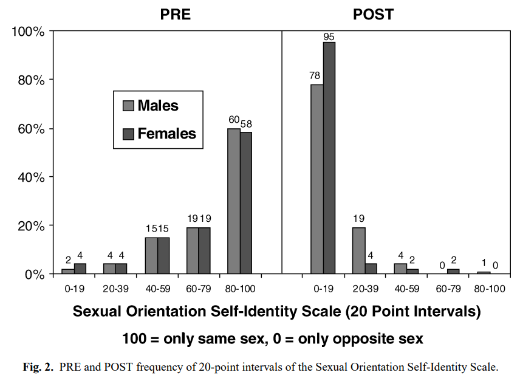

# Homosexuality

## Summary

### Causes

Homosexuality has a wide variety of possible causes:

- Sexual abuse
- Other adverse childhood events
- Atrazine?

Only "about 11% for men and 14% for women"[^rosik] of identical twins are both gay, and despite much searching, no "gay gene" has ever been found, so biological factors likely don't play a big role.  Homosexuality doesn't exist at all in some cultures.

### Effects

- Suicide:
    - "46.8%" of LGB kids have seriously considered suicide.
- Promiscuity
- Crime
- Dangers of male-male sex

Negative effects are largely not 

### Fluidity / Change

## Prevalence

1% have exclusively gay attraction.  20% have either had gay sex or some same sex attraction:
"One review of same-sex populations over the past decade (Black, Gates, Sanders, & Taylor, 2000) found that the proportion of those identifying as gay/bisexual was far smaller—often by a factor of at least one half—than those engaging in same-sex behavior.  In the United States, the United Kingdom, and France, exclusive same-sex behavior rarely characterized more than
1% of the adult population. If the definition was broadened, however, to include individuals who had sex with both sexes, had some degree of same-sex attraction, or had at least one of the two, then the proportion of “gays” expanded to nearly one fifth of the national population. In a representative survey of U.S. adults, 8% reported at least some degree of same-sex attraction,
7% had at least one same-sex behavior since puberty, and 2% identified as gay/lesbian/bisexual."
https://link.springer.com/article/10.1007/s10508-006-9088-5

"In 2005, the British Department of Trade and Industry said "a wide range of research" indicated "lesbian, gay and bisexual people constitute 5-7% of the total adult population." Yet surveys which included adults of all ages put the prevalence closer to 1-2%."
https://www.researchgate.net/publication/266218578_Federal_Distortion_Of_Homosexual_Footprint_Ignoring_Early_Gay_Death

"Same- and both-sex behavior was collapsed into one category because exclusively same-sex behavior was so rare in all three waves (usually <1%) [over 6 years] that an adequate cell number to perform analyses could not be achieved"
https://link.springer.com/article/10.1007/s10508-006-9088-5

> Among high school students, 12.2 percent identified as bisexual, 5.2 percent as questioning, 3.9 percent as other, 3.2 percent as gay or lesbian.  https://thehill.com/homenews/education/3975959-one-in-four-high-school-students-identify-as-lgbtq/

Jan 24, 2024, NBC news [reports](https://www.nbcnews.com/nbc-out/out-news/nearly-30-gen-z-adults-identify-lgbtq-national-survey-finds-rcna135510) that 28% of Gen Z adults (ages 18–25) identify as LGBTQ, with "15% as bisexual, 5% as gay or lesbian and 8% as something else."  Report [here](https://www.prri.org/research/generation-zs-views-on-generational-change-and-the-challenges-and-opportunities-ahead-a-political-and-cultural-glimpse-into-americas-future/) "Gen Z teens were not asked about LGBTQ identification."  10% of all Americans took an LGBT identity in the report.

> A quarter of students are LGBT https://www.cspicenter.com/p/diverse-and-divided-a-political-demography

Remote tribe in Africa.  [Where Masturbation and Homosexuality Do Not Exist](https://archive.is/3gxi8#selection-1439.0-1439.49).

> Is the strong cultural focus on sex as a *reproductive tool* the reason masturbation and homosexual practices seem to be virtually unknown among the Aka and Ngandu? That isn't clear. But the Hewletts did find that their informants -- whom they knew well from years of field work -- "were not aware of these practices, did not have terms for them," and, in the case of the Aka, had a hard time even understanding about what the researchers were asking when they asked about homosexual behaviors.
>
> The Ngandu "were familiar with the concept" of homosexual behavior, "but no word existed for it and they said they did not know of any such relationships in or around the village. Men who had traveled to the capital, Bangui, said it existed in the city ...
>
> other researchers have documented cultures where homosexuality appears not to exist. If homosexual orientation has a genetic component to it -- and there is increasing evidence that it does, in many cases -- then it would not be surprising that this complex human trait (one that involves non-procreative efforts) would be found in some populations but not others.

## Causes 

### Biology

> A number of studies have found that homosexuality is 44 highly familial–gay men have more gay siblings than do straight men (e.g., Bailey et al., 1999; Bailey & Bell, 1993; Bailey, Dunne, & Martin, 2000; Bailey, Willerman, & Parks, 1991; Hershberger, 1997; Pillard, Poumadere & Carretta, 1982; Pillard & Weinrich, 1986; Schwartz, Kim, Kolundzija, Rieger, & Sanders, 2010). These studies have found that brothers of homosexual men are homosexual 7% to 22% of the time, with a median rate of approximately 10% (for reviews, see Bailey & Pillard, 1995; Mustanski, Chivers, & Bailey, 2002) which is well above the estimated base rate of homosexuality in the general population of biological males (Laumann et al., 1994).    Differences across studies in recruitment process, assessment of sexual orientation, source of information (e.g., the gay men themselves reporting about their siblings vs. interviewing the siblings of gay men) likely account for the variation in these findings.  [Singh 2012](https://web.archive.org/web/20170310082304/http://images.nymag.com/images/2/daily/2016/01/SINGH-DISSERTATION.pdf)

> In a study of Australian twins, for example, Bailey, Dunne, and Martin (2000) found a concordance rate of 20% among male MZ [monozygotic - identical] twins.  [Singh 2012](https://web.archive.org/web/20170310082304/http://images.nymag.com/images/2/daily/2016/01/SINGH-DISSERTATION.pdf)

> The findings from behavior genetics studies also support a genetic basis for homosexuality. In a reanalysis of the Australian twin data (Bailey, Dunne, & Martin, 2000), Kirk, Bailey, Dunne, and Martin (2000) estimated the heritability of homosexuality in males to be approximately 30%. In other words, genetic influences accounted for 30% of the variation of sexual orientation in men. In a more recent population based study of Swedish twins, the heritability of homosexuality in males ranged from 34%-39% (Längström, Rahman, Carlström, and Lichtenstein, 2010).  [Singh 2012](https://web.archive.org/web/20170310082304/http://images.nymag.com/images/2/daily/2016/01/SINGH-DISSERTATION.pdf)

Could these be caused by higher rates of sexual abuse?  Need to compare identical twins to brothers.

TODO: Neil Whitehead's talk on gay genes.  Left off at 5:42 https://www.youtube.com/watch?v=z2Hzlv9DHO8

Christopher Rosik:

> Well, actually, the largest and most rigorous studies of identical twins suggest that if one identical twin has SSA, the co-twin will also have SSA only about 11% for men and 14% for women (Bailey, Dunne, & Martin, 2000; Bearman & Brueckner, 2002; Langstrom, Rahman, Carlstrom, & Lichtenstein, 2010). This may be among the lowest twin concordance rates for any behavioral trait ever measured, and it means that factors the twins have in common, such as genes and upbringing, are mostly not responsible for the SSA. Even the APA has backtracked from an earlier position that biology plays a significant role in SSA (APA, 1998) and has more recently acknowledged that no single factor or set of factors is known to definitively determine SSA (APA, 2008).  https://www.journalofhumansexuality.com/_files/ugd/ec16e9_36134d04321845b58245dfeac2a74d68.pdf

#### genetics

There is currently no evidence for a transsexual gene, nor a homosexuality gene for that matter either. Though people are still exploring this, the most likely explanation for homosexuality involves hormones the in utero environment.
http://www.reddit.com/r/AskScienceDiscussion/comments/1xrr8d/is_there_a_transsexual_gene_and_if_so_could/cfeewpw

Why is it completely absent from some cultures?

Nature:  No gay gene:  https://www.nature.com/articles/d41586-019-02585-6

#### Gay uncle theory

> "To compensate for being childless, each fa'afafine [gay uncles in Samoa] would have to somehow support the survival of two additional nieces or nephews who would otherwise not have existed."

> "An Italian group showed that the female relatives of gay men have 1.3 times as many children as the female relatives of straight men. This is a huge selective advantage that a male-loving allele confers on women, and offsets the selective disadvantage that it confers on men."
> https://theconversation.com/born-this-way-an-evolutionary-view-of-gay-genes-26051

#### Born that way?

Completely absent in some cultures:

> "For example, historian Dr. Martin Duberman, founder of the Center for Lesbian and Gay Studies, said “no good scientific work establishes that people are born gay or straight.” And cultural anthropologist Dr. Esther Newton (University of Michigan) called one study linking sexual orientation to biological traits ludicrous: “Any anthropologist who has looked cross-culturally (knows) it’s impossible that that’s true, because sexuality is structured in such different ways in different cultures.”... Dr. Duberman put it this way: “Were people always either gay or straight? The answer to that is a decided no.” Instead, people from other eras who slept with members of their own gender “haven’t viewed that as something exclusive and therefore something that defines them as a different category of human being.”"
>
> "LGBT anthropologists have also found no gay minorities in their studies of cultures around the world. In fact, Dr. Newton noted in an essay that her field has “no essentialist position on sexuality, no notion that people are born with sexual orientations. The evidence, fragmentary as it is, all points the other way.”
>
> Instead, different cultures have a panoply of understandings of sex, gender, and desire specific to their own worldviews. For example, the Native Americans known as berdaches or two-spirits have generally taken on feminine dress and social roles, and almost exclusively partnered with non-berdache men. From an anthropological perspective, if berdaches are a gay minority, then the term “gay” loses all meaning."
> http://dailycaller.com/2014/03/19/nobody-is-born-that-way-gay-historians-say/

### Sexual abuse

> In research with 942 nonclinical adult participants, gay men and lesbian women reported a significantly higher rate of childhood molestation than did heterosexual men and women. Forty-six percent of the homosexual men in contrast to 7% of the heterosexual men reported homosexual molestation. Twenty-two percent of lesbian women in contrast to 1% of heterosexual women reported homosexual molestation. 
> [Comparative data of childhood and adolescence molestation in heterosexual and homosexual persons](https://pubmed.ncbi.nlm.nih.gov/11501300/).  2001.
>
> https://gwern.net/doc/sociology/2001-tomeo.pdf

> "rates of childhood sexual abuse are 12.8 times higher for bisexual men compared to heterosexual men and 5.3 times higher for bisexual women compared to heterosexual women"  Claims being bisuexual is what causes abuse.  Cites another study.
> https://www.ncbi.nlm.nih.gov/pmc/articles/PMC5603307/

> "Males who identify as homosexual or bisexual have an earlier mean age of sexual debut compared to males who identify as heterosexual.  Bisexual and lesbian women also report being younger at heterosexual debut, having multiple sexual partners, and were more likely to report sexual abuse by a male partner compared to heterosexual women. However, bisexual women reported the earliest sexual debut compared to homosexual and heterosexual women."  https://www.sciencedirect.com/science/article/abs/pii/S0145213415000708

> "[R]esearch using a United States population-based sample showed that sexual minorities (gay/lesbian and bisexual respondents) had higher rates of ACEs [Adverse Childhood Events] and higher odds of experiencing multiple ACEs compared to heterosexuals (Andersen & Blosnich, 2013). Childhood sexual abuse and risky family environment, which included witnessing parental violence, relationship strain between respondent and one or both parents, or living with a problem drinker in the household, were significantly associated with identifying as a sexual minority in a community sample (Zietsch et al., 2012). In this sample, women who identified as a sexual minority tended to have fewer close friends, younger fathers, higher rates of physical abuse compared to heterosexual women. However, this association was not observed in men (Zietsch et al., 2012). Nevertheless, population-based samples have shown that sexual minority men may have greater odds of experiencing ACEs, such as sexual abuse than heterosexual men; and sexual minority women had greater odds of experiencing sexual abuse compared to heterosexual women (Sweet & Welles, 2012). Another population-based study showed that gay and lesbian respondents had higher odds of exposure to child abuse (physical or sexual) and housing adversity (homelessness or being forced out of their homes by parents/caregivers) compared to heterosexuals (McLaughlin et al., 2012). Bisexual respondents were more likely to be exposed to child abuse, housing adversity and IPV compared to heterosexuals (McLaughlin et al., 2012)." https://www.sciencedirect.com/science/article/abs/pii/S0145213415000708

> "Similarly, comparing sexual abuse victimization occurring in both age periods, lesbian (19%; PR 2.16; 95% CI 1.80, 2.60) and bisexual (20%; PR 2.29; 95% CI 1.76, 2.98) women were more likely to report victimization than were heterosexual women (9%)."
> https://www.ncbi.nlm.nih.gov/pmc/articles/PMC3912575/

> "Of 327 homosexual and bisexual men participating in an ongoing cohort study pertaining to risk factors for HIV infection who completed a survey regarding history of sexual abuse, 116 (35.5%) reported being sexually abused as children."
> https://www.ncbi.nlm.nih.gov/pubmed/9127231

> 43% of males with same sex attraction reported sexual activity with another male during the ages of 10-12, versus 9% of males with opposite sex attraction.
> “Early sexual behavior in adult homosexual and heterosexual males.” Journal of Abnormal Psychology, Manosevitz, M. (1970)
> https://psycnet.apa.org/record/2005-09878-001

> A large national survey of almost 35,000 Americans showed that more than three times as many men and women who had been sexually abused as children became same sex attracted, versus opposite sex attracted.
> “Origins of Sexual Preference: Sexual Preference. Its Development in Men and Women.” Indiana University Press, Alan P. Bell, Martin S. Weinberg, and Sue Kiefer Hammersmith, (1981)

> 58% of male adolescents who later became same sex attracted suffered sexual abuse as children.
> “Sexual Victimization of Boys: An Ongoing Study of an Adolescent Medicine Clinic Population.” Diane Shrier and Robert L. Johnson, The Journal of the National Medical Association, (1988)
> https://www.ncbi.nlm.nih.gov/pmc/articles/PMC2571548/

> “Thirty-seven percent of participants reported they had been encouraged or forced to have sexual contact before age 19 with an older or more powerful partner; 94% occurred with men.”
> “Self-reported childhood and adolescent sexual abuse among adult homosexual and bisexual men.” Child Abuse & Neglect, Lynda S. Doll, et al., (1992)
> https://www.sciencedirect.com/science/article/abs/pii/0145213492900878

> “…boys victimized by older men were over four times more likely to be currently engaged in homosexual activity than were non-victims. The finding applied to nearly half the boys who had had such an experience. Further, the adolescents themselves often linked their homosexuality to their sexual victimization experiences.”
> “The sexual abuse of male children and adolescents: a review of current research.” The Journal of Child Psychology and Psychiatry, B Watkins and A Bentovim, (1992)
> http://www.ncbi.nlm.nih.gov/m/pubmed/1737828/

> Finklehor (1987) estimated that between 3% and 31% of American men have been sexually abused before the age of 18. This estimation closely matches the actual prevalence rates of CSA among men in the empirical literature, which demonstrated rates between 3% (Lodico & DiClemente, 1994) and 29% (Zierler et al., 1991). In the studies examining CSA in MSM, the prevalence rates were considerably higher and varied from 11.8% (Duncan, 1990) to 37% (Doll et al., 1992).
> “Childhood Sexual Abuse in Men Who Have Sex With Men: The Current State of the Science.” The Journal of the Association of Nurses in AIDS Care, Michael V. Relf, (2001)
> https://www.sciencedirect.com/science/article/abs/pii/S1055329006602604?via%3Dihub

> “In research with 942 nonclinical adult participants, homosexual men and lesbian women reported a significantly higher rate of childhood molestation than did heterosexual men and women. One of the most salient findings was that 46% of the homosexual men in contrast to 7% of the heterosexual men reported homosexual molestation. 22% of lesbian women in contrast to 1% of heterosexual women reported homosexual molestation.”
> “Comparative data of childhood and adolescence molestation in heterosexual and homosexual persons.” Archives of Sexual Behavior, ME Tomeo, et al., (2001)
> https://pubmed.ncbi.nlm.nih.gov/11565236/

> “Information extracted from 13,000 face-to-face interviews clearly showed those with same-sexual or bisexual orientation were more likely to have experienced negative events in childhood…People who had experienced sexual abuse as children were three times more likely to identify themselves as homosexual or bisexual than those who had not experienced abuse…Also, the more adverse events someone experienced in childhood, the more likely they were to belong to one of the ‘non-exclusively heterosexual” groups.”
> “Sexual orientation link to past: study.” Otago Daily News, Allison Rudd (July 23, 2010)
> http://www.odt.co.nz/campus/university-otago/117336/sexual-orientation-link-past-study

> “…male sexual minority individuals were 4.9 times more likely to experience childhood sexual abuse.”
> “A Meta-Analysis of Disparities in Childhood Sexual Abuse, Parental Physical Abuse, and Peer Victimization Among Sexual Minority and Sexual Nonminority Individuals.” The American Journal of Public Health, Mark S. Friedman, et al., (2011)
> https://www.ncbi.nlm.nih.gov/pmc/articles/PMC3134495/

> “Childhood sexual abuse (CSA) is associated with a wide range of health outcomes and is more prevalent among men who have sex with men (MSM) compared to men who have sex with women exclusively.”
> “Age of occurrence and severity of childhood sexual abuse: impacts on health outcomes in men who have sex with men and transgender women.” *The Journal of Sex Research*, Casey D. Xavier Hall, et al., (2021)

Walter Schumm's 2018 book:

> There have been insufficient high quality studies in this area to draw much in the way of firm conclusions about same-sex parents abusing their children, although there is much more evidence that early childhood sexual abuse seems to have occurred frequently in the backgrounds of adult LGBT persons.

Beitchman, Zucker 1992:

> There have been several reports showing a relation between a history of CSA and later homosexual behavior. Fromuth (1986), for instance, found a weak but significant relation between CSA and homosexual experiences (r = .12). Runtz and Briere (1986) reported a significantly higher incidence of homosexual contact among 39 sexually abused women compared with 11 nonabused controls. Meiselman (1978) found that 7 of 23 women abused by their fathers were lesbian or had significant conflicts about homosexual feelings, whereas homosexual behavior was rare in the control group. Herman ( 198 I), however, reported that among 40 incest victims the vast majority of women were exclusively heterosexual. Herman noted that 2 of the 40 women developed a confirmed lesbian identity and 3 others considered themselves to be bisexual. A minimum of 5 out of 40 incest victims (12.5%) would appear to have been involved in homosexual activities--not an insubstantial number. No estimate is given by Herman of the number of women in the control group who had homosexual experiences. In a nationwide study, Gundlach (1977) found a significantly higher proportion of reported childhood rape or molestation among homosexual women, compared with a control group of heterosexual women. The only study that showed no association between homosexual activity and CSA (Bell, Weinberg, & Hammersmith, 198 1) did not adequately define the nature of subjects’ CSA experiences; thus, it is unclear what conclusions about the relation between homosexual behavior and CSA can be drawn from this study. 
>
> https://asianbeacon.org/wp-content/uploads/2018/05/A-Review-of-The-Long-term-effects-of-Child-Sexual-Abuse.pdf

>  "Sexual minority individuals were on average 3.8, 1.2, 1.7, and 2.4 times more likely to experience sexual abuse, parental physical abuse, or assault at school or to miss school through fear, respectively. Moderation analysis showed that disparities between sexual minority and sexual nonminority individuals were larger for (1) males than females for sexual abuse, (2) females than males for assault at school, and (3) bisexual than gay and lesbian for both parental physical abuse and missing school through fear. Disparities did not change between the 1990s and the 2000s."  https://www.ncbi.nlm.nih.gov/pmc/articles/PMC3134495/

> “Before the assault I was straight; however, since the assault I have begun to engage in voluntary homosexual activity. This causes me a great deal of distress as I feel I am not really homosexual, but I cannot stop myself having sex with men. I feel as if having sex with men I am punishing myself for letting the assault happen in the first place” (Walker, Archer, & Davies, 2005, p. 76). https://www.journalofhumansexuality.com/_files/ugd/ec16e9_36134d04321845b58245dfeac2a74d68.pdf

#### Conservative sources:

"it was no surprise when a 2009 report prepared for a bisexual health summit revealed that 74 percent of bisexuals had been sexually abused as children"
https://stream.org/yes-childhood-sexual-abuse-often-contribute-homosexuality/

As explained candidly by the lesbian feminist and academic Camille Paglia, “Every single gay person I know has some sort of drama going on, back in childhood. Something was happening that we’re not allowed to ask about anymore.” (She was speaking of bad relationships with parents as well as sexual abuse or other factors.)
https://stream.org/yes-childhood-sexual-abuse-often-contribute-homosexuality/

Michael Brown:  "In keeping with this, all the professional counselors I have spoken with (including trained pastors and psychologists or psychiatrists) have told me that the vast number of gays they have counseled were sexually abused as minors (some told me this was the case in every instance they encountered)."
https://www.charismanews.com/opinion/in-the-line-of-fire/63254-yes-childhood-sexual-abuse-often-does-contribute-to-homosexuality

“Statistically, about 75% of gay males have been sexually abused by older teens or men,” therapist David H. Pickup told LifeSiteNews.  
https://www.lifesitenews.com/news/kevin-spacey-admits-hes-gay-exposes-man-boy-sex-among-homosexuals

https://www.lifesitenews.com/news/kevin-spacey-admits-hes-gay-exposes-man-boy-sex-among-homosexuals?utm_content=bufferc74e1&utm_medium=social&utm_source=facebook.com&utm_campaign=buffer

"Both the APA Handbook and numerous peer-reviewed studies acknowledge that childhood sexual abuse can be a cause of same-sex attraction in some. "
https://www.cmda.org/resources/publication/influencing-legislatures-captive-to-rainbow-ideology

Contrary sources:
But this study, " In instrumental variable models, history of sexual abuse predicted increased prevalence of same-sex attraction by 2.0 percentage points"
https://www.ncbi.nlm.nih.gov/pmc/articles/PMC3535560/

"Sexual abuse does not appear to be more prevalent in children who grow up to identify as gay, lesbian, or bisexual, than in children who identify as heterosexual."  -- American Psychological Association

"A recent review (Holmes and Slap, 1998) of the research on the molestation of boys, published in the prestigious Journal of the American Medical Association showed that adolescent boys who were abused by men were up to seven times more likely to identify themselves as homosexual or bisexual."  https://afajournal.org/past-issues/1999/june/homosexuality-and-child-molestation-the-link-the-likelihood-the-lasting-effects/

### Psychological

More causes from Spitzer.[^spitzer-2003:h]

#### Separation Anxiety

But is this a cause or an effect?

> A recent line of research has led some authors to conclude that elevated levels of separation anxiety in childhood may be a component of the more general pattern of childhood femininity seen in some homosexual men (for a review, see VanderLaan, Gothreau, Bartlett, & Vasey, 2011a). Using a retrospective design, VanderLaan, Gothreau, Bartlett, and Vasey (2011b) found that homosexual men recalled, on average, significantly higher levels of separation anxiety compared to heterosexual men but similar to those of women. For the homosexual men but not heterosexual men, increases in recalled childhood femininity were associated with increases in separation anxiety. There is also cross-cultural support for this finding. Vasey, VanderLaan, Gothreau, and Bartlett (2011) found that Samoan fa’afafine recalled significantly more childhood separation anxiety compared to Samoan women and (heterosexual) men.  [Singh 2012](https://web.archive.org/web/20170310082304/http://images.nymag.com/images/2/daily/2016/01/SINGH-DISSERTATION.pdf)

### Atrazine pesticide?

https://www.ncbi.nlm.nih.gov/pubmed/21419222

### TODO:

look into 4 point list here:
https://www.reddit.com/r/TrueChristian/comments/f7v3av/some_scientific_facts_about_homosexuality_against/

## Effects

https://carm.org/homosexuality-secular-movements/statistics-on-hiv-aids-and-health-related-issues/

https://carm.org/homosexuality-secular-movements/is-homosexuality-dangerous-to-society/

https://carm.org/homosexuality-secular-movements/homosexual-behavior-doesnt-harm-anyone/

https://exodusglobalalliance.org/ishomosexualityhealthyp60.php

### Psychological

Charles W. Socarides predicted in 1978:

> [I]f all criminal discrimination were to stop today and the punitive laws against homosexuals were repealed immediately—as indeed our Task Force recommended—the homosexual's inner anxieties would still not be eliminated.[^socarides-1978:a]

- In 2021, regular kids:  "19.9% had seriously considered attempting suicide, and 9.0% had attempted suicide"[^footnote2]
- "among high school students nationwide, significant increases occurred between 2009 and 2019 in having persistent feelings of sadness or hopelessness (26.1% to 36.7%), having seriously considered attempting suicide (13.8% to 18.8%), and having attempted suicide (6.3% to 8.9%)"[^cdc-2021]

One in four teenagers who identified as LGBTQ+ said they attempted suicide during the first half of 2021, according to new data released by the Centers for Disease Control and Prevention. The CDC’s findings also revealed that almost half (46.8%) of teenagers who said they are lesbian, gay or bisexual seriously considered a suicide attempt during that same time frame.
https://www.kxan.com/news/national-news/cdc-1-in-4-lgbtq-teens-attempted-suicide-in-first-half-of-2021/

Several sources in this thread and comments:
http://www.reddit.com/r/science/comments/35hw4d/transgender_and_nontransgender_lesbian_gay_and/

In 2021,  regular kids:  "19.9% had seriously considered attempting suicide, and 9.0% had attempted suicide"[^footnote2]

"among high school students nationwide, significant increases occurred between 2009 and 2019 in having persistent feelings of sadness or hopelessness (26.1% to 36.7%), having seriously considered attempting suicide (13.8% to 18.8%), and having attempted suicide (6.3% to 8.9%)"[^cdc-2021]

> A large body of evidence, including well conducted epidemiological studies 60 indicates that individuals from sexual minority populations are at an increased risk for various mental health difficulties, most notably depression, suicide, anxiety, and substance use, compared to their heterosexual counterparts (Cochran, 2001; Cochran & Mays, 2000; Cochran, Sullivan, & Mays, 2003; D’Augelli, 2002; Faulkner & Cranston, 1998; Ferguson, Horwood, & Beautrais, 1999; Gilman et al. 2001; King et al., 2008; Meyer, 2003; Remafedi, French, Story, Resnick, & Blum, 1998), with prevalence rates of suicide attempts ranging from 23% to 42% (D’Augelli & Hershberger, 1993; D’Augelli, Hershberger, & Pilkington, 1998, 2001; Safren & Heimberg, 1999; for a review, see McDaniel, Purcell, & D’Augelli, 2001). Furthermore, studies have found that the increased risk for suicide attempts among sexual minority youth is maintained even after controlling for substance abuse and other psychiatric comorbidity, such as depression (e.g., Herrell et al., 1999). That an association exists between homosexuality and mental health risk is now generally accepted (see meta-analysis by King et al., 2008).  [Singh 2012](https://web.archive.org/web/20170310082304/http://images.nymag.com/images/2/daily/2016/01/SINGH-DISSERTATION.pdf)

### Neurological

“We found that 4 major psychiatric disorders – major depression, bipolar disorder, schizophrenia, and obsessive-compulsive disorder – show a surprisingly high level of similarity in their brain structural abnormalities,” said Dr. Opel. The shared brain areas showing structural aberrations were mainly in cortical areas associated with cognitive processing, memory and self-awareness.
On the flipside, Dr. Opel added, “we were able to identify regional abnormalities with high specificity for certain disorders.” Interestingly, these distinct structural differences sometimes appeared in the same area for two disorders, but in opposite directions from the norm."
https://www.versiondaily.com/the-male-homosexual-brain-structural-and-functional-difference/

### Crime

"Frequency of committing a heinous crime – rape and murder of children --was examined as one empirical test of this disagreement. For 1980-2005, 668 stories about the rape and murder of children (<18 yr.) in 50+ major newspapers in the USA, Australia, Great Britain, Canada, etc. indexed by Lexus-Nexus were found: 202 (30%) involved perpetrators who engaged in homosexual sex (35% of the 206 stories from 1980-1994; 28% of the 462 from 1995-2005). Males constituted 96% and boys (<18 yr.) 6% of the 714 perpetrators. The 209 perpetrators who engaged in homosexual sex accounted for 364 (40%) of the 914 victims – 53.5 (9%) of the 600 girls, and 310.5 (99%) of the 314 boys. About three-quarters of children victimized were <13 yr. In Britain, 30 (51%) of 59 stories involved homosexuality."
https://www.researchgate.net/publication/267373956_Do_Those_Who_Engage_In_Homosexual_Sex_More_Frequently_Rape_and_Murder_The_Underage_A_Test_Of_Traditional_Morality

### Promiscuity

This study says homosexuals are no more permiscuous than straights:

https://blog.okcupid.com/index.php/page/6/
Is there anything that would bias okcupid data?
okc is probably more toward the permiscuous end of heterosexual dating sites, while on the more conservative end of sites used by homosexuals?

"83% of the homosexual men surveyed estimated they had had sex with 50 or more partners in their lifetime, 43% estimated they had sex with 500 or more partners; 28% with 1,000 or more partners... The survey showed 79% of the respondents saying that over half of their sexual partners were strangers" https://exodusglobalalliance.org/ishomosexualityhealthyp60.php

"In their study of the sexual profiles of 2,583 older homosexuals published in Journal of Sex Research, Paul Van de Ven et al. found that "the modal range for number of sexual partners ever [of homosexuals] was 101-500." In addition, 10.2 percent to 15.7 percent had between 501 and 1000 partners. A further 10.2 percent to 15.7 percent reported having had more than 1000 lifetime sexual partners."  https://exodusglobalalliance.org/ishomosexualityhealthyp60.php

"Green (2010) illuminates this question by discussing how many of his LGBT research participants looked forward to marriage because marriage would give them the security to have sex with other persons with less risk of breaking up their relationships. In other words, it was not about the right to marry as much as using marriage as a tool to make the practice of the sexual revolution more acceptable and less risky."  *Schumm, Walter. Same-Sex Parenting Research: A Critical Assessment (Kindle Locations 386-389). Wilbrforce Publications. Kindle Edition.* 

### Family Stability

http://www.salon.com/2014/07/06/worlds_largest_study_on_same_sex_parents_finds_kids_are_healthier_and_happier_than_peers/
http://www.biomedcentral.com/1471-2458/14/635
"Socio-demographically, the parent sample has a high level of education and income, relative to population median income [47], and normative samples. While there is evidence to suggest that maternal education in particular is related to improved child health [50] it is not clear how this translates to same-sex families where the relationship between gender roles and parenting is less clear [30]. This difference in education and income must be considered however when viewing these results, even having adjusted for disparities in statistical analyses. Higher relative income in same-sex families is not surprising however, given that there is often a need to engage in costly and complex medical procedures in order to create a family where the parents are same-sex attracted. "

counter-argument about that study:
http://www.thepublicdiscourse.com/2014/07/13451/

"To be more specific, among the respondents who said their mother had a same-sex romantic relationship, a minority, 23%, said they had spent at least three years living in the same household with both their mother and her romantic partner. Only 2 out of the 15,000 screened spent a span of 18 years with the same two mothers. Among those who said their father had had a same-sex relationship, 1.1% of children reported spending at least three years together with both men.  This strongly suggests that the parents' same-sex relationships were often short-lived, a finding consistent with the broader research on elevated levels of instability among same-sex romantic partners... A 2006 study of same sex marriages in Norway and Sweden found that “divorce risk levels are considerably higher in same-sex marriages” such that Swedish lesbian couples are more than three times as likely to divorce as heterosexual couples, and Swedish gay couples are 1.35 times more likely to divorce (net of controls)... Although there is much speculation that today there are large numbers of same-sex couples in the U.S. who are providing a stable, long-term parenting relationship for their children, no studies based upon large, random samples of the U.S. population have been published that show this to be true, and the above-cited studies of different nations show that on average, same-sex couple relationships are more short-lived than those of opposite-sex couples."
http://www.thepublicdiscourse.com/2012/06/5640/

And here:
https://www.thepublicdiscourse.com/2013/10/10996/

According to one study researched and written by two homosexual authors, of 156 homosexual couples studied, only seven had maintained sexual fidelity, and of the hundred that had been together for more than five years, none had remained faithful (cited by Satinover, 55)
http://thegospelcoalition.org/blogs/kevindeyoung/2014/06/17/five-questions-for-christians-who-support-gay-marriage/

Kids in homosexual families do worse:
"Children living with gay and lesbian families in 2006 [in Canada] were about 65% as likely to graduate compared to children living in opposite sex marriage families. Daughters of same-sex parents do considerably worse than sons."
http://link.springer.com/article/10.1007%2Fs11150-013-9220-y

Twice as many emotional problems among kids with same-sex parents:
http://www.mercatornet.com/articles/view/the_no_difference_theory_is_dead

But this says the opposite:
"When asked about their love lives, gays were more likely to have long term relationships. In fact, 59% had been in a stable, loving relationship for three or more years. They were very committed to their significant others and reported high levels of joy in their lives. Only 19% admitted to cheating on a loved one, which is much lower than the national average."
https://www.psychologytoday.com/blog/disturbed/201311/gay-relationships-can-be-more-stable-straight-ones

Also see:
http://baseballcrank.com/archives2/2013/03/lawpolitics_sam.php
https://traditioninaction.org/HotTopics/a02rStatistcs.html (but some of these seem questionable)

Lots of conflicting research on family stability.  Schumm page 76, bottom:

> Arguments have been made on every side (lower, higher, no difference)
> with respect to family stability for lesbian, gay, and heterosexual parents
> (Schumm, 2015a, b; Schumm, 2016b, pp. 649-655), while some scholars
> have said we do not know that answer. Ball (2003, p. 726) was not aware
> of any study comparing the stability of lesbian and heterosexual parents
> while Peplau and Fingerhut (2007) indicated that “we currently know
> little about the longevity of same-sex relationships” (p. 412). Mezey
> (2015, p. 105) concluded that there had been little research on the
> stability of LGBT families, so that we did not know how their stability
> compared to heterosexual families, even though others had found some
> research on the issue (Biblarz & Stacey, 2010a; Patterson, 2013a;
> Rothblum, 2009; Schumm, 2010e; Stacey & Biblarz, 2001).

Some researchers argue same-sex relationships are more stable.  Schumm 77:

> Ross, Gask, and Berrington (2011) reported lower instability
> rates for same-sex civil unions compared to heterosexual marriages using
> data from Britain. Badgett and Herman (2013, pp. 351-352) reported,
> using State data from States with legal recognition of same-sex couples,
> lower divorce rates for same-sex couples than for heterosexual couples
> (about 1% instability per year compared to 2% for heterosexual married
> couples).

Researchers who argue they're just as stable.  Schumm 77:

> Baetens and Brewaeys (2001), Cooper and Cates
> (2006), Diamond and Butterworth (2009), Hartz (2010), Lubbe (2007),
> Lin (1999), Redding (2008), Rith and Diamond (2013), Short, Riggs,
> Perlesz, Brown, and Kane (2007), Golombok (2017, p. 78) and Ruffini
> (2017, p. 308) have all argued that lesbian and gay relationships were as
> stable as heterosexual ones.  Cooper and Cates (2006) unequivocally stated
> that “Not a single study has found **anything unstable** about the families
> created by lesbian and gay parents” (p. 87).

Some researchers argue they're less stable.  Schumm 77:

> On the other hand, Stacey and Biblarz (2001, p. 177), Biblarz and
> Stacey (2010a), and Patterson (2013a) argued that some research had
> indicated higher rates of instability for same-sex parents. Some scholars
> did not distinguish between rates of stability as a function of parenthood
> status – it is possible that same-sex couples without children might have
> higher rates of stability than same-sex or perhaps even heterosexual
> parents (Kurdek, 2006, p. 513).

Less domestic violence.  Schumm 79:

> Elliott (1996), Murray and Mobley (2009), Redding (2008) and many
> others have argued that domestic violence rates for same-sex couples were
> equivalent or lower than for heterosexual couples. In Goodridge v.
> Department of Public Health (2003) it was contended that the idea of
> greater domestic violence in same-sex relationships was “utterly baseless”
> (Schumm, 2013, p. 323).

TODO Page 83-84 lists the better studies.

### Physical Health

#### Dangers of male-male sex

https://docs.google.com/file/d/0ByZKFBHV9ve0X0ZyV09ValJQWG8/edit

http://fellowshipoftheminds.com/2013/07/03/medical-consequences-of-homosexual-sexual-behaviors/

https://illinoisfamily.org/homosexuality/entire-lgbt-narrative-just-crumbled/#.V8Qk_AmUVXk.facebook

https://cmda.org/article/negative-health-consequences-of-same-sex-sexual-behavior/

#### Mortality rates
"Previous estimates from obituaries and pre-1994 sex surveys suggested that the median age of death for homosexuals is less than 50 yr... The four lines of evidence were consistent with previous findings suggesting that homosexual activity may be associated with a lifespan shortened by 20 to 30 years."
https://www.ncbi.nlm.nih.gov/pubmed/9923159

But critics argue that was due to HIV in the 90s:
https://www.politifact.com/virginia/statements/2012/jun/07/bob-marshall/bob-marshall-says-homosexual-behavior-cuts-life-ex/

But this 1994 study spanned 100 years and showed excluding HIV didn't much affect the mortality rate:
https://journals.sagepub.com/doi/10.2190/G94Q-XMFY-3G33-0XRE

2008, authored by family research council people, published in an unaffiliated Journal:
"Median ages of death in 'gay marriage' for 561 gays and 91 lesbians in Denmark (1990–2002) and 31 gays and 6 lesbians in Norway (1997–2002) were similar to U.S. gay obituaries during the same period: 52 yr. for 710 gays who ostensibly did not die of AIDS, 42 yr. for those 1,476 who supposedly did; and 55 yr. for 143 lesbians. On average, ever-married men outlived the ever-homosexually-partnered by 23 years in Denmark (74 yr. v. 51 yr.), and 25 years in Norway (77 yr. v. 52 yr.); ever-married women outlived the ever-homosexually-partnered in Denmark by 22 years (78 yr. v. 56 yr.), and in Norway by almost 25 years (81 yr. v. 56 yr.)."
https://www.researchgate.net/publication/266218578_Federal_Distortion_Of_Homosexual_Footprint_Ignoring_Early_Gay_Death

Infographic (need to verify some more)
https://www.facebook.com/weswidner/posts/10156522015785292?comment_id=10156522620670292&reply_comment_id=10156524272585292&comment_tracking=%7B%22tn%22%3A%22R%22%7D

### Religion

Support of SSM is associated with many other non-christian views, gay christians are less supportive of christian sexual norms than the average non-christian.
http://www.thepublicdiscourse.com/2014/08/13667/

### On Children

#### lower graduation rates of children in same-sex households:

http://winteryknight.wordpress.com/2014/03/08/study-children-of-same-sex-couples-do-less-well-than-those-of-married-couples/
http://link.springer.com/article/10.1007%2Fs11150-013-9220-y
"Children living with gay and lesbian families in 2006 were about 65 % as likely to graduate compared to children living in opposite sex marriage families. Daughters of same-sex parents do considerably worse than sons."

"'Every single child of gay parents with whom I spoke had certain things in common,' she writes in The Last Closet. 'Those with only same-sex parents in the home ached for their missing parent and longed for a real father, and nearly all of us had been sexualized far too young.'"
https://www.lifesitenews.com/news/daughter-of-famed-sci-fi-author-reveals-sexual-horrors-she-suffered-growing

TODO: https://winteryknight.com/2022/07/21/what-does-scientific-evidence-tell-us-about-the-effectiveness-of-same-sex-parenting/

### Are negative effects due only to persecution?

Mark Regnarus:  "with society’s recent changes in norms and values, there is little evidence that chronic, repetitive, and intense discrimination based on sexual orientation remains a health issue."  https://www.thepublicdiscourse.com/2020/01/59535/

Regnarus:  "Three years ago, [I discovered an error](https://www.sciencedirect.com/science/article/pii/S027795361630627X) in one such study that claimed that anti-gay attitudes contributed to a 12-year reduction in lifespan for sexual minorities. It wasn’t true. (The author eventually admitted the mistake.) " https://www.thepublicdiscourse.com/2020/01/59535/

Regnarus:  "Differences in psychological distress between gay/lesbian and heterosexual respondents [in Sweden] have disappeared over the past 10 years. Real victimization has declined dramatically. But “perceived discrimination” by gay/lesbian respondents has *risen* over that time (from 32 percent in 2005 to 37 percent in 2015). Expectations of being victimized are no different in 2015 than they were in 2005."  https://www.thepublicdiscourse.com/2020/01/59535/  Could a victim mentality be tied to other homosexual psychological disorders?

73% of the psychiatrists in the American Psychiatric Association who responded to a survey by Harold I. Lief said that they thought that homosexual men are less happy than others. 70% percent said they believed that the homosexuals' problems were due more to personal conflicts than to social stigmatization. Study by Harold I. Lief, Sexual Survey Number 4: Current Thinking on Homosexuality, Medical Aspects of Human Sexuality 2 (1977), pp.110- 111.  https://exodusglobalalliance.org/ishomosexualityhealthyp60.php

"Even as social inclusion for young L.G.B.T.Q. people has grown, large health disparities between them and their non-L.G.B.T.Q. peers have not shrunk."  https://www.nytimes.com/interactive/2023/06/03/upshot/up-lgbtq-teens.html

Christopher Rosik:

> LGB-related discrimination appears to directly account for less than 9% of the relationship between discrimination (i.e., heterosexism) and well-being and discrimination and psychological distress (Schmitt, Branscombe, Postmes, & Garcis, 2014) 
>
> 
>
> Many variables theoretically linked to health disparities such as social support, identity concealment, and claiming a gay identity may not play a significant role (Denton, Rostosky, & Danner, 2014; Schmitt et al., 2014). 
>
> 
>
> ne study even finding that LGB individuals who died by suicide had a lower incidence of family conflict (5.7%) than their heterosexual counter parts (17.1%) (Skerrett, Kolves, & De Leo, 2014)   https://www.journalofhumansexuality.com/_files/ugd/ec16e9_36134d04321845b58245dfeac2a74d68.pdf

#### Widespread acceptance in Sweden

The number of people in Sweden who think homosexuality is wrong (5-7%) is about the same as the 5% of Americans who think eating meat is wrong.

In 2021, 93% of Swedes [agreed](https://europa.eu/eurobarometer/api/deliverable/download/file?deliverableId=51316) "There is nothing wrong in a sexual relationship between two persons of the same sex"  This is similar to the [9.5/10 rating](https://sid.usal.es/idocs/F8/FDO22270/discriminacion_europa_sumario_en.pdf) that Swedes gave for being comfortable with a gay neighbor, even back in 2008.   This is roughly similar to the [5% of Americans](https://www.amazon.com/Eat-Meat-Dont-Considering-Arguments-ebook/dp/B07VJ6BWF3) who think it's wrong to eat meat. Yet I'm sure we see all kinds of suicide and other mental health issues among meat-eaters due to discrimination from the 5% of people who are vegetarian?  Right?

Around 5 to 7%[1] of Swedes think homosexuality is wrong, and the numbers have been around that since at least 2008.[2]  In America, around 5% of people think it's wrong to eat meat.[3]  Imaging blaming all the social ills of American meat eaters on this discrimination, lol.

Yet in 2021, 63% of Swedes said discrimination against homosexuals was "[widespread](https://europa.eu/eurobarometer/api/deliverable/download/file?deliverableId=51316)" in their country.  

"Sweden, ­Denmark, and the Netherlands are among the most sexually progressive countries in the West. A spate of studies from the mid-2010s show that homosexual suicide rates in these countries are still at least three times higher than those of heterosexuals." https://www.firstthings.com/article/2021/11/sexual-counter-revolution

"At least 4 studies published in medical journals over the past decade have found that LGBTs in Sweden have significantly higher suicide and suicide attempt rates than heterosexuals. This holds true after controlling for age, marriage status, HIV status, and socioeconomic status. In 1979, Sweden's National Board of Health and Welfare ruled that "homosexuality is no longer a mental disorder," and in 2013, the Swedish government created a webpage declaring that Sweden is "one of the most gay-friendly countries in the world" and that the 2013 "Stockholm Pride parade had an estimated 60,000 participants and 600,000 spectators, one of several signs that LGBT people are a welcomed part of Swedish society." These facts undercut the common claim that the higher suicide rates of LGBTs are due to a lack of societal acceptance."    Sweden has a population of 10m.  https://www.justfactsdaily.com/question-of-the-day/291866

## Fluidity / Change

Only 10% of sexual minorities in the United states want to be heterosexual:

> If someone offered me the chance to be completely heterosexual, I would accept the chance. https://www.mercatornet.com/the_harms_of_conversion_therapy_are_fake_news

### How often people change their attraction
"Among the 14% of Dutch adult males who reported ever having physical attraction to other males, about half noted that these feelings disappeared later in life"  Ritch C. Savin-Williams and Geoffrey L. Ream.  "[Prevalence and Stability of Sexual Orientation Components During Adolescence and Young Adulthood](https://link.springer.com/article/10.1007/s10508-006-9088-5)."  Archives of Sexual Behavior.  2007.
https://pdfs.semanticscholar.org/6ae6/eb443e6876b5b86dffb400e28ff87d9845cd.pdf
https://www.researchgate.net/publication/6605886_Prevalence_and_Stability_of_Sexual_Orientation_Components_During_Adolescence_and_Young_Adulthood

"Comparing sexual attraction in a New Zealand birth cohort at two time periods, first when participants were 21-year olds and then later as 26-year olds, Dickson et al. (2003) found that the proportion of males who reported at least occasional same-sex attraction increased 50% (from 4–6%) and 78% among females (from 9–16%). Nearly all heterosexual males (98%) kept their opposite-sex attraction; 12% of heterosexual females experienced at least occasional same-sex attraction. Migration was in both directions–from heterosexuality to homosexuality and vice versa. Only 38% of exclusive same-sex attracted females stayed in this group with the rest moving into “occasional” same-sex attraction (38%) or exclusive opposite-sex attraction (25%). One half of female and one third of male 21-year olds with occasional same-sex attraction only had opposite-sex attraction as 26-year olds"
https://link.springer.com/article/10.1007/s10508-006-9088-5

"Although most (97%) heterosexuals maintained their heterosexual identity, nonheterosexuals frequently changed their identity label over the life course: 39% of gay males, 65% of lesbians, 66% of male bisexuals, and 77% of female bisexuals."
https://link.springer.com/article/10.1007/s10508-006-9088-5

"The instability of same-sex romantic attraction and behavior (plus sexual identity in previous investigations) presents a dilemma for sex researchers who portray nonheterosexuality as a stable trait of individuals"
https://link.springer.com/article/10.1007/s10508-006-9088-5

"in a 5-year study... of young adults (Dickson et al., 2003)... only 65% of the men with same-sex attraction and 40% of the women with same-sex attraction did so [maintained a consistent rating of attraction over 5 years]"
http://midus.wisc.edu/findings/pdfs/1153.pdf

"in a longitudinal study of women who identified as lesbian, bisexual, or unlabeled at the first time point, 67% had changed their identity at least once over a period of 10 years (Diamond, 2008)." 
http://midus.wisc.edu/findings/pdfs/1153.pdf

"Research shows that women’s sexuality tends to be more responsive to normative influences [peer pressure] than men’s sexuality (Baumeister, 2000)"
http://midus.wisc.edu/findings/pdfs/1153.pdf

"In 2014 the UK’s Royal College of Psychiatrists revised its position on same-sex attraction to say: "sexual orientation is determined by a combination of biological and postnatal environmental factors" . . . "[it] is not the case that sexual orientation is immutable or might not vary to some extent in a person's life...."
https://www.cmda.org/resources/publication/influencing-legislatures-captive-to-rainbow-ideology

> Recent work is also supportive of some spontaneous change (Katz-Wise and Hyde 2015)  https://lc.org/PDFs/Attachments2PRsLAs/2018/081618SOCEStudySanteroWhitehead&Ballesteros(2018).pdf

> In a random sample of 6,000 men and no therapy, and comparing ages 21 and 28, 6.2 percent showed some change of same-sex attraction, and 24 individuals who reported themselves to be exclusively homosexual at age 21 reported themselves exclusively heterosexual at age 28 (Savin-Williams, Joyner, and Rieger 2012). Change is less frequent at older ages, and over the course of ten years, in the fourth decade, 2 percent showed some degree of change in attraction (Mock and Eibach 2011).  https://lc.org/PDFs/Attachments2PRsLAs/2018/081618SOCEStudySanteroWhitehead&Ballesteros(2018).pdf

TODO: Search here for more:
http://thefederalist.com/2018/04/05/probably-think-sex-attraction-fixed-researchers-dont/

Scholar Lisa Diamond (who herself identifies as a lesbian) has long studied and written about the “sexual fluidity” of women. In a 2016 article with her colleague Clifford Rosky, she declared, “Given the consistency of these findings, it is not scientifically accurate to describe same-sex sexual orientation as a uniformly immutable trait.”
https://www.christianpost.com/voice/lgbt-equality-laws-lose-their-foundation-evidence-shows-sexual-orientation-can-change.html

This site says no studies supported change:  https://whatweknow.inequality.cornell.edu/topics/lgbt-equality/what-does-the-scholarly-research-say-about-whether-conversion-therapy-can-alter-sexual-orientation-without-causing-harm/

Christopher Rosik:

> there is a growing research literature on sexual orientation fluidity that must inform this discussion (Diamond, 2008; Dickson, Paul, & Hebiison, 2003; Dickson, van Roode, Cameron, Paul, 2010; Far, Diamond, & Boker, 2014; Mock & Eiback, 2010). One large study of adolescents found that 98% of 16- and 17-year-olds experiencing same-sex attractions shifted to experiencing greater opposite sex attractions just one year later (SavinWilliams, Joyner, & Rieger, 2012; Savin-Williams & Ream, 2007; Whitehead & Whitehead, 2014). Large numbers of young non-heterosexual women and (to a slightly lesser extent) non-heterosexual My Conversation with a Typical Opponent of Professional Therapies That Include Change 10 men report fluidity in their sexual attractions and identities (Katz-Wise, 2015; Katz-Wise & Hyde, 2015), which typically begins before the age of 18.  https://www.journalofhumansexuality.com/_files/ugd/ec16e9_36134d04321845b58245dfeac2a74d68.pdf

### From youth to adult:
"Roughly ten out of every 100 men have had sex with another man at some time—the origin of the 10% gay myth. Most of these will have identified themselves as gay before turning eighteen and will have acted on it. But by age 18, a full half of them no longer identify themselves as gay and will never again have a male sexual partner. And this is not a population of people selected because they went into therapy; it’s just the general population. Furthermore, by age twenty-five, the percentage of gay identified men drops to 2.8%. This means that without any intervention whatsoever, three out of four boys who think they’re gay at age l6 aren’t by 25."
https://www.mercatornet.com/articles/view/mutable_or_immutable/12254
https://www.equip.org/articles/sexual-orientation-change-efforts-whats-repaired/

### Some homosexuals say it's a choice:
If we wanted to be straight, we would be
Attempts to identify a genetic basis for homosexuality refuse to accept that sexual desire is a social construct, 
http://www.theguardian.com/world/2004/dec/14/gayrights.gender (haven't read)

## Change Efforts

### As Described by Proponents

Sexual orientation change efforts (SOCE - pronounced "sow-see") is a broad term meant to help someone not have same sex attraction.  It's also known as sexual attraction fluidity exploration in therapy (SAFE-T), or often pejoratively as conversion therapy.  Reparative therapy is a subset of SOCE that attempts to repair damaged relationships that have led to psychological distress and same-sex attraction.[^sullins-2023-2:a]  SOCE Techniques include:

- Healing the relationship between children and their parents.  Often this is a distant father and an overbearing mother.[^sullins-2023-2:a]
- Helping patients overcome trauma, especially related to adverse childhood events.[^spitzer-2003:h] [^sullins-2023-2:c]
- Helping to develop a more confident gender identification.[^spitzer-2003:a]
- Helping men to have healthy, non-sexual relationships with other men, and fit in as "one of the guys."[^spitzer-2003:a]  Such as attending a men's retreat.[^karten-2010:k] [^santero-2018:p]
- Helping avoid tempting thoughts and situations.[^spitzer-2003:i]

Effectiveness often correlates with desire to change,[^karten-2010:d] [^cummings-2013-2:a] although some are unable to change.  Practitioners recommend against forcing SOCE.[^sullins-2023-2:b]

### As Described by Critics

Nearly all of the major medical associations have statements saying SOCE is ineffective and harmful.[^spitzer-2003:c] [^friedman-2013:a] [^calbreath-2015:a] [^ama-2022] but they can't get the data to agree with their public posturing, as will be seen below.

Wayne Besen, the director of Truth Wins Out says of sexual orientation change efforts, says:

> It is nothing more than a war against gay people, an attempt by homophobes to try to destroy us, get us to hate who we are, to think we are nothing more than sinful. They attack, demonize and dehumanize LGBT people. They hurt gays, without fixing anything. It’s not even junk science. It is the adaptation of medical terminology in the employ of hatred.[^friedman-2013]

Instead they often attempt to associate SOCE with aversion therapy,[^ama-2022:a] a type of therapy that pairs undesirable experiences with triggers of same-sex thought.  In 2018, the well known LGBT activist, nuclear waste expert, and luggage thief Sam Brinton shared a story widely circulated in mainstream media claiming to have been forcibly strapped to a table and electrocuted while being forced to watch videos of gay sex, calling for all SOCE to be criminalized.[^brinton-2018]  But his story was fabricated.[^besen-2022]

While it's true that abusive SOCE techniques were used in the 1960's,[^apa-2009:a] it was a crazy time for psychology, with many other abusive practices in fields having nothing to do with SOCE.[^opd-2014]  Modern SOCE practitioners abhor such these techniques.[^apa-2010:b] [^rosik-2016:a] [^shidlo-2022:f]

What follows is a review of major SOCE reports and studies.  Predictably, studies with participants recruited from ex-gay communities often say SOCE is effective and/or beneficial, while those from pro-LGBT communities say it's ineffective and harmful.[^sullins-2022:f]  Pro-SOCE groups often won't participate in research, feeling they've been treated unethically in the past.[^jones-2007:a] [^dehlin-2015:h] [^santero-2018:t] 

### Reports of Success

#### Early Studies (60's to 2000)

In 1962, Irving Bieber and nine co-authors published a study of sexual orientation change efforts.   They started with 72 exclusively homosexual men.  After therapy, 14 (**19%**) were exclusively heterosexual and 14 (**19%**) were bisexual in behavior.  The survey only measured behavior and not attraction or fantasy.[^spitzer-2003:d]

In 1978, Charles Socarides reported that 20 of his 45 patients (**44%**) came to have "full heterosexual functioning" in terms of behavior, but he did not discuss attraction.[^spitzer-2003:e]

In 2001, Robert Goetze surveyed 84 articles and books on the topic of sexual orientation change.  21 of them showed that some participants were able to have their orientation changed by intervention, but suffered from methodological shortcomings such as lacking detailed sexual history, follow-up assessments, and possible therapist bias.[^spitzer-2003:f]

#### Nicholas Cummings in the 60's and 70's

Nicholas Cummins was the president of the APA from 1979-1980 and was instrumental in having the APA no longer consider homosexuality a mental illness[^cummings-2013:a]  and supports same-sex marriage.[^cummings-2013:b]  He said in the 60's and 70's he had a relatively high success rate in helping people overcome unwanted same-sex behavior:

> Of the patients I oversaw who sought to change their orientation, hundreds were successful.  I believe that our rate of success with reorientation was **relatively high** because we were selective in recommending therapeutic change efforts only to those who identified themselves as highly motivated and were clinically assessed as having a high probability of success...
>
> [C]ontending that all same-sex attraction is immutable is a distortion of reality. Attempting to characterize all sexual reorientation therapy as "unethical" violates patient choice and gives an outside party a veto over patients’ goals for their own treatment. A political agenda shouldn’t prevent gays and lesbians who desire to change from making their own decisions.[^cummings-2013-2]

#### Robert Spitzer in 2003

Along with Nicholas Cummings, Robert Spitzer was also involved in the APA no longer classifying homosexuality as a disorder.[^carey-2012:a]  

Spitzer later began studying SOCE as he believed "previous studies had been biased and inconclusive,"[^carey-2012] and was skeptical SOCE really worked.[^spitzer-2003:l]  He interviewed 200 men and women who had a long history of homosexuality and had achieved at least a 10% change in their sexual orientation that had lasted at least 5 years.[^spitzer-2003:g] 

> At PRE [therapy], 46% of the males and 42% of the females reported exclusively same sex attraction. At POST [therapy], 17% of the males and significantly more of the females, 54%, reported exclusively opposite sex attraction.

11% of males and 37% of females had complete change on every metric, not even having mild and fleeting same-sex thoughts once a year.[^spitzer-2003:j]  Even participants whose orientation only slightly changed still found the therapy very beneficial, and no participants reported harm.[^spitzer-2003:n]  While this survey includes only participants who had changed by at least as small amount, it's notable that a portion made such remarkable changes.  In other Spitzers' study shows that when SOCE works, it seems to work quite well.

Spitzer noted that interviews the patients seemed very honest.[^spitzer-2003:k] [^armelli-2012:b]

Spitzer's study was criticized because it was based on participants own memories from years ago of whether the therapy was successful, and included some ex-gay advocates.[^carey-2012:a]

In 2012, at 79 years old, suffering from worsening Parkinson's symptoms and having long been the subject of intense political pressure,[^friedman-2013:b] Spitzer apologized to the gay community for publishing the study,[^carey-2012] saying he had no way of knowing whether his "subject’s reports of change were credible and not self-deception or outright lying,"[^becker-2012] although countless other self-reporting studies are published with the same limitation.[^spitzer-2003:m] [^armelli-2012:a]  His study was never retracted.

#### Elan Karten and Jay C. Wade in 2010

Psychotherapist Elan Karten and clinical psychology professor Jay C. Wade contacted therapists who do SOCE, as well as ex-gay groups to collect a sample of men who had participated in SOCE.[^karten-2010:a]  They mailed out 350 questionnaires and received 117 responses, a 35% response rate,[^karten-2010:b] which is less than ideal.[^fincham-2008:a]  Those who did respond were highly religious,[^karten-2010:c] which went along with having strong motivation to end same-sex attraction.[^karten-2010:d]

On average the men saw their:

1. Heterosexual self-identity increase **from 2.57 to 4.81**[^karten-2010:e] on a scale from 1 to 6.[^karten-2010:f]
2. Homosexual feelings and behavior decrease **from 18.93 to 12.21**[^karten-2010:h] on a scale from 5 to 25.[^karten-2010:g]
3. Heterosexual feelings increase from **8.45 to 13.13**[^karten-2010:i] on a scale from 5 to 30.[^karten-2010:g]

The men experienced improvements in their self-esteem, social functioning, depression, self-harm, and suicidal thoughts and behavior.[^karten-2010:j]

The men ranked what specific approaches were helpful:

| Technique                                                    | Helpfulness (out of 5) |
| ------------------------------------------------------------ | ---------------------- |
| Understanding causes of your homosexuality & your emotional needs | 4.52                   |
| Developing nonsexual relationships with same-sex peers, mentors, family members & friends | 4.48                   |
| Exploring links between childhood/family experiences and same-sex attraction/behavior | 4.33                   |
| Getting healthy non-sexual touch from other men              | 4.08                   |
| Cognitive reframing of homosexual desire as a symptom of emotional distress to explain away such desire while lessening fear and guilt | 4.08                   |
| Doing things that made you feel manly                        | 4.02                   |
| Learning to maintain appropriate boundaries                  | 3.91                   |
| Meditation and spiritual work                                | 3.88                   |
| Developing a stronger desire to change                       | 3.83                   |
| Avoiding situations that trigger homosexual feelings         | 3.49                   |
| Going to the gym                                             | 3.40                   |
| Abstaining from masturbation                                 | 3.08                   |
| Thought stopping                                             | 3.06                   |
| Playing team sports                                          | 2.76                   |
| Imagining getting AIDS                                       | 1.93                   |
| Using female sex surrogate                                   | 1.45                   |

In addition to understanding the causes, they found that having healthy non-sexual same-sex relationships, mentoring relationships, and men's retreats were among the most helpful in changing unwanted same-sex behavior in men,[^karten-2010:k] while psychiatrists (who prescribe meds) were not very helpful.[^karten-2010:l]  Other psychologists have likewise noted that after correcting "feeling on the outside" and "not feeling like one of the guys," men gradually develop toward more heterosexual thoughts and feelings.[^spitzer-2003:a]

#### Jones and Yarhouse 2011

Conservative psychologists Stanton Jones and Mark Yarhouse recruited 98 men and women who had sought out any among 16 ex-gay ministries around the United States,[^jones-2011:a] and participated in SOCE for less than three years.[^jones-2011:b]  83% of male and 92% of female participants had previously had homosexual sex, while both groups had far less heterosexual activity.[^jones-2011:c] 73 patients were still in the study after about 3 years, and 61 by the end of the study 6-7 years later.    One dropout went back to being gay while several others dropouts reported being healed and didn't like being reminded of having been homosexual.[^jones-2011:d]  Jones and Yarnhouse found:

> Evidence from the study suggested that change of homosexual orientation appears possible for some and that psychological distress did not increase on average as a result of the involvement in the change process... the findings of this study appear to contradict the commonly expressed view that sexual orientation is not changeable and that the attempt to change is highly likely to result in harm for those who make such an attempt.

**23%** of participants self-assessed themselves as successfully no longer gay, while **30%** found success in chastity.[^jones-2011:f]  Participant attraction, infatuation, and fantasy on average from **4.03 to 3.3** between the start and end of the study, on a 6 point scale.  But this average conceals many dramatic shifts both toward and away from gay lifestyles.

#### Santero, Whitehead, and Ballesteros in 2018

In 2018, psychologist Paul Santero, biochemist Neil Whitehead, and educational academic Dolores Ballesteros published a study with methods very similar to Jones and Yarhouse 2011.  They surveyed 125 men[^santero-2018:a] from ex-gay groups and SOCE therapists in the U.S,[^santero-2018:b] who were currently in (42%) or had completed (58%) SOCE therapy.[^santero-2018:d]  Although the survey response rate was unknown.[^santero-2018:c]  The participants were very religious[^santero-2018:e] and religious reasons were the most common reason for wanting change.[^santero-2018:f]  Prior to therapy, about half had recently engaged in homosexual acts,[^santero-2018:h] and greater than 80% were depressed or suicidal.[^santero-2018:g] After therapy:

> Participants reported improvements (with large effect sizes) in self-esteem and social functioning, and similarly decreases in suicidality, substance abuse, depression, and self-harm. Before therapy, they had experienced an average of three of these problems.

Specifically:

1. **68%** saw "some to much" reduction in same-sex attraction and behavior.[^santero-2018:i]
2. Before therapy 109 men had primarily homosexual attraction, and only 48 afterward, a **56%** decrease.[^santero-2018:j]
3. Before therapy, only 5 men had mostly heterosexual attraction but 61 men did afterward, a 12x increase.  22 men (**18%**) felt heterosexual attraction for the first time.[^santero-2018:k]
4. In terms of identity, 84 men tested as homosexual before therapy, 48 did afterward.  Likewise, 28 men tested as heterosexual before therapy, 68 did afterward.[^santero-2018:l]
5. **14%** went from having exclusively homosexual to exclusively heterosexual attraction.[^santero-2018:m]

These rates were substantially higher than the rates at which people change sexual orientation without intervention.[^santero-2018:n]  Techniques rated most helpful and the percent of men who rated it moderately to extremely helpful:[^santero-2018:o]

| Helpful Technique                                            | Helpfulness |
| ------------------------------------------------------------ | ----------- |
| Developing healthy, non-erotic relationships                 | 87%         |
| Understanding causes of your homosexuality & your emotional needs | 83%         |
| meditation and spiritual work                                | 83%         |
| Exploring links between childhood/family experiences and same-sex attraction/behavior | 78%         |
| Learning to maintain appropriate boundaries                  | 76%         |

As with Karten 2010 (above), participants found men's retreats particularly helpful.[^santero-2018:p]  Techniques rated most harmful and the percent of men who rated it slightly (not moderately as above) to extremely harmful:[^santero-2018:q]

| Harmful Technique            | Harmfulness |
| ---------------------------- | ----------- |
| Going to the gym             | 16%         |
| Imagining getting AIDS       | 13.6%       |
| Stopping homosexual thoughts | 12.8%       |
| Abstaining from masturbation | 10.4%       |

Harmful effects of SOCE were minimal and most participants saw moderate to large decreases in suicidality, depression, and substance abuse, along with increases in social functioning and self-esteem.  These rates of benefit versus harm are similar to those seen in psychotherapy for other mental health issues.[^santero-2018:r] [^santero-2018:s]  

##### Retraction

It took the authors 7.5 years to get the study published, significantly longer than what's common.[^whitehead-2019:a]   It was submitted to journal after journal and fared well in peer review, but was delayed due to bureaucratic reasons.  One year after publication it was retracted due to a complaint that participants used a variety of different therapy techniques, but a particular statistical analysis they used is more appropriate when all participants use the same technique.  The paper had passed statistical review at a previous journal, but this editor seemed to lack enough background to navigate the complex statistical debate, and retracted the paper without further explanation.[^whitehead-2019:b]  Typically such statistical errors only receive a follow-up comment, not retraction.[^whitehead-2019:c] The statistical debate does not affect any of the above findings.

#### Paul Sullins 2021

Catholic sociologist Paul Sullins analyzed responses from the same 125 men as in the retracted Santero 2018 study, finding effectiveness and benefit:

> Exposure to SOCE was associated with significant declines in same-sex attraction (from 5.7 to 4.1 on the Kinsey scale, p <.000), identification (4.8 to 3.6, p < .000), and sexual activity (2.4 to 1.5 on a 4-point scale of frequency, p < .000). From 45% to 69% of SOCE participants achieved at least partial remission of unwanted same-sex sexuality; full remission was achieved by 14% for sexual attraction and identification, and 26% for sexual behavior... but 4-10% of participants experienced increased same-sex orientation after SOCE. From 0.8% to 4.8% of participants reported marked or severe negative psychosocial change following SOCE, but 12.1% to 61.3% reported marked or severe positive psychosocial change. Net change was significantly positive for all problem domains.[^sullins-2021]

==TODO== compare to rates of harm for most therapy:

> Regarding accusation of harm from [SOCE], there is plenty of evidence of the “potential for harm” for psychotherapy in general, with 5–10% of adults and 15–24% of minors getting worse from their treatments (Lambert, 2013; Lambert & Ogles, 2004)  https://www.journalofhumansexuality.com/_files/ugd/ec16e9_36134d04321845b58245dfeac2a74d68.pdf

#### Paul Sullins 2022

In 2022, Paul Sullins analyzed the same population dataset used by Blosnich et al 2020, discussed below.  ==TODO==

### Reports of Harm

#### Ariel Shidlo and Michael Schroeder 2001

Ariel Shidlo and Michael Schroeder, two psychologists who identify as gay men, interviewed 202 people who had experienced SOCE, recruiting from gay and ex-gay organizations, newspapers, and email lists.  They found "that a majority failed to change sexual orientation, and many reported that they associated harm with conversion interventions," although some felt helped.[^shidlo-2002]  They reported that **155 (77%)** of their interviewees experienced "significant long term damage from conversion therapy."[^shidlo-2022:e]

Some participants were described as having been forced to undertake SOCE, which inevitably leads to problems.[^shidlo-2002:d] [^sullins-2023-2:a]

At first they recruited participants using the headline "Homophobic Therapies: Documenting the Damage," which explained they intended to "inform the public about the often harmful effects of such therapies."  But they changed to a more neutral headline and text after conducting 20 interviews.  They don't specify how many were *recruited* before the change.[^shidlo-2002:b]  They may as well survey the local BBQ restaurant in search of successful vegetarians.

Despite their sampling bias, the study still demonstrated that participants had only 44% as many suicide attempts after SOCE versus before.[^shidlo-2002:c] 

The authors note their study's limitations:

> The data presented in this article do not provide information on the incidence and the prevalence of failure, success, harm, help, or ethical violations in conversion therapy. The qualitative data obtained can serve to develop rigorous quantitative measures to be validated in future studies.

That's fine, I guess?  Their study is what it is and they're honest about it.  However, their work here has come to be probably the most widely cited study saying that SOCE is harmful.[^sprigg-2021:a] For example:

1. The American Medical Association cites it om their 2022 resolution against SOCE to say, "One study showed that 77% of SOCE participants reported significant long-term harm," with no mention of these severe limitations or of the other studies showing effectiveness and positive outcomes.[^ama-2022]
2. The American Psychological Association cites in their 2021 resolution on SOCE for the claim, "[R]esearch studies using a wide range of designs have found harms associated with SOCE."[^apa-2021]

#### Beckstead (2001); Beckstead (2003); Beckstead & Morrow (2004)

Mormons

#### Weiss et al. (2010)

participants from internet message boards.

> The majority of respondents that reported being suicidal stated that it was the prospect of being gay . . . that led them to thoughts of suicide, rather than the struggle of trying not to be gay. (p. 306)

> In addition, it is worth noting that most of those posting on the “ex-gay” message boards were people still in the process of seeking change, while those on the “ex-exgay” message boards were, by definition, people for whom SOCE was a past event. This creates an apples-to-oranges comparison between current SOCE clients pursuing change and past SOCE clients who 21 had since abandoned any effort to change any aspects of their homosexual orientation. The study omits the entire category of SOCE “successes” who may have completed the change process and now do not embrace a “gay” identity.
>
> ...
>
> Since “ex-ex-gay message boards” might be expected to attract a disproportionate number of people asserting harm or expressing bitterness about the change process, it was actually surprising how positive some of their comments were. They certainly undermine, rather than support, the claim that SOCE generally causes lasting damage.  https://www.journalofhumansexuality.com/_files/ugd/ec16e9_815eaf8689894c1c9d4536e876d8715b.pdf

#### John Dehlin et al. and the Mormons, 2015

John Dehlin is a pro-LGBT Mormon who publishes frequently on Mormonism and LGBT issues.  He and his pro-LGBT colleagues[^dehlin-2015:a] surveyed 1,612 adult Mormon men and women who had participated in SOCE,[^dehlin-2015:b] recruiting them from a wide range of sources that promote and discourage LGBT lifestyles, including both newspapers and Mormon-affiliated LGBT support groups.[^dehlin-2015:c]  Participants were an even mix of active church attendance, inactive, and no longer being Mormon.[^dehlin-2015:d] 

Dehlin and colleagues found SOCE was highly ineffective:

> Our findings suggest that the majority of participants engaged in SOCE via multiple avenues for over a decade (on average). Almost no evidence of SSA being eliminated via SOCE could be found in this sample, and minimal evidence supported successful change in sexual orientation...  only a small percentage of our sample (3.2%) indicated even slight changes in sexual orientation.[^dehlin-2015]

And that SOCE was often harmful:

> SOCE participants in this sample showed no differences in quality of life from those who had not engaged in SOCE, but psychosocial function was lower in those who had engaged in SOCE...
>
> [F]ailed SOCE often led to high levels of self-shame, feelings of unworthiness, rejection and abandonment by God, and self-loathing, as well as “spiritual struggles” for many of our respondents... [M]ost LDS SOCE participants reported little to no sexual orientation change as a result of these efforts and instead reported considerable harm.[^dehlin-2015]

However their questionnaire suffered a **severe methodological flaw**:  It only presented the options:  highly effective, moderately effective, not effective, moderately harmful, severely harmful, conflating benefit/harm and effective/ineffective to a single axis.  No bubbles were available for participants who felt the therapy was ineffective at SOCE but beneficial in other ways.[^dehlin-2015:j]  It's therefore invalid to cite this study to say SOCE is harmful.

But why was SOCE so ineffective among these Mormons?  First, despite the diverse sampling it's not known what percentage of participants were recruited from gay vs ex-gay communities, which invariably give very opposite responses about SOCE.  47% found the survey through "word of mouth" and 21% found it from the internet, including advertisements on liberal news websites.  Another 21% came from a mix of 4 pro-gay and 2 pro-SOCE Mormon communities, percentages in each unknown.  Another 5% came from non-religious pro-GLBT organizations.[^dehlin-2015:c]

Perhaps they saw little success because they frequently used SOCE techniques known to be ineffective, while rarely using techniques demonstrated in studies showing success.  Their "most prevalent method used" was "prayer, fasting, scripture study, improved relationship with Jesus Chris."[^dehlin-2015:e]  Only 6% utilized group retreats,[^dehlin-2015:f] which here and in other studies is often ranked most effective at success, as they allow forming healthy non-erotic bonds.  35% engaged in psychotherapy,[^dehlin-2015:f] typically a helpful approach, but Mormons as a group tend to be averse to opening up in therapy.[^cox-2020:a]  31% sought no external support and only engaged in self-directed SOCE.[^dehlin-2015:g]

> Ironically, methods most frequently rated as “effective” tended to be used the least and for the shortest duration, while methods rated most often as “ineffective” or “harmful” tended to be used most frequently and for the longest duration.[^dehlin-2015]

Or perhaps many Mormons found it easier to leave Mormonism and the many issues surrounding its foundational claims, than change their homosexual thoughts and behaviors.  While Christians find it easier to change themselves than to dismiss the ample evidence supporting Christianity.

Shortly afterward, most of the same authors published another analysis of this same data, looking specifically at those who sought psychotherapy.[^bradshaw-2015]  Psychologist Christopher H. Rosik published a critique of both studies in the conservative Journal of Human Sexuality.[^rosik-2014]

#### John Blosnich et al versus Paul Sullins in 2020-2022

In 2020, LGBT researcher John R. Blosnich published a review of survey data taken from 1518 LGB adults and concluded that failed SOCE patients had:

> nearly twice the odds of lifetime suicidal ideation, 75% increased odds of planning to attempt suicide, and 88% increased odds of a suicide attempt with minor injury compared with sexual minorities who did not experience SOCE.[^blosnich-2020]

Blosnich's paper became highly influential and was cited by the American Psychological Association in their book, *The Case Against Conversion Therapy*.  Likewise the UK Equality Office cited it frequently in arguing for a ban on conversion therapy.[^cook-2023:a]

However, Catholic gender/sexual orientation expert Paul Sullins pointed out flaws in Bloscnich's study:

1. Oddly they only measured suicidality, while ignoring the survey data on other negative outcomes such as substance abuse, self-harm, and mental health.[^sullins-2022:a]
2. They ignored that sexual orientation change efforts were much more common among the poor and those with traumatic childhoods, two factors making negative outcomes more common among that group.[^sullins-2022:b]
3. They only measured suicidality across the lifetime of the respondents, not considering whether suicidality was before or after the failed SOCE.[^sullins-2022:c]
4. When taking the order into account, those who failed SOCE "were about five times less likely to currently attempt suicide than were persons of comparable demographics and stress experience who were not exposed to SOCE."[^sullins-2022] and were not any more likely to experience the other measured negative outcomes.[^sullins-2022:d]

The last point is remarkable, considering that around half of the failed SOCE patients seemingly didn't try to stop being attracted to the same sex.[^sullins-2022:e]  Forced therapy is often unproductive and not recommended by SOCE practitioners.[^sullins-2023-2:b]

In a comment, response, Blosnich and co-author Ilan H. Meyer agreed that they didn't account for whether suicidality happened before or after sexual orientation change efforts.[^meyer-2022:a]  But they questioned Sullins' assumption that sexual orientation change efforts only lasted a year, because the survey only asked for the most recent sexual orientation change effort and not start and end dates.[^meyer-2022:b]

In response, Sullins acknowledged that assuming one year was too short of a time,[^sullins-2023:a] but "even expanding the presumed duration of SOCE to six years did not alter this result."[^sullins-2023:b] that even failed SOCE still reduced negative outcomes.

### Studies yet to go through:

#### Beckstread, 2002

> However, after listening to how they described their heterosexual arousal, Beckstead concluded that it was not “generalized heterosexual arousal” for two main reasons: either because the arousal was limited to one person (e.g., only the subject’s spouse), whereas typically heterosexuals are attracted to more than one person of the opposite sex; or because the opposite sex arousal in his participants didn’t have the “intensity” that is typically present in heterosexuals. In the article itself, Beckstead does not explain to the reader the justification for his arbitrary definition of what constitutes a significant increase in heterosexual arousal... Beckstead would apparently consider reparative therapy as a failure for the many participants in this study who, prior to reparative therapy, had been unable to become sexually aroused by the opposite sex, but following the therapy were, but only to their spouse.[^spitzer-2003]

#### Phelan, Whitehead, & Sutton, 2009

Shows SOCE works.

#### Pela 2021

https://www.journalofhumansexuality.com/_files/ugd/ec16e9_d0708a0dc82e4da78e0258eb96dc1467.pdf

It's a conservative journal.

#### Ryan et al 2020

https://www.ncbi.nlm.nih.gov/pmc/articles/PMC10371222/

Surveyed only LGBT kids whose parents sent them to therapy:

> In a cross-sectional study of 245 LGBT White and Latino young adults (ages 21–25), we measured parent-initiated SOCE during adolescence and its relationship to mental health and adjustment in young adulthood. 
>
> Attempts by parents/caregivers and being sent to therapists and religious leaders for conversion interventions were associated with depression, suicidal thoughts, suicidal attempts, less educational attainment, and less weekly income.

#### Higbee et al 2020

Misrepresents "conversion" therapy:

> Conversion therapy efforts can include various painful forms of aversion therapy ranging from hypnosis to inducing vomiting or paralysis or administering electric shocks while showing the individual homoerotic images (American Medical Association, 2019; Hein & Matthews, 2010).  "In extreme cases, they may also include surgical and hormonal interventions, or so-called ‘corrective’ rape" (National LGBT Survey Research Report, 2018, p. 83).  However, more commonly conversion therapy focuses on prayer, talk, and behavioral therapy that attempts to diminish the individual’s same-sex attractions or gender expression through shame and forced adherence to strict gender roles (Flentje, Heck., & Cochran, 2013).

> The Higbee et al. (2020) study commits
> the same error of including only sexual
> minorities who are LGBTQ-identified, which
> eliminates by definition those who may have
> had beneficial experiences with sexual
> attraction fluidity exploration and hence did
> not adopt such a sexual identity label.
> Moreover, the authors were exceedingly
> conscious of their decision to exclude those
> who did not identify as LGBQ They
> acknowledge, "we chose to only include
> sexual orientation in our analysts because the
> other variables often measure individuals
> who identify as heterosexual but engage In
> same-sex sexual activity rather than
> individuals with a solidified LGBQ+ sexual identity" (p. S, my emphasis). This exclusion
> likely places severe limitations on
> interpretation of the study's results.
> Another concern is the authors' causative
> assumptions from correlational data,
> concluding that, "The finding that
> respondents who undergo conversion therapy
> before age 15 are significantly more likely to
> experience serious mental illness further
> substantiates the scientific consensus around
> conversion therapy as a psychologically
> harmful practice" (p. 13). This is precisely
> the kind of erroneous thinkmg that Sullins'
> reanalysis so effectively challenges, as
> Higbee et al. have no idea of the pre-SOCE
> distress levels of their participants. Other
> problems with this study are fairly "run of the
> mill" for this literature, such as a definition of
> conversion therapy that almost exclusively
> highlights obsolete practices such as using
> hypnosis to induce vomiting and paralysis:
> administering electric shocks, and
> "corrective rape."
> 
>https://archive.iftcc.org/ideological-gatekeeping-or-quality-control-one-authors-experience-with-peer-review-at-the-american-psychologist/

#### Nicolosi et al 2000

https://pubmed.ncbi.nlm.nih.gov/10932560/

==TODO==

#### Przeworski et al 2020

> Finally, Przeworskl et al. (2020) offer a
> systemic recrew of the SOCE literature. As
> noted by Schumm et al. (this issue),
> Przuworskl et al.'s review primarily relied
> on studies that were very old and or based on
> small sampless which is a poor basis for
> drawing conclusions about contemporary
> forms of sexual attraction fluidity explorauon
> in therapy (SAFE-T)- The research in this
> review of SOCE is thus subject to the same
> methodological concerns we were attemptmg
> to address, i.e., a lack of assessment for pre-
> SOCE distress. To a significant degree this
> review is already outdated and needs to take
> into account the research we refer to tn our
> comment. To summarize and return to the
> second reviewer's feedback. it appears all
> three of these papers serve effectively to
> highlight our concerns rather than refute them.
>
> https://archive.iftcc.org/ideological-gatekeeping-or-quality-control-one-authors-experience-with-peer-review-at-the-american-psychologist/

#### Sullins 2022:

https://link.springer.com/article/10.1007/s10508-022-02408-2

#### Forsythe et al 2022

> The Forsythe et al. (2022) study commits the very methodological errors our comment sought to brtng to light. First, the study's participants were all LGBTQ-identified individuals. Second, the authors repeatedly cite Blosnich et al. (2020) in their arguments. They do acknowledge the possibility of selection bias such as that discovered in Sullins' reanalysis of Blosnich et al-, i.e., that preexisting distress leads to the pursuit of SOCE. However, they dismiss this by assertmg " - - - such an argument assumes that they freely seek SOGICE" (sexual orientation and gender identity change efforts; p. 499), adding, "With such prevalent
> pressure to change orientation or identity, it
> is unlikely that LGBTQ individuals who
> undergo SOCE differ from their peers except
> for the extent ofthe pressure or coercion they
> receive" (p. 499). Of course, Sullins'
> reanalysis, based on a nationally
> representative sample obtained through the
> gay-allied Williams Institute at UCLA-
> clearly takes precedence over the
> speculations of Forsythe et al.
>
> https://archive.iftcc.org/ideological-gatekeeping-or-quality-control-one-authors-experience-with-peer-review-at-the-american-psychologist/

Also 74% were relgious providers, 26% licensed.

### Interference

Littman 2018 noted that LGBT activists prevented her from conducting further surveys.

Groups often refuse to participate.[^jones-2007:a] [^dehlin-2015:c]

### Survey of therapists

"Although only 55 (4%) of therapists reported that they would [currently?] attempt to change a client's sexual orientation if one consulted asking for such therapy, 222 (17%) reported having assisted at least one client/patient to reduce or change his or her homosexual or lesbian feelings"
Of those 17%, "159 (72%) of the 222 therapists who had provided such treatment considered that a service should be available for people who want to change their sexual orientation."
https://bmcpsychiatry.biomedcentral.com/articles/10.1186/1471-244X-9-11

> 6.9% of sexual minority persons in the United States have experienced SOCE therapy of some sort.  https://www.frontiersin.org/journals/psychology/articles/10.3389/fpsyg.2022.823647/full

Generally only works when clients are motivated to change?

### Suicide Risk

> Recent studies have claimed that such therapies increase suicide risk by showing positive associations between SOCE and lifetime suicidality, without excluding behavior that pre-dated SOCE...
>
> Undergoing SOCE after expressing suicidal behavior reduced subsequent suicide attempts from 72 to 80%, compared to those not undergoing SOCE, when SOCE followed a prior expression of suicidal ideation (AOR .17, .05-.55), planning (AOR .13, .04-.45) or intention (AOR .10, .03-.30);  https://pubmed.ncbi.nlm.nih.gov/36066677/

##### The Trevor Project:

> The survey found that 39 percent of LGBTQ youth surveyed have seriously considered suicide in the past twelve months, with more than half of transgender and non-binary youth having seriously considered suicide. Nearly 1 in 5 LGBTQ youth in this study attempted suicide in the past twelve months, with nearly 1 in 3 transgender and non-binary youth having attempted.
>
> 42 percent of LGBTQ youth who underwent conversion therapy reported a suicide attempt in the last year, with 57 percent of transgender and non-binary youth who have undergone conversion therapy reporting a suicide attempt over the past 12 months.  https://www.thetrevorproject.org/blog/landmark-study-finds-39-percent-of-lgbtq-youth-and-more-than-half-of-transgender-and-non-binary-youth-report-having-seriously-considered-suicide-in-the-past-twelve-months/

But why isn't it published in a peer review journal?

> LGBTQ youth who were subjected to conversion therapy reported more than twice the rate of attempting suicide in the past year compared to those who were not.  https://www.thetrevorproject.org/survey-2021/?section=Discrimination

Their survey had three categories:

- Not threatened with or subjected to conversion therapy
- Threatened with conversion therapy
- Subjected to conversion therapy

But there's no category for those who wanted sexual orientation change therapy.

98,023 participants were "recruited via targeted ads on social media" with 35,208 LGBTQ after screening.

### Misc:

https://familystructurestudies.com/summary

Sprigg reviews lots of studies that claim harm:  https://www.journalofhumansexuality.com/copy-of-new-page-5-3

Call for a ban on sexual orientation change effort research:

> The ethical concerns and human rights violations associated with SOCE presented above render the relationship between SOCE and suicidality along with the question of causality secondary. Any work advocating human rights violations, which also constitute unethical and fraudulent “treatment” of individuals or patients, has no place in scientific discourse.  https://www.researchgate.net/profile/Paul-Sullins/publication/370466840_Do_Sexual_Orientation_Change_Efforts_SOCE_increase_suicidal_risk_for_sexual_minorities_An_exchange/links/6451646597449a0e1a706eb2/Do-Sexual-Orientation-Change-Efforts-SOCE-increase-suicidal-risk-for-sexual-minorities-An-exchange.pdf

Dr. Irving Bieber and colleagues:

> “The therapeutic results of our study provide reason for an optimist ic outlook. Many homosexuals become exclusively heterosexual in psychoanalytic treatment. Although this change may be more easily accomplished by some than others, in our judgment, a heterosexual shift is a possibility for all homosexuals who are strongly motivated to change.”
> catholiceducation.org/articles/sexuality/h00092.html (unverified)

> “A review of the research over many years demonstrates a consistent 30-52% success rate in the treatment of unwanted homosexual attraction. Masters and Johnson reported a 65% success rate after a five-year follow-up. Other professionals report success rates ranging from 30% to 70%”.  https://catholicexchange.com/mutable-or-immutable/

Disputed by scientific american as unverified:  

> "Most staffers never met any of the conversion cases during the study period of 1968 through 1977, according to research I've done for my new book Masters of Sex. Clinic staffer Lynn Strenkofsky, who organized patient schedules during this period, says she never dealt with any conversion cases. Marshall and Peggy Shearer, perhaps the clinic's most experienced therapy team in the early 1970s, says they never treated homosexuals and heard virtually nothing about conversion therapy.  When the clinic's top associate, Robert Kolodny, asked to see the files and to hear the tape-recordings of these "storybook" cases, Masters refused to show them to him."
> https://www.scientificamerican.com/article/homosexuality-cure-masters-johnson/

> "23% of the subjects reported success in the form of ‘conversion’ to heterosexual orientation and functioning, while an additional 30% reported stable behavioral chastity with substantive disidentification with homosexual orientation. On the other hand, 20% of the subjects reported giving up on the change process and fully embracing gay identity”. Dr. Jones said, “I conclude from these data and years of study that homosexual orientation is sometimes mutable”.

> Results indicated that overall there were significant reduction in homosexual feelings and behavior and an increase in heterosexual feelings and behavior.  https://www.jpost.com/jerusalem-report/israel/wrestling-with-reversal-334664

Christopher Rusik:

> Regarding accusation of harm from [SOCE], there is plenty of evidence of the “potential for harm” for psychotherapy in general, with 5–10% of adults and 15–24% of minors getting worse from their treatments (Lambert, 2013; Lambert & Ogles, 2004)  https://www.journalofhumansexuality.com/_files/ugd/ec16e9_36134d04321845b58245dfeac2a74d68.pdf

### Unsorted:

Support for its effectiveness and legality:
https://cmda.org/resources/publication/influencing-legislatures-captive-to-rainbow-ideology

And the politics of Exodus International:
https://www.reddit.com/r/TrueChristian/comments/3nrml2/in_regards_to_homosexuality_in_romans_126_says/cvquwu5

It's claimed to be dangerous and ineffective.  I think we should keep trying to find solutions.  But the stats are still better than Alzheimer's drugs.  Should we stop trying to cure alzheimers?
"Between 2002 and 2012, they found 99.6% of trials of drugs aimed at preventing, curing or improving the symptoms of Alzheimer's had failed or been discontinued.  This compares with a failure rate of 81% for cancer drugs."
http://www.bbc.co.uk/news/health-28125265

TODO: Check these sources:
http://rethinkingtheology.com/2012/07/11/homosexuality-good-news/

TODO: 
"Despite the American Psychiatric Association’s treatment of homosexuality as
a normal variant of human sexuality for over 30 years, dissenters have continued to promote reorientation therapy as a tenable treatment option (e.g., Byrd, 1993; Consiglio, 1991; MacIntosh, 1994a & b; McCounaghy 1969, 1970, 2003; Moberly, 1983; Nicolosi, 1997; Socarides, 1979)"

Lots here:  "https://www.mercatornet.com/articles/view/mutable_or_immutable/12254"

https://www.josephnicolosi.com/published-papers

"participants experienced a significant decrease in the frequency of their same-sex attraction experiences, i.e., thoughts, feelings, and behaviors, including explicitly sexual ones. Participants also reported a significant increase in their opposite-sex attraction experiences. Finally, the participants in this study reported significant fluidity or change toward a heterosexual identity. Overall, the results of this study document that exploring sexual attraction fluidity in therapy can be effective, beneficial, and not harmful."  [Sexual Attraction Fluidity and Well-Being in Men: A Therapeutic Outcome Study](https://www.journalofhumansexuality.com/_files/ugd/ec16e9_d6b14c067ae64bf095bb19c4757e8ff9.pdf)  Carolyn Pela and Philip Sutton.  Journal of Human Sexuality. 2018?

### Perspectives of therapists on conversion therapy

22% either would or have done conversion therapy:

"Although only 55 (4%) of therapists reported that they would attempt to change a client's sexual orientation if one consulted asking for such therapy, 222 (17%) reported having assisted at least one client/patient to reduce or change his or her homosexual or lesbian feelings"
Of those 17%, "159 (72%) of the 222 therapists who had provided such treatment considered that a service should be available for people who want to change their sexual orientation... A significant minority of mental health professionals are attempting to help lesbian, gay and bisexual clients to become heterosexual. Given lack of evidence for the efficacy of such treatments, this is likely to be unwise or even harmful."
https://bmcpsychiatry.biomedcentral.com/articles/10.1186/1471-244X-9-11

Nicholas Cummins was the president of the APA from 1979-1980 and was instrumental in having the APA say that homosexuality is not a disorder.  But he says:  "contending that all same-sex attraction is immutable is a distortion of reality. Attempting to characterize all sexual reorientation therapy as ‘unethical’ violates patient choice and gives an outside party a veto over patients’ goals for their own treatment. A political agenda shouldn’t prevent gays and lesbians who desire to change from making their own decisions."
https://www.usatoday.com/story/opinion/2013/07/30/sexual-reorientation-therapy-not-unethical-column/2601159/

This article outlines bias in the APA and other organizations:
http://www.equip.org/article/sexual-orientation-change-efforts-whats-repaired/

## Link with Pedophilia

https://www.wnd.com/2002/04/13722/
https://www.familyresearchinst.org/2009/02/child-molestation-and-homosexuality-2/

A literature review of 19 studies by Paul Cameron in 1985:
"Using random probability studies reported by three different sets of investigators, an estimate that about 4% of the general population is bisexual-to-homosexual was employed to generate relative degrees of 'dangerousness' of the various sexual orientations. It appears that at least a third of all the reported child molestations involve homosexual acts, while girls account for about two-thirds of children victimized. Those who practice homosexual acts are at leas: 12 times more apt to molest a child sexually, and with suitable corrections for bisexuals (who molest both genders), probably at least 16 times more apt to molest a child. A review of recorded cases of teacher-pupil sexual interaction indicated that of the 30 instances detailed in the literature, 24 (80%) involved home sexual acts. It appears that teachers who practice homosexual acts are between 90 to 100 times more apt to involve themselves sexually with pupils than teachers who confine themselves to heterosexual acts."
Homosexual molestation of children/sexual interaction of teacher and pupil.
https://journals.sagepub.com/doi/10.2466/pr0.1985.57.3f.1227

"NARTH found that homosexual males were “three times more likely than straight men to engage in adult-child sexual relations... In the Nebraska Medical Journal Cameron said that when data from both genders are combined, homosexuals are at least 8-12 times more likely to molest children than are heterosexuals.  In the face of such overwhelming evidence, homosexual activists resort to a circular argument: since true homosexuals only desire sex with another adult, then pedophiles cannot be homosexual. In effect, activists have simply defined homosexual molestation of children out of existence."  https://afajournal.org/past-issues/1999/june/homosexuality-and-child-molestation-the-link-the-likelihood-the-lasting-effects/

"A disproportionate percentage - 29 percent - of the adult children of homosexual parents had been specifically subjected to sexual molestation by that homosexual parent, compared to only 0.6 percent of adult children of heterosexual parents having reported sexual relations with their parent. "Having a homosexual parent(s) appears to increase the risk of incest with a parent by a factor of about 50." Reference - P. Cameron and K. Cameron, "Homosexual Parents," Adolescence 31 (1996): 772

"Previous investigations have indicated that the ratio of sex offenders against female children vs. offenders against male children is approximately 2:1, while the ratio of gynephiles to androphiles among the general population is approximately 20:1. The present study investigated whether the etiology of preferred partner sex among pedophiles is related to the etiology of preferred partner sex among males preferring adult partners. Using phallometric test sensitivities to calculate the proportion of true pedophiles among various groups of sex offenders against children, and taking into consideration previously reported mean numbers of victims per offender group, the ratio of heterosexual to homosexual pedophiles was calculated to be approximately 11:1. This suggests that the resulting proportion of true pedophiles among persons with a homosexual erotic development is greater than that in persons who develop heterosexually. This, of course, would not indicate that androphilic males have a greater propensity to offend against children."

### Catholic Priests

83% of children abused by catholic priests are male - https://ruthinstitute.org/clergy-abuse-statistics/

> by the 1980s, well over 16% of the clergy was homosexual. This was more than 8 times the proportion of the general population.
>
> https://ruthinstitute.org/clergy-abuse-statistics/
>
> the overwhelming majority of incidents (83% in GJR, 82% in JJR) consisted of male-on-male abuse
>
> Reports of comparable minor sex abuse in Germany likewise report that the victims of Catholic priests were up to 90% male, but the victims of male perpetrators in Protestant or non-religious settings were only about half (46-49%) male.  This striking difference seems to suggest, on its face, that Catholic abusers strongly prefer males as sexual objects, or put another way, child sex abuse among Catholic clergy is largely perpetrated by homosexual, not heterosexual, priests. 
>
> https://ruthinstitute.org/wp-content/uploads/2021/11/Clergy-Sex-Abuse-120118-1.pdf

### Contrary views:
"In a 1994 study, researchers reviewed 352 medical charts, representing all of the children seen in the emergency room or child abuse clinic of a Denver children’s hospital as a result of being sexually abused. In looking at charts for a one year period (from July 1, 1991 to June 30, 1992), the researchers found that the molester was a gay or lesbian adult in fewer than 1 percent of cases (2 of 269) in which the adult molester could be identified. (Jenny, Roesler, and Poyer, 1994)."

However, "But in a review of the Jenny study, Dr. Paul Cameron of Family Research Institute said the researchers merely examined hospital charts: “[N]either the victims, perpetrators, nor even those who prepared the charts were interviewed” to discover their sexual orientation.  In fact, said Cameron, in the only study (Erickson, Walbek, and Seely, 1988) in which perpetrators were asked to declare their sexual orientation, almost the opposite was found to be true: 86% of child molesters identified themselves as homosexual or bisexual."  https://afajournal.org/past-issues/1999/june/homosexuality-and-child-molestation-the-link-the-likelihood-the-lasting-effects/

"In yet another approach to studying adult sexual attraction to children, some Canadian researchers observed how homosexual and heterosexual adult men responded to slides of males and females of various ages (child, pubescent, and mature adult). All of the research subjects were first screened to ensure that they preferred physically mature sexual partners. In some of the slides shown to subjects, the model was clothed; in others, he or she was nude. The slides were accompanied by audio recordings. The recordings paired with the nude models described an imaginary sexual interaction between the model and the subject. The recordings paired with the pictures of clothed models described the model engaging in neutral activities (e.g., swimming). To measure sexual arousal, changes in the subjects' penis volume were monitored while they watched the slides and listened to the audiotapes. The researchers found that homosexual males responded no more to male children than heterosexual males responded to female children (Freund et al., 1989)."  https://lgbpsychology.org/html/facts_molestation.html

### Among other groups:

"The DSM-V indicates that the highest prevalence for pedophilia in male population is 3-5%.  As such, about 1.12-1.86% of the world’s population are pedophiles."

"The best available data reports that 4 percent of Catholic priests sexually violated a minor child during the last half of the 20th century"
https://www.psychologytoday.com/us/blog/do-the-right-thing/201808/separating-facts-about-clergy-abuse-fiction

This unverified infographic suggests teachers are three times more likely than catholic priests to sexually abuse:  https://www.facebook.com/photo.php?fbid=7181434961917583&set=p.7181434961917583&type=3

Among protestants:  "2% are believed to be potentially diagnosable as a pedophile"
https://www.mdpi.com/2077-1444/9/1/27/pdf

These are both below the "5-7 percent of public school teachers [who] engaged in similar sexually abusive behavior with their students"  https://www.psychologytoday.com/us/blog/do-the-right-thing/201808/separating-facts-about-clergy-abuse-fiction

"One third of abused children will eventually victimize their own children"
https://www.aswllp.com/Sexual-Molestation-Abuse/What-are-the-Long-Term-Effects-of-Childhood-Sexual-Abuse.shtml

35% of male molestors were molested as kids.  11% of normal men were molested as kids:
"The overall rate of having been a victim was 35% for perpetrators and 11 % for non-perpetrators."

What is the rate of pedophilia among homosexuals who were not molested as kids?

### Contagion
"Among 747 males the risk of being a perpetrator was positively correlated with reported sexual abuse victim experiences. ... A high percentage of male subjects abused in childhood by a female relative became perpetrators. Having been a victim was a strong predictor of becoming a perpetrator, as was an index of parental loss in childhood."
https://www.charismanews.com/opinion/in-the-line-of-fire/63254-yes-childhood-sexual-abuse-often-does-contribute-to-homosexuality

### Counter-Arguments

> As seen in the analysis of arguments, "danger to the young" is a prominent anti-homosexual propaganda theme. This translates into the widespread belief that Gay people are likely to sexually molest young children.  It is only as a persistently promoted accusation that this myth remains an issue. Recognized researchers in the field of child abuse, including law enforcement research, almost unanimously concur that homosexual people are actually less likely to sexually approach children (Burgess et al., 1978).  Groth and Birnbaum conclude, for example: "It appears then, that the heterosexual adult constitutes more of a threat to the underage child than does the homosexual adult" (1978, p. 180). Dr. Groth, Director of the Sex Offender Program for the Connecticut Department of Corrections, finds child molesters typically hostile toward Gay people and homosexuality in general (Groth & Bimbaum, 1978).
>
> Laboratory experiments by Freund et al. (1973) physiologically measured actual sexual arousal in response to various erotic displays. Heterosexual male subjects were found somewhat more likely to be sexually aroused by photos of little girls than were homosexuals viewing photos of
> boys—the latter was found to be as unlikely a source of arousal as landscapes.
>
> There is such an immense body of evidence refuting the myth of Gay
> people as a sexual danger to children that it is simply inappropriate as an
> issue. Were it not for lurid media distortion and the lack of public access to
> reliable information on sexual orientation, and sexuality at large, this kind of
> anti-homosexual vilification would not merit a serious response.

Homosexuality : social, psychological, and biological issues.  1982.
https://archive.org/details/homosexualitysoc00paulrich/page/302/mode/2up

## Unsorted

### Misc

> Paul Sullins says [-3:25 here](https://www.churchmilitant.com/video/episode/intv-the-effectiveness-of-sexual-orientation-change-efforts-soce) suicidality is increasing as acceptance increases, and the "minority stress" thesis is false.  Based on the data used by Blosnich 2020.  Need to find a source.

Wintery Knight:
http://winteryknight.wordpress.com/2012/05/08/a-secular-case-against-same-sex-marriage/ (double check the sources)

"In essence, Greene found that since 2010, when the use of puberty blockers and cross-sex hormones began ramping up in the U.S., states that make it easier for kids generally to obtain medical treatments without their parents’ consent have seen their youth suicide rates increase at a higher rate than states that don’t. “The relative increase in suicide rates only occurs after cross-sex treatments are introduced, and the trajectory of the increase matches the prevalence of these interventions,” Greene found, according to his report."  https://www.nationalreview.com/news/teen-gender-transition-and-suicide-a-new-study-complicates-the-debate/

Relationship Characteristics and Motivations behind Agreements among Gay Male Couples: Differences by Agreement Type and Couple Serostatus [https://www.ncbi.nlm.nih.gov/pmc/articles/PMC2906147/](https://www.ncbi.nlm.nih.gov/pmc/articles/PMC2906147/?fbclid=IwAR0hR-Zrm2CxfMGoiqADJlUHMM6nWPH6FNyRWQo14d7c-_mBIMPYolSRTrk)

Suicide Protective Factors Among Trans Adults [https://www.deepdyve.com/.../suicide-protective-factors...](https://www.deepdyve.com/lp/springer-journals/suicide-protective-factors-among-trans-adults-0eR2ibG8Ib?fbclid=IwAR3avjGCjS0S34BDELTiiWOlGK88DiieKJnYIdNRlkxqJQsLgzT0HvEgdXQ)

Rapid-onset gender dysphoria in adolescents and young adults: A study of parental reports [https://www.researchgate.net/.../327065646_Rapid-onset...](https://www.researchgate.net/publication/327065646_Rapid-onset_gender_dysphoria_in_adolescents_and_young_adults_A_study_of_parental_reports?fbclid=IwAR1kYylmnhBlnvV6zgWNwUavL-OuOeFVx_7Aov_Hw8380YdiWi85XzxA8xI)

Sexual orientation and adolescent substance use: a meta-analysis and methodological review [https://www.ncbi.nlm.nih.gov/pmc/articles/PMC2680081/](https://www.ncbi.nlm.nih.gov/pmc/articles/PMC2680081/?fbclid=IwAR1kX1xoZjFp0aEmvrDjt82RKWUP68qc__cJNg3Gll64KaYq2jV56dc8TfY)

Open Relationships, Nonconsensual Nonmonogamy, and Monogamy Among U.S. Adults: Findings From the 2012 National Survey of Sexual Health and Behavior [https://pubmed.ncbi.nlm.nih.gov/29696552/](https://pubmed.ncbi.nlm.nih.gov/29696552/?fbclid=IwAR1sZAdtpxonmOjylwgvnR8TWFpCNStvHCw9-HrIUx7iJyi6T9oWScEnIkk)

Age-Specific Prevalence of and Risk Factors for Anal Human Papillomavirus (HPV) among Men Who Have Sex with Women and Men Who Have Sex with Men: The HPV in Men (HIM) Study [https://www.ncbi.nlm.nih.gov/pmc/articles/PMC3086435/](https://www.ncbi.nlm.nih.gov/pmc/articles/PMC3086435/?fbclid=IwAR3U_fIGkv8_XK4H-CQ8TqHkDI_Uy8A1GuQn0FDk_q5Bfy9CyS6t-HnCt3w)

Intimate Partner Homicide Methods in Heterosexual, Gay, and Lesbian Relationships [https://www.researchgate.net/.../5455320_Intimate_Partner...](https://l.facebook.com/l.php?u=https%3A%2F%2Fwww.researchgate.net%2Fpublication%2F5455320_Intimate_Partner_Homicide_Methods_in_Heterosexual_Gay_and_Lesbian_Relationships%3Ffbclid%3DIwAR1cGcb9BsKvi5ZLtTTTU5TD9oB8eAJEfmnxbx9KnrHsoqluibj6gGsIASI&h=AT28aO85upGW8MGWEy8wscJBrhwQiHorQv9K9Vc8MqDYzy7ZU_J9DhAa8UHsxgxJgWJAbi0RlcJNH6cRVQpTLUY5LmxgWFaJ0lTvYh0ZCujTiMjlBWo4w4Np_RGrqopmPII0&__tn__=R]-R&c[0]=AT13Pp6B_2Nd9LQRrIMBuXKPLcq0eikF-BKSU6r6bSSOAO-GAlkzXO-swe1KUiNWSJV74FmxZWms3HGNYHCrN1-TlJa2GABXex0eIi4Ue1u_dKC4B4lmdMVGgm-Hiis1ZKBn5QxQ9WJ2AEbne_-rVNyyUGvYoqwJ6EYjDuYXXvXi9Y8k20pNizw2cM8yij7VB7NGpCgpIIfl)

Invisible Victims: Delayed Onset Depression among Adults with Same-Sex Parents [https://www.ncbi.nlm.nih.gov/pmc/articles/PMC4903140/](https://l.facebook.com/l.php?u=https%3A%2F%2Fwww.ncbi.nlm.nih.gov%2Fpmc%2Farticles%2FPMC4903140%2F%3Ffbclid%3DIwAR0o4mN0LwcvOK_xBkwpX1H2BvhzVefg0EyF3585Dtc-4BT8L0YcY9jN8J8&h=AT1Xi8QDBvNTHPR-eScC1Z4A8wrBAQ9-EqOuNIz4f7b2GTsIDN8LZOnyK1reKDB70P-tnpoJqqpXDLjEDKuxgGmiGpmMVP_rCbFcPojWpd-YBAuZZjAh99bwvi4R6hU-LOo4&__tn__=R]-R&c[0]=AT13Pp6B_2Nd9LQRrIMBuXKPLcq0eikF-BKSU6r6bSSOAO-GAlkzXO-swe1KUiNWSJV74FmxZWms3HGNYHCrN1-TlJa2GABXex0eIi4Ue1u_dKC4B4lmdMVGgm-Hiis1ZKBn5QxQ9WJ2AEbne_-rVNyyUGvYoqwJ6EYjDuYXXvXi9Y8k20pNizw2cM8yij7VB7NGpCgpIIfl)

Invisible Victims: Delayed Onset Depression among Adults with Same-Sex Parents [https://www.ncbi.nlm.nih.gov/pmc/articles/PMC4903140/](https://l.facebook.com/l.php?u=https%3A%2F%2Fwww.ncbi.nlm.nih.gov%2Fpmc%2Farticles%2FPMC4903140%2F%3Ffbclid%3DIwAR1vu5eTTDWAixs6kQOkTNCi3YgmjBcaNTHsteJorMxPh3zjy04MR_pUcGI&h=AT1Xi8QDBvNTHPR-eScC1Z4A8wrBAQ9-EqOuNIz4f7b2GTsIDN8LZOnyK1reKDB70P-tnpoJqqpXDLjEDKuxgGmiGpmMVP_rCbFcPojWpd-YBAuZZjAh99bwvi4R6hU-LOo4&__tn__=R]-R&c[0]=AT13Pp6B_2Nd9LQRrIMBuXKPLcq0eikF-BKSU6r6bSSOAO-GAlkzXO-swe1KUiNWSJV74FmxZWms3HGNYHCrN1-TlJa2GABXex0eIi4Ue1u_dKC4B4lmdMVGgm-Hiis1ZKBn5QxQ9WJ2AEbne_-rVNyyUGvYoqwJ6EYjDuYXXvXi9Y8k20pNizw2cM8yij7VB7NGpCgpIIfl)

Age-related Prevalence of Anal Cancer Precursors in Homosexual Men: The EXPLORE Study [https://pubmed.ncbi.nlm.nih.gov/15956651/](https://pubmed.ncbi.nlm.nih.gov/15956651/?fbclid=IwAR28Yz6utGua4Ldcf6YoRO17y8s6jLZ4D7B9F6rAhpkVmJofAPZt4ODmGZU)

Children of Homosexuals and Transsexuals More Apt to Be Homosexual [https://pubmed.ncbi.nlm.nih.gov/16613625/](https://pubmed.ncbi.nlm.nih.gov/16613625/?fbclid=IwAR3G9IpO9g_jqIsGz-9ICS8A9IPMrOLFRof7SapuRC-ioGECbxDc5g_yWOs)

Study Finds New Evidence that Childhood Family Factors Influence Sexual Orientation [https://www.lifesitenews.com/.../study-finds-new-evidence...](https://www.lifesitenews.com/news/study-finds-new-evidence-that-childhood-family-factors-influence-sexual-ori?fbclid=IwAR1srqwqUvXKq-Rq4airfxFqQ9Ks7o8J1naC7nSbpGcU_LZrA4iHh3_XIBo)

Clients' Perceptions of How Reorientation Therapy and Self-Help Can Promote Changes in Sexual Orientation [https://pubmed.ncbi.nlm.nih.gov/18481660/](https://l.facebook.com/l.php?u=https%3A%2F%2Fpubmed.ncbi.nlm.nih.gov%2F18481660%2F%3Ffbclid%3DIwAR237gIIyZRuoPQ3hMlI7nMH_KOSOhHj-3AyE-_jxfr1j9MfPL-sxFXzp7s&h=AT1xH8C3hQkYdAEigMRr_hGqCLJSroGMZs1UDbDnTadey9vANBPFTRV-KcltDDgA8u5kD96hG2EI7pj3ydxdas67qUMbBsdX-Oj9RZHgfR825Tv1sqosHEGmQ9s3e7ur0rup&__tn__=R]-R&c[0]=AT13Pp6B_2Nd9LQRrIMBuXKPLcq0eikF-BKSU6r6bSSOAO-GAlkzXO-swe1KUiNWSJV74FmxZWms3HGNYHCrN1-TlJa2GABXex0eIi4Ue1u_dKC4B4lmdMVGgm-Hiis1ZKBn5QxQ9WJ2AEbne_-rVNyyUGvYoqwJ6EYjDuYXXvXi9Y8k20pNizw2cM8yij7VB7NGpCgpIIfl)

Victimization Over the Life Span: A Comparison of Lesbian, Gay, Bisexual, and Heterosexual Siblings  [https://pubmed.ncbi.nlm.nih.gov/15982145/](https://l.facebook.com/l.php?u=https%3A%2F%2Fpubmed.ncbi.nlm.nih.gov%2F15982145%2F%3Ffbclid%3DIwAR0yHSe7mzfoSGbX8K1oXaaIriACZIoHfmqfmzV2x87b2a-y_rQl1q_6zm4&h=AT1DGrBbO9l4D7TMBYPXfLIHHf8stAz9N0kxCJKq26iCABIObyO2sQbo7e4WCyRhAoPTZyyuBITx-dbJS9wBFLNGi6uNOvhMrH7Sd0k1qSPC_aIy7Rvottag5vxbALbYV79Z&__tn__=R]-R&c[0]=AT13Pp6B_2Nd9LQRrIMBuXKPLcq0eikF-BKSU6r6bSSOAO-GAlkzXO-swe1KUiNWSJV74FmxZWms3HGNYHCrN1-TlJa2GABXex0eIi4Ue1u_dKC4B4lmdMVGgm-Hiis1ZKBn5QxQ9WJ2AEbne_-rVNyyUGvYoqwJ6EYjDuYXXvXi9Y8k20pNizw2cM8yij7VB7NGpCgpIIfl)

"A 2006 study of same sex marriages in Norway and Sweden found that 'divorce risk levels are considerably higher in same-sex marriages' such that Swedish lesbian couples are more than three times as likely to divorce as heterosexual couples, and Swedish gay couples are 1.35 times more likely to divorce"

"Sweden, ­Denmark, and the Netherlands are among the most sexually progressive countries in the West. A spate of studies from the mid-2010s show that homosexual suicide rates in these countries are still at least three times higher than those of heterosexuals." https://www.firstthings.com/article/2021/11/sexual-counter-revolution

proverbs 14:12, "There is a way that appears to be right, but in the end it leads to death."

"83% of the homosexual men surveyed estimated they had had sex with 50 or more partners in their lifetime, 43% estimated they had sex with 500 or more partners; 28% with 1,000 or more partners... The survey showed 79% of the respondents saying that over half of their sexual partners were strangers" https://exodusglobalalliance.org/ishomosexualityhealthyp60.php

### 2016 New Atlantis Study
http://www.thenewatlantis.com/publications/executive-summary-sexuality-and-gender

(The journal is editorially reviewed, however is not peer-reviewed on scientific topics.)

TODO:
https://www.conservapedia.com/Homosexuality

## Sources

[^ama-2022]: "[Sexual orientation and gender identity change efforts (so-called 'conversion therapy')](https://www.ama-assn.org/system/files/conversion-therapy-issue-brief.pdf)."  American Medical Association.  2022.
[^ama-2022:a]: "Practitioners of change efforts may employ techniques including:  Aversive conditioning (e.g., electric shock, deprivation of food and liquids, smelling salts and chemicallyinduced nausea)."
[^apa-2009]: 
[^apa-2009:a]: "As we show in Appendix B, early studies tested a variety of interventions that include aversive conditioning techniques (e.g., electric shock, deprivation of food and liquids, smelling salts, chemically induced nausea), biofeedback, hypnosis, masturbation reconditioning, psychotherapy, systematic desensitization, and combinations of these approaches."
[^apa-2010:b]: "The more recent research includes an even wider variety of interventions (e.g., gender role reconditioning, support groups, prayer, psychotherapy) and providers (e.g., licensed and unlicensed LMHP in varied disciplines, pastoral counselors, laypersons)."
[^apa-2021]: "[APA RESOLUTION on Sexual Orientation Change Efforts](https://www.apa.org/about/policy/resolution-sexual-orientation-change-efforts.pdf)."  2021.
[^armelli-2012]: Armelli, Jerry A.  "[A Response to Spitzer’s (2012) Reassessment of His 2003 Study of Reparative Therapy of Homosexuality](https://pubmed.ncbi.nlm.nih.gov/23080396/)."  Archives of Sexual Behavior.  2012.
[^armelli-2012:a]: "We also find it curious that Spitzer says that the study’s alleged 'fatal flaw' was that there was no way to judge the credibility of the participants. However, every other psychology study using self-report measures has the same limitation, yet their authors do not apologize for their findings. Rather, researchers simply state this limitation as part of the data, as Spitzer clearly did."
[^armelli-2012:b]: Robert Spitzer:  "When I listened, I [had] a kind of a clinical feeling that these people were telling me the truth."
[^becker-2012]: Becker, John M.  "[EXCLUSIVE: Dr. Robert Spitzer Apologizes to Gay Community for Infamous ‘Ex-Gay’ Study](https://web.archive.org/web/20120807145326/http://www.truthwinsout.org/news/2012/04/24542)."  Truth Wins Out.  2012.
[^besen-2022]: Besen, Wayne.  "[Has Sam Brinton’s story always been too good to be true?](https://www.lgbtqnation.com/2022/12/sam-brintons-story-always-good-true/)  LGBTQ Nation.  2022.
[^blosnich-2020]: Blosnich, John R. et al.  "[Sexual Orientation Change Efforts, Adverse Childhood Experiences, and Suicide Ideation and Attempt Among Sexual Minority Adults, United States, 2016–2018](https://www.ncbi.nlm.nih.gov/pmc/articles/PMC7287530/)."  American Journal of Public Health.  2020.
[^blosnich-2020:a]: "Cross-sectional survey data are from the Generations survey, a nationally representative sample of 1518 nontransgender sexual minority adults recruited between March 28, 2016, and March 30, 2018, in the United States."
[^bradshaw-2015]: Bradshaw, Kate et al.  "[Sexual orientation change efforts through psychotherapy for LGBQ individuals affiliated with the Church of Jesus Christ of Latter-day Saints](https://pubmed.ncbi.nlm.nih.gov/24814980/)."  Journal of Sex & Marital Therapy.  2015.
[^brinton-2018]: Brinton, Sam.  "[I Was Tortured in Gay Conversion Therapy. And It’s Still Legal in 41 States](https://www.nytimes.com/2018/01/24/opinion/gay-conversion-therapy-torture.html)."  The New York Times.  2018.  Mirrors:  [Archive.is](https://archive.is/golFH)
[^calbreath-2015]: Calbreath, Donald F.  "[Sexual Orientation Change Efforts: What’s Being Repaired?](https://www.equip.org/PDF/JAF6381.pdf)"  Christian Research Institute.  2015.  Mirrors:  [Archive.org](https://web.archive.org/web/20230208194117/https://www.equip.org/articles/sexual-orientation-change-efforts-whats-repaired/), [Archive.is](https://archive.is/wip/pVDGB)<small>Calbreath's "research interests involve the relationships between brain neurochemistry and human behavior."</small>
[^calbreath-2015:a]: "Almost every professional organization strongly opposes this approach [sexual orientation change efforts], endorses a homosexual lifestyle as a “normal variant” of human sexuality, and openly attacks traditional religious views of homosexual behavior."
[^carey-2012]: Carey, Benedict.  "[Psychiatry Giant Sorry for Backing Gay ‘Cure’](https://www.nytimes.com/2012/05/19/health/dr-robert-l-spitzer-noted-psychiatrist-apologizes-for-study-on-gay-cure.html)."  New York Times.  2012.  Mirrors:  [Archive.org](https://web.archive.org/web/20230107222037/https://www.nytimes.com/2012/05/19/health/dr-robert-l-spitzer-noted-psychiatrist-apologizes-for-study-on-gay-cure.html)
[^carey-2012:a]: "It was based on what people remembered feeling years before — an often fuzzy record. It included some ex-gay advocates, who were politically active. And it did not test any particular therapy; only half of the participants engaged with a therapist at all, while the others worked with pastoral counselors, or in independent Bible study."
[^cdc-2021]: [Adolescent Behaviors and Experiences Survey — United States, January–June 2021](https://www.cdc.gov/mmwr/volumes/71/su/pdfs/su7103a1-a5-H.pdf) See table 2 on Page 18.
[^cox-2020]: Cox, Shirley E. and David Clarke Bruden.  "[Working with Members of The Church of Jesus Christ of Latter-day Saints Who Struggle with Unwanted Same-Sex Attractions and Behaviors](https://www.journalofhumansexuality.com/_files/ugd/ec16e9_f8ec814916bb498e99b4386f4c2de16b.pdf)."  Journal of Human Sexuality.  2020.
[^cox-2020:a]: "The LDS client will either believe they can process their presenting emotional difficulties quickly and/or superficially or will believe 'there is very little any therapist can do' to help them remediate their emotional struggle and pain, but 'at least they have to give "therapy" a try.' Whatever the presenting attitude, the LDS client will not understand the potential difficulty of communicating with a therapist when confronted with the need to verbalize and to discuss very intense and unwanted sexual feelings, attractions, and/or compulsions."
[^cook-2023]: Cook, Michael.  "[The harms of ‘conversion therapy’ are fake news](https://www.mercatornet.com/the_harms_of_conversion_therapy_are_fake_news)."  Mercator.  2023.
[^cook-2023:a]: "His paper has been very influential. The American Psychological Association published a book in 2022 called [The Case Against Conversion Therapy](https://www.apa.org/pubs/books/case-against-conversion-therapy) citing his research. The [UK Equality Office’s report on conversion therapy](https://www.gov.uk/government/publications/conversion-therapy-an-evidence-assessment-and-qualitative-study/conversion-therapy-an-evidence-assessment-and-qualitative-study) cited Blosnich’s findings repeatedly and supported a ban."
[^cummings-2013]: "[An Interview with Nicholas Cummings, Ph.D. Past President American Psychological Association](https://www.youtube.com/watch?v=BPgq1c4TYi4)."  2013.  Mirrors:  [local copy](problems-in-lgbt-studies-files/cummings-2013.mp4).<small>Nicholas Cummings was instrumental in the development of the Psy.D. training program for clinical psychologists.  He was president of the APA and was involved in convincing the APA to no longer consider homosexuality a mental disorder.  He supported same-sex marraige.  he [says](https://www.usatoday.com/story/opinion/2013/07/30/sexual-reorientation-therapy-not-unethical-column/2601159/) "I personally saw more than 2,000 patients with same-sex attraction, and my staff saw thousands more."</small>
[^cummings-2013:a]: At 1:09 Cummings says, "The first time it came up I was a member of consul.  1975.  That's when I made the resolution being gay was not a mental illness.  It was characterological.  And it passed the council of representatives.  I also said with that the APA, if it passes this resolution, will also vote to continue research that demonstrates whatever the research demonstrates.  Unbiased, open research.  It was never done.  It was never done.  But the resolution I made in the consul did get adopted, and by a wide margin."
[^cummings-2013:b]: At 7:09 Cummings says, "If somebody wants to marry same-sex, I respect that.  But I also respect the right to disagree.  And that's not allowed you only hear one side of the issue."
[^cummings-2013-2]: Cummings, Nicholas A.  "[Sexual reorientation therapy not unethical: Column](https://www.usatoday.com/story/opinion/2013/07/30/sexual-reorientation-therapy-not-unethical-column/2601159/)."  USA Today.  2013.<small>Nicholas Cummings was instrumental in the development of the Psy.D. training program for clinical psychologists.  He was president of the APA and was involved in convincing the APA to no longer consider homosexuality a mental disorder.  He supported same-sex marraige.</small>
[^cummings-2013-2:a]: "I believe that our rate of success with reorientation was relatively high because we were selective in recommending therapeutic change efforts only to those who identified themselves as highly motivated and were clinically assessed as having a high probability of success."
[^dehlin-2015]: Dehlin, John P. et al.
[^dehlin-2015:a]: "All authors self-identify as LGBTQ allies and also affirm the position of the American Psychological Association on the importance of affirming and supporting religious beliefs and practices (American Psychological Association, 2010). All authors have been active in supporting the LGBTQ community through campus, community, online, and national/international engagement. Four of the five authors were raised LDS, and two remain active LDS church participants. All authors work closely with LGBTQ Mormons in their professional and/or personal roles."
[^dehlin-2015:b]: "Participants were recruited for a web-based survey entitled “Exploration of Experiences of and Resources for Same-SexAttracted Latter-day Saints.” Inclusion criteria were as follows: Participants had to (a) be 18 years of age or older, (b) have experienced SSA at some point in their life, (c) have been baptized a member of the LDS church, and (d) have completed at least a majority of survey items (i.e., the basic demographics, relevant sexual history, and psychosocial measures sections)."
[^dehlin-2015:c]: "Since past SOCE outcome studies have been criticized for either small or biased samples, considerable efforts were made to obtain a large and diverse sample, especially with regard to ideological positions toward SOCE. Journalists in the online and print media were contacted about this study as it was released. Because of feature coverage by the Associated Press, articles about this study appeared in over 100 online and print publications worldwide, including the Huffington Post, ReligionDispatches.org, Salt Lake Tribune, San Francisco Chronicle, Houston Chronicle, Q-Salt Lake, and KSL.com. In all, 21% of respondents indicated that they heard about the study directly through one of these sources or through direct Internet search. Leaders of major LDS-affiliated LGBTQ support groups were also contacted and asked to advertise this study within their respective organizations (e.g., Affirmation [pro-gay], Cor Invictus [pro-gay], Disciples [[ex-gay](https://archive.ph/20131014121051/http://groups.yahoo.com/neo/groups/Disciples2/info#selection-951.36-961.28)], Evergreen International [ex-gay], LDS Family Fellowship [pro-gay], Gay Mormon Fathers [pro-gay], North Star [ex-gay], and Understanding Same-Gender Attraction [pro-gay]). In total, 21% of respondents indicated learning about the survey from one of these groups. Careful attention was paid to include all known groups and to ensure inclusion across the spectrum of varying LDS belief and orthodoxy (to avoid claims of selection/ recruitment bias). Special emphasis was made to reach out directly and in multiple ways to conservative LDS LGBTQ support groups such as Evergreen and North Star. Only Evergreen International [ex-gay] refused to advertise, although many among our respondents acknowledged either current or past Evergreen affiliation. Nonreligiously affiliated LGBTQ support organizations (e.g., Equality Utah, Salt Lake City Pride Center) were also helpful in promoting awareness about this survey. In total, 5% of respondents indicated learning about the survey from one of these sources. Once the survey was promoted through the previously described venues, a sizable portion of survey respondents (47%) indicated learning about the survey through word of mouth, including e-mail, Facebook, blogs, online forums, or other web sites."
[^dehlin-2015:d]: "Regarding LDS church affiliation, participants described themselves as follows: 28.8% as active (i.e., attending the LDS church at least once per month), 36.3% as inactive (i.e., attending the LDS church less than once per month), 25.2% as having resigned their LDS church membership, 6.7% as having been excommunicated from the LDS church, and 3.0% as having been disfellowshipped (i.e., placed on probationary status) from the LDS church."
[^dehlin-2015:e]: "Personal righteousness was reported by both men and women as the most commonly used SOCE method with the longest average duration, followed by individual effort, church counseling, and psychotherapy. Some of the most common personal righteousness methods mentioned included increased prayer, fasting, scripture study, focus on improving relationship with Jesus Christ, and temple attendance. Some of the most common individual effort methods mentioned included cognitive efforts (e.g., introspection, personal study, journaling), avoidance (e.g., suppression, self-punishment), seeking advice from others, seeking to eliminate or reverse same-sex erotic feelings (e.g., date the opposite sex, view opposite-sex pornography, emphasize gender-conforming appearance or behavior), and exploration in the LGBTQ community. ... Conversely, when sexual orientation change was reported as a method objective, in almost all cases reported method effectiveness was significantly lower (i.e., more harmful), with medium to large Cohen’s d effect sizes (see Table 1 for exact effect sizes). Several SOCE methods including personal righteousness, individual effort, church counseling, and family therapy received average effectiveness ratings below 3.0 (more harmful than helpful). As shown in Figure 1, the SOCE methods most frequently rated as either ineffective or harmful were individual effort, church counseling, personal righteousness, and family therapy."
[^dehlin-2015:f]: See Table 1.
[^dehlin-2015:g]: "Finally, 31.1% of participants reported engaging exclusively in private forms of SOCE, not indicating any effort that involved external support."
[^dehlin-2015:h]: "Only Evergreen International [ex-gay] refused to advertise, although many among our respondents acknowledged either current or past Evergreen affiliation."
[^dehlin-2015:j]: "Reparative therapists say that their gay male patients (who comprise the majority of their suffer from a lifelong feeling of on the outside" of male activities and "not feeling like one of the guys." When therapy succeeds in demystifying males and maleness, their romantic and erotic attractions to men diminish and opposite-sex attractions may gradually develop."
[^fincham-2008]: Fincham, Jack E.  "[Response Rates and Responsiveness for Surveys, Standards, and the Journal](https://www.ncbi.nlm.nih.gov/pmc/articles/PMC2384218/)."  Am J Pharm Educ.  2008.
[^fincham-2008:a]: "Nonresponse bias is a deadly blow to both the reliability and validity of survey study findings. If a survey achieves only a 30% response rate, the study suffers from a nonresponse bias of 70%. If the response rate to a survey is 20%, the nonresponse bias is 80%... Response rates approximating 60% for most research should be the goal of researchers and certainly are the expectation of the Editor and Associate Editors of the *Journal*. For survey research intended to represent all schools and colleges of pharmacy, a response rate of ≥ 80% is expected."
[^friedman-2013]: Friedman, Andrew. "[Wrestling with reversal](https://www.jpost.com/jerusalem-report/israel/wrestling-with-reversal-334664)."  Jerusalem Post.  2013.  Mirrors:  [Archive.org](https://web.archive.org/web/20230326121607/https://www.jpost.com/jerusalem-report/israel/wrestling-with-reversal-334664), [Archive.is](https://archive.is/wip/9pEj5).
[^friedman-2013:a]: "[T]he vast majority of mental health professionals, and nearly every gay rights group, reject out of hand the notion that homosexuality can be reversed.  They point to the fact that homosexuality was removed from the Diagnostic and Statistical Manual of Mental Disorders (DSM), published by the American Psychiatric Association, in 1973, indicating a revolution in the psychological treatment offered to gay people who sought therapy."
[^friedman-2013:b]: "Pro-SOCE groups continue to cite Spitzer’s study, saying he was subjected to intense political pressure as soon as he released the original study. They also say there is no scientific basis to retract the study."
[^jones-2007]: Jones, Stanton L. and Mark A. Yarhouse.  "Ex-Gays?: A Longitudinal Study of Religiously Mediated Change in Sexual Orientation."  IVP Academic.  2007.
[^jones-2007:a]: "We were deeply disappointed by an unexplained lack of cooperation by specific Exodus ministries that, despite the pleas of Exodus International's leadership, would not refer their ministry participants to us. The least cooperative ministries were actually the largest and the ones widely regarded as among the most successful in Exodus. These ministries could have referred many dozens of research participants to us, but actually failed to refer even one subject to us and failed to return our phone calls or answer our pleading letters.  A first step to understanding this lack of response is appreciating that Exodus and its affiliated ministries are activist organizations. Their resources, which have been in chronic undersupply, have accordingly gone to other worthwhile projects that provide tangible services to their target population.  Second, it has been the general sense of those involved in Exodus ministries that science has been used against them as a rhetorical tool. Many of the ministry leaders remain deeply suspicious as to whether they would be treated fairly, even in a study conducted by researchers with our "evangelical credentials."  Third, as we discovered in making contacts for this study, a number of individual ministries that affiliate with Exodus have been subjected to "drive-by research." Quite a few reported having been approached about having their unique population studied in some form (usually as the subject population for a doctoral dissertation project for an aspiring clinical psychologist in training), only to (1) have the researcher enter the organization and in some way disturb the conduct of the ministry through cynicism/skepticism or undermining the leaders, (2) fail to abide by promises made (most often failing to actually study the variables agreed upon or to provide empirical feedback of some kind to the ministry), and (3) have the researcher embarrass or demean the host organization in some way, often quite publicly, after the project was over.
[^jones-2011]: Jones, Stanton L. and Mark A YarHouse.  "[A Longitudinal Study of Attempted Religiously Mediated Sexual Orientation Change](https://www.tandfonline.com/doi/full/10.1080/0092623X.2011.607052)."  Journal of Sex & Marital Therapy.  2011.
[^jones-2011:a]: "Participants were solicited from 16 different Exodus International–affiliated ministries around the United States... This study focused on individuals who were troubled by their sexual orientation and participated in specific Exodus-affiliated ministries to achieve “freedom from homosexuality through the power of Jesus Christ”"
[^jones-2011:b]: "At first, we sought only individuals who had been involved in the change process for 1 year or less at the point of recruitment into the study, but later expanded that requirement to a maximum of 3 years of involvement in the change process. When we refer to “the change process,” we are referring broadly to general involvement in an Exodus-affiliated ministry group, which typically incorporates worship, prayer, education, and discussion."
[^jones-2011:c]: "Among the 72 male participants, only 16.7% had not had sex with another man as an adult, and one third had had sex with 30 or more other men. Approximately half of the men had never had sex with a woman, and overall, the experience of the male sample with sex with women was considerably less than their experience with male partners. Of the 25 women who gave us meaningful data, only 8% had not had sex with another woman as an adult, and the largest group, 80% of the female sample, had had sex with one to nine other women. The women were less sexually experienced with men; 28% had never had sex with a man."
[^jones-2011:d]: "One person who reembraced his gay identity refused to continue assessment because he did not feel we would honestly report his experience. Several other participants reported directly that they believed themselves to be healed of all homosexual inclinations and withdrew from the study because continued participation reminded them of negative experiences they had when they had embraced gay or lesbian identity. The sample eroded from 98 participants at the initial T1 assessment to 73 at T3, [after about 3 years] a retention rate of 74.5%. This retention rate compares favorably to that of respected longitudinal studies, such as the National Longitudinal Study of Adolescent Health (Bruckner & ¨ Bearman, 2005). which reported a retention rate from T1 to T3 of 73% for their large sample. Of the 73 participants we interviewed at T3, 61 were also interviewed at T6 [after about 6-7 years], for a T3 to T6 retention rate of 84%. A total of 63 participants were either interviewed or categorized at T6 out of a total original sample of 98 participants at T1, for a 6–7-year retention rate of 64%."
[^jones-2011:e]: Data from table 2: Time 1:  (4.08 + 3.4 + 4.61) / 3 = 4.03. Time 3:  (4.08 + 3.4 + 4.61) / 3 = 3.21. Time 6:  (3.3 + 2.83 + 3.77) / 3 = 3.3. 
[^jones-2011:f]: "53% of the T6 sample that self-categorized did so as some version of success, either as Success: Conversion (23%) or Success: Chastity (30%)."
[^jones-2011:g]: "The diversity of outcomes, as portrayed in the cross-tabulation table of raw Kinsey attraction and fantasy scores and in the qualitative outcomes, partially explains the modest absolute magnitudes of the quantitative outcomes, as they depict individuals shifting from more average scores at T1 to both extremes of final outcomes. In other words, the modest if significant average changes are composites of some dramatic shifts to a gay identity, but also of others who report dramatic changes away from homosexual orientation."
[^karten-2010]: Karten, Elan Y. and Jay C. Wade.  "[Sexual Orientation Change Efforts in Men: A Client Perspective](https://journals.sagepub.com/doi/abs/10.3149/jms.1801.84?journalCode=mena)."  The Journal of Men’s Studies.  2010.  Mirrors:  [Archive.org](https://web.archive.org/web/20201101062015/https://static1.squarespace.com/static/55efa8b5e4b0c21dd4f4d8ee/t/58ace2606a4963ab2fa50c6d/1487725325688/ContentServer+(75).pdf)<small>Elan Karten [is](https://gethelpisrael.com/therapist/elan-karten/) a psychotherapist in Jerusalem.  "Jay C. Wade, PhD, [is](https://www.indigenouspsych.org/Interest%20Group/Wade_b.html) an associate professor in the clinical psychology doctoral program at Fordham University."</small> 
[^karten-2010:a]: "The first author contacted ex-gay ministry groups and affiliated private therapists throughout the United States known to be associated with individuals involved in SOCE (e.g., Courage, Exodus International, Evergreen International, and their national affiliated ministries). Similarly, participants were recruited through the National Association for the Research and Therapy of Homosexuality (NARTH), People Can Change (PCC) and Jews Offering New Alternatives to Homosexuality (JONAH), in an attempt to collect data from non-religious and non-Protestant participants, respectively. Additionally, contact was made with racial/ethnic minority organizations in an effort to recruit people of color for the study.  Once contact people were identified, their assistance was requested in obtaining the names of other individuals that offered reorientation therapy who could be contacted regarding the study. These contact persons requested that a specific number of questionnaire packets be mailed to them based on their assessment of potential interest... In an attempt to increase the response rate, each participant also received a supplementary form to enter a $250 raffle and the opportunity to receive results of the study once completed."
[^karten-2010:b]: "Of the approximately 330 questionnaires distributed 117 men completed valid questionnaires, a 35% response rate"
[^karten-2010:c]: "this sample consisted of a highly intrinsically religious cohort of men"
[^karten-2010:d]: "Given this intense conflict between their sexual and religious feelings, such individuals may seek SOCE [sexual orientation change effort] and report having benefited from it, owing to a stronger desire or motivation to change... Participants endorsed different motivations for wanting to change their same-sex attraction and behavior. One-hundred-three participants [out of 135 total]  (88%) rated 'conflict between my religion (God) and my homosexuality' as markedly or extremely important."
[^karten-2010:e]: "[T]here was a statistically significant increase in heterosexual self-identity from onset (M = 2.57, SD = 1.49) to current (M = 4.81, SD = 1.60), t(113) = -13.05, p < .001. The eta-squared statistic (.60) indicated a large effect size."
[^karten-2010:f]: "The Diversity scale assesses one’s appreciation of differences among men. Individuals respond to the items on a 6-point Likert-type scale ranging from 1 (strongly disagree) to 6 (strongly agree). Higher scores on the scales indicate higher levels of the relevant feelings and beliefs associated with each male identity status."
[^karten-2010:g]: 6 questions scored 1-5 has 5 as the lowest possible score and 30 as the highest.  5 questions scored 1-5 has 5 as the lowest possible score and 25 as the highest:  "The homosexual index comprised 6 questions that related to homosexual feelings and behavior, and the heterosexual index comprised 5 questions that related to heterosexual feelings and behavior. Each question was answered along a 5-point Likert-type scale where 1 = never, 2 = 1-5 times in those six months, 3 = 1-3 times a month, 4 = 1-4 times a week, and 5 = nearly everyday. Higher scores on the indices indicated greater heterosexual and/or homosexual feelings and behaviors."
[^karten-2010:h]: "There was a statistically significant decrease in reported homosexual feelings and behavior, onset (M = 18.93, SD = 4.54), current (M = 12.21, SD = 4.25), t(110) = 12.06, p < .001. The eta-squared statistic (.57) indicated a large effect size."
[^karten-2010:i]: "Additionally, there was a statistically significant increase in reported heterosexual feelings and behavior, onset (M = 8.45, SD = 3.71), current (M = 13.13, SD = 4.62), t(113) = -11.33, p < .001. The eta-squared statistic (.53) indicated a large effect size."
[^karten-2010:j]: "With respect to psychological well-being, on average men reported there was a positive change in their psychological functioning. The greatest amount of change was in their self-esteem (M = 4.24, SD = .88) and social functioning (M = 4.04, SD = .92), followed by depression (M = 3.88, SD = 1.07), self-harmful behavior (M = 3.88, SD = 1.12), and thoughts and attempts of suicide (M = 3.88, SD = 1.49). Overall, participants reported the least amount of positive change in alcohol and substance abuse (M = 3.26, SD = 1.65)."
[^karten-2010:k]: "The study findings suggest that some men who are dissatisfied with their same-sex attraction feel disconnected from other men, and feel they benefit from developing non-sexual affectionate relationships with other men."
[^karten-2010:l]: See table 3.
[^meyer-2022]: Meyer, Ilan H. and John R. Blosnich.  "[Commentary: Absence of behavioral harm following non-efficacious sexual orientation change efforts: A retrospective study of United States sexual minority adults, 2016–2018](https://www.frontiersin.org/journals/psychology/articles/10.3389/fpsyg.2022.997513/full)."  Frontiers in Psychology.  2022.
[^meyer-2022:a]: "Sullins argued that Blosnich et al. (2020) analyses, which relied on the association of lifetime exposure with SOCE and lifetime suicide morbidity, failed to establish whether SOCE exposure preceded suicide morbidity. This is a valid critique..."
[^meyer-2022:b]: "Sullins's claim is incorrect because *Generations* data did not indicate the age when a person was first exposed to SOCE—the benchmark for correctly timing suicide morbidity before or after exposure to SOCE. For example, if a respondent indicated that their age of *last* SOCE exposure was 19 years old and their age of suicide attempt was 17 years old, Sullins assumed that the suicide attempt preceded SOCE and, therefore, exonerates SOCE as a potential risk factor. However, it is entirely possible (and as we show below, likely) that the respondent's first SOCE exposure was prior to their suicide attempt at age 17. For example, the person in this example might have started SOCE at age 16 and ended at age 19. If this were the case, Sullins misclassified this person as having had no suicide attempt after their SOCE exposure because of only using the last SOCE exposure for timing....  Sullins claimed that “SOCE therapy is not lifelong or continuous, but is confined to a definite, restricted time in the life course, usually lasting less than a year” (p. 2, emphasis added). But, in fact, research has shown that most people who were exposed to SOCE had multiple and prolonged exposures. Flentje et al. (2013) found that respondents exposed to SOCE in their study had on average three different episodes of SOCE, lasting from 1 week to 4.5 years per episode. Similarly, Spitzer (2003) reported that the mean duration of SOCE exposure was 4.7 years. Additionally, Salway et al. (2021) found that 30% of their sample of 910 people who experienced SOCE reported more than 5 attempts at SOCE. In the Generations study, most (73%) of the people who reported a suicide attempt prior to the last exposure to SOCE had experienced SOCE 5 years or less prior to that attempt; that is, their suicide attempt was within the period of a typical SOCE exposure. Thus, using the age of last SOCE exposure cannot indicate whether suicide ideation or attempt indeed preceded SOCE... Flentje et al. found that most suicidality reported among people exposed to SOCE occurred *during* the period they were exposed to SOCE."
[^opd-2014]: "[10 Bizarre Psychology Experiments That Completely Crossed the Line](https://www.online-psychology-degrees.org/10-bizarre-psychology-experiments/)."  Online Psychology Degrees.  2014.
[^rosik-2014]: Rosik, Christopher H.  "[The Reincarnation of Shidlo and Shroeder (2002): New Studies Introduce Anti-SOCE Advocacy Research to the Next Generation](https://www.journalofhumansexuality.com/_files/ugd/ec16e9_029276b751884685ad6cf00210e1c970.pdf)."  The Journal of Human Sexuality.  2014.<small>Rosik is a conservative psychologist.  Most researchers who publish in The Journal of Human Sexuality take a conservative perspective.</small>
[^rosik-2016]: Rosik, Christopher.  "."  The Journal of Human Sexuality.  2016.<small>Rosik is a conservative psychologist.  Most researchers who publish in The Journal of Human Sexuality take a conservative perspective.</small>
[^rosik-2016:a]: Rosike, who is a proponent of sexual orientation change efforts, says: "Aversive approaches have not been utilized for a long time by the psychological profession, even among those licensed therapists who would entertain a client’s request to pursue modification of their SSAB [same-sex attraction & behavior].  My colleagues and I always follow the lead of the client in goal setting because we understand that there is no genuine therapeutic process without client self-determination... All of these extremely poor practices you mention, were they actually being used by licensed therapists, would surely result in their loss of licensure under existing state laws and regulations. Yet I am not aware of a single therapist who has had to deal with an ethics complaint on such a basis."
[^santero-2018]: Santero, Paul L. et al.  "[Effects of Therapy on Religious Men Who Have Unwanted Same-Sex Attraction](https://www.ncbi.nlm.nih.gov/pmc/articles/PMC7016441/)."  Linacre Quarterly.  2018.  Mirrors:  [lc.org](https://lc.org/PDFs/Attachments2PRsLAs/2018/081618SOCEStudySanteroWhitehead&Ballesteros(2018).pdf).
[^santero-2018:a]: "Over a six-week period (January 2011–February 2011), 197 surveys were filled out online, and completely, by 150 men and 8 women. For cultural and gender consistency, the survey sample was reduced to 125 male US residents. A few incomplete questionnaires were included if missing data would not affect calculations."
[^santero-2018:b]: "Ex-gay ministry groups and affiliated private therapists throughout the United States that worked with individuals who wanted help with their unwanted same-sex attraction were contacted. These contact people asked individuals over eighteen years old who had either been through or were currently in therapy for their same-sex attraction and whether they might be interested in taking the survey. Participants were told that they had to have been in some past or current form of same-sex attraction which was unwanted, but the degree of any opposite-sex attraction was not a criterion."
[^santero-2018:c]: "Response rate to the survey offer is not known."
[^santero-2018:d]: "At the survey date, 42 percent were in therapy and 58 percent posttherapy."
[^santero-2018:e]: "Belief systems: 89 percent Christian in varying claimed senses (13.6 percent “nondenominational Christians,” 5 percent [eight respondents] Roman Catholic, 28 percent Mormons, 9.6 percent Jewish, 0.8 percent Bahai, and 0 percent agnostic or atheist). Active belief system was 98.6 percent (our sample) compared to 80–85 percent in the general US population (Anonymous 2014b)...  The sample was quite religious in observance at survey date: 55 percent of participants attended religious service on a weekly basis"
[^santero-2018:f]: "Reasons for entering SOCE: religious reasons 64 percent, to strengthen an existing marriage 12 percent, family pressure reasons only 3.2 percent, and extreme dislike of gay culture they experienced 4 percent (perhaps lower than expected for this religious sample)."
[^santero-2018:g]: "A high proportion (80 percent plus) reported that they had some degree of depression and suicidality at the start of therapy."
[^santero-2018:h]: "Both samples had a nearly 1:1 mixture of those initially sexually active homosexually (daily, weekly, or monthly), and abstainers"
[^santero-2018:i]: "Of the 125 men that comprised the survey, 68 percent self-reported some to much reduction in their same-sex attraction and behavior and also an increase in their opposite-sex attraction and behavior."
[^santero-2018:j]: "[T]here was a 56 percent decrease in those endorsing predominant homosexual attraction (K4–K6: 109 men before, 48 men after)"
[^santero-2018:k]: "a twelvefold increase in those endorsing predominant heterosexual attraction (K0–K2: 5 men before, 61 men after); 22 men reported feeling heterosexual attraction for the first time."
[^santero-2018:l]: "There was a 43 percent decrease in predominant homosexual identity as defined by the Kinsey classes (84 men before, 48 men after), and a nearly 2.5 times increase in predominant heterosexual identity (28 men before, 68 men after, Table 4). The effect size was 0.66, similarly large."
[^santero-2018:m]: "A subset (14 percent) claimed a change in attraction from exclusive homosexuality to exclusive heterosexuality"
[^santero-2018:n]: "In a random sample of 6,000 men and no therapy, and comparing ages 21 and 28, 6.2 percent showed some change of same-sex attraction, and 24 individuals who reported themselves to be exclusively homosexual at age 21 reported themselves exclusively heterosexual at age 28 (Savin-Williams, Joyner, and Rieger 2012). Change is less frequent at older ages, and over the course of ten years, in the fourth decade, 2 percent showed some degree of change in attraction (Mock and Eibach 2011). These results are much lower than the rates in this study; however, the two studies were based on statistically representative samples, unlike our convenience sample."
[^santero-2018:o]: "The therapeutic techniques that survey participants endorsed as particularly helpful (ratings of “extremely,” “markedly,” and “moderately” combined) were “developing nonerotic relationships with same-sex peers, mentors, family members, and friends” (87 percent); “understanding better the causes of your homosexuality and your emotional needs and issues” (83 percent); “meditation and spiritual work” (83 percent); “exploring linkages between your childhood and family experiences and your same-sex attraction or behavior” (78 percent); and “learning to maintain appropriate boundaries” (76 percent)."
[^santero-2018:p]: "When asked what was most helpful to SOCE (data not shown), 26.4 percent endorsed participation in the weekend gender-affirming retreat; and 63 percent of the total sample had tried this. Seeing a mental health, family, or marriage counselor was endorsed by 13.6 percent, seeing a psychologist 12.8 percent, and experiencing a mentoring relationship 12 percent."
[^santero-2018:q]: "The techniques that participants rated as the most harmful to SOCE overall (all responses combined) were “going to the gym” (16 percent), “imagining getting AIDS” (used as “covert aversion” 13.6 percent), “stopping homosexual thoughts” (12.8 percent), and “abstaining from masturbation” (10.4 percent). The number who used them can be gauged from data in Table 3. It is not clear to what extent techniques were used in the informal groups as compared with in more formal therapy"
[^santero-2018:r]: "Only one participant reported extreme negative effects, which were on suicidality and self-harm. In contrast, most of the reported net degrees of harm were “none to slight.” About 75 percent reported net harm in only one (varying) category of the six options."
[^santero-2018:s]: "In our study, most of those who participated in group or professional help had heterosexual shifts in sexual attraction, sexual identity and behavior with large statistical effect sizes, similarly moderate-to-marked decreases in suicidality, depression, substance abuse, and increases in social functioning and self-esteem. Almost all harmful effects were none to slight.  Prevalence of help or hindrance, and effect size, were comparable with those for conventional psychotherapy for unrelated mental health issues."
[^santero-2018:t]: "[M]any informal groups supporting SOCE now decline research participation because of past experiences with unethical practices by researchers.  See the discussion in Jones and Yarhouse (2007, 119 ff.)"
[^shidlo-2002]: Shidlo, Ariel and Michael Schroeder.  "[Changing Sexual Orientation: A Consumers’ Report](https://psycnet.apa.org/record/2002-01066-003)."  Professional Psychology:  Research and Practice.  2002.<small>Shidlo and Schroeder describe themselves as "openly gay psychologists."</small>
[^shidlo-2002:a]: "Participants were recruited through advertising in gay and lesbian Web sites and E-mail lists (19%) and in newspaper advertisements in the gay and lesbian (24%) and the nongay (9%) press.  Eight percent of participants heard about the study from friends, 4% from a story in the media, and 3% from our brochure (percentages do not add to 100 because many participants were not sure how they heard of the study; some individuals revealed during the interview that they had been referred by a conversion therapist, but unfortunately we did not keep record of this number). We developed a Web site and sent direct mailings to gay and ex-gay organizations and to a national professional association of conversion therapists."
[^shidlo-2002:b]: "Initially, our goal was to document negative effects of and harm done by conversion therapies (an area that has been identified as a priority topic for research [cf. American Psychiatric Association, 2000; Haldeman, 2002] but that has not been empirically studied). The original title of the project was 'Homophobic Therapies: Documenting the Damage' (see Appendix A for the initial participant recruitment text). After the first 20 interviews, we discovered that some participants reported having been helped as well as harmed. Consequently, we broadened the inquiry and changed the project name to a more inclusive one: 'Changing Sexual Orientation: Does Counseling Work?'"  Note they say they changed the text after the first 20 interviews, not the first 20 recruitments.  We don't know how many were recruited before or after the change.
[^shidlo-2002:c]: Twenty-five participants had a history of suicide attempts before conversion therapy, 23 during conversion therapy, and 11 after conversion therapy
[^shidlo-2002:d]: "[S]ome students in religious universities were told that noncompliance with the mandated treatment would be followed by academic expulsion or the termination of financial aid. One participant reported the following:  'I am being forced to be in therapy [by a large religious university]. I sit there and agree with what he [the therapist] has to say to avoid confrontation. He is pushing me to marry a woman. My goal is basically just to graduate.'"
[^shidlo-2022:e]: "One group (155 individuals), in the injured-recovery-of-gay identity period, experienced significant long-term damage from the conversion therapy."
[^shidlo-2022:f]: "One notable exception is that of aversion therapy, in which we noted a sharp decline of interest in the late 1970s, as evidenced by the number of published articles."
[^socarides-1978]: Socarides, Charles W.  "[The Sexual Deviations and the Diagnostic Manual](https://pubmed.ncbi.nlm.nih.gov/696956/)."  American Journal of Psychotherapy.  1978.<small>Socarides was involved with the APA during the 1970's in determining how to classify homosexuality in the DSM.  He believes homosexuality is a sexual disorder."</small>
[^socarides-1978:a]: Page 420, top.
[^spitzer-2003]: Spitzer, Robert L.  "[Can some gay men and lesbians change their sexual orientation? 200 participants reporting a change from homosexual to heterosexual orientation](https://pubmed.ncbi.nlm.nih.gov/14567650/)."  Archives of Sexual Behavior.  2003.<small>Spitzer was a renouned psychiatrist who chaired the APA's Robert task force of the DSM3.</small>
[^spitzer-2003:a]: "Reparative therapists believe that same-sex attractions reflect a developmental disorder and can be significantly diminished through development of stronger and more confident gender identification. Reparative therapists say that their gay male patients (who comprise the majority of their caseload) suffer from a lifelong feeling of “being on the outside” of male activities and “not feeling like one of the guys.” When therapy succeeds in demystifying males and maleness, their romantic and erotic attractions to men diminish and opposite-sex attractions may gradually develop."
[^spitzer-2003:b]: "Forty-three percent of the 200 participants learned about the study from ex-gay religious ministries and 23% from the National Association for Research and Therapy of Homosexuality, a group of mental health professionals and lay people who defend the right of gay men and lesbians to receive sexual reorientation therapy. In all but a few cases, these individuals were not chosen by these organizations; the individuals decided on their own to participate after reading repeated notices of the study that these two organizations had sent to their members. Nine percent of the participants were recruited from their former therapists who had heard about the study. The remaining 25% of the participants were largely referred by therapists who provide sexual reorientation therapy or by other individuals that were participating in the study. All of the participants, not the referral source, called the author to arrange for an interview."
[^spitzer-2003:c]: "'The Surgeon General' (2001), the American Academy of Pediatrics (1983), and all of the major mental health associations in the United States, representing psychiatry (American Psychiatric Association, 2000), psychology (American Psychological Association, 1997), social work (National Association of Social Work, 1997), and counseling (American Counseling Association, 1998) have each issued position statements warning of possible harm from such therapy and asserting that there is no evidence that such therapy can change one’s sexual orientation."
[^spitzer-2003:d]: "Two well-known examples of such studies are Bieber et al. (1962) and Socarides (1978). Bieber et al. (1962) reported a study in which 58 psychoanalysts filled out questionnaires on 106 gay males who had been in psychoanalytic treatment. Bieber and his associates studied the results of these questionnaires, which focused on sexual behavior, not attraction and fantasy. Seventy-two of the men were exclusively homosexual before treatment. At a 5-year follow-up, 13 percent (n=14) of these men exhibited exclusively heterosexual behavior and 13 percent (n=14) bisexual behavior."
[^spitzer-2003:e]: "Two well-known examples of such studies are Bieber et al. (1962) and Socarides (1978)... Socarides (1978) reported that 44 percent (n=20) of 45 of his patients who were in long-term psychoanalytic therapy developed "full heterosexual functioning"—a term that he did not define. He did not distinguish between overt sexual behavior and sexual attraction. Furthermore, he provided no data on sexual history."
[^spitzer-2003:f]: "More recently, Goetze (2001) identified 84 articles or books having relevance to the possibility of sexual orientation change, searching PsychLit and MedLine databases as well as bibliographies of relevant papers or books. Thirty-one of the 84 studies reported some quantitative outcome, not just general discussion and claims about the possibility of changing sexual orientation. Twelve of the 31 studies, however, did not provide enough outcome data to evaluate the effect of the treatment...  Of the 84 studies cited by Goetze (2001), the remaining 19 [not including Bieber and Socarides] provided some data that in some participants a homosexual orientation can be changed to varying degrees by a variety of interventions (Barlow and Agras, 1973; Berger, 1994; Callahan, 1976; Ellis, 1959; Freeman and Meyer, 1975; Colwyn and Sevlie, 1993; Hadden, 1966; Hadfield, 1958; Hatterer, 1970; Liss and Welner, 1973; Macintosh, 1994; Masters and Johnson, 1979; McCrady, 1973; Mintz, 1966; Pattison and Pattison, 1980; Poe, 1952; Shechter, 1992; van den Aardweg, 1986; Wolpe, 1969). Although providing some evidence for the efficacy of reparative therapy, all of these 19 studies have one or more serious methodological shortcomings, including no assessment of specific changes in sexual orientation (e.g., changes in masturbatory fantasies). no detailed sexual history, no follow-up assessment. no informants, no series, no objective measures, and possible bias in that the researcher conducted the therapy."
[^spitzer-2003:g]: "To be accepted into the study, however, it was necessary for an individuals to satisfy two criteria: (1) predominantly homosexual attraction for many years, and in the year before starting therapy, at least 60 on a scale of sexual attraction (where 0 = exclusively heterosexual and 100 = exclusively homosexual); (2) after therapy, a change of at least 10 points, lasting at least 5 years, toward the heterosexual end of the scale of sexual attraction
[^spitzer-2003:h]: "To learn something about the focus of the therapy, individuals were asked, 'What were the most important things you talked about in your (therapy)?' Topics often mentioned were dysfunctional family relationships and traumatic childhood experiences, and a variety of other psychological issues (e.g., underlying motivations for same sex attraction). Only 5% of the participants mentioned a topic with a religious content (e.g., relationship with God, what God expects)."
[^spitzer-2003:i]: "Participants were also asked, 'How did you translate what you learned into actually changing your feelings?' Often mentioned were linking childhood or family experiences to the development of their sexual feelings, having nonsexual relationships with individuals of the same sex (often in the context of an ex-gay support group), thought stopping (e.g.,'When I got such thoughts, I didn’t go down that route'), avoiding 'tempting' situations, and gradually falling in love with a member of the opposite sex."
[^spitzer-2003:j]: "What percentage of participants at POST reported virtually complete change in all of the nine key measures (sexual orientation, sexual orientation identity, and severity of being bothered by unwanted homosexual feelings)? This was defined as follows: “0” on Sexual Attraction Scale, “0%” on the same sex fantasies scale during masturbation, and “never” on the scales assessing lustful thoughts, yearning for romantic emotional intimacy, gay pornography, bothered by homosexual feelings, and overt homosexual behavior with excitement. (Note: Defined this way, it would even exclude a man who reported that once or twice a year, when he sees the kind of man he was previously attracted to, he had a mild and fleeting lustful thought). Defined this way, complete change was the case for only 11% of the males but a larger percentage of the females, 37% (χ2(1) = 17.4, p < .001)."
[^spitzer-2003:k]: "For many reasons, it is concluded that the participants' self-reports were, by-and-large, credible and that few elaborated self-deceptive narratives or lied."
[^spitzer-2003:l]: "Although initially skeptical, in the course of the study, the author became convinced of the possibility of change in some gay men and lesbians."
[^spitzer-2003:m]: "The study relied exclusively on self-report, as is almost always the case in psychotherapy treatment efficacy studies."
[^spitzer-2003:n]: "Even participants who only made a limited change nevertheless regarded the therapy as extremely beneficial.  Participants reported benefit from nonsexual changes, such as decreased depression, a greater sense of masculinity in males, and femininity in females, and developing intimate nonsexual relations with members of the same sex... For the participants in our study, there was no evidence of harm."
[^sprigg-2021]: Sprigg, Peter S.  "[Searching for Evidence of Harm: 79 Key Studies Do Not Demonstrate That Sexual Orientation Change Efforts (SOCE) Are More Harmful Than Other Counseling](https://www.journalofhumansexuality.com/copy-of-new-page-5-3)."  Journal of Human Sexuality.  2021<small>The Journal of Human Sexuality is a journal where conservative researchers publish.  Sprigg is a researcher for the conservative Family Research Council.  He [answered](https://www.nbcnews.com/id/wbna35224225) "yes" to the question "should we outlaw gay behavior?"</small>
[^sprigg-2021:a]: "Even though it is now nearly two decades old, Shidlo & Schroeder (2002) is still probably the most widely cited article in support of the proposition that SOCE is harmful."
[^sullins-2021]: Sullins, D. Paul.  "[Efficacy and risk of sexual orientation change efforts: a retrospective analysis of 125 exposed men](https://www.ncbi.nlm.nih.gov/pmc/articles/PMC8080940/)."
[^sullins-2022]: Sullins, D. Paul.  "[Absence of Behavioral Harm Following Non-efficacious Sexual Orientation Change Efforts: A Retrospective Study of United States Sexual Minority Adults, 2016–2018](https://www.frontiersin.org/journals/psychology/articles/10.3389/fpsyg.2022.823647/full)."  Frontiers in Psychology.  2022.<small>Sullins is a Catholic sociologist and gender/sexual orientation expert.</small>
[^sullins-2022:a]: "They did not consider any comorbidities, such as alcohol dependence, substance abuse, self-harming behavior, mental health, or psychological distress, all of which are known to be associated with suicidal morbidity and were measured in the Generations data used in their study..."
[^sullins-2022:b]: "A total of 29% of the SOCE alumni were in poverty, compared to only 18% of the non-SOCE group; and almost half (47%) of the non-SOCE group, compared to under a third (29%) of the SOCE group, had income greater than three times the poverty level. Over half (51%) of the SOCE group, compared to only 42% of the non-SOCE group, had only a high school diploma or less education, and smaller proportions of the SOCE group had begun or finished college...  Those who would later undergo SOCE experienced significantly higher ACEs in childhood....  Thirty-eight percent of SOCE alumni, compared to only 18% of the non-SOCE group, had suffered frequent bullying in high school... Forty-four percent of the SOCE alumni had been assaulted for their sexual orientation, compared to only 17% of those who had not participated in SOCE. The heightened adversity suffered by SOCE participants was not confined to the past. Significantly higher proportions of SOCE alumni had also experienced everyday discrimination, felt stigma and chronic strains, all measures of discrimination, stigma, and stress, within the past year...  The findings presented in Tables 1 and 2, showing lower socioeconomic status and higher minority stress among the SOCE alumni, suggest that such influences are more likely harm-enhancing than not."
[^sullins-2022:c]: "Blosnich et al. (2021), for example, dismissed concerns that morbidity may have predated SOCE exposure in advocating a ban on SOCE due to its association with higher lifetime suicidal morbidity... As the present study has found, the majority of suicidal morbidity occurred prior to SOCE, and the most serious form of suicidal morbidity was reduced following SOCE."
[^sullins-2022:d]: "Those who had undergone SOCE were no more likely to experience psychological distress or poor mental health, to engage in substance or alcohol abuse, to intentionally harm themselves, or to think about, plan, intend or attempt suicide, than were those who had not undergone SOCE. This finding is all the more striking since the SOCE alumni examined were characterized by conditions that, in prior research, have repeatedly been associated with higher levels of such behaviors: an unsuccessful SOCE outcome, higher minority stress, higher childhood ACEs, and lower socioeconomic status. This group constituted not only a test, but a stress test of the hypothesis that SOCE therapy induces harm. If any group were likely to suffer harm from SOCE therapy, this group would have done so."
[^sullins-2022:e]: "almost half (49.1%, SE 6.12) of those who responded 'Yes' to the SOCE question, indicating that they had gone through SOCE therapy, did not agree with the statement, 'I have tried to stop being attracted to people who are the same sex as me.'"
[^sullins-2022:f]: "Scholarly proponents of SOCE restrictions have also suggested that restrictions or bans are warranted, or perhaps acceptable on other grounds, because it is not effective (Blosnich et al., 2020; Ryan et al., 2020). As already noted, this claim is empirically dubious because the evidence cited for it is based almost exclusively on samples of self-identified sexual minorities, which have explicitly screened out anyone for whom SOCE may have been successful...  the disparate research findings on SOCE may be due to incommensurable samples selected for study: those who find little efficacy but substantial harm from SOCE tend to select samples “exclusively or mostly dominated by LGB (lesbian, gay, or bisexual) identified participants” (Sullins et al., 2021), that is, persons for whom SOCE has, by definition, failed with respect to sexual orientation identity; while those who find more efficacy but little harm tend to select samples largely from persons who reject a former LGB identity (Jones and Yarhouse, 2011; Pela and Sutton, 2021; Sullins et al., 2021), that is, persons for whom SOCE has by definition succeeded in reframing sexual orientation identity."
[^sullins-2023]: Sullins, Paul D.  "[Critiques Strengthen and Improve the Original Findings: Rejoinder to Commentaries on Sullins (2022b](https://link.springer.com/epdf/10.1007/s10508-023-02566-x?sharing_token=HAUl0KT6tNq9E_dyLFjmsPe4RwlQNchNByi7wbcMAY7AvL3lJcnk0BrhLrVghkZLCDkdPUFDboBGHtC_mJuiqqryKqn0E5TZs0meeV3uQQ7vw7pIpQLNlrPL7D3hblQKKDVsKHGLRhiU75AqFAado2fsIXDnXeRYUq4IFHSnL2I%3D))"  Archives of Sexual Behavior.  2023.  Mirrors:  [ResearchGate](https://www.researchgate.net/profile/Paul-Sullins/publication/370466840_Do_Sexual_Orientation_Change_Efforts_SOCE_increase_suicidal_risk_for_sexual_minorities_An_exchange/links/6451646597449a0e1a706eb2/Do-Sexual-Orientation-Change-Efforts-SOCE-increase-suicidal-risk-for-sexual-minorities-An-exchange.pdf).<small>Sullins is a Catholic sociologist and gender/sexual orientation expert.</small>
[^sullins-2023:a]: "the authors do present a convincing case, based on a review of the SOCE literature, that it would take a lag of up to four years of age before the last SOCE treatment, rather than the one year (12-24 months) that I used, to reasonably 'indicate a probable pre-SOCE suicide attempt.'"
[^sullins-2023:b]: "Just because the data do not tell us when SOCE began doesn’t mean that the information on when it ended does not exist and cannot be used to make reasonable estimates regarding the relative timing of SOCE and suicidality...  Even expanding the presumed duration of SOCE to six years did not alter this result...  In sum, revising the category “before SOCE” as Blosnich et al. (2023) recommend, and even more strictly, did not alter the conclusion of my paper..."
[^sullins-2023-2]: "[The Effectiveness of Sexual Orientation Change Efforts (SOCE)](https://www.churchmilitant.com/video/episode/intv-the-effectiveness-of-sexual-orientation-change-efforts-soce)."  Church Militant.  2023.<small>Here, D. Paul Sullins is interviewed on SOCE.  Sullins is a Catholic sociologist and gender/sexual orientation expert.</small>
[^sullins-2023-2:a]: At time 0:48: "Reparative therapy is one form of a group of therapies that are designed to help persons manage the experience of same sex attraction.  In reparative therapy, it tries to repair the relationships that led to expressing same-sex attraction.  It's based on the theory that it's an imbalance in your relationship with your mother and your father as a child.  Often a distant father and a mother that's to close.  Kind of a hovering or smothering mother, will lead to the experience of same-sex attraction and perhaps a homosexual identity.  So it tries to repair those relationships.  But that's just one form of therapy.  Probably the more common would be just general cognitive behavioral therapy that helps persons deal with unwanted same-sex attraction."  [at time 25:04] "What's harmful is to coerce anyone."
[^sullins-2023-2:b]:At time 22:22:  "One thing that's not helpful, that you alluded to earlier, Nick, is to force people to go to this therapy.  I found that persons who underwent SOCE therapy as children, and so we are speculating, and probably it was not entirely a free choice.  They were still under the care of their parents.  And a lot of parents when they have a child that comes out as gay, will want to somehow correct that.  If they're of a strongly religious, Catholic conservative mindset.  What I found is that doesn't help.  Those children did not come out more suicidal.  But they didn't come out less suicidal either.  The ones who really benefited most were the ones who went a few years later when they were adults.  So I would like to make the point that even though this is pretty benign therapy overall, and certainly shouldn't be coerced or banned or prohibited, parents should give second thoughts if they're thinking to send their therapy.  It may do more harm than good.  What would be better is to wait a few years, if their child can go of their own free will, do that.  A better thing for the parents to do is to learn about reparative therapy itself.  As I said, reparative therapy is based on the idea that the imbalance of parental affection has something to do with development of SOCE.  And it's much better to express their love and support for their child, without conditions.  And to say 'we're going to work with you on our own relationships and our own family.'"
[^sullings-2023-2:c]:At time 25:06:  "Another thing that's helpful in SOCE therapy is dealing with Trauma.  Opening up to the early harm and trauma in a person's life.  That seems often to help them.  Many of the persons who deal with this therapy, say that when they deal with the traumatic events of childhood, oftentimes the same sex attraction kindof just evaporates.  it is true, it's not widely acknowledged, it is true that persons who are non-heterosexual to some degree in their sexual attractions or behavior, experience a much higher rate of adverse childhood experiences.  Often sexual abuse.  They have about 4 times the rate of being abused sexually.  But also physical abuse and verbal abuse is much higher in this population.  The experience of parental divorce/separation is higher.  And other traumatic events."
[^whitehead-2019]:Whitehead, Neil E.  "[Publication and Retraction of the Santero, Whitehead, & Ballesteros (2018) Study: A First-Hand Account](https://www.journalofhumansexuality.com/_files/ugd/ec16e9_ced9479c8b5049b7a7f2e8eed3c8843b.pdf)."  The Journal of Human Sexuality.  2019.
[^whitehead-2019:a]:"I have published over 150 papers, in a span of 50 years of research, with lots of use of statistics, but I have to say this has been the most difficult paper to publish of any... The end result of all this was a 7.5-year gap between survey and publication, and this is very long. In fact only 4% of all papers take more than 5 years (Powell, 2016)"
[^whitehead-2019:b]:"The retraction by the journal was nearly a year after publication and was based on a sole negative review of the statistics used, although these had previously been approved after examination in depth by a reviewer from another journal, and one was specifically recommended as valid by the APA. The authors submitted a reply and found the negative review was easily answered, but the editor did not allow herself to be involved in a statistical argument, nor did she blame the authors, but rather attributed culpability to the previous processes in the journal. ... The statistical reviewer objected to the diverse methods for therapy employed by the respondents and seemed to think that only very restricted criteria would be adequate (e.g., all subjects should have exactly the same therapy and results should be judged only by interview on carefully established psychometric scales rather than self reporting). Our reply was that strong effects were seen even under our rather uncontrolled conditions, and this was significant and important. ... Our statistical reply was apparently not judged adequate by the editor, but there was no reply to our query as to why it was faulty. ... The Linacre Board said they would rather like us to submit a changed manuscript without the statistics, but it was lacking of statistical backing, which was an important criticism of papers by the APA 2009 report, so any such paper would be a non-event."
[^whitehead-2019:c]:"I have not heard of any other such post publication unilateral retraction except in the case of fraud or plagiarism, neither applicable here. Usually any doubts about a paper’s content are addressed in another article in the journal or perhaps a letter to the editor."
[^z]:zz

