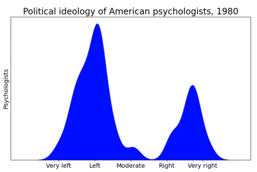
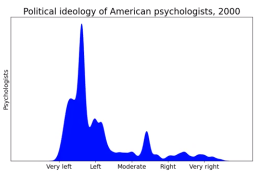
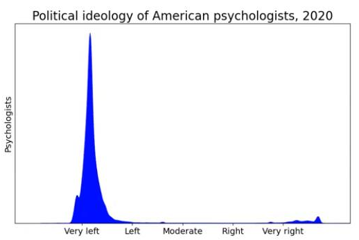
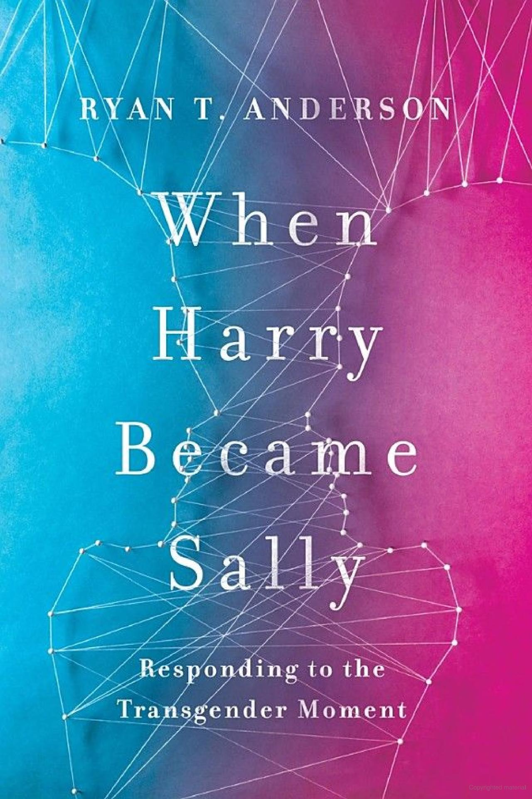

# Problems in LGBT Studies

## Summary

<aside>
    Published:  Mar 2024
</aside>

There are times when a scientific field at large abandons science and becomes agenda driven, for example:

> Internal sugar industry documents [show] five decades of research into nutrition and heart disease, including many of today’s dietary recommendations, may have been largely shaped by the sugar industry.[^oconnor-2016]

Other such examples abound.[^brownell-2009:a] [^nature-2010:a] [^arnold-2017:a] [^marks-2020:a]  A similar phenomenon appears to be happening in LGBT studies.  Some gays and transgenders are deeply offended by data showing their lifestyles are associated with negative outcomes, or conversely that therapy is sometimes successful to resolve unwanted same-sex attraction and gender identity.[^armelli-2012:c] [^friedman-2013:c] [^mccall-2018:b] [^higbee-2020:a]  A new LGBT "civil rights" movement has emerged, taking control of LGBT studies and conforming it to meet activists' demands.  

LGBT studies isn't an isolated trend.  Psychology as a whole has moved far left since 1980:[^bass-2023]

|  |  |  |
| ------------------------------------------------------------ | ------------------------------------------------------------ | ------------------------------------------------------------ |

In LGBT studies we see frequent publication of obviously incorrect data, fabricated stories, intense pressure to conform to LGBT narratives, and discrimination against those who don't comply.  In the points below, click the references to see relevant examples.

- **Politicization and Researcher Discrimination**
    - Politics has replaced science and politically correct objectives have led to inferior research, damaging the field's credibility.[^schumm-2015-2:c] [^kaltiala-2023:a] [^eappen-2023:c]
    - Obviously biased sampling techniques are used to arrive at desired conclusions.[^marks-2012:a] [^regnerus-2012:a] [^schumm-2018:i] [^sullins-2022:a]
    - Professional organizations cherry-pick what research is funded and published.[^mchugh-2004:a] [^cummings-2013:f] [^friedman-2013:a] [^calbreath-2015:a] [^rosik-2016:a] [^whitehead-2019:a]
    - Researchers with contrary views are attacked and ostracized.[^regnerus-2010:a] [^friedman-2013:b] [^paul-2018:a] [^paul-2018:b] [^schumm-2018:l] [^wright-2023:d]
    - Research that has previously passed peer review is retracted for suspicious reasons.[^whitehead-2019:b] [^wright-2023]
    - Decision-making panels are often staffed with activists.[^calbreath-2015:b] [^rosik-2016:b] A former president of the American Psychological Organization even says the APA has been captured by the gay rights movement,[^cummings-2013:b] abandoning science for politics.[^cummings-2013:c] 
    - Medical professionals are being forced into silence and coerced into providing treatments they know are dangerous to children.[^eappen-2023:b]
    - Foreign medical experts from some countries are surprised that the U.S. hasn't banned or severely restricted hormonal treatments for gender dysphoric children.[^eappen-2023:c] [^kaltiala-2023:b] [^kao-2023:a]

- **Lies and Propaganda**
    - From 1976 to 2015, a staggering 161 articles published in law, social science, and medical journals estimated that more than one million kids, and sometimes as high as 14 million kids in the US were being raised by same-sex parents.[^schumm-2016:a]    An absurd estimate since the total kids in the US is around 60 to 70 million.[^schumm-2018:f]  Only 17 papers were found during this time estimated below one million kids.[^schumm-2016:a]  These fabricated numbers were used to bolster support for legalizing same-sex marriage.[^schumm-2018:k]
    - Many falsely claim scientific consensus says there's no difference between kids raised by same-sex and opposite-sex parents.
    - Nearly all major medical organizations say sexual orientation change efforts don't work and are harmful.  And many say the same about gender identity change efforts.
    - In 2018, LGBT activist Sam Brinton claimed his childhood "conversion therapy" involved being strapped to a table and tortured with ice, heat, and electricity as he was forced to watch gay sex.  Major news outlets including the New York Times shared his story to advocate for an end to all sexual orientation change efforts.[^brinton-2018]  Even after pro-LGBT journalist Wayne Besen found many fatal inconsistencies in Brinton's story,[^besen-2022] the news outlets never issued retractions or disclaimers.  One  wonders how much these lies contribute to the negative perception of sexual orientation change efforts.

These among other issues are all discussed in greater detail below.

## Politics Over Science

In 2009 the American Psychological Association (APA) republished its opposition to sexual orientation change efforts.  But they rejected all conservative nominations to the task force that was to review the literature and write a position.  They instead filled all seven positions with gay rights activists.  Five were openly homosexual and one was bisexual.[^calbreath-2015:b] [^rosik-2016:c] 

Other indicators of politicization:

1. In 2011, the APA's leadership body voted 157-0 to support same-sex marriage.[^rosik-2016:b]
2. The leadership of the National Association of Social Workers endorsed 169 Democrats in the 2014 federal elections, and zero Republicans.[^rosik-2016:b]

In 2023, 21 clinicians from 9 different countries published a statement in *The Wall Street Journal*:

> The politicization of transgender healthcare in the U.S. is unfortunate. The way to combat it is for medical societies to align their recommendations with the best available evidence—rather than exaggerating the benefits and minimizing the risks.[^kaltiala-2023]

### Bias against Conservatives

Darel E. Paul is a professor of political science at Williams University whose research focuses on "elite ideologies in Western countries and the manifestation of those ideologies in public policies."[^paul-2023]  In 2018, he described how those with traditional views of marriage were purged from psychological and related research: 

> Active proponents of "traditional" marriage are regularly discouraged from practicing or purged from professions such as psychiatry, psychology, social work, law, and higher education. The perceived incompatibility of professional status with cultural conservatism is so accepted that the former chair of the American Psychological Association’s Policy and Planning Board recommends that dissenters from "the demands of multiculturally informed, ethical practice... should probably find a different line of work."
>
> In 2014, Reuters reviewed more than one hundred court filings on the subject of same-sex marriage and found that thirty of the country’s two hundred largest law firms represented challengers to state Defense of Marriage Acts, while not a single Am Law 200 firm was representing state DOMA supporters.  Judicial refusal to conduct same-sex marriages is considered a violation of professional ethics in nearly all states, and judges in Washington, Oregon, Alabama, Ohio, and Wyoming have been subjected to disciplinary procedures. 
>
> A 2007 survey found that Evangelicals and Mormons are the least liked religious groups among American university faculty by a wide margin. A 2008 survey revealed that Christian fundamentalists, Evangelicals, and Mormons were the most likely of twenty-seven social groups to experience discrimination in academic hiring. Across nine different fields in the humanities, social sciences, and physical sciences, even transgender and communist applicants faced better job prospects.[^paul-2018]

Given the above, it's unsurprising that the vast majority of mental health professionals reject sexual orientation change efforts (SOCE).  A journalist for the Jerusalem Post summarized in 2013:

> The vast majority of mental health professionals, and nearly every gay rights group, reject out of hand the notion that homosexuality can be reversed.  They point to the fact that homosexuality was removed from the Diagnostic and Statistical Manual of Mental Disorders (DSM), published by the American Psychiatric Association, in 1973, indicating a revolution in the psychological treatment offered to gay people who sought therapy... As one Jerusalem therapist told this reporter, "There is not one case of a successful reversal of one’s sexual orientation. Homosexuality is not diagnosable nor treatable because it’s not a mental illness."[^friedman-2013]

SOCE will be a recurring theme in this article.

### Resistance to Studies

The field seems particularly averse to research on the effectiveness of sexual orientation change therapy, as well as studies on whether hormonal and surgical treatments for transgenderism are safe.

Dr. Donald F. Calbreath's research focuses on the relationships between brain neurochemistry and human behavior.  He describes discrimination against SOCE proponents:

> Proponents of SOCE [Sexual Orientation Change Efforts] argue that there have been many successes in changing homosexual behavior and desires in a number of individuals.  Professional groups argue that there are no good peer-reviewed studies, but also prohibit their members from being involved in these studies.  Policy statements attacking these treatments are not written by an unbiased group; one major statement was written by a team that (with one exception) were all homosexual or bisexual, with all members of the team being well-known homosexual activists.[^calbreath-2015]

Conservative psychologist Christopher Rosik noted how the APA applies a much higher standard to papers claiming success with sexual orientation and gender identity change than those claiming such practices cause harm:

> You will notice that opponents have a much higher standard for methodological rigor when it comes to efficacy of [sexual orientation and gender identity] change interventions than they do when addressing the potential for harm... They demand randomized, controlled research designs to prove efficacy and reject case studies of success, but are quick to tout anecdotal accounts of harm in the absence of any controlled, representative research showing harm...  It’s been years now since I and some colleagues invited anyone in the APA to do collaborative work with us to address the issues of efficacy and harm... but we have not had a single hint of interest.  This makes me question the sincerity of opponents’ demands... especially when many of these same folks are working to create a professional and legal environment completely hostile to the conducting of such studies.[^rosik-2016]

Paul McHugh is a Harvard trained psychiatrist, former psychiatrist-in-chief at the Johns Hopkins Hospital, and well known for debunking the idea of recovered memory.  He served under the President's council on Bioethics under George W. Bush.  He's a conservative Catholic who is against transgender surgery.  He notes:

> Even controlled trials or careful follow-up studies to ensure that the practice itself [of transgender surgeries] is not damaging are often resisted and the results rejected."[^mchugh-2004]

The American Academy of Pediatrics resists conducting studies to evaluate the safety of hormonal and surgical transgender treatments:

> These doctors have repeatedly tried to introduce resolutions in the AAP [American Academy of Pediatrics] calling for systematic evidence reviews [of hormones and transgender surgery], the gold standard in medicine.  AAP leadership has ignored them even though one resolution questioning support for gender transition garnered 80% support from those who voted.[^kao-2023:a]

### Dissent against the Endocrine Society Leadership

In 2023, two conservative medical professionals attended an Endocrine Society meeting.  They found widespread doubt about hormonal transgender treatments among its participants, who were afraid to speak up against the society's leadership.  They described their experience in the Wall Street Journal:

> [W]e attended the annual meeting of the Endocrine Society, of which one of us (Dr. Eappen) is a member.  We found that endocrinologists are aware of the society’s failings and rue its elevation of transgender activism over medical expertise and patient needs...
>
> At this year’s meeting, we had frank and fruitful discussions with endocrinologists who provide hormonal treatments to kids with gender dysphoria, as well as some who don’t.  Without exception, they acknowledged that the society’s evidence base for pediatric gender transition is weak, at best.  Yet while they’re aware of the guidelines’ shortcomings, they’re afraid to voice their concerns.  The society’s full-throated endorsement of gender-affirming care implied condemnation of anyone who holds differing views.  Medical professionals are being cowed into silence and coerced into providing treatments they know are dangerous to children.  Perhaps the most telling interactions were with European endocrinologists, who were there to discuss the latest research and treatments in the specialty.  Those we spoke with expressed surprise that the U.S. hasn’t banned, or at least severely restricted, such treatments for adolescents and children.[^eappen-2023]

Their article garnered a critical response from Endocrine society president Stephen R. Hammes,[^hammes-2023] and Hammes in turn was criticized in another response from 21 doctors in 9 countries.[^kaltiala-2023]

### Nicholas Cummings and the APA

Former American Psychological Association (APA) president Nicholas Cummings is pro gay[^cummings-2013:e] and was involved in convincing the APA to no longer consider homosexuality a mental disorder.[^cummings-2013:d] [^cummings-2013:g]  In a 2013 interview he detailed:

1. At first "the APA would never take a position publicly that wasn't supported by scientific evidence" then "all of a sudden things began to change as things became more political than scientific."[^cummings-2013:a]
2. By the mid 1990's, "political stances seemed to override any scientific results" and "the gay rights movement sort of captured the APA."[^cummings-2013:b]
3. About "200 to 250 people were running the APA" who "were ultra liberal and anything that wasn't ultra liberal was anathema...  It became a civil rights issue rather than a scientific issue."[^cummings-2013:c]
4. "Right now certain research doesn't get funded.  The funding agencies cherry-pick what they fund... right now we're in turmoil."[^cummings-2013:f]

### Walter Schumm and Same-Sex Parenting

Walter Schumm is a conservative professor in the Department of Family Studies and Human Services at Kansas State University, and editor in chief of the academic journal, *Marriage and Family Review*.  Schumm has [over 300 publications](https://scholar.google.com/citations?user=lN91qPUAAAAJ) listed on Google Scholar.  He describes the politics in his field:

> In many cases the role of politics has overridden scientific common sense and standard methodological protocols, damaging the credibility of social scientists, the field of social science, and the integrity of many social science professional organizations.  The acceptance of such inferior research... as long as it appeared to support politically correct objectives, suggests the use of an approach to science whereby the ends justify the mean[^schumm-2015-2]

Schumm conducted a massive literature review of nearly 400 studies specifically on the topic of children with same-sex parents.  He concluded:

> It is remarkable that one could find 90% of over 70 literature reviews having drawn incorrect conclusions about some aspects of same-sex parenting.[^schumm-2018:g]

## Researcher Discrimination

<aside></aside>

Here we document discrimination reported by specific researchers.  This list is certainly not exhaustive.

### Walter Schumm

Conservative marriage and family researcher Walter Schumm wrote in the prologue to his 2018 book on Same Sex Parenting:

> There are many people to whom I owe much gratitude for encouraging me in my life and even in the production of this book. I hesitate to mention them by name lest they come under attack for having any association with me.  Some very Christian scholars have gone out of their way to avoid any association with this book because of the stigma or discrimination they fear."[^schumm-2018]

### Mark Regnerus

Mark Regnerus is a professor of sociology at the University of Texas at Austin who specializes in sexual behavior, family, marriage, and religion, who takes a conservative perspective.  He wrote in 2010:

> Prejudice and stigma can be real, consequential, and harmful. As a rare skeptic in a very progressive and aggressively activist discipline—sociology—I know about social stigma. I feel it every day. Enduring such stigma, however, is the cost of doing business as a dissenter from the lucrative world of health research about sexual orientation and gender identity.[^regnerus-2010]

### Robert Spitzer and SOCE

Along with Nicholas Cummings, Robert Spitzer (the psychiatrist, not Robert Spitzer the priest) was also involved in the APA no longer classifying homosexuality as a disorder.[^carey-2012:a]  

Spitzer later began studying sexual orientation change efforts as he believed "previous studies had been biased and inconclusive."[^carey-2012]  He interviewed 200 men and women who had reported at least mild success with SOCE, finding:

> The majority of participants gave reports of change from a predominantly or exclusively homosexual orientation before therapy to a predominantly or exclusively heterosexual orientation in the past year.[^spitzer-2003]

Additionally, "Spitzer recorded changes not just in participants’ behavior, but also in their feelings, fantasies, attractions, and how they performed sexually," which exceeded the measures of previous studies.[^armelli-2012:b]  Spitzer stated, "When I listened, I [had] a kind of a clinical feeling that these people were telling me the truth."[^armelli-2012]

Spitzer completed the research in 2001 and it was published in 2003.  During this time:

1. Spitzer said, "people at the time did say to me, ‘Bob, you’re messing with your career, don’t do it.'"[^carey-2012]
2. Spitzer reported that "several colleagues tried to stop the study in its tracks, and urged him not to publish it."[^carey-2012]
3. 15 researchers at a facility where Spitzer was affiliated, responded by citing "the Nuremberg Code of ethics to denounce the study as not only flawed but morally wrong," reporting "We fear the repercussions of this study, including an increase in suffering, prejudice, and discrimination."[^carey-2012]
4. "Gay leaders accused him of betrayal."[^carey-2012]

This happened even though "Dr. Spitzer in no way implied in the study that being gay was a choice, or that it was possible for anyone who wanted to change to do so in therapy."[^carey-2012]

Spitzer's study was criticized because:

> It was based on what people remembered feeling years before — an often fuzzy record. It included some ex-gay advocates, who were politically active. And it did not test any particular therapy; only half of the participants engaged with a therapist at all, while the others worked with pastoral counselors, or in independent Bible study.[^carey-2012]

But these caveats are common in other published psychological surveys, which often include responses from pro-gay advocates.

In 2012, At 79 years old and suffering from worsening Parkinson's symptoms, Spitzer apologized to the gay community for publishing the study,[^carey-2012] saying he had no way of knowing whether his "subject’s reports of change were credible and not self-deception or outright lying,"[^becker-2012]  although countless other self-reporting studies are published with the same limitation.[^armelli-2012:a]  Pro-sexual orientation change groups "continue to cite Spitzer’s study, saying he was subjected to intense political pressure as soon as he released the original study. They also say there is no scientific basis to retract the study."[^friedman-2013]  The journal did not retract Spitzer's research.

### Elan Karten study of SOCE

Dr. Elan Y. Karten is an ultra-Orthodox Jewish clinical psychologist in Jerusalem who has written extensively on the topic of sexual orientation change efforts:

> For my doctoral dissertation, I looked at the psychological and religious characteristics of dissatisfied same-sex-attracted men who pursue sexual reorientation interventions... I studied 117 adult men who had participated in some form of conversion intervention at least six months prior to participation in the study...
>
> Results indicated that overall there were significant reduction in homosexual feelings and behavior and an increase in heterosexual feelings and behavior.
>
> But I couldn’t get my research published.  The American Psychological Association (APA) wouldn’t touch it, and neither would any respectable journal because to do so would lead to censure and even ostracization by one’s peers in the psychological community. The APA disparages reparative therapy with their cry of ‘no scientific evidence proving the effectiveness of therapy,’ but I point my finger back at them.
>
> Do they even want to know about it? Would they even publish hard data if it bit them in the face? Ultimately the *Journal of Men’s Studies* published my article in 2010, but even so, it’s hard to trust the mainstream research.[^friedman-2013]

### Anonymous Mental Health Professional and SOCE

An anonymous mental health professional interviewed by the Jerusalem post reported in 2013:

> I saw many cases in which there were relationship and dependency issues, not sexual issues... Once the women resolved these issues, many or most of them went on to enjoy healthy marriages and satisfying heterosexual sex lives...  But when I tried to bring this point up for discussion, I was shouted down, in complete contrast to the norms of both academic debate and the social work discipline. It was the only time I ever saw someone forcibly silenced.[^friedman-2013]

### Kenneth Zucker's Gender Clinic

Kenneth Zucker is a big name in gender studies.  For decades he led the Child Youth and Family Gender Identity Clinic in Toronto, one of the world's most well-known clinics for children and teens with gender dysphoria.  He led the group that wrote the DSM-5's gender dysphoria entry, currently serves as chief editor of the *Archives of Sexual Behavior* Journal, and is one of the most frequently cited names on gender identity and dysphoria.[^singal-2016:a]  

Zucker assisted many people transition, even kids, but often took a more cautious approach with his younger patients.  He first had parents encourage kids toward their gender at conception,[^singal-2016:b] since research shows that childhood gender dysphoria usually resolves on its own.[^cantor-2016:a] [^singal-2016:d] 

Transgender activists were upset with Zucker's approach, believing that he should always immediately affirm a child's gender identity.  They labeled his techniques "conversion therapy,"[^singal-2016:c] a pejorative, blanket term describing any type of attempt to help someone with unwanted same-sex feelings or gender dysphoria.  And "conversion therapy" as a concept is anathema to LGBT activists.  An online petition calling for Zucker's elimination gathered over 2000 signatures.[^change-2014] In 2015 he was fired and his clinic shutdown.[^bazelon-2022:a]

In 2017, Zucker was scheduled to speak at a panel for the pro-transgender organization WPATH in Los Angeles.  Transgender protesters interrupted, reading a statement saying the "entire institution of WPATH" was "violently exclusionary" because it "remains grounded in 'cis-normativity and trans exclusion.'"  Zucker was then removed from the list of speakers.[^bazelon-2022:b]

### Lisa Littman and ROGD Teens

In 2018, Lisa Littman conducted a study on what she called "rapid onset gender dysphoria" or ROGD.  Littman is no conservative, describing herself as liberal and pro-LGBT,[^kesslen-2022] and even claiming "some [kids] may ultimately benefit from transition."[^littman-2018]  She gathered participants from three left-leaning, pro-LGB websites that caution against transitioning children with gender dysphoria via medicine and surgery,[^4thwavenow-2018:a] [^littman-2018:d] [^transgender-trend-2023:a] [^youthtranscriticalprofessionals-2018:a] but also from an 8000 member private Facebook group that encourages child transitioning.[^littman-2018:c]  Her survey only included parents who indicated that their child's gender dysphoria began rapidly and after puberty.[^littman-2018:b]  256 such parents completed the survey.  Littman found:

> Clusters of gender dysphoria outbreaks occurring in pre-existing friend groups with multiple or even all members of a friend group becoming gender dysphoric and transgender-identified in a pattern that seems statistically unlikely based on previous research... This suggests a localized increase to more than 70 times the expected prevalence rate.[^littman-2018]

Overall, 66.8% of gender dysphoric kids belonged to a friends group where others had already taken a transgender identity.[^littman-2018:e]  This finding severely upset transgender groups because it suggests gender dysphoria is at least sometimes a social contagion, rather than having an innate, biological cause.[^mccall-2018:b] [^wright-2023:d]

Due to rising controversy Brown University (Littman’s employer at the time) "retracted its press release about the study."[^kesslen-2022] They did publish a statement supporting Littman's academic freedom "to conduct her research and publish her work."[^brown-2018]  But their statement also raised alarm:

> The School of Public Health has heard from Brown community members expressing concerns that the conclusions of the study could be used to discredit efforts to support transgender youth and invalidate the perspectives of members of the transgender community.[^brown-2018]

Littman later lost a consulting job due to local clinicians demanding she be fired.[^wright-2023:c]

The American Civil Liberties Union said Littman's study:

> ...laundered what had previously been the rantings of online conspiracy theorists and gave it the resemblance of serious scientific study... It is astonishing that such a blatantly bad-faith effort has been taken so seriously.[^kesslen-2022]

In an open letter to Psychology Today, 44 transgender health professionals stated that Littman's study was "widely contested as methodologically flawed and unethical, proceeding from an overt ideological bias."[^gdawg-2018]

In response to Littman's research, the American Psychological Association, the American Psychiatric Association, the Society of Behavioral Medicine, and dozens of other professional and academic organizations collectively signed a statement denying the existence of rapid onset gender dysphoria (ROGD) because there are "no sound empirical studies of ROGD."  The statement said that even the very concept of ROGD has "significant potential for creating harm."[^rogd-statement-2021]

Unsurprisingly, her research was likewise denounced by the Human Rights Campaign[^hrc-2021:a] and the Southern Poverty Law Center.[^spl-2023] 

As noted, Littman's respondents were heavily skewed toward favoring legal recognition of same-sex marriage,[^littman-2018:a] and came from online communities that were pro-homosexual and politically left.  Nevertheless, Littman's critics dismissed her research, claiming she recruited from "explicitly anti-trans or trans-skeptical websites and forums,"[^kesslen-2022] as three out of four of these communities cautioned against giving hormones, hormone blockers, and surgical amputation to gender dysphoric teenagers, and only one approved.  Littman's paper was forthright and gave excessive details about her recruitment methods, the benefits, the limitations, and noted it's common to use targeted recruiting for research into new phenomenon where the prevalence is unknown.[^littman-2018:f]  Critics gave no response to Littman's main thesis of social contagion or the supporting data that gender dysphoria cases were highly clustered among friend groups.

Littman said many clinicians emailed her saying they've also started seeing rapid onset gender dysphoria, with "patient presentations are very different than what they have seen in the past" and thanking her for documenting it.[^mccall-2018:a]

### Suzanna Diaz and J. Michael Bailey and ROGD Teens

In March 2023, Diaz and Bailey reproduced Littman's work on a larger scale.  They conducted a survey of 1,655 parents, recruited from visitors to ParentsofROGDKids.com, a website for parents concerned about their child's rapid onset of gender dysphoria which takes a more conservative approach than Littman's recruiting sources.  The site states "identifying as the opposite gender is NOT normal" and warns about the dangers of the "affirmative approach" and of transitioning, but still suggesting medical intervention as "a last resort."[^parentsofrogdkids-2024]

However, about 93% of surveyed parents were on the political left.[^diaz-2023:a]  The parents saw various mental illnesses commonly preceded the gender dysphoria by a few years,[^diaz-2023:c] and mental health often declined after socially transitioning.  Most controversially, 55.4% of parents said others in their child's friend group became transgender around the same time.  This supports Littman's suggestion of social contagion.[^diaz-2023]

A month later, LGBT researchers attacked the journal where Diaz and Baily published.  They wrote an open letter with 100 signatures, threatening to no longer submit or act as peer reviewers for the Springer journal *Archives of Sexual Behavior* until editor in chief Kenneth Zucker was replaced with someone with a more pro-LGBT record.[^wright-2023]

However, a counter-letter with over 2000 signatures appeared, including well known figures such as psychologist Jonathan Haidt and Stanford health professor Jay Bhattacharya.[^wright-2023]

Springer then retracted the paper because the participants "have not provided consent to publish to have their data included in this article."[^wright-2023]

> Consent for the publication of anonymized data on a public website, it [Springer] alleged, does not equate to consent for that data’s publication in a scholarly peer-reviewed article. But consenting to have one’s data published on a website managed by unskilled volunteers is a much bigger risk than having one’s information managed and published by an academic publisher staffed with dedicated professionals trained in thorough data analyses and human subject protections.[^wright-2023]

How is it possible to interpret respondents' consent to their data being published online in such a way that they'd not also be ok with their data being published online in a research journal?

Bailey, one of the study's authors, pointed out many other papers Springer had published where respondents did not provide permission for scholarly, or often any research use,[^wright-2023:a] with perhaps thousands of other papers not meeting these standards.[^wright-2023:b]

Finally, note that lead author Suzanna Diaz's name is a pseudonym.  Researchers don't normally publish under a pseudonym, but might if they fear discrimination or their own safety.

### Ryan T. Anderson's Book

<aside></aside>

Anderson is a conservative Catholic philosopher well known for being involved in the debate on LGBT issues since the early 2000's, including arguing against the legalization of same-sex marriage.

In 2018 he published the bestselling book *When Harry Became Sally*, arguing that hormonal and surgical treatments for gender dysphoria cause great harm.  In 2021 Amazon (the largest book retailer in the US[^trachtenberg-2019:b]) removed it from their store, because they "have chosen not to sell books that frame LGBTQ+ identity as a mental illness."[^trachtenberg-2019:a]  While Anderson never says in his book that sexual identities are mental illnesses, he does cite some authors who do, as well as many who don't.  

Surely Anderson must hate the gender dysphoric?  Anderson states in the book's introduction:

> I repeatedly acknowledge that gender dysphoria is a serious condition, that people who experience a gender identity conflict should be treated with respect and compassion, and that we need to find more humane and effective ways to help people who find themselves in that situation.[^anderson-2019:a]

### James Caspain, Transgender Surgery, and the University of Bath.

In 2014, psychologist James Caspian had a conversation with world-leading genital reconstructive surgeon Miroslav Djordjevic, who described being "approached by transgender people from countries all over the Western world, united by an acute sense of regret, who wish to reverse their gender reassignment."[^shute-2017]  

In 2017 Caspain submitted a proposal to Bath Spa university to research detransitioning, but was:

> ...referred to the university ethics committee, which rejected it over fears of criticism that might be directed towards the university. Not least on social media from the powerful transgender lobby.[^shute-2017]

In 2019, Caspian took his case to the Royal Courts of Justice (for England and Wales) "but a judge did not permit him to continue with his bid for judicial review."[^baska-2021]

By 2021, Caspian has had "a decade of experience specialising in therapy for trans people"[^baska-2021] and said "50 people who wanted to reverse their transition had contacted him expressing their regret."[^baska-2021]  He is now taking his case to the European Court of Human Rights.[^baska-2021]

## Major Untruths

This section documents major untruths that persist in the psychological literature, with activists repressing their correction.

### "Millions of U.S. kids grew up with same-sex parents"

<aside></aside>

For almost four decades, gay studies researchers severely over estimated the number of families with homosexual parents.  The goal was to argue that such a family structure was more commonplace than it really was and therefore same-sex marriage should be legal.[^schumm-2018:d]

1. A 1976 paper published in Buffalo Law Review stated, "recent estimates suggest there are well over **1.5 million** lesbian mothers in this country."[^hunter-1976] 
2. A 1979 legal paper also cited **1.5 million** lesbian mothers.[^davies-1979]
3. A 1979 article in *Psychiatric News* estimated **5 to 7 million** lesbian mothers.[^rivera-1979]
4. A 1980 legal paper estimated **1.5 million to 5 million** children being raised by lesbian mothers in the US.[^sutton-1980]
5. A 1983 legal paper likewise estimated **5 to 7 million** children being raised by lesbian mothers.[^witlin-1983]
6. In 1984, *USA Today* said there were as many as **14 million** children being raised by LGBT parents in the USA.[^peterson-1984]
7. A 1987 book by Frederick Bozett, considered at the time to be the leading expert on gay fathers, estimated "roughly **7.5 million** children in this country have either a lesbian mother or gay father."[^bozett-1987]
8. In 1979, the Editors of the Harvard Law Review 1989 cited “**three million** gay men and lesbians in the United States” as parents and “between **eight and ten million** children.”[^harvard-1989:a]
9. In 1992, Charlotte J. Patterson estimated **6 to 14 million** children raised by gay and lesbian parents in the United States, publishing in the prestigious journal *Child Development*.[^patterson-1992:a]  Patterson is considered "the world’s expert on psychological research on children and youths raised by lesbian and gay parents."[^apa-2009] Patterson repeated this estimate in her 1995 book.[^daugelli-1995]
10. A 2000 pamphlet from the National Adoption Information Clearinghouse (NAIC) stated, "as of 1990, an estimated **6 to 14 million** children have a gay or lesbian parent.  And, between **8 and 10 million** children are being raised in gay and lesbian households... Based on these increasing numbers, can gay and lesbian individuals be realistically and automatically excluded from consideration as potential adoptive parents?"[^naic-2000]
11. In 2001, LGBT researchers Judith Stacey and Timothy Biblarz wrote, "Since 1984, most researchers have statically reproduced numbers, of uncertain origin, depicting a range of from **1 to 5 million** lesbian mothers, from **1 to 3 million** gay fathers, and from **6 to 14 million** children of gay or lesbian parents in the United States."  Although they preferred "a range of **1 to 9 million**, which implies that somewhere between 1 percent and 12 percent of all (78 million) children ages 19 and under in the United States."[^stacey-2001]
12. A 2002 paper stated there are "approximately **ten million** children being raised by same-sex parents in the United States," citing an estimate from the American Bar Association.[^jacobs-2002]
13. A 2005 paper estimated that same-sex parents had adopted **14 million** children.[^mabry-2005]  If we also include non-adopted children, that would put the total number at perhaps double.
14. In 2006, the ACLU stated there are "between **one and nine million** children being raised by gay parents."[^cooper-2006]
15. A 2006 legal paper stated, "there are between **one and nine million** gay parents. This number does not include the millions of children raised by one gay parent."[^rosato-2006]
16. A 2007 paper says "There are **6-14 million** parents in the U.S. who are gay or lesbian."[^selekman-2007] 
17. A 2012 paper stated "the Census Bureau estimates that up to **14 million** children under the age of 18 are being raised by lesbian, gay, bisexual, or transgender (LGBT) families,"[^kinter-duffy-2012] even though the Census Bureau has no such data.
18. A 2015 philosophy Ph.D dissertation says, "In the USA, there are between **800,000 and 7 million** lesbian and gay (LG) parents raising between **1 and 9 million** children."[^baiocco-2015]
19. Another 2016 paper states, "broad estimates regarding the number of gay and lesbian families indicate the range of children being raised by gay or lesbian parents could be as high as **14 million**," citing Patterson's 1995 book mentioned above.[^bonander-2016]
20. In 2017 Angela Ruffini published that "There are at least **one million** children of same-sex couples in the United States."[^ruffini-2017]

The list above is only a sample.  Walter Schumm and his associates catalogued 90 law journal articles and 71 social science/medical journal articles between 1976 and 2015 that estimated the number of kids being raised by same-sex parents at greater than one million.  While only four law articles and 13 social science/medical articles had estimates below one million.[^schumm-2016:a]  Schumm noted that the high estimates peaked in the 2000's, "possibly to meet the needs of legal teams arguing in favour of same-sex marriage."[^schumm-2018:k]

<aside>"Sleeping Editor" by ChatGPT</aside>

These estimates are remarkable given that the total number of US children was less than 63 million in 1984, and since that time has never exceeded 75 million.[^schumm-2018:f]  At the higher end, these researchers were claiming up to 14/63 = 22% of all kids in the United States were being raised by same-sex parents in the '80s and '90s.  Remarkably most of the above papers are published in peer-reviewed social and legal journals that specialize in family studies.  Were the editors and reviewers asleep for forty years?

A much better estimate of number of children living in stable homes with two same sex parents is probably around 200,000 to 400,000,[^schumm-2018:e] [^gates-2015:a] with perhaps 2 to 3.7 million children under 18 having a lesbian, gay, bisexual, or transgender parent.[^gates-2015:a]  This means some of the above estimates are 35 to 70 times too high.

If medical, social, and legal journals published such obviously wrong data, and continued to do so over four decades, can they be trusted on facts that are more subtle and hard to check?

### "No difference in same-sex families"

Many researchers have made the bizarre, over-the-top claim that there's no difference in wellbeing, at all, for children with same-sex versus opposite-sex parents.  This defies common sense, because numerous other factors (income, education level, religiosity, single mom, single dad, etc.) have great impact on children.  This suggests political motivation rather than honest research.  

For example the American Psychological Association stated in 2005:

> Not a single study has found children of lesbian or gay parents to be disadvantaged in any significant respect relative to children of heterosexual parents.[^marks-2012]  

Likewise the governing body of the American Psychological Association voted unanimously in agreement that:

> Research has shown that the adjustment, development, and psychological well-being of children is unrelated to parental sexual orientation.[^patterson-2006]

Shay Bilchik, President of the Child Welfare League of America, stated:  

> Not a single reputable study has found that children raised by gay or lesbian parents have been harmed because of their parents’ sexual orientation in any way.[^cooper-2006:a]

Researchers Leslie Cooper and Paul Cates, writing for the ACLU, stated:  

> Not a single study found any adverse effect on children’s development associated with the parents’ sexual orientation... These findings are therefore considered highly reliable by experts in the field. Indeed, they have led to the consensus among the major professional organizations with expertise in children’s health and welfare that children of gay parents are just as healthy and well-adjusted as other children, including the American Academy of Pediatrics, the American Psychological Association, the National Association of Social Workers, and the Child Welfare League of America.[^cooper-2006:b] 

> Among social scientists, whether parental sexual orientation has an impact on children’s adjustment is no longer an open question or a subject of debate. Because a well-developed body of research has answered that question, it is well-settled that children raised by gay parents are just as healthy and well-adjusted as their peers. Indeed, there is consensus among all of the major professional organisations in the social science fields... that being raised by lesbian or gay parents does not adversely affect children’s development in any way.[^cooper-2006:c] 

A 1992 review paper stated:

> To date, however, there is no evidence that the development of children with lesbian or gay parents is compromised in any significant respect relative to that among children of heterosexual parents in otherwise compatible circumstances.[^patterson-1992]

And a 2020 meta analysis of 33 studies claimed:

> scholars have achieved a rare degree of consensus that unmarried lesbian parents are raising children who develop at least as well as their counterparts with married heterosexual parents.[^biblarz-2001]

#### But there really is a difference

Contrary to the above statements, Walter Schumm conducted a massive literature review of nearly 400 studies specifically on the topic of children with same-sex parents.  He found:

> There are now dozens of studies that appear to refute the "no difference" hypothesis with only a few that do not essentially (in terms of effect sizes, if not statistical significance) refute it.[^schumm-2018:h]

> It is not correct scientifically to take a group of highly educated, wealthy, mentally healthy same-sex parents and compare their children to the children of uneducated, poor, mentally ill heterosexual parents and think you have set up a fair comparison.  Yet this sort of comparison has been popular in the scientific literature.[^schumm-2018:i]

> I am disappointed that many U.S. courts were misled into accepting as valid research, research that was biased, incomplete, and focused on significance levels rather than effects sizes. Numerous studies whose results would have been inconvenient for the ‘no difference’ hypothesis were overlooked or ignored. Research on same-sex parenting has often been cited because it came to the politically correct conclusions, not because it was of the highest quality. [^schumm-2018:j]

And also (as mentioned above):

> It is remarkable that one could find 90% of over 70 literature reviews having drawn incorrect conclusions about some aspects of same-sex parenting.[^schumm-2018:g]

Likewise Loren Marks responded to the APA's 2005 statement above, noting:

> [T]he 2005 APA Brief on "Lesbian and Gay Parenting" has been repeatedly invoked in the current same-sex marriage debate...
>
> 26 of 59 APA studies on same-sex parenting had no heterosexual comparison groups.  In comparison studies, single mothers were often used as the hetero comparison group.  No comparison study had the statistical power required to detect a small effect size...
>
> Differences have recurred in connection with myriad issues of societal-level concern including: (a) health, mortality, and suicide risks, (b) drug and alcohol abuse, (c) criminality and incarceration, (d) intergenerational poverty, (e) education and/or labor force contribution, (f) early sexual activity and early childbearing, and (g) divorce rates as adults.[^marks-2012]

 Mark Regnerus likewise reported on biased sampling:

> Concern has arisen, however, about the methodological quality of many studies focusing on same-sex parents. In particular, most are based on non-random, non-representative data often employing small samples that do not allow for generalization to the larger population of gay and lesbian families.[^regnerus-2012]

Study participants were often recruited from gay rights organizations:

> Further, as Nock (2001) entreated, consider the convenience sample recruited from within organizations devoted to seeking rights for gays and lesbians, like the NLLFS [National Longitudinal Lesbian Family Study] sampling strategy.  Suppose, for example, that the respondents have higher levels of education than comparable lesbians who do not frequent such events or bookstores, or who live elsewhere... To compound the problem, results from nonprobability samples—from which meaningful statistics cannot be generated—are regularly compared with population-level samples of heterosexual parents, which no doubt are comprised of a blend of higher and lower quality parents.
>
> ...Until now, this has been a primary way in which scholars have collected and evaluated data on same-sex parents.[^regnerus-2012]

#### Rosenfeld's 2014 "No Difference" study

<aside>"Discarded Survey" by ChatGPT</aside>

One often-cited example of the "no difference" thesis is Michael Rosenfeld report in the *Journal of Marriage and Family*, where he used national survey data to compare married heterosexual couples to homosexual couples who were either legally married or considered themselves to be in a marriage-like relationship.  Rosenfeld reported:

> The break-up rate for same-sex couples was comparable to (and not statistically distinguishable from) the break-up rate for heterosexual couples.[^rosenfeld-2014]

But limitations abound:

1. The survey he used had only a 13% response rate.[^rosenfeld-2014:a]  The U.S. Census gets a response rate of about 75% by mail and most researchers aim for a 50% response rate or better.[^schumm-2018:a] [^fincham-2008:a]
2. The survey had an unusually high response rate from same-sex couples, which made up 16% of the total respondents,[^rosenfeld-2014:c] even though same-sex couples only make up about 1%[^usa-facts-2023] of all couples in 2014.  Why are same-sex couples responding **16 times** more often than opposite-sex couples?  Is it only stable same-sex couples responding at that rate, or all same-sex couples?  We don't know.
3. Rosenfeld didn't mention that "hundreds of his 2,538 'heterosexual' couples were in fact mixed-orientation couples in which at least one partner was gay, bisexual, or lesbian." This would certainly decrease stability in that group when compared to homosexual couples.[^schumm-2015-2:b]
4. 96 couples who had a partner die over the first four years of the study were still reported as stable.[^schumm-2018:b]
5. The sample size was too small to measure the stability of same-sex parents, as only four of the married same-sex couples had kids, and one of those (25%) broke up during the four year study, compared to only 8% of the heterosexual couples.[^schumm-2018:c]

#### Rosenfeld's Accolades

Despite these limitations, the American Psychological Association cited this study in the famous 2015 Obergefell v. Hodges Supreme Court trial that made same sex marriage legal in the United States, claiming:

> Break-up rates were not significantly different between heterosexual and same-sex couples in marriages or marriage-like relationships.[^apa-2015]

As of December 2023, *The Wiley Online Library* reports Rosenberg's research has been cited by 93 other papers[^rosenfeld-2014] which often don't mention the severe limitations of the research.  Some examples:

1.  "Rosenfeld (2014) finds that in terms of stability, same-sex and different-sex married couples are statistically indistinguishable once union status is controlled for."[^hoy-2022]
2.  "The relative stability of same-sex and different-sex partnerships is an important issue... Rosenfeld (2014) found no difference in the United States."[^mazrekaj-2020]

### "Sexual Orientation Change Efforts Don't Work and are Harmful"

<aside>
    
    
Proponents of banning SOCE often used biased sampling to reach particular conclusions.  For example, the American Medical Association says "One study showed that 77% of SOCE participants reported significant long-term harm,"[^ama-2022] citing Shidlo 2001.  But that study used the phrase "Homophobic Therapies: Documenting the Damage," to recruite some of their participants,[^shidlo-2001:a] which is likely to deter those who benefitted.  This is akin to surveying BBQ restaurant customers about whether they were able to become vegetarians.  The AMA did not mention those severe imitations.

     
    
    
Robert Spitzer's 2003 study did the opposite and interviewed any patient who had seen at least a 10% change toward heterosexual gender identity, but most of his participants saw much greater change than that.[^spitzer-2003]

</aside>

The American Medical Association said in 2022 that there's consensus that sexual orientation and gender identity can't be changed:

> Underlying these [sexual orientation change therapy] techniques is the assumption that any non-heterosexual, non-cisgender identities are mental disorders, and that sexual orientation and gender identity can and should be changed.  This assumption is not based on medical and scientific evidence... All leading professional medical and mental health associations reject “conversion therapy” as a legitimate medical treatment.[^ama-2022]

Likewise, The American Psychoanalytic Association said in 2012:

> Psychoanalytic technique does not encompass purposeful attempts to "convert," "repair," change or shift an individual’s sexual orientation, gender identity or gender expression. Such directed efforts are against fundamental principles of psychoanalytic treatment and often result in substantial psychological pain by reinforcing damaging internalized attitudes.[^apsaa-2012]

The Human Rights Campaign, an LGBT activist group, maintains a page[^hrc-2024] with similar statements of ineffectiveness and psychological harm from many large medical groups, including the above plus:

- American Academy of Child and Adolescent Psychiatry
- American Academy of Pediatrics
- American Association for Marriage and Family Therapy
- American College of Physicians
- American Counseling Association
- American Psychiatric Association
- American Psychological Association
- American School Counselor Association
- American School Health Association
- National Association of Social Workers
- Pan American Health Organization: Regional Office of the World Health Organization.

Although only some of the above statements also include gender identity change efforts.

As of February 2024, the Wikipedia article on "Conversion Therapy" describes it as fraud, child abuse, and torture:

> There is a scientific consensus that conversion therapy is ineffective at changing a person's sexual orientation or gender identity and that it frequently causes significant long-term psychological harm... When performed today, conversion therapy may constitute fraud and when performed on minors, a form of child abuse; it has been described by experts as torture, cruel, inhuman, or degrading treatment, and contrary to human rights.[^wikipedia-conversion-therapy-2024]

There's consensus, apparently.  In 2020, Jack Turban, an assistant professor of child and adolescent psychiatry conducted a large study that he claimed showed sexual orientation change efforts are linked to "dramatically higher odds of a range of poor mental health outcomes."[^branigin-2022]

#### Sexual Orientation Change

But none of that's true.  Sexual orientation and gender identity change efforts are often beneficial and effective for those who desire change.  Many studies showing failure and harm recruit directly from pro-LGBT communities,[^sullins-2022:a] which by nature exclude anyone who benefited from therapy.  Otherwise they'd no longer identify with LGBT communities.  Such researchers may as well have surveyed the local BBQ restaurant customers about how well vegetarianism is working for them.

Many surveys have found significant change in sexual orientation, when patients are motivated to change and the therapy is well designed:

<aside>"1970's San Francisco Psychologist" by ChatGPT</aside>

1. In 1962, Irving Bieber and 9 colleagues started with 72 exclusively homosexual men.  After therapy, 14 (**19%**) were exclusively heterosexual and 14 (**19%**) were bisexual in behavior, although they didn't measure attraction.[^spitzer-2003:a]
2. In 1978, Charles Socarides reported that 20 of his 45 patients (**44%**) came to have "full heterosexual functioning," although this term wasn't defined.[^spitzer-2003:b]
3. Former APA president Nicholas Cummings (discussed above) reported having a "relatively high" rate of success in changing the orientation of motivated San Francisco clients in the the '60s and '70s.[^cummings-2013-2:a]
4. In 2003, Robert Spitzer (mentioned above) only interviewed men and women who reported at least a 10% change in sexual orientation after SOCE therapy.  But many experienced drastic change: "**46%** of the males and **42%** of the females reported exclusively same sex attraction" before therapy, and after therapy, "**17%** of the males and... **54%** of the females, reported exclusively opposite sex attraction."[^spitzer-2003]
5. Karten and Wade 2010 surveyed participants found through SOCE therapists and ex-gay ministries.  They saw homosexual feelings/behavior decrease **from 18.93 to 12.21**[^karten-2010:b] on a scale from 5 to 30[^karten-2010:a] and heterosexual feelings/behavior increase from **8.45 to 13.13**[^karten-2010:c] on a scale from 5 to 25.[^karten-2010:b]  Along with improvements in their self-esteem, social functioning, depression, self-harm, and suicidality.[^karten-2010:d]
6. Jones and Yarhouse 2011 found 98 men and women who had sought out SOCE through Christian ex-gay ministries and followed them for six+ years.  **23%** of participants self-assessed themselves as successfully no longer gay, while **30%** found success in chastity.[^jones-2011:a]
7. Santero, Whitehead, and Ballesteros 2018 repeated the methodology of Jones and Yarhouse 2011 with a different group and found **68%** of participants reported having "some to much" reduction in same-sex attraction/behavior along with increases for opposite-sex attraction/behavior.[^santero-2018:a] Suspiciously, their paper was later retracted due to a debate about their use of a statistical test that doesn't affect their results.[^whitehead-2019:b]
8. In 2021, Paul Sullins analyzed the same data as Santero et al. 2018 and found similar results:  "**45% to 69%** of SOCE participants achieved at least partial remission of unwanted same-sex sexuality; full remission was achieved by **14%** for sexual attraction and identification, and **26%** for sexual behavior."[^sullins-2021]
9. In 2020, John Blosnich et al. published a study saying that SOCE patients who failed to change orientation had "nearly twice the odds of lifetime suicidal ideation."[^blosnich-2020]  But Blosnich didn't test whether suicidality happened before or after SOCE.  In 2022, Paul Sullins analyzed Blosnich's data and found suicidality usually occurred before SOCE.  In patients where SOCE failed to change orientation, they were still "about **five times less likely** to currently attempt suicide" than people of similar demographics and stress experiences who had never had SOCE.[^sullins-2022]

#### Gender Identity Change

1. Sexual behavior scientist James Cantor reviewed 11 published studies on gender dysphoria desistence rates in kids, published between 1972 to 2013.  He concluded, "roughly **60–90%** of trans kids turn out no longer to be trans by adulthood."[^cantor-2016]
2. Two of the studies in Cantor's list above involved patients from Dr. Zucker's famous Toronto clinic who had received treatment for gender dysphoria (Drummond et al 2008 and Singh 2012).  Among those, only **12%** of girls and **13.3%** of boys grew up to take a transgender identity.[^zucker-2012:a]
3. However, children who are encouraged to persist in gender dysphoria typically do.  In a 2011 Dutch study, **all 70 kids** who began puberty blocking drugs began cross-sex hormones an average of 1.88 years later.[^devries-2011:a]  Some think this happens because the minds of children are especially malleable.[^cretella-2016:a] [^hruz-2017:a]

Studies of sexual orientation and gender identity change efforts will be covered in greater detail in upcoming articles.

### Sam Brinton's Fabricated "Conversion Therapy" Torture

In 2018 Sam Brinton (yes, that Sam Brinton[^land-2023]) wrote an op-ed for *The New York Times* describing the horrors of conversion therapy that he had apparently experienced:

> For over two years, I sat on a couch and endured emotionally painful sessions with a counselor. I was told that my faith community rejected my sexuality; that I was the abomination we had heard about in Sunday school; that I was the only gay person in the world; that it was inevitable I would get H.I.V. and AIDS.
>
> But it didn’t stop with these hurtful talk-therapy sessions. The therapist ordered me bound to a table to have ice, heat and electricity applied to my body. I was forced to watch clips on a television of gay men holding hands, hugging and having sex. I was supposed to associate those images with the pain I was feeling to once and for all turn into a straight boy. In the end it didn’t work.[^brinton-2018]

<aside>"Conversion Therapy" by ChatGPT</aside>

Brinton then goes on to say "Nearly 700,000 adults in the country have received conversion therapy at some point," and pleads for it to be banned in every state.[^brinton-2018]  In a bait-and-switch, U.S. states are enacting legislation to ban licensed therapists from giving talk therapy for children and teens with unwanted same-sex attraction who desire to change.

Brinton went on to be appointed Deputy Assistant Secretary for the Office of Nuclear Energy by the Biden administration, but was then replaced after being arrested for multiple incidences of wearing women's clothing stolen from luggage at airports.  He lied to police, claiming "it was an accident."[^land-2023] 

In 2022, pro-LGBT journalist Wayne Besen questioned Brinton's "conversion therapy" story, noting:

1. The timeline of Brinton's story "periodically changes depending on the media interview," as well as the state.
2. Brinton refused to answer questions to help identify the center or the therapist responsible, being "the only survivor spokesperson who could not recall the name of their therapist."
3. Brinton's mother denies it ever happened.  
4. Brinton at first said it was "religious therapist and not a doctor" but later said it was a "psychotherapist" after he began campaigning to ban licensed "conversion therapy."[^besen-2022]

Among other inconsistencies.  As of March 2024, Brinton's horrific account is still accessible in *The New York Times*, as well as [*NBC News*](https://www.nbcnews.com/feature/nbc-out/outfront-lgbtq-activist-fights-end-conversion-therapy-n708816), [*The Guardian*](https://www.theguardian.com/world/2015/apr/11/survivors-crusade-conversion-therapy-ban-pray-gay-away), *[Time Magazine](https://time.com/2907989/bornperfect-gay-conversion-reparative-therapy/)*, [*USA Today*](https://www.usatoday.com/story/opinion/voices/2018/12/27/gay-conversion-therapy-lgbtq-law-harm-column/2413310002/), [*The Huffington Post*](https://www.huffpost.com/entry/gay-conversion-therapy_b_997330), and many other major news outlets.

As of 2022, Brinton says his campaign, #50Bills50States, through the Trevor Project has "passed more than 20 laws ending "conversion therapy," protecting future generations from ever having to go through what I went through."[^jonescooper-2022]  This is despite the fact that modern sexual orientation change efforts have nothing in common with what Brinton described, and any of its practitioners would be horrified by what he describes.  One has to wonder how much these lies have contributed to the widespread negative perception of sexual orientation change efforts.

### "No studies show harm of gender transition"

<aside></aside>

In 2023, Stephen R. Hammes, president of the Endocrine Society wrote in *The Wall Street Journal*:

> More than 2,000 studies published since 1975 form a clear picture:  gender-affirming care improves the well-being of transgender and gender-diverse people and reduces the risk of suicide.[^hammes-2023]

Back in 2017, Cornell University likewise said a systematic review of all recent studies showed no harm:

> We conducted a systematic literature review of all peer-reviewed articles published in English between 1991 and June 2017 that assess the effect of gender transition on transgender well-being. We identified 55 studies that consist of primary research on this topic, of which 51 (93%) found that gender transition improves the overall well-being of transgender people, while 4 (7%) report mixed or null findings. We found no studies concluding that gender transition causes overall harm.[^cornel-2017]

For unknown reasons they excluded a larger and randomly sampled 2011 Swedish study that found those who had undergone transgender surgeries had:

1. 2.8x higher mortality rate
2. 19.1x higher rates of death from suicide
3. 4.9x higher suicide attempts
4. 2.8x higher rates of psychiatric inpatient care.[^dhejne-2011:a]

The negative outcomes began to really emerge at 10 years post-surgery and beyond.[^cms-2016:a] Many will say LGBT suicide rates are higher only because people discriminate against them.  But this study was in Sweden, one of the most LGBT-affirming countries in the world.  

Oddly, Cornell University cites several other papers by the same authors, but why not this one?  It's certainly not an obscure study, as it was cited by the United States Centers for Medicare & Medicaid Services in 2016.[^cms-2016:a]

Likewise, Hammes claim was disputed in a follow-up WSJ op-ed by 21 medical professionals in 9 countries:

> Dr. Hammes’s claim that gender transition reduces suicides is contradicted by every systematic review, including the review published by the Endocrine Society... There is no reliable evidence to suggest that hormonal transition is an effective suicide-prevention measure.[^kaltiala-2023]

## Conclusion

This article could have been much longer.  It will likely still grow as time allows.  But the current extent of bias is enough to make anyone trust favorable LGBT studies research about as much as we trust favorable asbestos,[^nature-2010:a] sugar,[^oconnor-2016] or tobacco[^brownell-2009:a] industry documents. 

Articles about the medical science surrounding homosexuality and transgenderism are forthcoming, including a detailed look at many of the studies discussed here, and their critics.

<!--

## Unstudied / TODO

==TODO== Pick up on editing the article here.

### Puberty Blockers are Reversible

https://www.thenewatlantis.com/publications/growing-pains

### Gender Affirming Surgery improves mental health

TODO:  For instance, media outlets trumpeted a 2019 study that [claimed](https://www.thepublicdiscourse.com/2019/11/58371/) to offer evidence in support of such interventions. But last August, *The American Journal of Psychiatry* was [forced to issue a correction](https://ajp.psychiatryonline.org/doi/10.1176/appi.ajp.2020.1778correction), acknowledging that “the results demonstrated no advantage of surgery in relation to subsequent mood or anxiety disorder-related health care.” In fact, the study’s authors also admitted that those who surgically transitioned “[were more likely to be treated for anxiety disorders](https://ajp.psychiatryonline.org/doi/10.1176/appi.ajp.2019.19010080)” than those who had not.

Op Ed by 21 doctors and researchers from 9 countries:

> Stephen Hammes, president of the Endocrine Society, writes, “More than 2,000 studies published since 1975 form a clear picture: Gender-affirming care improves the well-being of transgender and gender-diverse people and reduces the risk of suicide.” This claim is not supported by the best available evidence.
>
> Every systematic review of evidence to date, including one published in the *Journal of the Endocrine Society*, has found the evidence for mental-health benefits of hormonal interventions for minors to be of low or very low certainty. By contrast, the risks are significant and include sterility, lifelong dependence on medication and the anguish of regret. For this reason, more and more European countries and international professional organizations now recommend psychotherapy rather than hormones and surgeries as the first line of treatment for gender-dysphoric youth.[^kaltiala-2023]

### Transition regret rates are misrepresented:

> Nor should we put much faith in a study that recruited subjects for an online survey by advertising “on online groups and discussion forums that were dedicated to FTM [female-to-male] members...   https://thefederalist.com/2022/03/10/the-studies-cited-to-support-gender-bending-kids-are-largely-junk-science/

### Born this way

Suicide Rates are Higher only because of discrimination

### Anti-Gay attitudes contribute to a 12-year reduction in lifespan for sexual minorities.

Regnerus:  "Three years ago, [I discovered an error](https://www.sciencedirect.com/science/article/pii/S027795361630627X) in one such study that claimed that anti-gay attitudes contributed to a 12-year reduction in lifespan for sexual minorities. It wasn’t true. (The author eventually admitted the mistake.) " https://www.thepublicdiscourse.com/2020/01/59535/

### Homosexuals are less likely to abuse children

The *American Psychological Association* sponsored a work asserting: “Recognized researchers in the field on child abuse,… almost unanimously concur that homosexual people are actually *less* likely to approach children sexually."  https://www.familyresearchinst.org/2009/02/child-molestation-and-homosexuality-2/

### Laura Favero

https://www.spiked-online.com/2023/04/09/trans-ideology-is-destroying-the-university/

More

> There is now a long line of academics who have been attacked and censored for speaking out against trans orthodoxy. [Philosophy professor Kathleen Stock](https://www.spiked-online.com/2021/10/08/academic-freedom-or-mob-rule-time-to-pick-a-side/), author of *Material Girls: Why Reality Matters for Feminism*, was infamously hounded out of her role at the University of Sussex in 2021, after students waged a relentless campaign against her. In 2018, [Rosa Freedman](https://www.bbc.co.uk/news/uk-england-berkshire-46454454) at the University of Reading found her door covered in urine after she spoke out against gender self-identification. [Selina Todd](https://www.spiked-online.com/2020/02/11/selina-todd-and-the-rise-of-academic-mobs/), a professor of modern history at Oxford University, revealed in 2020 that she needs bodyguards to accompany her to lectures. The list goes on.  https://www.spiked-online.com/2023/04/09/trans-ideology-is-destroying-the-university/

YouTube and Facebook ban conversion stories? - https://www.josephnicolosi.com/

## Unused

I left off somewhere in Schumm chapter 5?

$339 million US taxpayer dollars were spent on LGBT research in 2022,[^nih-2023] which is double the amount spent in 2016.[^nih-2021] 

Quintin Van Meter, pediatric endocrinologist and president of the American College of Pediatricians says:

> Mainstream clinicians and scientists who consider gender discordance to be a mental disorder have been deliberately excluded in the makeup of the steering committees of academic and medical professional societies which are promulgating guidelines that were previously unheard of. (Anderson 127 - can't find original source)

Dr. Hruz:

> The panel selected included only those who supported the emerging practices [hormones and surgery for gender dysphoria] and attempts by many of the endocrinologists present to raise concerns were muted. Subsequent attempts to engage in respectful dialogue regarding serious medical and ethical treatment concerns with colleagues who are providing hormonal treatment of gender dysphoric children have similarly been rejected. (Anderson 128ish) https://www.aclu.org/wp-content/uploads/legal-documents/045-3_paul_hruz_declaration.pdf

-->

## Sources

[^4thwavenow-2018]: "[About Us](https://4thwavenow.com/about/)."  4thWaveNow.  2018.  Mirrors:  [Archive.org](https://web.archive.org/web/20180328235429/https://4thwavenow.com/about/), [Archive.is](https://archive.is/zIEKm)
[^4thwavenow-2018:a]: "However, I am not personally in accord with conservative, religious-fundamentalist views about sexuality. I am a strong supporter of gay, lesbian, and bisexual people."
[^ama-2022]: "[Sexual orientation and gender identity change efforts (so-called 'conversion therapy')](https://www.ama-assn.org/system/files/conversion-therapy-issue-brief.pdf)."  American Medical Association.  2022.
[^anderson-2019]: Anderson, T. Ryan.  "When Harry Became Sally."  2019.
[^anderson-2019:a]: Page 15.
[^apa-2009]: APA PsycNet.  "[Award for Distinguished Contributions to Research in Public Policy: Charlotte J. Patterson.](https://doi.apa.org/record/2009-19983-025?doi=1)"  2009.
[^apa-2015]: "[Brief of the American Psychological Association](https://chat.openai.com/c/24e19a2b-0ee1-4da5-9d28-1dcea345352d)."  2015.  Mirrors:  [Archive.org](https://web.archive.org/web/20151222165605/https://www.apa.org/about/offices/ogc/amicus/obergefell-supreme-court.pdf).
[^apsaa-2012]: "[2012 - Position Statement on Attempts to Change Sexual Orientation, Gender Identity, or Gender Expression](https://web.archive.org/web/20230413010219/https://apsa.org/content/2012-position-statement-attempts-change-sexual-orientation-gender-identity-or-gender)."  American Psyschoanalytic Association.  2012.
[^armelli-2012]: Armelli, Jerry A.  "[A Response to Spitzer’s (2012) Reassessment of His 2003 Study of Reparative Therapy of Homosexuality](https://pubmed.ncbi.nlm.nih.gov/23080396/)."  Archives of Sexual Behavior.  2012.
[^armelli-2012:a]: We also find it curious that Spitzer says that the study’s alleged 'fatal flaw' was that there was no way to judge the credibility of the participants. However, every other psychology study using self-report measures has the same limitation, yet their authors do not apologize for their findings. Rather, researchers simply state this limitation as part of the data, as Spitzer clearly did."
[^armelli-2012:b]: "Spitzer was very clear about the methodological adequacy of his study and how he believed that he had found some significant changes among the participants he interviewed. Spitzer pointed out that he '...used [9 different measures] and... it was... methodologically quite superior' (Throckmorton, 2004, p. 3). Spitzer recorded changes not just in participants’ behavior, but also in their feelings, fantasies, attractions, and how they performed sexually.  Considering that measures used in previous studies were limited, this was considered a significant advancement in research methodology.
[^armelli-2012:c]: Renowned psychiatrist Robert Spitzer, who chaired the APA's task force of the DSM3:  "The gay activists believe that if they could convince everybody that they can never change, then they would be in a better position to argue for gay civil rights. I am for gay civil rights."
[^arnold-2017]: Arnold, Carrie.  "[The Man Who Warned the World About Lead](https://www.pbs.org/wgbh/nova/article/herbert-needleman/)."  PBS Nova.  2017.
[^arnold-2017:a]: "[Lead] industry claimed the gasoline additive was safe, but cases of severe, acute lead poisoning in workers who produced the stuff immediately challenged that notion.... [Lead] industry scientists tried to sow doubt about the potential for negative health effects from tetraethyl lead or gasoline fumes. Experts described workers who became sick after working with the additive as “careless” for not following instructions. As the years passed, industry efforts grew more savvy, involving clever marketing campaigns and relying on an army of public relations firms and industry consultants that actively lobbied Congress and the Environmental Protection Agency. The producers of leaded gasoline also produced the science on its safety, and leaded gasoline got a clean bill of health through the 1960s."
[^baiocco-2015]: Baiocco et al.  "[Lesbian Mother Families and Gay Father Families in Italy:Family Functioning, Dyadic Satisfaction, and Child Well-Being](https://www.researchgate.net/publication/272664432_Lesbian_Mother_Families_and_Gay_Father_Families_in_Italy_Family_Functioning_Dyadic_Satisfaction_and_Child_Well-Being)."  Sexuality Research and Social Policy.  2015.
[^baska-2021]: Baska, Maggie.  "[Psychotherapist blocked from studying ‘trans regret’ takes case to the EU human rights court](https://www.thepinknews.com/2021/02/09/james-caspian-transgender-trans-bath-spa-european-court-human-rights/)."  Pink News.  2021.
[^bass-2023]: Bass, Kevin.  "[Wokification of American psychology, slow version](https://twitter.com/kevinnbass/status/1741540394398106082)."  2023.  <small>Kevin Bass has a doctorate and [describes himself](https://nypost.com/2024/02/17/opinion/americas-medical-system-has-become-totally-woke/) as "a lifelong Democrat."  NotTheBee [provides](https://notthebee.com/article/this-med-student-compiled-graphs-showing-how-different-professions-have-shifted-far-left-over-the-past-decades-the-one-about-doctors-really-surprised-me-</small>) more info about Bass's data.</small>
[^bazelon-2022]: Bazelon, Emily.  "[The Battle Over Gender Therapy](https://www.nytimes.com/2022/06/15/magazine/gender-therapy.html)."  The New York Times.  2022.
[^bazelon-2022:a]: "At the end of 2015, the Canadian medical center that ran Zucker’s clinic in Toronto shut it down because of complaints from activists about his method. (Zucker sued the center for defamation and later received an apology and a settlement of $450,000.)"
[^bazelon-2022:b]: "In February 2017, protesters interrupted and picketed a panel featuring Zucker at the inaugural conference of USPATH (the U.S. affiliate of WPATH) in Los Angeles. That evening, at a meeting with the conference leaders, a group of advocates led by transgender women of color read aloud a statement in which they said the 'entire institution of WPATH' was 'violently exclusionary' because it 'remains grounded in cis-normativity and trans exclusion.’ The group asked for cancellation of Zucker’s appearance on a second upcoming panel. Jamison Green, a trans rights activist and former president of WPATH, said the board agreed to the demand. 'We are very, very sorry,' he said.  After that controversy, other providers were on notice that Zucker’s methods were no longer acceptable. His approach was likened to conversion therapy, which treats being gay or trans as a mental illness to be cured, and which many states and localities have made illegal."
[^becker-2012]: Becker, John M.  "[EXCLUSIVE: Dr. Robert Spitzer Apologizes to Gay Community for Infamous ‘Ex-Gay’ Study](https://web.archive.org/web/20120807145326/http://www.truthwinsout.org/news/2012/04/24542)."  Truth Wins Out.  2012.
[^besen-2022]: Besen, Wayne.  "[Has Sam Brinton’s story always been too good to be true?](https://www.lgbtqnation.com/2022/12/sam-brintons-story-always-good-true/)  LGBTQ Nation.  2022.
[^biblarz-2001]: Biblarz, Timothy., & Stacey, J.  "[(How) does the gender of parents matter?](https://onlinelibrary.wiley.com/doi/abs/10.1111/j.1741-3737.2009.00678.x)"  Journal of Marriage and Family.  2001.
[^blosnich-2020]: Blosnich, John R. et al.  "[Sexual Orientation Change Efforts, Adverse Childhood Experiences, and Suicide Ideation and Attempt Among Sexual Minority Adults, United States, 2016–2018](https://ajph.aphapublications.org/doi/10.2105/AJPH.2020.305637)."  American Journal of Public Health.  2020.
[^bonander-2016]: Bonander, Allison.  "[Family communication about sex: A qualitative analysis of gay and lesbian parents' parent-child sex communication](https://digitalcommons.unl.edu/cgi/viewcontent.cgi?article=1037&context=commstuddiss)."  University of Nebraska.  2015.
[^bozett-1987]: Bozett, F.W.  "[Gay and lesbian parents](https://www.google.com/books/edition/Gay_and_Lesbian_Parents/yffzsKWvP6AC)."  1987.  Page 205.  [Screenshot](problems-in-lgbt-studies-files/bozett-1987-page-205.png). The [Amazon page](https://www.amazon.ca/Gay-Lesbian-Parents-Frederick-Bozett/dp/0275925412) for the book cites a review stating "Professor Bozett has been the leading scholar in the study of gay and lesbian parents and their children."
[^branigin-2022]: Branigin, Anne.  "[Pennsylvania becomes the 27th state to restrict 'conversion therapy](https://www.washingtonpost.com/nation/2022/08/18/conversion-therapy-pennsylvania-ban/).'"  The Washington Post.  2022.
[^brinton-2018]: Brinton, Sam.  "[I Was Tortured in Gay Conversion Therapy. And It’s Still Legal in 41 States](https://www.nytimes.com/2018/01/24/opinion/gay-conversion-therapy-torture.html)."  The New York Times.  2018.  Mirrors:  [Archive.is](https://archive.is/golFH)
[^brown-2018]: "[Updated: Brown statements on gender dysphoria study](https://www.brown.edu/news/2019-03-19/gender)."  Brown University.  2018.
[^brownell-2009]: Brownell, Kelly D. and Kenneth E. Warner.  The Milbank Quarterly.  "[The Perils of Ignoring History: Big Tobacco Played Dirty and Millions Died. How Similar Is Big Food?](https://www.ncbi.nlm.nih.gov/pmc/articles/PMC2879177/)"  2009.
[^brownell-2009:a]: "The tobacco industry had a playbook, a script, that emphasized personal responsibility, paying scientists who delivered research that instilled doubt, criticizing the “junk” science that found harms associated with smoking, making self-regulatory pledges, lobbying with massive resources to stifle government action, introducing “safer” products, and simultaneously manipulating and denying both the addictive nature of their products and their marketing to children."
[^calbreath-2015]: Calbreath, Donald F.  "[Sexual Orientation Change Efforts: What’s Being Repaired?](https://www.equip.org/PDF/JAF6381.pdf)"  Christian Research Institute.  2015.  Mirrors:  [Archive.org](https://web.archive.org/web/20230208194117/https://www.equip.org/articles/sexual-orientation-change-efforts-whats-repaired/), [Archive.is](https://archive.is/wip/pVDGB)  <small>Calbreath's "research interests involve the relationships between brain neurochemistry and human behavior."</small>
[^calbreath-2015:a]: "Proponents of SOCE [Sexual Orientation Change Efforts] argue that there have been many successes in changing homosexual behavior and desires in a number of individuals. Professional groups argue that there are no good peer- reviewed studies, but also prohibit their members from being involved in these studies."
[^calbreath-2015:b]: "Policy statements attacking these treatments are not written by an unbiased group; one major statement was written by a team that (with one exception) were all homosexual or bisexual, with all members of the team being well-known homosexual activists."
[^cantor-2016]: Cantor, James.  "[Do trans- kids stay trans- when they grow up?](http://www.sexologytoday.org/2016/01/do-trans-kids-stay-trans-when-they-grow_99.html)"  Sexology Today.  2016.  <small>Dr. Cantor is a sexual behavior scientist, studying and teaching sexology, especially atypical sexualities, for over 25 years. His research has been published in *Psychological Bulletin,* the *Journal of Abnormal Psychology,* and the *Journal of Consulting and Clinical Psychology,* and he served as Editor-in-Chief of *Sexual Abuse: A Journal of Research and Treatment*. He has appeared to discuss sexological issues on *CNN,* the *BBC,* *The New York Times,* and Dan Savage's *Savage Love*.</small>
[^cantor-2016:a]: "The exact number varies by study, but roughly 60–90% of trans- kids turn out no longer to be trans by adulthood."
[^carey-2012]: Carey, Benedict.  "[Psychiatry Giant Sorry for Backing Gay ‘Cure’](https://www.nytimes.com/2012/05/19/health/dr-robert-l-spitzer-noted-psychiatrist-apologizes-for-study-on-gay-cure.html)."  The New York Times.  2012.  Mirrors:  [Archive.org](https://web.archive.org/web/20230107222037/https://www.nytimes.com/2012/05/19/health/dr-robert-l-spitzer-noted-psychiatrist-apologizes-for-study-on-gay-cure.html)
[^carey-2012:a]: "In the end, the psychiatric association in 1973 sided with Dr. Spitzer, deciding to drop homosexuality from its manual and replace it with his alternative, “sexual orientation disturbance,” to identify people whose sexual orientation, gay or straight, caused them distress.  The arcane language notwithstanding, homosexuality was no longer a “disorder.” Dr. Spitzer achieved a civil rights breakthrough in record time."
[^change-2014]: "[Eliminate Dr. Kenneth Zucker and His Practice of Transgender 'Reparative Therapy'](https://www.change.org/p/camh-terminate-dr-kenneth-zucker-as-head-of-the-gender-identity-clinic)."  Change.org.  2014.
[^cms-2016]: "[Gender Dysphoria and Gender Reassignment Surgery](https://www.cms.gov/medicare-coverage-database/view/ncacal-decision-memo.aspx?proposed=N&NCAID=282&bc=ACAAAAAAQAAA)."  Centers for Medicare & Medicaid Services.  2016.
[^cms-2016:a]: "All-cause mortality was higher for patients who underwent gender reassignment surgery (n=27 [8.3%]) than in controls (hazard ratio 2.8 [CI 1.8-4.3]) even after adjustment for covariants (prior psychiatric morbidity and immigration status). Divergence in the survival curves began at 10 years."
[^cooper-2006]: Cooper, Leslie, and Paul Cates.  "[Too High a Price: The Case Against Restricting Gay Parenting](https://www.aclu.org/documents/too-high-price-case-against-restricting-gay-parenting)."  ACLU.  2006.  Page 2. Mirrors:  [screenshot](problems-in-lgbt-studies-files/cooper-2006-page-2.png).
[^cornel-2017]: "[What does the scholarly research say about the effect of gender transition on transgender well-being?](https://whatweknow.inequality.cornell.edu/topics/lgbt-equality/what-does-the-scholarly-research-say-about-the-well-being-of-transgender-people/)"  Cornel University.  2017.  Mirrors:  [Archive.is](https://archive.is/80htu).
[^cretella-2016]: Cretella, Michelle A.  "Gender Dysphoria in Children and Suppression of Debate."  Journal of American Physicians and Surgeons.  2017.  <small>Cretellia is a conservative medical doctor and the Journal of American Physicians and Surgeons is likewise conservative.</small>
[^cretella-2016:a]: "There is an obvious self-fulfilling nature to encouraging a young boy with GD to socially impersonate a girl and then institute pubertal suppression. Given the well established phenomenon of neuroplasticity, the repeated behavior of impersonating a girl alters the structure and function of the boy’s brain in some way—potentially in a way that will make identity alignment with his biologic sex less likely. This, together with the suppression of puberty that prevents further endogenous masculinization of his brain, causes him to remain a gender non-conforming prepubertal boy disguised as a prepubertal girl. Since his peers develop into young men and young women, he is left psychosocially isolated. He will be less able to identify with being male and more likely to identify as “non-male.” A protocol of impersonation and pubertal suppression that sets into motion a single inevitable outcome (transgender identification) that requires life-long use of synthetic hormones, resulting in infertility, is neither fully reversible nor harmless."
[^cummings-2013]: "[An Interview with Nicholas Cummings, Ph.D. Past President American Psychological Association](https://www.youtube.com/watch?v=BPgq1c4TYi4)."  2013.  Mirrors:  [local copy](problems-in-lgbt-studies-files/cummings-2013.mp4).  <small>Nicholas Cummings was instrumental in the development of the Psy.D. training program for clinical psychologists.  He was president of the APA and was involved in convincing the APA to no longer consider homosexuality a mental disorder.  He supported same-sex marraige.  he [says](https://www.usatoday.com/story/opinion/2013/07/30/sexual-reorientation-therapy-not-unethical-column/2601159/) "I personally saw more than 2,000 patients with same-sex attraction, and my staff saw thousands more."</small>
[^cummings-2013:a]: At 2:10 Cummings says, "the Leona Tyler principle was paramount that the APA would never take a position publicly that wasn't supported by scientific evidence.  That it had to be scientifically demonstrated.  And we abided--the presidents in my era abided by the Leona Tyler principle.  All of a sudden things began to change as things became more political than scientific.  The Leona Tyler principle, which was never withdrawn, disappeared.  In fact you can't even find it in the annals of the APA.  If I didn't have it it wouldn't exist.
[^cummings-2013:b]: At 3:30 Cummings says, "It started changing pretty drastically by the late 1980s.  By the mid-1990s the Leona Tyler principle was absolutely forgotten.  Political stances seemed to override any scientific results.  Cherry-picking results became the mode and the gay rights movement sort of captured the APA.  It's very interesting the way it happened.  The APA bent over backwards to be understanding and open and this understanding left an open door for people to rush in and use it for other than scientific purposes.  Political purposes.  It was preceded by a number of issues.  It became part of the movement for what one might call diversity.  You want to bring all underrepresented peoples into psychology and this is a very lofty idea on the surface of it but when it becomes a bias."
[^cummings-2013:c]: At 5:56 Cummings says, "For years about 200 to 250 people were running the APA and they were a very select inbred group.  They were ultra liberal and anything that wasn't ultra liberal was anathema.  So things like questioning some of the statements about gay and lesbian rights was not not being accepted.  It became a civil rights issue rather than a scientific issue."
[^cummings-2013:d]: At 6:36 Cummings says, "Now I believe in civil rights.  I was very active in helping gays be accepted in the APA.  To this day I am not opposed to gay marriage."
[^cummings-2013:e]: At 7:09 Cummings says, "If somebody wants to marry same-sex, I respect that.  But I also respect the right to disagree.  And that's not allowed you only hear one side of the issue."
[^cummings-2013:f]: At 8:42 Cummings says, "What we need to do is have an open dialogue no-holds-barred and see where the research takes us.  Right now certain research doesn't get funded.  The [APA] funding agencies cherry-pick what they fund.  If we have an open dialogue we'll be much closer in the next five years to a resolution to all of this but right now we're in turmoil."
[^cummings-2013:g]: At 1:09 Cummings says, "The first time it came up I was a member of consul.  1975.  That's when I made the resolution being gay was not a mental illness.  It was characterological.  And it passed the council of representatives.  I also said with that the APA, if it passes this resolution, will also vote to continue research that demonstrates whatever the research demonstrates.  Unbiased, open research.  It was never done.  It was never done.  But the resolution I made in the consul did get adopted, and by a wide margin."
[^cummings-2013-2]: Cummings, Nicholas A.  "[Sexual reorientation therapy not unethical: Column](https://www.usatoday.com/story/opinion/2013/07/30/sexual-reorientation-therapy-not-unethical-column/2601159/)."  USA Today.  2013.  <small>Nicholas Cummings was instrumental in the development of the Psy.D. training program for clinical psychologists.  He was president of the APA and was involved in convincing the APA to no longer consider homosexuality a mental disorder.  He supported same-sex marraige.</small>
[^cummings-2013-2:a]: "When I was chief psychologist for Kaiser Permanente from 1959 to 1979, San Francisco's gay and lesbian population burgeoned. I personally saw more than 2,000 patients with same-sex attraction, and my staff saw thousands more. We worked hard to develop approaches to meeting the needs of these patients... Of the patients I oversaw who sought to change their orientation, hundreds were successful.  I believe that our rate of success with reorientation was relatively high because we were selective in recommending therapeutic change efforts only to those who identified themselves as highly motivated and were clinically assessed as having a high probability of success."
[^cooper-2006]: Cooper, Leslie et al.  "Too High a Price:  The Case Against Restricting Gay Parenting"  2006.
[^cooper-2006:a]: Pave vi
[^cooper-2006:b]: Page 31
[^cooper-2006:c]: Page 91
[^daugelli-1995]: D'Augelli, Anthony R. and Charlotte J. Patterson.  "[Lesbian, Gay, and Bisexual Identities over the Lifespan](https://academic.oup.com/book/3226)."  Oxford University Press.  1995.  <small>Mirrors:  [screenshot](problems-in-lgbt-studies-files/daugelli-1995-page-262.png)</small> ↩
[^davies-1979]: Davies, R.  "[Representing the lesbian mother](https://www.jstor.org/stable/25804103)."  Family Advocate.  1979.
[^devries-2011]:  de Vries, Annelou L.C. et al.  "[Puberty Suppression in Adolescents With Gender Identity Disorder: A Prospective Follow-Up Study.](https://pubmed.ncbi.nlm.nih.gov/20646177/)"  The Journal of Sexual Medicine.  2011.
[^devries-2011:a]:  "s. Of the first 70 eligible candidates who received puberty suppression between 2000 and 2008, psychological functioning and gender dysphoria were assessed twice: at T0, when attending the gender identity clinic, before the start of GnRHa; and at T1, shortly before the start of cross-sex hormone treatment... Gender dysphoria and body satisfaction did not change between T0 and T1. No adolescent withdrew from puberty suppression, and all started cross-sex hormone treatment, the first step of actual gender reassignment."  1.88 years comes from Table1, "Time between start GnRHa and CSH." GnRHa is puberty supressor and CSH means "cross sex-hormones.
[^dhejne-2011]:  Dhejne et al.  "[Long-term follow-up of transsexual persons undergoing sex reassignment surgery: cohort study in Sweden](https://pubmed.ncbi.nlm.nih.gov/21364939/)."  PLoS One.  2011.  <small>Two pediatricians, an endocrinologist, and Paul McHugh, the well known former psychiatrist in chief at John Hopkins, [refer to this study as](https://www.thepublicdiscourse.com/2020/09/71296/) "perhaps the best of its kind."</small>
[^dhejne-2011:a]: "The overall mortality for sex-reassigned persons was higher during follow-up (aHR [adjusted hazard ratio] 2.8; 95% CI 1.8-4.3) than for controls of the same birth sex, particularly death from suicide (aHR 19.1; 95% CI 5.8-62.9). Sex-reassigned persons also had an increased risk for suicide attempts (aHR 4.9; 95% CI 2.9-8.5) and psychiatric inpatient care (aHR 2.8; 95% CI 2.0-3.9)."
[^diaz-2023]: Diaz, Suzanna and J. Michael Bailey.  "[Rapid Onset Gender Dysphoria: Parent Reports on 1655 Possible Cases](https://link.springer.com/article/10.1007/s10508-023-02576-9)."  Archives of Sexual Behavior.  2023.
[^diaz-2023:a]: "The number of coded statements indicating supportive/progressive sentiments was 70, and the number indicating unsupportive/conservative sentiments was 5."  70 / 75 is 93%.
[^diaz-2023:b]: "Asked whether the youths were friends with others who “came out as transgender around the same time,” 55.4% of parents (*N* = 917) said “yes.” That response was significantly higher regarding natal females (60.9%, *N* = 760) than natal males (38.7%, *N* = 157)"
[^diaz-2023:c]: See figure 2.  Also, "'Asked whether the gender dysphoric youth have a history of “mental health issues,' 57% (N = 944) of informants responded affirmatively, 42.5% (N = 703) negatively, and 0.4% (N = 8) did not respond... On average, mental health problems began at 10.5 years (SD = 3.6; *Mdn* = 11) and preceded gender dysphoria by 3.8 years."
[^eappen-2023]: Eappen, Roy and Ian Kingsbury.  "[The Endocrine Society’s Dangerous Transgender Politicization](https://www.wsj.com/articles/the-endocrine-societys-dangerous-politicization-endocrinologists-gender-affirming-care-arkansas-dac768bd)."  The Wall Street Journal.  2023.  Mirrors:  [Archive.is](https://archive.is/Ymiy7).  <small>Dr. Eappen is a practicing endocrinologist in Montreal and a senior fellow at Do No Harm. Mr. Kingsbury is Do No Harm’s research director.</small>
[^eappen-2023:a]: "At this year’s meeting, we had frank and fruitful discussions with endocrinologists who provide hormonal treatments to kids with gender dysphoria, as well as some who don’t. Without exception, they acknowledged that the society’s evidence base for pediatric gender transition is weak, at best.  Yet while they’re aware of the guidelines’ shortcomings, they’re afraid to voice their concerns. The society’s full-throated endorsement of gender-affirming care implied condemnation of anyone who holds differing views. Medical professionals are being cowed into silence and coerced into providing treatments they know are dangerous to children."
[^eappen-2023:b]: "Perhaps the most telling interactions were with European endocrinologists, who were there to discuss the latest research and treatments in the specialty. Those we spoke with expressed surprise that the U.S. hasn’t banned, or at least severely restricted, such treatments for adolescents and children."
[^eappen-2023:c]: "A few days before Judge Moody’s ruling, we attended the annual meeting of the Endocrine Society, of which one of us (Dr. Eappen) is a member. We found that endocrinologists are aware of the society’s failings and rue its elevation of transgender activism over medical expertise and patient needs."
[^fincham-2008]: Fincham, Jack E.  "[Response Rates and Responsiveness for Surveys, Standards, and the Journal](https://www.ncbi.nlm.nih.gov/pmc/articles/PMC2384218/)."  Am J Pharm Educ.  2008.
[^fincham-2008:a]: "Nonresponse bias is a deadly blow to both the reliability and validity of survey study findings. If a survey achieves only a 30% response rate, the study suffers from a nonresponse bias of 70%. If the response rate to a survey is 20%, the nonresponse bias is 80%... Response rates approximating 60% for most research should be the goal of researchers and certainly are the expectation of the Editor and Associate Editors of the *Journal*. For survey research intended to represent all schools and colleges of pharmacy, a response rate of ≥ 80% is expected."
[^friedman-2013]: Friedman, Andrew. "[Wrestling with reversal](https://www.jpost.com/jerusalem-report/israel/wrestling-with-reversal-334664)."  Jerusalem Post.  2013.  Mirrors:  [Archive.org](https://web.archive.org/web/20230326121607/https://www.jpost.com/jerusalem-report/israel/wrestling-with-reversal-334664), [Archive.is](https://archive.is/wip/9pEj5).
[^friedman-2013:a]: Clinical psychologist Elan Karten:  "I couldn’t get my research [on successful sexual orientation change efforts] published.  The American Psychological Association (APA) wouldn’t touch it, and neither would any respectable journal because to do so would lead to censure and even ostracization by one’s peers in the psychological community. The APA disparages reparative therapy with their cry of ‘no scientific evidence proving the effectiveness of therapy,’ but I point my finger back at them.  Do they even want to know about it?"
[^friedman-2013:b]: An anonymous mental health professional comments:  "I saw many cases in which there were relationship and dependency issues, not sexual issues... Once the women resolved these issues, many or most of them went on to enjoy healthy marriages and satisfying heterosexual sex lives...  But when I tried to bring this point up for discussion, I was shouted down, in complete contrast to the norms of both academic debate and the social work discipline. It was the only time I ever saw someone forcibly silenced."
[^friedman-2013:c]: Wayne Besen, president of "Truth Wins Out," comments:  "It is nothing more than a war against gay people, an attempt by homophobes to try to destroy us, get us to hate who we are, to think we are nothing more than sinful. They attack, demonize and dehumanize LGBT people. They hurt gays, without fixing anything. It’s not even junk science. It is the adaptation of medical terminology in the employ of hatred."
[^gates-2015]: Gates, Gary J.  "[Marriage and Family:  LGBT Individuals and Same-Sex Couples](https://www.jstor.org/stable/43581973)."  The Future of Children.  2015.
[^gates-2015:a]: "Though estimates vary, as many as 2 million to 3.7 million U.S. children under age 18 may have a lesbian, gay, bisexual, or transgender parent, and about 200,000 are being raised by same-sex couples."
[^gdawg-2018]: "[Psychology Today Response](.https://www.gdaworkinggroup.com/blog/2018/12/5/psychology-today-response)."  Gender Dysphoria Affirmative Working Group.  2018.  Mirrors:  [Archive.org](https://web.archive.org/web/20190603085917/https://www.gdaworkinggroup.com/blog/2018/12/5/psychology-today-response), [Archive.is](https://archive.is/mWOpc)
[^hammes-2023]: Hammes, Stephen R.  "[Endocrine Society Responds on Gender-Affirming Care](https://www.wsj.com/articles/trans-gender-affirming-care-endocrine-society-evidence-fdb8562c)."  Mirrors:  [Archive.is](https://archive.is/b3raR)
[^harvard-1989]: Editors of the Harvard Law Review.  "[Developments in the law: Sexual orientation and the law](https://www.jstor.org/stable/1341338)."  Harvard Law Review.  1989.  Page 1629.
[^harvard-1989:a]: Page 1630, "Approximately three million gay men and lesbians in the United States are parents, and between eight and ten million children are raised in gay or lesbian households."
[^higbee-2020]: Higbee, Madison et al.  "[Conversion Therapy in the Southern United States: Prevalence and Experiences of the Survivors](https://www.tandfonline.com/doi/full/10.1080/00918369.2020.1840213)."  Journal of Homosexuality.  2022.
[^higbee-2020:a]: "Through the lens of queer theory and activism, the debate around whether conversion therapy is an effective practice is inconsequential because the very existence of conversion therapy is rooted in societal and religious homophobia, transphobia, and cisheteropatriarchy."
[^hoy-2022]: Hoy, Aaron et al.  "[Divorce Ideation and 'Deal Breakers' among Married Gay Men and Lesbians: A Qualitative Exploration](https://journals.sagepub.com/doi/epub/10.1177/0192513X21993854?src=getftr)."  Journal of Family Issues.  2022.
[^hrc-2021]: "[Online Communities and LGBTQ+ Youth](https://web.archive.org/web/20211021071828/https://www.hrc.org/resources/online-communities-and-lgbtq-youth)."  Human Rights Campaign
[^hrc-2021:a]: Click to expand the section titled "Read More:  Debunking So-Called Rapid Onset Gender Dysphoria."  The HRC writes:  "You may see opponents of trans people specifically use junk science by Lisa Littman at Brown University to falsely claim that access to social media and the internet has created a 'contagion' that causes many youth to mistakenly identify as transgender.  Littman’s paper contained so many erroneous statements that one of her colleagues in her same academic department, Arjee Javellana Restar, [published a critique](https://web.archive.org/web/20211021071828/https://www.researchgate.net/publication/332585185_Methodological_Critique_of_Littman's_2018_Parental-Respondents_Accounts_of_Rapid-Onset_Gender_Dysphoria/link/5f74bd3292851c14bca33236/download) of the study looking at fundamental errors in Littman’s paper."  Here are the criticisms they raise, followed by a response:  "the paper falsely treats transgender identity in a pathology framework" - This is not true at all, but she shares compelling evidence of social contagion, similar to peer influences leading to anorexia.  "responses were given information that skewed Littman’s results to meet her own personal goals to confirm her theories" - Littman's paper and the critical response paper cited by SPL gives no examples of this.  "The parents and caregivers in Littman’s data were very unsupportive, with 77% of the surveyed parents believing that their child’s identification as transgender was incorrect" - Littman's sample of parents were mostly liberals who support legal recognition of same sex marriage.  When their teens with little to no previous expression of gender dysphoria suddenly want to identify as the opposite gender, it's not surprising that 77% are concerned.
[^hrc-2024]: "[Policy and Position Statements on Conversion Therapy](https://web.archive.org/web/20240123042217/https://www.hrc.org/resources/policy-and-position-statements-on-conversion-therapy)."  Human Rights Campaign.  Retrieved 2024.
[^hruz-2017]: Hruz, PAul W. et al.  "[Growing Pains](https://www.thenewatlantis.com/publications/growing-pains)."  The New Atlantis.  2017.
[^hruz-2017:a]: "The medical treatments provided for children with apparent symptoms of gender dysphoria, including affirmation of gender expression from the earliest evidence of cross-gender behaviors, may drive some children to persist in identifying as transgender when they might otherwise have, as they grow older, found their gender to be aligned with their sex."
[^hunter-1976]: Hunter, N. D., & Polikoff, N. D.  "[Custody rights of lesbian others: Legal theory and litigation strategy](http://www.williamapercy.com/wiki/images/Custody_Rights_of_Lesbian_Mothers.pdf)."  1976.  Page 691.  Mirrors:  [Archive.is](https://archive.ph/PTZVf)
[^jacobs-2002]: Jacobs, Melanie B.  "[Micah Has One Mommy and One Legal Stranger: Adjudicating Maternity for Nonbiological Lesbian Coparents](https://digitalcommons.law.buffalo.edu/cgi/viewcontent.cgi?article=1314&context=buffalolawreview)."  Buffalo Law Review.  2002.  Page 342.
[^jones-2011]: "Jones, Stanton L. and Mark A YarHouse.  "[A Longitudinal Study of Attempted Religiously Mediated Sexual Orientation Change](https://www.tandfonline.com/doi/full/10.1080/0092623X.2011.607052)."  Journal of Sex & Marital Therapy.  2011.
[^jones-2011:a]: "53% of the T6 sample that self-categorized did so as some version of success, either as Success: Conversion (23%) or Success: Chastity (30%)."
[^jonescooper-2022]: Jones-cooper, Brittany and Jacquire Cosgrove.  "[Sam Brinton on becoming the first openly genderfluid person in federal government: ‘I am given the opportunity to serve my country as I am.’](https://www.yahoo.com/lifestyle/sam-brinton-first-openly-genderfluid-person-federal-government-174428142.html)"  Yahoo Life.  2022.
[^kaltiala-2023]: Kaltiala, Riittakerttu et al.  "[Youth Gender Transition Is Pushed Without Evidence](https://archive.is/IRShy)."  The Wall Street Journal.  2023.  Mirrors:  [Archive.is](https://archive.is/IRShy)  <small>This letter is signed by 21 clinicians and researchers from nine countries.  Lead author Kaltiala [is](https://www.tabletmag.com/sections/science/articles/finland-youth-gender-medicine) "the top expert on pediatric gender medicine in Finland and the chief psychiatrist at one of its two government-approved pediatric gender clinics."</small>
[^kaltiala-2023:a]: "The politicization of transgender healthcare in the U.S. is unfortunate. The way to combat it is for medical societies to align their recommendations with the best available evidence—rather than exaggerating the benefits and minimizing the risks."
[^kaltiala-2023:b]: "By contrast, the risks are significant and include sterility, lifelong dependence on medication and the anguish of regret. For this reason, more and more European countries and international professional organizations now recommend psychotherapy rather than hormones and surgeries as the first line of treatment for gender-dysphoric youth."
[^kao-2023]: Kaao, Emilie.  "[The Transgender Movement’s House of Cards Is Falling](https://www.thepublicdiscourse.com/2023/08/90219/)."  Pubic Discourse.  2023.  <small>"Emilie Kao is senior counsel and vice president of advocacy strategy with Alliance Defending Freedom," a conservative legal group.</small>
[^kao-2023:a]: "Conscientious objectors in the AAP point to Europe’s U-turn on surgical and hormonal interventions. After England, Sweden, and Finland conducted systematic evidence reviews, they determined that there is no reliable evidence that such interventions are medically safe (in fact, the reviews document substantial bodily harm to these minors), nor that they actually relieve psychological distress in children over the long term. If anything, many of these children have pre-existing mental health issues that gender transition can exacerbate."
[^karten-2010]: Karten, Elan Y. and Jay C. Wade.  "[Sexual Orientation Change Efforts in Men: A Client Perspective](https://journals.sagepub.com/doi/abs/10.3149/jms.1801.84?journalCode=mena)."  The Journal of Men’s Studies.  2010.  Mirrors:  [Archive.org](https://web.archive.org/web/20201101062015/https://static1.squarespace.com/static/55efa8b5e4b0c21dd4f4d8ee/t/58ace2606a4963ab2fa50c6d/1487725325688/ContentServer+(75).pdf)  <small>Elan Karten [is](https://gethelpisrael.com/therapist/elan-karten/) a psychotherapist in Jerusalem.  "Jay C. Wade, PhD, [is](https://www.indigenouspsych.org/Interest%20Group/Wade_b.html) an associate professor in the clinical psychology doctoral program at Fordham University."</small>
[^karten-2010:a]: 6 questions scored 1-5 has 5 as the lowest possible score and 30 as the highest.  5 questions scored 1-5 has 5 as the lowest possible score and 25 as the highest:"The homosexual index comprised 6 questions that related to homosexual feelings and behavior, and the heterosexual index comprised 5 questions that related to heterosexual feelings and behavior. Each question was answered along a 5-point Likert-type scale where 1 = never, 2 = 1-5 times in those six months, 3 = 1-3 times a month, 4 = 1-4 times a week, and 5 = nearly everyday. Higher scores on the indices indicated greater heterosexual and/or homosexual feelings and behaviors."
[^karten-2010:b]: "There was a statistically significant decrease in reported homosexual feelings and behavior, onset (M = 18.93, SD = 4.54), current (M = 12.21, SD = 4.25), t(110) = 12.06, p < .001. The eta-squared statistic (.57) indicated a large effect size."
[^karten-2010:c]: "Additionally, there was a statistically significant increase in reported heterosexual feelings and behavior, onset (M = 8.45, SD = 3.71), current (M = 13.13, SD = 4.62), t(113) = -11.33, p < .001. The eta-squared statistic (.53) indicated a large effect size."
[^karten-2010:d]: "With respect to psychological well-being, on average men reported there was a positive change in their psychological functioning. The greatest amount of change was in their self-esteem (M = 4.24, SD = .88) and social functioning (M = 4.04, SD = .92), followed by depression (M = 3.88, SD = 1.07), self-harmful behavior (M = 3.88, SD = 1.12), and thoughts and attempts of suicide (M = 3.88, SD = 1.49). Overall, participants reported the least amount of positive change in alcohol and substance abuse (M = 3.26, SD = 1.65)."
[^kesslen-2022]: Kesslen, Ben.  "[How the idea of a “transgender contagion” went viral—and caused untold harm](https://www.technologyreview.com/2022/08/18/1057135/transgender-contagion-gender-dysphoria/)."  Technology Review.  2022.  <small>Kesslen is a freelance reporter for the New York Times, New York Magazine, NBC News, and MIT Technology Review who [uses they/them pronouns](https://archive.is/wip/0goit) and at one time [appeared dressed as a woman](https://archive.is/ZlFbi) in his Twitter profile.</small>
[^kinter-duffy-2012]: Kinter-Duffy et al.  "[Preparing Early Childhood Teachers to Work With Lesbian, Gay, Bisexual, and Transgender Families](https://libres.uncg.edu/ir/uncg/f/d_cassidy_changers_2012.pdf)."  Journal of Early Childhood Teacher Education.  2012.  <small>Mirrors:  [screenshot](problems-in-lgbt-studies-files/kinter-duffy-2012-page-1.png).</small>
[^land-2023]: Land, Olivia.  "[Non-binary ex-Biden nuclear official Sam Brinton arrested for being ‘fugitive from justice](https://nypost.com/2023/05/18/ex-biden-nuclear-official-sam-brinton-arrested-for-being-fugitive-from-justice/).'"  New York Post.  2023.
[^littman-2018]: Littman, Lisa.  "[Rapid-onset gender dysphoria in adolescents and young adults: A study of parental reports](https://journals.plos.org/plosone/article?id=10.1371/journal.pone.0202330)."  PLOS One.  2018.
[^littman-2018:a]: "the vast majority of parents favored gay and lesbian couples’ right to legally marry (85.9%) and believed that transgender individuals deserve the same rights and protections as other individuals in their country (88.2%)."
[^littman-2018:b]: "The study’s eligibility criteria included parental response that their child had a sudden or rapid onset of gender dysphoria and parental indication that their child’s gender dysphoria began during or after puberty."
[^littman-2018:c]: "Parents of Transgender Children is a private Facebook group with more than 8,000 members. The current “About” section states that requests to join the group “will be denied if you are not the parent (or immediate caregiver or family member) of a transgender, gender-fluid, gender-questioning, agender, or other gender-nonconforming child (of any age); or if you are uncooperative during screening” and that the “group is comprised of parents and parenting figures, as well as a select group of advocates INVITED by the admin[istrative] staff to assist & help us with understanding legal and other concerns.” Although the parent discussions and comments are not viewable to non-members, this group is perceived to be pro -gender-affirming. The Parents of Transgender Children Facebook group is considered to be a site to find parents who are supportive of their child’s gender identity, and it is listed as a resource in a gender affirming parenting guide and by gender affirming organizations."
[^littman-2018:d]: Littman describes the website 4thWaveNow where she recruited parents of gender dysphoric kids to take her survey:  "The perspective of this site might be described as cautious about medical and surgical transition overall—specifically with a cautious or negative view of medical and surgical interventions for children, adolescents, and young adults and an accepting view that mature adults can make their own decisions about transition."
[^littman-2018:e]: "the AYAs [Adolescent Young Adults] belonged to a friend group where one or multiple friends became gender dysphoric and came out as transgender during a similar time as they did (21.5%), exhibited an increase in their social media/internet use (19.9%), both (45.3%), neither (5.1%), and don’t know (8.2%)."  21.5% + 45.3% = 66.8% belonged to a group where others had already become transgender.
[^littman-2018:f]: "It is not uncommon for first, descriptive studies, especially when studying a population or phenomenon where the prevalence is unknown, to use targeted recruiting. To maximize the possibility of finding cases meeting eligibility criteria, recruitment is directed towards communities that are likely to have eligible participants. For example, in the first descriptive study about children who had been socially transitioned, the authors recruited potential subjects from gender expansive camps and gender conferences where parents who supported social transition for young children might be present and the authors did not seek out communities where parents might be less inclined to find social transition for young children appropriate.  In the same way, for the current study, recruitment was targeted primarily to sites where parents had described the phenomenon of a rapid onset of gender dysphoria because those might be communities where such cases could be found. The generalizability of the study must be carefully delineated based on the recruitment methods, and, like all first descriptive studies, additional studies will be needed to replicate the findings.."
[^mabry-2005]: Mabry, Cynthia R.  "[Why some gay men and lesbians should have the privilege to adopt children in Florida](https://heinonline.org/HOL/LandingPage?handle=hein.journals/stlr18&div=19&id=&page=)."  Mabry.  2005.
[^marks-2012]: Marks, Loren.  "[Same-sex parenting and children’s outcomes: A closer examination of the American psychological association’s brief on lesbian and gay parenting](https://www.sciencedirect.com/science/article/abs/pii/S0049089X12000580?via%3Dihub)."  Social Science Research.  2012.
[^marks-2012:a]: "26 of 59 APA studies on same-sex parenting had no heterosexual comparison groups.  In comparison studies, single mothers were often used as the hetero comparison group."
[^marks-2020]: Marks, Jonathan H.  "[Lessons from Corporate Influence in the Opioid Epidemic: Toward a Norm of Separation](https://www.ncbi.nlm.nih.gov/pmc/articles/PMC7357445/)."  Journal of Bioethical Inquiry.  22020
[^marks-2020:a]: "There is overwhelming evidence that the opioid crisis—which has cost hundreds of thousands of lives and trillions of dollars (and counting)—has been created or exacerbated by webs of influence woven by several pharmaceutical companies. These webs involve health professionals, patient advocacy groups, medical professional societies, research universities, teaching hospitals, public health agencies, policymakers, and legislators. Opioid companies built these webs as part of corporate strategies of influence that were designed to expand the opioid market from cancer patients to larger groups of patients with acute or chronic pain, to increase dosage as well as opioid use, to downplay the risks of addiction and abuse, and to characterize physicians’ concerns about the addiction and abuse risks as 'opiophobia.'"
[^mayer-2016]: Mayer, Lawrence S. and Paul McHugh. "[Sexuality and Gender](https://www.thenewatlantis.com/publications/preface-sexuality-and-gender)."  The New Atlantis.  2016.<Small>Co-author [Paul McHugh](https://www.thenewatlantis.com/authors/paul-mchugh) is a Harvard trained psychiatrist, former psychiatrist-in-chief at the Johns Hopkins Hospital, and well known for debunking the idea of recovered memory.  He served under the President's council on Bioethics under George W. Bush.  He's a conservative Catholic who is against transgender surgery.  [Lawrence S. Mayer](https://www.thenewatlantis.com/authors/lawrence-mayer) is a professor of statistics and biostatistics.  The New Atlantis Journal is not peer reviewed.  However this article states:  "When publishing essays on technical subjects, *The New Atlantis* fact-checks rigorously and consults a range of experts, as it did in preparing its report. And while 'Sexuality and Gender' [this article] is not itself the result of a formal peer-review process, the report discusses the findings of hundreds of studies and papers published in peer-reviewed journals.... Even setting aside questions of length ('Sexuality and Gender' is much longer than most peer-reviewed papers, and exceeds the word limit of many peer-reviewed journals), peer-reviewed articles are almost always written by experts for experts, and published in journals whose subscriptions are prohibitively expensive. In publishing “Sexuality and Gender,” the editors of *The New Atlantis* hoped to inform the general public, and so made the report easily accessible at no cost."</small>
[^mazrekaj-2020]: Mazrekaj et al, 2020.  "[School Outcomes of Children Raised by Same-Sex Parents: Evidence from Administrative Panel Data](https://journals.sagepub.com/doi/epdf/10.1177/0003122420957249)."  American Sociological Review.  2020.
[^mccall-2018]: McCall, Becky.  "'[Rapid Onset Gender Dysphoria' in Adolescents Stirs Debate](https://www.medscape.com/viewarticle/901951?form=fpf)."  Medscape.  2018.
[^mccall-2018:a]: "In her first public comment for weeks, Littman told *Medscape Medical News* by email, "Since my paper was published, I have received emails from clinicians all over the globe telling me that this is what they are seeing in their practices, that these patient presentations are very different than what they have seen in the past, and they thank me for starting to research this topic... I have also received emails from several people who say that my paper describes their own experiences with gender dysphoria.""
[^mccall-2018:b]: "Transgender communities have expressed outrage about the work, as they see ROGD [Rapid Onset Gender Dysphoria] as a denial of transgender affirmation, and there have been other complaints from academics related to study methodology... Transgender activists universally reject the article by Littman, saying there is no evidence to support the existence of ROGD and expressing concern about the way that parents surveyed in the study were recruited."
[^mchugh-2004]: McHugh, Paul.  "[Surgical Sex](https://www.firstthings.com/article/2004/11/surgical-sex)."  First Things.  2004.  <small>Author [Paul McHugh](https://www.thenewatlantis.com/authors/paul-mchugh) is a Harvard trained psychiatrist, former psychiatrist-in-chief at the Johns Hopkins Hospital, and well known for debunking the idea of recovered memory.  He served under the President's council on Bioethics under George W. Bush.  He's a conservative Catholic who is against transgender surgery.</small>
[^mchugh-2004:a]: "Even controlled trials or careful follow-up studies to ensure that the practice [transgender surgery] itself is not damaging are often resisted and the results rejected."
[^naic-2000]: "[Gay and Lesbian Adoptive Parents: Resources for Professionals and Parents](https://www.childwelfare.gov/pubPDFs/f_gay.pdf)."  2000.  Mirror:  [Archive.org](https://web.archive.org/web/20201125165025/https://www.childwelfare.gov/pubPDFs/f_gay.pdf), [Archive.is](https://archive.ph/wip/0pUrt)
[^nature-2010]: "[Asbestos scandal](https://www.nature.com/articles/468868a)."  Nature.  2010.
[^nature-2010:a]: "[Asbestos] industry advocates point to scientific data and studies. Yet although the relevant literature is a mire of conflicting results, this should not be seen as an endorsement of their position. Rather, it reflects a string of [asbestos] industry-sponsored studies designed only to cast doubt on the clear links between chrysotile and lung disease."
[^nih-2023]: [Estimates of Funding for Various Research, Condition, and Disease Categories](https://report.nih.gov/funding/categorical-spending).  NIH.  2023.  Mirrors:  [Archive.org](https://web.archive.org/web/20240112183717/https://report.nih.gov/funding/categorical-spending#/)
[^nih-2021]: [Estimates of Funding for Various Research, Condition, and Disease Categories](https://archive.is/DnDQ7/again?url=https://report.nih.gov/funding/categorical-spending%23/).  NIH.  2021.
[^oconnor-2016]: O'Connor, Anahad.  "[How the Sugar Industry Shifted Blame to Fat](https://www.nytimes.com/2016/09/13/well/eat/how-the-sugar-industry-shifted-blame-to-fat.html)."  The New York Times.  2016.  Mirrors:  [Archive.org](https://web.archive.org/web/20160914102346/https://www.nytimes.com/2016/09/13/well/eat/how-the-sugar-industry-shifted-blame-to-fat.html).
[^olson-2022]: Olsen, Kristina R. et al.  "Gender Identity 5 Years After Social Transition."
[^parentsofrogdkids-2024]: "[Our Position](https://www.parentsofrogdkids.com/about-1)."  Parents of ROGD Kids.  2024.  Mirrors:  [Archive.org](https://web.archive.org/web/20231128030141/https://www.parentsofrogdkids.com/about-1), [Archive.is](https://archive.is/ustrI)
[^patterson-1992]: Patterson, C.J. "[Children of Gay and Lesbian Parents.](https://www.jstor.org/stable/1131517)"  Child Development.  1992.
[^patterson-1992:a]: Page 1026, bottom left:  "Estimates of the numbers of children of gay or lesbian parents range from 6 million to 14 million (Bozett, 1987; Editors of the Harvard Law Review, 1990; Peterson, 1984; Schulenberg, 1985)."
[^patterson-2006]: Patterson, C.J. "[Children of Lesbian and Gay Parents](https://journals.sagepub.com/doi/abs/10.1111/j.1467-8721.2006.00444.x)."  Current Directions in Psychological Science.  2006.
[^paul-2018]: Paul, Darel E.  "[Culture War as Class War.  How Gay Rights Reinforce Elite Power](https://www.firstthings.com/article/2018/08/culture-war-as-class-war)."  First Things.  2018.  Mirrors:  [Archive.org](https://web.archive.org/web/20230205202731/https://www.firstthings.com/article/2018/08/culture-war-as-class-war), [Archive.is](https://archive.is/Myf9L).  <small>Darel E. Paul is professor of political science at Williams College and author of *From Tolerance to Equality: How Elites Brought America to Same-Sex Marriage*.  [His](https://political-science.williams.edu/profile/dpaul/) "research is focused on elite ideologies in Western countries."</small>
[^paul-2018:a]: "Active proponents of 'traditional' marriage are regularly discouraged from practicing or purged from professions such as psychiatry, psychology, social work, law, and higher education. The perceived incompatibility of professional status with cultural conservatism is so accepted that the former chair of the American Psychological Association’s Policy and Planning Board recommends that dissenters from 'the demands of multiculturally informed, ethical practice... should probably find a different line of work.'"
[^paul-2018:b]: "A 2007 survey found that Evangelicals and Mormons are the least liked religious groups among American university faculty by a wide margin. A 2008 survey revealed that Christian fundamentalists, Evangelicals, and Mormons were the most likely of twenty-seven social groups to experience discrimination in academic hiring. Across nine different fields in the humanities, social sciences, and physical sciences, even transgender and communist applicants faced better job prospects."
[^paul-2023]: "[Darel E. Paul](https://political-science.williams.edu/profile/dpaul/)."  Williams University.  2023.  Mirrors:  [Archive.org](https://web.archive.org/web/20231127160102/https://political-science.williams.edu/profile/dpaul/), [Archive.is](https://archive.is/wip/TuLyq).
[^peterson-1984]: "Coming to Terms with Gay Parents."  USA Today.  April 30, 1984.  Page 30.
[^rivera-1979]: Rivera, R.  "[Lesbians' Children—The Legal Issues](https://psychnews.psychiatryonline.org/doi/pdf/10.1176/pn.1979.14.issue-20)."  Psychiatric News.  1979.  Mirrors:  [Archive.org](https://web.archive.org/save/https://psychnews.psychiatryonline.org/doi/pdf/10.1176/pn.1979.14.issue-20)
[^regnerus-2010]: Regnerus, Mark.  "[Weak Data, Small Samples, and Politicized Conclusions on LGBT Discrimination](https://www.thepublicdiscourse.com/2020/01/59535/)."  The Public Discourse.  2010.  [Archive.org](https://web.archive.org/web/20230328204211/https://www.thepublicdiscourse.com/2020/01/59535/), [Archive.is](https://archive.is/YfuKO).
[^regnerus-2010:a]: "Prejudice and stigma can be real, consequential, and harmful. As a rare skeptic in a very progressive and aggressively activist discipline—sociology—I know about social stigma. I feel it every day. Enduring such stigma, however, is the cost of doing business as a dissenter from the lucrative world of health research about sexual orientation and gender identity."
[^regnerus-2012]: Regnerus, Mark.  "[How different are the adult children of parents who have same-sex relationships? Findings from the New Family Structures Study](https://www.sciencedirect.com/science/article/abs/pii/S0049089X12000610?via%3Dihub)."  Social Science Research.  2012.
[^regnerus-2012:a]: "results from nonprobability samples—from which meaningful statistics cannot be generated—are regularly compared with population-level samples of heterosexual parents, which no doubt are comprised of a blend of higher and lower quality parents."
[^rogd-statement-2021]: "[ROGD Statement](https://www.caaps.co/rogd-statement)."  Coalition for the Advancement & Application of Psychological Science.  2021.  
[^rosato-2006]: Rosato, Jennifer J.  "[Children of Same-Sex Parents Deserve the Security Blanket of the Parentage Presumption](https://papers.ssrn.com/sol3/papers.cfm?abstract_id=1502953)."  Family Court Review.  2006.  Page 10 Mirrors:  [screenshot](problems-in-lgbt-studies-files/rosato-2006-page-10.png).
[^rosenfeld-2014]: Rosenfeld, Michael J.  "[Couple Longevity in the Era of Same-Sex Marriage in the United States](https://onlinelibrary.wiley.com/doi/abs/10.1111/jomf.12141)."  Journal of Marriage and Family.  2014.
[^rosenfeld-2014:a]: "The author used a new longitudinal data set, the How Couples Meet and Stay Together [HCMST] surveys (N =3,009), to generate the first nationally representative comparison of same-sex couple stability and heterosexual couple stability in the United States... the composite overall response rate for the Wave 1 HCMST survey is a much lower .71 × .326 × .568=13%"
[^rosenfeld-2014:b]: "The HCMST oversampled same-sex couples, including 471 same-sex couples out of 3,009 total couples... Of the 3,009 partnered respondents, 29 respondents had relationships that had started within a month of the Wave 1 main survey. An additional 53 respondents reported that their relationships were 1–3 months old.
[^rosenfeld-2014:c]: "The HCMST oversampled same-sex couples, including 471 same-sex couples out of 3,009 total couples."
[^rosik-2016]: Rosik, Christopher.  "[My Conversation with a Typical Opponent of Professional Therapies that Include Change](https://www.journalofhumansexuality.com/journals)."  Journal of Human Sexuality.  2016.  <small>Rosik is a conservative psychologist.  Most researchers who publish in The Journal of Human Sexuality take a conservative perspective.</small>
[^rosik-2016:a]: "You will notice that opponents have a much higher standard for methodological rigor when it comes to efficacy of [sexual orientation and gender identity] change interventions than they do when addressing the potential for harm, as was the case with the APA (2009) Task Force Report (Jones, Rosik, Williams, & Byrd, 2010). They demand randomized, controlled research designs to prove efficacy and reject case studies of success, but are quick to tout anecdotal accounts of harm in the absence of any controlled, representative research showing harm.  This is in spite of the APA’s (2009) conclusion that, “Recent SOCE (sexual orientation change efforts) research cannot provide conclusions regarding efficacy or safety” (p. 3).  It’s been years now since I and some colleagues invited anyone in the APA to do collaborative work with us to address the issues of efficacy and harm (Rosik, Jones, & Byrd, 2012), but we have not had a single hint of interest. This makes me question the sincerity of opponents’ demands for us to conduct the most methodologically rigorous forms of research, especially when many of these same folks are working to create a professional and legal environment completely hostile to the conducting of such studies."
[^rosik-2016:b]: "in 2011 the American Psychological Association’s leadership body—the Council of Representatives—voted 157–0 to support same-sex marriage (Jayson, 2011). Likewise, the leadership of the National Association of Social Workers endorsed a total of 169 federal candidates in the 2014 elections—all of whom were affiliated with the Democratic Party (Pace, 2014). These figures undoubtedly represent a 'statistically impossible lack of diversity' (Tierney, 2011). Even the esteemed American Medical Association has been hemorrhaging membership due to supporting left-of-center programs like Obamacare and now represents less than 20% of physicians in America (Pipes, 2011)."
[^rosik-2016:c]: "While many qualified conservative psychologists were nominated to serve on the highly influential APA (2009) Task Force that reviewed the scientific literature on change oriented therapies, all of them were rejected. This fact was noted in a book coedited by a past-president of the APA (Yarhouse, 2009). To no one’s surprise, only psychologists unsympathetic to change-allowing therapies were appointed—and at least 5 of the 6 Task Force members were LGB identified. It appears that the APA operated with a litmus test when considering Task Force membership—the only views of homosexuality that were tolerated were those the APA deemed acceptable."
[^ruffini-2017]: Ruffini, Angela.  "[Who's Your Daddy?: The Marital Presumption of Legitimacy in the Modern World and its Application to Same-Sex Couples](https://onlinelibrary.wiley.com/doi/abs/10.1111/fcre.12279)."  Family Court Review.  2017.  Page 310. Mirrors:  [screenshot](problems-in-lgbt-studies-files/ruffini-2017-page-310.png)
[^santero-2018]: Santero, Paul L. et al.  "[Effects of Therapy on Religious Men Who Have Unwanted Same-Sex Attraction](https://www.ncbi.nlm.nih.gov/pmc/articles/PMC7016441/)."  Linacre Quarterly.  2018.  Mirrors:  [lc.org](https://lc.org/PDFs/Attachments2PRsLAs/2018/081618SOCEStudySanteroWhitehead&Ballesteros(2018).pdf).
[^santero-2018:a]: "Of the 125 men that comprised the survey, 68 percent self-reported some to much reduction in their same-sex attraction and behavior and also an increase in their opposite-sex attraction and behavior."
[^schumm-2015]: Schumm, Walter.  "[A Conservative’s View from the Academic Trenches: Reply to Duarte, Crawford, Stern, Haidt, Jussim, and Tetlock](https://www.scirp.org/journal/paperinformation.aspx?paperid=65424)."  Journal of Behavioral and Brain Science.  2015.  <small>Schumm is professor in the Department of Family Studies and Human Services at Kansas State University, and editor in chief of the academic journal, Marriage and Family Review.  Schumm has [over 300 publications](https://scholar.google.com/citations?user=lN91qPUAAAAJ) listed on Google Scholar.  He takes conservative views.</small>
[^schumm-2015-2]: Schumm, Walter and Duane Crawford.  "[Violations of Fairness in Social Science Research: The Case of Same-Sex Marriage and Parenting](https://papers.ssrn.com/sol3/papers.cfm?abstract_id=3223990)."  International Journal of the Jurisprudence of the Family.  2015.  <small>Schumm is professor in the Department of Family Studies and Human Services at Kansas State University, and editor in chief of the academic journal, Marriage and Family Review.  Schumm has [over 300 publications](https://scholar.google.com/citations?user=lN91qPUAAAAJ) listed on Google Scholar.  He takes conservative views.</small>
[^schumm-2015-2:a]: "Rosenfeld (2014)... did not reveal clearly that hundreds of his 2,538 "heterosexual" couples were in fact mixed-orientation couples in which at least one partner was gay, bisexual, or lesbian, a group that may feature lower levels of marital satisfaction and perhaps lower levels of relationship stability, creating another type of flawed companson."
[^schumm-2015-2:b]: "Another weakness in Rosenfeld's (2014) study is that nearly 100 couples included in the category of "stable couples" included ones in which one partner had died sometime during the study period."
[^schumm-2015-2:c]: "It appears that in many cases the role of politics has overridden scientific common sense and standard methodological protocols, damaging the credibility of social scientists, the field of social science, and the integrity of many social science professional organizations. The acceptance of such inferior research, both in general and in terms of specific journal article results, as long as it appeared to support politically correct objectives, suggests the use of an approach to science whereby the ends justify the means, an approach that may ultimately undermine public trust in social science and in judicial decisions that are based on such faulty research."
[^schumm-2016]: Schumm, Walter et al.  "[ Assessing the History of Exaggerated Estimates of the Number of Children Being Raised by Same-Sex Parents as Reported in Both Legal and Social Science Sources](https://core.ac.uk/download/pdf/217080961.pdf)."  Brigham Young University Journal of Public Law.  2016.
[^schumm-2016:a]: Page 280:  "Citations for both higher (1-28 million or more) estimates and lower estimates (under one million) for the number of children being raised by same-sex parents in the United States were taken from the reference section of Schumm and Crawford, which included estimates of 6-14 million children, 8-10 million children, and other estimates of more than one million children, and involved 90 law journal articles, reports, or book chapters and 71 social science or medical journal articles, book chapters, books, or other reports. Four of the law articles and thirteen of the social science or medical articles featured estimates below one million."
[^schumm-2018]: Schumm, Walter.  "[Same-Sex Parenting Research: A Critical Assessment](https://amazon.com/dp/099568328X)."  Nielson.  2018.  <small>Schumm is professor in the Department of Family Studies and Human Services at Kansas State University, and editor in chief of the academic journal, Marriage and Family Review.  Schumm has [over 300 publications](https://scholar.google.com/citations?user=lN91qPUAAAAJ) listed on Google Scholar.  He takes conservative views.</small>
[^schumm-2018:a]: "the U.S. Census gets rates around 75% by mail and most researchers strive for response rates of 50% or better."
[^schumm-2018:b]: Page 89, "he appears to have included 96 couples as stable even though one of the two partners had died over the first four years of his study"
[^schumm-2018:c]: Page 89, "there were only 4 married (non-dead) same-sex parents in his sample of over three thousand families, hardly enough to prove anything about stability for same-sex parents or their being married (their breakup rate over four years was 25% compared to about 8% for married, heterosexual parents in the study)."
[^schumm-2018:d]: Pages 69-70, "for decades, unreasonably high estimates of such children were promulgated as correct facts in both legal and social science scholarly works, but were actually very inaccurate estimates that probably influenced a number of court decisions (favourably) on same-sex marriage."
[^schumm-2018:e]: Page 69, "not many children with lesbian, gay, or bisexual parents are experiencing a stable home life with two consistent lifelong same-sex caregiver parents (as few as 400,000/1.6 million = 25% at best; 200,000/3.7 million = less than 6% at worst)."
[^schumm-2018:f]: Page 68, "the number of children (under age 18) in the USA since 1984 has never exceeded 75 million and was less, under 63 million, in 1984."
[^schumm-2018:g]: Page 223.
[^schumm-2018:h]: Page 136.
[^schumm-2018:i]: Page 191:  "It is not correct scientifically to take a group of highly educated, wealthy, mentally healthy same-sex parents and compare their children to the children of uneducated, poor, mentally ill heterosexual parents and think you have set up a fair comparison.  Yet this sort of comparison has been popular in the scientific literature."
[^schumm-2018:j]: Page 213
[^schumm-2018:k]: Page 68.
[^schumm-2018:l]: Schumm writes in the prologue of his book:  "There are many people to whom I owe much gratitude for encouraging me in my life and even in the production of this book. I hesitate to mention them by name lest they come under attack for having any association with me.  Some very Christian scholars have gone out of their way to avoid any association with this book because of the stigma or discrimination they fear."
[^selekman-2007]: Selekman, Janice.  "[Homosexuality in children and/or their parents](https://go.gale.com/ps/i.do?p=AONE&u=googlescholar&id=GALE|A171540328&v=2.1&it=r&sid=AONE&asid=5c79042a)."  Pediatric Nursing.  2007.
[^shidlo-2001]: Shidlo, Ariel and Michael Schroeder.  "[Changing Sexual Orientation: A Consumers’ Report](https://psycnet.apa.org/record/2002-01066-003)."  Professional Psychology:  Research and Practice.  2002.  <small>Shidlo and Schroeder describe themselves as "openly gay psychologists."</small>
[^shidlo-2001:a]: "Initially, our goal was to document negative effects of and harm done by conversion therapies (an area that has been identified as a priority topic for research [cf. American Psychiatric Association, 2000; Haldeman, 2002] but that has not been empirically studied). The original title of the project was 'Homophobic Therapies: Documenting the Damage' (see Appendix A for the initial participant recruitment text). After the first 20 interviews, we discovered that some participants reported having been helped as well as harmed. Consequently, we broadened the inquiry and changed the project name to a more inclusive one: 'Changing Sexual Orientation: Does Counseling Work?'"  Note they say they changed the text after the first 20 interviews, not the first 20 recruitments.  We don't know how many were recruited before or after the change.
[^shute-2017]: Shute, Joe.  "[The new taboo: More people regret sex change and want to ‘detransition’, surgeon says](https://nationalpost.com/news/world/the-new-taboo-more-people-regret-sex-change-and-want-to-detransition-surgeon-says)."  National Post.  2017.
[^singal-2016]: Singal, Jesse.  "[How the Fight Over Transgender Kids Got a Leading Sex Researcher Fired](https://www.thecut.com/2016/02/fight-over-trans-kids-got-a-researcher-fired.html)."  New York Magazine.  2016.  <small>New York Magazine [leans to the political left](https://mediabiasfactcheck.com/new-york-magazine/) and author Jesse Singal [is](https://www.jezebel.com/private-messages-reveal-the-cis-journalist-groupthink-b-1827041764) "one of the most prominent journalists covering trans issues."  He [believes](https://twitter.com/jessesingal/status/979044991174631429) "transition relieves serious dysphoria."</small>
[^singal-2016:a]: "In addition to being one of the most frequently cited names in the research literature on gender dysphoria and gender-identity development, and the editor of the prestigious journal Archives of Sexual Behavior, he took a leading role helping devise diagnostic and treatment guidelines for gender dysphoric and transgender individuals. He headed the group which developed the DSM-5’s criteria for its “gender dysphoria” entry, for example, and also helped write the most recent “standards of care” guidelines for the World Professional Association for Transgender Health  —  one of the bibles for clinicians who treat transgender and gender-dysphoric patients."
[^singal-2016:b]: "GIC clinicians, who saw clients between ages 3 and 18, had a much more cautious stance on social transitioning for their younger clients — they believed that in many cases, it was preferable to first “help children feel comfortable in their own bodies,” as they often put it, since in the GIC’s view gender is quite malleable at a young age and gender dysphoria will likely resolve itself with time."
[^singal-2016:c]: "Many activists see this approach as a rejection of young children’s transgender identities, and Zucker as its regressive standard-bearer. As a result, the GIC had been tarred for years as a 'conversion' or 'reparative' therapy clinic — terms which conjure images of outfits operated out of backwoods shacks in the Bible Belt."
[^singal-2016:d]: "one former GIC clinician, who didn’t want to be named, told me. 'My sample size is not huge, but I’ve had many kids who have been quite insistent and have felt as though it' — meaning a transgender identity — “didn’t fit within several years.”
[^spitzer-2003]: Spitzer, Robert L.  "[Can some gay men and lesbians change their sexual orientation? 200 participants reporting a change from homosexual to heterosexual orientation](https://pubmed.ncbi.nlm.nih.gov/14567650/)."  Archives of Sexual Behavior.  2003.  <small>Spitzer was a renouned psychiatrist who chaired the APA's Robert task force of the DSM3.</small>
[^spitzer-2003:a]: "Two well-known examples of such studies are Bieber et al. (1962) and Socarides (1978). Bieber et al. (1962) reported a study in which 58 psychoanalysts filled out questionnaires on 106 gay males who had been in psychoanalytic treatment. Bieber and his associates studied the results of these questionnaires, which focused on sexual behavior, not attraction and fantasy. Seventy-two of the men were exclusively homosexual before treatment. At a 5-year follow-up, 13 percent (n=14) of these men exhibited exclusively heterosexual behavior and 13 percent (n=14) bisexual behavior."
[^spitzer-2003:b]: "Two well-known examples of such studies are Bieber et al. (1962) and Socarides (1978)... Socarides (1978) reported that 44 percent (n=20) of 45 of his patients who were in long-term psychoanalytic therapy developed "full heterosexual functioning"—a term that he did not define. He did not distinguish between overt sexual behavior and sexual attraction. Furthermore, he provided no data on sexual history."
[^spl-2023]: "[Manufacturing the doubt that fuels the network](https://www.splcenter.org/captain/disinformation)."  Southern Poverty Law Center.  2023.
[^stacey-2001]: Stacey, J., & Biblarz, T.  "[(How) does the sexual Orientation of parents matter?](http://faculty.law.miami.edu/mcoombs/documents/Stacey_Biblarz.pdf)" American Sociological Review.  2001
[^sullins-2021]: Sullins, D. Paul.  "[Efficacy and risk of sexual orientation change efforts: a retrospective analysis of 125 exposed men](https://www.ncbi.nlm.nih.gov/pmc/articles/PMC8080940/)."
[^sullins-2022]: Sullins, D. Paul.  "[Absence of Behavioral Harm Following Non-efficacious Sexual Orientation Change Efforts: A Retrospective Study of United States Sexual Minority Adults, 2016–2018](https://www.frontiersin.org/journals/psychology/articles/10.3389/fpsyg.2022.823647/full)."  Frontiers in Psychology.  2022.  <small>Sullins is a Catholic sociologist and gender/sexual orientation expert.</small>
[^sullins-2022:a]: "Scholarly proponents of SOCE restrictions have also suggested that restrictions or bans are warranted, or perhaps acceptable on other grounds, because it is not effective (Blosnich et al., 2020; Ryan et al., 2020). As already noted, this claim is empirically dubious because the evidence cited for it is based almost exclusively on samples of self-identified sexual minorities, which have explicitly screened out anyone for whom SOCE may have been successful."
[^sutton-1980]: Sutton, S. A.  "[The lesbian family: Rights in conflict under the California Uniform Parentage Act](https://digitalcommons.law.ggu.edu/cgi/viewcontent.cgi?httpsredir=1&article=1201&context=ggulrev)."  Golden Gate University Law Review.  1980.  Page 1007. "It is estimated that there are between one and one-half and five million lesbian mothers in the United States."
[^transgender-trend-2023]: [About Us](https://www.transgendertrend.com/about_us/).  Transgender Trend.  2023.  Mirrors:  [Archive.org](https://web.archive.org/web/20180614041220/https://www.transgendertrend.com/about_us/), [Archive.is](https://archive.is/hx7Nj)
[^transgender-trend-2023:a]: "Aren’t you just transphobic? - No, we believe that transgender people deserve the same civil and human rights as all of us and should not face discrimination. As the term ‘phobic’ literally means ‘irrational fear’ we want to make it very clear that we are not afraid of, or prejudiced against, transgender people in any way.  You’re just part of the intolerant religious Right aren’t you? - No again. Within our group we have different or no religious or political affiliations, we are mostly left-leaning and liberal but we don’t see this as a party political issue."
[^trachtenberg-2019]: Trachtenberg, Jeffrey A.  "[Amazon Won’t Sell Books Framing LGBTQ+ Identities as Mental Illnesses](https://www.wsj.com/articles/amazon-wont-sell-books-framing-lgbtq-identities-as-mental-illnesses-11615511380)."  The Wall Street Journal.  2019.  Mirrors:  [Archive.is](https://archive.is/fahvm).
[^trachtenberg-2019:a]: "'As to your specific question about When Harry Became Sally, we have chosen not to sell books that frame LGBTQ+ identity as a mental illness,' Amazon said in the letter, which was signed by Brian Huseman, Amazon’s vice president of public policy, referring to sexual identities that include lesbian, gay, bisexual and transgender, among others."
[^trachtenberg-2019:b]: "Amazon is the country’s dominant book retailer, accounting for 53% of all books sold in the U.S. and 80% of all ebooks, according to recent 30-day sales data from Codex Group LLC, a book audience research firm."
[^usa-facts-2023]: "[What is the state of gay marriage in the US?](https://usafacts.org/articles/what-is-the-state-of-gay-marriage-in-the-us/)"  USA Facts.  2023.  Mirrors:  [Archive.org](https://web.archive.org/web/20231105233610/https://usafacts.org/articles/what-is-the-state-of-gay-marriage-in-the-us/), [Archive.is](https://archive.is/wip/ORDXT).  781k same-sex couples / 75.1 million opposite sex couples in the US is 1.04%. 
[^whitehead-2019]: Whitehead, Neil E.  "[Publication and Retraction of the Santero, Whitehead, & Ballesteros (2018) Study: A First-Hand Account](https://www.journalofhumansexuality.com/_files/ugd/ec16e9_ced9479c8b5049b7a7f2e8eed3c8843b.pdf)."  The Journal of Human Sexuality.  2019.
[^whitehead-2019:a]: Whitehead and colleagues published a paper on successful sexual orientation change efforts:  "I have published over 150 papers, in a span of 50 years of research, with lots of use of statistics, but I have to say this has been the most difficult paper to publish of any... The end result of all this was a 7.5-year gap between survey and publication, and this is very long. In fact only 4% of all papers take more than 5 years (Powell, 2016)"
[^whitehead-2019:b]: Whitehead and colleagues published a paper on successful sexual orientation change efforts:  "The retraction by the journal was nearly a year after publication and was based on a sole negative review of the statistics used, although these had previously been approved after examination in depth by a reviewer from another journal, and one was specifically recommended as valid by the APA. The authors submitted a reply and found the negative review was easily answered, but the editor did not allow herself to be involved in a statistical argument, nor did she blame the authors, but rather attributed culpability to the previous processes in the journal. ... The statistical reviewer objected to the diverse methods for therapy employed by the respondents and seemed to think that only very restricted criteria would be adequate (e.g., all subjects should have exactly the same therapy and results should be judged only by interview on carefully established psychometric scales rather than self reporting). Our reply was that strong effects were seen even under our rather uncontrolled conditions, and this was significant and important. ... Our statistical reply was apparently not judged adequate by the editor, but there was no reply to our query as to why it was faulty. ... The Linacre Board said they would rather like us to submit a changed manuscript without the statistics, but it was lacking of statistical backing, which was an important criticism of papers by the APA 2009 report, so any such paper would be a non-event." ... I have not heard of any other such post publication unilateral retraction except in the case of fraud or plagiarism, neither applicable here. Usually any doubts about a paper’s content are addressed in another article in the journal or perhaps a letter to the editor.
[^wikipedia-conversion-therapy-2024]: "[Conversion therapy](https://en.wikipedia.org/w/index.php?title=Conversion_therapy&oldid=1211511818)."  Wikipedia.  2024.
[^witlin-1983]: Wittlin, W. A.  "[Homosexuality and child custody: A Psychiatric view-point](https://onlinelibrary.wiley.com/doi/10.1111/j.174-1617.1983.tb00980.x)."  Conciliation Courts Review,  1973,  Page 78.
[^wright-2023]: Wright, Colin.  "[Anatomy of a Scientific Scandal](https://www.city-journal.org/article/anatomy-of-a-scientific-scandal)."  City Journal.  2023.  <small>Author Colin Wright is an evolutionary biologist and fellow at the conservative Manhattan Institute.  He often writes about the biology of sex and gender identity ideology.  His articles have been published in the WSJ, Newseek, New York Post, and Quillette.</small>
[^wright-2023:a]: "Bailey pointed out Springer’s inconsistent application of their putative consent policy. He cited “a slew of ‘scholarly publications’ [by Springer] based on survey research in which the respondents did not provide explicit permission for ‘scholarly research’ use—and often apparently did not provide consent for any research purpose at all.  Examples included at least six publications using data from a health survey conducted by the American College Health Association that “included intensely personal questions relating [to] substance use, sexual behaviors, and other highly sensitive topics... Bailey found these studies after a cursory skim of the literature, suggesting that many more such instances exist."
[^wright-2023:b]: "In any case, many thousands of research papers published by Springer likely do not meet the standards that the Diaz and Bailey study is being arbitrarily held to."
[^wright-2023:c]: "The controversy even led to Littman losing her consulting job following demands for her dismissal by local clinicians."
[^wright-2023:d]: "Littman’s 2018 paper generated intense backlash from activists, who successfully pressured the journal that published her findings (*PLoS One*) to take the unusual step of initiating a second round of post-publication peer review. ... Activists repeatedly disrupted further attempts by Littman to explore ROGD [Rapid Onset Gender Dysphoria] using online surveys.
[^youthtranscriticalprofessionals-2018]: "About."  Youth Gender Professionals.  2018.  Mirrors:  [Archive.org](https://web.archive.org/web/20180107195012/https://youthtranscriticalprofessionals.org/about/)
[^youthtranscriticalprofessionals-2018:a]: "There are two principal authors of this site. One is a clinical social worker, the other is a university professor. We are left-leaning, open-minded, and pro-gay rights. However, we are concerned about the current trend to quickly diagnose and affirm young people as transgender, often setting them down a path toward medical transition."
[^zucker-2012]:	Zucker, Kenneth.  "[A developmental, biopsychosocial model for the treatment of children with gender identity disorder](https://pubmed.ncbi.nlm.nih.gov/22455326/)."  Journal of Homosexuality.  2012.  Mirrors:  [ResearchGate](https://www.researchgate.net/publication/223135175_A_Developmental_Biopsychosocial_Model_for_the_Treatment_of_Children_with_Gender_Identity_Disorder).
[^zucker-2012:a]: " In our own follow-up studies, we have found a persistence rate of 12% for GID girls (n = 25; Drummond et al., 2008) and a persistence rate of 13.3% for GID boys (n = 135; Singh et al., 2010). Thus, there is a fair bit of variation in persistence rates."
